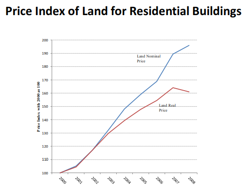

# O Mercado Imobiliário e a Economia {#economia}

\begin{epigrafe}
	\vspace*{\fill}
	\begin{flushright}
    \textit{``a economia é uma ciência histórica por excelência -\\
    qualidade que partilha com outras ciências sociais.\\
    Quer isso dizer que está submetida a um duplo processo\\
    evolutivo: o fenomenal (como representação, como ideia \\
    da coisa, como `coisa para nós', no sentido kantiano)\\
    e o numenal (como objeto, coisa representada, `coisa em si')\\
    \ldots e não pode ser estudada senão nesse duplo contexto.''\\
    (Rangel, 1956, p. 204)}
	\end{flushright}
\end{epigrafe}

## Os vários significados do termo \emph{economia}

A economia é uma ciência social. Apesar do desenvolvimento recente das ciências
econômicas ter levado muitos dos economistas da atualidade, em sua prática, a se
assemelharem muito mais aos profissionais das ciências exatas, como um cientista
de dados, um estatístico, a Economia como ciência continua, a luz dos últimos
fatos da história recente, uma ciência histórica por excelência, como dizia
Rangel. O 'fim da história' [@fukuyama], *i.e.* a ingênua tese de Francis
Fukuyama sobre a naturalização do capitalismo neoliberal, sobre a forma racional
de vida finalmente encontrada [@zizek2011, 401], indiscutivelmente não se
concretizou de fato: o próprio Fukuyama hoje admite este fato 
[@menand_francis_nodate].

Para @rangel1956, "ciência é classificação e medida - não apenas medida, como 
pode se depreender do lema econométrico. Se ciência fosse medida não haveria 
ciência em Aristóteles ou Hegel" [@rangel1956, 204].

Desta maneira, pode-se traçar um paralelo das noções sobre o termo "economia", 
com as noções sobre outros termos, como religião e ideologia, como neste 
parágrafo de Zizek, onde o autor trata do conceito de "ideologia", a partir das
noções de Marx sobre "religião":

\begin{citacao}
A propósito da religião (que, para Marx, era a ideologia por excelência), Hegel
distinguiu três momentos: \emph{doutrina, crença e ritual}; assim, fica-se
tentado a distribuir em torno desses três eixos a multiplicidade de ideias
associadas com o termo `ideologia': a ideologia como um complexo de ideias
(teorias, convicções, crenças, métodos de argumentação); a ideologia em seu
aspecto externo, ou seja, a materialidade da ideologia, os Aparelhos Ideológicos
de Estado; e por fim, o campo mais fugidio, a ideologia `espontânea' que atua
no cerne da própria `realidade' social.
\cite[p.~15]{zizek}
\end{citacao}

Da mesma forma, para Singer [-@singer, 7], é possível distinguir pelo menos três
significados do termo *economia*:

* a qualidade de ser estrito ou austero no uso de recursos ou valores;
* a característica comum de uma ampla gama de atividades que compõe a *economia*
de um país, de uma cidade, etc.
* a ciência que tem por objeto a atividade que dá o segundo significado.

A economia (ciência, "coisa para nós"), então, é a sistematização do
conhecimento sobre a economia (atividade, "coisa em si"). Assim, em suma, quando 
a "coisa em si" muda, também deve mudar a "coisa para nós", ou seja, o resultado
contingente do processo histórico inacabado continua a mudar as ciências 
econômicas hoje, tal qual ocorreu em diversos outros momentos, como ensina 
Rangel, a respeito das várias fases do desenvolvimento da ciência Econômica, 
ocorridas de acordo com as mudanças estruturais ou materiais (mudança da 
"coisa em si"):

\begin{citacao}
Quando a oferta de mão de obra, por efeito do próprio desenvolvimento do 
capitalismo, se tornou relativamente inelástica, a análise clássica pereceu, 
porque ela supunha uma oferta perfeitamente elástica desse fator. A morte da 
coisa em si acarretou a morte da coisa para nós.
Quando se tornou patente que o fluxo de pagamento aos fatores não estava gerando
mais uma procura efetiva da mesma magnitude que a oferta efetiva que o emprego
destes fatores possibilitava, e que as discrepâncias não eram transitórias,
capazes de corrigir-se progressivamente pelo processo da crise, foi preciso 
abandonar outro suposto dos clássicos, que havia passado aos neoclássicos, 
implicitamente, sob a forma da `lei dos mercados'. A problemática econômica
mudara inteiramente e, para resolver os novos problemas, tivemos a teoria
keynesiana.
Simultaneamente, quando, graças a certas mudanças institucionais trazidas pela
Revolução Russa, criaram-se condições concretas que permitem tornar a procura
efetiva cada vez mais independente do preço dos fatores, o planejamento 
econômico tornou-se possível e tivemos as teorias que correspondem à nova
problemática. O economista deixara de ser um `meteorologista' da conjuntura
para fazer-se fautor da sua própria conjuntura.
\cite[p.~206]{rangel1956}
\end{citacao}

Nos próximos itens será visto como as diferentes escolas de pensamento, a saber,
as escolas *marxista* e *marginalista*, abordam os diferentes conceitos do termo
"economia".

### A economia como atividade

A ciência se divide a respeito da definição de economia como atividade, entre 
social (escola *marxista*) e individual (escola *marginalista*) [@singer, 9].

Enquanto para os *marxistas* a atividade econômica é sempre coletiva, praticada
mediante a divisão social do trabalho, para os *marginalistas* a atividade
econômica é em sua essência individual, que atuam autonomamente, tendo em vista
apenas seus desejos ou suas necessidades [@singer, 10].

### A economia como ciência

Também diferem os *marxistas* e os *marginalistas* quanto a definição de 
economia como ciência.

Enquanto para os *marxistas* a economia política é a ciência do social,
abrangendo em seu campo de estudo o conjunto de atividades que formam a vida
econômica da sociedade [@singer, 14], para os *marginalistas* a
ciência econômica tem como modelo as ciências da natureza, onde cada uma das
quais tem como objeto próprio um determinado "setor" do universo físico.
Analogamente, as ciências do homem teriam como objeto um "setor" do universo
humano [@singer, 15].

### A Economia como Ciência Social

Como Ciência Social, a Economia pode ser definida como a ciência:

\begin{citacao}
que estuda como as pessoas e a sociedade decidem empregar recursos escassos, que
poderiam ter utilização alternativa, na produção de bens e serviços de modo a
distribuí-los  entre as várias pessoas e grupos da sociedade, a fim de
satisfazer as necessidades humanas
\cite[p.~5]{passosnogami}.
\end{citacao}

Para Rosseti [-@rossetti, 31], no entanto, a Economia não é uma ciência com
limites nitidamente definidos, assim como as demais ciências sociais:

\begin{citacao}
À semelhança do que ocorre com os demais ramos das ciências sociais, não se pode
considerar a economia como fechada em torno de si mesma. Pelas implicações da
ação econômica sobre outros aspectos da vida humana, o estudo da economia
implica a abertura de suas fronteiras às demais áreas das ciências humanas. Esta
abertura se dá em dupla direção, assumindo assim caráter \textbf{biunívoco}.
\end{citacao}

Segundo Rosseti [-@rossetti, 32], a separação das ciências sociais em
especialidades distintas é não-rigorosa, ou, ao contrário, estas especialidades
estão entremeadas:

\begin{citacao}
Em síntese, pode-se inferir que as interfaces da economia com outros ramos do
conhecimento social decorrem de que as relações humanas e os problemas nelas
implícitos ou delas decorrentes não são facilmente separáveis segundo níveis de
referência rigorosamente pré-classificados. O referencial econômico deve ser
visto apenas como uma abstração útil, para que se analisem aspectos específicos
da luta humana pela sobrevivência, prosperidade, bem-estar individual e
bem-comum. Ocorre, todavia, que essa mesma luta não se esgota nos limites do que
se convencionou chamar de relações econômicas. Vai muito além, abrangendo
aspectos que dizem respeito à postura ético-religiosa, às formas de organização
política, aos modos de relacionamento social, à estruturação da ordem jurídica,
aos padrões das conquistas tecnológicas, às limitações impostas pelas condições
do meio ambiente e, mais abrangentemente, à formação cultural da sociedade.
\end{citacao}

Conforme visto no capítulo anterior, a análise de Rangel a respeito da questão
agrária não mais pode ser considerada atual, porém esta análise está longe de
poder ser considerada errada. Como ciência histórica, a Economia está sujeita a
este tipo de caducidade de teorias que, antes de mudanças drásticas ou mesmo de
uma lenta evolução natural da 'Economia em si', eram válidas.

Não teria sido a vez, então, da própria análise de Rangel à respeito do
aprofundamento da crise agrária (que como vimos reflete nas cidades) "morrer"
com a estabilidade da moeda alcançada pela economia brasileira desde meados da
década de 90 do século passado, ou ao menos mais recentemente, nos últimos anos,
quando a inflação brasileira parece ancorada, a despeito da prática de taxas de 
juros internas (e externas) muito próximas de zero?

Na atualidade, a economia brasileira pode estar no caminho de experimentar um
fenômeno novo: a armadilha da liquidez [ver @krugman-emergentes], problema que
aflige os países de economia desenvolvida já há alguns anos, é uma espécie de
'incapacidade' da economia gerar inflação suficiente para que a taxa de juros
básica real da economia chegue a patamares baixos o suficientes para que iguale
a eficácia marginal média do sistema. Em outras palavras, a inflação deixa de
ser um fator corretivo da conjuntura, passando a ser insuficiente para tal. No
entanto, a análise de Rangel não deixa de ser útil, na medida em que explica
como chegamos a situação presente. Como explicar este déficit habitacional
crônico senão através da crise agrária? Como explicar o aumento do preço da
terra em períodos de baixa conjuntura, que agravava a situação agrária, levando
milhares de pessoas a se aglomerarem em situação precária nas cidades
brasileiras? Por que não houve a esperada queda do preço da terra, como
esperado? Que tipo de soluções podem ser aplicadas ao caso brasileiro?

Estes questionamentos, porém, não podem ser respondidos antes de uma análise do
atual comportamento do \gls{MI} no Brasil. É o que se pretende fazer neste 
capítulo. No entanto, se uma análise estatística direta do comportamento do 
\gls{MI} no Brasil dificilmente poderá ser feita, pela ausência de séries 
históricas de preços de imóveis, uma análise econômica conceitual, aos moldes da
análise de Rangel, pode ter espaço. Estudos futuros tratarão da validade desta 
análise conceitual, através da análise dos dados, que porventura estarão 
disponíveis.

## O Mercado Imobiliário

Segundo @shelter [p. 188-189], o funcionamento do \gls{MI} residencial pode
ser compreendido de acordo com o diagrama da Figura \@ref(fig:MIResidencial):
existe um mercado de residências que pode ser considerado competitivo. No
processo de produção, contudo, a presença de poucos incorporadores e 
proprietários pode lhes dar um grande poder de mercado, sobretudo se eles também
controlarem o mercado de outros insumos, porém isto não é comum. No Mercado de 
Insumos, a propriedade pode ser tão concentrada que os proprietários podem ter 
poder de fixar os preços, grandes economias de escala podem tornar a produção de 
alguns insumos um monopólio natural e a regulação governamental pode restringir 
a alocação competitiva de recursos, especialmente os financeiros.

```{r MIResidencial, fig.cap = "Diagrama esquemático do funcionamento do \\gls{MI} residencial."}
grViz("
digraph nicegraph {
  
  // title
  label     = 'O Mercado Imobiliário Residencial'
  labelloc  =  top // t: Place the graph's title on top.
  fontsize  = 30 // Make title stand out by giving a large font size
  fontcolor = blue
  # graph, node, and edge definitions
  graph [compound = true, nodesep = .5, ranksep = .25,
         color = crimson, rankdir = 'TD']

  node [fontname = Helvetica, fontcolor = darkslategray,
        shape = rectangle, fixedsize = true, width = 2.5,
        color = darkslategray]

  edge [color = none, arrowhead = none, arrowtail = none]

  # subgraph for R information
  subgraph cluster0 {
    label = 'Mercado de Insumos';
    labelloc  =  top // t: Place the graph's title on top.
    fontsize  = 15 // Make title stand out by giving a large font size
    fontcolor = red
    rank = 'same'
    node [color=none weight=1000]
    'Terra' -> 'Materiais' -> 'Infraestrutura' -> 'Financiamento' -> 'Trabalhadores'
  }

  # subgraph for RStudio information
  subgraph cluster1 {
    label = 'Processo de Produção';
    labelloc  =  top // t: Place the graph's title on top.
    fontsize  = 15 // Make title stand out by giving a large font size
    fontcolor = red
    node [color=none weight=1000]
    'Construtores' -> 'Incorporadores' -> 'Proprietários'
  }
  
  # subgraph for RStudio information
  subgraph cluster2 {
    label = 'Mercado de Residências';
    labelloc  =  top // t: Place the graph's title on top.
    fontsize  = 15 // Make title stand out by giving a large font size
    fontcolor = red
    node [color=none weight=1000]
    'Compradores' -> 'Investidores' -> 'Locadores' -> 'Serviços Residenciais'
  }
  // Edges that directly connect one cluster to another
  //'Terra' -> 'Construtores' [ltail=cluster0 lhead=cluster1, label = 'Preços'];
  //'Materiais' -> 'Incorporadores' [ltail=cluster0 lhead=cluster1, label = 'Preços'];
  //'Trabalhadores' -> 'Proprietários' [ltail=cluster0 lhead=cluster1, label = 'Preços'];
  //'Construtores' -> 'Compradores' [ltail=cluster1 lhead=cluster2, label = 'Preços'];
  //'Proprietários' -> 'Serviços Residenciais' [ltail=cluster1 lhead=cluster2, label = 'Preços'];
}
")
```
\bcenter
Fonte: Adaptado de @shelter [p. 189]
\ecenter


Para @shelter [p. 189], então, o problema dos \gls{MI} residenciais usualmente 
se concentram no mercado de insumos, onde as intervenções governamentais 
deveriam se concentrar. Contudo, nem sempre é isto que ocorre: muitos governos
decidem intervir diretamente no processo de produção ou no controle de preços ao
consumidor final, como o controle de aluguéis, no entanto isto apenas distorce 
os sinais enviados ao mercado e podem exacerbar o problema original.


## O Mercado Imobiliário e a Macroeconomia {#macro}

Segundo @LEUNG, há um reconhecimento relativamente recente e crescente
sobre a importância da interação entre os diversos mercados imobiliários entre
si e entre o mercado imobiliário como um todo e a macroeconomia.

Pesquisas em economia habitacional convencional e em economia urbana
praticamente ignoram as interações com a macroeconomia. Na melhor das hipóteses,
algumas análises teóricas e empíricas da economia urbana e habitacional incluem
variáveis macroeconômicas (como inflação, crescimento econômico, PIB, taxa de
desemprego etc.) como 'variáveis de controle' exógenas [@LEUNG, 3].

Por sua vez,  os livros de Economia tradicionais ou tratam o mercado imobiliário
como apenas um dos muitos mercados de bens de consumo ou o negligenciam como um
todo. A Macroeconomia convencional ignora completamente o mercado imobiliário
[@LEUNG, 3], embora o mercado habitacional constitua uma grande parte da
Macroeconomia [@LEUNG, 5]. @krugman afirmou que um dos segredos da
política monetária reside no fato que a política monetária funciona através do
mercado imobiliário, tendo pouco impacto direto no investimento em negócios.

Segundo Greenwood e Hercowitz [*apud* @LEUNG, 5], o estoque de capital
imobiliário é maior do que o capital de negócios e, em geral, o valor de mercado
investido anualmente no mercado habitacional é maior do que o investimento em
negócios, o que claramente faz do segmento habitacional muito mais do que apenas
um outro mercado de bens de consumo.

Davis e Heathcote (2001) [*apud* @LEUNG, 6] afirmam que o valor de mercado das
propriedades imobiliárias em estoque nos EUA é aproximadamente igual ao PIB
médio anual. Segundo a revista britânica The Economist [@economist], a maior
classe de ativos no mundo é a propriedade residencial, com valor estimado de 200
trilhões de dólares, o que equivale a 3 vezes mais o valor de todas as ações
negociadas em bolsa.

No Brasil, segundo @fnogueira [-@fnogueira, 155], a participação dos ativos de 
base imobiliária era cerca de 40% dos bens e direitos declarados na Declaração
do Imposto de Renda da Pessoa Física. Deve-se levar em conta, no entanto, que
os valores declarados são os valores do momento da aquisição dos imóveis, que
não são atualizados para fins de declaração de imposto de renda, portanto estes
são usualmente menores do que os valores de mercado.

Segundo @LEUNG [p. 4], no entanto, mais recentemente tem havido um pequeno porém 
crescente esforço de pesquisa para preencher a lacuna entre as duas literaturas 
e lançar luz sobre questões que são conjuntamente conseqüentes para a 
macroeconomia e a habitação.

O mercado imobiliário, diferentemente de outros mercados de capitais, exibe uma
flutuação de valores baixa e não muda imediatamente após a mudança do noticiário
econômico [@ADAMS2010, 3]. O mercado imobiliário residencial, em particular,
mostra forte rigidez pra baixo, porque os donos de imóveis residenciais tendem a
resistir a venda da propriedade sob períodos de recessão econômica [@Case2000,
129].

### Variáveis macroeconômicas e variáveis do mercado imobiliário

Leung e Ng [-@macroHousing] classificaram as variáveis importantes para a
aferição do comportamento do \gls{MI} e sua correlação com a Macroeconomia em
variáveis macroeconômicas -- \gls{MV}) -- e variáveis do mercado residencial -- 
\gls{HMV}). Entre as \gls{MV} estão o \gls{PIB}, a taxa de desemprego, taxa de 
inflação e entre as \gls{HMV} encontram-se não apenas os índices de preços, mas 
também variáveis como o número de novas residências vendidas, a taxa de vacância 
e o investimento residencial.

A Figura \@ref(fig:vacancyRate) mostra a taxa de vacância de imóveis próprios (A)
e de aluguel (B) para os EUA.

```{r}
RHVRUSQ156N <- fredr(series_id = "RHVRUSQ156N", 
               observation_start = as.Date("1956-01-01")) # Homeowner vacancy rate
USHOWN <- fredr(series_id = "USHOWN", 
               observation_start = as.Date("1984-01-01")) # Homeownership rate
RRVRUSQ156N <- fredr(series_id = "RRVRUSQ156N", 
               observation_start = as.Date("1956-01-01")) # Rental vacancy rate
RHVRUSQ156N$date <- seq(ISOdate(1956,1,1), ISOdate(2020,4,1), by = "quarters")
RRVRUSQ156N$date <- seq(ISOdate(1956,1,1), ISOdate(2020,4,1), by = "quarters")
```

```{r recessionsDF3}
recessions.df <- read.csv("data/us_recessions.csv")
recessions.df <- within(recessions.df, {
  Peak <- as.POSIXct(Peak)
  Trough <- as.POSIXct(Trough)
  })
```

```{r format-quarters}
format_quarters <- function(x) {
  format(as.yearqtr(x), format = "%qT%Y")
}
```


```{r vacancyRate, fig.cap="Home Price Index, de Case e Shiller, em termos reais.", out.width="100%"}
recessions.trim = subset(recessions.df, Peak >= "1956-01-01" )
recessions.trim$Peak <- as.POSIXct(recessions.trim$Peak)
recessions.trim$Trough <- as.POSIXct(recessions.trim$Trough)
p1 <- ggplot(RHVRUSQ156N, aes(x = date, y = value)) +
  geom_line() +
   labs(
     title = "Imóveis próprios", 
     subtitle = "Não ajustada sazonalmente | Frequência: trimestral", 
     caption = "1951-2020",
     x = "Data", 
     y = "%") +
  stat_peaks(colour = "red", span = 25) +
  # stat_peaks(geom = "text", colour = "red", 
  #            vjust = -0.5, x.label.fmt = "%m/%y", span = 25) +
  stat_valleys(colour = "blue", span = 25) +
  # stat_valleys(geom = "text", colour = "blue", 
  #            vjust = 1.5, x.label.fmt = "%b/%Y", span = 25) +   
  scale_x_datetime(expand = expansion(mult = c(0, .05)),
                   date_breaks = "60 months",
                   date_minor_breaks = "12 months",
                   labels = format_quarters) +
  theme(panel.grid.major = element_line(colour="gray", size=0.5),
        panel.grid.minor.x = element_line(colour="gray", size=0.1),
        axis.text.x=element_text(angle=-45, hjust=0.001)) +
  geom_rect(data=recessions.trim, aes(xmin=Peak, xmax=Trough,
                                    ymin=-Inf, ymax=+Inf),
          inherit.aes=F,
          fill='grey', alpha=0.5)
p2 <- ggplot(RRVRUSQ156N, aes(x = date, y = value)) +
  geom_line() +
   labs(
     title = "Imóveis de aluguel", 
     subtitle = "Não ajustada sazonalmente | Frequência: trimestral", 
     caption = "1951-2020",
     x = "Data", 
     y = "%") +
  stat_peaks(colour = "red", span = 61) +
  # stat_peaks(geom = "text", colour = "red", 
  #            vjust = -0.5, x.label.fmt = "%m/%y", span = 61) +
  stat_valleys(colour = "blue", span = 61) +
  # stat_valleys(geom = "text", colour = "blue", 
  #            vjust = 1.5, x.label.fmt = "%b/%Y", span = 61) +
  scale_x_datetime(expand = expansion(mult = c(0, .05)),
                   date_breaks = "60 months",
                   date_minor_breaks = "12 months",
                   labels = format_quarters) +
  theme(panel.grid.major = element_line(colour="gray", size=0.5),
        panel.grid.minor.x = element_line(colour="gray", size=0.1),
        axis.text.x=element_text(angle=-45, hjust=0.001)) +
  geom_rect(data=recessions.trim, aes(xmin=Peak, xmax=Trough,
                                    ymin=-Inf, ymax=+Inf),
          inherit.aes=F,
          fill='grey', alpha=0.5)
plot_row <- plot_grid(p1, p2)
title <- ggdraw() +
  draw_label(
    "Taxa de Vacância (EUA)",
    fontface = 'bold',
    x = 0,
    hjust = 0
  ) +
  theme(
    # add margin on the left of the drawing canvas,
    # so title is aligned with left edge of first plot
    plot.margin = margin(0, 0, 0, 0)
  )
plot_grid(title, plot_row, ncol = 1,
          # rel_heights values control vertical title margins
          rel_heights = c(0.1, 1))
```

### Correlação entre os mercados imobiliários

Em geral, é costume entre os economistas dizer que os mercados imobiliários são
mercados locais, isto é, devido a heterogeneidade dos bens imóveis e,
principalmente, devido à localização espacial, que faz com que cada imóvel seja
único, ou seja, bens imóveis em diferentes mercados não podem ser
considerados bens substitutos.

O comportamento destes mercados, no entanto, não está imune ao que ocorre em
outros locais diferentes do mercado estudado. De fato, estudos mostram que os
\gls{MI} de diferentes países estão altamente correlacionados, dependendo do
grau de abertura econômica de cada país [@Case2000; @ADAMS2010].

A disponibilidade de dados é usualmente um problema na análise dos \gls{MI}. No
entanto, dada a alta correlação demonstrada entre os diversos mercados, 
@ADAMS2010 lograram elaborar um modelo de dados em painéis cointegrados 
para diversos mercados, o que mostra a importância do estudo do comportamento do
\gls{MI} de outros países, especialmente na falta de dados disponíveis, como é
o caso do Brasil.

A figura \@ref(fig:adams2) mostra que a alta de preços de imóveis nos países
estudados por @ADAMS2010 são semelhantes e diferem mais pela questão de uma
assincronia, do que pela tendência, *i. e.* a tendência em geral é a mesma para
todos os países, porém há um *lag* entre o início de uma tendência nos diversos
mercados, devido a diferenças nos mecanismos de propagação das variáveis 
macroeconômicas em cada país.

```{r adams2, out.width="\\textwidth", fig.cap = "Interconexão dos preços dos imóveis em diversos países."}
knitr::include_graphics("./images/adams2_crop.pdf")
```
\bcenter
Fonte: @ADAMS2010.
\ecenter

A figura \@ref(fig:nhpi) ilustra o comportamento do \gls{MI} residencial
norte-americano desde 1990. 

```{r}
# nhpi <- Quandl("YALE/NHPI", type="ts", start_date="1990-01-01")
# rhpi <- Quandl("YALE/RHPI", type="ts")
# saveRDS(nhpi, file = "data/nhpi")
# saveRDS(rhpi, file = "data/rhpi")
```

```{r}
# fredr(
#   series_id = "USREC",
#   observation_start = as.Date("1857-01-01")
# )
nhpi <- readRDS("data/nhpi")
rhpi <- readRDS("data/rhpi")
global_rhpi <- read.csv("data/GlobalHousePriceIndex.csv")
#global_rhpi <- read.zoo(global_rhpi, index = "dateq", FUN = as.yearqtr, format = "%Yq%q")
#global_rhpi$dateq <- as.yearqtr(seq(ISOdate(2000,3,1), ISOdate(2019,3,1), by = "quarters"))
global_rhpi$dateq <- seq(ISOdate(2000,1,1), ISOdate(2019,1,1), by = "quarters")
```


```{r nhpi, fig.cap="Home Price Index (HPI), de Case e Shiller, em termos nominais."}
recessions.trim = subset(recessions.df, Peak >= "1990-01-01")
ggplot(nhpi, as.numeric = FALSE) +
  geom_line() +
   labs(
     title = "Índice de Case-Shiller (EUA) HPI Nacional Nominal", 
     subtitle = "Não ajustado sazonalmente | Frequência: Mensal", 
     caption = "1990-2019",
     x = "Ano", 
     y = "Índice Jan 2000 = 100") +
   scale_y_continuous(expand=c(0,0),
                      breaks = c(seq(50, 200, 50)),
                      minor_breaks = seq(80, 200, 10)) +
  stat_peaks(colour = "red", span = 61) +
  stat_peaks(geom = "text", colour = "red", 
             vjust = -0.5, x.label.fmt = "%b/%Y", span = 61) +
  stat_valleys(colour = "blue", span = 61) +
  stat_valleys(geom = "text", colour = "blue", 
             vjust = 1.5, x.label.fmt = "%b/%Y", span = 61) +
  geom_rect(data=recessions.trim, aes(xmin=Peak, xmax=Trough, 
                                    ymin=-Inf, ymax=+Inf),
          inherit.aes=F,
          fill='grey', alpha=0.5)
```
\bcenter
Fonte: O autor, à partir de dados de @QuandlWIKI.
\ecenter

Nota-se que após o derretimento do \gls{MI} norte-americano depois da crise
imobiliário-financeira de 2007-2008, este mercado voltou a se aquecer fortemente
desde Janeiro de 2012, tendo o nível de preços já ultrapassado o último pico,
atingido em julho de 2006.

@regulation também notaram um aumento generalizado nos preços dos imóveis em
diversos países, especialmente após a segunda metade da década de 90, com 
exceção do Japão e da Alemanha, conforme pode ser visto na Figura 
\@ref(fig:several-indices).

```{r several-indices, fig.cap="Evolução dos índices de preços de imóveis em diversos países."}
knitr::include_graphics("images/several_indices_regulations.png")
```

\bcenter
Fonte: @regulation [p. 3]
\ecenter

A comparação de índices de preços dos diversos países, no entanto, deve ser
feita com cautela, haja vista que os países compõem os seus índices de maneira
diferente, além das estruturas de oferta e demanda destes países serem 
diferentes [ver @regulation, p. 4; @silver].

Segundo @regulation [p. 4-5], o aumento do preço dos imóveis está fortemente 
ligado ao aumento do preço da terra, ou seja, os custos de construção tem um
papel secundário no aumento do preço dos imóveis. Segundo Davis e Palumbo 
[*apud* @regulation, p. 4], é o preço da terra que governa o aumento dos preços 
dos imóveis nos EUA, o que se confirma também na China, como pode ser visto na 
Figura \@ref(fig:land).

```{r land, fig.cap="Aumento nominal e real do valor da terra na China."}

```

\bcenter
Fonte: @regulation [p. 5]
\ecenter

A alta volatilidade do \gls{MI} tal como apresentada nos últimos anos, como será
visto, não é comum. Neste capítulo serão analisados os motivos que levaram o
\gls{MI} norte-americano e mundial a este aumento de volatilidade e os efeitos
desta grande volatilidade, não apenas no \gls{MI}, mas na Economia como um todo.

### Modelos macroeconômicos para o \gls{MI}

@ADAMS2010 mostraram, com a observação de dados em painéis de 15 países por um 
período de 30 anos, que variáveis macroeconômicas apresentam um significativo
impacto no preço de imóveis residenciais em longo prazo. @fan também chegou a
essa conclusão para mercados de imóveis em 5 diferentes regiões da China.

Segundo @ADAMS2010 [p. 18], particularmente variáveis como emprego, produção
industrial e aumento da base monetária demonstraram-se propensas a aumentar a
demanda por imóveis residenciais, aumentando assim os seus preços. Além disto,
um aumento na taxa de juros de curto prazo também afeta positivamente o preço
dos imóveis residenciais, pelo efeito do aumento dos custos de financiamento e
pelo desaquecimento do setor de construção, o que ocasiona também um aumento no
preço dos aluguéis, que também puxa para cima o preço dos imóveis.

Por outro lado, um aumento nas taxas de juros de longo prazo leva a diminuição
da demanda por imóveis residenciais. Por causa da maior atratividade nos 
investimentos de renda fixa oriundos do aumento das taxas de longo prazo, 
reduz-se a demanda por (investimento em) imóveis residenciais, o que
por conseguinte reduz os seus preços [@ADAMS2010, 19].

@ADAMS2010 notaram também que, devido a diferenças no nível regulatório e nas
características do mercado hipotecário, houve um alto grau de variação entre os
países, embora os resultados sejam muito similares mesmo com a variação dos
métodos de estimação.

#### Modelo de oferta e demanda

O equilíbrio no mercado de bens imobiliários se dá através da equalização das
equações de oferta e demanda por bens imóveis.

Segundo @ADAMS2010, a demanda do mercado de bens imóveis pode ser modelada de
acordo com a equação \@ref(eq:demanda-bens).

\begin{equation}
\gls{D}_t = \alpha - \beta_1 \gls{hp}_t + \beta_2 \gls{EA}_t - 
\beta_3 \gls{long}_t - \beta_4 \gls{short}_t + \hat \epsilon_t
(\#eq:demanda-bens)
\end{equation}

Na equação \@ref(eq:demanda-bens), presume-se que a demanda por bens imóveis
seja afetada negativamente pelos preços dos imóves ($hp_t$), pela taxa de juros
de longo prazo ($long_t$) e pela taxa de juros de curto prazo ($short_t$) e
positivamente pelo nível da atividade econômica ($EA_t$).

De acordo com @ADAMS2010 [p. 7-8], uma taxa de juros de longo prazo mais alta
tende a desviar a demanda por investimento em imóveis para títulos da dívida
público, de menor risco, ou seja, um aumento da taxa de juros de longo prazo
tende a diminuir a atratividade pelo investimento em imóveis. Já a taxa de juros
de curto prazo, segundo @ADAMS2010 [p. 7], deve diminuir a demanda por moradia 
por causa do aumento que acarreta nas taxas das hipotecas.

A oferta do mercado de bens, por sua vez, pode ser modelada de acordo com a 
equação \@ref(eq:oferta-bens).

Na equação \@ref(eq:oferta-bens), presume-se que a oferta de bens imóveis seja
positivamente afetada pelos preços dos imóveis ($hp_t$) e negativamente pela
taxa de juros de curto prazo ($short_t$) e pelos custos de construção
($constr_t$).

\begin{equation}
\gls{S}_t = \eta + \gamma_1 \gls{hp}_t - \gamma_2 \gls{short}_t - 
\gamma_3 \gls{constr}_t + \hat \nu_t
(\#eq:oferta-bens)
\end{equation}

Para @ADAMS2010 [p. 7-8], um aumento da taxa de juros de curto prazo tende a 
aumentar os custos de financiamento para construção de moradias, o que impacta
negativamente a oferta.

O equilíbrio do mercado se dá no ponto de encontro entre as equações de oferta e
procura, ou seja, o equilíbrio é atingido quando o preço dos imóveis é:

\begin{equation}
\gls{hp}_{it} = \alpha^*_i - \beta_{2i}^* \gls{EA}_{it} + 
\gamma^*_{2i} \gls{short}_{it} + \gamma^*_{3i} \gls{constr}_{it} - 
\beta^*_{3i} \gls{long}_{it} + \hat \epsilon^*_{it}
(\#eq:equilibrio-bens)
\end{equation}

onde $\alpha^*_i = \dfrac{\alpha_i - \eta_i}{\gamma_{1i} - \beta_{1i}}$, 
$\gamma^*_{2i} = \dfrac{\gamma_{2i} - \beta_{4i}}{\gamma_{1i} - \beta_{1i}}$, 
$\gamma^*_{3i} = \dfrac{\gamma_{3i}}{\gamma_{1i}-\beta_{1i}}$, 
$\epsilon^*_{it} = \hat \epsilon_{it} - \hat \eta_{it}$ e   
$\beta^*_{ji} = \dfrac{\beta_{ji}}{\gamma_{1i} - \beta_{1i}} \quad para \quad j = 2, 3$

@ADAMS2010 salienta que, pela análise das equações acima, o efeito total da taxa
de juros de curto prazo é ambíguo, dependendo da força relativa dos coeficientes
$\gamma_2$ e $\beta_4$. Para o mundo desenvolvido, segundo @ADAMS2010 [p. 15], 
a magnitude do coeficiente $\gamma_2$ é maior do que a do coeficiente $\beta_4$,
ou seja, o aumento de custo impacta mais a oferta do que o aumento das hipotecas
afeta a demanda, exceção apenas para EUA e Itália, onde as taxas hipotecárias
preferidas são as ajustáveis.

A figura \@ref(fig:adams) mostra como, teoricamente, as variações nas variáveis 
macroeconômicas impactam na formação de preços do mercado imobiliário. Por 
exemplo, no painel central é ilustrado como se propaga para o mercado 
imobiliário um aumento na taxa de juros de longo prazo: um aumento nos juros de
longo prazo diminui os preços dos imóveis, que por sua vez diminuem o apetite 
dos investidores por imóveis, fazendo diminuir o ritmo das construções, o que 
por sua vez tende a diminuir o estoque de imóveis (baixa entrada de imóveis
novos no mercado), o que por sua vez tende a aumentar o valor dos aluguéis.

```{r adams, out.width="\\textwidth", fig.cap = "O impacto das variáveis macroeconômicas no preço dos imóveis residenciais."}
knitr::include_graphics("./images/adams_crop.pdf")
```
\bcenter
Fonte: @ADAMS2010.
\ecenter

#### Possíveis adequações necessárias ao modelo no Brasil

É importante notar que na equação \@ref(eq:demanda-bens) as taxa de juros de 
curto e longo prazo afetam negativamente a demanda por bens imóveis, exatamente 
como previsto por @rangel1986b e confirmado pelo IPEA. 

No entanto, segundo @rangel1986b, no Brasil a atividade econômica tinha efeito
inverso, ou seja, em períodos de fraca conjuntura a demanda por bens imóveis
tendia a aumentar e a diminuir em períodos de aquecimento da atividade
econômica. Entende-se que este comportamente devia estar relacionado ao
comportamento da inflação brasileira, que tinha o efeito de penalizar a
liquidez, incentivando as imobilizações de capital. Com a estabilidade de moeda, 
esta aberração da economia brasileira provavelmente desapareceu ou se reduziu
a um papel secundário, ou seja, atualmente é esperado que o aquecimento da 
atividade da Economia brasileira venha acompanhado de aumento dos preços dos 
imóveis e _vice-versa_.

O que provavelmente deve impactar a forma dos modelos no Brasil é a estrutura a
termo da taxa de juros. Ao contrário do mundo desenvolvido, no Brasil a
estrutura a termo da taxa de juros é invertida, pois há concentração da dívida
pública no curto prazo. Outra hipótese a ser verificada é quanto ao impacto das
taxas de juros de curto prazo nos juros hipotecários, o que parece não ocorrer
no Brasil.

### Desvios em relação aos fundamentos econômicos - choques de demanda

O mercado imobiliário, assim como acontece com  o mercado mobiliário, deve
seguir os fundamentos da Economia no longo prazo. No entanto, eventuais
descolamentos dos preços no mercado imobiliário dos fundamentos econômicos podem
ocorrer, especialmente pela inelasticidade de oferta no \gls{MI} e pela inércia
nos preços.

Segundo @regulation [p. 4], um ciclo de preços no mercado imobiliário pode durar
décadas. Existe, dessa forma uma propensão à formação de bolhas especulativas,
atribuídas a diversos motivos, como "expectativas exuberantes" e problemas de
informações de preços, que são difíceis devido às particularidades do \gls{MI} 
[@ADAMS2010, 3].

Devido a estes fatos, são importantes os modelos dinâmicos, conforme demonstrado
por @fan. 

De acordo com @regulation [p. 11], os padrões de *boom* e *boost* no \gls{MI},
ou seja, a formação e estouro de bolhas, podem ser explicados por modelos
dinâmicos e tem maior relação com problemas na inelasticidade da oferta de
alguns mercados do que propriamente com a ação de especuladores, que são quase
sempre eleitos os culpados no noticiário econômico.

No entanto, para @regulation [p. 1], a oferta inelástica em alguns mercados é
uma condição necessária para a formação de bolhas, porém não suficiente: a
formação de bolhas também está relacionada a choques de demanda.

O detalhamento destes modelos dinâmicos está fora do escopo deste trabalho. É
possível compreender o problema da inelasticidade da oferta no \gls{MI},
contudo, através de simples modelos de oferta e demanda, como pode ser visto nas
Figuras \@ref(fig:choque) A e B: na Figura \@ref(fig:choque) A, um mercado inicialmente com preço de equilíbrio $P_1$, com um aumento na demanda, modelado
com o deslocamento da curva da demanda $D_1$ para a direita (curva $D_2$), leva 
os preços de equilíbrio inicial $P_1$ ao novo preço de equilíbrio $P_2$, um 
pouco maior que $P_1$. Com a mudança subsequente da estrutura da oferta no longo prazo, o preço de equilíbrio retorna ao ponto $P_3$.

Já num mercado com uma oferta mais inelástica, a volatilidade é muito maior, o
que pode ser visto na Figura \@ref(fig:choque) B: o deslocamento da curva da
demanda $D_1$ para a curva $D_2$ provoca um aumento mais lento da oferta, fazendo 
com que o preço inicial de equilíbrio $P_1$ aumente, muito mais pronunciadamente 
do que no caso anterior, para $P_2$, voltando no longo prazo a um preço de 
equilíbrio $P_3$, após a mudança da estrutura da oferta, muito menor do que 
$P_2$, o que configura um padrão de *boom e bust*: no primeiro momento, como a
oferta é inelástica, ocorre um grande aumento dos preços, ou seja, a bolha é
inflada, para num segundo momento estourar, voltando para um preço de equilíbrio
muito menor do que o alcançado durante o *boom*.

```{r choque, fig.cap="Efeitos de um choque de demanda em diferentes mercados.", out.width="100%"}
# curve1 and curve2 should be data.frames with an x and y column
# For instance, as_data_frame(Hmisc::bezier(c(1, 8, 9), c(1, 5, 9)))
#
curve_intersect <- function(curve1, curve2) {
  # Approximate the functional form of both curves
  curve1_f <- approxfun(curve1$x, curve1$y, rule = 2)
  curve2_f <- approxfun(curve2$x, curve2$y, rule = 2)
  
  # Calculate the intersection of curve 1 and curve 2 along the x-axis
  point_x <- uniroot(function(x) curve1_f(x) - curve2_f(x), 
                     c(min(curve1$x), max(curve1$x)))$root
  
  # Find where point_x is in curve 2
  point_y <- curve2_f(point_x)
  
  # All done!
  return(list(x = point_x, y = point_y))
}

supplye1 <- Hmisc::bezier(c(1, 8, 9),
                        c(1, 5, 9)) %>%
  data.frame()

demand1 <- Hmisc::bezier(c(1, 3, 9),
                         c(9, 3, 1)) %>%
  data.frame()

supplye2 <- Hmisc::bezier(c(1, 8, 12),
                         c(3, 3.5, 6)) %>%
  data.frame()

demand2 <- Hmisc::bezier(c(3, 5, 11),
                         c(11, 5, 3)) %>%
  data.frame()

# Calculate the intersections of the two curves
intere1 <- curve_intersect(supplye1, demand1)
intere2 <- curve_intersect(supplye1, demand2)
intere3 <- curve_intersect(supplye2, demand2)

intersections <- bind_rows(intere1, intere2, intere3)

plot_labels <- data_frame(label = c("O[1]", "O[2]", "D[1]", "D[2]"),
                          x = c(8.25, 11.5, 1, 4),
                          y = c(8.5, 6.25, 8, 10))

p1 <- ggplot(mapping = aes(x = x, y = y)) + 
  geom_path(data = supplye1, color = "#0073D9", size = 1, linetype = "dashed") + 
  geom_path(data = supplye2, color = "#0073D9", size = 1) + 
  geom_path(data = demand1, color = "#FF4036", size = 1, linetype = "dashed") + 
  geom_path(data = demand2, color = "#FF4036", size = 1) + 
  geom_segment(data = intersections, 
               aes(x = x, y = 0, xend = x, yend = y), lty = "dotted") +
  geom_segment(data = intersections, 
               aes(x = 0, y = y, xend = x, yend = y), lty = "dotted") + 
  geom_text(data = plot_labels,
            aes(x = x, y = y, label = label), parse = TRUE,
            family = "Source Sans Pro") +
  annotate("segment", x = 1.5, xend = 3.5, y = 8, yend = 9.5,
           arrow = arrow(length = unit(1, "lines")), colour = "grey50") +
  geom_point(data = intersections, size = 3) +
  scale_x_continuous(expand = c(0, 0), breaks = intersections$x,
                     labels = expression(Q[1], Q[2], Q[3])) +
  scale_y_continuous(expand = c(0, 0), breaks = intersections$y,
                     labels = expression(P[1], P[2], P[3])) +
  labs(x = "Quantidade", y = "Preço",
       title = "Oferta Elástica",
       subtitle = "Mercado com oferta elástica") +
  coord_equal() +
  theme_classic(base_family = "Source Sans Pro") + 
  theme(plot.title = element_text(family = "Source Sans Pro Semibold", size = rel(1.3)))

supplyi1 <- Hmisc::bezier(c(1, 5, 8),
                          c(1, 2, 12)) %>%
  data.frame()

supplyi2 <- Hmisc::bezier(c(1, 4.5, 12),
                          c(4.5, 2, 7)) %>%
  data.frame()

# Calculate the intersections of the two curves
interi1 <- curve_intersect(supplyi1, demand1)
interi2 <- curve_intersect(supplyi1, demand2)
interi3 <- curve_intersect(supplyi2, demand2)

intersections <- bind_rows(interi1, interi2, interi3)

plot_labels <- data_frame(label = c("O[1]", "O[2]", "D[1]", "D[2]"),
                          x = c(7, 11.25, 1, 4),
                          y = c(11.5, 7.25, 8, 10))

p2 <- ggplot(mapping = aes(x = x, y = y)) + 
  geom_path(data = supplyi1, color = "#0073D9", size = 1, linetype = "dashed") + 
  geom_path(data = supplyi2, color = "#0073D9", size = 1) + 
  geom_path(data = demand1, color = "#FF4036", size = 1, linetype = "dashed") + 
  geom_path(data = demand2, color = "#FF4036", size = 1) + 
  geom_segment(data = intersections, 
               aes(x = x, y = 0, xend = x, yend = y), lty = "dotted") +
  geom_segment(data = intersections, 
               aes(x = 0, y = y, xend = x, yend = y), lty = "dotted") + 
  geom_text(data = plot_labels,
            aes(x = x, y = y, label = label), parse = TRUE,
            family = "Source Sans Pro") +
  annotate("segment", x = 1.5, xend = 3.5, y = 8, yend = 9.5,
           arrow = arrow(length = unit(1, "lines")), colour = "grey50") +
  geom_point(data = intersections, size = 3) +
  scale_x_continuous(expand = c(0, 0), breaks = intersections$x,
                     labels = expression(Q[1], Q[2], Q[3])) +
  scale_y_continuous(expand = c(0, 0), breaks = intersections$y,
                     labels = expression(P[1], P[2], P[3])) +
  labs(x = "Quantidade", y = "Preço",
       title = "Oferta inelástica",
       subtitle = "Mercado com oferta inelástica") +
  coord_equal() +
  theme_classic(base_family = "Source Sans Pro") + 
  theme(plot.title = element_text(family = "Source Sans Pro Semibold", size = rel(1.3)))

plot_row <- plot_grid(p1, p2, labels = "AUTO")
title <- ggdraw() +
  draw_label(
    "Choques de demanda",
    fontface = 'bold',
    x = 0,
    hjust = 0
  ) +
  theme(
    # add margin on the left of the drawing canvas,
    # so title is aligned with left edge of first plot
    plot.margin = margin(0, 0, 0, 0)
  )
plot_grid(title, plot_row, ncol = 1,
          # rel_heights values control vertical title margins
          rel_heights = c(0.1, 1))
```
\bcenter
Fonte: Adaptado de @regulation [p. 10].
\ecenter

Para @regulation [p. 11], ainda, além do problema da oferta inelástica pode
ocorrer também o problema de uma resposta mal desenhada pelo governo ao aumento
de preços inicial, como ilustrado na Figura \@ref(fig:choque2): algumas medidas
podem funcionar a médio prazo, como as grandes intervenções governamentais que
se destinam a promover uma grande oferta de imóveis de uma só vez (programas do
tipo "1 milhão de casas"), mas seu efeito é equivalente a deslocar a curva de
oferta inicial $O_1$ para $O_2$. Aumentando a oferta temporariamente, evita-se
uma grande alta dos preços, que são estabilizados no preço de equilíbrio $P_3$.
No longo prazo, porém, um posterior novo choque de demanda pode vir a elevar os
preços a níveis muito mais altos ($P_4$), superiores inclusive aos preços
atingidos durante o primeiro choque ($P_2$).

```{r choque2, fig.cap="Efeitos de uma resposta governamental inadequada.", warning=FALSE}
supplyi2 <- Hmisc::bezier(c(4, 8, 11),
                          c(1, 3, 12)) %>%
  data.frame()

demand3 <- Hmisc::bezier(c(5, 7, 13),
                         c(13, 7, 5)) %>%
  data.frame()

# Calculate the intersections of the two curves
interi1 <- curve_intersect(supplyi1, demand1)
interi2 <- curve_intersect(supplyi1, demand2)
interi3 <- curve_intersect(supplyi2, demand2)
interi4 <- curve_intersect(supplyi2, demand3)

intersections <- bind_rows(interi1, interi2, interi3, interi4)

plot_labels <- data_frame(label = c("O[1]", "O[2]", "D[1]", "D[2]", "D[3]"),
                          x = c(8.75, 11.75, 1.5, 4, 6),
                          y = c(11.5, 11.5, 9.5, 11, 12.5))

p3 <- ggplot(mapping = aes(x = x, y = y)) + 
  geom_path(data = supplyi1, color = "#0073D9", size = 1, linetype = "dashed") + 
  geom_path(data = supplyi2, color = "#0073D9", size = 1) + 
  geom_path(data = demand1, color = "#FF4036", size = 1, linetype = "dashed") + 
  geom_path(data = demand2, color = "#FF4036", size = 1) + 
  geom_path(data = demand3, color = "#FF4036", size = 1) + 
  geom_segment(data = intersections, 
               aes(x = x, y = 0, xend = x, yend = y), lty = "dotted") +
  geom_segment(data = intersections, 
               aes(x = 0, y = y, xend = x, yend = y), lty = "dotted") + 
  geom_text(data = plot_labels,
            aes(x = x, y = y, label = label), parse = TRUE,
            family = "Source Sans Pro") +
  annotate("segment", x = 1.5, xend = 3.5, y = 8, yend = 9.5,
           arrow = arrow(length = unit(1, "lines")), colour = "grey50") +
  annotate("segment", x = 3.5, xend = 5.5, y = 9.5, yend = 11,
           arrow = arrow(length = unit(1, "lines")), colour = "grey50") +
  geom_point(data = intersections, size = 3) +
  scale_x_continuous(expand = c(0, 0), breaks = intersections$x,
                     labels = expression(Q[1], Q[2], Q[3], Q[4])) +
  scale_y_continuous(expand = c(0, 0), breaks = intersections$y,
                     labels = expression(P[1], P[2], P[3], P[4])) +
  labs(x = "Quantidade", y = "Preço",
       title = "Choque de demanda",
       subtitle = "Intervenção governamental mal calculada") +
  coord_equal() +
  theme_classic(base_family = "Source Sans Pro") + 
  theme(plot.title = element_text(family = "Source Sans Pro Semibold", size = rel(1.3)))

p3
```
\bcenter
Fonte: @regulation [p. 11]
\ecenter

Segundo @Malpezzi2002TheRO [p. 19], o processo descrito na Figura 
\@ref(fig:choque2) não se trata de mera curiosidade, mas foi documentado em
diversos estudos.

Reformas adequadas na regulação do \gls{MI} serão apresentadas no capítulo \@ref(politicas).

Algumas referências importantes para trabalhos futuros de modelos dinâmicos são:
@wheaton1999, @FAN201937


## O Mercado Imobiliário e o setor bancário {#MI-e-o-setor-bancario}

A participação dos produtos financeiros relacionados ao setor imobiliário
constituem uma grande parte dos portfolios bancários. Justamente por isto,
crises bancárias estão frequentemente associadas a superexposição do setor
bancário no mercado imobiliário [@Case2000, 148]. Segundo Claessens *et al.*
(2010) [*apud* @silver, 3], de 46 crises bancárias sistêmicas para quais há dados
disponíveis, mais de dois terços foram precedidas por padrões de aumento-estouro
de preços de imóveis.

Não apenas pelo estouro de uma bolha especulativa pode haver quedas nos preços
dos bens imóveis, mas também por conta de uma inversão dos fundamentos
econômicos que sustentavam os preços [@Case2000, 129], como aliás parece ser o
caso no momento, devido a um fator exógeno, a saber, a pandemia do corona vírus.

(**AUMENTAR**)

## O Mercado Imobiliário e a Microeconomia {#micro}

O mercado imobiliário, como visto na seção anterior, não pode ser 
considerado um simples mercado de bens, como outros bens de consumo em geral,
como automóveis, móveis ou eletrodomésticos. Sua análise em nível macroeconômico,
portanto, requer um estudo mais aprofundado das variáveis da Economia do país,
o que não quer dizer que não se dispense de analisar também o seu comportamento 
microeconômico, o que aliás a NBR 14.653-01 [-@NBR1465301] parece ter acabado de 
perceber e recomendar.

### Estruturas básicas de mercado

De acordo com a NBR 14.653-01 [-@NBR1465301, ix]:

> As estruturas básicas do mercado podem ser, resumidamente:
>
>* **Concorrência Perfeita**: situação em que o número de vendedores e de
> compradores é suficientemente elevado para que um agente isolado não seja 
> capaz de influenciar o comportamento dos preços;
>
>* **Monopólio**: É constituído por um único vendedor;
>
>* **Monopsônio**: é constituído por um único comprador;
>
>* **Oligopólio**: é constituído por um número pequeno de vendedores;
>
>* **Oligopsônio**: é constituído por um número pequeno de compradores.

### Particularidades do mercado imobiliário

Também em nível microeconômico o mercado imobiliário é um mercado diferenciado 
dos outros mercados de bens de consumo. Apesar de toda a indústria da construção
ter evoluído muito ao longo das últimas décadas, ainda persiste no Brasil um
forte componente artesanal na construção civil, o que implica em bens imóveis
de características muito distintas, a depender da mão-de-obra aplicada na sua
execução. Também a questão do projeto arquitetônico implica numa singularidade
para cada bem imobiliário. Mas mais importante ainda é a questão da localização,
que torna cada imóvel único. Isto não ocorre em qualquer outro mercado de bens 
de consumo. A não ser por questões de natureza sentimental, um carro, uma 
geladeira, ou praticamente qualquer outro bem de consumo é produzido em série: 
existem milhares de itens iguais no mercado. Isto nunca ocorre com os imóveis.
Mesmo apartamento vizinhos, em um mesmo prédio, tem características diferentes,
dada a sua posição solar, localização do andar em relação ao prédio, a vista
que cada um possui, entre outras questões. 

Segundo a NBR 14.653-01 [-@NBR1465301, x], "o mercado imobiliário caracteriza-se 
como um 'mercado imperfeito', com bens não homogêneos, estoque limitado, liquidez 
diferenciada e grande influência de fatores externos."

De acordo com @ADAMS2010 [-@ADAMS2010, 3], a forte inércia dos preços do 
mercado imobiliário influencia o comportamento do mercado durante os booms 
econômicos, já que a exuberância das expectativas (exuberância irracional) dos 
proprietários de imóveis facilita a formação de bolhas nestes mercados. Além
disto, a falta de informação a respeito de preços no mercado imobiliário, pelo
motivo deste ser um mercado segmentado, ou seja, os preços obedecem uma
lógica local, também é uma facilitadora da formação de bolhas.

### Diagnóstico de mercado

A NBR 14.653-01 [-@NBR1465301, 12], estabelece que, "o profissional, conforme o
tipo de bem, as condições de contratação, o método empregado e a finalidade da
avaliação, pode **tecer considerações sobre o mercado do bem avaliando**, de
forma a indicar, tanto quanto possível, **a estrutura, a conduta e o desempenho
do mercado**."

### O imóvel visto como um investimento

Na ótica do investidor (e não do especulador, que pretende ganhar com a 
volatilidade do mercado, ou seja, comprando na baixa e vendendo na alta), o
imóvel é como um título de longo prazo. Racionalmente ou não, o comprador de um
imóvel com fins de investimento espera que o imóvel comprado vá gerar um fluxo
de aluguéis (constantes ou não) ao longo do tempo, de maneira que este fluxo de
aluguéis compense o investimento inicial na compra do imóvel.

Diferentemente do que hoje ocorre com os investimentos capitalistas, onde o 
payback esperado gira em torno de 5 a 10 anos, o comprador de um imóvel
esperar que este gere um fluxo de renda ao longo de décadas. 

Assim, a compra de um imóvel assemelha-se à compra dos títulos de renda fixa de
maior *duration* disponíveis no mercado.

Ora, como se sabe, o valor de face destes títulos, ou seja, o valor do resgate
destes títulos no vencimento, é dado. Porém, estes títulos são negociados no
mercado secundário a valor de mercado, sendo que os títulos de longo prazo são
altamente sensíveis a variações nas taxas de juros de longo prazo. A saber, o
preço destes títulos é inversamente proporcional às taxas de juros, ou seja,
quanto menor as taxas, maior o valor presente dos títulos, ou valor de mercado,
e vice-versa.

### Rendimentos de aluguel

Os rendimentos de aluguel são taxas brutas de retorno dos recebimento de
aluguéis comparados ao valor de venda de um imóvel.

Por exemplo, para um imóvel avaliado em R$1.000.000,00, com um rendimento de 
aluguéis de R$1.500,00 reais mensais, o rendimento bruto do aluguel deste imóvel
seria:

$$y_r = \frac{12*1.500}{1.000.000} = 3,6\% \ a.a.$$
Esta taxa tem sido utilizada para comparar o rendimento do investimento em 
imóveis em todo o planeta, através de sítios de internet especializados em
investimento em imóveis [@gpg].

#### Duration de um título de renda fixa

Segundo @marins1, a *duration* de um título, ou de um conjunto de títulos de 
renda fixa pode ser calculada de acordo com a fórmula a seguir, de Macaulay:

$$D = \frac{\sum\limits_{t = 1}^{n} t \times \frac{F_t}{(1+i)^t}}{\sum\limits_{t = 1}^{n} \frac{F_t}{(1+i)^t}}$$

#### Séries Perpétuas

Uma série perpétua é uma série suficientemente longa de maneira que as entradas
ou saídas de caixa possam ser consideradas infinitas (geralmente séries acima de 
20 anos podem ser consideradas perpétuas).

Assim, o Valor Presente $VP$ de uma série de pagamentos perpétua de valor 
periódico $A$, descontados de uma taxa de juros $i$ é igual a:

\begin{equation}
VP = \lim_{n \to \infty} A \frac{(1+i)^n-1}{i(1+i)^n}= \frac{A}{i}
(\#eq:perpetua)
\end{equation}

#### Cálculo do valor justo de um imóvel

O cálculo do valor justo de um imóvel pode ser feito considerando-se o método
do fluxo de caixa descontado, assim como é feito o *valuation* de uma empresa
capitalista.

Por exemplo, se um investidor estima que os rendimentos líquidos de um
determinado imóvel (aqui definida como o valor dos aluguéis descontados de
taxas, custos de manutenção e outras despesas) será de R$2.000,00 mensais, a uma
taxa de juros de 3% ao ano, o valor presente do imóvel, considerando-se que este
fluxo seja constante ao longo de toda a vida útil do imóvel (não menor do que 20
anos), é:

$$P = \frac{12 \times 2.000}{0,03} = 800.000$$

Uma queda moderada da taxa de juros de longo prazo, digamos, para 2% a.a.,
teria o seguinte impacto no valor presente deste imóvel:

$$P = \frac{12 \times 2.000}{0,02} = 1.200.000$$

Já uma queda da taxa de juros de longo prazo mais agressiva, digamos para 1%
a.a., teria o seguinte impacto:

$$P = \frac{12 \times 2.000}{0,01} = 2.400.000$$

A figura \@ref(fig:valores-juros) mostra como varia, *coeteris paribus*, o valor 
justo de um imóvel em função da taxa de juros de longo prazo.

```{r valores-juros, fig.cap = "Variação do valor justo de um imóvel em função da taxa de juros."}
eq = function(x) 12*2000/(x)
# curve(eq, from=.1/100, to = 6/100,
#       xlab = "Taxa de juros",
#       ylab = "Valor justo do Imóvel"
#       )
ggplot(data.frame(x = c(.1/100, 6/100)), aes(x = x)) + 
  stat_function(fun = eq) + 
  xlab("Taxa de juros (ao ano)") +
  ylab("Valor justo do imóvel") +
  scale_y_continuous(labels = function(l) {trans = l / 10^6}) +
  scale_x_continuous(labels = scales::percent) +
  labs(title = "Valor justo de um imóvel", 
       subtitle = "Em milhões de reais.",
       caption = "Supondo uma receita líquida constante de R$2.000/mês.") 
  
```
\bcenter
Fonte: Do autor.
\ecenter

A tabela \@ref(tab:tabela-valor-justo) mostra...


```{r tabela-valor-justo}
valorJusto <- data.frame(i = c(0.1, .25, .5, .75, 1, 1.5, 2, 3, 4, 5, 6))
valorJusto$valor <- 12*2000/(valorJusto$i/100)
kable(valorJusto, format = "latex", booktabs = TRUE,
      caption = "Valor justo de um imóvel em função do valor do aluguel.",
      format.args = list(decimal.mark = ",", big.mark = ".", scientific = F),
      col.names = c("Taxa de Juros(%)", "Valor Justo (R$)")) %>%
  kable_styling(latex_options = "HOLD_position") %>% 
  footnote(general = c("Supondo um aluguel constante de R$2.000/mês.",
                       "Taxas de juros anuais."),
           general_title = "Notas:")
```
\bcenter
Fonte: Do autor.
\ecenter

