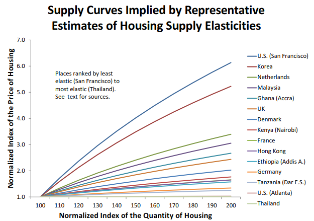

# O Mercado Imobiliário e a Economia {#economia}

\begin{epigrafe}
	\vspace*{\fill}
	\begin{flushright}
    \textit{``a economia é uma ciência histórica por excelência -\\
    qualidade que partilha com outras ciências sociais.\\
    Quer isso dizer que está submetida a um duplo processo\\
    evolutivo: o fenomenal (como representação, como ideia \\
    da coisa, como `coisa para nós', no sentido kantiano)\\
    e o numenal (como objeto, coisa representada, `coisa em si')\\
    \ldots e não pode ser estudada senão nesse duplo contexto.''\\
    (Rangel, 1956, p. 204)}
	\end{flushright}
\end{epigrafe}

## Os vários significados do termo \emph{Economia}

A economia é uma ciência social. Apesar do desenvolvimento recente das ciências
econômicas ter levado muitos dos economistas da atualidade, em sua prática, a se
assemelharem muito mais aos profissionais das ciências exatas, como um cientista
de dados, um estatístico, a Economia como ciência continua, a luz dos últimos
fatos da história recente, uma ciência histórica por excelência, como dizia
Rangel. O 'fim da história' [@fukuyama], *i.e.* a ingênua tese de Francis
Fukuyama sobre a naturalização do capitalismo neoliberal, sobre a forma racional
de vida finalmente encontrada [@zizek2011, 401], indiscutivelmente não se
concretizou de fato: o próprio Fukuyama hoje admite este fato 
[@menand_francis_nodate].

Para @rangel1956, "ciência é classificação e medida - não apenas medida, como 
pode se depreender do lema econométrico. Se ciência fosse medida não haveria 
ciência em Aristóteles ou Hegel" [@rangel1956, 204].

Desta maneira, pode-se traçar um paralelo das noções sobre o termo "economia", 
com as noções sobre outros termos, como religião e ideologia, como neste 
parágrafo de Zizek, onde o autor trata do conceito de "ideologia", a partir das
noções de Marx sobre "religião":

\begin{citacao}
A propósito da religião (que, para Marx, era a ideologia por excelência), Hegel
distinguiu três momentos: \emph{doutrina, crença e ritual}; assim, fica-se
tentado a distribuir em torno desses três eixos a multiplicidade de ideias
associadas com o termo `ideologia': a ideologia como um complexo de ideias
(teorias, convicções, crenças, métodos de argumentação); a ideologia em seu
aspecto externo, ou seja, a materialidade da ideologia, os Aparelhos Ideológicos
de Estado; e por fim, o campo mais fugidio, a ideologia `espontânea' que atua
no cerne da própria `realidade' social.
\cite[p.~15]{zizek}
\end{citacao}

Da mesma forma, para Singer [-@singer, 7], é possível distinguir pelo menos três
significados do termo *economia*:

* a qualidade de ser estrito ou austero no uso de recursos ou valores;
* a característica comum de uma ampla gama de atividades que compõe a *economia*
de um país, de uma cidade, etc.
* a ciência que tem por objeto a atividade que dá o segundo significado.

A economia (ciência, "coisa para nós"), então, é a sistematização do
conhecimento sobre a economia (atividade, "coisa em si"). Assim, em suma, quando 
a "coisa em si" muda, também deve mudar a "coisa para nós", ou seja, o resultado
contingente do processo histórico inacabado continua a mudar as ciências 
econômicas hoje, tal qual ocorreu em diversos outros momentos, como ensina 
Rangel, a respeito das várias fases do desenvolvimento da ciência Econômica, 
ocorridas de acordo com as mudanças estruturais ou materiais (mudança da 
"coisa em si"):

\begin{citacao}
Quando a oferta de mão de obra, por efeito do próprio desenvolvimento do 
capitalismo, se tornou relativamente inelástica, a análise clássica pereceu, 
porque ela supunha uma oferta perfeitamente elástica desse fator. A morte da 
coisa em si acarretou a morte da coisa para nós.
Quando se tornou patente que o fluxo de pagamento aos fatores não estava gerando
mais uma procura efetiva da mesma magnitude que a oferta efetiva que o emprego
destes fatores possibilitava, e que as discrepâncias não eram transitórias,
capazes de corrigir-se progressivamente pelo processo da crise, foi preciso 
abandonar outro suposto dos clássicos, que havia passado aos neoclássicos, 
implicitamente, sob a forma da `lei dos mercados'. A problemática econômica
mudara inteiramente e, para resolver os novos problemas, tivemos a teoria
keynesiana.
Simultaneamente, quando, graças a certas mudanças institucionais trazidas pela
Revolução Russa, criaram-se condições concretas que permitem tornar a procura
efetiva cada vez mais independente do preço dos fatores, o planejamento 
econômico tornou-se possível e tivemos as teorias que correspondem à nova
problemática. O economista deixara de ser um `meteorologista' da conjuntura
para fazer-se fautor da sua própria conjuntura.
\cite[p.~206]{rangel1956}
\end{citacao}

Nos próximos itens será visto como as diferentes escolas de pensamento, a saber,
as escolas *marxista* e *marginalista*, abordam os diferentes conceitos do termo
"economia".

### A economia como atividade

A ciência se divide a respeito da definição de economia como atividade, entre 
social (escola *marxista*) e individual (escola *marginalista*) [@singer, 9].

Enquanto para os *marxistas* a atividade econômica é sempre coletiva, praticada
mediante a divisão social do trabalho, para os *marginalistas* a atividade
econômica é em sua essência individual, que atuam autonomamente, tendo em vista
apenas seus desejos ou suas necessidades [@singer, 10].

### A economia como ciência

Também diferem os *marxistas* e os *marginalistas* quanto a definição de 
economia como ciência.

Enquanto para os *marxistas* a economia política é a ciência do social,
abrangendo em seu campo de estudo o conjunto de atividades que formam a vida
econômica da sociedade [@singer, 14], para os *marginalistas* a
ciência econômica tem como modelo as ciências da natureza, onde cada uma das
quais tem como objeto próprio um determinado "setor" do universo físico.
Analogamente, as ciências do homem teriam como objeto um "setor" do universo
humano [@singer, 15].

### A Economia como Ciência Social

Como Ciência Social, a Economia pode ser definida como a ciência:

\begin{citacao}
que estuda como as pessoas e a sociedade decidem empregar recursos escassos, que
poderiam ter utilização alternativa, na produção de bens e serviços de modo a
distribuí-los  entre as várias pessoas e grupos da sociedade, a fim de
satisfazer as necessidades humanas
\cite[p.~5]{passosnogami}.
\end{citacao}

Para Rosseti [-@rossetti, 31], no entanto, a Economia não é uma ciência com
limites nitidamente definidos, assim como as demais ciências sociais:

\begin{citacao}
À semelhança do que ocorre com os demais ramos das ciências sociais, não se pode
considerar a economia como fechada em torno de si mesma. Pelas implicações da
ação econômica sobre outros aspectos da vida humana, o estudo da economia
implica a abertura de suas fronteiras às demais áreas das ciências humanas. Esta
abertura se dá em dupla direção, assumindo assim caráter \textbf{biunívoco}.
\end{citacao}

Segundo Rosseti [-@rossetti, 32], a separação das ciências sociais em
especialidades distintas é não-rigorosa, ou, ao contrário, estas especialidades
estão entremeadas:

\begin{citacao}
Em síntese, pode-se inferir que as interfaces da economia com outros ramos do
conhecimento social decorrem de que as relações humanas e os problemas nelas
implícitos ou delas decorrentes não são facilmente separáveis segundo níveis de
referência rigorosamente pré-classificados. O referencial econômico deve ser
visto apenas como uma abstração útil, para que se analisem aspectos específicos
da luta humana pela sobrevivência, prosperidade, bem-estar individual e
bem-comum. Ocorre, todavia, que essa mesma luta não se esgota nos limites do que
se convencionou chamar de relações econômicas. Vai muito além, abrangendo
aspectos que dizem respeito à postura ético-religiosa, às formas de organização
política, aos modos de relacionamento social, à estruturação da ordem jurídica,
aos padrões das conquistas tecnológicas, às limitações impostas pelas condições
do meio ambiente e, mais abrangentemente, à formação cultural da sociedade.
\end{citacao}

Conforme visto no capítulo anterior, a análise de Rangel a respeito da questão
agrária não mais pode ser considerada atual, porém esta análise está longe de
poder ser considerada errada. Como ciência histórica, a Economia está sujeita a
este tipo de caducidade de teorias que, antes de mudanças drásticas ou mesmo de
uma lenta evolução natural da 'Economia em si', eram válidas.

Não teria sido a vez, então, da própria análise de Rangel à respeito do
aprofundamento da crise agrária (que como vimos reflete nas cidades) "morrer"
com a estabilidade da moeda alcançada pela economia brasileira desde meados da
década de 90 do século passado, ou ao menos mais recentemente, nos últimos anos,
quando a inflação brasileira parece ancorada, a despeito da prática de taxas de 
juros internas (e externas) muito próximas de zero? Pelo menos enquanto a 
perdurar a estabilidade da moeda, ao menos, é esta a realidade.

Na atualidade, a economia brasileira pode estar no caminho de experimentar um
fenômeno novo: a armadilha da liquidez [ver @krugman-emergentes], problema que
aflige os países de economia desenvolvida já há alguns anos, é uma espécie de
'incapacidade' da economia gerar inflação suficiente para que a taxa de juros
básica real da economia chegue a patamares baixos o suficientes para que iguale
a eficácia marginal média do sistema. Em outras palavras, a inflação deixa de
ser um fator corretivo da conjuntura, passando a ser insuficiente para tal. No
entanto, a análise de Rangel não deixa de ser útil, na medida em que explica
como chegamos a situação presente. Como explicar este déficit habitacional
crônico senão através da crise agrária? Como explicar o aumento do preço da
terra em períodos de baixa conjuntura, que agravava a situação agrária, levando
milhares de pessoas a se aglomerarem em situação precária nas cidades
brasileiras? Por que não houve a esperada queda do preço da terra, como
esperado? Que tipo de soluções podem ser aplicadas ao caso brasileiro?

Estes questionamentos, porém, não podem ser respondidos antes de uma análise do
atual comportamento do \gls{MI} no Brasil. É o que se pretende fazer neste 
capítulo. No entanto, se uma análise estatística direta do comportamento do 
\gls{MI} no Brasil dificilmente poderá ser feita, pela ausência de séries 
históricas de preços de imóveis, uma análise econômica conceitual, aos moldes da
análise de Rangel, pode ter espaço. Estudos futuros tratarão da validade desta 
análise conceitual, através da análise dos dados, que porventura estarão 
disponíveis.

## O Mercado Imobiliário

Segundo @shelter [p. 188-189], o funcionamento do \gls{MI} residencial pode
ser compreendido de acordo com o diagrama da Figura \@ref(fig:MIResidencial):
existe um mercado de residências que pode ser considerado competitivo. No
processo de produção, contudo, a presença de poucos incorporadores e 
proprietários pode lhes dar um grande poder de mercado, sobretudo se eles também
controlarem o mercado de outros insumos, porém isto não é comum. No Mercado de 
Insumos, a propriedade pode ser tão concentrada que os proprietários podem ter 
poder de fixar os preços, grandes economias de escala podem tornar a produção de 
alguns insumos um monopólio natural e a regulação governamental pode restringir 
a alocação competitiva de recursos, especialmente os financeiros.

```{r MIResidencial, fig.cap = "Diagrama esquemático do funcionamento do \\gls{MI} residencial."}
grViz("
digraph nicegraph {
  
  // title
  label     = 'O Mercado Imobiliário Residencial'
  labelloc  =  top // t: Place the graph's title on top.
  fontsize  = 30 // Make title stand out by giving a large font size
  fontcolor = blue
  # graph, node, and edge definitions
  graph [compound = true, nodesep = .5, ranksep = .25,
         color = crimson, rankdir = 'TD']

  node [fontname = Helvetica, fontcolor = darkslategray,
        shape = rectangle, fixedsize = true, width = 2.5,
        color = darkslategray]

  edge [color = none, arrowhead = none, arrowtail = none]

  # subgraph for R information
  subgraph cluster0 {
    label = 'Mercado de Insumos';
    labelloc  =  top // t: Place the graph's title on top.
    fontsize  = 15 // Make title stand out by giving a large font size
    fontcolor = red
    rank = 'same'
    node [color=none weight=1000]
    'Terra' -> 'Materiais' -> 'Infraestrutura' -> 'Financiamento' -> 'Trabalhadores'
  }

  # subgraph for RStudio information
  subgraph cluster1 {
    label = 'Processo de Produção';
    labelloc  =  top // t: Place the graph's title on top.
    fontsize  = 15 // Make title stand out by giving a large font size
    fontcolor = red
    node [color=none weight=1000]
    'Construtores' -> 'Incorporadores' -> 'Proprietários'
  }
  
  # subgraph for RStudio information
  subgraph cluster2 {
    label = 'Mercado de Residências';
    labelloc  =  top // t: Place the graph's title on top.
    fontsize  = 15 // Make title stand out by giving a large font size
    fontcolor = red
    node [color=none weight=1000]
    'Compradores' -> 'Investidores' -> 'Locadores' -> 'Serviços Residenciais'
  }
  // Edges that directly connect one cluster to another
  //'Terra' -> 'Construtores' [ltail=cluster0 lhead=cluster1, label = 'Preços'];
  //'Materiais' -> 'Incorporadores' [ltail=cluster0 lhead=cluster1, label = 'Preços'];
  //'Trabalhadores' -> 'Proprietários' [ltail=cluster0 lhead=cluster1, label = 'Preços'];
  //'Construtores' -> 'Compradores' [ltail=cluster1 lhead=cluster2, label = 'Preços'];
  //'Proprietários' -> 'Serviços Residenciais' [ltail=cluster1 lhead=cluster2, label = 'Preços'];
}
")
```
\bcenter
\small Fonte -- Adaptado de @shelter [p. 189]
\ecenter

Para @shelter [p. 189], então, o problema dos \gls{MI} residenciais usualmente 
se concentram no mercado de insumos, onde as intervenções governamentais 
deveriam se concentrar. Contudo, nem sempre é isto que ocorre: muitos governos
decidem intervir diretamente no processo de produção ou no controle de preços ao
consumidor final, como o controle de aluguéis, no entanto isto apenas distorce 
os sinais enviados ao mercado e podem exacerbar o problema original.

Ao longo das próximas seções serão apresentados conceitos econômicos 
relacionados à modelagem do \gls{MI}, tanto em nívem micro, quanto 
macroeconômico.

### Particularidades do mercado imobiliário

Também em nível microeconômico o mercado imobiliário é um mercado diferenciado 
dos outros mercados de bens de consumo. Apesar de toda a indústria da construção
ter evoluído muito ao longo das últimas décadas, ainda persiste no Brasil um
forte componente artesanal na construção civil, o que implica em bens imóveis
de características muito heterogêneas, a depender da mão-de-obra aplicada na sua
execução. Também a questão do projeto arquitetônico implica numa singularidade
para cada bem imobiliário. Mas mais importante ainda é a questão da localização,
que torna cada imóvel único. Isto não ocorre em qualquer outro mercado de bens 
de consumo. A não ser por questões de natureza sentimental, um carro, uma 
geladeira, ou praticamente qualquer outro bem de consumo é produzido em série: 
existem milhares de itens iguais no mercado. Isto nunca ocorre com os imóveis.
Mesmo apartamento vizinhos, em um mesmo prédio, tem características diferentes,
dada a sua posição solar, localização do andar em relação ao prédio, a vista
que cada um possui, entre outras questões. 

Segundo a NBR 14.653-01 [-@NBR1465301, x], "o mercado imobiliário caracteriza-se
como um 'mercado imperfeito', com bens não homogêneos, estoque limitado,
liquidez diferenciada e grande influência de fatores externos."

De acordo com @ADAMS2010 [p. 3], a forte inércia dos preços do mercado
imobiliário influencia o comportamento do mercado durante os *booms* econômicos,
já que a exuberância das expectativas (exuberância irracional) dos investidores
e proprietários de imóveis facilita a formação de bolhas nestes mercados. Além
disto, a falta de informação a respeito de preços no mercado imobiliário, pelo
motivo deste ser um mercado segmentado, ou seja, os preços obedecem uma lógica
local, também é uma facilitadora da formação de bolhas.

## O Mercado Imobiliário e a Microeconomia {#micro}

O \gls{MI}, por sua pujança e importância, não pode ser considerado um simples
mercado de bens, como outros bens de consumo em geral, como automóveis, móveis
ou eletrodomésticos. Sua análise requer um estudo mais aprofundado das variáveis
da Economia do país, não apenas por conta do seu fator exógeno sobre o \gls{MI},
mas também pela interação que este mercado apresenta com estas variáveis. Isto
não quer dizer, contudo, que se dispensa a análise do \gls{MI} em nível
microeconômico, o que aliás a NBR 14.653-01 [-@NBR1465301] parece ter acabado de
perceber e recomendar, como será visto na próxima seção. A análise do \gls{MI} a 
nível microeconômico é importante, sobretudo, para o desenvolvimento dos 
aspectos regulatórios deste mercado em nível local: para desenvolver uma 
regulação balanceada é importante entender não apenas os aspectos positivos da
regulação, mas é preciso conhecer também os seus efeitos sobre os preços dos 
imóveis, sobretudo os efeitos da regulação sobre a volatilidade dos mesmos.


### Estruturas básicas de mercado

A nova versão da NBR 14.653-01 [-@NBR1465301, ix] traz uma evolução quanto à 
consideração das diversas estruturas de mercado possíveis para a avaliação de um
bem.

> As estruturas básicas do mercado podem ser, resumidamente:
>
>* **Concorrência Perfeita**: situação em que o número de vendedores e de
> compradores é suficientemente elevado para que um agente isolado não seja 
> capaz de influenciar o comportamento dos preços;
>
>* **Monopólio**: É constituído por um único vendedor;
>
>* **Monopsônio**: é constituído por um único comprador;
>
>* **Oligopólio**: é constituído por um número pequeno de vendedores;
>
>* **Oligopsônio**: é constituído por um número pequeno de compradores.

No entanto, a NBR 14.653-01 [-@NBR1465301] não deixa claro de que modo cada
estrutura de mercado deve impactar na avaliação do valor final de mercado do 
imóvel.

Outro problema com a NBR 14.653-01 [-@NBR1465301] é que os mercados não deveriam
ser classificados apenas em relação à sua estrutura concorrencial, mas também de
acordo com as suas restrições geográficas e/ou regulatórias: existem mercados em
que não é possível aumentar a oferta, mesmo com o aumento da demanda, porque
existem limitações geográficas que impedem que isto ocorra, ou ao menos impedem
que isto seja feito sem que antes sejam feitas grandes intervenções urbanas que,
inicialmente, permitam que a área seja loteada. Em outros mercados, existem
questões regulatórias fortes que impedem um aumento da oferta de bens imóveis. É
o caso de Brasília, por exemplo: na região do plano-piloto existem questões de 
gabarito que impedem uma maior verticalização e também existe um grande número 
de imóveis em propriedade do Estado brasileiro, que distorcem o funcionamento do 
mercado.

#### Equilíbrio de mercado

O preço de equilíbrio de um bem se dá, geometricamente falando, no cruzamento 
das curvas de oferta e demanda, ou seja, o prelço de equilíbrio, em qualquer
mercado, é o ponto onde a oferta e a demanda do mercado são iguais 
[@varian, p. 310].

Há de se discernir, no entanto, entre equilíbrio de curto e de longo prazo.

A Figura \@ref(fig:equilibrioMercado) ilustra o equilíbrio num mercado
hipotético, modelado pelas curvas **O** (oferta) e **D** (demanda). Para este
mercado, o equilíbrio se dá no ponto de coordenadas ($\tilde Q, \tilde P$). Às
quantidades $\tilde P$ e $\tilde Q$ dão-se o nome de preço e quantidade de 
equilíbrio.

```{r equilibrioMercado, fig.cap="Equilíbrio de mercado."}
source("curve_intersect.R")
demand <- Hmisc::bezier(c(1, 3, 9),
                        c(9, 3, 1)) %>%
  as_data_frame()

supply <- Hmisc::bezier(x = c(1, 8, 9),
                        y = c(1, 5, 9)) %>%
  as_data_frame()

intersection_xy <- curve_intersect(supply, demand)

intersections <- intersection_xy %>% as_data_frame()

plot_labels <- data_frame(label = c("D", "O"),
                          x = c(1, 8.25),
                          y = c(8, 8))

p1 <- ggplot(mapping = aes(x = x, y = y)) + 
  geom_path(data = supply, color = "#0073D9", size = 1) + 
  geom_path(data = demand, color = "#FF4036", size = 1) + 
  geom_segment(data = intersections, 
               aes(x = x, y = 0, xend = x, yend = y), lty = "dotted") +
  geom_segment(data = intersections, 
               aes(x = 0, y = y, xend = x, yend = y), lty = "dotted") + 
  geom_text(data = plot_labels,
            aes(x = x, y = y, label = label), parse = TRUE) +
  geom_point(data = intersections, size = 3) +
  labs(x = "Quantidade", y = "Preço") +
  theme_classic() + 
  coord_equal() +
  scale_x_continuous(expand = c(0, 0), breaks = intersections$x,
                     labels = expression(tilde(Q))) +
  scale_y_continuous(expand = c(0, 0), breaks = intersections$y,
                     labels = expression(tilde(P)))
p1
```

O equilíbrio de um mercado, no entanto, denominado equilíbrio estático ou de
curto prazo, está sujeito a choques que podem perturbar este equilíbrio.

De acordo com @varian [p. 310], um mercado competitivo (concorrência perfeita),
é um mercado em que cada agente econômico, ofertante ou demandante, considera os
preços como dados, *i.e.* fora de seu controle. Não há, portanto, num mercado
competitivo, restrições à entrada de novas empresas [@varian, p. 433]. Neste
mercado, o que determina o preço é a ação conjunta de todos os agentes do 
mercado.

#### Elasticidades

Para a correta descrição do funcionamento de um \gls{MI} em particular é
importante que sejam conhecidas, ainda que aproximadamente, as elasticidades da
oferta e da demanda do mercado em relação aos preços e outras variáveis
relevantes, como a renda da população. Basicamente, o conceito de elasticidade
está relacionado a quantidades marginais: qual a quantidade marginal de uma
mercadoria será demandada (ou ofertada) se a variável de referência aumenta (ou
diminui) em uma unidade.

##### Elasticidade-preço da demanda

A elasticidade-preço da demanda, \gls{varepsilon_p}, definida conforme a equação
\@ref(eq:epdemanda) [@varian, p. 302], mede a quantidade marginal que será
demandada do mercado se o preço de uma mercadoria aumenta ou diminui em uma
unidade de preço. Geralmente a elasticidade-preço da oferta é, então, um número
negativo [@varian, 289].

\begin{equation}
\varepsilon_p = \frac{p}{q}\frac{\mathrm{d} q}{\mathrm{d} p}
(\#eq:epdemanda)
\end{equation}

Uma maneira mais conveniente (e exata) de se escrever a equação da elasticidade 
é a apresentada na equação \@ref(eq:elasticidadeLN), em função do logaritmo
natural das variáveis [@varian, p.307-308]:

\begin{equation}
\varepsilon_p = \frac{\mathrm{d} \ln(q)}{\mathrm{d} \ln(p)}
(\#eq:elasticidadeLN)
\end{equation}

Segundo Mayo (1981) e Olsen (1986) [*apud* @Malpezzi2002TheRO, p.23], uma boa 
estimativa para o valor da elasticidade-preço da demanda é algo em torno de -0,8. 

##### Elasticidade-renda da demanda

A elasticidade-renda da demanda, \gls{varepsilon_r}, mede como muda a quantidade
demandada quando a renda do consumidor varia [@varian, p.300]. De acordo com a
elasticidade-renda os bens podem ser classificados em bens normais, *i.e.* bens
cuja demanda aumenta com o aumento da renda; bens inferiores, *i.e.* bens cuja
demanda diminui com o aumento da renda; e bens de luxo ($\varepsilon_r > 1$),
*i.e.* bens cujo aumento na demanda é mais do que proporcional ao aumento da
renda (um aumento de 1% na renda conduz a um aumento de mais de 1% da demanda).

A análise da elasticidade-renda da demanda pode ser feita a partir das curvas
de Engel, como na Figura \@ref(fig:engel1):

```{r engel1, fig.cap="Curvas de Engel no Espaço Aluguéis vs. Renda."}
engel1 <- Hmisc::bezier(c(2, 5, 9),
                        c(3, 8, 7)) %>%
  as_data_frame()

engel2 <- Hmisc::bezier(x = c(2, 8, 7),
                        y = c(1, 5, 9)) %>%
  as_data_frame()

plot_labels <- data_frame(label = expression("epsilon > 1", "epsilon < 1", 
                                             "epsilon == 1"),
                          x = c(7.5, 8.25, 9.5),
                          y = c(9, 6.5, 9))

p1 <- ggplot(mapping = aes(x = x, y = y)) + 
  geom_path(data = engel1, color = "#0073D9", size = 1) + 
  geom_path(data = engel2, color = "#FF4036", size = 1) +
  geom_abline() +
  geom_text(data = plot_labels,
            aes(x = x, y = y, label = label), parse = TRUE) +
  labs(x = "Renda", y = "Aluguel") +
  theme_classic() + 
  coord_equal() +
  scale_x_continuous(expand = c(0, 0), limits = c(0, 10), breaks = NULL) +
  scale_y_continuous(expand = c(0, 0), limits = c(0, 10), breaks = NULL)
p1
```
\bcenter
\small Fonte: O autor.
\ecenter


No entanto, segundo @regulation [p. 12-13], uma transformação conveniente pode
ser feita para a melhor compreensão da diferença entre o consumo necessário e o
consumo de luxo, como pode ser visto na Figura \@ref(fig:engel2): no caso de um
mercado de bens de luxo ($\varepsilon_r > 1$), com o aumento da renda as pessoas
podem ficar mais *dispostas a comprometer* uma parte um pouco maior do orçamento 
neste mercado, enquanto em um mercado de bens normal ($\varepsilon_r < 1$), as 
pessoas podem estar *obrigadas a comprometer* boa parte do seu orçamento neste
mercado, mas, à medida que a renda aumenta, a proporção da renda aplicada neste
mercado diminui.

```{r engel2, fig.cap="Curvas de Engel no Espaço Aluguéis/Renda vs. Renda."}
engel1 <- Hmisc::bezier(c(.5, 1, 5),
                        c(2.5, 1, .5)) %>%
  as_data_frame()

engel2 <- Hmisc::bezier(x = c(.5, 1, 5),
                        y = c(.1, 1, 1.5)) %>%
  as_data_frame()

plot_labels <- data_frame(label = expression("epsilon[r] < 1", "epsilon[r] > 1", 
                                             "epsilon[r] == 1"),
                          x = c(.5, .5, .5),
                          y = c(2.6, .3, 1.15))

p1 <- ggplot(mapping = aes(x = x, y = y)) + 
  geom_path(data = engel1, color = "#0073D9", size = 1) + 
  geom_path(data = engel2, color = "#FF4036", size = 1) +
  geom_hline(yintercept = 1.05) +
  geom_text(data = plot_labels,
            aes(x = x, y = y, label = label), parse = TRUE) +
  labs(x = "Renda", y = "Aluguel/Renda") +
  theme_classic() + 
  coord_equal() +
  scale_x_continuous(expand = c(0, 0), limits = c(0, 5), breaks = NULL) +
  scale_y_continuous(expand = c(0, 0), limits = c(0, 3), breaks = NULL)
p1
```
\bcenter
\small Fonte: Adaptado de @regulation [p. 13]
\ecenter

Segundo @regulation [p. 13], evidências empíricas a partir de dados coletados 
em uma diversa gama de países mostram que a elasticidade-renda da demanda para o
\gls{MI} geralmente apresenta valores entre 0,5 e 1,0.

#### Elasticidade da oferta

Analogamente à elasticidade-preço da demanda, a elasticidade-preço da oferta 
mede a variação na quantidade ofertada de uma mercadoria quando os preços variam
em uma unidade, sendo portanto, em geral, um número positivo (quando os preços
aumentam, a quantidade ofertada aumenta). 

Na Figura \@ref(fig:equilibrioMercado) foi apresentado o conceito de equilíbrio 
em um determinado mercado, a partir de curvas de oferta e de demanda.

Outros tipos de curvas, porém, podem ocorrer. Segundo @varian [p. 311-312], dois
tipos diferentes de oferta ocorrem com frequência: a oferta fixa ou
perfeitamente inelástica (Figura \@ref(fig:casosEspeciais) A), onde a quantidade
de equilíbrio é determinada inteiramente pelas condições de oferta e o preço de
equilíbrio é determinado inteiramente pelas condições de demanda; e a oferta
perfeitamente elástica, onde qualquer quantidade desejada do bem é ofertada a um
preço constante, determinado pela oferta e a quantidade de equilíbrio é
determinada pela curva de demanda (Figura \@ref(fig:casosEspeciais) B).


```{r casosEspeciais, fig.cap="Equilíbrio de mercado.", out.width="100%"}
supply <- Hmisc::bezier(x = c(4, 4, 4),
                        y = c(1, 5, 9)) %>%
  as_data_frame()

supply2 <- Hmisc::bezier(x = c(1, 5, 9),
                        y =  c(4, 4, 4)) %>%
  as_data_frame()

#intersection_xy <- curve_intersect(supply, demand)

#intersections <- intersection_xy %>% as_data_frame()

plot_labels <- data_frame(label = c("D", "O"),
                          x = c(1.75, 4.25),
                          y = c(8, 8))

plot_labels2 <- data_frame(label = c("D", "O"),
                          x = c(1.75, 8),
                          y = c(8, 4.25))

p1 <- ggplot(mapping = aes(x = x, y = y)) + 
  geom_path(data = supply, color = "#0073D9", size = 1) + 
  geom_path(data = demand, color = "#FF4036", size = 1) + 
  # geom_segment(data = intersections, 
  #              aes(x = x, y = 0, xend = x, yend = y), lty = "dotted") +
  # geom_segment(data = intersections, 
  #              aes(x = 0, y = y, xend = x, yend = y), lty = "dotted") + 
  geom_text(data = plot_labels,
            aes(x = x, y = y, label = label), parse = TRUE) +
  # geom_point(data = intersections, size = 3) +
  labs(x = "Quantidade", y = "Preço") +
  theme_classic() + 
  coord_equal() +
  scale_x_continuous(expand = c(0, 0), breaks = NULL,
                    labels = expression(tilde(Q))) +
  scale_y_continuous(expand = c(0, 0), breaks = NULL,
                    labels = expression(tilde(P)))
p2 <- ggplot(mapping = aes(x = x, y = y)) + 
  geom_path(data = supply2, color = "#0073D9", size = 1) + 
  geom_path(data = demand, color = "#FF4036", size = 1) + 
  # geom_segment(data = intersections, 
  #              aes(x = x, y = 0, xend = x, yend = y), lty = "dotted") +
  # geom_segment(data = intersections, 
  #              aes(x = 0, y = y, xend = x, yend = y), lty = "dotted") + 
  geom_text(data = plot_labels2,
            aes(x = x, y = y, label = label), parse = TRUE) +
  # geom_point(data = intersections, size = 3) +
  labs(x = "Quantidade", y = "Preço") +
  theme_classic() + 
  coord_equal() +
  scale_x_continuous(expand = c(0, 0), breaks = NULL,
                    labels = expression(tilde(Q))) +
  scale_y_continuous(expand = c(0, 0), breaks = NULL,
                    labels = expression(tilde(P)))
plot_grid(p1, p2, labels = "AUTO")
```
\bcenter
\small Fonte -- Adaptado de @varian [p. 312].
\ecenter

Segundo @Malpezzi2002TheRO [p. 17], os parâmetros da demanda no \gls{MI} são
muito mais previsíveis e estáveis mesmo em diferentes mercados, enquanto os
parâmetros da oferta contém uma variância muito maior. Na prática, o valor da
elasticidade-preço da oferta, deve variar nos diferentes \gls{MI} entre
praticamente zero (perfeitamente inelástica), em mercados fortemente restritos
[@malaysia] a praticamente infinito (perfeitamente elástica)

@supplyelasticity argumentam que, no entanto, esta 
grande variação encontrada em diversos trabalhos pode ser explicada pelas 
diferentes janelas de tempo utilizadas para o cálculo da elasticidade e que há 
evidências de que, no longo prazo, para a maioria das regiões metropolitanas dos
EUA, as elasticidades da oferta tendem a ser altas (>10).

```{r supplyCurves, fig.cap="Curvas de oferta para diversos \\gls{MI}."}

```
\bcenter
\small Fonte -- @regulation [p. 19].
\ecenter

##### Estimação da elasticidade-preço da oferta

Hipóteses sobre as elasticidades de oferta e demanda de um \gls{MI} em específico
podem ser testadas a partir de modelos de fluxo do \gls{MI} em análise como o
apresentado nas equações \@ref(eq:flowModel1) a \@ref(eq:flowModel3), onde 
\gls{Q_S} é a quantidade ofertada, \gls{Q_D} é a quantidade demandanda, 
\gls{P_h} é o preço relativo das residências, \gls{Y} é a renda e \gls{N} é a 
população [@longrunsupplyelasticity p. 282].

\begin{align} 
Q_D &= \alpha_0 + \alpha_1 P_h + \alpha_2 Y + \alpha_3 N (\#eq:flowModel1)\\ 
Q_S &= \beta_0 + \beta_1 P_h (\#eq:flowModel2)\\
Q_D &= Q_S (\#eq:flowModel3)
\end{align}

De acordo com @longrunsupplyelasticity [p. 282], se os modelos forem elaborados
com o logaritmo natural das variáveis (logaritmo dos preços, logaritmo das
quantidades ofertadas e demandadas, logaritmo da renda e logaritmo da
população), os coeficientes $\alpha_i$ e $\beta_i$ podem ser interpretados
como as elasticidades do mercado.

O modelo das equações \@ref(eq:flowModel1) a \@ref(eq:flowModel3) pode ser
escrito em sua forma reduzida, de acordo com a equação \@ref(eq:flowModel) 
[@longrunsupplyelasticity p. 283]:

\begin{equation}
P_h = \frac{\alpha_0 - \beta_0}{\beta_1 - \alpha_1} + \frac{\alpha2}{\beta_1 - \alpha_1}Y + \frac{\alpha3}{\beta_1 - \alpha_1} N
(\#eq:flowModel)
\end{equation}

Segundo @longrunsupplyelasticity [p. 285], sobre este modelo podem ser feitas
hipóteses, tal como a hipótese de que o estoque \gls{K} de residências não se
ajusta completamente em cada período, o que está implícito no modelo acima, mas
de acordo com um parâmetro de ajuste do estoque \gls{delta}, usualmente igual a
0,3 [@longrunsupplyelasticity, p. 285]. Desta forma, a quantidade demandada
fica restrita a diferença entre o estoque desejado \gls{K^*} e o estoque real do
período anterio $K_{-1}$, multiplicada pelo fator de ajuste \gls{delta}. Assim:

\begin{align} 
Q_D &= \delta (K^* - K_{-1}) (\#eq:flowModela1)\\ 
K^* &= \alpha_0 + \alpha_1 P_h + \alpha_2 Y + \alpha_3 N (\#eq:flowModela2)\\ 
Q_S &= \beta_0 + \beta_1 P_h (\#eq:flowModela3)\\
Q_D &= Q_S (\#eq:flowModela4)
\end{align}

O modelo das equações \@ref(eq:flowModela1) a \@ref(eq:flowModela4) pode ser
então escrito de maneira reduzida, conforme equação \@ref(eq:flowModela):

\begin{equation}
P_h = \frac{\delta \alpha_0 - \beta_0}{\beta_1 - \delta \alpha_1} + \frac{\delta \alpha_2}{\beta_1 - \delta \alpha_1}Y + \frac{\delta \alpha_3}{\beta_1 - \delta \alpha_1} N - \frac{\delta}{\beta_1 - \delta \alpha_1}K_{-1}
(\#eq:flowModela)
\end{equation}

E pode ser estimado de acordo com a equação \@ref(eq:flowModelEstimate):

\begin{equation}
P_h = \gamma_0 + \gamma_1 Y + \gamma_2 N + \gamma_3 K_{-1} + \varepsilon
(\#eq:flowModelEstimate)
\end{equation}

Onde $\gamma_0 = \frac{\delta \alpha_0 - \beta_0}{\beta_1 - \delta \alpha_1}$, $\gamma_1 = \frac{\delta \alpha_2}{\beta_1 - \delta \alpha_1}$, $\gamma_2=\frac{\delta \alpha_3}{\beta_1 - \delta \alpha_1}$ e $\gamma_3 = \frac{\delta}{\beta_1 - \delta \alpha_1}$.

Segundo @longrunsupplyelasticity [p. 285], a elasticidade-preço da oferta do 
\gls{MI} residencial pode ser, então, estimada a partir da equação abaixo, 
parametricamente em função de $\alpha_1$ e $\alpha_2$, que a princípio são 
desconhecidos:

$$\beta_1 = \frac{\delta \alpha_2}{\gamma_1} + \delta \alpha_1$$

#### Choques no mercado

Qualquer mercado está sujeito a choques, seja de oferta ou de demanda. Um choque
de oferta se daria com a quebra de um dos ofertantes, por exemplo, situação em
que a quantidade ofertada poderia vir a ser diminuída abruptamente, dependendo
da estrutura do mercado. Já choque de demanda ocorre quando há, por exemplo, por
fatores que são exógenos ao \gls{MI}, um aumento abrupto da demanda, que pode
ocorrer pela abertura de linhas de créditos antes inexistentes ou pelo aumento
da renda da população. Quaisquer que sejam as causas que levem a um choque no
\gls{MI}, seus efeitos devem ser investigados. Se o mercado impactado tiver uma
estrutura fortemente concorrencial e não tiver restrições geográficas
significantes, a tendência é que um choque de demanda seja absorvido a médio e
longo prazo sem grandes flutuações de preços, devido à entrada de novos
ofertantes no mercado. Por outro lado, se o mercado em análise sofre de algum
tipo de restrição geográfica ou mesmo econômica que dificulte a entrada de novos
atores como ofertantes, a tendência é que os choques de demanda tenham maior
impacto. Os detalhes por trás deste raciocínio serão melhor esclarecidos no
capítulo \@ref(crise2008).

### Diagnóstico de mercado

A NBR 14.653-01 [-@NBR1465301, 12], estabelece que, "o profissional, conforme o
tipo de bem, as condições de contratação, o método empregado e a finalidade da
avaliação, pode **tecer considerações sobre o mercado do bem avaliando**, de
forma a indicar, tanto quanto possível, **a estrutura, a conduta e o desempenho
do mercado**."

### O imóvel visto como um investimento

Segundo @Malpezzi2002TheRO, um imóvel é um ativo que rende um fluxo de serviços
ao longo do tempo. O Quadro \@ref(qua:Quadro-1) mostra a diferenciação entre os
conceitos de Estoque e Fluxo, muito utilizados na Economia. 

\begin{quadro}[htb]
	\centering
	\caption{\label{qua:Quadro-1}Distinção entre estoque e fluxo.}	
	\begin{tabular}{|l|l|}
		\hline
		\textbf{Riqueza}  & \textbf{Fluxo}\\ \hline
		 Riqueza          & Renda         \\ \hline
		 Dívida Pública   & Déficit       \\ \hline
		 Valor do imóvel  & Aluguel       \\ \hline
	\end{tabular}
	\fonte{\textcite[3]{Malpezzi2002TheRO}.}
\end{quadro}

O quadro acima poderia ser facilmente expandido para incorporar outras formas de 
investimentos, como títulos (que rendem coupons), ações (que rendem dividendos)
e outros.

Na ótica do investidor, o imóvel é como um título de longo prazo. Racionalmente
ou não, o comprador de um imóvel com fins de investimento espera que o imóvel
comprado vá gerar um fluxo de aluguéis (constantes ou não) ao longo do tempo, de
maneira que este fluxo de aluguéis compense o investimento inicial na compra do
imóvel.

Segundo @Malpezzi2002TheRO [p. 4], o valor presente $V$ de um imóvel pode ser 
calculado conforme a equação \@ref(eq:VPImovel), onde $\gls{R}_t$ é a renda
bruta dos aluguéis, $C_t$ é o custo recorrente com a manutenção do imóvel e $i$
é a taxa de desconto.

\begin{equation}
V = \sum_{t=0}^T \frac{\mathbb{E}[R_t-C_t]}{(1+i)^t}
(\#eq:VPImovel)
\end{equation}

Diferentemente do que hoje ocorre com os investimentos capitalistas, onde o 
*payback* esperado gira em torno de 5 a 10 anos, o comprador de um imóvel
esperar que este gere um fluxo de renda ao longo de décadas. 

Assim, a compra de um imóvel assemelha-se à compra dos títulos de renda fixa de
maior *duration* disponíveis no mercado.

Ora, como se sabe, o valor de face destes títulos, ou seja, o valor do resgate
destes títulos no vencimento, é dado. Porém, estes títulos são negociados no
mercado secundário a valor de mercado, sendo que os títulos de longo prazo são
altamente sensíveis a variações nas taxas de juros de longo prazo. A saber, o
preço destes títulos é inversamente proporcional às taxas de juros, ou seja,
quanto menor as taxas, maior o valor presente dos títulos, ou valor de mercado,
e vice-versa.

### O papel da especulação no \gls{MI}

Um dos assuntos mais polêmicos do \gls{MI} diz respeito à especulação com 
imóveis. Especulação, aliás, é um assunto em polêmico em diversos tipos de 
mercados, não apenas no \gls{MI}. 

@Malpezzi2002TheRO [p. 5] fazem um bom apanhado de diversos conceitos 
relacionados à "especulação". Primeiramente, argumentam que é polêmica a 
definição do termo *especulador*, especialmente se comparado ao termo 
*investidor*: seria o especulador um investidor que negocia o bem em prazos 
mais curtos? Não existe uma definição para tal.

Então @Malpezzi2002TheRO [p. 12] apresentam diversas maneiras de se modelar as
expectativas (expectativas racionais, adaptativas, etc.), e apresentam (p. 14),
um modelo do valor presente de um imóvel calculado de acordo com o valor 
esperado da renda líquida com aluguéis futuros, $\gls{R_L}$, trazidos ao Valor
Presente através da aplicação de uma taxa de desconto $i$, de acordo com a 
expressão vista na equação \@ref(eq:valor-presente):

\begin{equation}
V = \sum_{t = 0}^T \frac{\mathbb{E}[R_{Lt}]}{(1+i)^t}
(\#eq:valor-presente)
\end{equation}

Supondo que se possa calcular um valor presente para um imóvel baseado apenas
nos fundamentos econômicos $V^*$, o valor em torno do qual se negociaria o
imóvel com expectativas racionais, com expectativas adaptativas[^3], um imóvel
com preço igual ao da equação \@ref(eq:valor-presente-adptativo) também seria
negociado 'racionalmente', caso o comprador considerasse que o grau de
supervalorização do imóvel continuasse a crescer nos períodos subsequentes por
uma taxa maior ou igual à taxa de desconto [@Malpezzi2002TheRO, 15].

\begin{equation}
V_t = V_t^* + b_t, \qquad com \quad \mathbb{E}_t[b_{t+1}] = (1+i)b_t
(\#eq:valor-presente-adptativo)
\end{equation}


[^3]: Expectativas adaptativas assumem que os agentes do mercado presumem que os 
ganhos futuros serão iguais aos do passado recente analisado.

Em suma, isto implica que a autocorrelação serial nos aumentos de preços dos 
imóveis é uma condição necessária para a formação de bolhas. Segundo 
@Malpezzi2002TheRO [p. 15], muitos estudos documentam a existência de correlação 
serial em preços, porém a evidência de que isso leva, por si só, a formação de 
bolhas é controversa. No capítulo \@ref(crise2008) serão vistos com mais detalhes os
fatores que levam à formação de bolhas.

### O papel da regulação do \gls{MI} na prevenção da formação de bolhas especulativas

Conforme será visto no capítulo \@ref(crise2008), para @Malpezzi2002TheRO [p. 26], o
efeito da especulação na volatilidade do \gls{MI} depende das condições de
oferta em cada mercado. Reformas adequadas na regulação do \gls{MI} com base
nesta hipótese serão apresentadas no capítulo \@ref(politicas).

### Formação de bolhas especulativas

Na análise de @Malpezzi2002TheRO a respeito da formação de bolhas, a variável
taxa de desconto ($i$) é considerada como uma variável exógena, isto é, não 
foram considerados os efeitos do preço dos imóveis sobre esta variável, tampouco
foram modelados ou quantificados os impactos das mudanças no patamar das taxas
de juros sobre o preço dos imóveis.

Como visto no Quadro \@ref(qua:Quadro-1), um imóvel pode ser visto como um
investimento. O seu valor presente depende de um fluxo estimado de aluguéis
trazidos a valor presente através da aplicação de uma taxa de desconto, assim
como ocorre com outros ativos financeiros, como os títulos da dívida pública,
por exemplo.

Os títulos da dívida pública são vistos, normalmente, como os ativos livres de
risco da economia. Por isso, a taxa de desconto destes ativos é chamada de taxa
livre de risco. A taxa de desconto de quaisquer outros ativos na Economia de um
país será maior do que essa taxa livre de risco, pois nela estará embutida uma
taxa devido ao risco de carregamento daquele investimento, que se soma à taxa de
livre de risco da economia[^4]. Dessa maneira, o que ocorre quando a taxa livre
de risco oscila é que também oscilam os Valores Presentes dos imóveis e dos
outros investimentos.

Se estas oscilações de preços dos imóveis devido às taxas de juros podem causar
bolhas especulativas, no entanto, é uma outra história. Este assunto será 
abordado com mais profundidade no capítulo \@ref(crise2008).

[^4]: O capítulo \@ref(crise2008) ilustra como as taxas praticadas no mercado de 
crédito de hipotecas, por exemplo, são compostas de uma taxa adicional de risco
em relação à taxa livre de risco.

### Rendimentos de aluguel

A taxa de rendimento do aluguel de um imóvel é obtida invertendo-se os termos
da equação \@ref(eq:valor-presente), de maneira a isolar a taxa de desconto.

Para facilitar os cálculos, é conveniente a utilização da simplificação da 
equação \@ref(eq:valor-presente), fazendo a hipótese de que a série de 
pagamentos é tão longa, que pode ser considerada perpétua. Geralmente esta é
uma boa hipótese no caso de imóveis, pois para séries de pagamentos constantes 
com duração superior a 20 anos a hipótese da perpetuidade é considerada razoável,
haja vista que a vida útil de qualquer imóvel costuma ultrapassar esse prazo.

Assim, o Valor Presente $VP$ de uma série de pagamentos perpétua de valor 
periódico $\gls{R_L}$, descontados de uma taxa de juros $i$ é igual a:

\begin{equation}
VP = \lim_{n \to \infty} R_L \frac{(1+i)^t-1}{i(1+i)^t}= \frac{R_L}{i}
(\#eq:perpetua)
\end{equation}

Os rendimentos de aluguel $\gls{y_r}$ são taxas brutas de retorno dos 
recebimento de aluguéis comparados ao valor de venda de um imóvel.

Por exemplo, para um imóvel avaliado em R$1.000.000,00, com um rendimento de 
aluguéis de R$1.500,00 reais mensais, o rendimento bruto do aluguel 
deste imóvel seria:

$$y_r = \frac{12*1.500}{1.000.000} = 3,6\% \ a.a.$$
Esta taxa tem sido utilizada para comparar o rendimento do investimento em 
imóveis em todo o planeta, através de sítios de internet especializados em
investimento em imóveis [@gpg].

#### Duration de um título de renda fixa

Segundo @marins1, a *duration* de um título, ou de um conjunto de títulos de 
renda fixa pode ser calculada de acordo com a equação \@ref(eq:duration), 
de Macaulay:

\begin{equation}
D = \frac{\sum\limits_{t = 1}^{n} t \times \frac{F_t}{(1+i)^t}}{\sum\limits_{t = 1}^{n} \frac{F_t}{(1+i)^t}}
(\#eq:duration)
\end{equation}

A medida tem por finalidade comparar títulos com diferentes características. Por
exemplo, existem títulos no mercado de renda fixa que não fazem pagamentos 
constantes de coupons, sendo que o retorno integral do capital investido e juros
associado a este título só retornam ao investidor no vencimento do título 
(normalmente são títulos de vencimento mais curto), enquanto outros títulos 
fazem pagamentos constantes de coupons (semestralmente, p.ex.), ou seja,
uma parte do valor investido no título volta ao investidor na forma de coupons, 
e no vencimento do título é resgatado o valor principal (normalmente são títulos
com vencimentos mais longos). 

Para comparar então um título com vencimento em 5 anos que não faz pagamento de
coupons e um título com vencimento em 7 anos que faz pagamentos de coupons, 
utiliza-se a equação \@ref(eq:duration) para calcular a *duration* de cada
título.

O investimento em imóveis será, via de regra, o investimento de maior *duration*
do mercado, haja vista que um imóvel pode ter vida útil de 50 anos ou mais, 
enquanto os títulos de renda fixa normalmente tem prazo máximo de 30 anos.

#### Cálculo do valor justo de um imóvel em função da taxa de desconto

O cálculo do valor justo de um imóvel pode ser feito considerando-se o método
do fluxo de caixa descontado, assim como é feito o *valuation* de uma empresa
capitalista.

Por exemplo, se um investidor estima que os rendimentos líquidos de um
determinado imóvel (aqui definida como o valor dos aluguéis descontados de
taxas, custos de manutenção e outras despesas) será de R$2.000,00 mensais, a uma
taxa de juros de 3% ao ano, o valor presente do imóvel, considerando-se que este
fluxo seja constante ao longo de toda a vida útil do imóvel (não menor do que 20
anos), é:

$$VP = \frac{12 \times 2.000}{0,03} = 800.000$$

Uma queda moderada da taxa de juros de longo prazo, digamos, para 2% a.a.,
teria o seguinte impacto no valor presente deste imóvel:

$$VP = \frac{12 \times 2.000}{0,02} = 1.200.000$$

Já uma queda da taxa de juros de longo prazo mais agressiva, digamos para 1%
a.a., teria o seguinte impacto:

$$VP = \frac{12 \times 2.000}{0,01} = 2.400.000$$

A Figura \@ref(fig:valores-juros) mostra como varia, *coeteris paribus*, o valor 
justo de um imóvel em função da taxa de juros de longo prazo.

```{r valores-juros, fig.cap = "Variação do valor justo de um imóvel em função da taxa de juros."}
eq = function(x) 12*2000/(x)
# curve(eq, from=.1/100, to = 6/100,
#       xlab = "Taxa de juros",
#       ylab = "Valor justo do Imóvel"
#       )
ggplot(data.frame(x = c(.1/100, 6/100)), aes(x = x)) + 
  stat_function(fun = eq) + 
  xlab("Taxa de juros (ao ano)") +
  ylab("Valor justo do imóvel") +
  scale_y_continuous(labels = function(l) {trans = l / 10^6}) +
  scale_x_continuous(labels = scales::percent) +
  labs(title = "Valor justo de um imóvel", 
       subtitle = "Em milhões de reais.",
       caption = "Supondo uma receita líquida constante de R$2.000/mês.") 
  
```
\bcenter
\small Fonte -- Do autor.
\ecenter

A Tabela \@ref(tab:tabela-valor-justo) mostra alguns valores calculados de
acordo com a equação \@ref(eq:valor-presente) para um imóvel, supondo receita
líquida de aluguel mensal constante de R$2.000,00, em função da taxa de
desconto.


```{r tabela-valor-justo}
valorJusto <- data.frame(i = c(0.1, .25, .5, .75, 1, 1.5, 2, 3, 4, 5, 6))
valorJusto$valor <- 12*2000/(valorJusto$i/100)
kable(valorJusto, format = "latex", booktabs = TRUE,
      caption = "Valor justo de um imóvel em função do valor do aluguel.",
      format.args = list(decimal.mark = ",", big.mark = ".", scientific = F),
      col.names = c("Taxa de Juros(%)", "Valor Justo (R$)")) %>%
  kable_styling(latex_options = "HOLD_position") %>% 
  footnote(general = c("Supondo um aluguel constante de R$2.000/mês.",
                       "Taxas de juros anuais."),
           general_title = "Notas:")
```
\bcenter
\small Fonte -- Do autor.
\ecenter

Prentende-se mostrar com a exposição dos valores da Tabela 
\@ref(tab:tabela-valor-justo), assim como com o gráfico da Figura 
\@ref(fig:valores-juros) que a taxa de juros de referência impacta fortemente
na variação dos preços dos imóveis a partir de um determinado patamar. Isto se 
deve, é claro, à grande vida útil (ou grande *duration*) de um imóvels e à
capacidade de extração de renda deste imóvel durante esta vida útil. Uma 
diminuição na taxa de juros de longo prazo de referência de apenas 0,25 p.p. 
pode acarretar numa mudança do valor presente (ou valor justo) de um imóvel da
ordem de milhões de reais. Isto impacta o \gls{MI} de uma maneira muito forte e,
como será mostrado no capítulo \@ref(crise2008), sem precedentes históricos. 


## O Mercado Imobiliário e a Macroeconomia {#macro}

Segundo @LEUNG, há um reconhecimento relativamente recente e crescente
sobre a importância da interação entre os diversos mercados imobiliários entre
si e entre o \gls{MI} como um todo e a macroeconomia.

Pesquisas em economia habitacional convencional e em economia urbana
praticamente ignoram as interações com a macroeconomia. Na melhor das hipóteses,
algumas análises teóricas e empíricas da economia urbana e habitacional incluem
variáveis macroeconômicas (como inflação, crescimento econômico, PIB, taxa de
desemprego etc.) como 'variáveis de controle' exógenas [@LEUNG, 3].

Por sua vez,  os livros de Economia tradicionais ou tratam o mercado imobiliário
como apenas um dos muitos mercados de bens de consumo ou o negligenciam como um
todo. A Macroeconomia convencional ignora completamente o mercado imobiliário
[@LEUNG, 3], embora o mercado habitacional constitua uma grande parte da
Macroeconomia [@LEUNG, 5]. @krugman afirmou que um dos segredos da
política monetária reside no fato que a política monetária funciona através do
mercado imobiliário, tendo pouco impacto direto no investimento em negócios.

Segundo Greenwood e Hercowitz [*apud* @LEUNG, 5], o estoque de capital
imobiliário é maior do que o capital de negócios e, em geral, o valor de mercado
investido anualmente no mercado habitacional é maior do que o investimento em
negócios, o que claramente faz do segmento habitacional muito mais do que apenas
um outro mercado de bens de consumo.

Davis e Heathcote (2001) [*apud* @LEUNG, 6] afirmam que o valor de mercado das
propriedades imobiliárias em estoque nos EUA é aproximadamente igual ao PIB
médio anual. Segundo a revista britânica The Economist [@economist], a maior
classe de ativos no mundo é a propriedade residencial, com valor estimado de 200
trilhões de dólares, o que equivale a 3 vezes mais o valor de todas as ações
negociadas em bolsa.

No Brasil, segundo @fnogueira [-@fnogueira, 155], a participação dos ativos de 
base imobiliária era cerca de 40% dos bens e direitos declarados na Declaração
do Imposto de Renda da Pessoa Física. Deve-se levar em conta, no entanto, que
os valores declarados são os valores do momento da aquisição dos imóveis, que
não são atualizados para fins de declaração de imposto de renda, portanto estes
são usualmente menores do que os valores de mercado.

Segundo @LEUNG [p. 4], no entanto, mais recentemente tem havido um pequeno porém 
crescente esforço de pesquisa para preencher a lacuna entre as duas literaturas 
e lançar luz sobre questões que são conjuntamente conseqüentes para a 
macroeconomia e a habitação.

O mercado imobiliário, diferentemente de outros mercados de capitais, exibe uma
flutuação de valores baixa e não muda imediatamente após a mudança do noticiário
econômico [@ADAMS2010, 3]. O mercado imobiliário residencial, em particular,
mostra forte rigidez pra baixo, porque os donos de imóveis residenciais tendem a
resistir a venda da propriedade sob períodos de recessão econômica [@Case2000,
129].

### Correlação entre os mercados imobiliários

Em geral, é costume entre os economistas dizer que os mercados imobiliários são
mercados locais, isto é, devido a heterogeneidade dos bens imóveis e,
principalmente, devido à localização espacial, que faz com que cada imóvel seja
único, ou seja, bens imóveis em diferentes mercados não podem ser
considerados bens substitutos.

O comportamento destes mercados, no entanto, não está imune ao que ocorre em
outros locais diferentes do mercado estudado. De fato, estudos mostram que os
\gls{MI} de diferentes países estão altamente correlacionados, dependendo do
grau de abertura econômica de cada país [@Case2000; @ADAMS2010].

A disponibilidade de dados é usualmente um problema na análise dos \gls{MI}. No
entanto, dada a alta correlação demonstrada entre os diversos mercados, 
@ADAMS2010 lograram elaborar um modelo de dados em painéis cointegrados 
para diversos mercados, o que mostra a importância do estudo do comportamento do
\gls{MI} de outros países, especialmente na falta de dados disponíveis, como é
o caso do Brasil.

A figura \@ref(fig:adams2) mostra que a alta de preços de imóveis nos países
estudados por @ADAMS2010 são semelhantes e diferem mais pela questão de uma
assincronia, do que pela tendência, *i. e.* a tendência em geral é a mesma para
todos os países, porém há um *lag* entre o início de uma tendência nos diversos
mercados, devido a diferenças nos mecanismos de propagação das variáveis 
macroeconômicas em cada país.

```{r adams2, out.width="\\textwidth", fig.cap = "Interconexão dos preços dos imóveis em diversos países."}
knitr::include_graphics("./images/adams2_crop.pdf")
```
\bcenter
\small Fonte -- @ADAMS2010.
\ecenter

A figura \@ref(fig:nhpi) ilustra o comportamento do \gls{MI} residencial
norte-americano desde 1990. 

```{r}
nhpi <- Quandl("YALE/NHPI", type="ts", start_date="1990-01-01")
rhpi <- Quandl("YALE/RHPI", type="ts")
saveRDS(nhpi, file = "data/nhpi")
saveRDS(rhpi, file = "data/rhpi")
```

```{r}
# fredr(
#   series_id = "USREC",
#   observation_start = as.Date("1857-01-01")
# )
global_rhpi <- read.csv("data/GlobalHousePriceIndex.csv")
#global_rhpi <- read.zoo(global_rhpi, index = "dateq", FUN = as.yearqtr, format = "%Yq%q")
#global_rhpi$dateq <- as.yearqtr(seq(ISOdate(2000,3,1), ISOdate(2019,3,1), by = "quarters"))
global_rhpi$dateq <- seq(ISOdate(2000,1,1), ISOdate(2019,1,1), by = "quarters")
```

```{r recessionsDF3}
recessions.df <- read.csv("data/us_recessions.csv")
# recessions.df <- within(recessions.df, {
#                           Peak <- as.Date(Peak)
#                           Trough <- as.Date(Trough)
#                         })
recessions.df <- within(recessions.df, {
  Peak <- as.POSIXct(Peak)
  Trough <- as.POSIXct(Trough)
  })
```


```{r nhpi, fig.cap="Home Price Index (HPI), de Case e Shiller, em termos nominais."}
recessions.trim = subset(recessions.df, Peak >= "1990-01-01")
ggplot(nhpi, as.numeric = FALSE) +
  geom_line() +
   labs(
     title = "Índice de Case-Shiller (EUA) HPI Nacional Nominal", 
     subtitle = "Não ajustado sazonalmente | Frequência: Mensal", 
     caption = "1990-2019",
     x = "Ano", 
     y = "Índice Jan 2000 = 100") +
   scale_y_continuous(expand=c(0,0),
                      breaks = c(seq(50, 200, 50)),
                      minor_breaks = seq(80, 200, 10)) +
  stat_peaks(colour = "red", span = 61) +
  stat_peaks(geom = "text", colour = "red", 
             vjust = -0.5, x.label.fmt = "%b/%Y", span = 61) +
  stat_valleys(colour = "blue", span = 61) +
  stat_valleys(geom = "text", colour = "blue", 
             vjust = 1.5, x.label.fmt = "%b/%Y", span = 61) +
  geom_rect(data=recessions.trim, aes(xmin=Peak, xmax=Trough, 
                                    ymin=-Inf, ymax=+Inf),
          inherit.aes=F,
          fill='grey', alpha=0.5)
```
\bcenter
\small Fonte -- O autor, à partir de dados de @QuandlWIKI.
\ecenter

Nota-se que após o derretimento do \gls{MI} norte-americano depois da crise
imobiliário-financeira de 2007-2008, este mercado voltou a se aquecer fortemente
desde Janeiro de 2012, tendo o nível de preços já ultrapassado o último pico,
atingido em julho de 2006.

@regulation também notaram um aumento generalizado nos preços dos imóveis em
diversos países, especialmente após a segunda metade da década de 90, com 
exceção do Japão e da Alemanha, conforme pode ser visto na Figura 
\@ref(fig:several-indices).

```{r several-indices, fig.cap="Evolução dos índices de preços de imóveis em diversos países."}
knitr::include_graphics("images/several_indices_regulations.png")
```

\bcenter
\small Fonte -- @regulation [p. 3]
\ecenter

A comparação de índices de preços dos diversos países, no entanto, deve ser
feita com cautela, haja vista que os países compõem os seus índices de maneira
diferente, além das estruturas de oferta e demanda destes países serem 
diferentes [ver @regulation, p. 4; @silver].

Segundo @regulation [p. 4-5], o aumento do preço dos imóveis está fortemente 
ligado ao aumento do preço da terra, ou seja, os custos de construção tem um
papel secundário no aumento do preço dos imóveis. Segundo Davis e Palumbo 
[*apud* @regulation, p. 4], é o preço da terra que governa o aumento dos preços 
dos imóveis nos EUA, o que se confirma também na China, como pode ser visto na 
Figura \@ref(fig:land).

```{r land, fig.cap="Aumento nominal e real do valor da terra na China."}
knitr::include_graphics("images/land.png")
```

\bcenter
\small Fonte -- @regulation [p. 5]
\ecenter

A Figura \@ref(fig:land2) mostra a evolução dos preços dos imóveis e dos
custos reais de construção nos EUA desde 1980, deixando claro que os custos de
construção não são suficientes para explicar a significativa volatilidade do
\gls{MI} nos EUA.

```{r land2, fig.cap="Preços reais de imóveis e custos de construção nos EUA."}
knitr::include_graphics("images/constructionvshp.png")
```
\bcenter
\small Fonte -- @HDT [p. 5]
\ecenter

A alta volatilidade do \gls{MI} tal como apresentada nos últimos anos, como será
visto, não é comum. No capítulo \@ref(indices) serão analisados os motivos que
levaram o \gls{MI} norte-americano e mundial a este forte aumento de
volatilidade e os efeitos desta grande volatilidade, não apenas no \gls{MI}, mas
na Economia como um todo. A próxima seção apresenta os modelos teóricos por trás
das análises que serão efetuadas no próximo capítulo.

### Modelos econométricos para o \gls{MI}

A elaboração de modelos econométricos ajuda a explicar o comportamento dos
preços no \gls{MI}. Geralmente são elaborados modelos estáticos, que visam
descobrir o preço de equilíbrio do \gls{MI} no longo prazo. Estes modelos
inicialmente aplicavam-se apenas a países onde estavam disponíveis séries
temporais de longo prazo de preços de imóveis, como os EUA e o Reino Unido, já
que as abordagens padrão para cointegração de dados em painel de diversos países
requerem uma quantidade grande de dados para testar as relações de longo prazo
[@ADAMS2010, 2].

Para contornar o problema da falta de séries temporais de mais longo prazo,
@ADAMS2010 aplicaram uma abordagem de integração de dados em painel proposta por
Pedroni e mostraram, com a observação de dados em painel de 15 países por um
período de 30 anos, que variáveis macroeconômicas apresentam um significativo
impacto no preço de imóveis residenciais em longo prazo. @FAN201937 [p. 51] 
também chegaram a essa conclusão para mercados de imóveis em 5 diferentes 
regiões da China, utilizando modelos dinâmicos.

Segundo @ADAMS2010 [p. 18], particularmente variáveis como emprego, produção
industrial e aumento da base monetária demonstraram-se propensas a aumentar a
demanda por imóveis residenciais, aumentando assim os seus preços. Além disto,
um aumento na taxa de juros de curto prazo também afeta positivamente o preço
dos imóveis residenciais, pelo efeito do aumento dos custos de financiamento e
pelo desaquecimento do setor de construção, o que ocasiona também um aumento no
preço dos aluguéis, que também puxa para cima o preço dos imóveis.

Por outro lado, um aumento nas taxas de juros de longo prazo leva a diminuição
da demanda por imóveis residenciais. Por causa da maior atratividade nos 
investimentos de renda fixa oriundos do aumento das taxas de longo prazo, 
reduz-se a demanda por (investimento em) imóveis residenciais, o que
por conseguinte reduz os seus preços [@ADAMS2010, 19].

@ADAMS2010 notaram também que, devido a diferenças no nível regulatório e nas
características do mercado hipotecário, houve um alto grau de variação entre os
países, embora os resultados sejam muito similares mesmo com a variação dos
métodos de estimação.

@goodhart2008 foram além e mostram a existência de uma ligação multidirecional 
entre os preços dos imóveis, a base monetária (ampla), o crédito, e a 
macroeconomia.

\begin{citacao}
O aumento da base monetária tem um efeito significativo nos preços das
residências e crédito, o crédito influencia a base monetária e os preços das 
residências e os preços das residências influenciam crédito e a base monetária. 
Este link é considerado mais forte em relação a um sub-amostra de 1985 
a 2006 do que em uma amostra mais longa que remonta ao início dos anos 1970, uma 
descoberta que provavelmente reflete os efeitos das liberalizações do sistema 
financeiro em países industrializados durante os anos 1970 e início dos anos 
1980. Devido à grandes bandas de confiança das respostas ao impulso, este 
resultado não é, no entanto, estatisticamente significante. Os resultados 
sugerem ainda que choques nos preços das residências, crédito e base monetária, 
todos tem repercussões significativas sobre a atividade econômica e a inflação 
agregada de preços. Choques no PIB, IPC e taxa de juros, por sua vez, têm 
efeitos significantes sobre preços das residências, dinheiro e crédito.
\cite[31]{goodhart2008}
\end{citacao}

@macroHousing mostraram, no entanto, que a relação entre algumas variáveis
macroeconômicas e o mercado imobiliário podem ter modificado depois da crise
de 2008, o que ainda deve ser confirmado com novas pesquisas, no entanto.

#### Modelo de equilíbrio do \gls{MI} no longo prazo

Para @ADAMS2010 [p. 6], pode-se elaborar um modelo para demanda de bens imóveis 
em diferentes países de acordo com a equação \@ref(eq:demanda-geral), onde 
$x_t^D$ é um vetor de variáveis macroeconômicas afetando a demanda, $z_t^D$ é
um vetor de características específicas de cada país com influência na demanda
por bens imóveis, como características do mercado de hipotecas, impostos 
incidentes e depreciação.

\begin{equation}
\gls{D}_t = \alpha - \beta' x_t^D + \delta' z_t^D + \varepsilon_t
(\#eq:demanda-geral)
\end{equation}

A oferta por bens imóveis, por sua vez, é modelada conforme a equação
\@ref(eq:oferta-geral), onde $x_t^S$ é um vetor de variáveis macroeconômicas
afetando a oferta, $z_t^S$ é um vetor de características específicas de cada
país com influência na oferta por bens imóveis, como provisões de moradias
sociais pelo governo e outras.

\begin{equation}
\gls{S}_t = \eta - \gamma' x_t^S + \lambda' z_t^S + \upsilon_t
(\#eq:oferta-geral)
\end{equation}


Para um número de países grande o suficiente, pode-se assumir que os efeitos das
variáveis $z_t^D$ e $z_t^S$ são absorvidas pelos termos de erros $\varepsilon_t$ 
e $\upsilon_t$.

Assim, o equilíbrio no mercado de bens imobiliários, assim como em outros
mercados de bens, se dá no ponto onde a curva de oferta de bens imóveis encontra
com a curva da demanda por estes bens, *i.e.* no ponto onde as equações de 
oferta \@ref(eq:oferta-bens) e demanda \@ref(eq:demanda-bens) por bens 
imóveis se encontram é atingido um preço, dito preço de equilíbrio, a que 
corresponde uma quantidade de bens produzidos.

\begin{equation}
\gls{D}_t = \alpha - \beta_1 \gls{hp}_t + \beta_2 \gls{EA}_t - 
\beta_3 \gls{long}_t - \beta_4 \gls{short}_t + \tilde \varepsilon_t
(\#eq:demanda-bens)
\end{equation}

Na equação \@ref(eq:demanda-bens), presume-se que a demanda por bens imóveis
$\gls{D}_t$ seja afetada negativamente pelos preços dos imóves ($hp_t$), pela
taxa de juros de longo prazo ($long_t$) e pela taxa de juros de curto prazo
($short_t$) e positivamente pelo nível da atividade econômica ($EA_t$).

De acordo com @ADAMS2010 [p. 7-8], uma taxa de juros de longo prazo mais alta
tende a desviar a demanda por investimento em imóveis para títulos da dívida
público, de menor risco, ou seja, um aumento da taxa de juros de longo prazo
tende a diminuir a atratividade pelo investimento em imóveis. Já a taxa de juros
de curto prazo, segundo @ADAMS2010 [p. 7], deve diminuir a demanda por moradia 
por causa do aumento que acarreta nas taxas das hipotecas.

A oferta do mercado de bens, por sua vez, pode ser modelada de acordo com a 
equação \@ref(eq:oferta-bens).

\begin{equation}
\gls{S}_t = \eta + \gamma_1 \gls{hp}_t - \gamma_2 \gls{short}_t - 
\gamma_3 \gls{constr}_t + \tilde \upsilon_t
(\#eq:oferta-bens)
\end{equation}

Para @ADAMS2010 [p. 7-8], um aumento da taxa de juros de curto prazo tende a 
aumentar os custos de financiamento para construção de moradias, o que impacta
negativamente a oferta, o que é modelado na equação \@ref(eq:oferta-bens) pelo
sinal negativo do termo $\gls{short}_t$. Outra variável que impacta 
negativamente na oferta de bens imóveis é a variável custos de construção, 
representada na equação \@ref(eq:oferta-bens) pela variável $\gls{constr}_t$.
Finalmente, a variável $\gls{hp}_t$, que representa o preço médio dos imóveis,
normalmente obtida de algum índice de preços do mercado que se está a modelar, 
tem um impacto positivo na quantidade ofertada de imóveis ($\gls{S}_t$).

O equilíbrio do mercado se dá no ponto de encontro entre as equações de oferta e
procura, ou seja, o equilíbrio é atingido quando o preço dos imóveis é obtido de
acordo com a equação \@ref(eq:equilibrio-bens), onde o índice $i$ foi incluso
para simbolizar a estrutura dos dados em painel (ou seja, o índice $i$ 
representa cada país da amostra, enquanto o índice $t$ representa cada intervalo
de tempo amostrado).

\begin{equation}
\gls{hp}_{it} = \alpha^*_i - \beta_{2i}^* \gls{EA}_{it} + 
\gamma^*_{2i} \gls{short}_{it} + \gamma^*_{3i} \gls{constr}_{it} - 
\beta^*_{3i} \gls{long}_{it} + \hat \epsilon^*_{it}
(\#eq:equilibrio-bens)
\end{equation}

onde $\alpha^*_i = \dfrac{\alpha_i - \eta_i}{\gamma_{1i} - \beta_{1i}}$, 
$\gamma^*_{2i} = \dfrac{\gamma_{2i} - \beta_{4i}}{\gamma_{1i} - \beta_{1i}}$, 
$\gamma^*_{3i} = \dfrac{\gamma_{3i}}{\gamma_{1i}-\beta_{1i}}$, 
$\epsilon^*_{it} = \hat \epsilon_{it} - \hat \eta_{it}$ e   
$\beta^*_{ji} = \dfrac{\beta_{ji}}{\gamma_{1i} - \beta_{1i}} \quad para \quad j = 2, 3$


@ADAMS2010 salientam que, pela análise das equações acima, o efeito total da taxa
de juros de curto prazo é ambíguo, dependendo da força relativa dos coeficientes
$\gamma_2$ e $\beta_4$. Para o mundo desenvolvido, segundo @ADAMS2010 [p. 15], 
a magnitude do coeficiente $\gamma_2$ é maior do que a do coeficiente $\beta_4$,
ou seja, o aumento de custo impacta mais a oferta do que o aumento das hipotecas
afeta a demanda, exceção apenas para EUA e Itália, onde as taxas hipotecárias
preferidas são as ajustáveis.

A figura \@ref(fig:adams) mostra como, teoricamente, uma mudança nas variáveis
macroeconômicas impactam na formação de preços do mercado imobiliário. Por
exemplo, no painel central é ilustrado como se propaga para o mercado
imobiliário um aumento na taxa de juros de longo prazo: um aumento nos juros de
longo prazo diminui os preços dos imóveis, que por sua vez diminuem o apetite
dos investidores por imóveis, fazendo diminuir o ritmo das construções, o que
por sua vez tende a diminuir o estoque de imóveis (baixa entrada de imóveis
novos no mercado), o que por sua vez tende a aumentar o valor dos aluguéis.

```{r adams, out.width="\\textwidth", fig.cap = "O impacto das variáveis macroeconômicas no preço dos imóveis residenciais."}
knitr::include_graphics("./images/adams_crop.pdf")
```
\bcenter
\small Fonte -- @ADAMS2010.
\ecenter

##### Possíveis adequações necessárias ao modelo no Brasil

É importante notar que na equação \@ref(eq:demanda-bens) as taxa de juros de 
curto e longo prazo afetam negativamente a demanda por bens imóveis, exatamente 
como previsto por @rangel1986b e confirmado pelo IPEA. 

No entanto, segundo @rangel1986b, no Brasil a atividade econômica tinha efeito
inverso, ou seja, em períodos de fraca conjuntura a demanda por bens imóveis
tendia a aumentar e a diminuir em períodos de aquecimento da atividade
econômica. Entende-se que este comportamente devia estar relacionado ao
comportamento da inflação brasileira, que tinha o efeito de penalizar a
liquidez, incentivando as imobilizações de capital. Com a estabilidade de moeda, 
esta aberração da economia brasileira provavelmente desapareceu ou se reduziu
a um papel secundário, ou seja, atualmente é esperado que o aquecimento da 
atividade da Economia brasileira venha acompanhado de aumento dos preços dos 
imóveis e _vice-versa_.

O que provavelmente deve impactar a forma dos modelos no Brasil é a estrutura a
termo da taxa de juros. Ao contrário do mundo desenvolvido, no Brasil a
estrutura a termo da taxa de juros é invertida, pois há concentração da dívida
pública no curto prazo. Outra hipótese a ser verificada é quanto ao impacto das
taxas de juros de curto prazo nos juros hipotecários, o que parece não ocorrer
no Brasil.

#### Modelos dinâmicos

O mercado imobiliário, assim como acontece com  o mercado mobiliário, deve
seguir os fundamentos da Economia no longo prazo. No entanto, eventuais
descolamentos dos preços no mercado imobiliário dos fundamentos econômicos podem
ocorrer, especialmente pela inelasticidade de oferta em alguns \gls{MI} e pela 
inércia nos preços.

Desta maneira, pode ser conveniente a elaboração de modelos dinâmicos para o
\gls{MI}, que modelem o comportamento dos preços devido à mudanças de conjuntura
antes que o mercado volte a se equilibrar, o que pode demorar muitos anos, o que
varia, é claro, de mercado para mercado. Segundo @regulation [p. 4], um ciclo de
preços no mercado imobiliário pode durar décadas. Existe, dessa forma uma
propensão à formação de bolhas especulativas, atribuídas a diversos motivos,
como "expectativas exuberantes" e problemas de informações de preços, que são
difíceis devido às particularidades do \gls{MI} [@ADAMS2010, 3].


## O Mercado Imobiliário e o setor bancário {#MI-e-o-setor-bancario}

A participação dos produtos financeiros relacionados ao setor imobiliário
constituem uma grande parte dos portfolios bancários. Justamente por isto,
crises bancárias estão frequentemente associadas a superexposição do setor
bancário no mercado imobiliário [@Case2000, 148]. Segundo Claessens *et al.*
(2010) [*apud* @silver, 3], de 46 crises bancárias sistêmicas para quais há dados
disponíveis, mais de dois terços foram precedidas por padrões de aumento-estouro
de preços de imóveis.

Não apenas pelo estouro de uma bolha especulativa pode haver quedas nos preços
dos bens imóveis, mas também por conta de uma inversão dos fundamentos
econômicos que sustentavam os preços [@Case2000, 129], como aliás parece ser o
caso no momento, devido a um fator exógeno, a saber, a pandemia do corona vírus.

(**AUMENTAR**)

