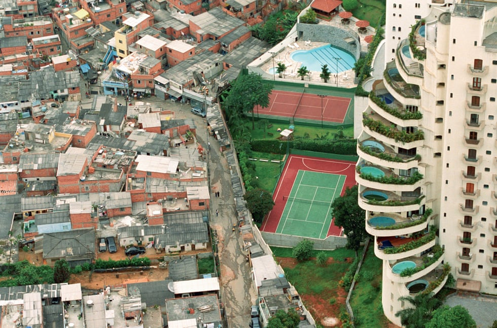

# Políticas do solo

Os instrumentos tradicionais da política de solo historicamente não se mostraram
capazes de satisfazer a grande demanda por imóveis urbanos nos países da AL,
especialmente no Brasil. A grande falência das políticas de solo podem ser
vistas nas periferias das grandes cidades. É claro que essas políticas [@suelo],
tem um papel em amenizar o problema -- através do combate à especulação
imobiliária, por exemplo -- que tem origem na própria história do
desenvolvimento dos países, mas elas não chegam a atacar o cerne desse problema.

```{r injustica, fig.cap = "Condomínio de classe alta ao lado da favela de Paraisópolis em São Paulo/SP."}

```
\bcenter
Fonte: @paraisopolis.
\ecenter

 
Como tratado no Capítulo \@ref(historico), o cerne do problema habitacional
do Brasil (e provavelmente em toda a América Latina), está na passagem do
modo de produção feudal para o modo de produção capitalista.

Deve tratar o Brasil, portanto, assim como os outros países da América Latina,
de saber como os países avançados -- hoje ditos desenvolvidos -- cujas
transições para o capitalismo  se deram através da chamada via prussiana,
trataram de resolver o problema habitacional nas grandes cidades, após a intensa
migração dos camponeses para as cidades.

Claro está que a solução vislumbrada por Rangel, de que a verdade reforma agrária
se daria através da queda "natural" do preço da terra, não se deu e mui 
provavelmente nunca se dará, haja vista que Rangel dava como certo o aumento das
taxas de juros (mais precisamente, da eficiência marginal do capital), o que não
ocorreu e, conforme visto no capítulo \@ref(economia), não se pode prever que 
acontecerá.

Claro está também que o pleno desenvolvimento do mercado financeiro, como 
exposto nos capítulos \@ref(economia) e \@ref(copulas) não deve trazer consigo
uma solução para o problema. Pelo contrário, o maior desenvolvimento de 
instrumentos financeiros, como foi visto, tende a gerar bolhas no mercado
imobiliário, o que tende a agravar o problema habitacional, prejudicando as
famílias de menor renda.

Segundo Harvey [-@harvey, 166]:

\begin{citacao}
Da Californa à Grécia, a crise produziu perdas de direitos e novas valores dos
ativos urbanos para a maioria da população, junto com a extensão do poder
capitalista predatório sobre as populações de baixa renda e até hoje
marginalizadas. Em resumo, foi um ataque indiscriminado sobre os comuns
reprodutivos e ambientais. Vivendo com menos de 2 dólares por dia, uma população
global de por volta de 2 bilhões de pessoas está sendo ludibriada pelo sistema
de microfinanças, sendo "o \emph{subprime} de todas as formas de \emph{subprime}
de crédito", para deles extrair riquezas (como aconteceu no mercado imobiliário
dos Estados Unidos por empréstimos \emph{subprime} predatórios seguidos por
execuções de hipotecas) para tornar ainda mais opulentas as mansões dos ricos
[...]. Não surpreende, portanto, que os pobres não apenas estejam entre nós, mas
que seu número aumente com o tempo, em vez de diminuir. Enquanto a Índia vem
acumulando um respeitável índice de crescimento ao longo dessa crise, por
exemplo, o número de bilionários saltou de 26 para 69 nos últimos três anos,
enquanto o número de favelados quase dobrou na última década. Os impactos
urbanos são estarrecedores conforme condomínios fechados, luxuosos e com
ar-condicionado surgem em meio ao abandono da miséria urbana, em que os pobres
lutam para construir algum tipo aceitável de existência para si mesmos.
\end{citacao}

Considera-se, porém, que o problema especulativo não é a raiz do problema.
Segundo Zizek [-@zizek2005, 220-221], não é possível retirar a especulação de
um suposto capitalismo puro: a especulação é a própria alma do processo 
produtivo. Sem a especulação imobiliária, inexistiria o mercado imobiliário. As
políticas de solo, portanto, que visam o combate da especulação imobiliária não
tem, portanto, papel maior do que o de paliativo, pois essas políticas não
podem ser radicais ao ponto de acabar com a especulação, haja vista que 
acabariam também por extinguir os empreendimentos imobiliários. Aliás, no Brasil,
as reformas microeconômicas de 2004 tiveram um forte papel no desenvolvimento do
crédito imobiliário, através da melhoria das condições de execuções de garantia,
propiciadas pela Lei 10.931/2004. A alta no crédito imobiliário fomentou a 
construção civil, setor responsável por puxar a economia naquele ciclo. No 
entanto, o que se viu, desde então, foi um aumento expressivo no valor dos 
imóveis, fazendo que, se por um lado houve aumento na oferta de imóveis, devido
à alta demanda reprimida, esse aumento da oferta veio acompanhado do aumento do
valor dos imóveis, o que dificultou ainda mais o acesso das camadas de menor 
renda à aquisição da casa própria.

Ainda, mesmo que fosse possível separar mercado imobiliário de especulação
imobiliária, mantendo o sistema capitalista de produção, espera-se ter 
demonstrado que, na atualidade, o problema ainda persistiria: está cada vez mais
nos fundamentos o problema dos preços elevados, não em grandes desvios de curto 
prazo (bolhas especulativas) dos preços em relação aos fundamentos econômicos, 
pois taxas de juros tão baixas tendem a valorizar ainda mais preço da terra.

Também a redução dos juros hipotecários, ao invés de ajudar, agrava o problema.
A redução dos juros, que como se mostrou, está na ordem natural das coisas, já
que as taxas dos créditos hipotecários acompanham as taxas de juros básicas, ou
seja, não se pode esperar que a solução para o problema habitacional tenha lugar
a partir de uma menor taxa de exploração dos mutuários.

Segundo @rolnik, na raiz da presente crise habitacional do Reino Unido está o 
descolamento do setor habitacional das políticas sociais, iniciado por Margaret 
Thatcher.

@terraredonda nos dá uma pista de como os países desenvolvidos lidaram com este
problema no passado: habitação sob domínio público. Claro, pois é inútil 
aguardar que a solução venha através do mercado. 

Segundo @terraredonda:

\begin{citacao}
Diferentes formas de valor sempre coexistiram, de modo desconfortável, com a
forma mercadoria. Sua coevolução na história recente dos mercados imobiliários
culminou no atual impasse, no qual a valorização especulativa determina que mais
da metade da população do planeta Terra não consiga encontrar um lugar decente
para viver em um ambiente de vida decente devido ao poder hegemônico do capital
sobre os mercados de terras e propriedades. Não precisa ser assim.

Ao terminar meu estudo recentemente, deparei-me com um folheto publicado pelo
"Conselho Metropolitano de Habitação de Nova York" em 1978. O título era
"Habitação sob o Domínio Público: A Única Solução". Em 1978, o "Departamento de
Habitação e Desenvolvimento Urbano" dos EUA tinha um orçamento de 83 bilhões de
dólares para ajudar a buscar essa solução. Cooperativas de capital limitado e
até fundos comunitários de terras estavam surgindo na maioria das grandes
cidades para oferecer soluções fora do mercado. Em 1983, o orçamento desse
Departamento havia sido reduzido para 18 bilhões de dólares, até ser abolido na
década de 1990 durante os anos Clinton. Quarenta anos depois, eu me pego
refletindo sobre as consequências desastrosas em todo o mundo de não se buscar
resolutamente a solução óbvia: habitação sob domínio público. O valor de uso
deve vir primeiro.
\end{citacao}

@harvey contextualiza a questão do direito à moradia dentro de uma conceito
maior, do direto à cidade. 

@jung2018 compara as políticas de habitação praticadas desde o início do século
XX no Brasil e na Inglaterra.