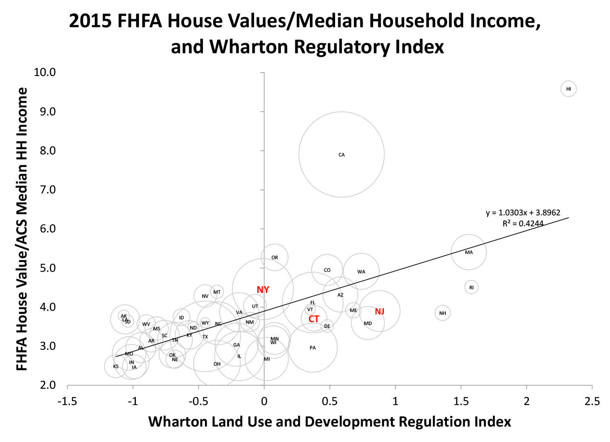
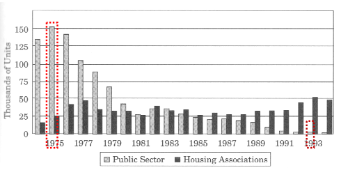

# Políticas do solo {#politicas}

Um dos objetivos deste trabalho é entender de onde viemos e onde estamos no
Brasil, em termos de desenvolvimento urbano, para tentar entender e definir os
rumos para onde vamos.

No capítulo \@ref(historico), espera-se ter respondido à primeira pergunta: de
onde viemos?, cuja resposta, resumidamente é: O Brasil é um país cujo processo
de desenvolvimento capitalista se deu através da **via prussiana**, que 
consiste no desenvolvimento do capitalismo sem a prévia execução de uma reforma
agrária no sentido de fixar no campo os pequenos agricultores. Isso ocasionou
um crescimento desornado dos principais polos urbanos, situação que persiste até
os dias de hoje.

Nos capítulos \@ref(economia) a \@ref(crise2008), espera-se ter respondido à 
segunda pergunta: onde estamos?, cuja resposta é: o Brasil é país capitalista
cuja economia de mercado está suficientemente desenvolvida e em compasso com o
resto do mundo. Com isto se quer dizer que não existe mais no Brasil um 
comportamento anômalo do preço dos imóveis em função de ciclos inflacionários 
que estiveram presente ao longo de boa parte da história econômica brasileira, 
que, em virtude da penalização da liquidez que promoviam, incentivavam a 
imobilização do capital, fazendo com que o preço da terra se elevasse nos 
períodos de fraca conjuntura[^6].

[^6]: No Brasil, durante grande parte do século XX, a inflação se elevava
durante os períodos de fraca conjuntura, ao contrário senso comum.

Desta maneira, pode-se dizer que hoje o Brasil não precisa desenvolver políticas
baseadas em ideias heterodoxas para o \gls{MI}, haja vista que o seu
funcionamento hoje se dá em linha com os \gls{MI} internacionais. Pelo contrário,
a experiência internacional, hoje, nos serve de referência. Obviamente que não
há nos países desenvolvidos, hoje, o problema crônico habitacional que se 
instalou no Brasil durante o seu processo de desenvolvimento econômico durante o
século XX, mas há nestes países hoje também um problema habitacional devido ao
processo de financeirização da moradia. 

...

## Regulação do \gls{MI}

Segundo @externalities [p. 209], a regulação do \gls{MI} deve ser pensada em
termos dos custos e benefícios da regulação. Enquanto os custos da regulação
geralmente são claros -- com mais regulação em um mercado, menos imóveis podem
ser construídos, portanto o preço de um imóvel neste mercado regulado é maior do
que o preço que se obteria se o mesmo mercado não tivesse regulação alguma, os
benefícios da regulação advém das diversas fontes de externalidades inerentes a
este mercado.

O custo da regulação de um mercado, segundo @malpezzi_affordable_2018, pode ser
entendido pela análise da Figura \@ref(fig:externalities), onde a oferta
privada, *i.e* a oferta que seria disponibilizada ao mercado sem regulação
alguma, é representada pela reta $O_1$ e a oferta incluindo o custo da regulação
é representada pela reta $O_2$: sem regulação, mais imóveis seriam ofertados
($Q_1$), e os preços seriam relativamente menores ($P_1$) do que os obtidos com
regulação ($P_2$). O custo regulatório do mercado pode ser geometricamente
representado pelo segmento de reta roxo na Figura \@ref(fig:externalities), que
mede a diferença entre o preço de equilíbrio do mercado regulado ($P_2$) e o
preço que se obteria para produzir a mesma quantidade ($Q_2$) com a oferta
privada.

Isto significa que um mercado regulado é menos eficiente do que um mercado sem 
regulação. Contudo, isto não deve ser interpretado como uma maneira de afastar 
qualquer tipo de regulação do \gls{MI}, pois os custos regulatórios, apesar de
não se expressarem em nível privado, dentro da relação comercial entre os 
consumidores e os incorporadores, realmente existem: para que o mercado opere
no nível $Q_1$, com preços $P_1$, a sociedade como um todo teria que bancar os 
custos regulatórios na forma de mais infraestrutura, mais congestionamento, e
outras tantas *externalidades*.

Enfim, uma boa regulação deve sempre buscar encontrar um ponto de equilíbrio
entre a perda de eficiêcia do \gls{MI} e os benefícios regulatórios impostos.


```{r externalities, fig.cap="Custo regulatório no \\gls{MI}."}
plot_labels <- data_frame(label = expression("D", "O[1]", "O[2]"),
                          x = c(1, 9, 9),
                          y = c(8.5, 8.5, 11.5))
points <- data.frame(x = c(5, 3.5, 3.5), y = c(5, 6.5, 3.5))

p1 <- ggplot(mapping = aes(x = x, y = y)) + 
  geom_segment(aes(x = 1, y = 1, xend = 9, yend = 9), color = "#0073D9", size = 1) + 
  geom_segment(aes(x = 1, y = 9, xend = 9, yend = 1), color = "#FF4036", size = 1) +
  geom_segment(aes(x = 1, y = 4, xend = 9, yend = 12), color = "#0073D9", size = 1) + 
  geom_segment(aes(x = 3.5, y = 3.5, xend = 3.5, yend = 6.5), color = "purple", size = 2) +
  geom_segment(aes(x = 5, y = 0, xend = 5, yend = 5), lty = "dotted") +
  geom_segment(aes(x = 0, y = 5, xend = 5, yend = 5), lty = "dotted") + 
  geom_segment(aes(x = 3.5, y = 0, xend = 3.5, yend = 6.5), lty = "dotted") +
  geom_segment(aes(x = 0, y = 6.5, xend = 3.5, yend = 6.5), lty = "dotted") + 
  geom_segment(aes(x = 0, y = 3.5, xend = 3.5, yend = 3.5), lty = "dotted") + 
  geom_text(data = plot_labels,
            aes(x = x, y = y, label = label), parse = TRUE) +
  geom_point(data = points, aes(x = x, y = y), size = 2) +
  labs(x = "Quantidade", y = "Preço") +
  theme_classic() + 
  coord_equal() +
  scale_x_continuous(expand = c(0, 0), breaks = c(3.5, 5), limits = c(0,13),
                     labels = expression(Q[1], Q[2])) +
  scale_y_continuous(expand = c(0, 0), breaks = c(3.5, 5, 6.5), limits = c(0,13),
                     labels = expression(P[3], P[1], P[2]))
p1
```
\bcenter
\small Fonte -- Adaptado de @malpezzi_affordable_2018.
\ecenter

Na prática, a teoria pode ser verificada através da aferição dos preços medianos
relativos de vários \gls{MI} em relação a um índice regulatório. É o que se vê
na Figura \@ref(fig:regulation-price), em que @malpezzi_affordable_2018 plota o
preço dos imóveis residenciais em relação a renda mediana em cada estado, contra
o índice regulatório Wharton para os estados da federação norte-americana. Nesta
Figura, os círculos são proporcionais a população de cada estado. Apesar de 
alguns *outliers*, nota-se uma correlação relativamente forte entre regulação e 
os preços dos imóveis residenciais.

```{r regulation-price, fig.cap="Preços em função do índice regulatório do \\gls{MI}."}

```
\bcenter
\small Fonte -- @malpezzi_affordable_2018.
\ecenter

### Externalidades

Externalidades são custos que são impostos às partes fora de uma transação 
econômica [@malpezzi_affordable_2018]. Entre as possíveis externalidades do
\gls{MI} que causam aumentos dos preços dos imóveis se encontram 
[@externalities, p. 210-211]:

1. Congestionamento;
2. Impactos ambientais;
3. Custos de infraestrutura;
4. Efeitos fiscais e;
5. Efeitos de composição da vizinhança.

No entanto, nem todas as externalidades devem ser associadas a um aumento de 
custos [@externalities, p. 212]:

1. Produtividade e emprego;
2. Benefícios de saúde;
3. Integração racial e;
4. Benefícios relacionados a propriedade de um imóvel.

### Por que os governos devem intervir?

Existem diversos motivos segundo os quais o governo deve intervir em um mercado.
Falhas de mercado podem ocorrer devido a...

Existem diversas formas de interferência governamental na Economia. Segundo 
@urbandevelopment [p. 6], governos do mundo todo intervem nos mercados através 
da:

1. definição e aplicação dos direitos de propriedade;
2. taxação;
3. concessão de subsídios;
4. regulação e planejamento e;
5. provisão pública direta.

...

Os problemas do funcionamento do \gls{MI} tem de ser equacionados tanto do lado
da demanda quanto do lado da oferta, embora o lado da oferta seja muitas vezes
negligenciado. Do lado da demanda incentiva-se o \gls{MI} através da 
disponibilização de crédito, concessão de aluguel social (*vouchers*), subsídios
de diversas espécies e outros. Já do lado da oferta deve-se pensar em mecanismos
que incentivem o aumento da oferta através de uma regulação menos restringente,
por exemplo, ou através da implantação de infraestrutura que possibilite 
expandir os limites urbanos, aumento assim as áreas loteáveis.

### Programas habitacionais

Segundo @malpezzi_affordable_2018_1, uma política habitacional efetiva e robusta
deve ter uma abordagem dupla: reformar o ambiente regulatório de maneira a
permitir uma melhor resposta do lado da oferta, com menos restrições
construtivas; e, na questão das moradias para famílias de baixa renda, mudar da
concessão de subsídios proporcionados para edificações específicas -- *i.e.* de
subsídios concedidos do lado da oferta para a construção de habitações populares, 
para os subsídios focados nas pessoas, como o aluguel social ou locação social.

Deve-se ponderar, no entanto, que isto é válido para o mercado norte-americano e
pode não se aplicar a outros mercados imobiliários, como no Brasil, devido às
particularidades de cada um. No entanto, o esquema geral da análise de 
@malpezzi_affordable_2018_1 é válido e interessante para a aplicação em outros
mercados.

#### Programas habitacionais que atuam pelo lado da oferta

Tradicionalmente os programas de promoção da moradia focam na concessão de
subsídios do lado da oferta: desde a construção pelo próprio estado da habitação
social (moradias populares), através das CDHU, até a concessão de subsídios para
a construção de projetos específicos, como o \gls{PMCMV}. No entanto, haja vista
que a moradia própria, no Brasil, assim como nos EUA e talvez no mundo todo, não
é um direito (*entitlement*) do cidadão, que ele pode requerer a qualquer
momento, mas uma concessão, sujeita a uma restrição orçamentária, o que acaba
causando a violação do princípio da equidade horizontal, ou seja, o princípio
segundo o qual o Estado deveria tratar igualmente os iguais
[@malpezzi_affordable_2018_2]: nestes programas, enquanto uma parte da população
de baixa renda é agraciada com uma unidade habitacional, outra parte da
população não recebe nada. 

Nos EUA, segundo @malpezzi_affordable_2018_2, apenas um terço dos cidadãos 
elegíveis são contemplados com algum dos benefícios de promoção de moradia digna.

Outros problemas com os programas de incentivo à moradia digna se situam na 
questão da eficiência. @malpezzi_affordable_2018_1 estabelece três princípios de
eficiência aplicáveis aos programas habitacionais do \gls{MI}: a eficiência da
produção, a eficiência da transferência e a eficiência administrativa.

A eficência da produção diz respeito ao custo pago pelo governo para a construção
de uma unidade, comparado com o custo do produtor mais eficiente do mercado. 

A eficiência administrativa diz respeito à burocracia necessária para a 
operacionalização dos programas, o que, em geral, não é desprezível.

Já a eficiência da transferência é mais complexa. 

Uma ilustração de como medir a eficiência da transferência pode ser  vista na
Figura \@ref(fig:eficiencia), onde a curva $D$ representa a curva de preferência
do consumidor (e não a demanda do mercado!), de maneira que ao preço de mercado
$P_m$, a escolha do consumidor seria comprar uma unidade com $Q_m$ $m^2$.

Suponha que o governo ofereça uma unidade habitacional com um desconto razoável 
($P_c$) em relação aos preço de mercado ($P_m$). Ao preço $Q_c$, no entanto, a
escolha do consumidor seria comprar $\tilde{Q}$ unidades de área, mas apenas lhe
é oferecida a possibilidade de comprar $Q_c$ unidades ao preço $P_c$. Desta
maneira, segundo @malpezzi_affordable_2018_1, a preferência do consumidor é 
violada e, ao mesmo tempo em que ele ganha o bem-estar por poder comprar $Q_c$ 
unidades a um preço $(P_m-P_c)$, igual a área do retângulo $a-b-c-d$ da Figura
\@ref(fig:eficiencia), ele perde bem-estar de magnitude igual à área do 
triângulo $e-c-f$. Assim, geometricamente, se a área $a-b-c-d$ é maior do que a 
área do triângulo $e-c-f$, o consumidor estará obtendo um benefício líquido e 
optará pela compra da unidade subsidiada. Caso contrário, o benefício líquido
seria negativo e o consumidor optaria por não comprar a unidade.

```{r eficiencia, fig.cap=""}
plot_labels <- data_frame(label = expression("D", "P[m]", "P[c]", "d", "c", "e", "f"),
                          x = c(1,     9, 9, 3.25, 3.25, 3.5, 5.5),
                          y = c(8.5, 5.5, 4, 3.25, 5.25, 7, 5.5))
points <- data.frame(x = c(5, 3.5, 3.5, 3.5, 0, 0), y = c(5, 6.5, 3.5, 5, 3.5, 5))

p1 <- ggplot(mapping = aes(x = x, y = y)) + 
  geom_segment(aes(x = 1, y = 9, xend = 9, yend = 1), color = "#FF4036", size = 1) +
  geom_hline(aes(yintercept = 5)) +
  geom_hline(aes(yintercept = 3.5)) +
  geom_segment(aes(x = 5, y = 0, xend = 5, yend = 5), lty = "dotted") +
  geom_segment(aes(x = 0, y = 5, xend = 5, yend = 5), lty = "dotted") + 
  geom_segment(aes(x = 3.5, y = 0, xend = 3.5, yend = 6.5), lty = "dotted") +
  geom_segment(aes(x = 0, y = 3.5, xend = 3.5, yend = 3.5), lty = "dotted") + 
  geom_segment(aes(x = 6.5, y = 0, xend = 6.5, yend = 3.5), lty = "dotted") +
  geom_text(data = plot_labels,
            aes(x = x, y = y, label = label), parse = TRUE) +
  geom_point(data = points, aes(x = x, y = y), size = 2) +
  labs(x = expression("Quantidade"~(m^2)), y = expression("Preço por "~m^2)) +
  theme_classic() + 
  coord_equal() +
  scale_x_continuous(expand = c(0, 0), breaks = c(3.5, 5, 6.5), limits = c(0,13),
                     labels = expression(Q[c], Q[m], tilde(Q))) +
  scale_y_continuous(expand = c(0, 0), breaks = c(3.5, 5), limits = c(0,13),
                     labels = expression(b, a))
p1
```
\bcenter
\small Fonte -- Adaptado de @malpezzi_affordable_2018_1.
\ecenter

A eficiência é simplesmente a razão entre o benefício líquido obtido pelo
consumidor ($\overline{a-b-c-d} - \overline{e-c-f}$) e o custo de transferência
arcada pelo governo ($a-b-c-d$).

Os programas habitacionais que atuam pelo lado da oferta, nos EUA, tem
eficiência média de transferência de 72%. A eficiência de produção de moradias 
públicas, nos EUA, segundo diversos estudos, é, em média, de 63%.

A eficiência microeconômica total é o produto das três eficiência citadas. A
eficiência adminstrativa não foi medida e não deve ser muito importante em
termos comparativos (cada programa exigirá um tipo de burocracia diferente, mas
sempre será necessária alguma burocracia para a operacionalização de cada 
programa). Deste modo, a eficiência microeconômica, desconsiderando-se a 
eficiência admnistrativa, é, em média, nos EUA, para o programa de construção de
moradias sociais, de 47% ($0,63 \cdot 0,73$) [@malpezzi_affordable_2018_1].

Além disto, programas de construção de habitações promovidos pelos governos
tem efeitos que podem ser ruins sobre a oferta privada. Isto pode ser 
compreendido através da Figura @\ref(fig:cohab): considere-se um mercado em 
equilíbrio com preços em nível $P_1$ e quantidades $Q_1$, até que entre em vigor 
um programa habitacional do governo, que tenderá a diminuir a demanda privada, 
levando, no curto prazo, para o preço de equilíbrio $P_2$. Com os preços 
reduzidos no mercado privado, no médio prazo a tendência é que algumas unidades 
do mercado privado sejam remodeladas para outros usos e outras abandonadas, de 
maneira que o estoque tende a cair para $Q_2$ e os preços do mercado privado
sobem para $P_3$. No longo prazo, a tendência é que mais e mais unidades saim
do estoque privado e os preços voltam ao preço original de equilíbrio $P_1$.

```{r cohab, fig.cap="Custo regulatório no \\gls{MI}."}
plot_labels <- data_frame(label = expression("O[1]", "O[2]", "D[2]", "D[1]"),
                          x = c(5.5, 9, 1, 2),
                          y = c(12, 8.5, 10.5, 12.5))
points <- data.frame(x = c(5, 5, 4, 2), y = c(6, 9, 7, 9))

p1 <- ggplot(mapping = aes(x = x, y = y)) + 
  geom_segment(aes(x = 1, y = 5, xend = 9, yend = 10), color = "#0073D9", size = 1) + 
  geom_segment(aes(x = 1, y = 10, xend = 10, yend = 1), color = "#FF4036", size = 1) +
  geom_segment(aes(x = 2, y = 12, xend = 11, yend = 3), color = "#FF4036", size = 1) +
  #geom_segment(aes(x = 1, y = 4, xend = 9, yend = 12), color = "#0073D9", size = 1) + 
  geom_vline(aes(xintercept = 5), color = "#0073D9", size = 1) +
  geom_segment(aes(x = 5, y = 6, xend = 5, yend = 9), color = "purple", size = 2) +
  geom_segment(aes(x = 2, y = 0, xend = 2, yend = 12), lty = "dotted") +
  geom_segment(aes(x = 0, y = 6, xend = 5, yend = 6), lty = "dotted") + 
  geom_segment(aes(x = 4, y = 0, xend = 4, yend = 7), lty = "dotted") +
  geom_segment(aes(x = 0, y = 7, xend = 4, yend = 7), lty = "dotted") + 
  geom_segment(aes(x = 0, y = 9, xend = 5, yend = 9), lty = "dotted") + 
  geom_text(data = plot_labels,
            aes(x = x, y = y, label = label), parse = TRUE) +
  geom_point(data = points, aes(x = x, y = y), size = 2) +
  labs(x = "Quantidade", y = "Preço") +
  theme_classic() + 
  coord_equal() +
  scale_x_continuous(expand = c(0, 0), breaks = c(2, 4, 5), limits = c(0,13),
                     labels = expression(Q[3], Q[2], Q[1])) +
  scale_y_continuous(expand = c(0, 0), breaks = c(6, 7, 9), limits = c(0,13),
                     labels = expression(P[2], P[3], P[1]))
p1
```
Deve-se ter em mente que tal programa será bem avaliado pelo contemplado, o 
consumidor privado também acabará sendo beneficiado por uma redução de preços de
curto/médio prazos, porém o programa desincentiva o mercado privado e afeta os
proprietários de imóveis neste mercado quando do lançamento do programa.

#### Programas habitacionais que atuam pelo lado da demanda

Do ponto de vista microeconômico, os incentivos habitacionais que atuam pelo 
lado da demanda são mais eficientes (82%), segundo @malpezzi_affordable_2018_1.
Porém, este cálculo supõe que os preços não se alteram com a emissão de 
*vouchers* para aluguéis, por exemplo, o que nem sempre pode ser verdade.

Na Figura \@ref(fig:vouchers) é apresentado como o programa de distribuição de
*vouchers* (aluguel social) deve impactar o mercado: no curto prazo, a oferta
está dada ($O_1$) quando da emissão dos *vouchers*, portanto o preço de
equilíbrio original se altera (no caso, dos aluguéis) de $P_1$ para $P_2$, por
conta do repentino aumento da demanda (deslocamento de $D_1$ para $D_2$). No
entanto, a médio prazo, a oferta aumenta com o aumento dos preços ($O_2$): a
quantidade oferta passa a ser $Q_2$ e o preço passa para $P_3$. Se a oferta for
elástica no longo prazo, a quantidade de unidades ofertadas para aluguel vai
aumentar paulatinamente até que os preços voltam a $P_1$, correspondentes agora
a uma quantidade maior $Q_3$.

```{r vouchers, fig.cap="Custo regulatório no \\gls{MI}."}
plot_labels <- data_frame(label = expression("O[1]", "O[2]", "D[1]", "D[2]"),
                          x = c(5.5, 9, 1, 3),
                          y = c(12, 8.5, 8.5, 10.5))
points <- data.frame(x = c(5, 5, 7, 9), y = c(5, 9, 7, 5))

p1 <- ggplot(mapping = aes(x = x, y = y)) + 
  geom_segment(aes(x = 1, y = 1, xend = 9, yend = 9), color = "#0073D9", size = 1) + 
  geom_segment(aes(x = 1, y = 9, xend = 9, yend = 1), color = "#FF4036", size = 1) +
  geom_segment(aes(x = 3, y = 11, xend = 11, yend = 3), color = "#FF4036", size = 1) +
  #geom_segment(aes(x = 1, y = 4, xend = 9, yend = 12), color = "#0073D9", size = 1) + 
  geom_vline(aes(xintercept = 5), color = "#0073D9", size = 1) +
  geom_segment(aes(x = 5, y = 5, xend = 5, yend = 9), color = "purple", size = 2) +
  geom_segment(aes(x = 9, y = 0, xend = 9, yend = 5), lty = "dotted") +
  geom_segment(aes(x = 0, y = 5, xend = 9, yend = 5), lty = "dotted") + 
  geom_segment(aes(x = 7, y = 0, xend = 7, yend = 7), lty = "dotted") +
  geom_segment(aes(x = 0, y = 7, xend = 7, yend = 7), lty = "dotted") + 
  geom_segment(aes(x = 0, y = 9, xend = 5, yend = 9), lty = "dotted") + 
  geom_text(data = plot_labels,
            aes(x = x, y = y, label = label), parse = TRUE) +
  geom_point(data = points, aes(x = x, y = y), size = 2) +
  labs(x = "Quantidade", y = "Preço") +
  theme_classic() + 
  coord_equal() +
  scale_x_continuous(expand = c(0, 0), breaks = c(5, 7, 9), limits = c(0,13),
                     labels = expression(Q[1], Q[2], Q[3])) +
  scale_y_continuous(expand = c(0, 0), breaks = c(7, 5, 9), limits = c(0,13),
                     labels = expression(P[3], P[1], P[2]))
p1
```
\bcenter
\small Fonte -- Adaptado de @malpezzi_affordable_2018_2.
\ecenter

Desta maneira, segundo @malpezzi_affordable_2018_2, o parâmetro chave o mercado
é a elasticidade da oferta: se a oferta for bem elástica, no longo prazo,
programas governamentais que atuam pelo lado da oferta não tem efeito nos
preços, mas aumentam o estoque, já que a oferta aumenta para atender a nova
demanda. Por outro lado, se a oferta for inelástica, os preços sobem e não há
um aumento no estoque, já que a oferta não acompanha a maior demanda.

#### Considerações

Como visto nos itens anteriores, os programas habitacionais que atuam pelo lado
da oferta, além de ter uma maior eficiência, estimulam o mercado privado e podem
não ter efeito sobre os preços, caso a oferta do mercado seja elástica. Desta 
maneira, justifica-se a dupla abordagem proposta por 
@malpezzi_affordable_2018_1: atuar do lado da da demanda na disponibilização de
*vouchers* para as famílias de baixa renda, buscando universalizar o máximo 
possível o acesso a estes *vouchers*, evitando assim os problemas de inequidade
horizontal e reformar os mercados de maneira a tornar a oferta do mercado
habitacional elástica, que é o assunto da próxima seção.

## Instrumentos de política de solo

Os instrumentos tradicionais da política de solo historicamente não se mostraram
capazes de satisfazer a grande demanda por imóveis urbanos nos países da \gls{AL},
especialmente no Brasil. A grande falência das políticas de solo podem ser
vistas nas periferias das grandes cidades. É claro que essas políticas [@suelo],
tem um papel em amenizar o problema -- através do combate à especulação
imobiliária, por exemplo -- que tem origem na própria história do
desenvolvimento dos países, mas elas não chegam a atacar o cerne desse problema,
já que não são concebidas para isto. Em linhas gerais, as políticas do solo
tradicionais tem uma função regulatória, no sentido de orientar o funcionamento
do mercado imobiliário. O problema, no entanto, é que o mercado imobiliário,
por si só, não tem a capacidade de resolver todos os problemas decorrentes da
crise agrária, como descrita no capítulo \@ref(historico). Intervenções estatais
de grande vulto se fazem necessárias, especialmente para as populações de baixa
renda. A regularização fundiária pode ter um papel neste sentido, mas na 
atualidade esta política tem sido utilizada apenas timidamente, beneficiando 
apenas um pequeno número de famílias.


```{r injustica, fig.cap = "Condomínio de classe alta ao lado da favela de Paraisópolis em São Paulo/SP."}
knitr::include_graphics("images/injustica_SP.jpg")
```
\bcenter
Fonte: @paraisopolis.
\ecenter

 Como tratado no Capítulo \@ref(historico), o cerne do problema habitacional
do Brasil (e provavelmente em toda a \gls{AL}), está na crise agrária, 
*i.e*, na passagem do modo de produção feudal para o modo de produção 
capitalista.

Deve tratar o Brasil, portanto, assim como os outros países da \gls{AL},
de saber como os países avançados -- hoje ditos desenvolvidos -- cujas
transições para o capitalismo  se deram através da chamada via prussiana,
trataram de resolver o problema habitacional nas grandes cidades, após a intensa
migração dos camponeses para as cidades.

Claro está que a solução vislumbrada por Rangel, de que a verdadeira reforma
agrária se daria através da queda "natural" do preço da terra, não se deu e mui
provavelmente nunca se dará, haja vista que Rangel dava como certo o aumento das
taxas de juros (mais precisamente, da eficiência marginal do capital), o que não
ocorreu e, conforme visto no capítulo \@ref(economia), não se pode prever que
acontecerá.

Claro está também que o pleno desenvolvimento do mercado financeiro, como 
exposto no capítulo \@ref(crise2008)) não deve trazer consigo
uma solução para o problema. Pelo contrário, o maior desenvolvimento de 
instrumentos financeiros, como foi visto, tende a gerar bolhas no mercado
imobiliário, o que tende a agravar o problema habitacional, prejudicando as
famílias de menor renda.

O que se nota hoje nos países desenvolvidos é uma grave crise habitacional, 
apesar de todo o desenvolvimento dos seus mercados financeiros, da baixa 
informalidade e dos baixos juros que sempre tiveram, se comparados aos países em
desenvolvimento [@housing-europe; @california]. 

Considera-se, porém, que o problema especulativo não é a raiz do problema.
Segundo Zizek [-@zizek2005, 220-221], não é possível retirar a especulação de um
suposto capitalismo puro: a especulação é a própria alma do processo produtivo
no sistema capitalista. Sem a especulação imobiliária, inexistiria o mercado
imobiliário. As políticas de solo, portanto, que visam o combate da especulação
imobiliária não tem, portanto, papel maior do que o de paliativo, pois essas
políticas não podem ser radicais ao ponto de acabar com a especulação, haja
vista que acabariam também por extinguir os empreendimentos imobiliários. Aliás,
no Brasil, as reformas microeconômicas de 2004 tiveram um forte papel no
desenvolvimento do crédito imobiliário, através da melhoria das condições de
execuções de garantia, propiciadas pela Lei 10.931/2004. A alta no crédito
imobiliário fomentou a construção civil, setor responsável por puxar a economia
naquele ciclo. No entanto, o que se viu, desde então, foi um aumento expressivo
no valor dos imóveis, fazendo que, se por um lado houve aumento na oferta de
imóveis, devido à alta demanda reprimida, esse aumento da oferta veio
acompanhado do aumento do valor dos imóveis, o que dificultou ainda mais o
acesso das camadas de menor renda à aquisição da casa própria.

Ainda, mesmo que fosse possível separar mercado imobiliário de especulação
imobiliária, mantendo o sistema capitalista de produção, espera-se ter 
demonstrado que, na atualidade, o problema ainda persistiria: está cada vez mais
nos fundamentos o problema dos preços elevados, não em grandes desvios de curto 
prazo (bolhas especulativas) dos preços em relação aos fundamentos econômicos, 
pois taxas de juros tão baixas tendem a valorizar ainda mais preço da terra.

Também a redução dos juros hipotecários, ao invés de ajudar, como seria de se
esperar, tende a agravar o problema, como foi visto no capítulo \@ref(economia),
dado que o aumento do valor dos imóveis é exponencial com a queda das taxas de
juros. A redução dos juros, como se mostrou, está na ordem natural das
coisas, já que as taxas dos créditos hipotecários acompanham as taxas de juros
básicas.Ou seja, não se pode esperar que a solução para o problema habitacional
tenha lugar a partir de uma menor taxa de exploração dos mutuários.

Segundo @terraredonda, ainda, esse aumento dos preços dos imóveis parece ter
efeito de beneficiar os proprietários, mas esses não são os principais 
beneficiados:

\begin{citacao}
O rápido aumento dos preços dos imóveis parece beneficiar os proprietários, mas
os principais beneficiários são, de fato, os bancos, as instituições de crédito
e os grandes conglomerados e \emph{hedge funds} que aderiram ao jogo
especulativo.
Isso ficou evidente quando veio o \emph{crash}. Os bancos foram socorridos e os
donos das habitações foram jogados aos tubarões da bolsa de valores. Nos EUA,
milhões perderam suas casas para execução de hipotecas em 2007-10, enquanto no
setor de aluguéis o ritmo de despejos de populações de baixa renda acelerou em
todos os lugares, com consequências sociais devastadoras. Os \emph{hedge funds}
e as empresas de \emph{private equity} compraram casas hipotecadas a preços de
liquidação relâmpago e agora estão ganhando uma bolada em suas operações. No que
restou do setor público, a austeridade levou à falta de manutenção e à
deterioração do parque habitacional, até o ponto em que, como nos foi dito,
apenas a privatização melhoraria as coisas.
\end{citacao}

@terraredonda nos dá uma pista de como os países desenvolvidos lidaram com este
problema no passado: habitação sob domínio público, ou simplesmente habitação
social. Claro, pois é inútil aguardar que a solução venha através do mercado. 

Segundo @terraredonda:

\begin{citacao}
Diferentes formas de valor sempre coexistiram, de modo desconfortável, com a
forma mercadoria. Sua coevolução na história recente dos mercados imobiliários
culminou no atual impasse, no qual a valorização especulativa determina que mais
da metade da população do planeta Terra não consiga encontrar um lugar decente
para viver em um ambiente de vida decente devido ao poder hegemônico do capital
sobre os mercados de terras e propriedades. Não precisa ser assim.

Ao terminar meu estudo recentemente, deparei-me com um folheto publicado pelo
"Conselho Metropolitano de Habitação de Nova York" em 1978. O título era
"Habitação sob o Domínio Público: A Única Solução". Em 1978, o "Departamento de
Habitação e Desenvolvimento Urbano" dos EUA tinha um orçamento de 83 bilhões de
dólares para ajudar a buscar essa solução. Cooperativas de capital limitado e
até fundos comunitários de terras estavam surgindo na maioria das grandes
cidades para oferecer soluções fora do mercado. Em 1983, o orçamento desse
Departamento havia sido reduzido para 18 bilhões de dólares, até ser abolido na
década de 1990 durante os anos Clinton. Quarenta anos depois, eu me pego
refletindo sobre as consequências desastrosas em todo o mundo de não se buscar
resolutamente a solução óbvia: habitação sob domínio público. O valor de uso
deve vir primeiro.
\end{citacao}

Segundo @rolnik, no entanto, na raiz da atual crise habitacional do Reino Unido
está o descolamento do setor habitacional das políticas sociais, iniciado por
Margaret Thatcher. Com o desenvolvimento econômico, os países desenvolvidos
acabaram por abandonar estes programas sociais, em troca de soluções de
mercado.

@harvey contextualiza a questão do direito à moradia dentro de uma conceito
maior, do direto à cidade. Segundo Harvey [-@harvey, 166]:

\begin{citacao}
Da Californa à Grécia, a crise produziu perdas de direitos e novas valores dos
ativos urbanos para a maioria da população, junto com a extensão do poder
capitalista predatório sobre as populações de baixa renda e até hoje
marginalizadas. Em resumo, foi um ataque indiscriminado sobre os comuns
reprodutivos e ambientais. Vivendo com menos de 2 dólares por dia, uma população
global de por volta de 2 bilhões de pessoas está sendo ludibriada pelo sistema
de microfinanças, sendo "o \emph{subprime} de todas as formas de \emph{subprime}
de crédito", para deles extrair riquezas (como aconteceu no mercado imobiliário
dos Estados Unidos por empréstimos \emph{subprime} predatórios seguidos por
execuções de hipotecas) para tornar ainda mais opulentas as mansões dos ricos
[...]. Não surpreende, portanto, que os pobres não apenas estejam entre nós, mas
que seu número aumente com o tempo, em vez de diminuir. Enquanto a Índia vem
acumulando um respeitável índice de crescimento ao longo dessa crise, por
exemplo, o número de bilionários saltou de 26 para 69 nos últimos três anos,
enquanto o número de favelados quase dobrou na última década. Os impactos
urbanos são estarrecedores conforme condomínios fechados, luxuosos e com
ar-condicionado surgem em meio ao abandono da miséria urbana, em que os pobres
lutam para construir algum tipo aceitável de existência para si mesmos.
\end{citacao}


## Breve histórico das políticas habitacionais e urbanas 

Gonzalez [-@jung2018] compara as políticas de habitação praticadas desde o
início do século XX no Brasil e na Inglaterra. De acordo com Gonzales
[-@jung2018, 165], a diferença principal entre os dois países, além dos aspectos
cronológicos, é que enquanto no Brasil houve uma opção clara pela construção de
grandes conjuntos habitacionais, geralmente periféricos, na Inglaterra optou-se
por um balanço entre grandes conjuntos e núcleos urbanísticos do tipo
Cidade-Jardim, *new towns*, aluguel social e revitalização urbana. Ainda segundo
Gonzales, o que se observou também nos dois países é que em grandes conjuntos
habitacionais onde priorizam-se a quantidade de imóveis em detrimento da sua
qualidade, estes acabam por serem rejeitados pela população.

Segundo Rolnik [*apud* @jung2018, 165-166]:

\begin{citacao}
A principal característica dos assentamentos precários é a ausência de
infraestrutura – água, luz, esgoto, rede elétrica, iluminação pública,
pavimentação, etc. Nesse sentido há algumas semelhanças entre a precariedade de
lá e a daqui. Mas nos países desenvolvidos as favelas aparecem aqui e ali,
residualmente. Raramente se permite que uma região fique abandonada por muito
tempo. Já aqui, é comum encontrar até neto dos primeiros moradores de uma favela
vivendo em condições similares às que viviam seus avós. Temos assentamentos
precários com até 50 anos de existência. A favela é elemento estrutural do
processo de urbanização. Ou seja, desde sua concepção, o modelo de urbanização
adotado não acolhe os pobres. Vou dar um exemplo. Na Inglaterra, desde a década
de 50, todo novo empreendimento imobiliário deve destinar parte de seu terreno
às moradias populares. Houve interesse, desde a aceleração do processo de
urbanização, de incluir quem não tinha acesso à moradia. No Brasil, não existe
uma política de uso do solo urbano desenhada para acolher a habitação social.
Aqui a política habitacional se limita ao crédito para a indústria da construção
civil. Mas de que adianta esse crédito se ele só viabiliza a construção de casas
de quinta categoria a 50 quilômetros da cidade? Estamos perpetuando a
precariedade
\end{citacao}

Apesar das políticas habitacionais avançadas executadas durante a primeira 
metade do século XX, porém, à partir do *Housing Act*, de 1980, que instituiu o
*Right to buy*, ou direito de comprar (das habitações de interesse social), a 
lógica do mercado, do neoliberalismo Tatcherista, voltou a prevalecer: o 
resultado é que já em fins dos anos 80, com o aumento dos preços dos imóveis e a
ausência de intervenções públicas, o índice de desabrigados na cidade de Londres
já era novamente muito alto [@jung2018, 72].

De fato, a produção de novas unidades habitacionais diminui de maneira drástica,
especialmente pela abrupta diminuição das unidades construídas pelo setor 
público, o que pode ser visto na figura \@ref(fig:inglaterra-unidades). 

```{r inglaterra-unidades, fig.cap="Construções de novas unidades habitacionais na Inglaterra, de 1974 a 1994."}

```
\bcenter
Fonte: VARADY, 1998 [*apud* @jung2018, 73].
\ecenter

Como se pode perceber, ainda, a diminuição da produção de unidades habitacionais
pelo poder público não foi compensada por um aumento na produção de unidades 
pelo setor privado.

Após o ano 2000 diversas tentativas foram feitas pelos governos trabalhistas de
Tony Blair, sem resultados animadores, contudo. Com o intuito de evitar criar
guetos, nos moldes atuais, é exigido dos empreendedores que ao menos 40% das
unidades construídas sejam destinadas à habitação social (*affordable housing*),
sendo que a qualidade construtiva destas habitações sociais deve ser a mesma das
demais unidades do empreendimento, com excessão da metragem quadrada, o que 
parece ser uma tendência [@jung2018, 77].

### O sanitarismo como propulsor das políticas habitacionais

Segundo Poleto [-@poleto, 36], dada a incapacidade do mercado, logo após a
revolução industrial, de suprir as condições de moradia digna para a classe
trabalhadora, a intervenção estatal foi necessária, ainda que de forma
inicialmente tímida e pontual.

Para Poleto [-@poleto, 37], na Holanda, país pioneiro neste tipo de intervenção
estatal para construção de habitações sociais, estas intervenções se deram 
principalmente devido às crises da epidemia de cólera de meados do século XIX,
"que acometiam principalmente as regiões com habitações mais pobres, atrelando
dessa forma a condição de moradia a uma questão de saúde pública".

\begin{citacao}
Na Holanda, de 1888 a 1895, diversos estudos e ações do Estado holandês, que até
hoje é monárquico, delegou e exigiu das municipalidades que se
responsabilizassem pela infraestrutura, incluindo o abastecimento de água, luz,
gás, transporte coletivo (bondes) e telefonia.
Decorrente daí, em 1894, foi elaborado um relatório sobre a questão da habitação
social, com o objetivo de alicerçar uma legislação que permitisse às
municipalidades desapropriarem terras e edifícios urbanos visando à erradicação
de cortiços, gerando, a partir desse Relatório, a Leis de Habitação, decretada
em 1902.
\cite[p.~317]{poleto}
\end{citacao}

Da mesma maneira, devido à atual pandemia de COVID-19, concomitante com esta
grave crise urbana que já se estava alimentando há alguns anos, é evidente que 
a tendência é que haja mobilização pela volta da intervenção estatal para a 
construção de habitações sociais, tanto no Brasil como no mundo.

A experiência de países como a Finlândia, mostram que a concessão
de habitação permanente aos desabrigados pode, inclusive, ser uma solução mais
rentável do que prover abrigos temporários e que esta intervenção deve ocorrer
da maneira mais rápida possível, pois a tendência é que as pessoas desabrigadas
venham a apresentar outros problemas decorrentes dessa condição, o que tende
a aumentar ainda mais os problemas sociais o que, em consequência, acaba por
aumentar os gastos sociais [@finlandia].

### Cooperativas habitacionais

Nos primórdios do capitalismo nos países hoje dito desenvolvidos, dada a 
impossibilidade do mercado suprir a demanda por habitações acessíveis para os
trabalhadores, houve uma série de intervenções do estado, ao lado da filantropia,
no sentido de tentar prover habitações em condições salubres aos operários.

Neste quesito teve pioneirismo a Holanda, especialmente após as crises de cólera
em meados do século XIX, que acometiam especialmente as regiões mais pobres e 
insalubres. 

Datam de 1868 a existência de cooperativas operárias que, em conjunto com as 
administrações locais tentavam suprir as necessidades de habitações para a 
classe trabalhadora.

A primeira legislação no sentido de regulamentar e incentivar a produção de
habitação atrelada à planejamentos municipais foi o Ato Habitacional
(*Woningwet*), de 1901, na Holanda. Esta lei pioneira foi criada baseada em um
diagnóstico da Sociedade para o Bem-Estar Geral 
(*Maatschappij tot nut van t'algemeen*) de 1887, posteriormente publicados em 
1894 no documento "A Questão da Habitação Social".

Em 1902 o Ato Habitacional foi aprovado pela coroa holandesa que atribuiu às
administrações locais o direito, dever e meios financeiros para o 
estabelecimento de planos de extensão para desapropriar imóveis considerados
insalubres, adquirir áreas e construir diretamente ou oferecer empréstimos para
cooperativas ou sociedades de promoção de moradias populares.

Na Alemanha a legislação também fomentou o crescimento das cooperativas
habitacionais (em 1924 foi instituída uma taxa de 15% sobre o aluguel das
habitações já construídas para alavancar os fundos federais para construção
habitacional) e as próprias administrações muncipais tinham a função de atuar no
desenho urbano para possibilitar a produção em massa de habitação. Esta
interação levou à construção de 130.000 unidades habitacionais entre 1924 e
1930, sendo que em algumas cidades como Berlim os conjuntos habitacionais foram
amplamente divulgados e reconhecidos nos meios arquitetônicos, adquirando valor
emblemático na história da arquitetura do século XX [@poleto, 90].

\begin{citacao}
Na Alemanha, também as prefeituras eram encarregadas de projetar, por 
seus próprios arquitetos, ou **supervisionar o trabalho das cooperativas e 
associações no projeto das habitações**, construí-las ou supervisionar a 
construção integralmente como foram planejadas, além de determinar o 
financiamento.
Tanto na Holanda, quanto na Alemanha, com o objetivo de minimizar ou 
impedir a inadimplência, **o financiamento para a casa jamais era concedido 
diretamente ao mutuário, como pessoa física, mas para cooperativas municipais**.
\cite[p.~317-318]{poleto}
\end{citacao}

## Instrumentos de política do solo

### Estatuto da Cidade

O Estatuto da Cidade (lei 10.257, de 10 de julho de 2001) prevê uma série de
instrumentos de política urbana. Segundo o Estatuto, os instrumentos são
classificados em seis categorias:

I. planos nacionais, regionais e estaduais de ordenação do território e de 
desenvolvimento econômico e social;

II. planejamento das regiões metropolitanas, aglomerações urbanas e 
microrregiões;

III. planejamento municipal;

IV. institutos tributários e financeiros;

V. institutos jurídicos e políticos;

VI. \gls{EIA} e \gls{EIV}.

Dentre os instrumentos citados, destacamos os seguintes.

#### IPTU progressivo

O \gls{IPTU} progressivo no tempo tem como finalidade promover uma maior
efetividade da função social da propriedade.

#### Contribuição de melhoria

A escrever...

#### Regularização Fundiária

A \gls{REURB} é um instrumento de política urbana essencial em países onde
existem altos índices de informalidade, como nos países da \gls{AL}, por
ser uma forma de aquisição de propriedade.

No Brasil, diversos avanços foram trazidos com a edição da lei 11.977, de 07 de
junho de 2009, que previa em seu capítulo III, artigos 46 a 71, a regularização
fundiária de assentamentos urbanos e, conjuntamente com a titulação do imóvel,
uma série de medidas associadas a condições dignas de moradia e acesso à
infraestrutura adequada. Porém, com a edição da nova lei 13465/2017, estas
medidas foram retiradas.

A nova lei sobre regularização fundiária (lei 13.465/2017) trata, além da
\gls{REURB-S} e da \gls{REURB-E}, da "regularização fundiária" rural e na
Amazônia Legal. Entre os pontos polêmicos desta nova lei está a regularização de
conjuntos habitacionais sem a obrigatoriedade do "habite-se" (artigos 60 e 63),
entre outros, como a possibilidade de regularização de imóveis em áreas
públicas, o que deverá ser discutida pelo \gls{STF} na \gls{ADI} 5771, proposta
pela \gls{PGR}.

O instituto da regularização fundiária de imóveis públicos já estava previsto na
lei 9.636, de 15 de maio de 1998, porém apenas para comunidades de baixa renda, 
como se vê na redação do art. 6º-A da referida lei:

\begin{citacao}
Art. 6º-A No caso de cadastramento de ocupações para fins de moradia cujo
ocupante seja considerado carente ou de baixa renda, na forma do $\S$ 2º do art.
1º do Decreto-Lei nº 1.876, de 15 de julho de 1981, a União poderá proceder à
regularização fundiária da área, utilizando, entre outros, os instrumentos
previstos no art. 18, no inciso VI do art. 19 e nos arts. 22-A e 31 desta Lei.
\end{citacao}


### O efeito da política de limitação do valor de aluguéis

A política de limitação do valor de aluguéis garante o controle da inflação, 
controlando os custos de moradia para a população (aluguéis), garantindo assim
o direito à moradia, que não implica um direito à propriedade [@fnogueira].

Segundo @shelter [p. 194-195], ...

Obviamente que isto implica de num efeito balizador importante para o cálculo de
um preço justo dos imóveis, mas será que esta política apenas é uma política
capaz de regular com um mínimo de equidade o valor do solo urbano?

Qualquer instrumento financeiro, como um título público, uma ação de uma
empresa, ou um derivativo, terá um valor de mercado diferente do valor justo
calculado para o instrumento, em virtude dos movimentos do mercado (oferta vs.
demanda), que se dão não apenas pelos fundamentos econômicos, mas também pelas
expectativas dos diversos agentes econômicos em relação ao valor futuro daquele
instrumento. Em outras palavras, quem determina o preço é o mercado. No entanto,
um modelo de preços é utilizado para a determinação de um *benchmark*, uma
referência de mercado. Assim como o *valuation* serve para calcular o "preço
justo" de uma ação (ou *target price*, ou ainda preço-alvo), o que por sua vez
permite às corretoras efetuarem recomendações (*outperform* ou *buy*, *neutral*
ou *hold*, *underperform* ou *sell*), assim como o método de Black&Scholes
[@marins2] permite o cálculo do preço justo das opções de compra e venda, as
séries perpétuas permitem um cálculo razoável do preço justo de um imóvel, haja
vista que permitem, sem maiores especulações, o cálculo do fluxo de caixa
descontado dos aluguéis, balizando assim as expectativas em torno dos preços dos
imóveis, ajudando a conter dessa maneira a especulação imobiliária.

Em períodos de normalidade econômica poder-se-ia dizer que o estabelecimento
de preços máximos de aluguéis seriam suficientes para conter uma especulação
imobiliária desenfreada.

No entanto, o mundo não vive tempos de normalidade econômica. Desde a crise de
2008 o mundo vive tempos de uma crise crônica, persistente, que tem sido 
enfrentada pelos bancos centrais (especialmente os bancos centrais dos países
desenvolvidos, onde a estagnação é maior), por enormes aumentos de liquidez
do sistema financeiro.

Ou seja, a imposição de um valor máximo aos aluguéis pode ser uma boa política
para contenção da inflação, regulando os custos de moradia das classes menos
privilegiadas, impondo também alguma limitação da especulação imobiliária
desenfreada, porém em um cenário de juros baixíssimos e estagnação econômica
crônica como o que se avizinha e que cada vez mais se prevê de forma duradoura,
não será o suficiente para conter uma alta expressiva no valor dos imóveis.

Pode-se prever que, apenas com esta política de limitação de aluguéis, o mundo
estará fadado a dividir os cidadãos em proprietários e locatários, uma vez que o 
preço do aluguel estará controlado, mas o valor dos imóveis tende a disparar.

## Problemas gerados pelo alto valor dos imóveis

Além dos problemas relacionados ao setor bancário discutidos na seção
\@ref(MI-e-o-setor-bancario), existe um problema, normalmente desconsiderado
pela maioria, que o altos preços de imóveis e/ou aluguéis previnem que os
trabalhadores se mudem para cidades com maior produtividade marginal do
trabalho. Ou seja, algumas pessoas tendem a se manter em ocupações de baixa
produtividade em cidades pequenas, no interior, ao invés de se mudarem para
grandes cidades onde certamente teriam ocupações de maior produtividade, como
numa fábrica, por exemplo, pois o custo adicional de moradia que elas teriam não
seria compensado pelo maior salário que receberiam, devido à maior produtividade
da sua ocupação. Se fosse possível a redução dos custos de moradia em regiões de
maior produtividade da mão de obra, isto resultaria num maior Produto Interno
Bruto [@Case2000, 149; @economist-housing-2020].

\begin{citacao}
A habitação também é um grande motivo pelo qual muitas pessoas no mundo rico
sentem que o economia não funciona para eles. Enquanto os \emph{baby boomers}
tendem a possuir casas grandes e caras, os jovens precisam cada vez mais alugar
um lugar apertado com seus amigos, fomentando o ressentimento dos jovens
\emph{millenials} em relação aos idosos. O economista Thomas Piketty afirmou que
nas últimas décadas o retorno ao capital excedeu o que é pago ao trabalho na
forma de salários, aumentando a desigualdade. Mas outros criticaram os achados
de Piketty, apontando que o que realmente explica o aumento da participação no
capital está nos retornos crescentes sobre a habitação.
\cite{economist-housing-2020}
\end{citacao}

Mas o principal problema advindo de uma grande alta no valor dos imóveis é o
problema da reversão das expectativas: uma vez que as expectativas se revertem,
seja por um aumento da taxa de juros, seja pelo estouro de uma bolha de crédito,
como ocorreu em 2008, tendem a causar transtornos tanto para as pessoas físicas,
que podem perder seus imóveis, quanto para as instituições financeiras expostas
ao risco do mercado imobiliário, seja para os governos que são instados a 
socorrer as empresas e as pessoas em dificuldades.

Segundo o conceituado semanário econômico *The Economist*, entre 1960 e 2000 um
quarto das recessões no mundo rico estavam associadas com fortes declínios de
preços de moradia. Ainda segundo a *The Economist*, recessões associadas com
restrições de créditos e estouros de preços de moradia foram mais profundas e
mais duradouras do que as outras recessões.[@economist-housing-2020].

Segundo @fmiera, episódios com padrões de *boom* seguidos de estouros (de
bolhas), ou *boom-bust patterns*, precederam mais de dois terços das 50 mais
recentes crises bancárias sistêmicas.

Uma reversão de expectativas pode ocorrer devido a um fator exógeno. Por exemplo,
no momento em que se escreve esta dissertação, o mundo se encontra em meio a
uma pandemia de proporções globais e ainda sem qualquer perspectiva que seja
encontrada uma cura ou uma vacina contra o Corona vírus.

Estimativas recentes dão conta de que os níveis de desemprego podem aumentar 
substancialmente em todo o mundo, o que pode gerar uma perspectiva de que a 
demanda por aluguéis diminua muito, puxada pela diminuição da renda da 
população devido ao desemprego, *i.e.*, uma diminução no numerador da equação
\@ref(eq:perpetua).

Por outro lado, a brusca queda das taxas de juros longas, *i.e*, uma diminuição
no denominador da equação \@ref(eq:perpetua) deve mais que compensar a queda no 
numerador.

Seja, por exemplo um imóvel em que, antes da crise, se imaginava que produziria
uma série de pagamentos de aluguéis de R$2.000,00 mensais. A uma taxa de juros
de longo prazo de 2% a.a., o seu valor justo, segundo a equação 
\@ref(eq:perpetua) seria de R$1.200.000,00. Imaginando que, com a crise do COVID
haja uma redução nas expectativas de receitas com o imóvel, passando para uma 
prestação mensal de R$1.000,00. Com a queda da taxa dos títulos para 1% a.a.,
o preço do imóvel permaneceria constante.

Uma vez alternadas as expectativas, no entanto, ou seja, uma vez que se resolva
a crise sanitária da COVID-19, as taxas de juros podem subir repentinamente, 
ainda que permanecendo baixa em níveis históricos, mas muito dificilmente 
ocorrerá o mesmo no mercado de trabalho, que tem recuperação lenta. Este cenário
poderia vir a desencadear uma crise imobiliária similar ou ainda pior do que a
da década passada, haja vista que na atualidade, as ferramentas tradicionais de
política monetária já foram exauridas, além das ferramentas não-tradicionais.

## Mercado imobiliário e populismo

Segundo a *The Economist*, o mercado imobiliário e o populismo estão intimamente
ligados: novas pesquisas mostraram que pessoas que habitam locais onde o mercado
imobiliário está estagnado tem se aproximado mais de partidos e ideiais da 
extrema-direita populista na Inglaterra e na França [@economist-housing-2020].

Ainda de acordo com a *The Economist*, felizmente os governos estão começando a 
perceber o estrago causado pelos erros da política habitacional desde o fim da
segunda guerra mundial. Para @economist-housing-2020:

\begin{citacao}
sistemas de planejamento flexíveis, tributação e regulamentação financeira
apropriadas podem transformar a habitação em força para estabilidade social e
econômica. O sistema de habitação pública de Cingapura ajuda a melhorar inclusão
social; financiamento imobiliário na Alemanha ajudou o país a evitar a pior da
crise de 2008-10; O sistema de planejamento da Suíça ajuda bastante a explicar
porque o populismo até agora não chegou até lá. Governos em todo o mundo
precisam agir de forma decisiva e sem demora. Nada menos que a estabilidade 
econômica e política do mundo está em jogo.
\cite{economist-housing-2020}
\end{citacao}


##### Exemplo de regularização fundiária de imóvel público -- Ponta do Leal, Florianópolis/SC

Um exemplo do bom uso da regularização fundiária em imóvel público é a
regularização da comunidade da Ponta do Leal, localizada no Balneário do
Estreito, em Florianópolis/SC.

O processo tramitou na \gls{SPU} em Santa Catarina sob nº 04972.000987/2010-14.

```{r}
# lpm <- st_read("https://raw.githubusercontent.com/lfpdroubi/SPUData/master/linhas/LPM_HOMOLOGADA.geojson")
# lltm <- st_read("https://raw.githubusercontent.com/lfpdroubi/SPUData/master/linhas/LLTM_HOMOLOGADA.geojson")
# m <-
#   leaflet() %>%
#   addWMSTiles(baseUrl = "http://sigsc.sc.gov.br/sigserver/SIGSC/wms",
#               layers = list("OrtoRGB-Landsat-2012")) %>%
#   setView(lat = -27.579613, lng = -48.576272, zoom = 18) %>%
#   addPolylines(data = lpm, color = "blue") %>%
#   addPolylines(data = lltm, color = "red")
# mapview::mapshot(m, file = "images/ponta-leal-antes.png")
# m1 <-
#   leaflet() %>%
#   addProviderTiles("Esri.WorldImagery") %>%
#   setView(lat = -27.579613, lng = -48.576272, zoom = 18) %>%
#   addPolylines(data = lpm, color = "blue") %>%
#   addPolylines(data = lltm, color = "red")
# mapview::mapshot(m1, file = "images/ponta-leal-depois.png")
```


```{r ponta-leal-antes, fig.cap = "Ponta do Leal. Situação anterior: palafitas situadas em terrenos de marinha."}
knitr::include_graphics("images/ponta-leal-antes.png")
```
\bcenter
Fonte: @sigsc.
\ecenter

Como pode ser visto na figura \@ref(fig:ponta-leal-antes), a comunidade ali 
radicada habitava palafitas em condições degradantes, sem condições mínimas de
salubridade.

Com a intervenção do governo federal, através da \gls{SPU} em SC, responsável
pelos cadastramento das famílias,  e com o auxílio da \gls{CEF}, foram
construídos quatro edifícios de apartamentos com o \gls{PMCMV}, beneficiando as
famílias ali existentes.

```{r ponta-leal-depois, fig.cap = "Ponta do Leal. Situação atual: construídos quatro edifícios de apartamentos."}
knitr::include_graphics("images/ponta-leal-depois.png")
```
\bcenter
Fonte: Imagens de satélite da ESRI.
\ecenter

A figura \@ref(fig:ponta-leal-depois) mostra a área após a regularização, com os
edifício construídos e as palafitas devidamente removidas (a fota atualizada com
as palafitas removidas ainda não estão disponíveis, mas até o final da escrita 
da dissertação devem estar).

### Outros instrumentos

#### Controle de aluguéis residenciais

Diversos países utilizaram em algum momento a política de controle de aluguéis 
com o intuito de conter o peso excessivo dos custos habitacionais sobre a 
população em geral. Estas políticas intervencionistas do poder público sobre o
mercado, no entanto, vão contra a ideologia liberal predominante, que prega a 
livre atuação das forças de mercado como solução para os mais diversos problemas,
não somente os habitacionais.

Na Alemanha houve controle de aluguéis entre 1917 e 1922, o que afastou a
iniciativa privada da produção habitacional. Por outro lado, o governo assumiu
pra si a responsabilidade pela construção das moradias, chegando a ser
utilizados fundos públicos para a construção de 70% das habitações edificadas
[@poleto, 89].

Após, em 1990, o chamado *Wohnungsgemeinnütziqkeit* limitou os reajustes dos
aluguéis em Berlim, após a reabertura econômica. 

Atualmente, após um rápido e forte aumento dos preços dos imóveis e dos
aluguéis, devido ao forte aumento da procura por moradia na cidade, às
dificuldades regulatórias para a construção de novas moradias e o forte
desenvolvimento do setor de turismo que se estabeleceu na cidade, Berlim foi
obrigada a estabelecer um teto no valor dos aluguéis (*Mietendeckel*), além do
congelamento do preço dos aluguéis dos imóveis construídos antes de 2013 e da
requisição pública de imóveis privatizados durante a década de 1990. [@berlim].

A crise habitacional atual tem levado uma série de cidades européias a implantar
o controle de aluguéis residenciais, tais como Barcelona, Amsterdam e Paris
[@economist-rent-control]. A cidade de Londres também vem discutindo a
implementação de uma comissão para sistema de controle efetivo de aluguéis, a
criação de um sistema de registro universal de proprietários e o estabelecimento
de tetos para os aluguéis como medida de urgência, enquanto não se cria a
comissão referida [@guardian].

No Brasil houve uma tentativa de estabelecer um controle de aluguéis através do
decreto-lei do inquilinato, de 1942. No entanto, àquela época a adoção da do
controle de aluguéis parece ter tido mais motivações econômicas, no sentido de
destinar mais capitais para a indústria leve então em implantação no Brasil, num
contexto de falta de capitais de vulto para fazêlo, do que motivações no sentido
de promover uma boa política habitacional. De fato, o efeito do congelamento do
valor dos aluguéis então foi de paralisar o segmento de construção para fins
habitacionais, levando ao fim numa crise habitacional de grande monta.
[@bonduki_origens_1994]

De toda maneira, entende-se que esta política de controle de aluguéis é muito
limitada e só teria um efeito positivo se mantida por um curto período de tempo,
de maneira que não desincentive a construção de novas moradias pelo mercado, e 
que venha acompanhada de outras medidas que impulsionem a construção de 
habitações sociais.

#### Intervenção estatal direta

Apesar da atual procura pelos governos por soluções de mercado que resolvam os 
problemas sem a necessidade de uma intervenção estatal direta, parece que esta
é, ainda hoje, a única opção realmente eficaz no sentido de resolver o problema.

Apesar do relativo sucesso do \gls{PMCMV}, soluções como as da Ponta do Leal, em
que a implantação da habitação social se deu em área nobre, são uma exceção à
regra. A tendência neste tipo de programa é que os empreendimentos se viabilizem
apenas em áreas remotas, desprovidas de transporte público decente, escolas,
postos de saúde, segurança e outros, o que acaba por acarretar ou numa
necessidade maior de investimento em infraestrutura pública, ou na tendência de
favelização e abandono destas construções com o tempo.

O artigo 3º do Estatuto da Cidade prevê que cabe a União, entre outras
atribuições:

\begin{citacao}
III - promover, por iniciativa própria e em conjunto com os Estados, o Distrito
Federal e os Municípios, programas de construção de moradias e melhoria das
condições habitacionais, de saneamento básico, das calçadas, dos passeios
públicos, do mobiliário urbano e dos demais espaços de uso público;
\end{citacao}

No entanto, ainda é preciso definir como isso deve ser implementado.

O que o Brasil, assim como outros países da \gls{AL} necessitam, é  não de
apenas a implementação solta de alguns dos instrumentos da política urbana
previstas no Estatuto da Cidade por parte de um ou outro ente municipal ou
federado. É necessário o estabelecimento de uma política pública totalmente
coordenada que, utilizando os diversos instrumentos e com objetivo definido,
ataque diretamente o problema e não aguarde que uma eventual melhora da
regulação do mercado imobiliário porventura obtida com a aplicação de um ou mais
instrumentos venha a resolver os problemas de falta de habitação decente através
da iniciativa privada. A história dos países com histórico de desenvolvimento
similar ao do Brasil e muitos outros países da \gls{AL}, com forte êxodo rural e 
crescimento urbano vertiginoso, como a Inglaterra e a Alemanha, apenas mostram
que soluções como as de mercado não resolvem o problema do déficit habitacional,
especialmente para as classes menos favorecidas. As soluções de mercado se 
aplicam aos países cujo desenvolvimento capitalista tenha se dado nas condições
de prévia reforma agrária, como os EUA ou a França, onde a migração do campo
para a cidade se deu de maneira mais gradual, devido às melhores condições do
campesinato quando da abertura do complexo rural.

## Diretrizes para a implementação de políticas públicas para a habitação social

Políticas públicas devem ser traçadas no sentido de:

1. Controle de aluguéis dos imóveis existentes por um breve período de tempo, 
diminuindo assim o grau de especulação do sistema. Esta medida, por si só, deve
vir a ser necessária aqui, como tem se mostrado necessária no exterior, mas não 
é suficiente. Deverá vir acompanhada de medidas de estímulo à produção de novos
imóveis para a solução do déficit habitacional no longo prazo;

2. Para os novos empreendimentos urge considerar adotar medidas como as da
Inglaterra, como o estabelecimento de uma cota de habitações sociais. Estes
empreendimentos deverão ser localizados preferencialmente em regiões de
infraestrutura já consolidada. Para isto o poder pública municipal deverá
utilizar dos instrumentos de desapropriação, caso necessário;

3. Ao mesmo tempo, o poder público deve iniciar a busca de novas fontes de 
financiamento, através do bom uso dos instrumentos disponíveis previstos no
Estatuto da Cidade (IPTU progressivo, Contribuição de melhoria e outros). No 
entanto, acredita-se que apenas medidas sistêmicas e obrigatórias surtam
efeito. Deixar que a possibilidade de aplicação destas medidas a cargo das
municipalidades tende a inação pela lógica política local;

4. Os recursos advindos da aplicação destes instrumentos deve ter destinação
certa: deve ser estudado um marco legal para isto, que preveja que os recursos
arrecadados com estes instrumentos sejam revertidos para a atualização e
manutenção dos cadastros municipais, revisão de plantas de valores, criação de
bases de dados confiáveis de transações imobiliárias e aluguéis, confecção de
índices imobiliários que possibilitem a aferição do estoque de moradias e o
investimento em novas moradias, desapropriação de áreas para implantação de
empreendimentos para habitação social, etc;

5. Devem ser criadas empresas municipais de urbanização que reúna os melhores
engenheiros e arquitetos, que se especializem nas soluções adotadas por outros
países, como as cidades-jardim, as *new towns* e projetem conjuntos
habitacionais dentro de um contexto maior de urbanismo para que não se deteriore
facilmente, para que não se criem novos guetos;

6. Os empreendimentos devem vir acompanhados de infraestrutura pública, 
especialmente segurança e saneamento básico, para que se evite a propagação de 
novas epidemais;

