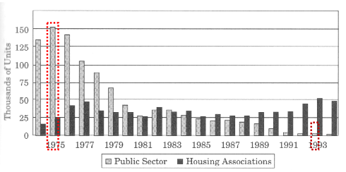
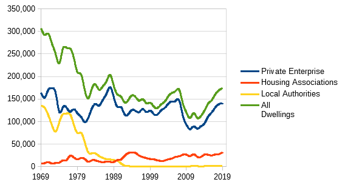
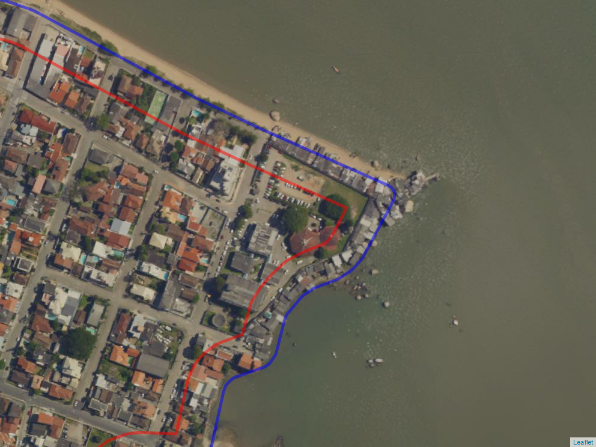
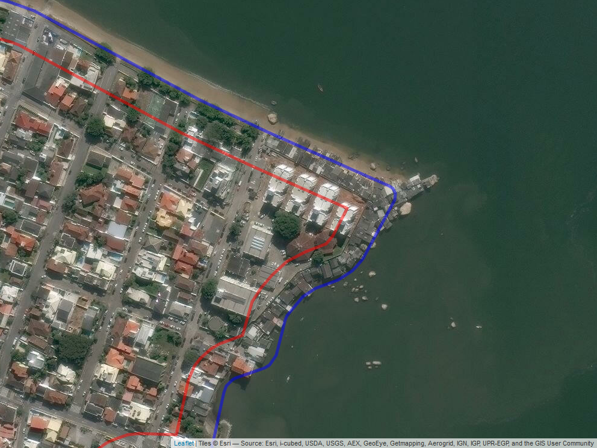

# Políticas habitacionais {#politicas}

```{=latex}
\begin{refsection}
```

\begin{epigrafe}
	\vspace*{\fill}
	\begin{flushright}
    \textit{``Efficient markets do not self-organize: they need to be cued\\
    and maintained by regulatory oversight.''\\
    \cite[p. 540]{mccoy}}
	\end{flushright}
\end{epigrafe}

## Introdução

Diversos países do mundo hoje vivem, em maior ou menor grau, uma 
crise\index{habitacional!crise} habitacional. Nos \gls{EUA}, epicentro global da 
crise financeiro-habitacional de 2008, após a queda sem precedentes dos preços 
dos imóveis residenciais entre 2008 e 2012, estes já voltaram a subir 
vertiginosamente nos últimos anos.

Como foi mostrado nos capítulos \@ref(historico) e \@ref(economia), somente em
fins do século XX o Brasil foi capaz de organizar o seu mercado de capitais, com
a estabilidade da moeda. Ao longo das primeiras décadas do século XX,
consequentemente, as taxas de juros da economia foram gradualmente trazidas a
níveis aceitáveis para propiciar o financiamento de longo prazo na economia
brasileira.

Um dos objetivos deste trabalho é entender de onde viemos e onde estamos no
Brasil, em termos de desenvolvimento urbano, para tentar entender e definir os
rumos para onde vamos.

No capítulo \@ref(historico), espera-se ter respondido à primeira pergunta: de
onde viemos?, cuja resposta, resumidamente é: O Brasil é um país cujo processo
de desenvolvimento capitalista se deu através da **via prussiana**, que 
consiste no desenvolvimento do capitalismo sem a prévia execução de uma reforma
agrária no sentido de fixar no campo os pequenos agricultores. Isso ocasionou
um crescimento desornado dos principais polos urbanos, situação que persiste até
os dias de hoje.

Nos capítulos \@ref(economia) a \@ref(crise2008), espera-se ter respondido à 
segunda pergunta: onde estamos?, cuja resposta é: o Brasil é país capitalista
cuja economia de mercado está suficientemente desenvolvida e em compasso com o
resto do mundo. Com isto se quer dizer que não existe mais no Brasil um 
comportamento anômalo do preço dos imóveis em função de ciclos inflacionários 
que estiveram presente ao longo de boa parte da história econômica brasileira, 
que, em virtude da penalização da liquidez que promoviam, incentivavam a 
imobilização do capital, fazendo com que o preço da terra se elevasse nos 
períodos de fraca conjuntura[^9].

[^9]: No Brasil, durante grande parte do século XX, a inflação se elevava
durante os períodos de fraca conjuntura, ao contrário senso comum.

Desta maneira, pode-se dizer que hoje o Brasil não precisa desenvolver políticas
baseadas em ideias heterodoxas para o \gls{MI}, haja vista que o seu
funcionamento hoje se dá em linha com os \gls{MI} internacionais. Pelo contrário,
a experiência internacional, hoje, nos serve de referência. Obviamente que não
há nos países desenvolvidos, hoje, o problema crônico habitacional que se 
instalou no Brasil durante o seu processo de desenvolvimento econômico durante o
século XX, mas há nestes países hoje também um problema habitacional devido ao
processo de financeirização da moradia. 


## Política habitacional no Brasil

A política habitacional historicamente não se mostrou capaz de satisfazer a
grande demanda por imóveis urbanos no Brasil e demais países da \gls{AL}. O
grande sintoma da falência das políticas habitacionais pode ser vista nas
periferias das grandes cidades. Mas por que estas políticas falharam e continuam
falhando em promover o acesso à moradia digna no Brasil? Isto é o que se
pretende verificar nesta seção.

A Política Nacional de Habitação constitui-se no principal instrumento de
orientação das estratégias e das ações do Governo Federal com o objetivo de
retomar o processo de planejamento do setor habitacional e garantir as condições
para a promoção d acesso à moradia digna – urbanizada e integrada à cidade – a
todos os segmentos da população, em especial para a população de baixa renda 
[@planhab].

Entre os principais instrumentos da Política Nacional de Habitação encontra-se o 
\gls{PlanHab}.

\begin{citacao}
O principal objetivo do PlanHab é formular uma estratégia de longo prazo para
equacionar as necessidades habitacionais do país, direcionando da melhor maneira
possível, os recursos existentes e a serem mobilizados, e apresentando uma
estratégia nos quatro eixos estruturadores da política habitacional: modelo de
financiamento e subsídio; política urbana e fundiária; arranjos institucionais e
cadeia produtiva da construção civil. Com ele se pretende implementar um
conjunto de ações capazes de construir um caminho que permita avançar no sentido
de atingir o principal objetivo da PNH: universalizar o acesso à moradia digna
para todo cidadão brasileiro.
\cite[p. 9]{planhab}
\end{citacao}


 Como tratado no Capítulo \@ref(historico), o cerne do problema habitacional
do Brasil (e provavelmente em toda a \gls{AL}), está na crise agrária, 
*i.e*, na passagem do modo de produção feudal para o modo de produção 
capitalista.

Deve tratar o Brasil, portanto, assim como os outros países da \gls{AL},
de saber como os países avançados -- hoje ditos desenvolvidos -- cujas
transições para o capitalismo  se deram através da chamada via prussiana,
trataram de resolver o problema habitacional nas grandes cidades, após a intensa
migração dos camponeses para as cidades.

Claro está que a solução vislumbrada por Rangel, de que a verdadeira reforma
agrária se daria através da queda "natural" do preço da terra, não se deu e mui
provavelmente nunca se dará, haja vista que Rangel dava como certo o aumento das
taxas de juros (mais precisamente, da eficiência marginal do capital), o que não
ocorreu e, conforme visto no capítulo \@ref(economia), não se pode prever que
acontecerá.

Claro está também que o pleno desenvolvimento do mercado financeiro, como 
exposto no capítulo \@ref(crise2008)) não deve trazer consigo
uma solução para o problema. Pelo contrário, o maior desenvolvimento de 
instrumentos financeiros, como foi visto, tende a gerar bolhas no mercado
imobiliário, o que tende a agravar o problema habitacional, prejudicando as
famílias de menor renda.

O que se nota hoje nos países desenvolvidos é uma grave crise habitacional, 
apesar de todo o desenvolvimento dos seus mercados financeiros, da baixa 
informalidade e dos baixos juros que sempre tiveram, se comparados aos países em
desenvolvimento [@housing-europe; @california]. 

Considera-se, porém, que o problema especulativo não é a raiz do problema.
Segundo Zizek [-@zizek2005, 220-221], não é possível retirar a especulação de um
suposto capitalismo puro: a especulação é a própria alma do processo produtivo
no sistema capitalista. Sem a especulação imobiliária, inexistiria o mercado
imobiliário. As políticas de solo, portanto, que visam o combate da especulação
imobiliária não tem, portanto, papel maior do que o de paliativo, pois essas
políticas não podem ser radicais ao ponto de acabar com a especulação, haja
vista que acabariam também por extinguir os empreendimentos imobiliários. Aliás,
no Brasil, as reformas microeconômicas de 2004 tiveram um forte papel no
desenvolvimento do crédito imobiliário, através da melhoria das condições de
execuções de garantia, propiciadas pela Lei 10.931/2004. A alta no crédito
imobiliário fomentou a construção civil, setor responsável por puxar a economia
naquele ciclo. No entanto, o que se viu, desde então, foi um aumento expressivo
no valor dos imóveis, fazendo que, se por um lado houve aumento na oferta de
imóveis, devido à alta demanda reprimida, esse aumento da oferta veio
acompanhado do aumento do valor dos imóveis, o que dificultou ainda mais o
acesso das camadas de menor renda à aquisição da casa própria.

Ainda, mesmo que fosse possível separar mercado imobiliário de especulação
imobiliária, mantendo o sistema capitalista de produção, espera-se ter 
demonstrado que, na atualidade, o problema ainda persistiria: está cada vez mais
nos fundamentos o problema dos preços elevados, não em grandes desvios de curto 
prazo (bolhas especulativas) dos preços em relação aos fundamentos econômicos, 
pois taxas de juros tão baixas tendem a valorizar ainda mais preço da terra.

Também a redução dos juros hipotecários, ao invés de ajudar, como seria de se
esperar, tende a agravar o problema, como foi visto no capítulo \@ref(economia),
dado que o aumento do valor dos imóveis é exponencial com a queda das taxas de
juros. A redução dos juros, como se mostrou, está na ordem natural das
coisas, já que as taxas dos créditos hipotecários acompanham as taxas de juros
básicas.Ou seja, não se pode esperar que a solução para o problema habitacional
tenha lugar a partir de uma menor taxa de exploração dos mutuários.

Segundo @terraredonda, ainda, esse aumento dos preços dos imóveis parece ter
efeito de beneficiar os proprietários, mas esses não são os principais 
beneficiados:

\begin{citacao}
O rápido aumento dos preços dos imóveis parece beneficiar os proprietários, mas
os principais beneficiários são, de fato, os bancos, as instituições de crédito
e os grandes conglomerados e \emph{hedge funds} que aderiram ao jogo
especulativo.
Isso ficou evidente quando veio o \emph{crash}. Os bancos foram socorridos e os
donos das habitações foram jogados aos tubarões da bolsa de valores. Nos \gls{EUA},
milhões perderam suas casas para execução de hipotecas em 2007-10, enquanto no
setor de aluguéis o ritmo de despejos de populações de baixa renda acelerou em
todos os lugares, com consequências sociais devastadoras. Os \emph{hedge funds}
e as empresas de \emph{private equity} compraram casas hipotecadas a preços de
liquidação relâmpago e agora estão ganhando uma bolada em suas operações. No que
restou do setor público, a austeridade levou à falta de manutenção e à
deterioração do parque habitacional, até o ponto em que, como nos foi dito,
apenas a privatização melhoraria as coisas.
\end{citacao}

@terraredonda nos dá uma pista de como os países desenvolvidos lidaram com este
problema no passado: habitação sob domínio público, ou simplesmente habitação
social. Claro, pois é inútil aguardar que a solução venha através do mercado. 

Segundo @terraredonda:

\begin{citacao}
Diferentes formas de valor sempre coexistiram, de modo desconfortável, com a
forma mercadoria. Sua coevolução na história recente dos mercados imobiliários
culminou no atual impasse, no qual a valorização especulativa determina que mais
da metade da população do planeta Terra não consiga encontrar um lugar decente
para viver em um ambiente de vida decente devido ao poder hegemônico do capital
sobre os mercados de terras e propriedades. Não precisa ser assim.

Ao terminar meu estudo recentemente, deparei-me com um folheto publicado pelo
"Conselho Metropolitano de Habitação de Nova York" em 1978. O título era
"Habitação sob o Domínio Público: A Única Solução". Em 1978, o "Departamento de
Habitação e Desenvolvimento Urbano" dos \gls{EUA} tinha um orçamento de 83
bilhões de dólares para ajudar a buscar essa solução. Cooperativas de capital
limitado e até fundos comunitários de terras estavam surgindo na maioria das
grandes cidades para oferecer soluções fora do mercado. Em 1983, o orçamento
desse Departamento havia sido reduzido para 18 bilhões de dólares, até ser
abolido na década de 1990 durante os anos Clinton. Quarenta anos depois, eu me
pego refletindo sobre as consequências desastrosas em todo o mundo de não se
buscar resolutamente a solução óbvia: habitação sob domínio público. O valor de
uso deve vir primeiro.
\end{citacao}

Segundo @rolnik, no entanto, na raiz da atual crise habitacional do Reino Unido
está o descolamento do setor habitacional das políticas sociais, iniciado por
Margaret Thatcher. Com o desenvolvimento econômico, os países desenvolvidos
acabaram por abandonar estes programas sociais, em troca de soluções de
mercado.


@harvey contextualiza a questão do direito à moradia dentro de uma conceito
maior, do direto à cidade. Segundo Harvey [-@harvey, 166]:

\begin{citacao}
Da Californa à Grécia, a crise produziu perdas de direitos e novas valores dos
ativos urbanos para a maioria da população, junto com a extensão do poder
capitalista predatório sobre as populações de baixa renda e até hoje
marginalizadas. Em resumo, foi um ataque indiscriminado sobre os comuns
reprodutivos e ambientais. Vivendo com menos de 2 dólares por dia, uma população
global de por volta de 2 bilhões de pessoas está sendo ludibriada pelo sistema
de microfinanças, sendo "o \emph{subprime} de todas as formas de \emph{subprime}
de crédito", para deles extrair riquezas (como aconteceu no mercado imobiliário
dos Estados Unidos por empréstimos \emph{subprime} predatórios seguidos por
execuções de hipotecas) para tornar ainda mais opulentas as mansões dos ricos
[...]. Não surpreende, portanto, que os pobres não apenas estejam entre nós, mas
que seu número aumente com o tempo, em vez de diminuir. Enquanto a Índia vem
acumulando um respeitável índice de crescimento ao longo dessa crise, por
exemplo, o número de bilionários saltou de 26 para 69 nos últimos três anos,
enquanto o número de favelados quase dobrou na última década. Os impactos
urbanos são estarrecedores conforme condomínios fechados, luxuosos e com
ar-condicionado surgem em meio ao abandono da miséria urbana, em que os pobres
lutam para construir algum tipo aceitável de existência para si mesmos.
\end{citacao}


## Breve histórico das políticas habitacionais e urbanas 

@jung2018 compara as políticas de habitação praticadas desde o início do século
XX no Brasil e na Inglaterra. De acordo com @jung2018 [p. 165], a diferença
principal entre os dois países, além dos aspectos cronológicos, é que enquanto
no Brasil houve uma opção clara pela construção de grandes conjuntos
habitacionais, geralmente periféricos, na Inglaterra optou-se por um balanço
entre grandes conjuntos e núcleos urbanísticos do tipo Cidade-Jardim, *new
towns*, aluguel social e revitalização urbana. Ainda segundo Gonzales, o que
se observou também nos dois países é que em grandes conjuntos habitacionais
onde priorizam-se a quantidade de imóveis em detrimento da sua qualidade,
estes acabam por serem rejeitados pela população.

Segundo Rolnik [*apud* @jung2018, 165-166]:

\begin{citacao}
A principal característica dos assentamentos precários é a ausência de
infraestrutura – água, luz, esgoto, rede elétrica, iluminação pública,
pavimentação, etc. Nesse sentido há algumas semelhanças entre a precariedade de
lá e a daqui. Mas nos países desenvolvidos as favelas aparecem aqui e ali,
residualmente. Raramente se permite que uma região fique abandonada por muito
tempo. Já aqui, é comum encontrar até neto dos primeiros moradores de uma favela
vivendo em condições similares às que viviam seus avós. Temos assentamentos
precários com até 50 anos de existência. A favela é elemento estrutural do
processo de urbanização. Ou seja, desde sua concepção, o modelo de urbanização
adotado não acolhe os pobres. Vou dar um exemplo. Na Inglaterra, desde a década
de 50, todo novo empreendimento imobiliário deve destinar parte de seu terreno
às moradias populares. Houve interesse, desde a aceleração do processo de
urbanização, de incluir quem não tinha acesso à moradia. No Brasil, não existe
uma política de uso do solo urbano desenhada para acolher a habitação social.
Aqui a política habitacional se limita ao crédito para a indústria da construção
civil. Mas de que adianta esse crédito se ele só viabiliza a construção de casas
de quinta categoria a 50 quilômetros da cidade? Estamos perpetuando a
precariedade
\end{citacao}

Apesar das políticas habitacionais avançadas executadas durante a primeira 
metade do século XX, porém, à partir do *Housing Act*, de 1980, que instituiu o
*Right to buy*, ou direito de comprar (das habitações de interesse social), a 
lógica do mercado, do neoliberalismo Tatcherista, voltou a prevalecer: o 
resultado é que já em fins dos anos 80, com o aumento dos preços dos imóveis e a
ausência de intervenções públicas, o índice de desabrigados na cidade de Londres
já era novamente muito alto [@jung2018, 72].

De fato, a produção de novas unidades habitacionais diminui de maneira drástica,
especialmente pela abrupta diminuição das unidades construídas pelo setor 
público, o que pode ser visto na figura \@ref(fig:inglaterra-unidades). 

```{r inglaterra-unidades, fig.cap="Construções de novas unidades habitacionais na Inglaterra, de 1974 a 1994."}

```
\bcenter
Fonte: VARADY, 1998 [*apud* @jung2018, 73].
\ecenter

Como se pode perceber, ainda, a diminuição da produção de unidades habitacionais
pelo poder público não foi compensada por um aumento na produção de unidades 
pelo setor privado.

De fato, segundo \apud{newenclosure}{michaelrobertsblog}, o Reino Unido passou
de um pico de 350.000 de unidades habitacionais construídas ao ano no final da
década de 60 a uma produção de ínfimas 150.000 unidades ao ano na atualidade. O
gráfico da Figura \@ref(fig:HUEngland), elaborado a partir de dados 
disponibilizados pelo *Ministry of Housing, Communities and Local Governments*
confirma esta tendência.

```{r HUEngland, fig.cap="Novas unidades habitacionais entregues, por setor, no Reino Unido desde 1969."}

```
\bcenter
Fonte -- @HUEngland.
\ecenter

Para \apud{newenclosure}{michaelrobertsblog}, o que explica essa grande redução
na construção de novas unidades está no preço da terra, haja visto que enquanto
o *boom* do pós-guerra foi baseado no *Town and Country Planning Act*, que
permitia aos governos locais adquirir terra para o desenvolvimento urbano pelo
seu valor de uso. Desta maneira, o valor da\index{terra!valor da} terra
representava, à época, 1% do valor das unidades, enquanto na atualidade, a terra
é responsável por cerca de 70% do preço de venda de uma unidade no Reino Unido.

Após o ano 2000 diversas tentativas foram feitas pelos governos trabalhistas de
Tony Blair, sem resultados animadores, contudo. Com o intuito de evitar criar
guetos, nos moldes atuais, é exigido dos empreendedores que ao menos 40% das
unidades construídas sejam destinadas à habitação social (*affordable housing*),
sendo que a qualidade construtiva destas habitações sociais deve ser a mesma das
demais unidades do empreendimento, com excessão da metragem quadrada, o que 
parece ser uma tendência [@jung2018, 77].

### O sanitarismo como propulsor das políticas habitacionais

Segundo Poleto [-@poleto, 36], dada a incapacidade do mercado, logo após a
revolução industrial, de suprir as condições de moradia digna para a classe
trabalhadora, a intervenção estatal foi necessária, ainda que de forma
inicialmente tímida e pontual.

Para Poleto [-@poleto, 37], na Holanda, país pioneiro neste tipo de intervenção
estatal para construção de habitações sociais, estas intervenções se deram 
principalmente devido às crises da epidemia de cólera de meados do século XIX,
"que acometiam principalmente as regiões com habitações mais pobres, atrelando
dessa forma a condição de moradia a uma questão de saúde pública".

\begin{citacao}
Na Holanda, de 1888 a 1895, diversos estudos e ações do Estado holandês, que até
hoje é monárquico, delegou e exigiu das municipalidades que se
responsabilizassem pela infraestrutura, incluindo o abastecimento de água, luz,
gás, transporte coletivo (bondes) e telefonia.
Decorrente daí, em 1894, foi elaborado um relatório sobre a questão da habitação
social, com o objetivo de alicerçar uma legislação que permitisse às
municipalidades desapropriarem terras e edifícios urbanos visando à erradicação
de cortiços, gerando, a partir desse Relatório, a Leis de Habitação, decretada
em 1902.
\cite[p.~317]{poleto}
\end{citacao}

Da mesma maneira, devido à atual pandemia de COVID-19, concomitante com esta
grave crise urbana que já se estava alimentando há alguns anos, é evidente que 
a tendência é que haja mobilização pela volta da intervenção estatal para a 
construção de habitações sociais, tanto no Brasil como no mundo.

A experiência de países como a Finlândia, mostram que a concessão
de habitação permanente aos desabrigados pode, inclusive, ser uma solução mais
rentável do que prover abrigos temporários e que esta intervenção deve ocorrer
da maneira mais rápida possível, pois a tendência é que as pessoas desabrigadas
venham a apresentar outros problemas decorrentes dessa condição, o que tende
a aumentar ainda mais os problemas sociais o que, em consequência, acaba por
aumentar os gastos sociais [@finlandia].

### Cooperativas habitacionais

Nos primórdios do capitalismo nos países hoje dito desenvolvidos, dada a 
impossibilidade do mercado suprir a demanda por habitações acessíveis para os
trabalhadores, houve uma série de intervenções do estado, ao lado da filantropia,
no sentido de tentar prover habitações em condições salubres aos operários.

Neste quesito teve pioneirismo a Holanda, especialmente após as crises de cólera
em meados do século XIX, que acometiam especialmente as regiões mais pobres e 
insalubres. 

Datam de 1868 a existência de cooperativas operárias que, em conjunto com as 
administrações locais tentavam suprir as necessidades de habitações para a 
classe trabalhadora.

A primeira legislação no sentido de regulamentar e incentivar a produção de
habitação atrelada à planejamentos municipais foi o Ato Habitacional
(*Woningwet*), de 1901, na Holanda. Esta lei pioneira foi criada baseada em um
diagnóstico da Sociedade para o Bem-Estar Geral 
(*Maatschappij tot nut van t'algemeen*) de 1887, posteriormente publicados em 
1894 no documento "A Questão da Habitação Social".

Em 1902 o Ato Habitacional foi aprovado pela coroa holandesa que atribuiu às
administrações locais o direito, dever e meios financeiros para o 
estabelecimento de planos de extensão para desapropriar imóveis considerados
insalubres, adquirir áreas e construir diretamente ou oferecer empréstimos para
cooperativas ou sociedades de promoção de moradias populares.

Na Alemanha a legislação também fomentou o crescimento das cooperativas
habitacionais (em 1924 foi instituída uma taxa de 15% sobre o aluguel das
habitações já construídas para alavancar os fundos federais para construção
habitacional) e as próprias administrações muncipais tinham a função de atuar no
desenho urbano para possibilitar a produção em massa de habitação. Esta
interação levou à construção de 130.000 unidades habitacionais entre 1924 e
1930, sendo que em algumas cidades como Berlim os conjuntos habitacionais foram
amplamente divulgados e reconhecidos nos meios arquitetônicos, adquirando valor
emblemático na história da arquitetura do século XX [@poleto, 90].

\begin{citacao}
Na Alemanha, também as prefeituras eram encarregadas de projetar, por 
seus próprios arquitetos, ou **supervisionar o trabalho das cooperativas e 
associações no projeto das habitações**, construí-las ou supervisionar a 
construção integralmente como foram planejadas, além de determinar o 
financiamento.
Tanto na Holanda, quanto na Alemanha, com o objetivo de minimizar ou 
impedir a inadimplência, **o financiamento para a casa jamais era concedido 
diretamente ao mutuário, como pessoa física, mas para cooperativas municipais**.
\cite[p.~317-318]{poleto}
\end{citacao}

### Estatuto da Cidade

O Estatuto da Cidade [@cidade] prevê uma série de instrumentos de política
urbana. Segundo o Estatuto, os instrumentos são classificados em seis
categorias:

I. planos nacionais, regionais e estaduais de ordenação do território e de 
desenvolvimento econômico e social;

II. planejamento das regiões metropolitanas, aglomerações urbanas e 
microrregiões;

III. planejamento municipal;

IV. institutos tributários e financeiros;

V. institutos jurídicos e políticos;

VI. \gls{EIA} e \gls{EIV}.

Dentre os instrumentos citados, destacamos os seguintes.

#### IPTU progressivo no tempo

\begin{citacao}
The property tax is, economically speaking, a combination of one of the worst
taxes -— the part that is assessed on real estate improvements [ \ldots] and one
of the best taxes -- the tax on land or site value \apud{vickrey}{landtax}.
\end{citacao}

o \gls{IPTU}, é a encarnação brasileira da *property tax*, o impostos sobre a
propriedade, espécie de imposto presente na maioria dos países do mundo. Segundo
@spinney [p. 101], alguns autores classificam o imposto sobre a propriedade como
"incrivelmente ruim" outros como "um dos piores impostos conhecidos no mundo
civilizado". 
  
Em alguns países, no entanto, como nos \gls{EUA}, o imposto sobre a propriedade
pode ser visto virtualmente como uma taxa (*fee*) paga em contrapartida pela
prestação de serviços locais por parte da municipalidade, o que altera
completamente a percepção dos contribuintes quanto ao ônus do imposto: como os
recursos da *property tax* nos \gls{EUA} são utilizados para o financiamento das
escolas públicas, os contribuintes, ao invés de perceberem o imposto como um
ônus sobre o consumo de habitação, o percebem como uma taxa pela prestação
destes serviços educacionais, ou seja, o ônus do imposto sobre a propriedade é
nulo na percepção dos contribuintes americanos [@fischel1989, p. 468;
@fischel2013, p. 20].

De acordo com @fischel2013 [p. 21], prova disto está no fato que após a decisão
da Suprema Corte da California em 1971 no caso Serrano v. Priest, que considerou
inconstitucional a vinculação das receitas locais da *property tax* e o
financiamento público das escolas, e a consequente aprovação da proposição 13 na
mesma Califórnia, em 1978, que reduziu substancialmente a base de cálculo e as
alíquotas da *property tax* em todo o estado da Califórnia, muitas famílias
ricas passaram a matricular os seus filhos nas escolas privadas, em detrimento
das escolas públicas. Ou seja, a decisão da Suprema Corte da Califórnia em 1971
não logrou o seu objetivo, que era criar um sistema público de ensino mais
igualitário, independente da renda da comunidade, haja vista que o que houve de
fato foi a perda de arrecadação na *property tax* e o crescimento do sistema
privado de educação, mantendo o desequilíbrio do sistema de ensino como um todo.

No Brasil, de outra maneira, o \gls{IPTU} também parece ter tomado a forma de
uma contribuição, apesar disto não estar relacionado com os distritos escolares.
Segundo @decesare2020 [p. 86, grifo nosso], o \gls{IPTU} "é um imposto essencial
para a **manutenção de serviços básicos nas cidades** [\ldots] o \gls{IPTU} está
inconfundivelmente estruturado para proporcionar que as famílias e os indivíduos
mais ricos contribuam mais com o **financiamento das despesas públicas
realizadas no âmbito local**". Na prática, contudo, o que se percebe é que a
infraestrutura urbana é muito desigualmente distribuída nas cidades brasileiras,
o que provavelmente está relacionado ao fato de que as classes de maior renda,
que contribuem mais com o \gls{IPTU} se fazem retribuir com maiores benefícios
em infraestrutura urbana, enquanto a periferia das cidades permanece carente dos
serviços básicos. Ademais, também segundo @decesare2020 [p. 83-84], devido à
interferência dos legislativos municipais, já que o \gls{IPTU} é "o único
tributo cuja mera apuração da base de cálculo necessita de sanção do Poder
Legislativo [\ldots] a desatualização da base de cálculo do \gls{IPTU} produz
injustiça fiscal e contraria o interesse coletivo, ferindo inclusive os
princípios de isonomia e da capacidade contributiva contidos na Carta Magna".

Além disto, como é relatado em diversos trabalhos, o \gls{IPTU} e seus similares
no mundo (e.g. *property tax*) são impostos que normalmente apresentam uma
regressividade, seja em relação ao valor de mercado das propriedades, devido a
procedimentos avaliatórios, seja em relação à renda das pessoas, *i.e.* as
pessoas com maior capacidade de pagamento pagam menos imposto sobre a
propriedade, proporcionalmente, do que as pessoas com menor capacidade
[@McMillen2020; @landtax, p. 3; @fonseca2020].

Visando proporcionar equidade, algumas localidades podem proporcionar isenções
do \gls{IPTU} à baixa renda (ou a propriedades de baixo valor). A maneira mais
correta parece ser a concessão de uma isenção isonômica, *i.e.* de valor
idêntico, para todas as propriedades, na base de cálculo, a exemplo do que faz o
Estado da Filadélfia, nos \gls{EUA} [@McMillen2020, p. 155].

O \gls{IPTU} progressivo no tempo tem como finalidade promover uma maior
efetividade da função social da propriedade. Alegadamente, a lógica para a
implantação de um imposto progressivo [^10] no tempo seria o combate à
especulação imobiliária.

[^10]: Não se deve confundir o termo *progressivo*, em *IPTU progressivo*, com o
princípío da progressividade no ordenamento jurídico brasileiro. Em *IPTU
progressivo*, o termo progressivo refere-se à progressividade (do aumento das
alíquotas) no tempo, não relacionada com a capacidade contributiva do
contribuinte.

No entanto, o \gls{IPTU} progressivo, se mal aplicado, pode vir a distorcer o
funcionamento do mercado, obrigando um proprietário a ofertar imóveis sem que a
demanda para tal exista naquele momento. Se o proprietário, porém, mantém um
imóvel não edificado, ele poderá ser utilizado para atender a demanda do mercado
no momento exato.

Uma melhor opção, portanto, seria a adoção de um imposto com base no valor da
terra. Não necessariamente, contudo, o imposto sobre as construções deve ser
extinto: é possível conciliar a tributação sobre a terra e a tributação sobre as
benfeitorias, haja vista que o \gls{IPTU} pode ser visto como um imposto que
engloba outros dois impostos, quais sejam, o imposto sobre a terra e o imposto
sobre as benfeitorias [@landtheory, p.6]. Um exemplo ilustrativo pode ser visto
na tabela \@ref(tab:altIPTU), em que são apresentadas duas alternativas à atual
taxação através do imposto predial e territorial urbano de uma propriedade
hipotética cujo valor da\index{terra!valor da} terra esteja estimado em 100.000
e cujas benfeitorias estejam avaliadas em 300.000 unidades monetárias. Pode-se
notar que, com a adoção de diferentes alíquotas sobre o valor
da\index{terra!valor da} terra e o valor das benfeitorias pode-se manter a
receita tributária constante.

```{r altIPTU, results='asis'}
df <- data.frame(Imposto = c("IPTU tradicional (1,0%)", 
                             "IPTU com alíquotas diferentes sobre a
                             terra (2,5%) e as benfeitorias (0,5%)",
                             "Imposto sobre a terra (4,0%)"),
                 Terra = c(1000, 2500, 4000),
                 Benfeitorias = c(3000, 1500, 0),
                 Total = rep(4000, 3))
# pandoc.table(df, style = "grid", 
#              caption = "Alternativas de taxação ao IPTU.")
knitr::kable(df, booktabs = T,
             caption = "Alternativas de taxação ao IPTU.") %>%
  kable_styling(latex_options = "HOLD_position") %>%
  column_spec(1, width = "8cm") %>%
  add_header_above(c(" ", "Receita sobre o valor da" = 2, " "))# %>%
  #footnote(general = "Tributação incidente sobre um imóvel com valor da terra
  #         igual a 100.000 e benfeitorias no valor de 300.000 u.m.")
```
\bcenter
Fonte -- @landtheory [p. 6].
\ecenter

O imposto sobre a\index{terra!imposto sobre a} terra é conhecido entre os
economistas como o imposto perfeito, devido ao seu ônus (ou perda de peso morto)
ser igual a zero.

Para melhor entendimento deste fato, considere-se a Figura
\@ref(fig:deadweight), que ilustra o impacto de um imposto qualquer sobre a
sociedade: sob a condição de mercado livre, um dado mercado se equilibraria com
o Preço $P_L$, correspondente a uma quantidade produzida $Q_L$. A aplicação de
um imposto a este mercado causa uma elevação na curva da oferta. O valor
arrecadado com os impostos equivale a área do retângulo escuro da figura. O
preço da mercadoria ao consumidor passa de $P_L$ à $P_C$, enquanto o preço
recebido pelo produtor passa de $P_L$ para $P_P$. A área do triângulo $DW_L$
representa o ônus do imposto, *i.e.* a parte da produção que é perdida devida à
aplicação do imposto a este mercado [@varian, p.322-324].

```{r deadweight, fig.cap="Custo regulatório no \\gls{MI}."}
plot_labels <- tibble(label = expression("D", "O[1]", "O[2]", "DW[L]"),
                          x = c(9, 7, 7, 3.25),
                          y = c(2, 6.5, 9.5, 4))
points <- data.frame(x = c(2.5, 2.5, 4.5), y = c(2.5, 5.5, 4.5))
triangle <- data.frame(id = c("c", "e", "f"), 
                       x = c(2.5, 2.5, 4.5), 
                       y = c(2.5, 5.5, 4.5))

p1 <- ggplot(mapping = aes(x = x, y = y)) + 
  geom_segment(aes(x = 1, y = 1, xend = 7, yend = 7), color = "#0073D9", size = 1) + 
  geom_segment(aes(x = 1, y = 6.25, xend = 9.75, yend = 2), color = "#FF4036", size = 1) +
  geom_segment(aes(x = 1, y = 4, xend = 7, yend = 10), color = "#0073D9", size = 1) + 
  geom_segment(aes(x = 4.5, y = 0, xend = 4.5, yend = 4.5), lty = "dotted") + # Q2
  geom_segment(aes(x = 0, y = 4.5, xend = 4.5, yend = 4.5), lty = "dotted") + # P1
  geom_segment(aes(x = 2.5, y = 0, xend = 2.5, yend = 5.5), lty = "dotted") + # Q1
  geom_segment(aes(x = 0, y = 2.5, xend = 2.5, yend = 2.5), lty = "dotted") + # P3
  geom_segment(aes(x = 0, y = 5.5, xend = 2.5, yend = 5.5), lty = "dotted") + # P2
  geom_text(data = plot_labels,
            aes(x = x, y = y, label = label), parse = TRUE) +
  geom_point(data = points, aes(x = x, y = y), size = 2) +
  labs(x = "Quantidade", y = "Preço") +
  theme_classic() + 
  coord_equal() +
  scale_x_continuous(expand = c(0, 0), breaks = c(2.5, 4.5), limits = c(0,10),
                     labels = expression(Q[2], Q[L])) +
  scale_y_continuous(expand = c(0, 0), breaks = c(2.5, 4.5, 5.5), limits = c(0,10),
                     labels = expression(P[P], P[L], P[C])) +
  geom_polygon(data = triangle, aes(x = x, y = y), alpha = 0.2) +
  annotate("rect", xmin = 0, xmax = 2.5, ymin = 2.5, ymax = 5.5, alpha = 0.5) +
  annotate("text", x = 1.25, y = 3.35, label = "Receita do\nImposto")
p1
```

Considere-se ainda que o ônus que a parte do ônus que é absorvida pelo produtor
(ou vendedor) e a parte que é absorvida pelo consumidor dependem das
elasticidades da oferta e da demanda do mercado. Por exemplo, para uma dada
curva de demanda, pode ser visto na Figura \@ref(fig:deadweightElasticities)
como a alteração da curva de oferta de um bem pode redistribuir o ônus de um
imposto entre os consumidores e os vendedores/produtores: se um bem possuir uma
oferta mais elástica (Figura \@ref(fig:deadweightElasticities) **A**), o ônus do
consumidor, medido como a diferença entre o preço praticado ao consumidor e o
preço que seria praticado sem os impostos ($P_C - P_L$), será maior do que o
ônus do produtor (ou vendedor), que é a diferença entre o preço de livre mercado
e o preço pago ao produtor/vendedor ($P_L - P_P$). Se a oferta for menos
elástica (Figura \@ref(fig:deadweightElasticities) **B**), contudo, o ônus
recairá, em sua maior parte, sobre o vendedor.


```{r deadweightElasticities, fig.cap = "Influência das elasticidades da oferta sobre o encargo do consumidor e do produtor."}
plot_labels <- tibble(label = expression("D", "O"),
                          x = c(9, 8.5),
                          y = c(2, 5.35))
points <- data.frame(x = c(2.5, 2.5, 4.65), y = c(4.2, 5.5, 4.5))
p1 <- ggplot(mapping = aes(x = x, y = y)) + 
  geom_segment(aes(x = 1, y = 4, xend = 9, yend = 5), color = "#0073D9", size = 1) + 
  geom_segment(aes(x = 1, y = 6.25, xend = 9.75, yend = 2), color = "#FF4036", size = 1) +
  geom_segment(aes(x = 4.65, y = 0, xend = 4.65, yend = 4.5), lty = "dotted") + # Q2
  geom_segment(aes(x = 0, y = 4.5, xend = 4.65, yend = 4.5), lty = "dotted") + # P1
  geom_segment(aes(x = 2.5, y = 0, xend = 2.5, yend = 5.5), lty = "dotted") + # Q1
  geom_segment(aes(x = 0, y = 4.2, xend = 2.5, yend = 4.2), lty = "dotted") + # P3
  geom_segment(aes(x = 0, y = 5.5, xend = 2.5, yend = 5.5), lty = "dotted") + # P2
  geom_text(data = plot_labels,
            aes(x = x, y = y, label = label), parse = TRUE) +
  geom_point(data = points, aes(x = x, y = y), size = 2) +
  labs(x = "Quantidade", y = "Preço") +
  theme_classic() + 
  coord_equal() +
  scale_x_continuous(expand = c(0, 0), breaks = c(2.5, 4.5), limits = c(0,10),
                     labels = expression(Q[2], Q[L])) +
  scale_y_continuous(expand = c(0, 0), breaks = c(4.2, 4.5, 5.5), limits = c(0,10),
                     labels = expression(P[P], P[L], P[C]))
plot_labels <- tibble(label = expression("D", "O"),
                          x = c(9, 5.25),
                          y = c(2, 8.5))
points <- data.frame(x = c(2.5, 2.5, 3.5), y = c(2.5, 5.5, 5))
p2 <- ggplot(mapping = aes(x = x, y = y)) + 
  geom_segment(aes(x = 2, y = 1, xend = 5, yend = 9), color = "#0073D9", size = 1) + 
  geom_segment(aes(x = 1, y = 6.25, xend = 9.75, yend = 2), color = "#FF4036", size = 1) +
  geom_segment(aes(x = 3.5, y = 0, xend = 3.5, yend = 5), lty = "dotted") + # Q2
  geom_segment(aes(x = 0, y = 5.5, xend = 2.5, yend = 5.5), lty = "dotted") + # P1
  geom_segment(aes(x = 2.5, y = 0, xend = 2.5, yend = 5.5), lty = "dotted") + # Q1
  geom_segment(aes(x = 0, y = 2.5, xend = 2.5, yend = 2.5), lty = "dotted") + # P3
  geom_segment(aes(x = 0, y = 5, xend = 3.5, yend = 5), lty = "dotted") + # P2
  geom_text(data = plot_labels,
            aes(x = x, y = y, label = label), parse = TRUE) +
  geom_point(data = points, aes(x = x, y = y), size = 2) +
  labs(x = "Quantidade", y = "Preço") +
  theme_classic() + 
  coord_equal() +
  scale_x_continuous(expand = c(0, 0), breaks = c(2.5, 3.5), limits = c(0,10),
                     labels = expression(Q[2], Q[L])) +
  scale_y_continuous(expand = c(0, 0), breaks = c(2.5, 5, 5.5), limits = c(0,10),
                     labels = expression(P[P], P[L], P[C]))
cowplot::plot_grid(p1, p2, nrow = 1, labels = "AUTO")
```

É sabido que o mercado de terra tem oferta praticamente inelástica [@landtheory,
p. 2]. Ou seja, um imposto sobre a terra praticamente não incide sobre o
comprador, apenas sobre o vendedor do mercado de terra, *i.e.* os proprietários
de terra.

Isto implica que um imposto apenas sobre o valor da terra seria mais eficiente
para a regulação do \gls{MI}, pois o \gls{IPTU} incide parte sobre a terra,
parte sobre as construções. Esta parte do imposto que se aplica às construções
ou benfeitorias, acarretam numa menor propensão à construir, incentivando a
manutenção de parte do estoque de terra urbana edificável sob a forma de terra
nua. 

Além disto, fosse o \gls{IPTU} substituído por um imposto apenas sobre o valor
da terra, mantida a arrecadação, haveria maior justiça tributária, já que os
proprietários de terras pagariam um imposto tão alto quanto o imposto aplicado à
propriedade do lote construído do seu vizinho, *i.e.* a construção não seria
penalizada e o especulador, independente da utilização ou não da infraestrutura
urbana, teria que pagar por ela da mesma maneira, o que não ocorre no caso do
\gls{IPTU}. Em outras palavras, muito provavelmente a especulação imobiliária
iria ter o seu lugar de qualquer maneira, mas com o imposto incidindo
integralmente, ou predominantemente sobre o solo, o especulador não teria o
benefício de pagar menos imposto do que o seu vizinho que realmente deu ao solo
urbano a sua destinação final, ou seja, que o edificou.

Estes fatos tornam o \gls{IPTU} progressivo uma não tão boa alternativa, 
economicamente falando, a um imposto puramente territorial, como pode pensar o 
planejador urbano.

#### Contribuição de melhoria

A escrever...

#### Regularização Fundiária

A \gls{REURB} é um instrumento de política urbana essencial em países onde
existem altos índices de informalidade, como nos países da \gls{AL}, por
ser uma forma de aquisição de propriedade.

No Brasil, diversos avanços foram trazidos com a edição da lei 11.977, de 07 de
junho de 2009, que previa em seu capítulo III, artigos 46 a 71, a regularização
fundiária de assentamentos urbanos e, conjuntamente com a titulação do imóvel,
uma série de medidas associadas a condições dignas de moradia e acesso à
infraestrutura adequada. Porém, com a edição da nova lei 13465/2017, estas
medidas foram retiradas.

A nova lei sobre regularização fundiária (lei 13.465/2017) trata, além da
\gls{REURB-S} e da \gls{REURB-E}, da "regularização fundiária" rural e na
Amazônia Legal. Entre os pontos polêmicos desta nova lei está a regularização de
conjuntos habitacionais sem a obrigatoriedade do "habite-se" (artigos 60 e 63),
entre outros, como a possibilidade de regularização de imóveis em áreas
públicas, o que deverá ser discutida pelo \gls{STF} na \gls{ADI} 5771, proposta
pela \gls{PGR}.

O instituto da regularização fundiária de imóveis públicos já estava previsto na
lei 9.636, de 15 de maio de 1998, porém apenas para comunidades de baixa renda, 
como se vê na redação do art. 6º-A da referida lei:

\begin{citacao}
Art. 6º-A No caso de cadastramento de ocupações para fins de moradia cujo
ocupante seja considerado carente ou de baixa renda, na forma do $\S$ 2º do art.
1º do Decreto-Lei nº 1.876, de 15 de julho de 1981, a União poderá proceder à
regularização fundiária da área, utilizando, entre outros, os instrumentos
previstos no art. 18, no inciso VI do art. 19 e nos arts. 22-A e 31 desta Lei.
\end{citacao}


##### Exemplo de regularização fundiária de imóvel público -- Ponta do Leal, Florianópolis/SC

Um exemplo do bom uso da regularização fundiária em imóvel público é a
regularização da comunidade da Ponta do Leal, localizada no Balneário do
Estreito, em Florianópolis/SC.

O processo tramitou na \gls{SPU} em Santa Catarina sob nº 04972.000987/2010-14.

```{r}
# lpm <- st_read("https://raw.githubusercontent.com/lfpdroubi/SPUData/master/linhas/LPM_HOMOLOGADA.geojson")
# lltm <- st_read("https://raw.githubusercontent.com/lfpdroubi/SPUData/master/linhas/LLTM_HOMOLOGADA.geojson")
# m <-
#   leaflet() %>%
#   addWMSTiles(baseUrl = "http://sigsc.sc.gov.br/sigserver/SIGSC/wms",
#               layers = list("OrtoRGB-Landsat-2012")) %>%
#   setView(lat = -27.579613, lng = -48.576272, zoom = 18) %>%
#   addPolylines(data = lpm, color = "blue") %>%
#   addPolylines(data = lltm, color = "red")
# mapview::mapshot(m, file = "images/ponta-leal-antes.png")
# m1 <-
#   leaflet() %>%
#   addProviderTiles("Esri.WorldImagery") %>%
#   setView(lat = -27.579613, lng = -48.576272, zoom = 18) %>%
#   addPolylines(data = lpm, color = "blue") %>%
#   addPolylines(data = lltm, color = "red")
# mapview::mapshot(m1, file = "images/ponta-leal-depois.png")
```


```{r ponta-leal-antes, fig.cap = "Ponta do Leal. Situação anterior: palafitas situadas em terrenos de marinha."}

```
\bcenter
Fonte: @sigsc.
\ecenter

Como pode ser visto na figura \@ref(fig:ponta-leal-antes), a comunidade ali 
radicada habitava palafitas em condições degradantes, sem condições mínimas de
salubridade.

Com a intervenção do governo federal, através da \gls{SPU} em SC, responsável
pelos cadastramento das famílias,  e com o auxílio da \gls{CEF}, foram
construídos quatro edifícios de apartamentos com o \gls{PMCMV}, beneficiando as
famílias ali existentes.

```{r ponta-leal-depois, fig.cap = "Ponta do Leal. Situação atual: construídos quatro edifícios de apartamentos."}

```
\bcenter
Fonte: Imagens de satélite da ESRI.
\ecenter

A figura \@ref(fig:ponta-leal-depois) mostra a área após a regularização, com os
edifício construídos e as palafitas devidamente removidas.

Apesar de ser um caso interessante, é um caso raro de utilização de terra urbana
da União na utilização dos Programas Habitacionais de baixa renda, com o 
\gls{PMCMV} e é difícil imaginar que isto seja replicado em escala. Além disto,
este tipo de ação ainda apresenta o problema da eficiência da transferência, 
como apresentado no capítulo \@ref(economia-urbana). Além do mais, ainda conta 
com o problema da possível venda antecipada das unidades a terceiros com maior
renda.

Outras opções de sistematização deste sistema, no entanto, devem ser testadas. É
o que já faz a Lei 14.118 de 2021 [@lei14118], em seu artigo 7º, que prevê a
destinação de bens imóveis da União a entes privados *para o alcance dos
objetivos de políticas públicas habitacionais*. Tal coisa, no entanto, ainda
carece de normativa para sua operacionalização, o que, por sinal, não deverá ser
fácil, haja vista a necessidade de licitação com avaliação de contrapartidas
oferecidas por parte do empreendedor. De qualquer maneira, já é um avanço, na
medida em que diminui a necessidade de financiamento para a realização dos
programas.

Contudo, como visto no capítulo \@ref(economia-urbana), toda e qualquer 
construção de imóvel tende a melhorar a *affordability* no setor habitacional.
Desta maneira, não deveria o Estado brasileiro ir além e permitir que se utilize
as suas terras não apenas para a implantação de unidades ligadas aos seus 
programas habitacionais, mas a qualquer empreendimento que seja viável nelas? 

Outra opção ainda seria a União permitir ao empreendedor privado que atue como
incorporador em suas terras, efetuando indenização em dinheiro (que poderia ser
destinado ao financiamento habitacional) ou mesmo em unidades habitacionais no
próprio empreendimento, a exemplo do que ocorre nas terras pertencentes a
proprietários privados. No caso da União, estas unidades dadas em pagamento
poderiam ser destinadas às camadas de baixa renda, promovendo a política do
zoneamento inclusivo, como será visto na próxima seção. De um jeito ou de outro
o Estado brasileiro estaria contribuindo para uma melhor elasticidade da oferta
do \gls{MI} residencial.

### Outros instrumentos

No Brasil, a Lei 9.636 de 1998 [@lei9636] estipula que ...

Com o advento da Lei 14.011, de 10 de junho de 2020 [@lei14011], ...

#### Controle de aluguéis residenciais

Diversos países utilizaram em algum momento a política de controle de aluguéis 
com o intuito de conter o peso excessivo dos custos habitacionais sobre a 
população em geral. Estas políticas intervencionistas do poder público sobre o
mercado, no entanto, vão contra a ideologia liberal predominante, que prega a 
livre atuação das forças de mercado como solução para os mais diversos problemas,
não somente os habitacionais.

Na Alemanha houve controle de aluguéis entre 1917 e 1922, o que afastou a
iniciativa privada da produção habitacional. Por outro lado, o governo assumiu
pra si a responsabilidade pela construção das moradias, chegando a ser
utilizados fundos públicos para a construção de 70% das habitações edificadas
[@poleto, 89].

Após, em 1990, o chamado *Wohnungsgemeinnütziqkeit* limitou os reajustes dos
aluguéis em Berlim, após a reabertura econômica. 

Atualmente, após um rápido e forte aumento dos preços dos imóveis e dos
aluguéis, devido ao forte aumento da procura por moradia na cidade, às
dificuldades regulatórias para a construção de novas moradias e o forte
desenvolvimento do setor de turismo que se estabeleceu na cidade, Berlim foi
obrigada a estabelecer um teto no valor dos aluguéis (*Mietendeckel*), além do
congelamento do preço dos aluguéis dos imóveis construídos antes de 2013 e da
requisição pública de imóveis privatizados durante a década de 1990. [@berlim].

A crise habitacional atual tem levado uma série de cidades européias a implantar
o controle de aluguéis residenciais, tais como Barcelona, Amsterdam e Paris
[@economist-rent-control]. A cidade de Londres também vem discutindo a
implementação de uma comissão para sistema de controle efetivo de aluguéis, a
criação de um sistema de registro universal de proprietários e o estabelecimento
de tetos para os aluguéis como medida de urgência, enquanto não se cria a
comissão referida [@guardian].

No Brasil houve uma tentativa de estabelecer um controle de aluguéis através do
decreto-lei do inquilinato, de 1942. No entanto, àquela época a adoção da do
controle de aluguéis parece ter tido mais motivações econômicas, no sentido de
destinar mais capitais para a indústria leve então em implantação no Brasil, num
contexto de falta de capitais de vulto para fazêlo, do que motivações no sentido
de promover uma boa política habitacional. De fato, o efeito do congelamento do
valor dos aluguéis então foi de paralisar o segmento de construção para fins
habitacionais, levando ao fim numa crise habitacional de grande monta.
[@bonduki_origens_1994]

De toda maneira, entende-se que esta política de controle de aluguéis é muito
limitada e só teria um efeito positivo se mantida por um curto período de tempo,
de maneira que não desincentive a construção de novas moradias pelo mercado, e 
que venha acompanhada de outras medidas que impulsionem a construção de 
habitações sociais.

#### Zoneamento inclusivo

#### Intervenção estatal direta

Apesar da atual procura pelos governos por soluções de mercado que resolvam os 
problemas sem a necessidade de uma intervenção estatal direta, parece que esta
é, ainda hoje, a única opção realmente eficaz no sentido de resolver o problema.

Apesar do relativo sucesso do \gls{PMCMV}, soluções como as da Ponta do Leal, em
que a implantação da habitação social se deu em área nobre, são uma exceção à
regra. A tendência neste tipo de programa é que os empreendimentos se viabilizem
apenas em áreas remotas, desprovidas de transporte público decente, escolas,
postos de saúde, segurança e outros, o que acaba por acarretar ou numa
necessidade maior de investimento em infraestrutura pública, ou na tendência de
favelização e abandono destas construções com o tempo.

O artigo 3º do Estatuto da Cidade prevê que cabe a União, entre outras
atribuições:

\begin{citacao}
III - promover, por iniciativa própria e em conjunto com os Estados, o Distrito
Federal e os Municípios, programas de construção de moradias e melhoria das
condições habitacionais, de saneamento básico, das calçadas, dos passeios
públicos, do mobiliário urbano e dos demais espaços de uso público;
\end{citacao}

No entanto, ainda é preciso definir como isso deve ser implementado.

O que o Brasil, assim como outros países da \gls{AL} necessitam, é  não de
apenas a implementação solta de alguns dos instrumentos da política urbana
previstas no Estatuto da Cidade por parte de um ou outro ente municipal ou
federado. É necessário o estabelecimento de uma política pública totalmente
coordenada que, utilizando os diversos instrumentos e com objetivo definido,
ataque diretamente o problema e não aguarde que uma eventual melhora da
regulação do mercado imobiliário porventura obtida com a aplicação de um ou mais
instrumentos venha a resolver os problemas de falta de habitação decente através
da iniciativa privada. A história dos países com histórico de desenvolvimento
similar ao do Brasil e muitos outros países da \gls{AL}, com forte êxodo rural e 
crescimento urbano vertiginoso, como a Inglaterra e a Alemanha, apenas mostram
que soluções como as de mercado não resolvem o problema do déficit habitacional,
especialmente para as classes menos favorecidas. As soluções de mercado se 
aplicam aos países cujo desenvolvimento capitalista tenha se dado nas condições
de prévia reforma agrária, como os \gls{EUA} ou a França, onde a migração do campo
para a cidade se deu de maneira mais gradual, devido às melhores condições do
campesinato quando da abertura do complexo rural.

## Considerações Finais


```{=latex}
\printbibliography[heading=subbibintoc]
\end{refsection}
```

