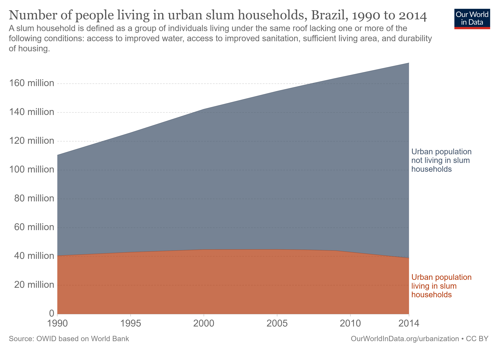

<!--
Above is the YAML (YAML Ain't Markup Language) header that includes a lot of 
metadata used to produce the document.  Be careful with spacing in this header!

If you'd prefer to not include a Dedication, for example, simply delete the 
section entirely, or silence (add #) them. 

If you have other LaTeX packages you would like to include, delete the # 
before header-includes and list the packages after hyphens on new lines.

If you'd like to include a comment that won't be produced in your resulting file 
enclose it in a block like this.

If you receive a duplicate label error after knitting, make sure to delete the 
index.Rmd file and then knit again.
-->

```{r include_packages, include = FALSE}
knitr::opts_chunk$set(echo = FALSE, cache = FALSE, message=FALSE, warning = FALSE, 
                      fig.ext='png', fig.align='center', fig.path = "images/",
                      fig.pos = "H", dev = "png", dpi = 600, out.width = "70%")
type <- knitr::opts_knit$get("rmarkdown.pandoc.to")
# This chunk ensures that the ufscdown package is
# installed and loaded. This ufscdown package includes
# the template files for the thesis.
if(!require(remotes))
  install.packages("remotes", repos = "http://cran.rstudio.com")
if(!require(ufscdown))
  remotes::install_github("lfpdroubi/ufscdown")
library(ufscdown)
library(leaflet)
library(sf)
library(kableExtra)
library(pander)
library(tidyr)
library(dplyr)
library(ggplot2)
library(ggfortify)
library(ggpmisc)
library(changepoint)
library(strucchange)
library(KFAS)
library(xts)
library(timetk)
library(scales)
library(cowplot)
theme_set(theme_cowplot(10))
library(YieldCurve)
library(ustyc)
library(Quandl)
Quandl.api_key("KFMsKFYU9QNph_XnbVUQ")
library(fredr)
fredr_set_key("8866e5606159b57dd69d9d8392ddfd1d")
library(BETS)
library(zoo)
library(DiagrammeR)
library(appraiseR)
gg_color_hue <- function(n) {
  hues = seq(15, 375, length = n + 1)
  hcl(h = hues, l = 65, c = 100)[1:n]
}
warnings(file = "E:/ufsc/dissertacao/index/R-warnings.txt")
```

<!-- On ordering the chapter files:
There are two options:
1. Name your chapter files in the order in which you want them to appear (e.g., 
01-Intro, 02-Data, 03-Conclusions). 
2. Otherwise, you can specify the order in which they appear in the 
_bookdown.yml (for PDF only).

Do not include 00(two-hyphens)prelim.Rmd and 00-abstract.Rmd in the YAML file--
they are handled in the YAML above differently for the PDF version.
-->

<!-- The {.unnumbered} option here means that the introduction will be 
"Chapter 0." You can also use {-} for no numbers
on chapters.
-->


# Introdução {#intro}

```{=latex}
\begin{refsection}
```

O território\index{território} é a base das atividades econômicas e sociais do
país. Um eficiente planejamento territorial passa por desenvolver políticas
públicas que garantam um desenvolvimento equânime de todo o território. De
acordo com @realestate, a terra\index{terra} é a base das atividades econômicas
e sociais de um povo, essencial para a vida e a sociedade, sendo assunto de
diversas disciplinas, como o Direito, Economia, Finanças, Sociologia e a
Geografia.

No Direito, a terra é abordada no direito de propriedade e uso social da terra.
Na Economia, a terra é considerada um dos fatores de produção, ao lado do
trabalho e do capital\index{capital}. Nas Finanças, a terra é considerada como
um bem suscetível de ser dado em garantia, em troca de capital financeiro,
visando propiciar o desenvolvimento. Na perspectiva da Sociologia, a terra é um
bem comum de todos, que deve ser utilizado com fins de obtenção de uma sociedade
melhor. Já a Geografia foca em descrever os elementos físicos da terra e as
atividades humanas das pessoas que as habitam.A Engenharia de Avaliações se
preocupa em reconhecer os atributos que atuam na formação de valor dos bens
imóveis, um conceito ligado à Economia. Para isto, os Avaliadores devem entender
o mercado no qual estes bens estão inseridos. É o mercado que reflete a atitude
dos atores econômicos em resposta às forças sociais e econômicas e às restrições
da lei e dos ônus legais [@realestate, 10].

O mundo vive na atualidade uma situação de crise\index{habitacional!crise}
habitacional sem precedentes, que se agrava desde a Grande
Recessão de 2007-2009. Os reflexos da crise habitacional e financeira global que
foi deflagrada em 2007 pela crise das hipotecas *subprime*[^1] nos EUA e se
espalhou pelo mundo ainda podem ser sentidos, especialmente em seu contexto
habitacional. Se o mundo foi capaz de equacionar o lado financeiro do problema,
salvando as instituições financeiras da bancarrota, o mesmo não aconteceu no
setor habitacional. Pelo contrário, neste setor a crise foi duramente agravada,
seja nos países desenvolvidos, onde a crise teve origem, seja nos países em
desenvolvimento.

[^1]: O termo *subprime* refere-se a um grupo de mutuários com capacidade de 
pagamento duvidosa. Na prática, no entanto, é comum a utilização do termo de 
"hipotecas *subprime*" para referir-se às hipotecas direcionadas a este segmento 
de mutuários.

No caso brasileiro, contudo, a crise habitacional é crônica. A precariedade de
grande parte do estoque de moradias, a falta de infraestrutura básica, e o
grande número de pessoas dividindo o mesmo lar, as vezes até o mesmo cômodo, é
um fato social de muitos países em desenvolvimento e isto não é diferente no
Brasil. Estes fatores, por sua vez, afetam a saúde pública seja em tempos de
normalidade, seja em tempo de crises sanitárias, como a atual pandemia de
COVID-19.

A complexidade do setor habitacional, sua relação com os outros setores da 
economia capitalista e sua importância nas questões de saúde pública e no 
bem-estar da população, assim como aspectos históricos e culturais dos diversos 
países, infelizmente, não permitem a implementação de soluções pré-definidas: as 
políticas habitacionais devem ser estudadas e implementadas *ad-hoc*.

Em países desenvolvidos a atual crise habitacional não necessariamente tem
relação com a falta de moradias disponíveis. Pelo contrário: nos EUA, por
exemplo, estima-se que existam em torno de seiscentas mil pessoas sem moradia,
enquanto o número de residências desocupadas e disponíveis para aluguel gira em
torno de três milhões de unidades, ou seja, existem praticamente seis vezes mais
moradias disponíveis para locação do que pessoas desabrigadas. Saliente-se que o
número de residências desocupadas nos EUA, segundo o último censo de 2019, é
ainda maior: em torno de 16,5 milhões de unidades habitacionais encontram-se
desocupadas. Desta maneira, pode-se argumentar que a crise habitacional na
maioria dos países desenvolvidos, senão em todos, está mais relacionada à falta
de renda das pessoas para o acesso à moradia do que à falta de moradias. O
número de unidades habitacionais disponíveis para locação é tão superior ao
número de pessoas desabrigadas que os especialistas defendem que o
déficit\index{habitacional!déficit} habitacional nestes países seja resolvido
com a simples emissão de *vouchers* para as pessoas que não podem arcar com os
atuais custos de moradia [@olsen_opinion_2016] .

No Brasil, assim como em outros países em desenvolvimento, este não é o caso.
Apesar de alguns relatos de que existem no Brasil em torno de cinco ou seis
milhões de unidades habitacionais vazias, este número ainda é superior ao
número de famílias desabrigadas [@uol]. Ainda que o número de imóveis vazios
fosse superior ao número de famílias desabrigadas, nem todas estas unidades
habitacionais estão disponíveis, apesar de se encontrarem vazias. Além disto,
muitas famílias ainda vivem em moradias de condições precárias, em número de
pessoas por cômodo muito superior ao padrões desejáveis, de maneira que é
possível dizer que a solução para o déficit habitacional dificilmente deixaria
de passar pelo estímulo à construção de novas unidades, seja para a absorver as
pessoas desabrigadas, seja para melhorar as condições de moradia de boa parte da
população abrigada.

Segundo @demanda [p. 7], de 2011 até 2040 o Brasil deverá construir
aproximadamente trinta milhões de unidades para atender à demanda de domicílios,
uma média de praticamente um milhão de unidades por ano, apesar na queda
esperada na demanda por conta das projeções demográficas.

Segundo @ritchie_urbanization_2018, em 1990 em torno de 36,7% da população
urbana brasileira vivia em favelas. É verdade que a proporção da população
urbana vivendo em favelas vem diminuindo desde então. Em 2000, 31,5% da
população urbana ocupava as favelas, ao passo que em 2014 esse número diminuiu
para 22,3% da população urbana.

No entanto, com o crescimento da população brasileira e o aumento da porcentagem
de população urbana desde então, os números totais estão praticamente estagnados,
o que pode ser observado na tabela abaixo.

| Ano | Pop. total (milhões hab.) | Pop. urbana (%) | Pop. urbana (milhões hab.) | Favelas (%) | Favelas (milhões hab.)|
|----:|--------------------------:|----------------:|---------------------------:|------------:|----------------------:|
|1990 | 149,0                     |   73,90         | 110,1                      | 36,7        | 40,4                  |
|1995 | 162,0                     |   77,61         | 125,7                      | 34,1        | 42,9                  |
|2000 | 174,8                     |   81,20         | 141,9                      | 31,5        | 44,7                  |
|2005 | 186,1                     |   82,80         | 154,2                      | 29,0        | 44,7                  |
|2009 | 193,9                     |   84,04         | 162,9                      | 26,9        | 43,8                  |
|2014 | 202,8                     |   85,90         | 174,3                      | 22,3        | 38,9                  |
Table: População habitando favelas no Brasil.

\bcenter
\small Fonte -- Do autor, a partir de dados do Banco Mundial.
\ecenter

A Figura \@ref(fig:slums) mostra graficamente a evolução da população urbana em
favelas (em vermelho) e a população urbana total (em azul). Nota-se que o 
aumento da população urbana ocorreu com a quase estagnada população das 
favelas.

A situação econômica do país deve ter um peso na composição da população
habitando as favelas: a década de 90 e o início da década de 2000 são períodos
sabidamente de crescimento baixo e intermitente, intercalados por graves
recessões na economia brasileira. Já a baixa considerável desta população
desfavorecida entre os períodos de 2009 e 2014 (aprox. 11%) sugere que houve um
impacto do crescimento econômico do período (especialmente no que tange à
manutenção de baixas taxas de desemprego), que veio acompanhado de programas
habitacionais destinados à população de baixa renda, como o Minha Casa Minha
Vida e, ainda que mais timidamente, do instituto da regularização fundiária.
Deve-se lembrar que neste período houve aumento da proporção de população
urbana, ou seja, a diminuição da população favelada com certeza não reflete um
fenômeno de migração da cidade para o campo.

Já para o IBGE [@ibge], segundo dados do censo de 2010, o Brasil possuía 11,4
milhões de pessoas morando em aglomerados subnormais, ou favelas.
 
\begin{citacao}
Para o IBGE, os 'aglomerados subnormais' representam um conjunto constituído de,
no mínimo, 51 unidades habitacionais ocupando ou tendo ocupado, até período
recente, terreno de propriedade alheia (pública ou particular) dispostas, em
geral, de forma desordenada e densa, e apresentando carência em serviços
básicos.
\cite{ibge2}
\end{citacao}

A discrepância entre os números do IBGE e os números internacionais pode ser
explicado por falhas metodológicas. Segundo MARICATO (2002, p. 154) [*apud*
@silva, 9]:

\begin{citacao}
Não há números gerais, confiáveis, sobre a ocorrência de favelas ou de
loteamentos ilegais em todo o Brasil. Por falhas metodológicas ou ainda por uma
dificuldade óbvia de conhecer a titularidade da terra sobre a qual as favelas se
instalam, o IBGE apresenta dados bastante subdimensionados. A busca de números
mais rigorosos nos conduz a alguns diagnósticos elaborados por governos
municipais, teses acadêmicas ou organismos estaduais que, entretanto, fornecem
dados localizados e restritos.
\end{citacao}

```{r slums, fig.cap = "População urbana e população em favelas."}

```
\bcenter
\small Fonte -- @ritchie_urbanization_2018
\ecenter

Deixado o problema sujeito às forças de mercado, a tendência é de agravamento do
problema. A diminuição das taxas de juros a níveis muito baixos causa o
outrora raro problema da armadilha da liquidez, problema que vem atormentando os
países desenvolvidos há alguns anos e agora tem encontrado lugar nos países em
desenvolvimento, como o Brasil [@krugman-emergentes].

A reação dos bancos centrais do mundo a este problema é o de encontrar formas
alternativas de injetar mais liquidez ao sistema, o que pode acabar por
propiciar a formação de novas bolhas especulativas e o setor imobiliário não 
está imune a isto. Pelo contrário, em tempos de incertezas econômicas, o 
mercado imobiliário é um dos destinos preferenciais para os capitais em busca
de reserva de valor. O aumento do preço da terra que pode estar por vir, então,
acompanhado do alto desemprego que se tem gerado em todo o mundo pela pandemia
de COVID-19, tende a agravar sobremaneira o problema da crise habitacional no
mundo e, em especial, onde esta já se tornou crônica, como no Brasil e em outros
países da \gls{AL}.

Além da crise habitacional proveniente deste forte aumento dos preços dos
imóveis, inflar o setor habitacional também não tem dado bons resultados em
termos econômicos e políticos mais gerais:

\begin{citacao}
Os políticos tradicionalmente gostam quando os preços das casas aumentam. As
pessoas se sentem mais ricas e portanto, emprestam e gastam mais, dando um bom
impulso à economia, eles pensam. Quando todo mundo está se sentindo bem com sua
situação financeira, os políticos têm maior chance de reeleição. Mas existe um
outro lado. Habitações caras são inequivocamente ruins para a crescente
população de locatários do mundo rico, forçando-os a reduzir os gastos com
outros bens e serviços. E uma política econômica baseada em compradores de casas
em grandes dívidas não é sustentável. A curto prazo, encontra um estudo do FMI,
o aumento da dívida das famílias aumenta o crescimento econômico e o emprego.
Mas as famílias precisam controlar os gastos para pagar seus empréstimos, então
em três a cinco anos, esses efeitos são revertidos: o crescimento se torna mais
lento do que seria de outra forma e as chances de uma crise financeira aumentam.
\cite{economist-housing-2020}
\end{citacao}
