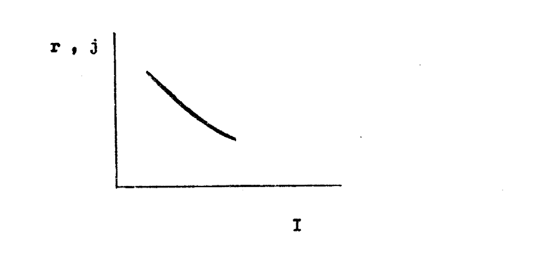

<!--
Above is the YAML (YAML Ain't Markup Language) header that includes a lot of 
metadata used to produce the document.  Be careful with spacing in this header!

If you'd prefer to not include a Dedication, for example, simply delete the 
section entirely, or silence (add #) them. 

If you have other LaTeX packages you would like to include, delete the # 
before header-includes and list the packages after hyphens on new lines.

If you'd like to include a comment that won't be produced in your resulting file 
enclose it in a block like this.

If you receive a duplicate label error after knitting, make sure to delete the 
index.Rmd file and then knit again.
-->

```{r include_packages, include = FALSE}
knitr::opts_chunk$set(echo = FALSE, cache = FALSE, message=FALSE, warning = FALSE, 
                      fig.ext='png', fig.align='center', fig.path = "images/",
                      fig.pos = "H", dev = "png", dpi = 600, out.width = "70%")
type <- knitr::opts_knit$get("rmarkdown.pandoc.to")
# This chunk ensures that the ufscdown package is
# installed and loaded. This ufscdown package includes
# the template files for the thesis.
if(!require(remotes))
  install.packages("remotes", repos = "http://cran.rstudio.com")
if(!require(ufscdown))
  remotes::install_github("lfpdroubi/ufscdown")
library(ufscdown)
library(kableExtra)
library(tidyr)
library(dplyr)
library(ggplot2)
library(ggfortify)
library(ggpmisc)
library(scales)
library(cowplot)
theme_set(theme_cowplot(14))
library(YieldCurve)
library(ustyc)
library(Quandl)
Quandl.api_key("KFMsKFYU9QNph_XnbVUQ")
library(fredr)
fredr_set_key("8866e5606159b57dd69d9d8392ddfd1d")
library(BETS)
library(xts)
library(appraiseR)
gg_color_hue <- function(n) {
  hues = seq(15, 375, length = n + 1)
  hcl(h = hues, l = 65, c = 100)[1:n]
}
```

<!-- On ordering the chapter files:
There are two options:
1. Name your chapter files in the order in which you want them to appear (e.g., 
01-Intro, 02-Data, 03-Conclusions). 
2. Otherwise, you can specify the order in which they appear in the 
_bookdown.yml (for PDF only).

Do not include 00(two-hyphens)prelim.Rmd and 00-abstract.Rmd in the YAML file--
they are handled in the YAML above differently for the PDF version.
-->

<!-- The {.unnumbered} option here means that the introduction will be 
"Chapter 0." You can also use {-} for no numbers
on chapters.
-->

# Introdução {#intro}

## O conceito de terra e a importância do território

De acordo com @realestate, a terra é a base das atividades econômicas e sociais
de um povo, essencial para a vida e a sociedade, sendo assunto de diversas 
disciplinas, como o Direito, Economia, Finanças, Sociologia e a Geografia.

No Direito, a terra é abordada no direito de propriedade e uso social da terra.
Na Economia, a terra é considerada uma dos fatores de produção, ao lado do
trabalho e do capital. Nas Finanças, a terra é considerada como um bem
suscetível de ser dado em garantia, em troca de capital financeiro, visando
propiciar o desenvolvimento. Na perspectiva da Sociologia, a terra é um bem
comum de todos, que deve ser utilizado com fins de obtenção de uma sociedade
melhor. Já a Geografia foca em descrever os elementos físicos da terra e as
atividades humanas das pessoas que as habitam.

A Engenharia de Avaliações se preocupa em reconhecer os atributos que atuam na
formação de valor dos bens imóveis, um conceito ligado à Economia. Para isto, os
Avaliadores devem entender o mercado no qual estes bens estão inseridos. É o
mercado que reflete a atitude dos atores econômicos em resposta às forças
sociais e econômicas e às restrições da lei e dos ônus legais [@realestate, 10].

## O Mercado Imobiliário

O mercado imobiliário urbano pode ser dividido basicamente em:

1. Mercado de imóveis residencias e;
2. Mercado de imóveis comerciais.

O Mercado Imobiliário se conecta à macroeconomia através:

1. Do setor de construção civil;
2. Da demanda agregada, já que existe uma conexão entre a propensão marginal
a consumir com o efeito riqueza do Mercado Imobiliário;
3. Do setor bancário, haja vista que os bancos possuem imóveis em seu portfolio,
seja através da propriedade, ou através do financiamento imobiliário e hipotecas.

\gls{Bacen}

<!--chapter:end:index.Rmd-->

<!--
This is for including Chapter 1.  Notice that it's also good practice to name your chunk.  This will help you debug potential issues as you knit.  The chunk above is called intro and the one below is called chapter1.  Feel free to change the name of the Rmd file as you wish, but don't forget to change it here from chap1.Rmd.
-->

<!--
The {#rmd-basics} text after the chapter declaration will allow us to link throughout the document back to the beginning of Chapter 1.  These labels will automatically be generated (if not specified) by changing the spaces to hyphens and capital letters to lowercase.  Look for the reference to this label at the beginning of Chapter 2.
-->


## Objetivos

### Objetivo Geral

Propor, através do estudo das diversas estruturas de mercado conhecidas e 
elencadas na nova NBR 14.653-01 [@NBR1465301] e do estudo das relações entre as 
diversas variáveis macroeconômicas, novas aplicações do método involutivo e,
de acordo com os resultados, propor novas políticas para a regulação do setor.

### Objetivos Específicos 

1. Compreender e descrever o funcionamento das diversas estruturas de mercado.
2. Abstrair das diferentes estruturas de mercado as relações entre as variáveis
macroeconômicas e o seu impacto no mercado imobiliário.
3. De acordo com os resultados obtidos, propor políticas públicas que visem uma 
melhor regulamentação do mercado imobiliário, de maneira que este atenda melhor
aos anseios da população.

## Justificativa

O território é a base das atividades econômicas e sociais do país. Um eficiente
planejamento territorial passa por desenvolver políticas públicas que garantam
um desenvolvimento equânime de todo o território, como o A proposta desta 
pesquisa é aprofundar 

## Estrutura do trabalho

O Capítulo \@ref(intro) ([Introdução])  apresenta os objetivos, justificativas e
estrutura do trabalho. O Capítulo \@ref(historico) ([Aspectos Históricos]) faz
uma contextualização histórica do problema do acesso à terra e moradia no Brasil
e no mundo. O Capítulo \@ref(economia) ([O Mercado Imobiliário e a Economia])
aborda os aspectos teóricos e conceituais mais modernos relevantes à
interligação do mercado imobiliário à Economia do país. O capítulo
\@ref(involutivo) ([O Método Involutivo]) apresenta o método involutivo de
avaliação de imóveis. O Capítulo \@ref(copulas) ([O Método Copulas]) introduz o
método Copulas, essencial para a compreender as simulações para cada
cenário/estrutura de mercado descritas no Capítulo \@ref(metodologia)
([Metodologia]). O Capítulo \@ref(resultados) ([Resultados]) demonstra os
resultados obtidos com as simulações  e o Capítulo \@ref(conclusao)
([Conclusão]) traz as propostas de regulação baseadas nos resultados obtidos.

<!--chapter:end:01-intro.Rmd-->

# Aspectos históricos {#historico}

\begin{epigrafe}
	\vspace*{\fill}
	\begin{flushright}
		\textit{``Do ponto de vista social, todos os fatores se resumem\\ 
		em um `recurso' elementar: o homem. Logo, não é possível seguir\\ 
		conceptualmente o processo de industrialização se não sabemos como\\ 
		o homem aplicava antes o seu tempo de trabalho, como o aplica depois,\\ 
		o que ocorre quando passa de um modo de produzir a outra e em que\\ 
		condições realiza essa passagem.[ \ldots ] Considerando que na estrutura\\ 
		da economia que precede a industrialização quase toda a população está\\ 
		na `agricultura', é preciso estudar detidamente a organização deste setor.\\ 
		Em outras palavras, se o problema da `agricultura' não foi entendido,\\ 
		tampouco será possível compreender o problema da `indústria', ou manufatura,\\ 
		nem o papel que os serviços desempenham. Falando de modo sucinto, a \\
		`manufatura' e os serviços são novas formas de aplicação de parte do\\ 
		tempo de trabalho da população que antes estava na `agricultura'. Mas,\\
		por sua vez, a própria `agricultura' se reorganiza quando a transferência ocorre.''\\
		(RANGEL, 1954)}
	\end{flushright}
\end{epigrafe}

O Capitalismo é um sistema político-econômico que, historicamente, substitui o
Feudalismo, sistema em que a população encontrava-se toda concentrada no campo.

Nas sociedades pré-capitalistas, a população predominante rural organizava-se no
chamado 'Complexo Rural', ou seja, num ambiente rural onde eram produzidos não
apenas os produtos agrícolas, mas onde também eram produzidos, pelos próprios
camponeses, em uma muito baixa produtividade, todo o ferramental necessário para
as suas atividades agrícolas, assim como suas vestes, utensílios domésticos e
outros itens.

A passagem do sistema feudal para o sistema capitalista ocorre com a *divisão
social do trabalho*, ou seja, com o desenvolvimento de indústrias que vão aos
poucos absorver as atividades não-agrícolas realizadas no campo.

\begin{citacao}
Numa economia em expansão, com crescente industrialização, comercialização e
urbanização, numerosos processos anteriormente levados a efeito antes dentro da
casa da família ou unidade (econômica) familiar, ou são completamente
abandonados ou substituídos por processos semelhantes em bases
comerciais. \cite[p. 41]{kuznets} \textit{apud} \cite[p. 218]{rangel1956}.
\end{citacao}

O desenvolvimento do capitalismo brasileiro no século XX se deu pela chamada
"via prussiana" ou *junker* [@rangel1988, 155], que é um tipo de reforma agrária
que consiste na substituição do latifúndio feudal pelo latifúndio capitalista.
Este tipo de desenvolvimento tem como característica se dar sem a execução
prévia da reforma agrária no sentido clássico, *i.e.* no sentido da distribuição
dos latifúndios em pequenas propriedades, a chamada via clássica ou democrática.
Apesar de permitir imprimir um "impulso extraordinário e energético" à
industrialização, a via prussiana "promove uma distribuição muito desigual da
renda" [@rangel1988, 155]. característica talvez mais perniciosa do
desenvolvimento capitalista por esta via se dá pela formação de um "exército
industrial de reserva" demasiado grande, ou seja, um aumento da população urbana
desproporcional à necessidade de mão-de-obra necessária nas indústrias do
capitalismo nascente nas cidades. O resultado é o crescimento acelerado e
desordenado das cidades, com a inevitável formação dos cortiços e favelas para
acomodar a parte mais carente da população que, expulsa do campo, vai se
aglomerar nos grandes centros urbanos em busca da sua sobrevivência.

Dados compilados pelas Nacões Unidas foram organizados na tabela 
\@ref(tab:pop-table) com o intuito de demonstrar a evolução e o atual tamanho 
deste problema.

```{r}
pop_urb <- read.csv("data/urbanization-last-500-years.csv")
```

```{r}
pop_urb_selection <- pop_urb[
  which(pop_urb$Entity == "World" |
    pop_urb$Entity == "More developed regions" |
    pop_urb$Entity == "Less developed regions" |
    pop_urb$Entity == "Europe" |  
    pop_urb$Entity == "Eastern Europe" |  
    pop_urb$Entity == "Western Europe" |  
    pop_urb$Entity == "Latin America and the Caribbean" |  
    pop_urb$Entity == "South America" |  
    pop_urb$Entity == "Central America" |    
    pop_urb$Entity == "Northern America" | 
    pop_urb$Entity == "United States" |
    pop_urb$Entity == "Argentina" |
    pop_urb$Entity == "Brazil"), ]
pop_table <- reshape(pop_urb_selection, timevar = "Year", idvar = c("Entity", "Code"), direction = "wide")
colnames(pop_table) <- stringr::str_replace_all(colnames(pop_table), "Urban.....", "")
pop_table <- pop_table[, c(1, 2, order(as.numeric(colnames(pop_table)[3:91])))]
```


```{r pop-table}
knitr::kable(pop_table[c(13, 8, 7, 5, 4, 12, 6, 10, 3, 9, 11, 1, 2), 
          c("Entity", "1960", "1970", "1980", "1990", "2000", "2014")],
          row.names = FALSE, 
          format = "latex",
          caption = "População Urbana (\\%).", digits = 1,
          format.args = list(big.mark = ".", decimal.mark = ","),  
          booktabs = TRUE) %>% 
  kable_styling(latex_options = c("striped", "HOLD_position"),
                stripe_index = c(1, 4, 7)) %>%
  add_header_above(c("", "Ano" = 6)) %>%
  pack_rows("Mundo", 1, 3) %>%
  pack_rows("Europa", 4, 6) %>%
  pack_rows("América", 7, 13)
```
\bcenter
Fonte: @doi:10.1177/0959683609356587
\ecenter

Ainda, pra melhor explicação, foram elaborados os gráficos das figuras 
\@ref(fig:pop-urb-mundo) a \@ref(fig:pop-urb-brazil-brics).

Na figura \@ref(fig:pop-urb-mundo), pode-se notar que a população urbana no 
Brasil vem aumentando, desde 1950, numa taxa superior à média dos países em
desenvolvimento (*Less developed regions*), atingindo uma proporção superior 
inclusive à dos países mais desenvolvidos (*More developed regions*).

```{r pop-urb-mundo, out.width = "80%", fig.cap = "População Urbana - Brasil vs. Mundo."}
pop_urb %>%
  filter(Entity == "World" | 
         Entity == "More developed regions" | 
         Entity == "Less developed regions" |
         Entity == "Brazil") %>%
  ggplot(., aes(x = Year, y = Urban...., color = Entity)) +
  geom_line() +
  labs(title = "População Urbana", 
       subtitle = "Brasil vs. Mundo.", 
       caption = "Desde 1950 ") +
  ylab("%") +
  coord_cartesian(xlim = c(1950, 2016)) +
  scale_x_continuous(expand=c(0,0),
                     breaks = seq(1950, 2010, 10)) +
  guides(color=guide_legend(title="País/Região"))
```
\bcenter
Fonte: @doi:10.1177/0959683609356587
\ecenter

Na figura \@ref(fig:pop-urb-continents) pode-se ver as séries da população
urbana em diversos continentes desde 1800. Percebe-se neste gráfico também uma
maior aceleração do crescimento da população urbana na América Latina e Caribe a
partir de meados da década de 40, chegando esta região a ultrapassar a população
urbana da Europa Ocidental no início do século corrente.

```{r pop-urb-continents, out.width = "80%", fig.cap = "População Urbana - Nos diferentes Continentes."}
pop_urb %>%
  filter( 
    Entity == "Latin America and the Caribbean" |
    Entity == "Europe" |
    Entity == "Western Europe" |  
    Entity == "Asia" |
    Entity == "Oceania" |
    Entity == "Africa") %>%
  ggplot(., aes(x = Year, y = Urban...., color = Entity)) +
  geom_line() +
  labs(title = "População Urbana", 
       subtitle = "Nos diferentes continentes.", 
       caption = "Desde 1800 ") +
  ylab("%") +
  coord_cartesian(xlim = c(1800, 2016)) +
  scale_x_continuous(expand=c(0,0),
                     breaks = seq(1800, 2010, 50)) +
  guides(color=guide_legend(title="País/Região"))
```
\bcenter
Fonte: @doi:10.1177/0959683609356587
\ecenter

A figura \@ref(fig:pop-urb-brazil-latinAmerica) mostra a evolução da população
urbana no Brasil em comparação com o continente sul-americano e a América Latina,
dando destaque para alguns vizinhos. 

```{r pop-urb-brazil-latinAmerica, out.width = "80%", fig.cap = "População Urbana - Brasil vs. AL."}
cols <- gg_color_hue(6)
pop_urb %>%
  filter( 
    Entity == "Latin America and the Caribbean" |
    Entity == "South America" |  
    Entity == "Brazil" |    
    Entity == "Argentina" |
    Entity == "Chile" |
    Entity == "Uruguay"  ) %>%
  ggplot(., aes(x = Year, y = Urban...., color = Entity)) +
  geom_line() +
  labs(title = "População Urbana", 
       subtitle = "Brasil vs. América Latina.", 
       caption = "Desde 1950 ") +
  ylab("%") +
  coord_cartesian(xlim = c(1950, 2016)) +
  scale_x_continuous(expand=c(0,0),
                     breaks = seq(1950, 2010, 10)) + 
  scale_color_manual(values=c( cols[3],  cols[1],  cols[2],  cols[5],  cols[6],  cols[4])) +
  guides(color=guide_legend(title="País/Região"))
```
\bcenter
Fonte: @doi:10.1177/0959683609356587
\ecenter

A figura \@ref(fig:pop-urb-brazil-developed) mostra o comparativo da população
urbana no Brasil com uma seleção de países desenvolvidos desde 1800.  Quanto aos
países desenvolvidos, nota-se que tiveram, primeiramente, uma ascenção um pouco
mais lenta da população urbana (excessão para a Grã-Bretanha, primeira nação a
industrializar-se), que essa ascenção teve lugar já na década de 1850 e que
houve uma estabilização gradual, por volta da década de 1970. Já quanto ao
Brasil nota-se uma grande aceleração no crescimento da população urbana
brasileira após a década de 1950, o que reflete o nascimento tardio do
capitalismo por aqui e, por fim, que, ao contrário dos países desenvolvidos, não
houve ainda uma estabilização da proporção de população urbana e esta segue em
crescimento, tendo chegado a níveis maiores aqui do que no resto do mundo
desenvolvido.

```{r pop-urb-brazil-developed, out.width = "80%", fig.cap = "População Urbana - Brasil vs. Países Desenvolvidos."}
pop_urb %>%
  filter( 
    Entity == "Brazil" |    
    Entity == "United States" |
    Entity == "Germany" |
    Entity == "France"|
    Code == "GBR" |
    Entity == "England and Wales"
      ) %>%
  ggplot(., aes(x = Year, y = Urban...., color = Entity)) +
  geom_line() +
  labs(title = "População Urbana", 
       subtitle = "Brasil vs. Países Desenvolvidos.", 
       caption = "Desde 1950 ") +
  ylab("%") +
  coord_cartesian(xlim = c(1800, 2016)) +
  scale_x_continuous(expand=c(0,0),
                     breaks = seq(1800, 2010, 50)) + 
  scale_color_manual(values=c(cols[1], cols[2], cols[3], cols[4], cols[2], cols[5])) +
  guides(color=guide_legend(title="País/Região"))
```
\bcenter
Fonte: @doi:10.1177/0959683609356587
\ecenter

E a figura \@ref(fig:pop-urb-brazil-brics) mostra a comparação dos dados do 
Brasil com os outros países do grupo dos BRICS.

```{r pop-urb-brazil-brics, out.width = "80%", fig.cap = "População Urbana - Brasil vs. BRICS."}
pop_urb %>%
  filter( 
    Entity == "Brazil" |    
    Entity == "Russia" |
    Entity == "India" |
    Entity == "China" |
    Entity == "South Africa") %>%
  ggplot(., aes(x = Year, y = Urban...., color = Entity)) +
  geom_line() +
  labs(title = "População Urbana", 
       subtitle = "Brasil vs. BRICS.", 
       caption = "Desde 1950 ") +
  ylab("%") +
  coord_cartesian(xlim = c(1950, 2016)) +
  scale_x_continuous(expand=c(0,0),
                     breaks = seq(1950, 2010, 10)) +
  guides(color=guide_legend(title="País/Região"))
```
\bcenter
Fonte: @doi:10.1177/0959683609356587
\ecenter

Em meados dos anos 60, apenas 46,1% da população brasileira era urbana, uma
proporção bem menor do que a dos países do então *primeiro mundo* (EUA e Europa
Ocidental), hoje ditos *desenvolvidos*, que girava então em torno dos 70% da
população.

Em apenas 10 anos, já em meados da década de 70, este número sofria um aumento
vertiginoso de quase 10 pontos percentuais, com 55,9% da população urbana. A
população urbana brasileira equiparava-se à da Europa Oriental.
Já na década de 80 a população urbana no Brasil ultrapassaria a da Europa
Oriental, chegando à valores próximos da média para o continente europeu como um
todo (ocidental e oriental), enquanto a população urbana no mundo desenvolvido
se estagnava.

Chegado os anos 90, a população urbana brasileira atingiu notáveis 73,9% da
população brasileira, número equiparado ao da população urbana do mundo
desenvolvido (74% na Europa Ocidental).

Em meados dos anos 2000, já então no século atual, ousamos ultrapassar, em
proporção, a população urbana da Europa Ocidental e a dos EUA, chegando ao
último dado de 2015, com 85,8% da população brasileira vivendo nas cidades.

Há de se levar em consideração, ainda, que este "êxodo rural" ainda foi
acompanhado de um crescimento demográfico expressivo.

Todo este crescimento expressivo seria salutar se tivesse se dado no contexto do
rápido desenvolvimento da economia nacional. Isto, porém, não ocorreu durante
todo o período analisado. O crescimento da economia brasileira acelerou-se na
segunda quadra da década de 60 e manteve-se alto até fins da década seguinte,
porém estagnou-se na década de 80, a chamada década perdida, sem que com isso a
população urbana deixasse de crescer vertiginosamente.

Para Rangel [-@rangel1986a, 151]:

\begin{citacao}
"essa redistribuição da população entre os quadros urbano e rural não tem, em si
mesma, nada de anormal.[...] A urbanização, em si mesma, é um fenômeno
perfeitamente normal, numa economia em processo de industrialização. O que não é
normal é o ritmo que imprimimos ao \emph{nosso} processo de urbanização, que
implica criar, nas cidades, uma oferta de mão-de-obra em descompasso com a
demanda que a industrialização vai criando."
\end{citacao}

Todo este processo só poderia, então, ter desaguado no inchaço das principais
cidades brasileiras. Desnecessário dizer que o planejamento urbano nestas
condições é praticamente inviável. As administrações municipais, nem que fossem
as mais eficientes, teriam capacidade de planejar e disciplinar o uso do solo
urbano nesta "velocidade migratória".

Segundo Rangel, com o desenvolvimento da indústria pesada no Brasil, a crise 
agrária, antes cíclica, tornou-se crônica, criando um [-@rangel1988, 156-157]:

\begin{citacao}
"vasto deslocamento de população, na direção geral campo-cidade. Esse movimento
se faz escalonadamente, das áreas rurais para as cidades pequenas; destas para
as médias e grandes, e posteriormente para as metrópoles gigantes. No fim da
linha, portanto, vamos encontrar as cidades de São Paulo e do Rio de Janeiro".
\end{citacao}

Enfim, para Rangel, a origem deste "multitudinário deslocamento demográfico",
está "o modo como o país preparou sua estrutura agrária para a industrialização".

## A questão agrária

Segundo Rangel, a Questão Agrária, embora nascida na área rural, é um fenômeno
urbano. Com isto Rangel quer dizer que a crise agrária, a crise que se dá na
transição do feudalismo para o capitalismo, começa no campo, onde se passa o 
enredo do feudalismo, para a cidade moderna, onde se desenvolve o capitalismo.

Para uma melhor compreensão da questão se faz mister compreender os mecanismos 
de funcionamento dos sistemas citados, isto é, do feudalismo e do capitalismo, 
especialmente no que tange a transição entre eles, nos motivos que levam ao
fim de um sistema e desembocam quase que inequivocamente (excetos raras 
exceções) no outro.

### Feudalismo

As "leis", ou princípios, ou ainda os "motores primários" do feudalismo são
[@rangel1985, 126]:

* *All land is king's land* 
* *Nulle terre sans seigneur*

O primeiro princípio, *all land is king's land*, ou "toda a terra pertence ao 
rei", quer dizer, mais precisamente, que todo o domínio da terra está 
concentrada nas mãos do rei, que as explora através dos laços de suserania e 
vassalagem, típicos do feudalismo. Já o segundo princípio, segundo Rangel
[-@rangel1961, 219], *nulle terre sans seigneur*, quer dizer que "a existência 
de terra livre é incompatível com o feudalismo", ou seja, toda a terra deve
ter um senhor, que a administra a serviço da Coroa e lhe paga tributo. Na  
existência de terra livre, como será visto, o feudalismo não de pode desenvolver,
e a tendência é que haja ou a formação de comunidades em estado tribal, ou que
sejam estabelecidas formas de escravidão. Ou seja, a terra, "nas condições 
feudais, não tem preço e é, de fato ou de direito, inalienável" [@rangel1960, 206].

#### O feudalismo no Brasil

Segundo Rangel [-@rangel1956, 206], a atitude do economista do país
subdesenvolvido não pode ser a mesma do economista dos países mais
desenvolvidos, que, *tendo vivido o processo histórico completo, assistiram
simultaneamente à morte do ser antigo e à sua representação*.

\begin{citacao} 
a absorção sem crítica do \emph{dernier cri} em matéria de ciência econômica por
ele lhe será fatal, porque implica mudar o reflexo ideal da realidade sem que
essa realidade mesma tenha mudado, ou sem que tenha mudado senão em parte. Para
nós, o pensamento dos antigos guarda muito de sua primitiva validade porque
reflete uma realidade que, em certa medida, continua a ser a nossa
\cite[p.~206-207]{rangel1956}.
\end{citacao}

Em outras palavras, para @rangel1956, os economistas dos países
subdesenvolvidos, ou mais modernamente, países ``em desenvolvimento'', devem
utilizar em sua análise as teorias clássicas, neoclássicas, keynesianas, à
medida que subsistem nestes países características próprias da realidade
econômica que imperavam no Velho Mundo quando elas foram concebidas.

Desta maneira, o feudalismo tal como concebido na Europa não teve a mesma 
estrutura que o feudalismo no Brasil, assim como o sistema feudal brasileiro foi
não-concomitante com o sistema feudal europeu.

Segundo Rangel [-@rangel1989, 726], através da bula papal de Alexandre IV, de 
4 de maio de 1493 (ainda que tenha sido depois alterada apelo tratado de 
Tordesilhas), toda a terra onde hoje encontra-se a América Latina era declarada 
propriedade do rei. Isto é, estava satisfeito o primeiro princípio para a 
implantação do feudalismo nos trópicos: *all land is king's land*. A propriedade 
sobre as terras era total, de maneira que podesse dizer que, juridicamente, em 
nenhum momento a a propriedade fundiária esteve mais concentrada do que naquele 
primeiro momento.

O segundo princípio, no entanto, *nulle terre sans seigneur*, ou seja, o 
princípio de que não deve haver terra sem senhor, também indispensável para a 
existência do feudalismo -- no surgimento do feudalismo na Europa, sem que todas 
as  terras  social e economicamente significativas estivessem apropriadas, a 
tendência natural do escravo liberto seria o retorno às condições de vida 
tribal -- não era possível em território tão vasto e inexplorado como era o 
território latino-americano naquele momento [@rangel1989, 726].

Desta maneira, os feudos que aqui se iam estabelecendo, através do instituto da
enfiteuse [@rangel1989, 726], os pactos de suserania-vassalagem que iam do servo 
do gleba ao rei, passando por diversos patamares, muito diferiam dos feudos 
europeus da Alta Idade Média, que ao contrário dos pactos aqui estabelecidos, 
começavam a ser constituídos pela base, convertendo os escravos libertos em 
servos e constituindo a pequena e a grande nobreza, "tendendo afinal a, com o 
tempo, colocar no píncaro o rei" [@rangel1989, 727].

A esse respeito também escreveu Alceu Amoroso Lima [-@amoroso, 51], na grande
obra organizada por Vicente Licínio Cardoso:

\begin{citacao}
Foi-se vendo pouco a pouco – e até hoje o vemos ainda com surpresa, por vezes –
que o Brasil se formara às avessas, começara pelo fim. Tivera Coroa antes de ter
Povo. Tivera parlamentarismo antes de ter eleições. Tivera escolas superiores
antes de ter alfabetismo. Tivera bancos antes de ter economias. Tivera salões
antes de ter educação popular. Tivera artistas antes de ter arte. Tivera
conceito exterior antes de ter consciência interna. Fizera empréstimos antes de
ter riqueza consolidada. Aspirara a potência mundial antes de ter a paz e a
força interior. Começara em quase tudo pelo fim. Fora uma obra de inversão.
\end{citacao}

Segundo Rangel [-@rangel1989, 729], as condições em que operavam os nossos
feudos mais se assemelhavam às vigentes na República Romana e nos primeiros
tempos do Império, o que quer dizer que, aqui, internamente, até que o monopólio
da terra estivesse garantido, somente haveria viabilidade para o sistema
escravagista.

Com efeito, é sabido que foi necessário importar o escravo africano, que era 
socialmente mais avançado que os índios que aqui habitavam, fazendo-o 
prisioneiro do latifúndio, haja vista que o índio estava habituado a prover o 
seu sustento de forma natural nas terras que aqui habitavam.

A Coroa portuguesa [@rangel1989, 731]:

\begin{citacao}
não tinha pressa em dispor de todas as suas terras, mas apenas das suficientes
para implantar fazendas e estâncias, deixando aberta a porta para novas doações,
que comprassem novas vassalagens, aumentando o poder, a riqueza e a glória da
Coroa.
\end{citacao}

Assim, sobravam terras entre uma fazenda e outra, o que impossibilitava o modo
de produção feudal (pela não satisfação do princípio *nulle terre sans
seigneur*), mas apenas o modo de produção escravista. Exceto por algumas regiões
do Brasil onde a pecuária extensiva logrou ocupar uma vasta extensão contínua de
terra, como no Rio Grande do Sul, o feudalismo só viria a se estabelecer muito
tempo depois, com a abolição da escravidão (1888) e a Proclamação da República
(1889) [@rangel1989, 732-733].

Porém, para que fosse possível o fim da escravidão sem que houvesse retorno às
formas primitivas de produção pré-escravagistas, foi necessário um longo
processo que teve início com a Lei do Tráfico e a Lei de Terras, ambas de 1850
[@rangel1989, 732].

Enquanto a Lei do Tráfico levaria inevitavelmente ao fim da escravidão em algum
ponto futuro, já que a "lei demográfica peculiar ao escravismo é a reprodução
restrita, o que supõe aportes constantes de mão de obra alienígena", a Lei de
Terras preparava o território para o novo regime que teria lugar, o feudalismo,
através da promoção da efetiva ocupação do território, ou seja, de todas as
terras acessíves, habitáveis e agricultáveis [@rangel1989, 732-733].

Vale dizer que, onde a condição *nulle terre sans seigneur* não logrou após a
abolição da escravidão, como no estado Maranhão, houve retrocesso a relações de
produção pré-escravistas [@rangel1989, 733-734].

### A crise do feudalismo

A crise clássica da sociedade feudal ocorre quando a produção agrícola não
consegue suprir a demanda da superpopulação gerada. Segundo Rangel
[-@rangel1961, 219]:

\begin{citacao} 
"tempo houve em que a expansão do estoque populacional era objetivamente a
maneira mais eficaz de expandir as forças produtivas e o produto social. Nesse
tempo (regime feudal), a riqueza dos príncipes se media pelas almas dos seus
domínios, e aumentar o número destas era a maneira óbvia de expandir aquela
riqueza e também a do corpo social. Este foi forjando para si uma ética, um
direito e uma política conducentes a esse resultado".
\end{citacao}

A crise do feudalismo, sistema eminentemente agrário, e o consequente surgimento
do capitalismo, com o surgimento das cidades modernas, se dá no contexto da 
dissolução do Complexo Rural, o que descreve-se nas seções a seguir.

### A crise do feudalismo no Brasil

O feudalismo no Brasil desenvolveu-se a partir da Abolição-República,
concomitantemente com a implantação, especialmente no quadro urbano, de uma
vigorosa economia capitalista. No campo, ao lado do velho latifúndio feudal,
logo surgiu outro latifúndio que, em vez de distribuir lotes entre os agregados
-- como seria natural na desintegração do feudalismo clássico -- empreendeu, ele
próprio, a atividade agrícola, usando mão-de-obra assalariada [@rangel1989,
738-739].

Segundo Rangel [-@rangel1989, 739], o latifúndio feudal, então, percebendo-se
que havia tendência de seus agregados deixarem de lado o trabalho nos lotes
que haviam recebido no processo de abolição da escravidão, para trabalhar nas 
novas fazendas capitalistas, logo comecou a deslocar esses agregados, dando 
origem ao processo do êxodo rural.

#### O Complexo Rural

\begin{citacao} 
A população de um país de economia mercantil debilmente desenvolvida (ou não 
desenvolvida de todo) é quase exclusivamente agrícola. Todavia, não se deve 
deduzir daí que ela se ocupa só da agricultura. Significa apenas que a população 
ocupada na agricultura transforma, ela mesma, os produtos da terra, sendo quase 
inexistentes o intercâmbio e a divisão do trabalho. 
(LENIN *apud* \cite[p. 99]{rangel1954}) 
\end{citacao}

Segundo Rangel [-@rangel1956, p.98], a unidade agrícola fechada é 

\begin{citacao}
um microcosmo econômico no qual as pessoas distribuem seu tempo entre numerosas
atividades. Cada uma dessas atividades representa o estado rudimentar daquilo
que, com o desenvolvimento, se tornará uma 'indústria' (...) É evidente que o
camponês não tem consciência da multiplicidade de suas atividades. Ele considera
que elas formam um todo indivisível. Essa inespecialização é sua especialidade.
(\ldots) Chamaremos esse microcosmo econômico, essa 'matriz de insumo-produto' em
miniatura, de 'complexo rural'.
\end{citacao}

#### Condições e Métodos de abertura do Complexo Rural

Para a abertura do Complexo Rural é necessário que haja vantajosidade para a
economia de mercado e para a economia natural do próprio Complexo.

\begin{citacao} 
A Abertura do Complexo Rural não é uma operação momentânea, mas sim um largo
processo, com altos e baixos e problemas sempre novos. Sua história está muito
longe de ser idílica. Ao contrário, está cheia de violência. Uma planificação
econômica que não resolva preliminarmente este problema é inconcebível.
Alternadamente, pode conduzir à liberação de mais fatores que aqueles que os
setores não agrícolas podem usar, fazendo toda a economia submergir em uma crise
profunda, ou condenar esses setores à estagnação por insuficiência de
fatores.[@rangel1954, p. 118]
\end{citacao}

As medidas tendentes a romper o complexo rural podem ser classificadas em dois
grupos [@rangel1954, 113]:

a. as que oferecem um incentivo positivo para a incorporação, à economia de
mercado, dos fatores usados pelo complexo e;

b. as que buscam forçar a abertura do complexo a partir de dentro, provocando
uma deterioração da produtividade das atividades manufatureiras dentro do
complexo.

As medidas do tipo a) tem seu exemplo mais típico nos EUA e também na França,
enquanto as medidas do tipo b) predominaram na Inglaterra, Alemanha e Japão
[@rangel1954, 114-115].

### Êxodo rural e industrialização

\begin{citacao}
A revolução democrático-burguesa, nos casos em que a gleba feudal é -- como
aconteceu na Europa Ocidental (principalmente, na França) e nos Estados Unidos
-- substituída pela pequena propriedade familiar ou *homestead*, ao fortalecer
as bases da economia natural ou de autoconsumo, resolve satisfatoriamente o
problema na absorção dos excedentes de mão-de-obra no seio da própria economia
camponesa, estancando ou reduzindo drasticamente o fluxo populacional
responsável pelo êxodo campo-cidade [@rangel1986b, 133]. 
\end{citacao}

Segundo Rangel [-@rangel1986b, 133], no entanto, "esse tipo de superação das
relações de produção feudais", ou seja, a revolução democrático-burguesa, "não é
característico do Brasil. Sem embargo do surgimento de algumas 'ilhas' de
pequena propriedade camponesa, notadamente nas áreas de colonização européia e
japonesa nos estados do Sul, que mais confirmam a regra."

Pelo contrário, "o modelo de desenvolvimento do capitalismo na agricultura
brasileira foi e é a grande exploração capitalista, cada dia mais propensa ao
uso de mão-de-obra assalariada e tendendo sempre ao desmantelamento das bases da
economia natural, causando por isso mesmo, o fenômeno do **êxodo rural**"
[@rangel1986b, 134, grifo nosso].

O caso brasileiro, porém, não é único: "a industrialização da Inglaterra fez-se
também, originariamente, nas condições de um enorme excedente de mão de obra,
causado pelo *enclosure*[^1] ...". No caso inglês, porém, "o motor primário" do
desenvolvimento foi a produção manufatureira para exportação, enquanto no Brasil
a industrialização teve seu desenvolvimento estimulado, "nas condições de uma
crônica crise cambial", pela política de substituição de importações
[@rangel1962, 43-44].

[^1]: *Enclosure* - literalmente, cercamento. Movimento pelo qual os pequenos 
agricultores ingleses foram expulsos de terras, convertidas estas à pecuária, e
amontoados nos *slums*, ou favelas das cidades industriais nascentes, na 
primeira metade do século XIX.

Ocorre que, de acordo com Rangel [-@rangel1986b, 134], "a superabundância e a
barateza da mão-de-obra não costumam ser bons condicionantes do processo de
industrialização, dado que desestimulam a formação de capital, isto é, o
investimento. Ora, numa economia capitalista, o investimento é o motor primário
do desenvolvimento ...".

Por este motivo, a "economia brasileira, nas condições de uma crise agrária
profunda e crônica que, entre outras coisas, **causava uma urbanização
monstruosa**, sem comparação possível com a demanda de mão-de-obra que a
indústria e os serviços não-agrícolas estavam suscitando nas cidades (perto de
três milhões de novos citadinos a cada ano)..." [@rangel1986b, 134].

#### O êxodo rural como obstáculo ao desenvolvimento

\begin{citacao}
Ordinariamentem a industrialização pressupõe certa escassez latente de 
mão-de-obra, levando o empresário capitalista a buscar, pelo emprego de bens
modernos de equipamento, economizar o fator trabalho. O resultado é a elevação 
da taxa de investimento, o aumento da procura de bens de capital e de novas
construções, para o que se torna mister empregar mais mão-de-obra 
[@rangel1962, 43].
\end{citacao}

No capitalismo, é conhecido o papel do investimento ou formação de capital nas
taxas de desemprego. Segundo Rangel [-@rangel1988, 156], "por um lado, via
efeito multiplicador (efeito para trás), o investimento cria emprego de
mão-de-obra; por outro lado, via implementação de nova tecnologia, promove
dispensa de mão-de-obra (efeito para frente)".

Segundo Rangel [@rangel1986c, 142], um "'exército industrial de reserva'
limitado, isto é, algum desemprego, pode ser considerado útil, do ponto de vista
da produção capitalista, porque serve de instrumento de coerção para os
trabalhadores livres, fortalecendo assim a disciplina no trabalho". No entanto,
quando este torna-se excessivo, "pode converter-se em obstáculo ao
desenvolvimento da própria economia capitalista. Ora, aqui está o nosso
problema, dado que o 'exército industrial de reserva' brasileiro tornou-se
teratologicamente grande. Por isso mesmo, a questão agrária, que se exprime
precipuamente pela formação desse 'exército', não interessa apenas aos
camponeses, mas à sociedade como um todo."

De acordo com Rangel [-@rangel1988, 156], "a via democrática -- divisão dos
latifúndios em pequenas propriedades -- ao favorecer uma distribuição menos
desigualitária de renda, cria condições para um vigoroso efeito multiplicador
dos investimentos, isto é, forte efeito para trás. Inversamente, a via
prussiana, ao promover uma distribuição de renda mais desigualitária, debilita o
efeito multiplicador, isto é, para trás, mas, por força da concentração de
renda, aumenta o peso relativo dos investimentos dispensando mão-de-obra e, por
isso mesmo, aumentando o efeito para diante."

### Reforma agrária

Como foi visto, o assunto é complexo e requer uma análise de todo o contexto
econômico, social e político vigente. A tão sonhada "reforma agrária" a que
normalmente se refere a mídia, os movimentos sociais ou a população em geral,
deveria ter tido lugar ainda na década de 1930, ou seja, em fase anterior ao
início da industrialização brasileira. Para Rangel [@rangel1986a, 154], a
"reforma agrária, no sentido convencional da expressão, isto é, a implantação de
propriedade familiar suficientemente ampla, para permitir, ao lado da produção
agrícola para o mercado, uma produção complementar agrícola e não-agrícola, isto
é, para autoconsumo, pode justificar-se em certos casos, especialmente quando
seja possível o renascimento da policultura tradicional e onde a fazenda
capitalista, mono ou oligoculturista, ainda não tenha aparecido". No atual
contexto econômico, porém, esta reforma, com a dissolução do latifúndio
produtivo para assentamento de famílias, levaria a uma regressão tecnológica no
campo, o que seria altamente prejudicial para a economia brasileira como um
todo.

Isto dito, Rangel então propõe então que, no Brasil, com a agricultura
capitalista plenamente desenvolvida, uma segunda variante de reforma agrária,
"*não necessariamente rural*", com a finalidade de "recompor a economia natural
onde quer que isto seja possível", viabilizando "uma produção complementar,
deixando a produção agrícola para o mercado a cargo da fazenda capitalista com
mão-de-obra assalariada",seja implementada [@rangel1986a, 155].

## Considerações a respeito da valorização da terra no Brasil

Para Rangel [-@rangel1986b, 138-139], o problema da terra é uma questão
financeira. Quer com isso dizer que, ultrapassados os problemas jurídicos da
nossa legislação pré-capitalista (Lei de Terras de 1850), que dificultava a
comercialização da terra, o problema do acesso à terra resume-se ao problema da
capacidade do camponês de comprá-la, o que deveria ter se tornado possível
devido ao esperado declínio do preço da terra que viria com a expansão das
fronteiras agrícolas, mas que não ocorreu, devido à *demanda especulativa*, o
que é um *problema financeiro*.

### A tendência à elevação de preços nos períodos de recessão econômica

Considerando-se que a *demanda especulativa* aumenta nos períodos de recessão,
quando não há melhores oportunidades de investimento, a tendência é que o preço
da terra varie inversamente à *eficácia marginal do capital*.

Isto se explica pelo motivo que, em períodos de recessão econômica, a
atratividade dos investimentos na economia real diminui. Os capitais sobrantes
do período anterior de expansão/acumulação, então, na falta de boas
oportunidades de aplicação, torna-se 'excessivo' e ocasionando a diminuição da
*eficácia marginal do capital*, o que se reflete na taxa de juros básica da
economia. Esta diminuição da rentabilidade do capital faz com que os
investidores procurem formas alternativas de alocação financeira destes
capitais, ou seja, há um aumento da *demanda especulativa*, seja no mercado
imobiliário, seja no mercado mobiliário.

Outros fatores também podem agravar o problema. A entrada do Estado no mercado 
fundiário como comprador com fins de realização de reforma agrária, por exemplo,
de acordo com Rangel [-@rangel1985, 128], promoveria a elevação do preço da 
terra, o que aumentaria ainda mais o problema agrário.

Desta forma, a reforma agrária viria naturalmente com a solução do problema 
financeiro da economia, ou seja, com a abertura de novas possibilidades de 
investimentos que diminuíssem a demanda especulativa sobre a terra. Como a 
demanda de terra para cultivo e construção seria pequena em relação à demanda 
especulativa, o preço da terra tenderia a cair naturalmente [@rangel1986b, 139].

## Pressupostos da análise de Rangel

Ora, lá se vão quase 35 anos da análise de Rangel. Seria no mínimo questionável
ainda, senão a validade da análise, mas pelo menos a sua atualidade.

Primeiramente, não consta que a demanda especulativa sobre a terra tenha caído, 
pelo menos não ao ponto do preço da terra cair a um nível que possibilitasse uma 
verdadeira reforma agrária, conforme previa Rangel.

De acordo com @rangel1986b, contudo, estudos levados a cabo pelo IPEA 
*a posteriori* confirmaram a sua hipótese da variação do preço da terra em 
sentido inverso da eficácia marginal do capital que, *coeteris paribus*, 
determina o preço dos valores mobiliários.

Deve-se levar em conta, no entanto, que a análise de Rangel é prévia à abertura
das contas de capital do balanço de pagamento, ou seja, do estabelecimento do
livre (in)fluxo de capital estrangeiro no país, o que deve ter sido o
responsável pela manutenção da demanda especulativa sobre o preço da terra até
os tempos recentes. 

@ADAMS201038 mostrou que, apesar dos bens raízes serem ligados ao mercado
local, os mercados imobiliários de diversos países apresentam alta correlação, o
que pode ser explicado pelo livre fluxo de capitais entre os diversos países
desde o Consenso de Washington, na década de 1990. A figura \@ref(fig:adams2)
mostra que a alta de preços de imóveis nos países estudados por @ADAMS201038.

```{r adams2, out.width="\\textwidth", fig.cap = "Interconexão dos preços dos imóveis em diversos países."}
knitr::include_graphics("./images/adams2_crop.pdf")
```
\bcenter
Fonte: @ADAMS201038.
\ecenter

Ainda há de se considerar que a crise agrária crônica não cessou. Pelo contrário,
se agravou e vem se agravando cada vez mais, tendo o Brasil atingido uma 
proporção de população urbana muito maior do que o seu grau de desenvolvimento
econômico possibilitaria.

No entanto, outro fator que deve ser levado em conta é estrutural: as taxas de
juros, sejam de curto ou longo prazo, atingiram os patamares mais baixos da 
série histórica, desde 1954, como será visto no capítulo \@ref(economia). 

A grave crise econômica de 2008 e seus efeitos que o mundo vive até os dias
atuais teve grandes consequências sobre o preço dos ativos imobiliários mundo
afora. A crise de 2008 gerou uma resposta por parte dos Bancos Centrais de
praticamente todo o mundo, mas em especial os Bancos Centrais dos países
desenvolvidos, no sentido de um aumento nunca antes visto da liquidez dos
sistemas financeiros mundiais, através da redução aos limites mínimos das taxas
de juros de curto prazo, mas também da aplicação de medidas de recompra de
títulos de mais longo prazo, reduzindo-se assim também a níveis baixíssimos toda
a estrutura a termo da taxa de juros. Talvez Rangel nem tivesse cogitado que as
taxas de juros um dia chegariam a patamares tão baixos que levariam a enormes
valorizações do preço da terra de maneira não-especulativa, mas de acordo com os
fundamentos econômicos.

Estas taxas de juros muito baixas, tanto a curto quanto a longo prazo, tem
estimulado financiamentos imobiliários a taxas de juros negativas no mundo
desenvolvido [@serapicos], criando um aumento vertiginoso dos preços dos
imóveis, muito acima dos fundamentos econômicos de um mundo em estagnação
econômica crônica, o que vem levando os governos destes países a tomarem medidas
não-usuais para a regulação do mercado imobiliário, especialmente no que se
refere ao controle dos preços dos aluguéis, devido à crise habitacional que se
instalou nestes países desde a crise de 2008 [@berlim; @londres; @california;
@suecia].

## Efeitos da falta de reforma agrária no cadastro urbano

As altas proporções da população urbana nos países ditos *em desenvolvimento* em
comparação aos *países desenvolvidos* não nos permite imaginar que as
ferramentas de planejamento urbano desenvolvidas no primeiro mundo surtam o
efeito esperado em outras regiões menos desenvolvidas do globo, pelo menos não
na atual realidade econômica-social. E isto também se aplica, é claro, ao
cadastro técnico multifinalitário.

Enquanto a reforma agrária ideal almejada por muitos infelizmente não tem lugar,
são o cadastro e as outras ferramentas de planejamento urbano que devem se
adaptar a essa outra realidade particular da paisagem dos países
subdesenvolvidos. Tentar, pelo contrário, promover a fórceps a modificação da
terrível paisagem urbana destes locais para que se enquadrem nos modelos
teóricos do mundo desenvolvido passaria, necessariamente, pela expulsão das
classes menos favorecidas das grandes cidades, sem que exista do outro lado uma
porta de saída.

Obviamente, compreendido este contexto histórico do desenvolvimento do
capitalismo no Brasil, que não difere muito do desenvolvimento capitalista dos
outros países da América Latina, não seria de se esperar que o cadastro técnico
multifinalitário, assim como outras ferramentas do planejamento urbano, como
concebidos nos países desenvolvidos, possam ser replicadas, sem as devidas
adaptações, nessa outra realidade, quase que completamente oposta.

Desta maneira, vem em boa hora a implantação de núcleos de estudos específicos
para o estudo e disseminação do cadastro na América Latina [@lalan], em que
entende-se que deve-se, contudo, concentrar os esforços destes núcleos na
adaptação das ferramentas clássicas do CTM à realidade regional.

<!--chapter:end:02-historico.Rmd-->

# O Mercado Imobiliário e a Economia {#economia}

\begin{epigrafe}
	\vspace*{\fill}
	\begin{flushright}
    \textit{``a economia é uma ciência histórica por excelência -\\
    qualidade que partilha com outras ciências sociais.\\
    Quer isso dizer que está submetida a um duplo processo\\
    evolutivo: o fenomenal (como representação, como ideia \\
    da coisa, como `coisa para nós', no sentido kantiano)\\
    e o numenal (como objeto, coisa representada, `coisa em si')\\
    \ldots e não pode ser estudada senão nesse duplo contexto.''\\
    (Rangel, 1956, p. 204)}
	\end{flushright}
\end{epigrafe}


## Os vários significados do termo \emph{economia}

\begin{citacao}
A propósito da religião (que, para Marx, era a ideologia por excelência), Hegel
distinguiu três momentos: \emph{doutrina, crença e ritual}; assim, fica-se
tentado a distribuir em torno desses três eixos a multiplicidade de ideias
associadas com o termo `ideologia': a ideologia como um complexo de ideias
(teorias, convicções, crenças, métodos de argumentação); a ideologia em seu
aspecto externo, ou seja, a materialidade da ideologia, os Aparelhos Ideológicos
de Estado; e por fim, o campo mais fugidio, a ideologia `espontânea' que atua
no cerne da própria `realidade' social.
\cite[p.~15]{zizek} [@zizek, 15].
\end{citacao}

Segundo Singer [-@singer, 7], é possível distinguir pelo menos três significados 
do termo *economia*:

* a qualidade de ser estrito ou austero no uso de recursos ou valores;
* a característica comum de uma ampla gama de atividades que compõe a *economia*
de um país, de uma cidade, etc.
* a ciência que tem por objeto a atividade que dá o segundo significado.

A economia (ciência) é a sistematização do conhecimento sobre a economia 
(atividade).

### A economia como atividade

A ciência se divide a respeito da definição de economia como atividade, entre 
social (escola *marxista*) e individual (escola *marginalista*) [@singer, 9].

Enquanto para os *marxistas* a atividade econômica é sempre coletiva, praticada
mediante a divisão social do trabalho, para os *marginalistas* a atividade
econômica é em sua essência individual, que atuam autonomamente, tendo em vista
apenas seus desejos ou suas necessidades [@singer, 10].

### A economia como ciência

Também diferem os *marxistas* e os *marginalistas* quanto a definição de 
economia como ciência.

Enquanto para os *marxistas* a economia política é a ciência do social,
abrangendo em seu campo de estudo o conjunto de atividades que formam a vida
econômica da sociedade [@singer, 14], para os *marginalistas* a
ciência econômica tem como modelo as ciências da natureza, onde cada uma das
quais tem como objeto próprio um determinado "setor" do universo físico.
Analogamente, as ciências do homem teriam como objeto um ``setor'' do universo
humano [@singer, 15].

Para @rangel1956, "ciência é classificação e medida - não apenas medida, como 
pode se depreender do lema econométrico. Se ciência fosse medida não haveria 
ciência em Aristóteles ou Hegel" [@rangel1956, 204].

A evolução da economia, segundo @rangel1956, dá-se através de um 
duplo processo evolutivo, o fenomenal e o numenal, seguindo a filosofia de Kant:

\begin{citacao}
a economia é uma ciência histórica por excelência - qualidade que partilha com
outras ciências sociais. Quer isso dizer que está submetida a um duplo processo
evolutivo: o fenomenal (como representação, como ideia da coisa, como ``coisa
para nós'', no sentido kantiano) e o numenal (como objeto, coisa representada,
``coisa em si'') [\ldots] e não pode ser estudada senão nesse duplo contexto
\cite[p.~204]{rangel1956}.
\end{citacao}

### A Economia como Ciência Social

Como Ciência Social, a Economia pode ser definida como a ciência:

\begin{citacao}
que estuda como as pessoas e a sociedade decidem empregar recursos escassos, que
poderiam ter utilização alternativa, na produção de bens e serviços de modo a
distribuí-los  entre as várias pessoas e grupos da sociedade, a fim de
satisfazer as necessidades humanas
\cite[p.~5]{passosnogami}.
\end{citacao}

Para Rosseti [-@rossetti, 31], no entanto, a Economia não é uma ciência com
limites nitidamente definidos, assim como as demais ciências sociais:

\begin{citacao}
À semelhança do que ocorre com os demais ramos das ciências sociais, não se pode
considerar a economia como fechada em torno de si mesma. Pelas implicações da
ação econômica sobre outros aspectos da vida humana, o estudo da economia
implica a abertura de suas fronteiras às demais áreas das ciências humanas. Esta
abertura se dá em dupla direção, assumindo assim caráter \textbf{biunívoco}.
\end{citacao}

Segundo [-@rossetti, 32], a separação das ciências sociais em
especialidades distintas é não-rigorosa, ou, ao contrário, estas especialidades
estão entremeadas:

\begin{citacao}
Em síntese, pode-se inferir que as interfaces da economia com outros ramos do
conhecimento social decorrem de que as relações humanas e os problemas nelas
implícitos ou delas decorrentes não são facilmente separáveis segundo níveis de
referência rigorosamente pré-classificados. O referencial econômico deve ser
visto apenas como uma abstração útil, para que se analisem aspectos específicos
da luta humana pela sobrevivência, prosperidade, bem-estar individual e
bem-comum. Ocorre, todavia, que essa mesma luta não se esgota nos limites do que
se convencionou chamar de relações econômicas. Vai muito além, abrangendo
aspectos que dizem respeito à postura ético-religiosa, às formas de organização
política, aos modos de relacionamento social, à estruturação da ordem jurídica,
aos padrões das conquistas tecnológicas, às limitações impostas pelas condições
do meio ambiente e, mais abrangentemente, à formação cultural da sociedade.
\end{citacao}

## O mercado imobiliário e a Macroeconomia {#macro}

Segundo @LEUNG, há um reconhecimento relativamente recente e crescente
sobre a importância da interação entre os diversos mercados imobiliários entre
si e entre o mercado imobiliário como um todo e a macroeconomia.

Pesquisas em economia habitacional convencional e em economia urbana
praticamente ignoram as interações com a macroeconomia. Na melhor das hipóteses,
algumas análises teóricas e empíricas da economia urbana e habitacional incluem
variáveis macroeconômicas (como inflação, crescimento econômico, PIB, taxa de
desemprego etc.) como 'variáveis de controle' exógenas [@LEUNG, 3].

Por sua vez,  os livros de Economia tradicionais ou tratam o mercado imobiliário
como apenas uma dos muitos mercados de bens de consumo ou o negligenciam como um
todo. A Macroeconomia convencional ignora completamente o mercado imobiliário
[@LEUNG, 3], embora o mercado habitacional constitua uma grande parte da
Macroeconomia [@LEUNG, 5]. @krugman afirmou que um dos segredos da
política monetária reside no fato que a política monetária funciona através do
mercado imobiliário, tendo pouco impacto direto no investimento em negócios.

Segundo Greenwood e Hercowitz [apud @LEUNG, 5], o estoque de capital imobiliário 
é maior do que o capital de negócios e, em geral, o valor de mercado investido 
anualmente no mercado habitacional é maior do que o investimento em negócios, o 
que claramente faz do segmento habitacional muito mais do que apenas um outro 
mercado de bens de consumo.

Davis and Heathcote (2001) [apud @LEUNG, 6] afirmam que o valor de mercado das
propriedades imobiliárias em estoque nos EUA é aproximadamente igual ao PIB
médio anual. 

No Brasil, segundo @fnogueira [-@fnogueira, 155], a participação dos ativos de 
base imobiliária era cerca de 40% dos bens e direitos declarados na Declaração
do Imposto de Renda da Pessoa Física. Deve-se levar em conta, no entanto, que
os valores declarados são os valores do momento da aquisição dos imóveis, que
não são atualizados para fins de declaração de imposto de renda, portanto estes
são usualmente menores do que os valores de mercado.

Segundo @LEUNG [p. 4], no entanto, mais recentemente tem havido um pequeno porém 
crescente esforço de pesquisa para preencher a lacuna entre as duas literaturas 
e lançar luz sobre questões que são conjuntamente conseqüentes para a 
macroeconomia e a habitação.


O mercado imobiliário, diferentemente de outros mercados de capitais, exibe uma 
flutuação de valores baixa e não muda imediatamente após a mudança do noticiário
econômico [@ADAMS201038, 3]. O mercado imobiliário residencial, em particular,
mostra forte rigidez pra baixo, porque os donos de imóveis residenciais tendem
a resistir a venda da propriedade sob períodos de recessão econômica [@Case2000, 129].

@ADAMS201038 mostraram, com a observação de dados em painéis de 15 países por um 
período de 30 anos, que variáveis macroeconômicas apresentam um significativo
impacto no preço de imóveis residenciais.

Segundo @ADAMS201038 [p. 18], particularmente variáveis como 
emprego, produção industrial e aumento da base monetária demonstraram-se
propensas a aumentar a demanda por imóveis residenciais, aumentando assim os
seus preços. Além disto, um aumento na taxa de juros de curto prazo também
afeta positivamente o preço dos imóveis residenciais, pelo efeito do aumento dos
custos de financiamento e pelo desaquecimento do setor de construção, o que 
ocasiona também um aumento no preço dos aluguéis, que também puxa para cima
o preço dos imóveis.

Por outro lado, um aumento nas taxas de juros de longo prazo leva a diminuição
da demanda por imóveis residenciais. Por causa da maior atratividade nos 
investimentos de renda fixa oriundos do aumento das taxas de longo prazo, 
reduz-se a demanda por (investimento em) imóveis residenciais, o que
por conseguinte reduz os seus preços [@ADAMS201038, 19].

@ADAMS201038 notaram também que, devido a diferenças no nível regulatório e nas
características do mercado hipotecário, houve um alto grau de variação entre os
países, embora os resultados sejam muito similares mesmo com a variação dos
métodos de estimação.

Na figura \@ref(fig:adams)...

### O mercado imobiliário e os fundamentos econômicos

O mercado imobiliário, assim como acontece com  o mercado mobiliário, deve
seguir os fundamentos da Economia no longo prazo. No entanto, eventuais
descolamentos dos preços no mercado imobiliário dos fundamentos econômicos podem
ocorrer. A este descolamento é dado o nome de bolha especulativa.

Existe no mercado imobiliário uma propensão à formação de bolhas especulativas,
devido a diversos motivos, como "expectativas exuberantes" e problemas de
informações de preços, que são difíceis devido às particularidades do mercado
imobiliário [@ADAMS201038, 3].


```{r adams, out.width="\\textwidth", fig.cap = "O impacto das variáveis macroeconômicas no preço dos imóveis residenciais."}
knitr::include_graphics("./images/adams_crop.pdf")
```
\bcenter
Fonte: @ADAMS201038.
\ecenter

### Comportamento recente do mercado imobiliário e relação com as variáveis macroeconômicas

No Brasil não existem séries históricas de prazo satisfatórios para uma análise
de longo prazo referente ao preço dos imóveis. No entanto, como explicitado
no teoricamente no capítulo \@ref(historico), e mostrado por @ADAMS201038 numa
série de países, num mundo globalizado, em que há livre fluxo de capitais, a
tendência é que o comportamento dos preços siga uma mesma tendência, portanto a
análise do comportamento dos preços nos países centrais da economia mundial 
tende a representar o que ocorrerá,com maior ou menor *lag*, nos outros países,
influenciados pelas variáveis e decisões ocorridas nestes países.

A figura \@ref(fig:nhpi) mostra a evolução do *Home Price Index* de Case e
Shiller, desde 1990. 

É possível notar pela análise do índice que os preços dos imóveis que, após
o estouro da bolha do _subprime_, os preços sofrem uma nítida tendência de alta,
desde janeiro de 2012, ultrapassando já, em termos nominais, os níveis de preços 
anteriores à crise de 2008.

```{r}
# nhpi <- Quandl("YALE/NHPI", type="ts", start_date="1990-01-01")
# rhpi <- Quandl("YALE/RHPI", type="ts")
# saveRDS(nhpi, file = "data/nhpi")
# saveRDS(rhpi, file = "data/rhpi")
```

```{r}
# fredr(
#   series_id = "USREC",
#   observation_start = as.Date("1857-01-01")
# )
recessions.df <- read.csv("data/us_recessions.csv")
recessions.df <- within(recessions.df, {
  Peak <- as.POSIXct(Peak)
  Trough <- as.POSIXct(Trough)
  })
```

```{r nhpi, fig.cap="Home Price Index, de Case e Shiller, em termos nominais."}
recessions.trim = subset(recessions.df, Peak >= "1990-01-01")
nhpi <- readRDS("data/nhpi")
ggplot(nhpi, as.numeric = FALSE) +
  geom_line() +
   labs(
     title = "Case-Shiller U.S. National Nominal Home Price Index", 
     subtitle = "Not Seasonally Adjusted | Frequency: Monthly", 
     caption = "1990-2019",
     x = "Ano", 
     y = "Índice Jan 2000 = 100") +
   scale_y_continuous(expand=c(0,0),
                      breaks = c(seq(50, 200, 50)),
                      minor_breaks = seq(80, 200, 10)) +
  stat_peaks(colour = "red", span = 61) +
  stat_peaks(geom = "text", colour = "red", 
             vjust = -0.5, x.label.fmt = "%b/%Y", span = 61) +
  stat_valleys(colour = "blue", span = 61) +
  stat_valleys(geom = "text", colour = "blue", 
             vjust = 1.5, x.label.fmt = "%b/%Y", span = 61) +
  geom_rect(data=recessions.trim, aes(xmin=Peak, xmax=Trough, 
                                    ymin=-Inf, ymax=+Inf),
          inherit.aes=F,
          fill='grey', alpha=0.5)
```
\bcenter
Fonte: O autor, à partir de dados de @QuandlWIKI.
\ecenter

Em julho de 2006 o índice atingiu o valor de 
`r brf(window(nhpi, start = 2006 + 6/12, end = 2006 + 6/12)[[1]])` pontos,
entrando então em tendência de baixa, até atingir os `r brf(window(nhpi, start = 2012 + 0/12, end = 2012 + 0/12)[[1]])`, em janeiro de 2012, quando se iniciou nova tendência de 
alta, que perdura até os dias atuais. No momento em que se escreve esta 
dissertação o índice se encontra com `r brf(last(nhpi))` pontos, maior valor
da série histórica.

Em termos reais, no entanto, os preços ainda são inferiores ao pico registrado, 
mas há uma nítida tendência de alta, conforme pode ser visto na figura 
\@ref(fig:rhpi).

```{r rhpi, fig.cap="Home Price Index, de Case e Shiller, em termos reais."}
rhpi <- readRDS("data/rhpi")
ggplot(window(rhpi, start = 1990 + 0/12), as.numeric = FALSE) +
  geom_line() +
   labs(
     title = "Case-Shiller U.S. National Real Home Price Index", 
     subtitle = "Not Seasonally Adjusted | Frequency: Monthly", 
     caption = "1990-2019",
     x = "Ano", 
     y = "Índice Jan 1890 = 100") +
  ylim(110, 200) +
  stat_peaks(colour = "red", span = 61) +
  stat_peaks(geom = "text", colour = "red", 
             vjust = -0.5, x.label.fmt = "%b/%Y", span = 61) +
  stat_valleys(colour = "blue", span = 61) +
  stat_valleys(geom = "text", colour = "blue", 
             vjust = 1.5, x.label.fmt = "%b/%Y", span = 61) +
  geom_rect(data=recessions.trim, aes(xmin=Peak, xmax=Trough, 
                                    ymin=-Inf, ymax=+Inf),
          inherit.aes=F,
          fill='grey', alpha=0.5)
```
\bcenter
Fonte: O autor, à partir de dados de @QuandlWIKI.
\ecenter

Na atualidade este índice se encontra em `r brf(last(rhpi))` pontos, sendo 
que o maior valor da série histórica se deu em dezembro de 2005.

Em janeiro de 1997, o índice estava em `r brf(window(rhpi, start = 1997 + 0/12, end = 1997 + 0/12)[[1]])` pontos. Desta data em diante, o índice entrou em franca tendência 
de alta até atingir os
`r brf(window(rhpi, start = 2005 + 11/12, end = 2005 + 11/12)[[1]])` pontos, 
em dezembro de 2005, auge, em termos reais, da bolha imobiliária, que no entanto 
só viria a estourar, nominalmente falando, em julho de 2006, como se pode ver na 
figura \@ref(fig:nhpi).

É importante salientar que o fenômeno da alta tão relevante dos preços dos 
imóveis é relativamente recente. O gráfico da figura \@ref(fig:rhpi2) ilustra 
isto.


```{r rhpi2, fig.cap="HPI, em termos reais, desde 1890."}
recessions.trim = subset(recessions.df, Peak >= "1953-01-01" )
ggplot(window(rhpi, start = 1953 + 0/12), as.numeric = FALSE) +
  geom_line() +
   labs(
     title = "Case-Shiller U.S. National Real Home Price Index", 
     subtitle = "Not Seasonally Adjusted | Frequency: Monthly", 
     caption = "1953-2019",
     x = "Ano", 
     y = "Índice Jan 1890 = 100") +
  ylim(95, 205) +
  stat_peaks(colour = "red", span = 61) +
  stat_peaks(geom = "text", colour = "red", 
             vjust = -0.5, x.label.fmt = "%m/%Y", span = 61) +
  stat_valleys(colour = "blue", span = 61) +
  stat_valleys(geom = "text", colour = "blue", 
             vjust = 1.5, x.label.fmt = "%m/%Y", span = 61) +
  geom_rect(data=recessions.trim, aes(xmin=Peak, xmax=Trough, 
                                      ymin=-Inf, ymax=+Inf),
            inherit.aes=F,
            fill='grey', alpha=0.5)
```
\bcenter
Fonte: O autor, à partir de dados de @QuandlWIKI.
\ecenter

O valor mínimo da série histórica (não mostrado no gráfico) foi atingido em  
`r month.abb[(time(rhpi)[which.min(rhpi)] %% 1)*12+1]`/`r floor(time(rhpi)[which.min(rhpi)])`, quando o índice atingiu a marca
de `r brf(rhpi[which.min(rhpi)])` pontos.

É interessante notar que, em um século, desde 1890, o índice de preços reais de 
imóveis atingiu um valor máximo de apenas 
`r brf(window(rhpi, start = 1989 + 7/12, end = 1989 + 7/12)[[1]])` pontos, o
que ocorreu em agosto de 1989.

Ou seja, em relação ao topo histórico  de um século (agosto de 1989) à partir do 
início da coleta do índice (1890), o índice hoje se encontra 
`r brf(last(rhpi) - window(rhpi, start = 1989 + 7/12, end = 1989 + 7/12)[[1]])`
pontos percentuais acima daquela marca e a apenas 
`r brf(window(rhpi, start = 2005 + 11/12, end = 2005 + 11/12)[[1]] - last(rhpi))`
pontos percentuais abaixo de atingir o topo histórico de dezembro de 2005.

Em janeiro de 2012, no fundo do vale da curva do índice real, este atingiu
`r brf(window(rhpi, start = 2012 + 0/12, end = 2012 + 0/12)[[1]])` pontos,
apenas `r brf(window(rhpi, start = 1989 + 7/12, end = 1989 + 7/12)[[1]] - window(rhpi, start = 2012 + 0/12, end = 2012 + 0/12)[[1]])` pontos abaixo do topo histórico 
de um século à partir de 1890.

O *Global Real House Price Index* do \gls{FMI}, que se constitui de uma média
simples de preços reais de residências em 57 países [@fmitwa], mostra também uma
nítida e forte tendência de alta, como pode ser observado na figura 
\@ref{fig:global_rhpi}.

```{r}
global_rhpi <- read.csv("data/GlobalHousePriceIndex.csv")
global_rhpi$dateq <- seq(ISOdate(2000,3,1), ISOdate(2019,3,1), by = "quarters")
```

```{r global_rhpi, fig.cap = "HPI real do FMI."}
ggplot(global_rhpi, aes(x = dateq, y = equally.weighted)) +
  geom_line() +
   labs(
     title = "IMF Global Real Home Price Index", 
     subtitle = "Not Seasonally Adjusted | Frequência: trimestral", 
     caption = "2000-2019",
     x = "Ano", 
     y = "Índice") +
  stat_peaks(colour = "red", span = 13) +
  stat_peaks(geom = "text", colour = "red", 
             vjust = -0.5, x.label.fmt = "%m/%Y", span = 13)# +
#  stat_smooth()
```


Isto poderia ser indício da formação de nova bolha imobiliária, nos moldes da
que estourou em meados de 2006, com consequências catastróficas para a economia
global?

Bolhas imobiliárias são difíceis de serem identificadas. Bolhas são fenômenos
de curto prazo que representam descolamentos dos preços em relação aos seus
fundamentos. Logo, para se afirmar que existe uma bolha, é necessário mostrar
que inexiste uma correlação entre os fundamentos e os preços dos ativos
imobiliários.

@fmitwa elencam uma série de motivos que podem nos levar a conclusão que desta
vez é diferente, como a falta de sincronicidade em diversos países, o que 
ocorreu durante a bolha dos anos 2000, e a maior vigilância por parte das 
autoridades monetários no que tange às medidas macroprudenciais na prevenção, 
que incluem [@fmiem]:

* Limite a razão empréstimo/valor, o que limita o valor da hipoteca relativa
ao valor da propriedade.
* Limites a razão dívida/renda, que limita o tamanho do pagamento do serviço da 
dívida a um limite fixo da renda do mutuário.
* Requerimentos de capitais setoriais, que forçam os bancos a manter capital 
extra contra empréstimos a setores específicos, como o mercado imobiliário.
* Requerimentos de provisionamento para pagamentos duvidosos.

Porém, além das medidas macroprudenciais citadas, considera-se que existem 
outros fundamentos que indicam a não existência de uma bolha especulativa, mas
que indicam que o preço dos imóveis estão seguindo os fundamentos econômicos.

Como anteriormente mencionado, uma das variáveis macroeconômicas que afetam o
mercado imobiliário são as taxas de juros de longo prazo. Uma diminuição das
taxas de juros de longo prazo tende a reduzir a demanda por títulos públicos de 
longo prazo e a aumentar a demanda por investimentos com base imobiliária.

Estas taxas de juros de mais longo prazo tem caído no mundo todo, especialmente
nas economias desenvolvidas, como ilustra o gráfico da figura \@ref(fig:yields),
elaboradas a partir de dados obtidos do @fredgs10, @fredgs20, @fredgs30. Esta
 mostra as taxas de juros dos títulos da dívida do tesouro norte-americano,
em periodicidade mensal. A causa da queda destas taxas de juros de mais longo
prazo (assim como as de curto prazo) são atribuídas a diversos fatores, o que
vai muito além do escopo deste trabalho. Uma boa discussão pode ser vista em
@bresser2018, @krugman2020.

```{r}
#ycAll <- Quandl("USTREASURY/YIELD", type = "ts")
```

```{r}
# gs10 <- fredr(series_id = "GS10", 
#               observation_start = as.Date("1953-04-01"))
# gs20 <- fredr(series_id = "GS20", 
#               observation_start = as.Date("1953-04-01"))
# gs30 <- fredr(series_id = "GS30", 
#               observation_start = as.Date("1953-04-01"))
# df <- left_join(gs10, gs20, by = "date", suffix = c(".GS10", ".GS20"))
# df <- left_join(df, gs30, by = "date")
# df <- df[, c("date", "value.GS10", "value.GS20", "value")]
# colnames(df) <- c("date", "GS10", "GS20", "GS30")
# df <- df %>% gather("bond", "rate", -date)
# saveRDS(df, "data/FRED")
```


```{r yields, fig.cap="Taxas dos \\emph{treasuries bonds} desde janeiro/1990."}
# xyplot.ts(ycAll[, c(9:12)], 
#           superpose=TRUE, 
#           auto.key=list(columns=4), 
#           ylab="Yield (%)")
recessions.df <- within(recessions.df, {
                          Peak <- as.Date(Peak)
                          Trough <- as.Date(Trough)
                        })
df <- readRDS("data/FRED")
ggplot(data = df[which(df$date >= as.Date("1990-01-01")), ], 
       aes(x = date, y = rate, color = bond)) +
  geom_line() +
  labs(
    title = "US Treasuries-bonds",
    subtitle = "10, 20 and 30 years",
    caption = "Fonte: Board of Governors of the Federal Reserve System (US)"
  ) +
  xlab("Ano")+
  ylab("Taxa (a.a.)") +
  scale_y_continuous(labels = scales::label_percent(scale = 1,
                                                    decimal.mark = ",")) +
  theme(legend.position = "bottom") +
  geom_rect(data=recessions.df[which(recessions.df$Peak >= as.Date("1990-01-01")), ], 
            aes(xmin=Peak, xmax=Trough, ymin=-Inf, ymax=+Inf),
            inherit.aes=F, fill='grey', alpha=0.5)
```
\bcenter
Fonte: O autor, à partir de dados do \gls{FRED}.
\ecenter

Mesmo uma análise mais ampla (desde 1953) das taxas de juros mostram que o 
período recente é o período de menor taxa de juros em termos históricos, o que 
pode ser visto na figura \@ref(fig:fred).

```{r}
# dgs10 <- fredr(series_id = "DGS10",
#               observation_start = as.Date("1962-01-02"))
# dgs20 <- fredr(series_id = "DGS20",
#               observation_start = as.Date("1962-01-02"))
# dgs30 <- fredr(series_id = "DGS30",
#               observation_start = as.Date("1962-01-02"))
# df <- left_join(dgs10, dgs20, by = "date", suffix = c(".DGS10", ".DGS20"))
# df <- left_join(df, dgs30, by = "date")
# df <- df[, c("date", "value.DGS10", "value.DGS20", "value")]
# colnames(df) <- c("date", "DGS10", "DGS20", "DGS30")
# df <- df %>% gather("bond", "rate", -date)
# saveRDS(df, "data/FRED_daily")
```

```{r yields2, fig.cap="Taxas diárias dos \\emph{treasuries bonds} desde janeiro/1990."}
df_daily <- readRDS("data/FRED_daily")
ggplot(data = df_daily[which(df_daily$date >= as.Date("1990-01-01")), ], 
       aes(x = date, y = rate, color = bond)) +
  geom_line() +
  labs(
    title = "US Treasuries-bonds",
    subtitle = "10, 20 and 30 years",
    caption = "Fonte: Board of Governors of the Federal Reserve System (US)"
  ) +
  xlab("Ano")+
  ylab("Taxa (a.a.)") +
  scale_y_continuous(labels = scales::label_percent(scale = 1,
                                                    decimal.mark = ",")) +
  theme(legend.position = "bottom") +
  geom_rect(data=recessions.df[which(recessions.df$Peak >= as.Date("1990-01-01")), ], 
            aes(xmin=Peak, xmax=Trough, ymin=-Inf, ymax=+Inf),
            inherit.aes=F, fill='grey', alpha=0.5)
```
\bcenter
Fonte: O autor, à partir de dados do \gls{FRED}.
\ecenter

No momento em que se escreve deste trabalho, a taxa de juros dos títulos de mais
longa maturidade, ou seja, de 30 anos, está em `r brf(tail(df_daily, n = 1)$rate)`% a.a. 

Para os títulos com vencimento em 20 anos, a taxa está em `r brf(tail(df_daily[which(df_daily$bond == 'DGS20'), ], n = 1)$rate)`
% a.a. e para os títulos com vencimento em 10 anos está em `r brf(tail(df_daily[which(df_daily$bond == 'DGS10'), ], n = 1)$rate)`% a.a., 
todos muito perto dos seus valores mínimos da série histórica, que foram 
atingidos em `r  df_daily[which.min(df_daily$rate), ]$date`, quando os títulos
com maturidade de 10 anos atingiram impressionantes `r pull(df_daily[which(df_daily$date == as.Date("2020-03-09")), ], rate)[1]`% a.a.

Segundo Krugman [-@krugman2020], no entanto, isto não está a ocorrer apenas nos
EUA, mas em todo o mundo desenvolvido, com maior ou menor gravidade, já há 
alguns anos, e não deve ser interpretado apenas como um efeito de curto prazo
de uma crise com a do Corona vírus, que só fez agravar ainda mais um quadro
que já vem de longo prazo:

\begin{citacao}
What this tells us is that the bond market isn’t just pricing in a global
recession driven by the coronavirus, but that it expects the Fed funds rate to
be near zero a lot of the time looking forward. That is, the market sees a
future of secular stagnation, in which the economy is in a liquidity trap, that
is, a situation in which monetary policy loses most of its traction, much if not
most of the time. We were in a liquidity trap for 8 of the past 12 years; the
market now appears to believe that something like this is the new normal.
\end{citacao}


```{r fred, out.width="\\textwidth", fig.cap="Taxas mensais dos \\emph{treasuries bonds} desde abril/1953."}
ggplot(data = df, aes(x = date, y = rate, color = bond)) +
  geom_line() +
  labs(
    title = "US Treasuries-bonds",
    subtitle = "10, 20 and 30 years",
    caption = "Fonte: Board of Governors of the Federal Reserve System (US)"
  ) +
  xlab("Ano")+
  ylab("Taxa (a.a.)") +
  scale_y_continuous(labels = scales::label_percent(scale = 1,
                                                    decimal.mark = ",")) +
  theme(legend.position = "bottom") +
  geom_rect(data=recessions.df[which(recessions.df$Peak >= as.Date("1953-04-01")), ], 
            aes(xmin=Peak, xmax=Trough, ymin=-Inf, ymax=+Inf),
            inherit.aes=F, fill='grey', alpha=0.5)
```
\bcenter
Fonte: O autor, à partir de dados do \gls{FRED}.
\ecenter

Esta longa e sustentada tendência de queda de longo prazo, com esta persistência
não pode ser atribuída a uma bolha especulativa, *i.e.* um desvio de curto prazo
de uma tendência de longo prazo, mas sim a uma tendência estrutural, sistêmica.

Esta alta queda das taxas de juros dos ativos financeiros de longo prazo é uma
das causadoras da elevação dos preços dos mesmos ativos, assim como a elevação
do preço dos imóveis.

A grande diferença então da recente alta dos preços dos imóveis (desde 2012) da
alta anterior (até Dez/2005) é que a alta mais recente é plenamente justificada
pela altíssima liquidez dos mercados. Ou seja, não se pode atribuir a recente
alta dos preços dos imóveis à especulação imobiliária, ou pelo menos não se pode
atribuir a recente alta somente a especulação: há fundamento para a alta, o que
se discuti com mais propriedade no capítulo \@ref(micro).

Em um cenário de longo prazo, a tendência é que a crise de 2008 apenas tenha
acelerado em demasia, momentaneamente, o que já era uma tendência de longo
prazo, portanto estrutural, da economia.

### O Mercado Imobiliário e o setor bancário {#MI-e-o-setor-bancario}

A participação dos produtos financeiros relacionados ao setor imobiliário 
constituem uma grande parte dos portfolios bancários. Justamente por isto,
crises bancárias estão frequentemente associadas a superexposição do setor
bancário no mercado imobiliário [@Case2000, 148].

Quedas nos preços dos valores dos imóveis podem ocorrer, não apenas por causa
do estouro de uma bolha especulativa, mas também por conta de uma inversão dos
fundamentos econômicos que sustentavam os preços [@Case2000, 129], como parece
ser o caso no momento.


## O Mercado Imobiliário e a Microeconomia {#micro}

O mercado imobiliário, como visto na seção anterior, não pode ser 
considerado um simples mercado de bens, como outros bens de consumo em geral,
como automóveis, móveis ou eletrodomésticos. Sua análise em nível macroeconômico,
portanto, requer um estudo mais aprofundado das variáveis da Economia do país,
o que não quer dizer que não se dispense de analisar também o seu comportamento 
microeconômico, o que aliás a NBR 14.653-01 [-@NBR1465301] parece ter acabado de 
perceber e recomendar.

### Estruturas básicas de mercado

De acordo com a NBR 14.653-01 [-@NBR1465301, ix]:

> As estruturas básicas do mercado podem ser, resumidamente:
>
>* **Concorrência Perfeita**: situação em que o número de vendedores e de
> compradores é suficientemente elevado para que um agente isolado não seja 
> capaz influenciar o comportamento dos preços;
>
>* **Monopólio**: É constituído por um único vendedor;
>
>* **Monopsônio**: é constituído por um único comprador;
>
>* **Oligopólio**: é constituído por um número pequeno de vendedores;
>
>* **Oligopsônio**: é constituído por um número pequeno de compradores.

### Particularidades do mercado imobiliário

Também em nível microeconômico o mercado imobiliário é um mercado diferenciado 
dos outros mercados de bens de consumo. Apesar de toda a indústria da construção
ter evoluído muito ao longo das últimas décadas, ainda persiste no Brasil um
forte componente artesanal na construção civil, o que implica em bens imóveis
de características muito distintas, a depender da mão-de-obra aplicada na sua
execução. Também a questão do projeto arquitetônica implica numa singularidade
para cada bem imobiliário. Mas mais importante ainda é a questão da localização,
que torna cada imóvel único. Isto não ocorre em qualquer outro mercado de bens 
de consumo. A não ser por questões de natureza sentimental, um carro, uma 
geladeira, ou praticamente qualquer outro bem de consumo é produzido é série: 
existem milhares de itens iguais no mercado. Isto nunca ocorre com os imóveis.
Mesmo apartamento vizinhos, em um mesmo prédio, tem características diferentes,
dada a sua posição solar, localização do andar em relação ao prédio, a vista
que cada um possui, entre outras questões. 

Segundo a NBR 14.653-01 [-@NBR1465301, x], "o mercado imobiliário caracteriza-se 
como um 'mercado imperfeito', com bens não homogêneos, estoque limitado, liquidez 
diferenciada e grande influência de fatores externos."

De acordo com @ADAMS201038 [-@ADAMS201038, 3], a forte inércia dos preços do 
mercado imobiliário influencia o comportamento do mercado durante os booms 
econômicos, já que a exuberância das expectativas (exuberância irracional) dos 
proprietários de imóveis facilita a formação de bolhas nestes mercados. Além
disto, a falta de informação a respeito de preços no mercado imobiliário, pelo
motivo deste ser um mercado segmentado, ou seja, os preços obedecem uma
lógica local, também é uma facilitadora da formação de bolhas.

### Diagnóstico de mercado

A NBR 14.653-01 [-@NBR1465301, 12], estabelece que, "o profissional, conforme o
tipo de bem, as condições de contratação, o método empregado e a finalidade da
avaliação, pode **tecer considerações sobre o mercado do bem avaliando**, de
forma a indicar, tanto quanto possível, **a estrutura, a conduta e o desempenho
do mercado**."

### O imóvel visto como um investimento

Na ótica do investidor (e não do especulador, que pretende ganhar com a 
volatilidade do mercado, ou seja, comprando na baixa e vendendo na alta), o
imóvel é como um título de longo prazo. Racionalmente ou não, o comprador de um
imóvel com fins de investimento espera que o imóvel comprado vá gerar um fluxo
de aluguéis (constantes ou não) ao longo do tempo, de maneira que este fluxo de
aluguéis compense o investimento inicial na compra do imóvel.

Diferentemente do que hoje ocorre com os investimentos capitalistas, onde o 
payback esperado gira em torno de 5 a 10 anos, o comprador de um imóvel
esperar que este gere um fluxo de renda ao longo de décadas. 

Assim, a compra de um imóvel assemelha-se à compra dos títulos de renda fixa de
maior *duration* disponíveis no mercado.

Ora, como se sabe, o valor de face destes títulos, ou seja, o valor do resgate
destes títulos no vencimento, é dado. Porém, estes títulos são negociados no
mercado secundário a valor de mercado, sendo que os títulos de longo prazo são
altamente sensíveis a variações nas taxas de juros de longo prazo. A saber, o
preço destes títulos é inversamente proporcional às taxas de juros, ou seja,
quanto menor as taxas, maior o valor presente dos títulos, ou valor de mercado,
e vice-versa.

#### Duration de um título de renda fixa

Segundo @marins1, a *duration* de um título, ou de um conjunto de títulos de 
renda fixa pode ser calculada de acordo com a fórmula a seguir, de Macaulay:

$$D = \frac{\sum_{t = 1}^{n}t \times \frac{F_t}{(1+i)^t}}{\sum_{t = 1}^{n} \frac{F_t}{(1+i)^t}}$$

#### Séries Perpétuas

Uma série perpétua é uma série suficientemente longa de maneira que as entradas
ou saídas de caixa possam ser consideradas infinitas (geralmente séries acima de 
20 anos podem ser consideradas perpétuas).

Assim, o Valor Presente $VP$ de uma série de pagamentos perpétua de valor 
periódico $A$, descontados de uma taxa de juros $i$ é igual a:

$$VP = \lim_{n \to \infty} A \frac{(1+i)^n-1}{i(1+i)^n}= \frac{A}{i}$$
#### Cálculo do valor justo de um imóvel

O cálculo do valor justo de um imóvel pode ser feito considerando-se o método
do fluxo de caixa descontado, assim como é feito o *valuation* de uma empresa
capitalista.

Por exemplo, se um investidor estima que o fluxo líquido de um determinado
imóvel (aluguéis descontados de impostos, taxas e manutenção) será de R$2.000,00
mensais, a uma taxa de juros de 2% ao ano, o valor presente do imóvel,
considerando-se que este fluxo seja constante ao longo de toda a vida útil do
imóvel (não menor do que 20 anos), é:

$$P = \frac{12 \times 2.000}{0,03} = 800.000$$

Uma queda moderada da taxa de juros de longo prazo, digamos, para 2% a.a.,
teria o seguinte impacto no valor presente deste imóvel:

$$P = \frac{12 \times 2.000}{0,02} = 1.200.000$$

Já uma queda da taxa de juros de longo prazo mais agressiva, digamos para 1%
a.a., teria o seguinte impacto:

$$P = \frac{12 \times 2.000}{0,01} = 2.400.000$$

A figura \@ref(fig:valores-juros) mostra como varia, *coeteris paribus*, o valor 
justo de um imóvel em função da taxa de juros de longo prazo.

```{r valores-juros, fig.cap = "Variação do valor justo de um imóvel em função da taxa de juros."}
eq = function(x) 12*2000/(x)
# curve(eq, from=.1/100, to = 6/100,
#       xlab = "Taxa de juros",
#       ylab = "Valor justo do Imóvel"
#       )
ggplot(data.frame(x = c(.1/100, 6/100)), aes(x = x)) + 
  stat_function(fun = eq) + 
  xlab("Taxa de juros (ao ano)") +
  ylab("Valor justo do imóvel") +
  scale_y_continuous(labels = function(l) {trans = l / 10^6}) +
  scale_x_continuous(labels = scales::percent) +
  labs(title = "Valor justo de um imóvel", 
       subtitle = "Em milhões de reais.",
       caption = "Supondo um aluguel constante de R$2.000/mês.") 
  
```
\bcenter
Fonte: Do autor.
\ecenter

A tabela \@ref(tab:tabela-valor-justo) mostra...


```{r tabela-valor-justo}
valorJusto <- data.frame(i = c(0.1, .25, .5, .75, 1, 1.5, 2, 3, 4, 5, 6))
valorJusto$valor <- 12*2000/(valorJusto$i/100)
kable(valorJusto, format = "latex", booktabs = TRUE,
      caption = "Valor justo de um imóvel em função do valor do aluguel.",
      format.args = list(decimal.mark = ",", big.mark = ".", scientific = F),
      col.names = c("Taxa de Juros(%)", "Valor Justo (R$)")) %>%
  kable_styling(latex_options = "HOLD_position") %>% 
  footnote(general = c("Supondo um aluguel constante de R$2.000/mês.",
                       "Taxas de juros anuais."),
           general_title = "Notas:")
```
\bcenter
Fonte: Do autor.
\ecenter


### O efeito da política de limitação do valor de aluguéis

A política de limitação do valor de aluguéis garante o controle da inflação, 
controlando os custos de moradia para a população (aluguéis), garantindo assim
o direito à moradia, que não implica um direito à propriedade [@fnogueira].

Obviamente que isto implica de num efeito balizador importante para o cálculo de
um preço justo dos imóveis, mas será que esta política apenas é uma política
capaz de regular com um mínimo de equidade o valor do solo urbano?

Qualquer instrumento financeiro, como um título público, uma ação de uma
empresa, ou um derivativo, terá um valor de mercado diferente do valor justo
calculado para o instrumento, em virtude dos movimentos do mercado (oferta vs.
demanda), que se dão não apenas pelos fundamentos econômicos, mas também pelas
expectativas dos diversos agentes econômicos em relação ao valor futuro daquele
instrumento.

No entanto, assim como o *valuation* serve para calcular o "preço justo" de uma
ação (ou *target price*, ou ainda preço-alvo), o que por sua vez permite às
corretoras efetuarem recomendações (*outperform* ou *buy*, *neutral* ou *hold*,
*underperform* ou *sell*), assim como o método de Black&Scholes [@marins2]
permite o cálculo do preço justo das opções de compra e venda, as séries
perpétuas permitem um cálculo razoável do preço justo de um imóvel, haja vista
que permitem, sem maiores especulações, o cálculo do fluxo de caixa descontado
dos aluguéis, balizando assim as expectativas em torno dos preços dos imóveis,
ajudando a conter dessa maneira a especulação imobiliária.

Em períodos de normalidade econômica poder-se-ia dizer que o estabelecimento
de preços máximos de aluguéis seriam suficientes para conter uma especulação
imobiliária desenfreada.

No entanto, o mundo não vive tempos de normalidade econômica. Desde a crise de
2008 o mundo vive tempos de uma crise crônica, persistente, que tem sido 
enfrentada pelos bancos centrais (especialmente os bancos centrais dos países
desenvolvidos, onde a estagnação é maior), por enormes aumentos de liquidez
do sistema financeiro.


Ou seja, a imposição de um valor máximo aos aluguéis pode ser uma boa política
para contenção da inflação, regulando os custos de moradia das classes menos
privilegiadas, impondo também alguma limitação da especulação imobiliária
desenfreada, porém em um cenário de juros baixíssimos e estagnação econômica
crônica como o que se avizinha e que cada vez mais se prevê de forma duradoura,
não será o suficiente para conter uma alta expressiva no valor dos imóveis.

Pode-se prever que, apenas com esta política de limitação de aluguéis, o mundo
estará fadado a dividir os cidadãos em proprietários e locatários, uma vez que o 
preço do aluguel estará controlado, mas o valor dos imóveis tende a disparar.

## Problemas gerados pelo alto valor dos imóveis

Além dos problemas relacionados ao setor bancário discutidos na seção
\@ref(MI-e-o-setor-bancario), existe um problema normalmente desconsiderado pela
maioria é que altos preços de imóveis e/ou aluguéis previnem que os
trabalhadores se mudem para cidades com maior produtividade marginal do
trabalho. Ou seja, algumas pessoas tendem a se manter em ocupações de baixa 
produtividade em cidades pequenas, no interior, ao invés de se mudarem para 
grandes cidades onde certamente teriam ocupações de maior produtividade, como 
numa fábrica, por exemplo, pois o custo adicional de moradia que elas teriam
não seria compensado pelo maior salário que receberiam, devido à maior 
produtividade da sua ocupação. Se fosse possível a redução dos custos de moradia 
em regiões de maior produtividade da mão de obra, isto resultaria num maior 
Produto Interno Bruto [@Case2000, 149].

Mas o principal problema advindo de uma grande alta no valor dos imóveis é o
problema da reversão das expectativas: uma vez que as expectativas se revertem,
seja por um aumento da taxa de juros, seja pelo estouro de uma bolha de crédito,
como ocorreu em 2008, tendem a causar transtornos tanto para as pessoas físicas,
que podem perder seus imóveis, quanto para as instituições financeiras expostas
ao risco do mercado imobiliário, seja para os governos que são instados a 
socorrer as empresas e as pessoas em dificuldades.

<!--chapter:end:03-RE-e-economia.Rmd-->

# O Método Involutivo {#involutivo}

```{r, include = FALSE}
library(rvest)
library(knitr)
library(kableExtra)
type <- knitr::opts_knit$get("rmarkdown.pandoc.to")
```

Segundo a NBR14653-01 [-@NBR1465301, 14], o método involutivo "identifica o
valor do bem, alicerçado no seu aproveitamento eficiente, baseado em modelo de
estudo de viabilidade técnico-econômica, **mediante hipotético empreendimento
compatível** com as características do bem e **com as condições de mercado no
qual está inserido**, considerando-se cenários viáveis para a execução e
comercialização do produto. O método involutivo pode identificar o valor de
mercado. No caso da utilização de premissas especiais, o resultado é um valor
especial."

Apesar de laboriosa, os resultados obtidos com a aplicação do método são repletos
de incertezas, pois as variáveis e os riscos envolvidos não são facilmente 
mensuráveis.

As incertezas vão desde à manutenção dos custos de construção previstos, até aos
valores de comercialização do empreendimento e sua velocidade de vendas, 
passando pelas incertezas quanto às variáveis macroeconômicas vigentes.

## Incertezas em relação às variáveis de entrada

A construção civil, especialmente nos países em desenvolvimento, onde a 
indústria da construção ainda não é totalmente desenvolvida, uma atividade com
alta participação de trabalho artesanal, onde os custos e os prazos podem
facilmente escapar do controle dos administradores.

Além desta peculiaridade do setor, ainda existem as incertezas inerentes à 
situação econômica do país, estado ou cidade em que se desenvolvem as atividades,
que podem alterar as previsões iniciais de custos e receitas previstas para o
empreendimento.

### Análises de sensibilidade

A Engenharia de Avaliações, na busca de tentar lidar com estas incertezas, 
estabeleceu algumas análises de sensibilidade para as variáveis de entrada do
método involutivo. No entanto, estas análises de sensibilidade são aplicadas
de maneira separada para cada variável, todas as outras permanecendo constantes,
*i.e.* incluída a condição *coeteris paribus*. Ocorre que, como se sabe, a 
condição *coeteris paribus* raramente se aplica, pois uma variável está
sempre de alguma maneira relacionada com a outra. 

### Simulações 

Haja vista o problema relatado com as análises de sensibilidade, onde o 
estabelecimento da cláusula *coeteris paribus* é meramente teórica, tendo
pouca validade prática, o uso de simulações, onde são consideradas relações
entre as variáveis de entrada, se fazem necessárias.

Em @gahochheim foram realizadas simulações considerando-se diversas hipóteses, 
tais como a distribuição de probabilidades *a priori* e a dependência entre as
variáveis. No entanto, foram modeladas apenas dependências teóricas entre as
variáveis (independência total, dependência total e 50% de independência).

A escolha da distribuição *a priori* das variáveis influencia no resultado final
das simulações. No entanto, entende-se que uma correta definição da correlação 
entre as variáveis seja de maior importância, especialmente quando se trata
de análises de risco de um empreendimento.

Segundo @matloff2017, o *princípio da ocorrência frequente de eventos extremos*
afirma que, apesar da pequena probabilidade de ocorrência de um evento, sendo
o número de repetições de uma experiência suficientemente alto, a tendência é 
que este evento ocorrerá. De maneira que considera-se que a distribuição
uniforme de probabilidades *a priori* para cada variável seja uma boa hipótese.

...

A relação entre as variáveis, no entanto, pode ser

Outra importante observação que se deve fazer é como o mercado em que o 
empreendimento se encontra afeta a correlação entre estas variáveis. 

Num mercado de concorrência perfeita, por exemplo, um aumento de custos não 
poderá ser repassado ao consumidor sem perda de *market share*, ou seja, a 
tendência é que as firmas absorvam o aumento de custos perdendo margem de lucro.

Já num mercado monopolista, a tendência é repassar o aumento de preços ao 
consumidor, mantendo-se os lucros do monopolista.

@gahochheim, a partir de simulações com diversos cenários, concluiu que a 
variável fluxo de vendas foi a variável mais impactante na formação do valor
de um empreendimento hipotético. No entanto, como salienta @gahochheim 
[-@gahochheim, 119], esta variável está intimamente correlacionada com a 
variável taxa mínima de atratividade, o que torna importante a correta definição
desta taxa.

#### A taxa mínima de atratividade

Na prática atual da Engenharia de Avaliações convencionou-se o estabelecimento
de uma taxa mínima de atratividade igual a um múltiplo da taxa de juros de curto
prazo, ou taxa selic, usualmente feito igual a 3.

No entanto, considera-se que este parâmetro é injustificado e pode ser, no 
mínimo, contestado, ainda mais em se tratando de uma possível perícia judicial
para o estabelecimento do valor de um imóvel.

Ora, a taxa mínima de atratividade de um empreendimento qualquer não pode ser
inferior a taxa dos títulos de dívida pública do governo **de _duration_ similar
à duração do empreendimento**, haja vista que o investimento em títulos públicos
pode ser considerado um investimento livre de risco. 

```{r TD}
# url_data <- read_html("http://www.tesouro.fazenda.gov.br/tesouro-direto-precos-e-taxas-dos-titulos")
# bonds <- url_data %>%
#   html_nodes(xpath = "//table[@class='tabelaPrecoseTaxas']") %>%
#   html_table(header = TRUE, fill = TRUE, dec = ",")
# bonds_df <- bonds[[1]][, 1:5] 
# bonds_df <- bonds_df[complete.cases(bonds_df), ]
# colnames(bonds_df) <- c("Título", "Vencimento", "% a.a.", "Valor Mínimo", "P. U.")
# saveRDS(bonds_df, "data/TD")
bonds_df <- readRDS("data/TD")
bonds_df %>% 
  kable(caption = "Preços e taxas de referência dos títulos públicos",
        format = ifelse(type == "html", "markdown", type),
        row.names = FALSE,
        align = c('l', 'c', 'r', 'r', 'r'),
        digits = 2,
        format.args = c(decimal.mark = ",", big.mark = "."),
        booktabs = TRUE) %>%
  kable_styling(latex_option = "striped",
                bootstrap_options = "striped",
                stripe_index = c(1, 7, 10),
                full_width = FALSE) %>%
  column_spec(1, width = "5cm") %>% 
  column_spec(4, width = "1.5cm") %>% 
  pack_rows("Indexados ao IPCA", 1, 6) %>%
  pack_rows("Prefixados", 7, 9) %>%
  pack_rows("Indexados à Taxa Selic", 10, 10) %>% 
  add_footnote("\\href{http://www.tesouro.fazenda.gov.br/tesouro-direto-precos-e-taxas-dos-titulos}{Tesouro Direto}", escape = FALSE, notation = "symbol")
```

Ou seja, estabelecido um cronograma para o empreendimento como um todo,
incluindo a fase de vendas, a taxa livre de risco pode ser determinada com
precisão. Porém, a taxa livre de risco apenas é estabelecida no momento da
aplicação do método, desconsiderando-se que esta taxa tem livre flutuação e
grande impacto na formação do preço final do imóvel.

Resta ainda a determinação da taxa de risco a ser embutido na taxa mínima de
atratividade, juntamente com a taxa livre de risco, através, por exemplo, do
*Capital Asset Pricing Model*, como descrito em @gahochheim [-@gahochheim, 69-73], 
de acordo com a fórmula abaixo:

$$\gls{R_e}= \gls{R_f} + \beta(\gls{R_m} - R_f)$$

Inexiste, para tal, método exato de cálculo, como salienta @gahochheim, donde
deve-se permitir alguma variação para a entrada da taxa mínima de atratividade
nas simulações.

Porém, não apenas a variação devido à inexatidão da taxa de risco deveria
ser embutida nas simulações, mas também uma variação devido à possíveis 
flutuações da taxa livre de risco.

Outra questão de suma importância é que, assim como a taxa mínima de
atratividade influencia no cálculo do valor do imóvel através da variável fluxo
de vendas, através da mudança da taxa de desconto aplicada ao fluxo de caixa
para o cálculo do valor presente, ela também exerce influencia sobre o preço de
venda das unidades, como visto no capítulo \@ref(economia), impactando também o
fluxo de caixa do empreendimento, desta vez não pela variação da taxa de 
desconto aplicada, mas pela variação da magnitude do valor das vendas. 

#### O valor de venda

Usualmente, para aplicação no método involutivo, é considerado um valor de venda
fixo, calculado através do método comparativo direto de dados de mercado
(MCDDM), feito em momento anterior ao empreendimento. Alguma variação dos preços
de venda é permitida apenas dentro do intervalo de confiança do preço calculado
à partir do MCDDM.

Esta análise é questionável, pois o MCDDM é um retrato do mercado para aquele
momento, *i.e.*, ele é válido apenas para a data de referência em que foi
aplicado, mas o valor de venda pode variar durante a execução do empreendimento,
ou ainda durante as vendas dos imóveis, após a conclusão do mesmo.

Especialmente, o valor de venda, como visto no capítulo \@ref(economia), está
intimamente relacionado com as variáveis macroeconômicas, em especial à taxa de
juros de longo prazo, e de maneira não-linear. No entanto, é fácil demonstrar 
que a linearização da relação entre o valor justo de um imóvel e a taxa de juros
pode ser realizada pela simples transformação do valor pela função inversa, 
como é mostrado na figura \@ref(fig:valores-juros-rec).

```{r valores-juros-rec, fig.cap = "Variação do valor justo de um imóvel em função da taxa de juros."}
eq = function(x) 12*2000/(x)
# curve(eq, from=.1/100, to = 6/100,
#       xlab = "Taxa de juros",
#       ylab = "Valor justo do Imóvel"
#       )
ggplot(data.frame(x = c(.1/100, 6/100)), aes(x = x)) + 
  stat_function(fun = eq) + 
  xlab("Taxa de juros (ao ano)") +
  ylab("1 / Valor justo do imóvel") +
  scale_y_continuous(trans = "reciprocal") +
  scale_x_continuous(labels = scales::percent) +
  labs(title = "Valor justo de um imóvel", 
       subtitle = "Em milhões de reais.",
       caption = "Supondo um aluguel constante de R$2.000/mês.") 
  
```

Outra maneira de se linearizar a relação entre as variáveis é através da
transformação de ambas pela função logarítmica, como mostra a figura
\@ref(fig:valores-juros-log).

```{r valores-juros-log, fig.cap = "Variação do valor justo de um imóvel em função da taxa de juros."}
ks <- function (x) { number_format(accuracy = 1,
                                   scale = 1/10^3,
                                   suffix = "k",
                                   big.mark = ".",
                                   decimal.mark = ",")(x) }
eq = function(x) 12*2000/(x)
# curve(eq, from=.1/100, to = 6/100,
#       xlab = "Taxa de juros",
#       ylab = "Valor justo do Imóvel"
#       )
ggplot(data.frame(x = c(.1/100, 6/100)), aes(x = x)) + 
  stat_function(fun = eq) + 
  xlab("Taxa de juros") +
  ylab("Valor justo do imóvel") +
  scale_y_continuous(trans = "log",
                     breaks = scales::log_breaks(n = 10),
                     labels = ks) +
  scale_x_continuous(trans = "log",
                     breaks = scales::log_breaks(n = 10),
                     labels = scales::percent_format(accuracy = .1,
                                                     decimal.mark = ",")) +
  labs(title = "Valor justo de um imóvel",
       subtitle = "Em milhares de reais.",
       caption = "Supondo um aluguel constante de R$2.000/mês.") 
  
```

### Estimação de intervalos de confiança para os valores à partir das simulações de Monte Carlo


<!--chapter:end:04-involutivo.Rmd-->

# O Método Copulas {#copulas}

Segundo @copulas, Copulas são funções que permitem separar as distribuições
marginais da estrutura de dependência de uma dada distribuição multivariada.

Por definição, uma copula d-dimensional é uma função de distribuição de
probabilidade cumulativa com distribuições marginais uniformes [@copulas, 1].

## Teorema de Sklars

## Tipos de Copulas

### Copulas elípticas

#### A copulas gaussiana

#### A copulas t

### Copulas Arquimedianas

#### A copulas Clayton

#### A copulas de Gumbel

#### Outras copulas Arquimedianas

## Medidas de dependência

### Coeficiente de correlação de Pearson

$$Corr(X, Y ) = \frac{Cov(X, Y )}{Var(X)Var(Y)}$$
#### Propriedades

### Coeficiente de correlação local de Pearson

$$\rho_{local}(x, y) = \frac{E[(X - E(X|Y = y))(Y - E(Y|X = x))]}{\sqrt{E(X - E(X|Y = y))^2 E(Y - E(Y |X = x))^2}}$$


#### Propriedades


### Coeficiente de correlação de Spearman

$$\rho(X, Y ) = 3P[(X - X')(Y - Y') > 0] - P[(X - X')(Y - Y'' ) < 0]$$

#### Propriedades


### Coeficiente de Kendall

$$\tau(X, Y ) = P[(X - X')(Y - Y')) > 0] - P[(X - X')(Y - Y') < 0]$$

#### Propriedades


<!--chapter:end:05-copulas.Rmd-->

# Metodologia

 

<!--chapter:end:06-metodologia.Rmd-->

# Resultados

 

<!--chapter:end:07-resultados.Rmd-->

# Conclusão {#conclusao}

As conclusões devem responder às questões da pesquisa, em relação aos objetivos 
e às hipóteses. Devem ser breves, podendo apresentar recomendações e sugestões 
para trabalhos futuros.


<!--chapter:end:96-conclusion.Rmd-->

<!--
The bib chunk below must go last in this document according to how R Markdown renders.  More info is at http://rmarkdown.rstudio.com/authoring_bibliographies_and_citations.html
-->

<!-- 
If you'd like to change the name of the bibliography to something else,
delete "References" and replace it.
-->

# REFERÊNCIAS {-}

```{r}
# To create bib citations to R packages, proceed like below:
knitr::write_bib(c("ggplot2", "stargazer"), "bib/pkgs.bib", width = 78)
```

<!--
This manually sets the header for this unnumbered chapter.
-->
\markboth{Referências}{REFERÊNCIAS}


<div id="refs"></div>

<!--
To create a hanging indent and spacing between entries.  These three lines may need to be removed for styles that don't require the hanging indent.
-->

<!--
This is just for testing with more citations for the bibliography at the end.  Add other entries into the list here if you'd like them to appear in the bibliography even if they weren't explicitly cited in the document.
-->

<!--chapter:end:97-references.Rmd-->

`r if(knitr:::is_latex_output()) '\\bapendices'`

<!--
If you feel it necessary to include an appendix, it goes here.
-->

# Eficiência Marginal do Capital

## A função investimento e a eficiência marginal do capital

Para Bresser-Pereira [-@Bresser-Pereira1973, 3], *a determinação da variável
estratégica a determinar o volume de investimentos torna-se de extraordinária
importância*.

Segundo Bresser-Pereira [-@Bresser-Pereira1973, 3], *a tradição clássica de dar
primazia a taxa de lucros foi abandonada pelos neoclássicos, que colocaram a
taxa de juros no centro do seu sistema*. Posteriormente, foi Keynes quem
*restabeleceu, até um certo ponto, a importância da taxa de lucros, através do
conceito de eficiência marginal do capital*.

Para @Bresser-Pereira1973, "a teoria ortodoxa[^2] sobre a função investimento 
afirma que a acumulação de capital depende da taxa de lucro prevista (ou 
eficiência marginal do capital) da taxa de juros, dado o nível da renda", com 
uma relação inversa, ou seja, à medida que aumenta o volume de investimentos, 
cai a eficiência marginal do capital, conforme pode ser observado na 
figura \@ref(fig:eficienciamarginal) [@Bresser-Pereira1973, 4]:

[^2]: Bresser define como economistas ortodoxos os economistas neoclássicos e os 
keynesianos, no contexto do trabalho citado.

```{r eficienciamarginal, out.width="80%", fig.cap = "Eficiência Marginal do Capital e Investimento."}

```

Uma das possíveis explicações para esta relação inversa pode ser vista no trecho
abaixo:

\begin{citacao}
Há, portanto, uma relação inversa entre o volume dos investimentos e a
eficiência marginal do capital. Podemos, inclusive, imaginar que as empresas ou
os empresários disponham sempre de um "estoque" de projetos de investimentos,
com taxas diferentes e declinantes de lucro. Quanto maiores fossem os
investimentos efetivamente realizados, mais seria preciso descer na escala de
rentabilidade prevista dos projetos \ldots Será interessante para a empresa
investir enquanto ela puder esperar do novo investimento um retorno superior ou
pelo menos igual ao da taxa de juros do mercado
\cite[p.~5]{Bresser-Pereira1973}.
\end{citacao}

A citação acima implica que também haverá uma relação entre a taxa de juros de
mercado e o volume de investimentos, novamente em uma relação inversa, haja
vista que quanto menor for a taxa de juros de mercado, maior será o volume de
investimentos.

A diferença básica entre a taxa de juros de mercado e a taxa de lucros (ou
eficiência marginal do capital), segundo @Bresser-Pereira1973, é que, enquanto a 
taxa de lucros é dependente do volume de investimentos, a taxa de juros de
mercado é uma variável independente. 

\begin{citacao}
Em outras palavras, é a variação dos investimentos que leva à variação da
eficiência marginal do capital, enquanto que é a variação da taxa de juros que
leva à variação do volume de investimentos
\cite{Bresser-Pereira1973}.
\end{citacao}

Segundo @Bresser-Pereira1973, a eficiência marginal do capital
varia conforme o nível de otimismo dos empresários. A "distinção entre a
eficiência marginal do capital, dado um determinado nível de otimismo dos
empresários, $r$, e a eficiência marginal do capital com diferentes níveis de
otimismo, quanto às suas perspectivas de lucro, $r’$", pode ser vista na
figura \@ref(fig:eficienciamarginal2): \textit{fixada uma taxa de juros em um
determinado nível $j_1$, podemos, então, deduzir graficamente uma nova função
investimento, relacionando positivamente o volume de investimentos, dado um
nível de renda, com a influência marginal do capital, $r’$, a diferentes níveis de
otimismo} \cite[p.~8]{Bresser-Pereira1973}:

\begin{figure}[h]
\begin{center}
\includegraphics[width=.8\textwidth]{images/Page-8-Image-3.png}
\includegraphics[width=.8\textwidth]{images/Page-8-Image-4.png}
\end{center}
\caption{A nova função Investimento.}
\label{fig:eficienciamarginal2}
\end{figure}

\begin{citacao}
Através dos mecanismos ortodoxos da política monetária e fiscal, e dos
mecanismos menos ortodoxos da política salarial, da política cambial, da
política fiscal ampliada, que inclui subsídios os mais variados, o Governo tem
condições crescentes de influenciar direta ou indiretamente as perspectivas de
lucro dos empresários. Por outro lado, as variações no nível de segurança
política para os investimentos, tão grandes no mundo moderno, devem também fazer
variar grandemente o nível de otimismo dos empresários em relação a suas
perspectivas de lucro
\cite[p.~9]{Bresser-Pereira1973}.
\end{citacao}

Segundo Rangel (*apud* @pereira),  *a eficácia marginal do capital das empresas 
com capacidade ociosa é negativa e, pela lógica, é essa eficácia que deve 3
orientar a taxa de juros*.

`r if(knitr:::is_latex_output()) '\\eapendices'`

<!--chapter:end:98-appendix.Rmd-->

`r if(knitr:::is_latex_output()) '\\banexos'`

<!--
If you feel it necessary to include an appendix, it goes here.
-->

# Artigo Valor Econômico


`r if(knitr:::is_latex_output()) '\\eanexos'`

<!--chapter:end:99-annex.Rmd-->

