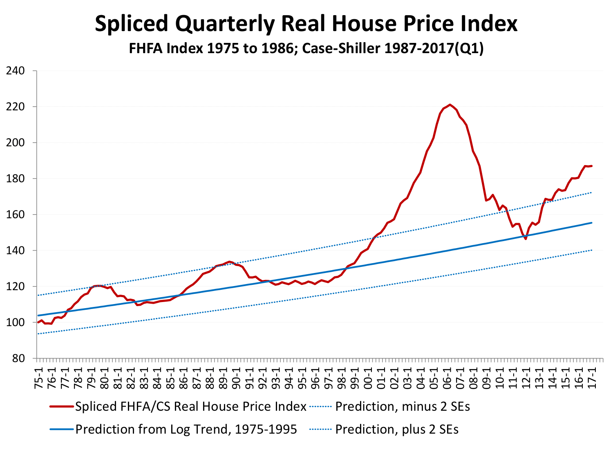
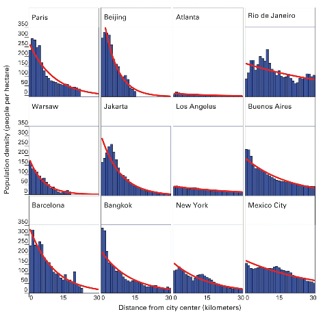
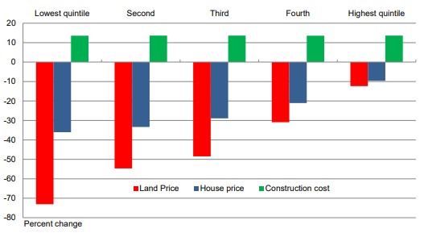
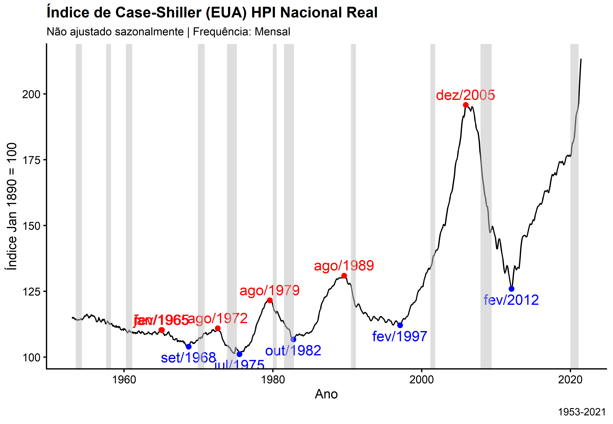
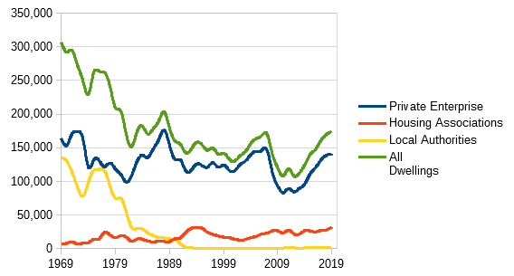

<!--
Above is the YAML (YAML Ain't Markup Language) header that includes a lot of 
metadata used to produce the document.  Be careful with spacing in this header!

If you'd prefer to not include a Dedication, for example, simply delete the 
section entirely, or silence (add #) them. 

If you have other LaTeX packages you would like to include, delete the # 
before header-includes and list the packages after hyphens on new lines.

If you'd like to include a comment that won't be produced in your resulting file 
enclose it in a block like this.

If you receive a duplicate label error after knitting, make sure to delete the 
index.Rmd file and then knit again.
-->

```{r include_packages, include = FALSE}
knitr::opts_chunk$set(echo = FALSE, cache = FALSE, message=FALSE, warning = FALSE, 
                      fig.ext='png', fig.align='center', fig.path = "images/",
                      fig.pos = "H", dev = "png", dpi = 600, out.width = "70%")
type <- knitr::opts_knit$get("rmarkdown.pandoc.to")
# This chunk ensures that the ufscdown package is
# installed and loaded. This ufscdown package includes
# the template files for the thesis.
if(!require(remotes))
  install.packages("remotes", repos = "http://cran.rstudio.com")
if(!require(ufscdown))
  remotes::install_github("lfpdroubi/ufscdown")
library(ufscdown)
library(leaflet)
library(sf)
library(kableExtra)
library(pander)
library(tidyr)
library(dplyr)
library(ggplot2)
library(ggfortify)
library(ggpmisc)
library(changepoint)
library(strucchange)
library(KFAS)
library(xts)
library(timetk)
library(scales)
library(cowplot)
theme_set(theme_cowplot(10))
library(YieldCurve)
library(ustyc)
library(Quandl)
Quandl.api_key("KFMsKFYU9QNph_XnbVUQ")
library(fredr)
fredr_set_key("8866e5606159b57dd69d9d8392ddfd1d")
library(BETS)
library(zoo)
library(DiagrammeR)
library(appraiseR)
gg_color_hue <- function(n) {
  hues = seq(15, 375, length = n + 1)
  hcl(h = hues, l = 65, c = 100)[1:n]
}
warnings(file = "E:/ufsc/dissertacao/index/R-warnings.txt")
```

<!-- On ordering the chapter files:
There are two options:
1. Name your chapter files in the order in which you want them to appear (e.g., 
01-Intro, 02-Data, 03-Conclusions). 
2. Otherwise, you can specify the order in which they appear in the 
_bookdown.yml (for PDF only).

Do not include 00(two-hyphens)prelim.Rmd and 00-abstract.Rmd in the YAML file--
they are handled in the YAML above differently for the PDF version.
-->

<!-- The {.unnumbered} option here means that the introduction will be 
"Chapter 0." You can also use {-} for no numbers
on chapters.
-->


# Introdução {#intro}

```{=latex}
\begin{refsection}
```

O território\index{território} é a base das atividades econômicas e sociais do
país. Um eficiente planejamento territorial passa por desenvolver políticas
públicas que garantam um desenvolvimento equânime de todo o território. De
acordo com @realestate, a terra\index{terra} é a base das atividades econômicas
e sociais de um povo, essencial para a vida e a sociedade, sendo assunto de
diversas disciplinas, como o Direito, Economia, Finanças, Sociologia e a
Geografia.

No Direito, a terra é abordada no direito de propriedade e uso social da terra.
Na Economia, a terra é considerada um dos fatores de produção, ao lado do
trabalho e do capital\index{capital}. Nas Finanças, a terra é considerada como
um bem suscetível de ser dado em garantia, em troca de capital financeiro,
visando propiciar o desenvolvimento. Na perspectiva da Sociologia, a terra é um
bem comum de todos, que deve ser utilizado com fins de obtenção de uma sociedade
melhor. Já a Geografia foca em descrever os elementos físicos da terra e as
atividades humanas das pessoas que as habitam.A Engenharia de Avaliações se
preocupa em reconhecer os atributos que atuam na formação de valor dos bens
imóveis, um conceito ligado à Economia. Para isto, os Avaliadores devem entender
o mercado no qual estes bens estão inseridos. É o mercado que reflete a atitude
dos atores econômicos em resposta às forças sociais e econômicas e às restrições
da lei e dos ônus legais [@realestate, 10].

O mundo vive na atualidade uma situação de crise\index{habitacional!crise}
habitacional sem precedentes, que se agrava desde a Grande
Recessão de 2007-2009. Os reflexos da crise habitacional e financeira global que
foi deflagrada em 2007 pela crise das hipotecas *subprime*[^1] nos EUA e se
espalhou pelo mundo ainda podem ser sentidos, especialmente em seu contexto
habitacional. Se o mundo foi capaz de equacionar o lado financeiro do problema,
salvando as instituições financeiras da bancarrota, o mesmo não aconteceu no
setor habitacional. Pelo contrário, neste setor a crise foi duramente agravada,
seja nos países desenvolvidos, onde a crise teve origem, seja nos países em
desenvolvimento.

[^1]: O termo *subprime* refere-se a um grupo de mutuários com capacidade de 
pagamento duvidosa. Na prática, no entanto, é comum a utilização do termo de 
"hipotecas *subprime*" para referir-se às hipotecas direcionadas a este segmento 
de mutuários.

No caso brasileiro, contudo, a crise habitacional é crônica. A precariedade de
grande parte do estoque de moradias, a falta de infraestrutura básica, e o
grande número de pessoas dividindo o mesmo lar, as vezes até o mesmo cômodo, é
um fato social de muitos países em desenvolvimento e isto não é diferente no
Brasil. Estes fatores, por sua vez, afetam a saúde pública seja em tempos de
normalidade, seja em tempo de crises sanitárias, como a atual pandemia de
COVID-19.

A complexidade do setor habitacional, sua relação com os outros setores da 
economia capitalista e sua importância nas questões de saúde pública e no 
bem-estar da população, assim como aspectos históricos e culturais dos diversos 
países, infelizmente, não permitem a implementação de soluções pré-definidas: as 
políticas habitacionais devem ser estudadas e implementadas *ad-hoc*.

Em países desenvolvidos a atual crise habitacional não necessariamente tem
relação com a falta de moradias disponíveis. Pelo contrário: nos EUA, por
exemplo, estima-se que existam em torno de seiscentas mil pessoas sem moradia,
enquanto o número de residências desocupadas e disponíveis para aluguel gira em
torno de três milhões de unidades, ou seja, existem praticamente seis vezes mais
moradias disponíveis para locação do que pessoas desabrigadas. Saliente-se que o
número de residências desocupadas nos EUA, segundo o último censo de 2019, é
ainda maior: em torno de 16,5 milhões de unidades habitacionais encontram-se
desocupadas. Desta maneira, pode-se argumentar que a crise habitacional na
maioria dos países desenvolvidos, senão em todos, está mais relacionada à falta
de renda das pessoas para o acesso à moradia do que à falta de moradias. O
número de unidades habitacionais disponíveis para locação é tão superior ao
número de pessoas desabrigadas que os especialistas defendem que o
déficit\index{habitacional!déficit} habitacional nestes países seja resolvido
com a simples emissão de *vouchers* para as pessoas que não podem arcar com os
atuais custos de moradia [@olsen_opinion_2016] .

No Brasil, assim como em outros países em desenvolvimento, este não é o caso.
Apesar de alguns relatos de que existem no Brasil em torno de cinco ou seis
milhões de unidades habitacionais vazias, este número ainda é superior ao
número de famílias desabrigadas [@uol]. Ainda que o número de imóveis vazios
fosse superior ao número de famílias desabrigadas, nem todas estas unidades
habitacionais estão disponíveis, apesar de se encontrarem vazias. Além disto,
muitas famílias ainda vivem em moradias de condições precárias, em número de
pessoas por cômodo muito superior ao padrões desejáveis, de maneira que é
possível dizer que a solução para o déficit habitacional dificilmente deixaria
de passar pelo estímulo à construção de novas unidades, seja para a absorver as
pessoas desabrigadas, seja para melhorar as condições de moradia de boa parte da
população abrigada.

Segundo @demanda [p. 7], de 2011 até 2040 o Brasil deverá construir
aproximadamente trinta milhões de unidades para atender à demanda de domicílios,
uma média de praticamente um milhão de unidades por ano, apesar na queda
esperada na demanda por conta das projeções demográficas.

Segundo @ritchie_urbanization_2018, em 1990 em torno de 36,7% da população
urbana brasileira vivia em favelas. É verdade que a proporção da população
urbana vivendo em favelas vem diminuindo desde então. Em 2000, 31,5% da
população urbana ocupava as favelas, ao passo que em 2014 esse número diminuiu
para 22,3% da população urbana.

No entanto, com o crescimento da população brasileira e o aumento da porcentagem
de população urbana desde então, os números totais estão praticamente estagnados,
o que pode ser observado na tabela abaixo.

| Ano | Pop. total (milhões hab.) | Pop. urbana (%) | Pop. urbana (milhões hab.) | Favelas (%) | Favelas (milhões hab.)|
|----:|--------------------------:|----------------:|---------------------------:|------------:|----------------------:|
|1990 | 149,0                     |   73,90         | 110,1                      | 36,7        | 40,4                  |
|1995 | 162,0                     |   77,61         | 125,7                      | 34,1        | 42,9                  |
|2000 | 174,8                     |   81,20         | 141,9                      | 31,5        | 44,7                  |
|2005 | 186,1                     |   82,80         | 154,2                      | 29,0        | 44,7                  |
|2009 | 193,9                     |   84,04         | 162,9                      | 26,9        | 43,8                  |
|2014 | 202,8                     |   85,90         | 174,3                      | 22,3        | 38,9                  |
Table: População habitando favelas no Brasil.

\bcenter
\small Fonte -- Do autor, a partir de dados do Banco Mundial.
\ecenter

A Figura \@ref(fig:slums) mostra graficamente a evolução da população urbana em
favelas (em vermelho) e a população urbana total (em azul). Nota-se que o 
aumento da população urbana ocorreu com a quase estagnada população das 
favelas.

A situação econômica do país deve ter um peso na composição da população
habitando as favelas: a década de 90 e o início da década de 2000 são períodos
sabidamente de crescimento baixo e intermitente, intercalados por graves
recessões na economia brasileira. Já a baixa considerável desta população
desfavorecida entre os períodos de 2009 e 2014 (aprox. 11%) sugere que houve um
impacto do crescimento econômico do período (especialmente no que tange à
manutenção de baixas taxas de desemprego), que veio acompanhado de programas
habitacionais destinados à população de baixa renda, como o Minha Casa Minha
Vida e, ainda que mais timidamente, do instituto da regularização fundiária.
Deve-se lembrar que neste período houve aumento da proporção de população
urbana, ou seja, a diminuição da população favelada com certeza não reflete um
fenômeno de migração da cidade para o campo.

Já para o IBGE [@ibge], segundo dados do censo de 2010, o Brasil possuía 11,4
milhões de pessoas morando em aglomerados subnormais, ou favelas.
 
\begin{citacao}
Para o IBGE, os 'aglomerados subnormais' representam um conjunto constituído de,
no mínimo, 51 unidades habitacionais ocupando ou tendo ocupado, até período
recente, terreno de propriedade alheia (pública ou particular) dispostas, em
geral, de forma desordenada e densa, e apresentando carência em serviços
básicos.
\cite{ibge2}
\end{citacao}

A discrepância entre os números do IBGE e os números internacionais pode ser
explicado por falhas metodológicas. Segundo MARICATO (2002, p. 154) [*apud*
@silva, 9]:

\begin{citacao}
Não há números gerais, confiáveis, sobre a ocorrência de favelas ou de
loteamentos ilegais em todo o Brasil. Por falhas metodológicas ou ainda por uma
dificuldade óbvia de conhecer a titularidade da terra sobre a qual as favelas se
instalam, o IBGE apresenta dados bastante subdimensionados. A busca de números
mais rigorosos nos conduz a alguns diagnósticos elaborados por governos
municipais, teses acadêmicas ou organismos estaduais que, entretanto, fornecem
dados localizados e restritos.
\end{citacao}

```{r slums, fig.cap = "População urbana e população em favelas."}
knitr::include_graphics("images/urban-pop-in-out-of-slums.png")
```
\bcenter
\small Fonte -- @ritchie_urbanization_2018
\ecenter

Deixado o problema sujeito às forças de mercado, a tendência é de agravamento do
problema. A diminuição das taxas de juros a níveis muito baixos causa o
outrora raro problema da armadilha da liquidez, problema que vem atormentando os
países desenvolvidos há alguns anos e agora tem encontrado lugar nos países em
desenvolvimento, como o Brasil [@krugman-emergentes].

A reação dos bancos centrais do mundo a este problema é o de encontrar formas
alternativas de injetar mais liquidez ao sistema, o que pode acabar por
propiciar a formação de novas bolhas especulativas e o setor imobiliário não 
está imune a isto. Pelo contrário, em tempos de incertezas econômicas, o 
mercado imobiliário é um dos destinos preferenciais para os capitais em busca
de reserva de valor. O aumento do preço da terra que pode estar por vir, então,
acompanhado do alto desemprego que se tem gerado em todo o mundo pela pandemia
de COVID-19, tende a agravar sobremaneira o problema da crise habitacional no
mundo e, em especial, onde esta já se tornou crônica, como no Brasil e em outros
países da \gls{AL}.

Além da crise habitacional proveniente deste forte aumento dos preços dos
imóveis, inflar o setor habitacional também não tem dado bons resultados em
termos econômicos e políticos mais gerais:

\begin{citacao}
Os políticos tradicionalmente gostam quando os preços das casas aumentam. As
pessoas se sentem mais ricas e portanto, emprestam e gastam mais, dando um bom
impulso à economia, eles pensam. Quando todo mundo está se sentindo bem com sua
situação financeira, os políticos têm maior chance de reeleição. Mas existe um
outro lado. Habitações caras são inequivocamente ruins para a crescente
população de locatários do mundo rico, forçando-os a reduzir os gastos com
outros bens e serviços. E uma política econômica baseada em compradores de casas
em grandes dívidas não é sustentável. A curto prazo, encontra um estudo do FMI,
o aumento da dívida das famílias aumenta o crescimento econômico e o emprego.
Mas as famílias precisam controlar os gastos para pagar seus empréstimos, então
em três a cinco anos, esses efeitos são revertidos: o crescimento se torna mais
lento do que seria de outra forma e as chances de uma crise financeira aumentam.
\cite{economist-housing-2020}
\end{citacao}

<!--chapter:end:index.Rmd-->

<!--
This is for including Chapter 1.  Notice that it's also good practice to name your chunk.  This will help you debug potential issues as you knit.  The chunk above is called intro and the one below is called chapter1.  Feel free to change the name of the Rmd file as you wish, but don't forget to change it here from chap1.Rmd.
-->

<!--
The {#rmd-basics} text after the chapter declaration will allow us to link throughout the document back to the beginning of Chapter 1.  These labels will automatically be generated (if not specified) by changing the spaces to hyphens and capital letters to lowercase.  Look for the reference to this label at the beginning of Chapter 2.
-->


## Objetivos

A proposta desta pesquisa é aprofundar o conhecimento referente à dinâmica do
mercado imobiliário e das políticas habitacionais, de maneira a planejar a 
utilização dos instrumentos de política do solo no sentido de resolver os 
problemas do crônico déficit habitacional brasileiro, onde milhões de pessoas 
estão desabrigadas ou vivem em situação precária.

### Objetivo Geral

Estudar o comportamento histórico e recente do mercado imobiliário à luz das
variáveis macroeconômicas, de maneira que se possa propor novas políticas
públicas para o setor habitacional.

### Objetivos Específicos 

1. Pesquisar as raízes do grande déficit habitacional crônico brasileiro,
através de uma análise comparativa entre o desenvolvimento econômico brasileiro
e o de outros países, buscando aplicar aqui soluções que eventualmente já tenham
sido aplicadas em outros países com desenvolvimento similiar ao brasileiro;

2. Pesquisar as raízes da atual crise habitacional dos países desenvolvidos;

3. Pesquisar a eventual correlação entre a crise habitacional crônica dos 
países em desenvolvimento e a atual crise habitacional dos países desenvolvidos;

4. Pesquisar as políticas mais eficientes para o setor habitacional que sejam
viáveis para aplicação ao caso brasileiro;

5. Desenhar novas políticas habitacionais baseadas nos instrumentos previstos no 
Estatuto da Cidade e outros porventura necessários, de maneira que possam ser
implementadas de maneira coordenada e focada na solução do problema do 
déficit habitacional crônico vigente no Brasil.

## Estrutura do trabalho

O **Capítulo \@ref(intro), [Introdução]**, apresenta os objetivos, justificativas e
estrutura do trabalho. 

O **Capítulo \@ref(metodo), [Método]**, traz considerações a respeito do método de análise e
de pesquisa.

O **Capítulo \@ref(historico), [Aspectos Históricos]**, faz uma contextualização
histórica do problema do acesso à terra e moradia no Brasil, dado o modelo de
desenvolvimento econômico que aqui se instalou, e compara com o ocorrido em
outros países do mundo ocidental.

O **Capítulo \@ref(economia), [O Mercado Imobiliário e a Economia]**, aborda os
aspectos teóricos e conceituais mais modernos relevantes à interligação do
mercado imobiliário com as variáveis macroecômicas do país, explicando como o
\gls{MI} influencia na Economia do país e vice-versa.

O **Capítulo \@ref(economia-urbana), [Economia Urbana]**, são abordados conceitos
de Economia Urbana que devem ser utilizados para a elaboração de políticas
públicas para o setor habitacional.

O **Capítulo \@ref(indices), [Índices de preços e indicadores de performance do 
\gls{MI}]**, traz um apanhado teórico sobre a confecção de índices de preços de 
imóveis, dá diretrizes para a eventual construção de um ou mais índices 
brasileiro e também traz um histórico recente dos índices de preços de imóveis e 
das taxas de juros de longo prazo nos \gls{EUA}, fazendo considerações a 
respeito da correlação entre estas variáveis.

O **Capítulo \@ref(crise2008), [Ciclos, bolhas especulativas e a crise
financeira-habitacional de 2007-2008]**, faz uma reanálise da crise
financeira-habitacional de 2008 a luz dos recentes acontecimentos e suas
consequências até os tempos presentes, passando pelas origens da crise, a queda
acentuada das taxas de lucros da economia capitalista, os erros de análise de
risco com a precifição dos derivativos de crédito imobiliário, e, finalmente, o
pós-crise, ou seja, que medidas tomaram os países mais atingidos pela crise e
como ela continua a produzir seus efeitos até os dias atuais.

O **Capítulo \@ref(politicas), [Políticas Habitacionais]**, faz um histórico a
respeito das principais abordagens utilizadas no mundo ocidental para solução da
crise habitacional de fins do século XIX/início do século XX e faz considerações
a respeito da atual crise habitacional e como ela vem sendo enfrentada no mundo.

Finalmente, o **Capítulo \@ref(conclusao), [Conclusão]**, traz um resumo dos
resultados obtidos e as propostas de implementação das políticas mais adequadas
ao caso brasileiro.

```{=latex}
\printbibliography[heading=subbibintoc]
\end{refsection}
```

<!--chapter:end:01-intro.Rmd-->

# Método {#metodo}

Inicialmente foi elaborada uma pesquisa histórica que busca as causas da crise 
habitacional crônica que se estabeleceu no Brasil ao longo de todo o século XX,
chegando até os dias atuais.

Para melhor análise, foi contextualizado o fenômeno da urbanização no Brasil em
relação a urbanização de outros países do mundo ocidental, o que se deu em
diferentes tempos históricos. Procurou-se destacar e traçar um paralelo entre os
países que tiveram desenvolvimento similar ao brasileiro.

Então, deu-se início à pesquisa sobre a presente crise habitacional dos países
desenvolvidos, com início pós-crise financeiro-habitacional de 2008, para a
qual foi essencial a pesquisa sobre o que estava na raiz desta crise e a 
identificação dos motivos que levaram ao surgimento da nova crise habitacional
que atinge os países desenvolvidos.


Para o desenvolvimento do trabalho será pesquisado o que os países com
desenvolvimento similar ao do Brasil, guardadas as épocas distintas em que
ocorreram, fizeram para equacionar a crise habitacional gerada pela suas
respectivas crises agrárias. Baseado no estudo das políticas habitacionais
utilizadas nestes países de referências, prentende-se pesquisar os meios pelos
quais poderia o Brasil tratar de implementar em seu território estes
instrumentos identificados, com as devidas adaptações necessárias.

## Etapas

A figura\@ref(fig:fluxo) mostra resumidamente o fluxograma da pesquisa.

```{r fluxo, fig.cap="Fluxograma de pesquisa", out.width="80%"}
grViz("
digraph boxes_and_circles{
  
  rankdir = TD
  
  # add node statements
  node [shape = box
        fontname = Helvetica
        penwidth = 2.0]
  Introdução; 'Aspectos Históricos'; 'O Mercado Imobiliário\ne a Economia'; 
  'Índices de preços e\nindicadores de performance do MI'; 'Economia Urbana';
  'Ciclos, bolhas e\ncrise de 2008'; 'Políticas Hab.'; Conclusão
  
  # add edge statements
  
  Introdução -> 'Aspectos Históricos' [headlabel = 'Origens dos problemas\n hab. crônicos:\nQuestão Agrária'
                                       labeldistance=7 
                                       labelangle=45]
  Introdução -> 'O Mercado Imobiliário\ne a Economia' [label = 'Origens dos problemas\n hab. atuais']
  'O Mercado Imobiliário\ne a Economia' -> 'Ciclos, bolhas e\ncrise de 2008' [label = 'Como evitar\nnovas crises?\n(Demanda)']
  'O Mercado Imobiliário\ne a Economia' -> 'Índices de preços e\nindicadores de performance do MI' [headlabel = 'Como prever\nnovas crises?'
                                                                labeldistance=5
                                                                labelangle=45]
  'O Mercado Imobiliário\ne a Economia' -> 'Economia Urbana' [headlabel = 'Como evitar\nnovas crises?\n(Oferta)'
                                                                labeldistance=5
                                                                labelangle=0]
                                                                
  'Economia Urbana' -> 'Políticas Hab.'
  
  'O Mercado Imobiliário\ne a Economia' -> 'Políticas Hab.' [headlabel = 'Novas crises\nhab.'
                                                                labeldistance=6
                                                                labelangle=-25]
  'Aspectos Históricos' -> 'Políticas Hab.' [headlabel = 'Crise hab. \ncrônica'
                                                labeldistance=4
                                                labelangle=25]
  'Índices de preços e\nindicadores de performance do MI' -> 'Políticas Hab.'
  'Ciclos, bolhas e\ncrise de 2008' -> 'Políticas Hab.'
  'Políticas Hab.' -> Conclusão [headlabel = 'Como superar?'
                                      labeldistance=5.5
                                      labelangle=-65]
}
")
```

<!--chapter:end:02-metodo.Rmd-->

# Aspectos históricos {#historico}

```{=latex}
\begin{refsection}
```

\begin{epigrafe}
	\vspace*{\fill}
	\begin{flushright}
		\textit{``Do ponto de vista social, todos os fatores se resumem\\ 
		em um `recurso' elementar: o homem. Logo, não é possível seguir\\ 
		conceptualmente o processo de industrialização se não sabemos como\\ 
		o homem aplicava antes o seu tempo de trabalho, como o aplica depois,\\ 
		o que ocorre quando passa de um modo de produzir a outra e em que\\ 
		condições realiza essa passagem.[ \ldots ] Considerando que na estrutura\\ 
		da economia que precede a industrialização quase toda a população está\\ 
		na `agricultura', é preciso estudar detidamente a organização deste setor.\\ 
		Em outras palavras, se o problema da `agricultura' não foi entendido,\\ 
		tampouco será possível compreender o problema da `indústria', ou manufatura,\\ 
		nem o papel que os serviços desempenham. Falando de modo sucinto, a \\
		`manufatura' e os serviços são novas formas de aplicação de parte do\\ 
		tempo de trabalho da população que antes estava na `agricultura'. Mas,\\
		por sua vez, a própria `agricultura' se reorganiza quando a transferência ocorre.''\\
		(RANGEL, 1954)}
	\end{flushright}
\end{epigrafe}

## Introdução

O Capitalismo é um sistema político-econômico que, historicamente, substitui o
Feudalismo, sistema em que a população encontrava-se toda concentrada no campo.

Nas sociedades pré-capitalistas, a população predominante rural organizava-se no
chamado 'Complexo Rural', ou seja, num ambiente rural onde eram produzidos não
apenas os produtos agrícolas, mas onde também eram produzidos, pelos próprios
camponeses, em uma muito baixa produtividade, todo o ferramental necessário para
as suas atividades agrícolas, assim como suas vestes, utensílios domésticos e
outros itens.

A passagem do sistema feudal para o sistema capitalista ocorre com a *divisão
social do trabalho*, ou seja, com o desenvolvimento de indústrias que vão aos
poucos absorver as atividades não-agrícolas realizadas no campo.

\begin{citacao}
Numa economia em expansão, com crescente industrialização, comercialização e
urbanização, numerosos processos anteriormente levados a efeito antes dentro da
casa da família ou unidade (econômica) familiar, ou são completamente
abandonados ou substituídos por processos semelhantes em bases
comerciais. \cite[p. 41]{kuznets} \textit{apud} \cite[p. 218]{rangel1956}.
\end{citacao}

O desenvolvimento do capitalismo brasileiro no século XX se deu pela chamada
"via prussiana" ou *junker* [@rangel1988, 155], que é um tipo de reforma agrária
que consiste na substituição do latifúndio feudal pelo latifúndio capitalista.
Este tipo de desenvolvimento tem como característica se dar sem a execução
prévia da reforma agrária no sentido clássico, *i.e.* no sentido da distribuição
dos latifúndios em pequenas propriedades, a chamada via clássica ou democrática.
Apesar de permitir imprimir um "impulso extraordinário e energético" à
industrialização, a via prussiana "promove uma distribuição muito desigual da
renda" [@rangel1988, 155]. A característica talvez mais perniciosa do
desenvolvimento capitalista por esta via se dá pela formação de um "exército
industrial de reserva" demasiado grande, ou seja, um aumento da população urbana
desproporcional à necessidade de mão-de-obra necessária nas indústrias do
capitalismo nascente nas cidades. O resultado é o crescimento acelerado e
desordenado das cidades, com a inevitável formação dos cortiços e favelas para
acomodar a parte mais carente da população que, expulsa do campo, vai se
aglomerar nos grandes centros urbanos em busca da sua sobrevivência.

\newpage

## População rural e população urbana

Dados compilados pelas Nacões Unidas foram organizados na tabela 
\@ref(tab:pop-table) com o intuito de demonstrar a evolução e o atual tamanho 
deste problema.

```{r}
pop_urb <- read.csv("data/urbanization-last-500-years.csv")
```

```{r}
pop_urb_selection <- pop_urb[
  which(pop_urb$Entity == "World" |
    pop_urb$Entity == "More developed regions" |
    pop_urb$Entity == "Less developed regions" |
    pop_urb$Entity == "Europe" |  
    pop_urb$Entity == "Eastern Europe" |  
    pop_urb$Entity == "Western Europe" |  
    pop_urb$Entity == "Latin America and the Caribbean" |  
    pop_urb$Entity == "South America" |  
    pop_urb$Entity == "Central America" |    
    pop_urb$Entity == "Northern America" | 
    pop_urb$Entity == "United States" |
    pop_urb$Entity == "Argentina" |
    pop_urb$Entity == "Brazil"), ]
pop_table <- reshape(pop_urb_selection, timevar = "Year", idvar = c("Entity", "Code"), direction = "wide")
colnames(pop_table) <- stringr::str_replace_all(colnames(pop_table), "Urban.....", "")
pop_table <- pop_table[, c(1, 2, order(as.numeric(colnames(pop_table)[3:91])))]
```


```{r pop-table}
knitr::kable(pop_table[c(13, 8, 7, 5, 4, 12, 6, 10, 3, 9, 11, 1, 2), 
          c("Entity", "1960", "1970", "1980", "1990", "2000", "2014")],
          row.names = FALSE, 
          format = "latex",
          caption = "População Urbana (\\%).", digits = 1,
          format.args = list(big.mark = ".", decimal.mark = ","),  
          booktabs = TRUE) %>% 
  kable_styling(latex_options = c("striped", "HOLD_position"),
                stripe_index = c(1, 4, 7)) %>%
  add_header_above(c("", "Ano" = 6)) %>%
  pack_rows("Mundo", 1, 3) %>%
  pack_rows("Europa", 4, 6) %>%
  pack_rows("América", 7, 13)
```
\bcenter
\small Fonte -- @doi:10.1177/0959683609356587
\ecenter

Ainda, para melhor ilustrar, foram elaborados os gráficos das figuras 
\@ref(fig:pop-urb-mundo) a \@ref(fig:pop-urb-brazil-brics).

Na Figura \@ref(fig:pop-urb-mundo), pode-se notar que a população urbana no 
Brasil vem aumentando, desde 1950, numa taxa superior à média dos países em
desenvolvimento (*Less developed regions*), atingindo uma proporção superior 
inclusive à dos países mais desenvolvidos (*More developed regions*).

Na Figura \@ref(fig:pop-urb-continents) pode-se ver as séries da população
urbana em diversos continentes desde 1800. Percebe-se neste gráfico também uma
maior aceleração do crescimento da população urbana na América Latina e Caribe a
partir de meados da década de 40, chegando esta região a ultrapassar a população
urbana da Europa Ocidental no início do século corrente.

```{r pop-urb-mundo, out.width = "80%", fig.cap = "População Urbana - Brasil vs. Mundo."}
pop_urb %>%
  filter(Entity == "World" | 
         Entity == "More developed regions" | 
         Entity == "Less developed regions" |
         Entity == "Brazil") %>%
  ggplot(., aes(x = Year, y = Urban...., color = Entity)) +
  geom_line() +
  labs(title = "População Urbana", 
       subtitle = "Brasil vs. Mundo.", 
       caption = "Desde 1950 ") +
  ylab("%") +
  coord_cartesian(xlim = c(1950, 2016)) +
  scale_x_continuous(expand=c(0,0),
                     breaks = seq(1950, 2010, 10)) +
  guides(color=guide_legend(title="País/Região"))
```
\bcenter
\small Fonte -- @doi:10.1177/0959683609356587
\ecenter

A Figura \@ref(fig:pop-urb-brazil-latinAmerica) mostra a evolução da população
urbana no Brasil em comparação com o continente sul-americano e a \gls{AL},
dando destaque para alguns vizinhos. 

```{r pop-urb-continents, out.width = "80%", fig.cap = "População Urbana - Nos diferentes Continentes."}
pop_urb %>%
  filter( 
    Entity == "Latin America and the Caribbean" |
    Entity == "Europe" |
    Entity == "Western Europe" |  
    Entity == "Asia" |
    Entity == "Oceania" |
    Entity == "Africa") %>%
  ggplot(., aes(x = Year, y = Urban...., color = Entity)) +
  geom_line() +
  labs(title = "População Urbana", 
       subtitle = "Nos diferentes continentes.", 
       caption = "Desde 1800 ") +
  ylab("%") +
  coord_cartesian(xlim = c(1800, 2016)) +
  scale_x_continuous(expand=c(0,0),
                     breaks = seq(1800, 2010, 50)) +
  annotate("rect", 
           xmin= c(1914, 1939), 
           xmax = c(1919, 1946), 
           ymin = -Inf, ymax = +Inf, 
           alpha = .2) +
  guides(color=guide_legend(title="País/Região"))
```
\bcenter
\small Fonte -- @doi:10.1177/0959683609356587
\ecenter


```{r pop-urb-brazil-latinAmerica, out.width = "80%", fig.cap = "População Urbana - Brasil vs. \\gls{AL}."}
cols <- gg_color_hue(8)
pop_urb %>%
  filter( 
    Entity == "Latin America and the Caribbean" |
    Entity == "South America" |  
    Entity == "Brazil" |    
    Entity == "Argentina" |
    Entity == "Chile" |
    Entity == "Uruguay"  ) %>%
  ggplot(., aes(x = Year, y = Urban...., color = Entity)) +
  geom_line() +
  labs(title = "População Urbana", 
       subtitle = "Brasil vs. América Latina.", 
       caption = "Desde 1950 ") +
  ylab("%") +
  coord_cartesian(xlim = c(1950, 2016)) +
  scale_x_continuous(expand=c(0,0),
                     breaks = seq(1950, 2010, 10)) + 
  scale_color_manual(values=c( cols[3],  cols[1],  cols[2],  
                               cols[5],  cols[6],  cols[4])) +
  guides(color=guide_legend(title="País/Região"))
```
\bcenter
\small Fonte -- @doi:10.1177/0959683609356587
\ecenter

A Figura \@ref(fig:pop-urb-brazil-developed) mostra o comparativo da população
urbana no Brasil com uma seleção de países desenvolvidos desde 1800.  Quanto aos
países desenvolvidos, nota-se que tiveram, primeiramente, uma ascenção um pouco
mais lenta da população urbana (excessão para a Grã-Bretanha, primeira nação a
industrializar-se), que essa ascenção teve lugar já na década de 1850 e que
houve uma estabilização gradual, por volta da década de 1970. Já quanto ao
Brasil nota-se uma grande aceleração no crescimento da população urbana
brasileira após a década de 1950, o que reflete o nascimento tardio do
capitalismo por aqui e, por fim, que, ao contrário dos países desenvolvidos, não
houve ainda uma estabilização da proporção de população urbana e esta segue em
crescimento, tendo chegado a níveis maiores aqui do que no resto do mundo
desenvolvido.

```{r pop-urb-brazil-developed, out.width = "80%", fig.cap = "População Urbana - Brasil vs. Países Desenvolvidos."}
pop_urb %>%
  filter( 
    Entity == "Brazil" |    
    Entity == "United States" |
    Entity == "Germany" |
    Entity == "France"|
    Entity == "United Kingdom" |
    Entity == "England and Wales" |
    Entity == "Netherlands" |
    Entity == "Switzerland"
      ) %>%
  ggplot(., aes(x = Year, y = Urban...., color = Entity)) +
  geom_line() +
  labs(title = "População Urbana", 
       subtitle = "Brasil vs. Países Desenvolvidos.", 
       caption = "Desde 1800 ") +
  ylab("%") +
  coord_cartesian(xlim = c(1800, 2016)) +
  scale_x_continuous(expand=c(0,0),
                     breaks = seq(1800, 2010, 50)) + 
  scale_color_manual(values=c(cols[8], cols[1], cols[2], cols[3], cols[4], cols[6], 
                              cols[7], cols[2], cols[5])) +
  annotate("rect", 
       xmin= c(1914, 1939), 
       xmax = c(1919, 1946), 
       ymin = -Inf, ymax = +Inf, 
       alpha = .2) + 
  guides(color=guide_legend(title="País/Região"))
```
\bcenter
\small Fonte -- @doi:10.1177/0959683609356587
\ecenter

E a Figura \@ref(fig:pop-urb-brazil-brics) mostra a comparação dos dados do 
Brasil com os outros países do grupo dos \gls{BRICS}.

```{r pop-urb-brazil-brics, out.width = "80%", fig.cap = "População Urbana - Brasil vs. \\gls{BRICS}."}
pop_urb %>%
  filter( 
    Entity == "Brazil" |    
    Entity == "Russia" |
    Entity == "India" |
    Entity == "China" |
    Entity == "South Africa") %>%
  ggplot(., aes(x = Year, y = Urban...., color = Entity)) +
  geom_line() +
  labs(title = "População Urbana", 
       subtitle = "Brasil vs. BRICS.", 
       caption = "Desde 1950 ") +
  ylab("%") +
  coord_cartesian(xlim = c(1950, 2016)) +
  scale_x_continuous(expand=c(0,0),
                     breaks = seq(1950, 2010, 10)) +
  guides(color=guide_legend(title="País/Região"))
```
\bcenter
\small Fonte -- @doi:10.1177/0959683609356587
\ecenter

Em meados dos anos 60, apenas 46,1% da população brasileira era urbana, uma
proporção bem menor do que a dos países do então *primeiro mundo* (\gls{EUA} e
Europa Ocidental), hoje ditos *desenvolvidos*, que girava então em torno dos 70%
da população.

Em apenas 10 anos, já em meados da década de 70, este número sofria um aumento
vertiginoso de quase 10 pontos percentuais, com 55,9% da população urbana. A
população urbana brasileira equiparava-se à da Europa Oriental.
Já na década de 80 a população urbana no Brasil ultrapassaria a da Europa
Oriental, chegando à valores próximos da média para o continente europeu como um
todo (ocidental e oriental), enquanto a população urbana no mundo desenvolvido
se estagnava.

Chegado os anos 90, a população urbana brasileira atingiu notáveis 73,9% da
população brasileira, número equiparado ao da população urbana do mundo
desenvolvido (74% na Europa Ocidental). Em meados dos anos 2000, já então no
século atual, ela ultrapassou, em proporção, a população urbana da Europa
Ocidental e a dos \gls{EUA}, chegando ao último dado de 2015, com 85,8% da
população brasileira vivendo nas cidades.

Há de se levar em consideração, ainda, que este "êxodo rural" ainda foi
acompanhado de um crescimento demográfico expressivo.

Todo este crescimento expressivo seria salutar se tivesse se dado no contexto do
rápido desenvolvimento da economia nacional. Isto, porém, não ocorreu durante
todo o período analisado. O crescimento da economia brasileira acelerou-se na
segunda quadra da década de 60 e manteve-se alto até fins da década seguinte,
porém estagnou-se na década de 80, a chamada década perdida, sem que com isso a
população urbana deixasse de crescer vertiginosamente.

Para Rangel [-@rangel1986a, 151]:

\begin{citacao}
"essa redistribuição da população entre os quadros urbano e rural não tem, em si
mesma, nada de anormal.[...] A urbanização, em si mesma, é um fenômeno
perfeitamente normal, numa economia em processo de industrialização. O que não é
normal é o ritmo que imprimimos ao \emph{nosso} processo de urbanização, que
implica criar, nas cidades, uma oferta de mão-de-obra em descompasso com a
demanda que a industrialização vai criando."
\end{citacao}

Todo este processo só poderia, então, ter desaguado no inchaço das principais
cidades brasileiras. Desnecessário dizer que o planejamento urbano nestas
condições é praticamente inviável. As administrações municipais, nem que fossem
as mais eficientes, teriam capacidade de planejar e disciplinar o uso do solo
urbano nesta "velocidade migratória".

Segundo Rangel, com o desenvolvimento da indústria pesada no Brasil, a crise 
agrária, antes cíclica, tornou-se crônica, criando um [-@rangel1988, 156-157]:

\begin{citacao}
"vasto deslocamento de população, na direção geral campo-cidade. Esse movimento
se faz escalonadamente, das áreas rurais para as cidades pequenas; destas para
as médias e grandes, e posteriormente para as metrópoles gigantes. No fim da
linha, portanto, vamos encontrar as cidades de São Paulo e do Rio de Janeiro".
\end{citacao}

De fato, os dados parecem mostrar a pertinência desta análise. 

Enfim, para Rangel, a origem deste "multitudinário deslocamento demográfico",
está "o modo como o país preparou sua estrutura agrária para a industrialização".

## A questão agrária

Segundo Rangel, a Questão Agrária, embora nascida na área rural, é um fenômeno
urbano. Com isto Rangel quer dizer que a crise agrária, a crise que se dá na
transição do feudalismo para o capitalismo, começa no campo, onde se passa o 
enredo do feudalismo, para a cidade moderna, onde se desenvolve o capitalismo.

Para uma melhor compreensão da questão se faz mister compreender os mecanismos 
de funcionamento dos sistemas citados, isto é, do feudalismo e do capitalismo, 
especialmente no que tange a transição entre eles, nos motivos que levam ao
fim de um sistema e desembocam quase que inequivocamente (excetos raras 
exceções) no outro.

### Feudalismo

As "leis", ou princípios, ou ainda os "motores primários" do feudalismo são
[@rangel1985, 126]:

* *All land is king's land* 
* *Nulle terre sans seigneur*

O primeiro princípio, *all land is king's land*, ou "toda a terra pertence ao
rei", quer dizer, mais precisamente, que todo o domínio da terra está
concentrada nas mãos do rei, que as explora através dos laços de suserania e
vassalagem, típicos do feudalismo. Já o segundo princípio, segundo Rangel
[-@rangel1961, 219], *nulle terre sans seigneur*, quer dizer que "a existência
de terra livre é incompatível com o feudalismo", ou seja, toda a terra deve ter
um senhor, que a administra a serviço da Coroa e lhe paga tributo. Na existência
de terra livre, como será visto, o feudalismo não se pode desenvolver, e a
tendência é que haja ou a formação de comunidades em estado tribal, ou que sejam
estabelecidas formas de escravidão. Ou seja, a terra, "nas condições feudais,
não tem preço e é, de fato ou de direito, inalienável" [@rangel1960, 206].

#### O feudalismo no Brasil

Segundo @faoro [p. 155] o feudalismo no Brasil é uma polêmica instaurada na
historiografia brasileira. Para Faoro, "a tese mais convincente em nossa
história repele o chamado feudalismo brasileiro", segundo a qual "a empresa de
plantação teve nítido cunho capitalista -- dentro do capitalismo mercantil e
politicamente orientado do século XVI português".

Estes argumentos presentes na historiografia brasileira, contudo, tentam
inutilmente classificar o sistema vigente no Brasil colonial (e em outros países
de formação análoga) levando em conta diversas características econômicas,
sociais, etc, dos sistemas "originais", sem levar em conta as peculiaridades
duais da nossa formação histórica que, é claro, "não retração fielmente a
história universal" [@dualidade-basica, p. 296].

O "caos aparente" da economia brasileira, faz parecer insolúvel o problema de
classificar o sistema econômico vigente no Brasil em qualquer tempo, haja vista
a concomitância de todas as etapas de desenvolvimento da sociedade humana, como
o comunismo primitivo das sociedades tribais, a escravidão, o feudalismo em
diversas formas e o capitalismo em todas as suas etapas [@dualidade-basica, p.
293]. Desta forma, é claro que o "latifúndio brasileiro não é idêntico ao
feudalismo medieval europeu ou asiático" [@dualidade-basica, p. 293]. "O senhor
de escravos brasileiro era ao mesmo tempo um *dominus*, no sentido romano, e um
comerciante, no sentido holandês do século XVII, ou um industrial, no sentido
inglês, dos séculos XVIII e XIX" [@dualidade-basica, p. 297].

Ainda, deve-se estar ciente de que esta dualidade é dividida em um lado interno
e um lado externo, *i.e* dizer que o latifúndio brasileiro era
feudal-capitalista quer dizer: *internamente* feudal -- no interior da fazenda,
nas relações entre o latifundiário e os "agregados", a enfiteuse -- e
*externamente* capitalista -- nas relações entre o latifúndio e as outras
unidades da economia nacional e com o mercado mundial [@dualidade-basica, p.
297].

Ensina @dualidade-basica [p. 307-308], que o capital comercial surgente na
Europa, ainda "fundamentalmente feudal", em fins do século XVIII:

\begin{citacao}
estava suscitando, por essa época, na Europa, um tipo novo de organização da
produção, a manufatura, pela subordinação ao seu comando de artesãos
individuais. Desta lado do oceano, suscitava formas igualmente novas de
organização da produção, de acordo com as circunstâncias. Onde a população
nativa atingira certo grau de desenvolvimento, mostrando-se capaz de praticar
uma agricultura estável, limitava-se a controlar a terra, pois esta lhe bastava
para garantir o controle sobre a população. Onde, como aqui, a população nativa
era ainda muito primitiva, não havendo estrutura social estável ou hábitos de
trabalho arraigados, a própria experiência imporia, aos poucos, relações de
produção ainda mais primitivas, isto é, a escravidão.
\end{citacao}

Segundo @rangel1956 [p. 206], a atitude do economista do país subdesenvolvido
não pode ser a mesma do economista dos países mais desenvolvidos, que, *tendo
vivido o processo histórico completo, assistiram simultaneamente à morte do ser
antigo e à sua representação*.

\begin{citacao} 
a absorção sem crítica do \emph{dernier cri} em matéria de ciência econômica por
ele lhe será fatal, porque implica mudar o reflexo ideal da realidade sem que
essa realidade mesma tenha mudado, ou sem que tenha mudado senão em parte. Para
nós, o pensamento dos antigos guarda muito de sua primitiva validade porque
reflete uma realidade que, em certa medida, continua a ser a nossa
\cite[p.~206-207]{rangel1956}.
\end{citacao}

Em outras palavras, para @rangel1956, os economistas dos países
subdesenvolvidos, ou mais modernamente, países "em desenvolvimento", devem
utilizar em sua análise as teorias clássicas, neoclássicas, keynesianas, à
medida que subsistem nestes países características próprias da realidade
econômica que imperavam no Velho Mundo quando elas foram concebidas.

Desta maneira, o feudalismo tal como concebido na Europa não teve a mesma 
estrutura que o feudalismo no Brasil, assim como o sistema feudal brasileiro foi
não-concomitante com o sistema feudal europeu.

Segundo @furtado2009 [p. 227], "nas regiões de processo milenar de povoamento, a
economia agrícola se desenvolveu partindo do sistema de produção para
subsistência das populações locais para alcançar formas mais complexas de
divisão social do trabalho que se traduziam em diferenciação locacional de
atividade econômica", enquanto no Brasil, ao contrário destas regiões e de
outros países de povoamento recente, como os \gls{EUA}, a agricultura nasceu sob
a forma de grande empresa comercial, antecendente ao próprio país, ou seja, a
agricultura aqui nasceu não para o abastecimento da população fixada no
território, mas voltada à exportação. A estrutura agrária brasileira, dessa
forma, se moldou não pela escassez de terras, como na Europa, ou pela escassez
de mão-de-obra, como nos \gls{EUA}, mas pela escassez de capital e capacidade
empresarial [@furtado2009, 228].

Diferem o Brasil e outros países da \gls{AL} também em seu processo de
desenvolvimento em relação a outros países de povoamento recente, como os
\gls{EUA}. Isto decorre do fato que Portugal e Espanha, quando promoveram a
colonização no Brasil, encontravam-se afligidos por uma permanente escassez de
mão-de-obra, ao contrário da situação da Inglaterra do século XVII, que graças
aos *enclosures*, havia criado um enorme excedente populacional, da qual podia
se desfazer, em parte, enviando parte do excedente populacional para o 
povoamento das colônicas, sem comprometimento dos custos de mão-de-obra na
metrópole [@furtado2005, 27]. 

Segundo Rangel [-@rangel1989, 726], através da bula papal de Alexandre IV, de 4
de maio de 1493 (ainda que tenha sido depois alterada pelo tratado de
Tordesilhas), toda a terra onde hoje encontra-se a América Latina era declarada
propriedade do rei. Isto é, estava satisfeito o primeiro princípio para a
implantação do feudalismo nos trópicos: *all land is king's land*. A propriedade
sobre as terras era total, de maneira que pode-se dizer que, juridicamente, em
nenhum momento a propriedade fundiária esteve mais concentrada do que naquele
primeiro momento. 

É importante destacar, porém, que a coroa portuguesa, assim como a espanhola,
encontrava-se pressionada politicamente pelas demais nações européias, que
questionavam o direito à totalidade das terras, reconhecendo o direto apenas às
terras efetivamente ocupadas. No caso da coroa espanhola, a exploração de metais
preciosos logo permitiu que esta estabelecesse a defesa das novas terras, ainda
que não em toda a sua extensão [@furtado2005, p. 13]. Já no caso da coroa
portuguesa, a ocupação das novas terras exigiu, a princípio, a exploração
agrícola do território brasileiro[^2], com a utilização de mão-de-obra escrava,
então a única forma encontrada para a ocupação economicamente viável das novas
terras [@furtado2005, p. 17], o que foi feito inclusive desviando recursos de
empresas mais produtivas, como as Companhia das Índias Orientais [@furtado2005,
p. 12].

[^2]: a descoberta e exploração de metais preciosos no Brasil só ocorreu muito 
mais tarde, nos primeiros decênios do século XVIII [@furtado2005, p. 79].

O segundo princípio necessário para a implantação do feudalismo, portanto,
*nulle terre sans seigneur*, ou seja, o princípio de que não deve haver terra
sem senhor, também indispensável para a existência do feudalismo -- no
surgimento do feudalismo na Europa, sem que todas as  terras  social e
economicamente significativas estivessem apropriadas, a tendência natural do
escravo liberto seria o retorno às condições de vida tribal -- não era possível
em território tão vasto e inexplorado como era o território latino-americano
naquele momento [@rangel1989, 726].

Desta maneira, os feudos que aqui se iam estabelecendo, através do instituto da
enfiteuse [@rangel1989, 726], os pactos de suserania-vassalagem que iam do servo 
do gleba ao rei, passando por diversos patamares, muito diferiam dos feudos 
europeus da Alta Idade Média, que ao contrário dos pactos aqui estabelecidos, 
começavam a ser constituídos pela base, convertendo os escravos libertos em 
servos e constituindo a pequena e a grande nobreza, "tendendo afinal a, com o 
tempo, colocar no píncaro o rei" [@rangel1989, 727].

A esse respeito também escreveu Alceu Amoroso Lima [-@amoroso, 51], na grande
obra organizada por Vicente Licínio Cardoso:

\begin{citacao}
Foi-se vendo pouco a pouco – e até hoje o vemos ainda com surpresa, por vezes –
que o Brasil se formara às avessas, começara pelo fim. Tivera Coroa antes de ter
Povo. Tivera parlamentarismo antes de ter eleições. Tivera escolas superiores
antes de ter alfabetismo. Tivera bancos antes de ter economias. Tivera salões
antes de ter educação popular. Tivera artistas antes de ter arte. Tivera
conceito exterior antes de ter consciência interna. Fizera empréstimos antes de
ter riqueza consolidada. Aspirara a potência mundial antes de ter a paz e a
força interior. Começara em quase tudo pelo fim. Fora uma obra de inversão.
\end{citacao}

Segundo Rangel [-@rangel1989, 729], as condições em que operavam os nossos
feudos mais se assemelhavam às vigentes na República Romana e nos primeiros
tempos do Império, o que quer dizer que, aqui, internamente, até que o monopólio
da terra estivesse garantido, somente haveria viabilidade para o sistema
escravagista.

Com efeito, é sabido que foi necessário importar o escravo africano, que era 
socialmente mais avançado que os índios que aqui habitavam, fazendo-o 
prisioneiro do latifúndio, haja vista que o índio estava habituado a prover o 
seu sustento de forma natural nas terras que aqui habitavam.

A Coroa portuguesa [@rangel1989, 731]:

\begin{citacao}
não tinha pressa em dispor de todas as suas terras, mas apenas das suficientes
para implantar fazendas e estâncias, deixando aberta a porta para novas doações,
que comprassem novas vassalagens, aumentando o poder, a riqueza e a glória da
Coroa.
\end{citacao}

Assim, sobravam terras entre uma fazenda e outra, o que impossibilitava o modo
de produção feudal (pela não satisfação do princípio *nulle terre sans
seigneur*), mas apenas o modo de produção escravista. Exceto por algumas regiões
do Brasil onde a pecuária extensiva logrou ocupar uma vasta extensão contínua de
terra, como no Rio Grande do Sul, o feudalismo só viria a se estabelecer muito
tempo depois, com a abolição da escravidão (1888) e a Proclamação da República
(1889) [@rangel1989, 732-733].

Porém, para que fosse possível o fim da escravidão sem que houvesse retorno às
formas primitivas de produção pré-escravagistas, foi necessário um longo
processo que teve início com a Lei do Tráfico e a Lei de Terras, ambas de 1850
[@rangel1989, 732].

Enquanto a Lei do Tráfico levaria inevitavelmente ao fim da escravidão em algum
ponto futuro, já que a "lei demográfica peculiar ao escravismo é a reprodução
restrita, o que supõe aportes constantes de mão de obra alienígena", a Lei de
Terras preparava o território para o novo regime que teria lugar, o feudalismo,
através da promoção da efetiva ocupação do território, ou seja, de todas as
terras acessíves, habitáveis e agricultáveis [@rangel1989, 732-733].

Aqui é preciso fazer um parêntese, já que a historiografia hoje dominante
condena veementemente essa Lei de Terras como a principal culpada da má
distribuição das terras no Brasil até os dias atuais [ver @accioly2018, p.
47-48]. Sabe-se que isto, pelo menos em parte, é obviamente verdadeiro. No
entanto, o que estes autores ignoram é que, economicamente falando, esta era a
única coisa viável naquele momento. Vale dizer que, onde a condição *nulle terre
sans seigneur* não logrou após a abolição da escravidão, como no estado do
Maranhão, houve retrocesso a relações de produção pré-escravistas [@rangel1989,
733-734].

### A crise do feudalismo

A crise clássica da sociedade feudal ocorre quando a produção agrícola não
consegue suprir a demanda da superpopulação gerada. Segundo Rangel
[-@rangel1961, 219]:

\begin{citacao} 
"tempo houve em que a expansão do estoque populacional era objetivamente a
maneira mais eficaz de expandir as forças produtivas e o produto social. Nesse
tempo (regime feudal), a riqueza dos príncipes se media pelas almas dos seus
domínios, e aumentar o número destas era a maneira óbvia de expandir aquela
riqueza e também a do corpo social. Este foi forjando para si uma ética, um
direito e uma política conducentes a esse resultado".
\end{citacao}

A crise do feudalismo, sistema eminentemente agrário, e o consequente surgimento
do capitalismo, com o surgimento das cidades modernas, se dá no contexto da 
dissolução do Complexo Rural, o que descreve-se nas seções a seguir.


Na Europa, onde havia um estoque limitado de terra, o aumento da população
forçou a valorização da terra. A inexistência de novas terras para exploração de
novas fronteiras agrícolas exigiu o desenvolvimento da técnica agrícola, visando
a elevação do rendimento da terra, *i. e.* a tentativa de extrair maior
produção por hectare de terra, visando poupar terra. Nos \gls{EUA}, no entanto,
a grande abundância de terras permitiu desde cedo uma organização tal que o
desenvolvimento se trazia pela incorporação de novas terras, limitada apenas
pela mão-de-obra, o que estimulou a mecanização da agricultura, visando poupar
mão-de-obra [@furtado2009, p.227].

### A crise do feudalismo no Brasil

O feudalismo no Brasil desenvolveu-se a partir da Abolição-República,
concomitantemente com a implantação, especialmente no quadro urbano, de uma
vigorosa economia capitalista. No campo, ao lado do velho latifúndio feudal,
logo surgiu outro latifúndio que, em vez de distribuir lotes entre os agregados
-- como seria natural na desintegração do feudalismo clássico -- empreendeu, ele
próprio, a atividade agrícola, usando mão-de-obra assalariada [@rangel1989,
738-739].

Segundo Rangel [-@rangel1989, 739], o latifúndio feudal, então, percebendo-se
que havia tendência de seus agregados deixarem de lado o trabalho nos lotes
que haviam recebido no processo de abolição da escravidão, para trabalhar nas 
novas fazendas capitalistas, logo comecou a deslocar esses agregados, dando 
origem ao processo do êxodo rural.

#### O Complexo Rural

Segundo Rangel [-@rangel1956, p.98], a unidade agrícola fechada é 

\begin{citacao}
um microcosmo econômico no qual as pessoas distribuem seu tempo entre numerosas
atividades. Cada uma dessas atividades representa o estado rudimentar daquilo
que, com o desenvolvimento, se tornará uma 'indústria' (...) É evidente que o
camponês não tem consciência da multiplicidade de suas atividades. Ele considera
que elas formam um todo indivisível. Essa inespecialização é sua especialidade.
(\ldots) Chamaremos esse microcosmo econômico, essa 'matriz de insumo-produto' em
miniatura, de 'complexo rural'.
\end{citacao}

O estudo do desenvolvimento do capitalismo não pode ser feito sem o estudo das
bases para o seu desenvolvimento. O capitalismo é um sistema político-econômico
que tem surgimento com a queda do feudalismo, outro sistema político-econômico
cujo enredo se passa, basicamente, no campo. A classe burguesa, aliás, como diz
a história, era formada inicialmente pelos habitantes dos burgos, que se
localizavam no entorno dos feudos. Estes formavam, no entanto, uma minoria.
Durante a idade média, a maior parte da população vivia nos feudos, que se
constituiam de grandes áreas cercadas e isoladas umas das outras, com economia
quase auto-suficiente.

Na economia feudal, portanto, não existia grande grau de especialização das
atividades econômicas, como há hoje. Devido à precariedade do comércio, era
praticamente imperioso que, no interior de cada feudo todas as atividades
econômicas fossem executadas para a própria sustentabilidade do mesmo.

Segundo Lenin (*apud* @rangel1954 [p. 99]), mesmo após o surgimento do capitalismo,
nos países periféricos, esta realidade feudal ou quase-feudal, deve ser levada
em consideração:

\begin{citacao} 
A população de um país de economia mercantil debilmente desenvolvida (ou não 
desenvolvida de todo) é quase exclusivamente agrícola. Todavia, não se deve 
deduzir daí que ela se ocupa só da agricultura. Significa apenas que a população 
ocupada na agricultura transforma, ela mesma, os produtos da terra, sendo quase 
inexistentes o intercâmbio e a divisão do trabalho. 
\end{citacao}

#### Condições e Métodos de abertura do Complexo Rural

Para a abertura do Complexo Rural é necessário que haja vantajosidade para a
economia de mercado e para a economia natural do próprio Complexo.

\begin{citacao} 
A Abertura do Complexo Rural não é uma operação momentânea, mas sim um largo
processo, com altos e baixos e problemas sempre novos. Sua história está muito
longe de ser idílica. Ao contrário, está cheia de violência. Uma planificação
econômica que não resolva preliminarmente este problema é inconcebível.
Alternadamente, pode conduzir à liberação de mais fatores que aqueles que os
setores não agrícolas podem usar, fazendo toda a economia submergir em uma crise
profunda, ou condenar esses setores à estagnação por insuficiência de
fatores \cite[p.~118]{rangel1954}
\end{citacao}

As medidas tendentes a romper o complexo rural podem ser classificadas em dois
grupos [@rangel1954, 113]:

a. as que oferecem um incentivo positivo para a incorporação, à economia de
mercado, dos fatores usados pelo complexo e;

b. as que buscam forçar a abertura do complexo a partir de dentro, provocando
uma deterioração da produtividade das atividades manufatureiras dentro do
complexo.

As medidas do tipo a) tem seu exemplo mais típico nos \gls{EUA} e também na
França, enquanto as medidas do tipo b) predominaram na Inglaterra, Alemanha e
Japão [@rangel1954, 114-115].

Para Rangel [-@rangel1954, 114] não se deve fazer nenhum juízo ético a respeito
desses dois tipos de medidas:

\begin{citacao}
Não é possível considerar apenas um deles, \emph{a priori}, "humanitário" ou
"progressista", pois isso depende do contexto social e econômico geral. O nível 
de vida da população camponesa e das massar urbanas formadas com a população
"liberada" pode melhorar ou piorar conforme as circunstâncias. Todavia, é certo
que sempre que as massas camponesas possam influir na seleção de métodos, o 
primeiro tipo de medidas tende a se impor, mesmo quando isso resulte em frear
o desenvolvimento geral e, portanto, a longo prazo, seja desvantajoso para os
próprios camponeses.
\end{citacao}

De fato, segundo @rangel1954 [p. 115], na França, onde o camponês teve amplas
condições de defender a sua renda, o processo de dissolução do Complexo Rural
estagnou-se, "até mesmo porque o camponês passou a investir parte da sua renda
na melhora da técnica, nas 'atividades manufatureiras', aumentando com isso, 
consideravelmente, a resistência do complexo à dissolução".

### Êxodo rural e industrialização

\begin{citacao}
A revolução democrático-burguesa, nos casos em que a gleba feudal é -- como
aconteceu na Europa Ocidental (principalmente, na França) e nos Estados Unidos
-- substituída pela pequena propriedade familiar ou \emph{homestead}, ao
fortalecer as bases da economia natural ou de autoconsumo, resolve
satisfatoriamente o problema na absorção dos excedentes de mão-de-obra no seio
da própria economia camponesa, estancando ou reduzindo drasticamente o fluxo
populacional responsável pelo êxodo campo-cidade \cite[p.~133]{rangel1986b}.
\end{citacao}

Segundo Rangel [-@rangel1986b, 133], no entanto, "esse tipo de superação das
relações de produção feudais", ou seja, a revolução democrático-burguesa, "não é
característico do Brasil. Sem embargo do surgimento de algumas 'ilhas' de
pequena propriedade camponesa, notadamente nas áreas de colonização européia e
japonesa nos estados do Sul, que mais confirmam a regra."

Pelo contrário, "o modelo de desenvolvimento do capitalismo na agricultura
brasileira foi e é a grande exploração capitalista, cada dia mais propensa ao
uso de mão-de-obra assalariada e tendendo sempre ao desmantelamento das bases da
economia natural, causando por isso mesmo, o fenômeno do **êxodo rural**"
[@rangel1986b, 134, grifo nosso].

O caso brasileiro, porém, não é único: "a industrialização da Inglaterra fez-se
também, originariamente, nas condições de um enorme excedente de mão de obra,
causado pelo *enclosure*[^3] ...". No caso inglês, porém, "o motor primário" do
desenvolvimento foi a produção manufatureira para exportação, enquanto no Brasil
a industrialização teve seu desenvolvimento estimulado, "nas condições de uma
crônica crise cambial", pela política de substituição de importações
[@rangel1962, 43-44].

[^3]: *Enclosure* - literalmente, cercamento. Movimento pelo qual os pequenos 
agricultores ingleses foram expulsos de terras, convertidas estas à pecuária, e
amontoados nos *slums*, ou favelas das cidades industriais nascentes, na 
primeira metade do século XIX.

Ocorre que, de acordo com Rangel [-@rangel1986b, 134], "a superabundância e a
barateza da mão-de-obra não costumam ser bons condicionantes do processo de
industrialização, dado que desestimulam a formação de capital, isto é, o
investimento. Ora, numa economia capitalista, o investimento é o motor primário
do desenvolvimento ...".

Por este motivo, a "economia brasileira, nas condições de uma crise agrária
profunda e crônica que, entre outras coisas, **causava uma urbanização
monstruosa**, sem comparação possível com a demanda de mão-de-obra que a
indústria e os serviços não-agrícolas estavam suscitando nas cidades (perto de
três milhões de novos citadinos a cada ano)..." [@rangel1986b, 134].

#### O êxodo rural como obstáculo ao desenvolvimento

\begin{citacao}
Ordinariamentem a industrialização pressupõe certa escassez latente de 
mão-de-obra, levando o empresário capitalista a buscar, pelo emprego de bens
modernos de equipamento, economizar o fator trabalho. O resultado é a elevação 
da taxa de investimento, o aumento da procura de bens de capital e de novas
construções, para o que se torna mister empregar mais mão-de-obra 
\cite[p.~43]{rangel1962}.
\end{citacao}

No capitalismo, é conhecido o papel do investimento ou formação de capital nas
taxas de desemprego. Segundo Rangel [-@rangel1988, 156], "por um lado, via
efeito multiplicador (efeito para trás), o investimento cria emprego de
mão-de-obra; por outro lado, via implementação de nova tecnologia, promove
dispensa de mão-de-obra (efeito para frente)".

Segundo Rangel [@rangel1986c, 142], um "'exército industrial de reserva'
limitado, isto é, algum desemprego, pode ser considerado útil, do ponto de vista
da produção capitalista, porque serve de instrumento de coerção para os
trabalhadores livres, fortalecendo assim a disciplina no trabalho". No entanto,
quando este torna-se excessivo, "pode converter-se em obstáculo ao
desenvolvimento da própria economia capitalista. Ora, aqui está o nosso
problema, dado que o 'exército industrial de reserva' brasileiro tornou-se
teratologicamente grande. Por isso mesmo, a questão agrária, que se exprime
precipuamente pela formação desse 'exército', não interessa apenas aos
camponeses, mas à sociedade como um todo."

De acordo com Rangel [-@rangel1988, 156], "a via democrática -- divisão dos
latifúndios em pequenas propriedades -- ao favorecer uma distribuição menos
desigualitária de renda, cria condições para um vigoroso efeito multiplicador
dos investimentos, isto é, forte efeito para trás. Inversamente, a via
prussiana, ao promover uma distribuição de renda mais desigualitária, debilita o
efeito multiplicador, isto é, para trás, mas, por força da concentração de
renda, aumenta o peso relativo dos investimentos dispensando mão-de-obra e, por
isso mesmo, aumentando o efeito para diante."

### Reforma agrária

Como foi visto, o assunto é complexo e requer uma análise de todo o contexto
econômico, social e político vigente. A tão sonhada "reforma agrária" a que
normalmente se refere a mídia, os movimentos sociais ou a população em geral,
deveria ter tido lugar ainda na década de 1930, ou seja, em fase anterior ao
início da industrialização brasileira. Para Rangel [@rangel1986a, 154], a
"reforma agrária, no sentido convencional da expressão, isto é, a implantação de
propriedade familiar suficientemente ampla, para permitir, ao lado da produção
agrícola para o mercado, uma produção complementar agrícola e não-agrícola, isto
é, para autoconsumo, pode justificar-se em certos casos, especialmente quando
seja possível o renascimento da policultura tradicional e onde a fazenda
capitalista, mono ou oligoculturista, ainda não tenha aparecido". No atual
contexto econômico, porém, esta reforma, com a dissolução do latifúndio
produtivo para assentamento de famílias, levaria a uma regressão tecnológica no
campo, o que seria altamente prejudicial para a economia brasileira como um
todo.

Isto dito, Rangel então propõe então que, no Brasil, com a agricultura
capitalista plenamente desenvolvida, uma segunda variante de reforma agrária,
"*não necessariamente rural*", com a finalidade de "recompor a economia natural
onde quer que isto seja possível", viabilizando "uma produção complementar,
deixando a produção agrícola para o mercado a cargo da fazenda capitalista com
mão-de-obra assalariada",seja implementada [@rangel1986a, 155].

## Considerações a respeito da valorização da terra no Brasil

Historicamente, a terra passa a ter valor de mercado a partir do momento em que
ela passa a ser negociável, *i.e.* com o fim do feudalismo, sistema de produção
no qual, como foi visto, as condições *All land is king's land* e 
*Nulle terre sans seigneur* impossibilitam a negociação da terra como 
mercadoria.

Segundo Rangel, isto se daria no Brasil apenas após a Abolição da Escravidão/
Proclamação da República, eventos que ele relacionou como a "versão brasileira 
da revolução democrático-burguesa na Europa" [@dualidade-basica, p. 314].

Não é que Rangel desconhecesse que a estrutura agrária do Brasil da primeira
república fosse basicamente feudal. É que, para @dualidade-basica [p. 316],
assim como a escravidão brasileira não era um instituto puramente escravista, o
latifúndio brasileiro não era puramente feudal: "assim como a fazenda de
escravos foi a versão brasileira da manufatura flamenga do século XVII, o
latifúndio seria a versão brasileira da fábrica inglesa do século XIX" (após a
Abolição-República).

Assim, de acordo com @rangel1960 [p. 206-207], apesar do código civil brasileiro
de 1916 estabelecer normas de alienação da terra, "tudo parece ter sido feito
para impedir tal coisa. Entretanto, a jurisprudência, sensível às pressões
suscitadas pelas novas condições criadas pela industrialização, deu conteúdo às
formas ocas de alienabilidade que está no texo básico".

### A terra como mercadoria

Segundo @rangel1960 [p. 207], "o mercado imobiliário é o primeiro mercado 
organizado de valores do Brasil". A criação do mercado mobiliário no Brasil 
possibilitou o direcionamento da poupança livre, que se dirigia, por falta deste
mercado à "aquisição estéril de terra", a outros destinos. Porém isto só 
aconteceria no Brasil com a chegada da indústria, à partir de 1930.

\begin{citacao}
Convertida em mercadoria, a terra passou a comportar-se como um item de capital.
Isto condiciona, de parte do latifundiário, uma mudança fundamental de atitude.
Como senhor feudal, ele deseja ter tanta terra quanto possível, mesmo que não
careça dela, a fim de que não reste terra livre entre sua propriedade e a do 
vizinho. Sem isso, o camponês escaparia ao seu controle, e seria preciso 
escravizá-lo de novo, o que não é possível. Como capitalista, ele deseja ter 
apenas a terra necessária à sua lavoura, para não inflar seu investimento, 
reduzindo por isso mesmo a rentabilidade.  
Entretanto, como mercadoria, a terra passa a ser suscetível de valorização, 
dependendo de sua situação, propriedades agrícolas e habitabilidade. 
Comportando-se como capitalista, o latifundiário brasileiro forçou o governo a
construir estradas, investir em obras de irrigação e sanamento. Ao fazê-lo, 
valoriza a própria terra, mas, ao mesmo tempo, faz com que ela se torne 
nacionalmente superabundante, o que debilita o aspecto feudal do latifúndio.
Como capitalista, o latifundiário tende a dispor de parte de suas terras para 
adquirir adubos, equipamento etc. Ao fazê-lo, entretanto, abre a porta para a 
criação de pequenas propriedades independentes, com as quais ele terá que 
competir pela mão-de-obra, oferecendo nível de vida melhor que o facultado pela
exploração individual, e só a técnica superior lhe pode dar razão nesta disputa.
\end{citacao}

Segundo @rangel1960, a taxa de valorização da terra era, para fins práticos, uma
taxa de juros, que deveria se equilibrar com a taxa de juros do mercado 
imobiliário. Era do interesse, portanto, dos industriais, a depressão deste taxa
de valorização, haja vista que eram eles emissores de títulos no mercado 
imobiliário. Cria Rangel, então, que com a criação do mercado mobiliário e o seu
desenvolvimento, haja vista que "as condições jurídicas e institucionais para a 
reforma" estavam dadas, com a convergência da taxa de valorização da terra e as
taxas deste mercado, seguiria-se uma verdadeira reforma agrária através dos
próprios mecanismos do mercado.

No entanto, por problemas estruturais da economia brasileira que vão além do 
escopo deste texto, a elevada inflação no Brasil durante quase todo o século XX
continuaria criando uma demanda artificial pela terra, tornando-a extremamente
cara e inacessível, o que se discute no próximo item.

Para @rangel1986b [p. 138-139], portanto, o problema da terra é uma questão
financeira. Quer com isso dizer que, ultrapassados os problemas jurídicos da
nossa legislação pré-capitalista (Lei de Terras de 1850), que dificultava a
comercialização da terra, o problema do acesso à terra resume-se ao problema da
capacidade do camponês de comprá-la, o que deveria ter se tornado possível
devido ao esperado declínio do preço da terra que viria com a expansão das
fronteiras agrícolas, mas que não ocorreu, devido à *demanda especulativa*, o
que é um *problema financeiro*.

### A tendência à elevação de preços nos períodos de recessão econômica

Considerando-se que a *demanda especulativa* aumenta nos períodos de recessão,
quando não há melhores oportunidades de investimento, a tendência é que o preço
da terra varie inversamente à *eficácia marginal do capital* (ver \@ref(capital)).

Isto se explica pelo motivo que, em períodos de recessão econômica, a
atratividade dos investimentos na economia real diminui. Os capitais sobrantes
do período anterior de expansão/acumulação, então, na falta de boas
oportunidades de aplicação, torna-se 'excessivo' e ocasionando a diminuição da
*eficácia marginal do capital*, o que se reflete na taxa de juros básica da
economia. Esta diminuição da rentabilidade do capital faz com que os
investidores procurem formas alternativas de alocação financeira destes
capitais, ou seja, há um aumento da *demanda especulativa*, seja no mercado
imobiliário, seja no mercado mobiliário.

Outros fatores também podem agravar o problema. A entrada do Estado no mercado 
fundiário como comprador com fins de realização de reforma agrária, por exemplo,
de acordo com Rangel [-@rangel1985, 128], promoveria a elevação do preço da 
terra, o que aumentaria ainda mais o problema agrário.

Desta forma, a reforma agrária viria naturalmente com a solução do problema 
financeiro da economia, ou seja, com a abertura de novas possibilidades de 
investimentos que diminuíssem a demanda especulativa sobre a terra. Como a 
demanda de terra para cultivo e construção seria pequena em relação à demanda 
especulativa, o preço da terra tenderia a cair naturalmente [@rangel1986b, 139].

## Considerações finais

Entre as últimas análises de Rangel acerca da questão agrária e a atualidade
passaram-se trinta e cinco anos. Se, por um lado, a realidade econômica atual é
diferente da vigente durante a análise de Rangel, por outro lado esta análise
parece ainda não ter perdido sua atualidade. Deve-se levar em conta, no entanto,
que a análise de Rangel é prévia à abertura das contas de\index{capital! contas
de} capital do balanço de pagamento, ou seja, do estabelecimento do livre
(in)fluxo de capital estrangeiro\index{capital!estrangeiro} no país, o que deve
ter sido um dos motivos da manutenção da demanda especulativa sobre o preço da
terra até os tempos recentes.
 
A questão da inflação brasileira, no entanto, modificou-se. É de Rangel também a
tese de que a inflação brasileira se exacerba(va) em períodos de conjuntura
fraca, ao contrário do senso comum, de que a inflação é um fenômeno advindo do
superaquecimento da economia [@inflacao-brasileira]. Segundo @rangel, a inflação
brasileira desempenhava "um papel bloqueador das quedas de conjuntura, via
penalização da liquidez, que induzia investimentos que, de outro modo, isto é,
nas condições de moeda estável, não se fariam". Quer dizer com isso que, dada a
baixa eficácia marginal do capital em períodos de baixa conjuntura (ver Apêndice
\@ref(capital)), o incentivo aos investimentos vinham através das taxas reais de
juros negativas (pelo efeito da alta inflação) que induziam os investidores a
fugir da liquidez, já que a inflação desvalorizava a moeda, tornando rentável
aplicar recursos em investimentos nem tão rentáveis, talvez até com retornos
negativos, porém que acarretariam perda menor do que o investidor teria se
mantivesse a sua posição em moeda.

Desta forma, a inflação era um grande indutor da imobilização
de\index{capital!imobilização de} capital em terras, seja para pura reserva de
valor, seja por motivos especulativos, aguardando a sua valorização. Segundo
@rangel1986b [p. 139], estudos levados a cabo pelo IPEA *a posteriori*
  confirmaram a sua hipótese da variação do preço da terra em sentido inverso da
  eficácia marginal do\index{capital!eficácia marginal} capital que, *coeteris
  paribus*, determina o preço dos valores mobiliários.

Com o advento da estabilidade da moeda, no entanto, a análise de Rangel perdeu 
força. Essa demanda por terra para proteção do processo inflacionário não mais 
se justificava até alguns poucos anos, quando as taxas de juros reais voltaram
a assumir valores negativos. Então porque o preço da terra não caiu?

Acredita-se que a queda do preço da terra não se tenha dado por motivos diversos: 
a abertura da economia brasileira permitiu a entrada de capital estrangeiro em 
abundância, permitindo a manutenção do nível de preços especulativo; o *boom* de 
*commodities* agrícolas, como a soja, aumentou muito a demanda por terra pelo
agronegócio; a demanda reprimida por terra agrícola e/ou urbana, que se acumulou
nos períodos anteriores.

Ainda há de se considerar que a crise agrária crônica não cessou. Pelo contrário,
se agravou e vem se agravando cada vez mais, tendo o Brasil atingido uma 
proporção de população urbana muito maior do que o seu grau de desenvolvimento
econômico possibilitaria.

Para o futuro próximo, com o ressurgimento do fenômeno das taxas de
juros negativas no Brasil e no mundo (como será visto em maiores detalhes no
capítulo \@ref(economia)), e com a aprovação do PL 2963/2019, que regulamenta
a aquisição, posse e o cadastro de propriedade rural por pessoa física ou 
jurídica estrangeira, a tendência é de agravamento do problema, com o aumento
dos preços da terra.

No lado urbano, estas taxas de juros reais muito baixas, tanto a curto quanto a
longo prazo, tem estimulado financiamentos imobiliários a taxas de juros
negativas no mundo desenvolvido [@serapicos], criando um aumento vertiginoso dos
preços dos imóveis, muito acima dos fundamentos econômicos de um mundo em
estagnação econômica crônica, o que vem levando os governos destes países a
tomarem medidas não-usuais para a regulação do mercado imobiliário,
especialmente no que se refere ao controle dos preços dos aluguéis, devido à
crise habitacional que se instalou nestes países desde a crise de 2008 [@berlim;
@londres; @california; @suecia; @newzeland; @finlandia].

As altas proporções da população urbana nos países ditos *em desenvolvimento* em
comparação aos *países desenvolvidos* não nos permitem imaginar que as
ferramentas de planejamento urbano desenvolvidas no primeiro mundo surtam o
efeito esperado em outras regiões menos desenvolvidas do globo, pelo menos não
na atual realidade econômico-social. E isto também se aplica, é claro, ao
\gls{CTM}.

Enquanto a reforma agrária ideal almejada por muitos infelizmente não tem lugar,
são o \gls{CTM} e as outras ferramentas de planejamento urbano que devem se
adaptar a essa outra realidade particular da paisagem dos países
subdesenvolvidos. Tentar, pelo contrário, promover *a fórceps* a modificação da
terrível paisagem urbana destes locais para que se enquadrem nos modelos
teóricos do mundo desenvolvido passaria, necessariamente, pela expulsão das
classes menos favorecidas das grandes cidades, sem que exista do outro lado uma
porta de saída.

Obviamente, compreendido este contexto histórico do desenvolvimento do
capitalismo no Brasil, que não difere muito do desenvolvimento capitalista dos
outros países da \gls{AL}, não seria de se esperar que o \gls{CTM}, assim como
outras ferramentas do planejamento urbano, como concebidos nos países
desenvolvidos, possam ser replicadas, sem as devidas adaptações, nessa outra
realidade, quase que completamente oposta.

Desta maneira, vem em boa hora a implantação de núcleos de estudos específicos
para o estudo e disseminação do cadastro na América Latina [@lalan]. Entende-se
que este tipo de iniciativa é muito importante para os países da \gls{AL},
sobretudo se estes concentrarem os seus esforços na adaptação das ferramentas
clássicas do \gls{CTM} à realidade regional.


```{=latex}
\printbibliography[heading=subbibintoc]
\end{refsection}
```

<!--chapter:end:03-historico.Rmd-->

# O Mercado Imobiliário e a Economia {#economia}

```{=latex}
\begin{refsection}
```

\begin{epigrafe}
	\vspace*{\fill}
	\begin{flushright}
    \textit{``a economia é uma ciência histórica por excelência -\\
    qualidade que partilha com outras ciências sociais.\\
    Quer isso dizer que está submetida a um duplo processo\\
    evolutivo: o fenomenal (como representação, como ideia \\
    da coisa, como `coisa para nós', no sentido kantiano)\\
    e o numenal (como objeto, coisa representada, `coisa em si')\\
    \ldots e não pode ser estudada senão nesse duplo contexto.''\\
    \cite[p.~204]{rangel1956}}
	\end{flushright}
\end{epigrafe}

## Introdução

Este capítulo tem como objetivo apresentar os conceitos econômicos necessários
para o entendimento do funcionamento básico do \gls{MI} em nível
microcroeconômico, assim como o seu impacto na Economia do país, a
partir do estudo do seu comportamento com relação às principais variáveis
macroeconômicas, *i.e.* como essas variáveis, como as taxa de juros de curto e
de longo prazo, as taxas de inflação e nível de atividade impactam o \gls{MI} e
*vice-versa*.

## A Economia

A economia é uma ciência social. Apesar do desenvolvimento recente das ciências
econômicas ter levado muitos dos economistas da atualidade, em sua prática, a se
assemelharem muito mais aos profissionais das ciências exatas, como um cientista
de dados, um estatístico, a Economia como ciência continua, a luz dos últimos
fatos da história recente, uma ciência histórica por excelência, como dizia
Rangel. O 'fim da história' [@fukuyama], *i.e.* a ingênua tese de Francis
Fukuyama sobre a naturalização do capitalismo neoliberal, sobre a forma racional
de vida finalmente encontrada [@zizek2011, 401], indiscutivelmente não se
concretizou de fato: o próprio Fukuyama hoje admite este fato 
[@menand_francis_nodate].

Desta maneira, pode-se traçar um paralelo das noções sobre o termo "economia", 
com as noções sobre outros termos, como religião e ideologia, como neste 
parágrafo de Zizek, onde o autor trata do conceito de "ideologia", a partir das
noções de Marx sobre "religião":

\begin{citacao}
A propósito da religião (que, para Marx, era a ideologia por excelência), Hegel
distinguiu três momentos: \emph{doutrina, crença e ritual}; assim, fica-se
tentado a distribuir em torno desses três eixos a multiplicidade de ideias
associadas com o termo `ideologia': a ideologia como um complexo de ideias
(teorias, convicções, crenças, métodos de argumentação); a ideologia em seu
aspecto externo, ou seja, a materialidade da ideologia, os Aparelhos Ideológicos
de Estado; e por fim, o campo mais fugidio, a ideologia `espontânea' que atua
no cerne da própria `realidade' social.
\cite[p.~15]{zizek}
\end{citacao}

### Os vários significados do termo \emph{Economia}

Para Singer [-@singer, 7], é possível distinguir pelo menos três significados do 
termo *economia*:

* a qualidade de ser estrito ou austero no uso de recursos ou valores;
* a característica comum de uma ampla gama de atividades que compõe a *economia*
de um país, de uma cidade, etc.
* a ciência que tem por objeto a atividade que dá o segundo significado.

A economia (ciência, "coisa para nós"), então, é a sistematização do
conhecimento sobre a economia (atividade, "coisa em si"). Assim, em suma, quando 
a "coisa em si" muda, também deve mudar a "coisa para nós", ou seja, o resultado
contingente do processo histórico inacabado continua a mudar as ciências 
econômicas hoje, tal qual ocorreu em diversos outros momentos, como ensina 
Rangel, a respeito das várias fases do desenvolvimento da ciência Econômica, 
ocorridas de acordo com as mudanças estruturais ou materiais (mudança da 
"coisa em si"):

\begin{citacao}
Quando a oferta de mão de obra, por efeito do próprio desenvolvimento do 
capitalismo, se tornou relativamente inelástica, a análise clássica pereceu, 
porque ela supunha uma oferta perfeitamente elástica desse fator. A morte da 
coisa em si acarretou a morte da coisa para nós.
Quando se tornou patente que o fluxo de pagamento aos fatores não estava gerando
mais uma procura efetiva da mesma magnitude que a oferta efetiva que o emprego
destes fatores possibilitava, e que as discrepâncias não eram transitórias,
capazes de corrigir-se progressivamente pelo processo da crise, foi preciso 
abandonar outro suposto dos clássicos, que havia passado aos neoclássicos, 
implicitamente, sob a forma da `lei dos mercados'. A problemática econômica
mudara inteiramente e, para resolver os novos problemas, tivemos a teoria
keynesiana.
Simultaneamente, quando, graças a certas mudanças institucionais trazidas pela
Revolução Russa, criaram-se condições concretas que permitem tornar a procura
efetiva cada vez mais independente do preço dos fatores, o planejamento 
econômico tornou-se possível e tivemos as teorias que correspondem à nova
problemática. O economista deixara de ser um `meteorologista' da conjuntura
para fazer-se fautor da sua própria conjuntura.
\cite[p.~206]{rangel1956}
\end{citacao}

Nos próximos itens será visto como as diferentes escolas de pensamento, a saber,
as escolas *marxista* e *marginalista*, abordam os diferentes conceitos do termo
"economia".

### A Economia como atividade

A Ciência se divide a respeito da definição de Economia como atividade, entre 
social (escola *marxista*) e individual (escola *marginalista*) [@singer, 9].

Enquanto para os *marxistas* a atividade econômica é sempre coletiva, praticada
mediante a divisão social do trabalho, para os *marginalistas* a atividade
econômica é em sua essência individual, que atuam autonomamente, tendo em vista
apenas seus desejos ou suas necessidades [@singer, 10].

### A Economia como Ciência

Também diferem os *marxistas* e os *marginalistas* quanto a definição de 
economia como ciência.

Enquanto para os *marxistas* a economia política é a ciência do social,
abrangendo em seu campo de estudo o conjunto de atividades que formam a vida
econômica da sociedade [@singer, 14], para os *marginalistas* a
ciência econômica tem como modelo as ciências da natureza, onde cada uma das
quais tem como objeto próprio um determinado "setor" do universo físico.
Analogamente, as ciências do homem teriam como objeto um "setor" do universo
humano [@singer, 15].

### A Economia como Ciência Social

Como Ciência Social, a Economia pode ser definida como a ciência:

\begin{citacao}
que estuda como as pessoas e a sociedade decidem empregar recursos escassos, que
poderiam ter utilização alternativa, na produção de bens e serviços de modo a
distribuí-los  entre as várias pessoas e grupos da sociedade, a fim de
satisfazer as necessidades humanas
\cite[p.~5]{passosnogami}.
\end{citacao}

Para @rossetti [p. 31], no entanto, a Economia não é uma ciência com
limites nitidamente definidos, assim como as demais ciências sociais:

\begin{citacao}
À semelhança do que ocorre com os demais ramos das ciências sociais, não se pode
considerar a economia como fechada em torno de si mesma. Pelas implicações da
ação econômica sobre outros aspectos da vida humana, o estudo da economia
implica a abertura de suas fronteiras às demais áreas das ciências humanas. Esta
abertura se dá em dupla direção, assumindo assim caráter \textbf{biunívoco}.
\end{citacao}

Segundo Rosseti [-@rossetti, 32], a separação das ciências sociais em
especialidades distintas é não-rigorosa, ou, ao contrário, estas especialidades
estão entremeadas:

\begin{citacao}
Em síntese, pode-se inferir que as interfaces da economia com outros ramos do
conhecimento social decorrem de que as relações humanas e os problemas nelas
implícitos ou delas decorrentes não são facilmente separáveis segundo níveis de
referência rigorosamente pré-classificados. O referencial econômico deve ser
visto apenas como uma abstração útil, para que se analisem aspectos específicos
da luta humana pela sobrevivência, prosperidade, bem-estar individual e
bem-comum. Ocorre, todavia, que essa mesma luta não se esgota nos limites do que
se convencionou chamar de relações econômicas. Vai muito além, abrangendo
aspectos que dizem respeito à postura ético-religiosa, às formas de organização
política, aos modos de relacionamento social, à estruturação da ordem jurídica,
aos padrões das conquistas tecnológicas, às limitações impostas pelas condições
do meio ambiente e, mais abrangentemente, à formação cultural da sociedade.
\end{citacao}

Conforme visto no capítulo anterior, a análise de Rangel a respeito da questão
agrária não mais pode ser considerada atual, porém esta análise está longe de
poder ser considerada errada. Como ciência histórica, a Economia está sujeita a
este tipo de caducidade de teorias que, antes de mudanças drásticas ou mesmo de
uma lenta evolução natural da 'Economia em si', eram válidas.

Não teria sido a vez, então, da própria análise de Rangel à respeito do
aprofundamento da crise agrária (que como vimos reflete nas cidades) "morrer"
com a estabilidade da moeda alcançada pela economia brasileira desde meados da
década de 90 do século passado, ou ao menos mais recentemente, nos últimos anos,
quando a inflação brasileira parece ancorada, a despeito da prática de taxas de 
juros internas (e externas) muito próximas de zero? Pelo menos enquanto a 
perdurar a estabilidade da moeda, ao menos, é esta a realidade.

Na atualidade, a economia brasileira pode estar no caminho de experimentar um
fenômeno novo: a armadilha da liquidez [ver @krugman-emergentes], problema que
aflige os países de economia desenvolvida já há alguns anos, é uma espécie de
'incapacidade' da economia gerar inflação suficiente para que a taxa de juros
básica real da economia chegue a patamares baixos o suficientes para que iguale
a eficácia marginal média do sistema. Em outras palavras, a inflação deixa de
ser um fator corretivo da conjuntura, passando a ser insuficiente para tal. No
entanto, a análise de Rangel não deixa de ser útil, na medida em que explica
como chegamos a situação presente. Como explicar este déficit habitacional
crônico senão através da crise agrária? Como explicar o aumento do preço da
terra em períodos de baixa conjuntura, que agravava a situação agrária, levando
milhares de pessoas a se aglomerarem em situação precária nas cidades
brasileiras? Por que não houve a esperada queda do preço da terra, como
esperado? Que tipo de soluções podem ser aplicadas ao caso brasileiro?

Estes questionamentos, porém, não podem ser respondidos antes de uma análise do
atual comportamento do \gls{MI} no Brasil. É o que se pretende fazer neste 
capítulo. No entanto, se uma análise estatística direta do comportamento do 
\gls{MI} no Brasil dificilmente poderá ser feita, pela ausência de séries 
históricas de preços de imóveis, uma análise econômica conceitual, aos moldes da
análise de Rangel, pode ter espaço. Estudos futuros tratarão da validade desta 
análise conceitual, através da análise dos dados, que porventura estarão 
disponíveis.

## O \glsentrylong{MI}

O \gls{MI} urbano não pode ser analisado como um todo homogêneo, haja vista que
este é um mercado segmentado. Segundo @wheaton1999, o \gls{MI} urbano pode ser dividido, basicamente, em:

1. Mercado de imóveis residenciais;
2. Mercado de imóveis comerciais para escritórios;
3. Mercado de imóveis comerciais para o varejo (incluso shopping centers) e;
4. Mercado de imóveis industriais

Este trabalho tem o objetivo principal de analisar as políticas habitacionais e,
eventualmente, propor direções para o desenho de novas políticas para este setor.
Está fora do escopo deste trabalho descrever o funcionamento comerciais ou 
industriais. Uma boa fonte de referência para o interessado em maiores detalhes
sobre o funcionamento destes mercados e o trabalho de @wheaton1999.

O funcionamento do \gls{MI} residencial, segundo @shelter [p. 188-189],  pode
ser compreendido de acordo com o diagrama da Figura \@ref(fig:MIResidencial): os
insumos de produção para o \gls{MI} residencial conta com diversos fatores de
produção comuns a outros mercados, como os trabalhadores e os materiais básicos
para a fabricação das unidades. No entanto, diferentemente de outros bens de
consumo, nos insumos do \gls{MI} entram também os fatores financiamento,
infraestrutura  e, em especial, o fator terra. No processo de produção de
unidades para o \gls{MI} residencial atuam, basicamente, três atores: os
construtores, responsáveis pela fabricação dos bens, os proprietários de terras,
sem as quais não é possível produzir unidades, e os incorporadores, *i.e* as
pessoas jurídicas que trabalham em conjunto com os outros dois atores,
conectando-os e vendendo as unidades. Já no mercado de residências acabadas
atuam os compradores destas unidades, sejam eles futuros moradores
(*homeowners*) ou "investidores" neste mercado, *i.e.* pessoas que compram
imóveis com o intuito de alugá-los (locadores ou *renters*) ou simplesmente para
especular com a compra e venda de imóveis; e finalmente os consumidores de
"serviços residenciais", *i.e*, grosso modo, os locatários.

Segundo @shelter [p. 189], o mercado de residências acabadas pode, grosso modo,
ser considerado um mercado competitivo. Considera-se que na maioria das cidades
isto deve ser verdadeiro, apesar de que relatos de problemas neste mercado tem
sido frequentes nos últimos anos, especialmente em cidades com maiores
restrições para a construção de novas residências, onde existe a concentração da
propriedade de unidades em poucos proprietários, usualmente por motivos
históricos, como na cidade de Berlim [@berlim].

O processo de produção, por outro lado, pode sofrer problemas de eficiência se
houver a presença de poucos incorporadores e proprietários, o que pode lhes dar
um grande poder de mercado, sobretudo se eles também controlarem o mercado de
outros insumos, o que não é comum, segundo @shelter [p. 189]. 

No Mercado de Insumos, a propriedade pode ser tão concentrada que os
proprietários podem ter o poder de fixar os preços; grandes economias de escala
podem tornar a produção de alguns insumos um monopólio natural e a regulação
governamental pode restringir a alocação competitiva de recursos, especialmente
os financeiros [@shelter, p. 189].

```{r MIResidencial, fig.cap = "Diagrama esquemático do funcionamento do \\gls{MI} residencial."}
grViz("
digraph nicegraph {
  
  // title
  label     = 'O Mercado Imobiliário Residencial'
  labelloc  =  top // t: Place the graph's title on top.
  fontsize  = 30 // Make title stand out by giving a large font size
  fontcolor = blue
  # graph, node, and edge definitions
  graph [compound = true, nodesep = .5, ranksep = .25,
         color = crimson, rankdir = 'TD']

  node [fontname = Helvetica, fontcolor = darkslategray,
        shape = rectangle, fixedsize = true, width = 2.5,
        color = darkslategray]

  edge [color = none, arrowhead = none, arrowtail = none]

  # subgraph for R information
  subgraph cluster0 {
    label = 'Mercado de Insumos';
    labelloc  =  top // t: Place the graph's title on top.
    fontsize  = 15 // Make title stand out by giving a large font size
    fontcolor = red
    rank = 'same'
    node [color=none weight=1000]
    'Terra' -> 'Materiais' -> 'Infraestrutura' -> 'Financiamento' -> 'Trabalhadores'
  }

  # subgraph for RStudio information
  subgraph cluster1 {
    label = 'Processo de Produção';
    labelloc  =  top // t: Place the graph's title on top.
    fontsize  = 15 // Make title stand out by giving a large font size
    fontcolor = red
    node [color=none weight=1000]
    'Construtores' -> 'Incorporadores' -> 'Proprietários'
  }
  
  # subgraph for RStudio information
  subgraph cluster2 {
    label = 'Mercado de Residências';
    labelloc  =  top // t: Place the graph's title on top.
    fontsize  = 15 // Make title stand out by giving a large font size
    fontcolor = red
    node [color=none weight=1000]
    'Compradores' -> 'Investidores' -> 'Locadores' -> 'Serviços Residenciais'
  }
  // Edges that directly connect one cluster to another
  //'Terra' -> 'Construtores' [ltail=cluster0 lhead=cluster1, label = 'Preços'];
  //'Materiais' -> 'Incorporadores' [ltail=cluster0 lhead=cluster1, label = 'Preços'];
  //'Trabalhadores' -> 'Proprietários' [ltail=cluster0 lhead=cluster1, label = 'Preços'];
  //'Construtores' -> 'Compradores' [ltail=cluster1 lhead=cluster2, label = 'Preços'];
  //'Proprietários' -> 'Serviços Residenciais' [ltail=cluster1 lhead=cluster2, label = 'Preços'];
}
")
```
\bcenter
\small Fonte -- Adaptado de @shelter [p. 189]
\ecenter

Para @shelter [p. 189], então, o problema dos \gls{MI} residenciais usualmente
se concentram no mercado de insumos, onde as intervenções governamentais
deveriam se concentrar. Contudo, nem sempre é isto que ocorre: muitos governos
decidem intervir diretamente no processo de produção ou no controle de preços ao
consumidor final, como o controle de aluguéis. Este tipo de controle, no
entanto, distorce os sinais enviados ao mercado e podem acabar por exacerbar o
problema original, devendo, portanto, serem utilizados em casos excepcionais
apenas.

### Particularidades do \glsentrylong{MI}

O \gls{MI} é um mercado diferenciado dos outros mercados de bens de consumo.
Apesar de toda a indústria da construção ter evoluído muito ao longo das últimas
décadas, ainda persiste no Brasil um forte componente artesanal na construção
civil, o que implica em bens imóveis de características muito heterogêneas, a
depender da mão-de-obra aplicada na sua execução. Também a questão do projeto
arquitetônico implica numa singularidade para cada bem imobiliário. Mas mais
importante ainda é a questão da localização, que torna cada imóvel único. Isto
não ocorre em qualquer outro mercado de bens de consumo. A não ser por questões
de natureza sentimental, um carro, uma geladeira, ou praticamente qualquer outro
bem de consumo é produzido em série: existem milhares de itens iguais no
mercado. Isto nunca ocorre com os imóveis. Mesmo apartamento vizinhos, em um
mesmo prédio, tem características diferentes, dada a sua posição solar,
localização do andar em relação ao prédio, a vista que cada um possui, entre
outras questões.

Segundo a NBR 14.653-01 [-@NBR1465301, x], "o mercado imobiliário caracteriza-se
como um 'mercado imperfeito', com bens não homogêneos, estoque limitado,
liquidez diferenciada e grande influência de fatores externos."

De acordo com @ADAMS2010 [p. 3], a forte inércia dos preços do mercado
imobiliário influencia o comportamento do mercado durante os *booms* econômicos,
já que a exuberância das expectativas (exuberância irracional) dos investidores
e proprietários de imóveis facilita a formação de bolhas nestes mercados. Além
disto, a falta de informação a respeito de preços no \gls{MI}, decorrente do
fato deste ser um mercado geograficamente segmentado, também é uma facilitadora
da formação de bolhas.

## O \glsentrylong{MI} e o setor bancário {#MI-e-o-setor-bancario}

A participação dos produtos financeiros relacionados ao setor imobiliário
constituem uma grande parte dos portfolios bancários. Justamente por isto,
crises bancárias estão frequentemente associadas a superexposição do setor
bancário no \gls{MI} [@Case2000, 148]. Segundo Claessens *et al.*
(2010) [*apud* @silver, 3], de 46 crises bancárias sistêmicas para quais há dados
disponíveis, mais de dois terços foram precedidas por padrões de aumento-estouro
de preços de imóveis.

Não apenas pelo estouro de uma bolha especulativa pode haver quedas nos preços
dos bens imóveis, mas também por conta de uma inversão dos fundamentos
econômicos que sustentavam os preços [@Case2000, 129].

Segundo o conceituado semanário econômico *The Economist*, entre 1960 e 2000 um
quarto das recessões no mundo rico estavam associadas com fortes declínios de
preços de moradia. Ainda segundo a *The Economist*, recessões associadas com
restrições de créditos e estouros de preços de moradia foram mais profundas e
mais duradouras do que as outras recessões.[@economist-housing-2020].

Segundo @fmiera, episódios com padrões de *boom* seguidos de estouros (de
bolhas), ou *boom-bust patterns*, precederam mais de dois terços das 50 mais
recentes crises bancárias sistêmicas. Uma reversão de expectativas pode ocorrer 
devido à alteração nos patamares das taxas de juros, ou nas expectativas dos 
níveis futuroes destas taxas, ou a um fator exógeno. 

### Outros problemas gerados pelo alto valor dos imóveis

Além dos problemas relacionados ao setor bancário discutidos na seção anterior,
o altos preços de imóveis e/ou aluguéis previnem que os trabalhadores se mudem
para cidades com maior produtividade marginal do trabalho. Ou seja, algumas
pessoas tendem a se manter em ocupações de baixa produtividade em cidades
pequenas, no interior, ao invés de se mudarem para grandes cidades onde
certamente teriam ocupações de maior produtividade, como numa fábrica, por
exemplo, pois o custo adicional de moradia que elas teriam não seria compensado
pelo maior salário que receberiam, devido à maior produtividade da sua ocupação.
Se fosse possível a redução dos custos de moradia em regiões de maior
produtividade da mão de obra, isto resultaria num maior Produto Interno Bruto
[@Case2000, 149; @economist-housing-2020].

\begin{citacao}
A habitação também é um grande motivo pelo qual muitas pessoas no mundo rico
sentem que o economia não funciona para eles. Enquanto os \emph{baby boomers}
tendem a possuir casas grandes e caras, os jovens precisam cada vez mais alugar
um lugar apertado com seus amigos, fomentando o ressentimento dos jovens
\emph{millenials} em relação aos idosos. O economista Thomas Piketty afirmou que
nas últimas décadas o retorno ao capital excedeu o que é pago ao trabalho na
forma de salários, aumentando a desigualdade. Mas outros criticaram os achados
de Piketty, apontando que o que realmente explica o aumento da participação no
capital está nos retornos crescentes sobre a habitação.
\cite{economist-housing-2020}
\end{citacao}

### \glsentrylong{MI} e populismo

Segundo a *The Economist*, o \gls{MI} e o populismo estão intimamente
ligados: novas pesquisas mostraram que pessoas que habitam locais onde o mercado
imobiliário está estagnado tem se aproximado mais de partidos e ideais da 
extrema-direita populista na Inglaterra e na França [@economist-housing-2020].

Ainda de acordo com a *The Economist*, felizmente os governos estão começando a 
perceber o estrago causado pelos erros da política habitacional desde o fim da
segunda guerra mundial. Para @economist-housing-2020:

\begin{citacao}
sistemas de planejamento flexíveis, tributação e regulamentação financeira
apropriadas podem transformar a habitação em força para estabilidade social e
econômica. O sistema de habitação pública de Cingapura ajuda a melhorar inclusão
social; financiamento imobiliário na Alemanha ajudou o país a evitar a pior da
crise de 2008-10; O sistema de planejamento da Suíça ajuda bastante a explicar
porque o populismo até agora não chegou até lá. Governos em todo o mundo
precisam agir de forma decisiva e sem demora. Nada menos que a estabilidade 
econômica e política do mundo está em jogo.
\cite{economist-housing-2020}
\end{citacao}

## A Economia e o \glsentrylong{MI}

@Case2000 identificaram quatro canais em que o \gls{MI} se conecta à 
macroeconomia:

1. Através do setor de construção civil, pelo seu papel na atividade econômica 
como um todo, apesar de, segundo os autores, este setor não ser grande o 
suficiente para orientar toda a economia de um país;
2. Através da formação da demanda agregada, já que existe uma conexão entre a 
propensão marginal a consumir com o efeito riqueza do \gls{MI};
3. Através do setor bancário, haja vista que os bancos possuem grande parte de
seu portfolio ligado a produtos conectados de alguma forma com o mercado
imobiliário
4. E, por fim, porém não menos importante, o \gls{MI} desempenha um relevante
papel na Macroeconomia através da sua capacidade de alocar os trabalhadores de
maneira eficiente, ou seja, em regiões de maior produtividade do trabalho, o que
tem um potencial de aumentar a produtividade da Economia como um todo.

Especialmente devido a sua relação com o setor bancário, o \gls{MI} tem um papel
importante na estabilidade financeira e na calibragem da política monetária
[@Zhu]. Esta razão, por si só, seria suficiente para justificar intervenções
por parte dos governos no \gls{MI}. Mas ainda, pelo importante papel do \gls{MI} 
na eficiente alocação dos trabalhadores em áreas de maior produtividade de 
Economia, esta intervenção estatal no \gls{MI} deve ser justificada, já que isto
afeta a renda e o bem-estar de toda a população, propiciando um funcionamento 
mais eficiente das engrenagens econômicas.

Uma questão sempre presente nas discussões econômicas diz respeito ao papel do
Estado na Economia, seja como ofertante, através de empresas públicas,
geralmente criadas em setores onde não há atratividade para empresas privadas,
como demandante -- em muitos casos o Estado é o maior demandante de um setor da
economia -- ou ainda como interventor/regulador. Em relação ao \gls{MI}, então,
qual deveria ser o papel do Estado junto a este mercado? Deveria o Estado
intervir de alguma forma, seja como ofertante, demandante ou interventor, ou
deveria o Estado tentar permanecer neutro em relação ao \gls{MI}, deixando que o
mercado se auto-regule, através do equilíbrio da demanda e da oferta por bens
imóveis?

Diversos autores tem manifestado que o \gls{MI}, por sua pujança e
particularidades, não deveria ser estudado apenas como mais um mercado de bens
da Economia, haja vista sua forte interação com o bem-estar da população, da
saúde pública, e do seu impacto nas variáveis macroeconômicas e *vice-versa*.

De acordo com @Case2000 [p. 149-150], a análise econômica padrão sugeriria que a
terra é uma mercadoria como qualquer outra e o seu preço reflete as forças de
mercado de oferta e demanda, e que por este motivo o Estado não deveria intervir
neste mercado, assim como no mercado de outros produtos. No entanto, @Case2000
ponderam que o alto preço dos imóveis em alguns dos mercados mais aquecidos tem
menos a ver com as forças de mercado do que com políticas regulatórias
governamentais, como o zoneamento urbano, que restringem muito a possibilidade
de novos empreendimentos e acabam por valorizar demais os imóveis já
construídos, muitas vezes sem motivos técnicos que as justifiquem.

Ainda há de se considerar a inelasticidade da oferta e a inércia dos preços como 
fatores preponderantes que devem levar a uma necessária intervenção do Estado no 
\gls{MI}. Devido a estes fatores, choques macroeconômicos afetam diferentemente 
o lado da oferta e o lado da demanda no \gls{MI}, podendo levar a formação de 
bolhas especulativas.

Historicamente, nos países de mercado de capitais menos desenvolvidos, como o
Brasil, o \gls{MI} era utilizado como uma possível reserva de valor, o que tendia
a se agravar em tempos de crise econômica, em que os investidores tendem a
procurar investimentos de menor risco, como assinalado no capítulo \@ref(historico).

Nos países desenvolvidos do sistema, os mercados mobiliários mais desenvolvidos
propiciam alternativas de investimento que possibilitam aos grandes investidores
institucionais diversos produtos de investimento que tornam praticamente
desnecessário e contraproducente o investimento direto no \gls{MI}, haja vista
todas as taxas de negociação envolvidas, o que costuma espantar os investidores
profissionais. Isto não significa, no entanto, que o \gls{MI} destes países
esteja imune à especulação do capital financeiro, o que ficou claro com a crise
financeiro-imobiliária de 2008. Também o setor financeiro não está livre dos
impactos causados por fortes variações de preços no \gls{MI} e choques de preços
como o de 2007/2008 nos \gls{EUA} mostraram que, numa economia capitalista
desenvolvida, crises setoriais que antes se restringiriam ao setor atingido,
atualmente tendem a se propagar rapidamente pelos diversos setores da Economia,
especialmente as crises advindas do \gls{MI}.


### O \glsentrylong{MI} e a Microeconomia {#micro}

O \gls{MI}, por sua pujança e importância, não pode ser considerado um simples
mercado de bens, como outros bens de consumo em geral, como automóveis, móveis
ou eletrodomésticos. Sua análise requer um estudo mais aprofundado das variáveis
da Economia do país, não apenas por conta do seu fator exógeno sobre o \gls{MI},
mas também pela interação que este mercado apresenta com estas variáveis. Isto
não quer dizer, contudo, que se dispensa a análise do \gls{MI} em nível
microeconômico, o que aliás a NBR 14.653-01 [-@NBR1465301] parece ter acabado de
perceber e recomendar, como será visto na próxima seção. A análise do \gls{MI} a 
nível microeconômico é importante, sobretudo, para o desenvolvimento dos 
aspectos regulatórios deste mercado em nível local: para desenvolver uma 
regulação balanceada é importante entender não apenas os aspectos positivos da
regulação, mas é preciso conhecer também os seus efeitos sobre os preços dos 
imóveis, sobretudo os efeitos da regulação sobre a volatilidade dos mesmos.


#### Estruturas básicas de mercado

A nova versão da NBR 14.653-01 [-@NBR1465301, ix] traz uma evolução quanto à 
consideração das diversas estruturas de mercado possíveis para a avaliação de um
bem.

> As estruturas básicas do mercado podem ser, resumidamente:
>
>* **Concorrência Perfeita**: situação em que o número de vendedores e de
> compradores é suficientemente elevado para que um agente isolado não seja 
> capaz de influenciar o comportamento dos preços;
>
>* **Monopólio**: É constituído por um único vendedor;
>
>* **Monopsônio**: é constituído por um único comprador;
>
>* **Oligopólio**: é constituído por um número pequeno de vendedores;
>
>* **Oligopsônio**: é constituído por um número pequeno de compradores.

No entanto, a NBR 14.653-01 [-@NBR1465301] não deixa claro de que modo cada
estrutura de mercado deve impactar na avaliação do valor final de mercado do 
imóvel.

Outro problema com a NBR 14.653-01 [-@NBR1465301] é que os mercados não deveriam
ser classificados apenas em relação à sua estrutura concorrencial, mas também de
acordo com as suas restrições geográficas e/ou regulatórias: existem mercados em
que não é possível aumentar a oferta, mesmo com o aumento da demanda, porque
existem limitações geográficas que impedem que isto ocorra, ou ao menos impedem
que isto seja feito sem que antes sejam feitas grandes intervenções urbanas que,
inicialmente, permitam que a área seja loteada. Em outros mercados, existem
questões regulatórias fortes que impedem um aumento da oferta de bens imóveis. É
o caso de Brasília, por exemplo: na região do plano-piloto existem questões de 
gabarito que impedem uma maior verticalização e também existe um grande número 
de imóveis em propriedade do Estado brasileiro, que distorcem o funcionamento do 
mercado.

#### Equilíbrio de mercado

O preço de equilíbrio de um bem se dá, geometricamente falando, no cruzamento 
das curvas de oferta e demanda, ou seja, o prelço de equilíbrio, em qualquer
mercado, é o ponto onde a oferta e a demanda do mercado são iguais 
[@varian, p. 310].

Há de se discernir, no entanto, entre equilíbrio de curto e de longo prazo.

A Figura \@ref(fig:equilibrioMercado) ilustra o equilíbrio num mercado
hipotético, modelado pelas curvas **O** (oferta) e **D** (demanda). Para este
mercado, o equilíbrio se dá no ponto de coordenadas ($\tilde Q, \tilde P$). Às
quantidades $\tilde P$ e $\tilde Q$ dão-se o nome de preço e quantidade de 
equilíbrio.

```{r equilibrioMercado, fig.cap="Equilíbrio de mercado."}
source("curve_intersect.R")
demand <- Hmisc::bezier(c(1, 3, 9),
                        c(9, 3, 1)) %>%
  as_data_frame()

supply <- Hmisc::bezier(x = c(1, 8, 9),
                        y = c(1, 5, 9)) %>%
  as_data_frame()

intersection_xy <- curve_intersect(supply, demand)

intersections <- intersection_xy %>% as_data_frame()

plot_labels <- data_frame(label = c("D", "O"),
                          x = c(1, 8.25),
                          y = c(8, 8))

p1 <- ggplot(mapping = aes(x = x, y = y)) + 
  geom_path(data = supply, color = "#0073D9", size = 1) + 
  geom_path(data = demand, color = "#FF4036", size = 1) + 
  geom_segment(data = intersections, 
               aes(x = x, y = 0, xend = x, yend = y), lty = "dotted") +
  geom_segment(data = intersections, 
               aes(x = 0, y = y, xend = x, yend = y), lty = "dotted") + 
  geom_text(data = plot_labels,
            aes(x = x, y = y, label = label), parse = TRUE) +
  geom_point(data = intersections, size = 3) +
  labs(x = "Quantidade", y = "Preço") +
  theme_classic() + 
  coord_equal() +
  scale_x_continuous(expand = c(0, 0), breaks = intersections$x,
                     labels = expression(tilde(Q))) +
  scale_y_continuous(expand = c(0, 0), breaks = intersections$y,
                     labels = expression(tilde(P)))
p1
```

O equilíbrio de um mercado, no entanto, denominado equilíbrio estático ou de
curto prazo, está sujeito a choques que podem perturbar este equilíbrio.

De acordo com @varian [p. 310], um mercado competitivo (concorrência perfeita),
é um mercado em que cada agente econômico, ofertante ou demandante, considera os
preços como dados, *i.e.* fora de seu controle. Não há, portanto, num mercado
competitivo, restrições à entrada de novas empresas [@varian, p. 433]. Neste
mercado, o que determina o preço é a ação conjunta de todos os agentes do 
mercado.

#### Elasticidades

Para a correta descrição do funcionamento de um \gls{MI} em particular é
importante que sejam conhecidas, ainda que aproximadamente, as elasticidades da
oferta e da demanda do mercado em relação aos preços e outras variáveis
relevantes, como a renda da população. Basicamente, o conceito de elasticidade
está relacionado a quantidades marginais: qual a quantidade marginal de uma
mercadoria será demandada (ou ofertada) se a variável de referência aumenta (ou
diminui) em uma unidade.

##### Elasticidade-preço da demanda

A elasticidade-preço da demanda, \gls{varepsilon_p}, definida conforme a equação
\@ref(eq:epdemanda) [@varian, p. 302], mede a quantidade marginal que será
demandada do mercado se o preço de uma mercadoria aumenta ou diminui em uma
unidade de preço. Geralmente a elasticidade-preço da oferta é, então, um número
negativo [@varian, 289].

\begin{equation}
\varepsilon_p = \frac{p}{q}\frac{\mathrm{d} q}{\mathrm{d} p}
(\#eq:epdemanda)
\end{equation}

Uma maneira mais conveniente (e exata) de se escrever a equação da elasticidade 
é a apresentada na equação \@ref(eq:elasticidadeLN), em função do logaritmo
natural das variáveis [@varian, p.307-308]:

\begin{equation}
\varepsilon_p = \frac{\mathrm{d} \ln(q)}{\mathrm{d} \ln(p)}
(\#eq:elasticidadeLN)
\end{equation}

Segundo Mayo (1981) e Olsen (1986) [*apud* @Malpezzi2002TheRO, p.23], uma boa 
estimativa para o valor da elasticidade-preço da demanda é algo em torno de -0,8. 

##### Elasticidade-renda da demanda

A elasticidade-renda da demanda, \gls{varepsilon_r}, mede como muda a quantidade
demandada quando a renda do consumidor varia [@varian, p.300]. De acordo com a
elasticidade-renda os bens podem ser classificados em bens normais, *i.e.* bens
cuja demanda aumenta com o aumento da renda; bens inferiores, *i.e.* bens cuja
demanda diminui com o aumento da renda; e bens de luxo ($\varepsilon_r > 1$),
*i.e.* bens cujo aumento na demanda é mais do que proporcional ao aumento da
renda (um aumento de 1% na renda conduz a um aumento de mais de 1% da demanda).

A análise da elasticidade-renda da demanda pode ser feita a partir das curvas
de Engel, como na Figura \@ref(fig:engel1):

```{r engel1, fig.cap="Curvas de Engel no Espaço Aluguéis vs. Renda."}
engel1 <- Hmisc::bezier(c(2, 5, 9),
                        c(3, 8, 7)) %>%
  as_data_frame()

engel2 <- Hmisc::bezier(x = c(2, 8, 7),
                        y = c(1, 5, 9)) %>%
  as_data_frame()

plot_labels <- data_frame(label = expression("epsilon > 1", "epsilon < 1", 
                                             "epsilon == 1"),
                          x = c(7.5, 8.25, 9.5),
                          y = c(9, 6.5, 9))

p1 <- ggplot(mapping = aes(x = x, y = y)) + 
  geom_path(data = engel1, color = "#0073D9", size = 1) + 
  geom_path(data = engel2, color = "#FF4036", size = 1) +
  geom_abline() +
  geom_text(data = plot_labels,
            aes(x = x, y = y, label = label), parse = TRUE) +
  labs(x = "Renda", y = "Consumo de serviços residenciais") +
  theme_classic() + 
  coord_equal() +
  scale_x_continuous(expand = c(0, 0), limits = c(0, 10), breaks = NULL) +
  scale_y_continuous(expand = c(0, 0), limits = c(0, 10), breaks = NULL)
p1
```
\bcenter
\small Fonte -- Adaptado de @regulation [p. 12]
\ecenter


No entanto, segundo @regulation [p. 12-13], uma transformação conveniente pode
ser feita para a melhor compreensão da diferença entre o consumo necessário e o
consumo de luxo, como pode ser visto na Figura \@ref(fig:engel2): no caso de um
mercado de bens de luxo ($\varepsilon_r > 1$), com o aumento da renda as pessoas
podem ficar mais *dispostas a comprometer* uma parte um pouco maior do orçamento 
neste mercado, enquanto em um mercado de bens normal ($\varepsilon_r < 1$), as 
pessoas podem estar *obrigadas a comprometer* boa parte do seu orçamento neste
mercado, mas, à medida que a renda aumenta, a proporção da renda aplicada neste
mercado diminui.

```{r engel2, fig.cap="Curvas de Engel no Espaço Aluguéis/Renda vs. Renda."}
engel1 <- Hmisc::bezier(c(.5, 1, 5),
                        c(2.5, 1, .5)) %>%
  as_data_frame()

engel2 <- Hmisc::bezier(x = c(.5, 1, 5),
                        y = c(.1, 1, 1.5)) %>%
  as_data_frame()

plot_labels <- tibble(label = expression("epsilon[r] < 1", "epsilon[r] > 1", 
                                             "epsilon[r] == 1"),
                          x = c(.5, .5, .5),
                          y = c(2.6, .3, 1.15))

p1 <- ggplot(mapping = aes(x = x, y = y)) + 
  geom_path(data = engel1, color = "#0073D9", size = 1) + 
  geom_path(data = engel2, color = "#FF4036", size = 1) +
  geom_hline(yintercept = 1.05) +
  geom_text(data = plot_labels,
            aes(x = x, y = y, label = label), parse = TRUE) +
  labs(x = "Renda", y = "Consumo de Serviços Residenciais / Renda") +
  theme_classic() + 
  coord_equal() +
  scale_x_continuous(expand = c(0, 0), limits = c(0, 5), breaks = NULL) +
  scale_y_continuous(expand = c(0, 0), limits = c(0, 3), breaks = NULL)
p1
```
\bcenter
\small Fonte: Adaptado de @regulation [p. 13]
\ecenter

Segundo @regulation [p. 13], evidências empíricas a partir de dados coletados 
em uma diversa gama de países mostram que a elasticidade-renda da demanda para o
\gls{MI} geralmente apresenta valores entre 0,5 e 1,0.

A Figura \@ref(fig:income-elasticity) mostra como a razão aluguel/renda, *i.e* a
proporção do orçamento de uma família despendido na forma de aluguel, varia em
função da renda da família: quão maior é renda familiar, menor é a porcentagem
do orçamento comprometida com o aluguel. Nesta figura, a renda das famílias foi
categorizada em função do decil de renda a que pertencem.

```{r income-elasticity, fig.cap="Razão Aluguel/Renda vs. Decil de Renda."}

```
\bcenter
\small Fonte: @green_2003 *apud* Malpezzi [-@malpezzi_2017].
\ecenter

##### Elasticidade da oferta

Analogamente à elasticidade-preço da demanda, a elasticidade-preço da oferta 
mede a variação na quantidade ofertada de uma mercadoria quando os preços variam
em uma unidade, sendo portanto, em geral, um número positivo (quando os preços
aumentam, a quantidade ofertada aumenta). 

Na Figura \@ref(fig:equilibrioMercado) foi apresentado o conceito de equilíbrio 
em um determinado mercado, a partir de curvas de oferta e de demanda.

Outros tipos de curvas, porém, podem ocorrer. Segundo @varian [p. 311-312], dois
tipos diferentes de oferta ocorrem com frequência: a oferta fixa ou
perfeitamente inelástica (Figura \@ref(fig:casosEspeciais) A), onde a quantidade
de equilíbrio é determinada inteiramente pelas condições de oferta e o preço de
equilíbrio é determinado inteiramente pelas condições de demanda; e a oferta
perfeitamente elástica, onde qualquer quantidade desejada do bem é ofertada a um
preço constante, determinado pela oferta e a quantidade de equilíbrio é
determinada pela curva de demanda (Figura \@ref(fig:casosEspeciais) B).


```{r casosEspeciais, fig.cap="Equilíbrio de mercado.", out.width="100%"}
supply <- Hmisc::bezier(x = c(4, 4, 4),
                        y = c(1, 5, 9)) %>%
  as_data_frame()

supply2 <- Hmisc::bezier(x = c(1, 5, 9),
                        y =  c(4, 4, 4)) %>%
  as_data_frame()

#intersection_xy <- curve_intersect(supply, demand)

#intersections <- intersection_xy %>% as_data_frame()

plot_labels <- data_frame(label = c("D", "O"),
                          x = c(1.75, 4.25),
                          y = c(8, 8))

plot_labels2 <- data_frame(label = c("D", "O"),
                          x = c(1.75, 8),
                          y = c(8, 4.25))

p1 <- ggplot(mapping = aes(x = x, y = y)) + 
  geom_path(data = supply, color = "#0073D9", size = 1) + 
  geom_path(data = demand, color = "#FF4036", size = 1) + 
  # geom_segment(data = intersections, 
  #              aes(x = x, y = 0, xend = x, yend = y), lty = "dotted") +
  # geom_segment(data = intersections, 
  #              aes(x = 0, y = y, xend = x, yend = y), lty = "dotted") + 
  geom_text(data = plot_labels,
            aes(x = x, y = y, label = label), parse = TRUE) +
  # geom_point(data = intersections, size = 3) +
  labs(x = "Quantidade", y = "Preço") +
  theme_classic() + 
  coord_equal() +
  scale_x_continuous(expand = c(0, 0), breaks = NULL,
                    labels = expression(tilde(Q))) +
  scale_y_continuous(expand = c(0, 0), breaks = NULL,
                    labels = expression(tilde(P)))
p2 <- ggplot(mapping = aes(x = x, y = y)) + 
  geom_path(data = supply2, color = "#0073D9", size = 1) + 
  geom_path(data = demand, color = "#FF4036", size = 1) + 
  # geom_segment(data = intersections, 
  #              aes(x = x, y = 0, xend = x, yend = y), lty = "dotted") +
  # geom_segment(data = intersections, 
  #              aes(x = 0, y = y, xend = x, yend = y), lty = "dotted") + 
  geom_text(data = plot_labels2,
            aes(x = x, y = y, label = label), parse = TRUE) +
  # geom_point(data = intersections, size = 3) +
  labs(x = "Quantidade", y = "Preço") +
  theme_classic() + 
  coord_equal() +
  scale_x_continuous(expand = c(0, 0), breaks = NULL,
                    labels = expression(tilde(Q))) +
  scale_y_continuous(expand = c(0, 0), breaks = NULL,
                    labels = expression(tilde(P)))
plot_grid(p1, p2, labels = "AUTO")
```
\bcenter
\small Fonte -- Adaptado de @varian [p. 312].
\ecenter

Segundo @Malpezzi2002TheRO [p. 17], os parâmetros da demanda no \gls{MI} são
muito mais previsíveis e estáveis mesmo em diferentes mercados, enquanto os
parâmetros da oferta contém uma variância muito maior. Na prática, o valor da
elasticidade-preço da oferta, deve variar nos diferentes \gls{MI} entre
praticamente zero (perfeitamente inelástica), em mercados fortemente restritos
[@malaysia] a praticamente infinito (perfeitamente elástica)

@supplyelasticity argumentam que, no entanto, esta 
grande variação encontrada em diversos trabalhos pode ser explicada pelas 
diferentes janelas de tempo utilizadas para o cálculo da elasticidade e que há 
evidências de que, no longo prazo, para a maioria das regiões metropolitanas dos
\gls{EUA}, as elasticidades da oferta tendem a ser altas (>10).

```{r supplyCurves, fig.cap="Curvas de oferta para diversos \\gls{MI}."}
knitr::include_graphics("images/supplyCurves.png")
```
\bcenter
\small Fonte -- @regulation [p. 19].
\ecenter

##### Estimação da elasticidade-preço da oferta

Hipóteses sobre as elasticidades de oferta e demanda de um \gls{MI} em específico
podem ser testadas a partir de modelos de fluxo do \gls{MI} em análise como o
apresentado nas equações \@ref(eq:flowModel1) a \@ref(eq:flowModel3), onde 
\gls{Q_S} é a quantidade ofertada, \gls{Q_D} é a quantidade demandanda, 
\gls{P_h} é o preço relativo das residências, \gls{Y} é a renda e \gls{N} é a 
população [@longrunsupplyelasticity p. 282].

\begin{align} 
Q_D &= \alpha_0 + \alpha_1 P_h + \alpha_2 Y + \alpha_3 N (\#eq:flowModel1)\\ 
Q_S &= \beta_0 + \beta_1 P_h (\#eq:flowModel2)\\
Q_D &= Q_S (\#eq:flowModel3)
\end{align}

De acordo com @longrunsupplyelasticity [p. 282], se os modelos forem elaborados
com o logaritmo natural das variáveis (logaritmo dos preços, logaritmo das
quantidades ofertadas e demandadas, logaritmo da renda e logaritmo da
população), os coeficientes $\alpha_i$ e $\beta_i$ podem ser interpretados
como as elasticidades do mercado.

O modelo das equações \@ref(eq:flowModel1) a \@ref(eq:flowModel3) pode ser
escrito em sua forma reduzida, de acordo com a equação \@ref(eq:flowModel) 
[@longrunsupplyelasticity p. 283]:

\begin{equation}
P_h = \frac{\alpha_0 - \beta_0}{\beta_1 - \alpha_1} + \frac{\alpha2}{\beta_1 - \alpha_1}Y + \frac{\alpha3}{\beta_1 - \alpha_1} N
(\#eq:flowModel)
\end{equation}

Segundo @longrunsupplyelasticity [p. 285], sobre este modelo podem ser feitas
hipóteses, tal como a hipótese de que o estoque \gls{K} de residências não se
ajusta completamente em cada período, o que está implícito no modelo acima, mas
de acordo com um parâmetro de ajuste do estoque \gls{delta}, usualmente igual a
0,3 [@longrunsupplyelasticity, p. 285]. Desta forma, a quantidade demandada
fica restrita a diferença entre o estoque desejado \gls{K^*} e o estoque real do
período anterio $K_{-1}$, multiplicada pelo fator de ajuste \gls{delta}. Assim:

\begin{align} 
Q_D &= \delta (K^* - K_{-1}) (\#eq:flowModela1)\\ 
K^* &= \alpha_0 + \alpha_1 P_h + \alpha_2 Y + \alpha_3 N (\#eq:flowModela2)\\ 
Q_S &= \beta_0 + \beta_1 P_h (\#eq:flowModela3)\\
Q_D &= Q_S (\#eq:flowModela4)
\end{align}

O modelo das equações \@ref(eq:flowModela1) a \@ref(eq:flowModela4) pode ser
então escrito de maneira reduzida, conforme equação \@ref(eq:flowModela):

\begin{equation}
P_h = \frac{\delta \alpha_0 - \beta_0}{\beta_1 - \delta \alpha_1} + \frac{\delta \alpha_2}{\beta_1 - \delta \alpha_1}Y + \frac{\delta \alpha_3}{\beta_1 - \delta \alpha_1} N - \frac{\delta}{\beta_1 - \delta \alpha_1}K_{-1}
(\#eq:flowModela)
\end{equation}

E pode ser estimado de acordo com a equação \@ref(eq:flowModelEstimate):

\begin{equation}
P_h = \gamma_0 + \gamma_1 Y + \gamma_2 N + \gamma_3 K_{-1} + \varepsilon
(\#eq:flowModelEstimate)
\end{equation}

Onde $\gamma_0 = \frac{\delta \alpha_0 - \beta_0}{\beta_1 - \delta \alpha_1}$, $\gamma_1 = \frac{\delta \alpha_2}{\beta_1 - \delta \alpha_1}$, $\gamma_2=\frac{\delta \alpha_3}{\beta_1 - \delta \alpha_1}$ e $\gamma_3 = \frac{\delta}{\beta_1 - \delta \alpha_1}$.

Segundo @longrunsupplyelasticity [p. 285], a elasticidade-preço da oferta do 
\gls{MI} residencial pode ser, então, estimada a partir da equação abaixo, 
parametricamente em função de $\alpha_1$ e $\alpha_2$, que a princípio são 
desconhecidos:

$$\beta_1 = \frac{\delta \alpha_2}{\gamma_1} + \delta \alpha_1$$

#### Choques no mercado

Qualquer mercado está sujeito a choques, seja de oferta ou de demanda. Um choque
de oferta se daria com a quebra de um dos ofertantes, por exemplo, situação em
que a quantidade ofertada poderia vir a ser diminuída abruptamente, dependendo
da estrutura do mercado. Já choque de demanda ocorre quando há, por exemplo, por
fatores que são exógenos ao \gls{MI}, um aumento abrupto da demanda, que pode
ocorrer pela abertura de linhas de créditos antes inexistentes ou pelo aumento
da renda da população. Quaisquer que sejam as causas que levem a um choque no
\gls{MI}, seus efeitos devem ser investigados. Se o mercado impactado tiver uma
estrutura fortemente concorrencial e não tiver restrições geográficas
significantes, a tendência é que um choque de demanda seja absorvido a médio e
longo prazo sem grandes flutuações de preços, devido à entrada de novos
ofertantes no mercado. Por outro lado, se o mercado em análise sofre de algum
tipo de restrição geográfica ou mesmo econômica que dificulte a entrada de novos
atores como ofertantes, a tendência é que os choques de demanda tenham maior
impacto. Os detalhes por trás deste raciocínio serão melhor esclarecidos no
capítulo \@ref(crise2008).

#### O imóvel visto como um investimento

Segundo @Malpezzi2002TheRO, um imóvel é um ativo que rende um fluxo de serviços
ao longo do tempo. O Quadro \@ref(qua:Quadro-1) mostra a diferenciação entre os
conceitos de Estoque e Fluxo, muito utilizados na Economia. 

\begin{quadro}[htb]
	\centering
	\caption{\label{qua:Quadro-1}Distinção entre estoque e fluxo.}	
	\begin{tabular}{|l|l|}
		\hline
		\textbf{Riqueza}  & \textbf{Fluxo}\\ \hline
		 Riqueza          & Renda         \\ \hline
		 Dívida Pública   & Déficit       \\ \hline
		 Valor do imóvel  & Aluguel       \\ \hline
	\end{tabular}
	\fonte{\textcite[3]{Malpezzi2002TheRO}.}
\end{quadro}

O quadro acima poderia ser facilmente expandido para incorporar outras formas de 
investimentos, como títulos (que rendem coupons), ações (que rendem dividendos)
e outros.

Na ótica do investidor, o imóvel é como um título de longo prazo. Racionalmente
ou não, o comprador de um imóvel com fins de investimento espera que o imóvel
comprado vá gerar um fluxo de aluguéis (constantes ou não) ao longo do tempo, de
maneira que este fluxo de aluguéis compense o investimento inicial na compra do
imóvel.

Segundo @Malpezzi2002TheRO [p. 4], o valor presente $V$ de um imóvel pode ser 
calculado conforme a equação \@ref(eq:VPImovel), onde $\gls{R_B}_t$ é a renda
bruta dos aluguéis, $C_t$ é o custo recorrente com a manutenção do imóvel e $i$
é a taxa de desconto.

\begin{equation}
V = \sum_{t=0}^T \frac{\mathbb{E}[\gls{R_B}_t-C_t]}{(1+i)^t}
(\#eq:VPImovel)
\end{equation}

Diferentemente do que hoje ocorre com os investimentos capitalistas, onde o 
*payback* esperado gira em torno de 5 a 10 anos, o comprador de um imóvel
esperar que este gere um fluxo de renda ao longo de décadas. 

Assim, a compra de um imóvel assemelha-se à compra dos títulos de renda fixa de
maior *duration* disponíveis no mercado.

Ora, como se sabe, o valor de face destes títulos, ou seja, o valor do resgate
destes títulos no vencimento, é dado. Porém, os títulos são negociados no
mercado secundário a valor de mercado, sendo que os títulos de longo prazo são
os mais sensíveis a variações nas taxas de juros. A saber, o preço destes
títulos é inversamente proporcional às taxas de juros, ou seja, quanto menor as
taxas, maior o valor presente descontado dos títulos, ou valor de mercado, e
vice-versa [@resende, 79].

#### O papel da especulação no \glsentrylong{MI}

Um dos assuntos mais polêmicos do \gls{MI} diz respeito à especulação com 
imóveis. Especulação, aliás, é um assunto polêmico em diversos tipos de 
mercados, não apenas no \gls{MI}. 

@Malpezzi2002TheRO [p. 5] fazem um bom apanhado de diversos conceitos 
relacionados à "especulação". Primeiramente, argumentam que é polêmica a 
definição do termo *especulador*, especialmente se comparado ao termo 
*investidor*: seria o especulador um investidor que negocia o bem em prazos 
mais curtos? Ou, no caso do \gls{MI}, aquele que compra uma parcela de terra nua
e assim a mantém esperando uma expectativa futura de implantação de um 
empreendimento lucrativo? Não existe uma definição formal para tal. 

No Brasil, como já anteriormente mencionado, pelos problemas inflacionários
enfrentados durante boa parte do século XX, havia uma tendência à imobilização
do\index{capital!imobilização do} capital, ao contrário do que acontece nos
países desenvolvidos, onde é conhecida a chamada preferência pela liquidez dos
investidores [@blanchard, 546]. Esta tendência no Brasil à imobilização do
capital levava, como foi visto no capítulo \@ref(historico), a um aumento do
preço da terra nos períodos de crise econômica, agravando a crise agrária.
Prevaleceu durante anos, no Brasil, a segunda definição de "especulação" no
setor imobiliário, *i.e.* a compra de terra nua para assim mantê-la por longo
período de tempo. No entanto, em grande parte, o que havia era uma simples
reserva de valor, devido a ocorrência simultânea da corrosão monetária devido à
alta inflação e das poucas oportunidades de investimentos rentáveis na Economia,
já que a inflação se elevava em períodos de baixa conjuntura.

Como se sabe, este problema não é, contudo, atual: com a estabilização da moeda,
a manutenção de imóveis na carteria do investidor por um longo período de tempo
só poderia ser atribuída à uma perspectiva de alta real dos valores dos imóveis
em longo prazo, já que o \gls{MI}, não é, *per se*, um mercado ideal para a
especulação, haja vista que: os custos das transações (gastos com taxas,
corretagens) são altos, a liquidez é baixa (o tempo necessário para a venda de
um imóvel é incerto e pode passar um longo tempo entre o anúncio e a
concretização da venda) e ainda há os custos de carregamento (impostos,
manutenção, etc.). Desta maneira, pode-se dizer que existem mercados muito mais
propícios do que o \gls{MI} para a prática da especulação, como o mercado de
ações. Não é possível dizer, no entanto, que a prática da especulação no
\gls{MI} seja inexistente.

Para conceituar a especulação e averiguar seus possíveis efeitos,
@Malpezzi2002TheRO [p. 12] apresentam diversas maneiras de se modelar as
expectativas (expectativas racionais, adaptativas, etc.), e apresentam (p. 14),
um modelo do valor presente de um imóvel calculado de acordo com o valor
esperado da renda líquida com aluguéis futuros, $\gls{R_L}$, trazidos ao Valor
Presente através da aplicação de uma taxa de desconto $i$, de acordo com a
expressão vista na equação \@ref(eq:valor-presente):

\begin{equation}
V = \sum_{t = 0}^T \frac{\mathbb{E}[R_{Lt}]}{(1+i)^t}
(\#eq:valor-presente)
\end{equation}

Supondo que se possa calcular um valor presente para um imóvel baseado apenas
nos fundamentos econômicos $V^*$, o valor em torno do qual se negociaria o
imóvel com expectativas racionais, com expectativas adaptativas[^4], um imóvel
com preço igual ao da equação \@ref(eq:valor-presente-adptativo) também seria
negociado 'racionalmente', caso o comprador considerasse que o grau de
supervalorização do imóvel continuasse a crescer nos períodos subsequentes por
uma taxa maior ou igual à taxa de desconto [@Malpezzi2002TheRO, 15].

\begin{equation}
V_t = V_t^* + b_t, \qquad com \quad \mathbb{E}_t[b_{t+1}] = (1+i)b_t
(\#eq:valor-presente-adptativo)
\end{equation}


[^4]: Expectativas adaptativas assumem que os agentes do mercado presumem que os 
ganhos futuros serão iguais aos do passado recente analisado.

Em suma, isto implica que a autocorrelação serial nos aumentos de preços dos 
imóveis é uma condição necessária para a formação de bolhas. Segundo 
@Malpezzi2002TheRO [p. 15], muitos estudos documentam a existência de correlação 
serial em preços, porém a evidência de que isso leva, por si só, a formação de 
bolhas é controversa. No capítulo \@ref(crise2008) serão vistos com mais detalhes os
fatores que levam à formação de bolhas.

#### O papel da regulação do \glsentrylong{MI} na prevenção da formação de bolhas especulativas

Conforme será visto no capítulo \@ref(crise2008), para @Malpezzi2002TheRO [p.
26], o efeito da especulação na volatilidade do \gls{MI} depende das condições
de oferta em cada mercado. Reformas adequadas na regulação do \gls{MI} com base
nesta hipótese serão apresentadas no capítulo \@ref(politicas).

##### Formação de bolhas especulativas

Na análise de @Malpezzi2002TheRO a respeito da formação de bolhas, a variável
taxa de desconto ($i$) é considerada como uma variável exógena, isto é, não 
foram considerados os efeitos do preço dos imóveis sobre esta variável, tampouco
foram modelados ou quantificados os impactos das mudanças no patamar das taxas
de juros sobre o preço dos imóveis.

Como visto no Quadro \@ref(qua:Quadro-1), um imóvel pode ser visto como um
investimento. O seu valor presente depende de um fluxo estimado de aluguéis
trazidos a valor presente através da aplicação de uma taxa de desconto, assim
como ocorre com outros ativos financeiros, como os títulos da dívida pública,
por exemplo.

Os títulos da dívida pública são vistos, normalmente, como os ativos livres de
risco da economia. Por isso, a taxa de desconto destes ativos é chamada de taxa
livre de risco. A taxa de desconto de quaisquer outros ativos na Economia de um
país será maior do que essa taxa livre de risco, pois nela estará embutida uma
taxa devido ao risco de carregamento daquele investimento, que se soma à taxa de
livre de risco da economia[^5]. Dessa maneira, o que ocorre quando a taxa livre
de risco oscila é que também oscilam os Valores Presentes dos imóveis e dos
outros investimentos.

Se estas oscilações de preços dos imóveis devido às taxas de juros podem causar
bolhas especulativas, no entanto, é uma outra história. Este assunto será 
abordado com mais profundidade no capítulo \@ref(crise2008).

[^5]: O capítulo \@ref(crise2008) ilustra como as taxas praticadas no mercado de 
crédito de hipotecas, por exemplo, são compostas de uma taxa adicional de risco
em relação à taxa livre de risco.

##### Rendimentos de aluguel

A taxa de rendimento do aluguel de um imóvel é obtida invertendo-se os termos
da equação \@ref(eq:valor-presente), de maneira a isolar a taxa de desconto.

Para facilitar os cálculos, é conveniente a utilização da simplificação da 
equação \@ref(eq:valor-presente), fazendo a hipótese de que a série de 
pagamentos é tão longa, que pode ser considerada perpétua. Geralmente esta é
uma boa hipótese no caso de imóveis, pois para séries de pagamentos constantes 
com duração superior a 20 anos a hipótese da perpetuidade é considerada razoável,
haja vista que a vida útil de qualquer imóvel costuma ultrapassar esse prazo.

Assim, o Valor Presente $VP$ de uma série de pagamentos perpétua de valor 
periódico $\gls{R_L}$, descontados de uma taxa de juros $i$ é igual a:

\begin{equation}
VP = \lim_{n \to \infty} R_L \frac{(1+i)^t-1}{i(1+i)^t}= \frac{R_L}{i}
(\#eq:perpetua)
\end{equation}

Os rendimentos de aluguel $\gls{y_r}$ são taxas brutas de retorno dos 
recebimento de aluguéis comparados ao valor de venda de um imóvel.

Por exemplo, para um imóvel avaliado em R$1.000.000,00, com um rendimento de 
aluguéis de R$1.500,00 reais mensais, o rendimento bruto do aluguel 
deste imóvel seria:

$$y_r = \frac{12*1.500}{1.000.000} = 3,6\% \ a.a.$$
Esta taxa tem sido utilizada para comparar o rendimento do investimento em 
imóveis em todo o planeta, através de sítios de internet especializados em
investimento em imóveis [@gpg].

##### Duration de um título de renda fixa

Segundo @marins1, a *duration* de um título, ou de um conjunto de títulos de 
renda fixa pode ser calculada de acordo com a equação \@ref(eq:duration), 
de Macaulay:

\begin{equation}
D = \frac{\sum\limits_{t = 1}^{n} t \times \frac{F_t}{(1+i)^t}}{\sum\limits_{t = 1}^{n} \frac{F_t}{(1+i)^t}}
(\#eq:duration)
\end{equation}

A medida tem por finalidade comparar títulos com diferentes características. Por
exemplo, existem títulos no mercado de renda fixa que não fazem pagamentos 
constantes de coupons, sendo que o retorno integral do capital investido e juros
associado a este título só retornam ao investidor no vencimento do título 
(normalmente são títulos de vencimento mais curto), enquanto outros títulos 
fazem pagamentos constantes de coupons (semestralmente, p.ex.), ou seja,
uma parte do valor investido no título volta ao investidor na forma de coupons, 
e no vencimento do título é resgatado o valor principal (normalmente são títulos
com vencimentos mais longos). 

Para comparar então um título com vencimento em 5 anos que não faz pagamento de
coupons e um título com vencimento em 7 anos que faz pagamentos de coupons, 
utiliza-se a equação \@ref(eq:duration) para calcular a *duration* de cada
título.

O investimento em imóveis será, via de regra, o investimento de maior *duration*
do mercado, haja vista que um imóvel pode ter vida útil de 50 anos ou mais, 
enquanto os títulos de renda fixa normalmente tem prazo máximo de 30 anos.

##### Cálculo do valor justo de um imóvel em função da taxa de desconto

O cálculo do valor justo de um imóvel pode ser feito considerando-se o método
do fluxo de caixa descontado, assim como é feito o *valuation* de uma empresa
capitalista.

Por exemplo, se um investidor estima que os rendimentos líquidos de um
determinado imóvel (aqui definida como o valor dos aluguéis descontados de
taxas, custos de manutenção e outras despesas) será de R$2.000,00 mensais, a uma
taxa de juros de 3% ao ano, o valor presente do imóvel, considerando-se que este
fluxo seja constante ao longo de toda a vida útil do imóvel (não menor do que 20
anos), é:

$$VP = \frac{12 \times 2.000}{0,03} = 800.000$$

Uma queda moderada da taxa de juros de longo prazo, digamos, para 2% a.a.,
teria o seguinte impacto no valor presente deste imóvel:

$$VP = \frac{12 \times 2.000}{0,02} = 1.200.000$$

Já uma queda da taxa de juros de longo prazo mais agressiva, digamos para 1%
a.a., teria o seguinte impacto:

$$VP = \frac{12 \times 2.000}{0,01} = 2.400.000$$

A Figura \@ref(fig:valores-juros) mostra como varia, *coeteris paribus*, o valor 
justo de um imóvel em função da taxa de juros de longo prazo.

```{r valores-juros, fig.cap = "Variação do valor justo de um imóvel em função da taxa de juros."}
eq = function(x) 12*2000/(x)
# curve(eq, from=.1/100, to = 6/100,
#       xlab = "Taxa de juros",
#       ylab = "Valor justo do Imóvel"
#       )
ggplot(data.frame(x = c(.1/100, 6/100)), aes(x = x)) + 
  stat_function(fun = eq) + 
  xlab("Taxa de juros (ao ano)") +
  ylab("Valor justo do imóvel") +
  scale_y_continuous(labels = function(l) {trans = l / 10^6}) +
  scale_x_continuous(labels = scales::percent) +
  labs(title = "Valor justo de um imóvel", 
       subtitle = "Em milhões de reais.",
       caption = "Supondo uma receita líquida constante de R$2.000/mês.") 
  
```
\bcenter
\small Fonte -- O autor.
\ecenter

A Tabela \@ref(tab:tabela-valor-justo) mostra alguns valores calculados de
acordo com a equação \@ref(eq:valor-presente) para um imóvel, supondo receita
líquida de aluguel mensal constante de R$2.000,00, em função da taxa de
desconto.


```{r tabela-valor-justo}
valorJusto <- data.frame(i = c(0.1, .25, .5, .75, 1, 1.5, 2, 3, 4, 5, 6))
valorJusto$valor <- 12*2000/(valorJusto$i/100)
kable(valorJusto, format = "latex", booktabs = TRUE,
      caption = "Valor justo de um imóvel em função do valor do aluguel.",
      format.args = list(decimal.mark = ",", big.mark = ".", scientific = F),
      col.names = c("Taxa de Juros(%)", "Valor Justo (R$)")) %>%
  kable_styling(latex_options = "HOLD_position") %>% 
  footnote(general = c("Supondo um aluguel constante de R$2.000/mês.",
                       "Taxas de juros anuais."),
           general_title = "Notas:")
```
\bcenter
\small Fonte -- O autor.
\ecenter

Prentende-se mostrar com a exposição dos valores da Tabela 
\@ref(tab:tabela-valor-justo), assim como com o gráfico da Figura 
\@ref(fig:valores-juros) que a taxa de juros de referência impacta fortemente
na variação dos preços dos imóveis a partir de um determinado patamar. Isto se 
deve, é claro, à grande vida útil (ou grande *duration*) de um imóvels e à
capacidade de extração de renda deste imóvel durante esta vida útil. Uma 
diminuição na taxa de juros de longo prazo de referência de apenas 0,25 p.p. 
pode acarretar numa mudança do valor presente (ou valor justo) de um imóvel da
ordem de milhões de reais. Isto impacta o \gls{MI} de uma maneira muito forte e,
como será mostrado no capítulo \@ref(crise2008), sem precedentes históricos. 


## O \glsentrylong{MI} e a Macroeconomia {#macro}

Segundo @LEUNG, há um reconhecimento relativamente recente e crescente
sobre a importância da interação entre os diversos mercados imobiliários entre
si e entre o \gls{MI} como um todo e a macroeconomia.

Pesquisas em economia habitacional convencional e em economia urbana
praticamente ignoram as interações com a macroeconomia. Na melhor das hipóteses,
algumas análises teóricas e empíricas da economia urbana e habitacional incluem
variáveis macroeconômicas (como inflação, crescimento econômico, PIB, taxa de
desemprego etc.) como 'variáveis de controle' exógenas [@LEUNG, 3].

Por sua vez,  os livros de Economia tradicionais ou tratam o \gls{MI} como
apenas um dos muitos mercados de bens de consumo ou o negligenciam como um todo.
A Macroeconomia convencional ignora completamente o  \gls{MI} [@LEUNG, 3],
embora o mercado habitacional constitua uma grande parte da Macroeconomia
[@LEUNG, 5]. @krugman afirmou que um dos segredos da política monetária reside
no fato que a política monetária funciona através do \gls{MI}, tendo
pouco impacto direto no investimento em negócios.

Segundo Greenwood e Hercowitz [*apud* @LEUNG, 5], o estoque de capital
imobiliário é maior do que o capital de negócios e, em geral, o valor de mercado
investido anualmente no mercado habitacional é maior do que o investimento em
negócios, o que claramente faz do segmento habitacional muito mais do que apenas
um outro mercado de bens de consumo.

Davis e Heathcote (2001) [*apud* @LEUNG, 6] afirmam que o valor de mercado das
propriedades imobiliárias em estoque nos \gls{EUA} é aproximadamente igual ao PIB
médio anual. Segundo a revista britânica The Economist [@economist], a maior
classe de ativos no mundo é a propriedade residencial, com valor estimado de 200
trilhões de dólares, o que equivale a 3 vezes mais o valor de todas as ações
negociadas em bolsa.

No Brasil, segundo @fnogueira [-@fnogueira, 155], a participação dos ativos de 
base imobiliária era cerca de 40% dos bens e direitos declarados na Declaração
do Imposto de Renda da Pessoa Física. Deve-se levar em conta, no entanto, que
os valores declarados são os valores do momento da aquisição dos imóveis, que
não são atualizados para fins de declaração de imposto de renda, portanto estes
são usualmente menores do que os valores de mercado.

Segundo @LEUNG [p. 4], no entanto, mais recentemente tem havido um pequeno porém 
crescente esforço de pesquisa para preencher a lacuna entre as duas literaturas 
e lançar luz sobre questões que são conjuntamente conseqüentes para a 
macroeconomia e a habitação.

O  \gls{MI}, diferentemente de outros mercados de capitais, exibe uma flutuação
de valores baixa e não muda imediatamente após a mudança do noticiário econômico
[@ADAMS2010, 3]. O  \gls{MI} residencial, em particular, mostra forte rigidez
pra baixo, porque os donos de imóveis residenciais tendem a resistir a venda da
propriedade sob períodos de recessão econômica [@Case2000, 129].

### Correlação entre os mercados imobiliários

Em geral, é costume entre os economistas dizer que os mercados imobiliários são
mercados locais, isto é, devido a heterogeneidade dos bens imóveis e,
principalmente, devido à localização espacial, que faz com que cada imóvel seja
único, ou seja, bens imóveis em diferentes mercados não podem ser
considerados bens substitutos.

O comportamento destes mercados, no entanto, não está imune ao que ocorre em
outros locais diferentes do mercado estudado. De fato, estudos mostram que os
\gls{MI} de diferentes países estão altamente correlacionados, dependendo do
grau de abertura econômica de cada país [@Case2000; @ADAMS2010].

A disponibilidade de dados é usualmente um problema na análise dos \gls{MI}. No
entanto, dada a alta correlação demonstrada entre os diversos mercados, 
@ADAMS2010 lograram elaborar um modelo de dados em painéis cointegrados 
para diversos mercados, o que mostra a importância do estudo do comportamento do
\gls{MI} de outros países, especialmente na falta de dados disponíveis, como é
o caso do Brasil.

A figura \@ref(fig:adams2) mostra que a alta de preços de imóveis nos países
estudados por @ADAMS2010 são semelhantes e diferem mais pela questão de uma
assincronia, do que pela tendência, *i. e.* a tendência em geral é a mesma para
todos os países, porém há um *lag* entre o início de uma tendência nos diversos
mercados, devido a diferenças nos mecanismos de propagação das variáveis 
macroeconômicas em cada país.

```{r adams2, out.width="\\textwidth", fig.cap = "Interconexão dos preços dos imóveis em diversos países."}
knitr::include_graphics("./images/adams2_crop.pdf")
```
\bcenter
\small Fonte -- @ADAMS2010.
\ecenter

@regulation também notaram um aumento generalizado nos preços dos imóveis em
diversos países, especialmente após a segunda metade da década de 90, com 
exceção do Japão e da Alemanha, conforme pode ser visto na Figura 
\@ref(fig:several-indices).

A comparação de índices de preços dos diversos países, no entanto, deve ser
feita com cautela, haja vista que os países compõem os seus índices de maneira
diferente, além das estruturas de oferta e demanda destes países serem 
diferentes [ver @regulation, p. 4; @silver]. Uma análise pormenorizada sobre a
construção de índices será vista no capítulo \@ref(indices).

```{r several-indices, fig.cap="Evolução dos índices de preços de imóveis em diversos países."}

```
\bcenter
\small Fonte -- @regulation [p. 3]
\ecenter

### \glsentrylong{MI} e fluxo de capitais

O comportamento dos preços dos \gls{MI} devem seguir os fundamentos da Economia
no longo prazo. No curto prazo, porém, como já foi observados, os preços flutuam
devido à diversos fatores (como renda, aspectos regulatórios, entre outros) que 
desequilibram a oferta e a demanda nestes mercados, ocasionando uma determinada
volatilidade nos preços, como é comum em praticamente todos os mercados abertos.

Como será visto melhor nos capítulos \@ref(indices) e \@ref(crise2008), existem
diversas fases ou eras na Economia capitalista, *i.e.* não apenas há flutuações
de preços nos \gls{MI} devido à desequilíbrios momentâneos de curto e médio
prazo, porém há também as mudanças de preços devido à mudanças estruturais na
Economia, ou seja, grandes mudanças nas variáveis macroecômicas que levam a
alterar a maneira como os mercados normalmente se comportam em termos
históricos, a exemplo do que ocorreu no Brasil, como citado anteriormente,
quando do advento da estabilização da moeda, com o Plano Real, quebrando-se a
tendência de forte imobilização de capital que a alta inflação gerava, o que
ocasionava uma correlação negativa entre atividade econômica e preços no
\gls{MI}.

De maneira análoga, mudanças significantes no comportamento dos preços do
\gls{MI} residencial norte-americano se deram desde meados da década de 1990,
como se pode inferir pela análise da Figura \@ref(fig:rhpi-Malpezzi): pode-se
notar que, de 1975 até princípíos deste século, a série de preços reais flutuava
em torno de uma valor médio (linha azul cheia), permanecendo entre as linhas
tracejadas, que nada mais são do que a linha de tendência central (calculada
para o período 1975--1995) deslocada de $\pm$ duas vezes o erro-padrão de
estimação. De princíos do século XXI em diante, a volatilidade aumenta
exacerbadamente. Segundo @malpezziCapitalFlows, durante vinte anos, de 1975 a
1995, os imóveis se valorizaram, em média, apenas 0,4% a.a. em termos reais,
enquanto que nos dez anos seguintes, de 1996 a 2006, o crescimento real foi de
7% a.a.

```{r}
rhpi <- Quandl("YALE/RHPI", type="raw", collapse = "quarterly", start_date = "1974-12-31")
```

```{r rhpi-Malpezzi, fig.cap="Análise do \\gls{HPI} em termos reais."}
#
# buildFun <- function(x) {
#  dlmModPoly(1, dV = x[1], dW = x[2])
# }
# fit <- dlmMLE(rhpi, parm = c(0, 0), build = buildFun)
# dlmRHPI <- buildFun(fit$par)
# filtered <- dlmFilter(rhpi, dlmRHPI)
# smoothed <- dlmSmooth(filtered)
# p <- autoplot(filtered)
# autoplot(smoothed, ts.colour = 'blue', p = p)
fit <- lm(Index ~ Date, data = rhpi[94:179, ])
coefs <- coef(fit)
s <- summary(fit)
ggplot(rhpi[94:179, ], aes(x = Date, y = Index)) + 
  geom_line(color = "blue") +
  geom_smooth(method = "lm", level = 0.99, fullrange = FALSE, se = FALSE, size = 2) +
  geom_abline(intercept = coefs[1], slope = coefs[2], lty = 'dashed') +
  geom_abline(intercept = coefs[1] + 2*s$sigma, slope = coefs[2], lty = 'dotted')+
  geom_abline(intercept = coefs[1] - 2*s$sigma, slope = coefs[2], lty = 'dotted') +
  geom_path(data = rhpi[1:94, ], color = "red") +
  labs(x = "Ano", y = "Índice (1890 = 100)")
```
\bcenter
\small Fonte -- Adaptado de @malpezziCapitalFlows.
\ecenter

Segundo @regulation [p. 4-5], o aumento do preço dos imóveis está fortemente
ligado ao aumento do preço da terra, ou seja, os custos de construção
(geralmente) tem um papel secundário no aumento do preço dos imóveis. Segundo
Davis e Palumbo [*apud* @regulation, p. 4], é o preço da terra que governa o
aumento dos preços dos imóveis nos \gls{EUA}, o que se confirma também na China,
como pode ser visto na Figura \@ref(fig:land).

```{r land, fig.cap="Aumento nominal e real do valor da\\index{terra!valor da} terra na China."}
knitr::include_graphics("images/land.png")
```

\bcenter
\small Fonte -- @regulation [p. 5]
\ecenter

A Figura \@ref(fig:land2) mostra a evolução dos preços dos imóveis e dos custos 
reais de construção nos \gls{EUA} desde 1980, deixando claro que os custos de
construção não são suficientes para explicar a significativa volatilidade do
\gls{MI} nos \gls{EUA}.

```{r land2, fig.cap="Preços reais de imóveis e custos de construção nos \\gls{EUA}."}

```
\bcenter
\small Fonte -- @gyourku [p. 1291]
\ecenter

Segundo @malpezziAftermath [p. 34], as taxas de juros tem um profundo impacto
no \gls{MI}, embora não se possa dizer de fato qual é a relação real entre elas.

No entanto, @malpezziAftermath enxerga relativa correlação das séries de taxas 
de juros de curto prazo com as taxas das hipotecas de 30 anos nos EUA, como 
mostra a Figura \@ref(fig:rates).

```{r rates, fig.cap="Comparação das taxas das hipotecas com taxas de curto prazo."}

```
\bcenter
\small Fonte -- @malpezziAftermath [p. 35]
\ecenter

Esta comparação não parece ser muito apropriada: é óbvio que a comparação
apropriada deve ser feita com taxas de prazos semelhantes. 

Ainda que as taxas de curto prazo, as chamadas taxas de referência da Economia,
definidas pelos bancos centrais, influenciem toda a estrutura a termo dos juros
[@resende, 79], as decisões de investimento normalmente são feitas, pelos
grandes investidores, baseadas nas taxas de longo prazo, já que as taxas de
curto prazo são muito mais voláteis.

Os títulos da dívida pública são considerados ativos sem risco na Economia. Por
isto os investimentos em títulos públicos na grande maioria dos países remuneram
às menores taxas do mercado: o governo, que emite a dívida (interna), também
emite a moeda necessária para pagá-la. Ou seja, não há risco verdadeiro quando
um governo emite um título de dívida em sua própria moeda, a não ser o risco da
própria desvalorização da moeda, ou seja, o risco da criação da inflação que
pode vir a ser gerada caso o governo decida emitir mais moeda para resgatar os
títulos do mercado. Com os acontecidos desde a crise imbiliário-financeira de
2007-8, muitos paradigmas vem mudando em relação ao real efeito inflacionário da 
emissão de dívida ou de moeda pelo Estado, especialmente depois da emissão de 
uma quantia absurda de moeda pelos bancos centrais dos países desenvolvidos
visando combater os efeitos da crise [@resendeFSP], mas esta discussão está além 
do escopo deste trabalho. 

É natural, portanto, que os investidores exijam, para que invistam em ativos
diferentes dos títulos da dívida pública, um prêmio de risco. Para o \gls{MI}, o
empréstimo se dá com a tomada do imóvel em garantia, razão pela qual o risco de
calote individual é pequeno. É esperado, portanto, que as taxas de juros das
hipotecas sejam apenas um pouco superiores aos títulos da dívida pública. É o
que se verifica pela análise da Figura \@ref(fig:mortgages), em que são
comparadas as taxas de juros das hipotecas com as taxas de juros de longo prazo
nos EUA.

```{r}
mortgage30us <- fredr(series_id = "MORTGAGE30US",
              observation_start = as.Date("1971-04-02"))
dgs30 <- fredr(series_id = "DGS30",
               observation_start = as.Date("1962-01-02"))
 df <- left_join(mortgage30us, dgs30, by = "date",
                 suffix = c(".MORTGAGE30US", ".DGS30"))
 df <- df[, c("date", "value.MORTGAGE30US", "value.DGS30")]
 colnames(df) <- c("date", "MORTGAGE30US", "DGS30")
 df <- df %>% gather("index", "rate", -date)
 saveRDS(df, "data/FRED_mortgages")
```

```{r recessionsDF3}
recessions.df <- read.csv("data/us_recessions.csv")
recessions.df <- within(recessions.df, {
                          Peak <- as.Date(Peak)
                          Trough <- as.Date(Trough)
                        })
```


```{r mortgages, out.width="\\textwidth", fig.cap = "Juros hipotecários médios (30 anos) e taxas de títulos de maturidade constante de 30 anos."}
df_mortgages <- readRDS("data/FRED_mortgages")
ggplot(data = df_mortgages, aes(x = date, y = rate, color = index)) +
  geom_line() +
  labs(
    title = "Taxa hipotecária média fixa de 30 anos no mercado norte-americano",
    subtitle = "Comparada com a taxas de maturidade constante (30 anos) dos títulos da dívida pública norte-americana.",
    caption = "Fonte: Board of Governors of the Federal Reserve System (US)"
  ) +
  xlab("Ano")+
  ylab("Taxa (a.a.)") +
  scale_y_continuous(labels = scales::label_percent(scale = 1,
                                                    decimal.mark = ",")) +
  theme(legend.position = "bottom") +
  geom_rect(data=recessions.df[which(recessions.df$Peak >= as.Date("1971-04-02")), ], 
            aes(xmin=Peak, xmax=Trough, ymin=-Inf, ymax=+Inf),
            inherit.aes=F, fill='grey', alpha=0.5)
```
\bcenter
\small Fonte -- O autor, à partir de dados do \gls{FRED}.
\ecenter

Para @malpezziAftermath, no entanto, mais importante do que as taxas de juros 
são os fluxos de capital, ou seja, o volume do que é efetivamente emprestado
àquelas taxas praticadas e não as taxas em si e argumenta que:

\begin{citacao}
Claro, esta relação entre os fluxos de hipotecas e os preços da habitação traz à
tona a mãe de todos os problemas de endogeneidade. A causalidade é dupla: mais
capital fortalece os mercados imobiliários e habitacionais, e os mercados
habitacionais e imobiliários mais fortes atraem mais capital. A força relativa
desses efeitos e seus ciclos de retroalimentação ainda não foram bem
especificados.
\end{citacao}

```{r}

```
\bcenter
\small Fonte -- @malpezziAftermath [p. 38]
\ecenter

Segundo @resende [p. 78-79], o consenso pré-crise de 2007-8 era que a política
monetária dos bancos centrais deveriam focar no controle da inflação dos preços
ao consumidor, não sendo objeto dos bancos centrais o controle da inflação dos 
ativos. Após a crise, no entanto, este consenso se modificou e os preços dos 
ativos começaram a ser controlados pelos bancos centrais através de medidas
macroprudenciais.

@resende ainda argumenta que metas de inflação de ativos poderiam ser adotadas
pelos bancos centrais como forma de controlar a volatilidade da economia real,
haja vista que "há um ciclo, que se autoreforça e que tende a produzir bolhas e
crises, com consequências potencialmente funestas para a economia real. A 
liquidez alimenta a inflação dos preços dos ativos, que por sua vez realimenta a
liquidez através da maior alavancagem [@resende, 79-80]."

A próxima seção apresenta alguns modelos teóricos sobre a relação entre as
variáveis macroeconômicas e o preço dos imóveis, o que será posteriormente
analisado com mais profundidade no capítulo \@ref(crise2008), em que serão
analisados os motivos que levaram o \gls{MI} residencial mundial e,
especialmente, o norte-americano a este forte aumento de volatilidade, e os
efeitos desta grande volatilidade, não apenas no \gls{MI}, mas na Economia como
um todo.

### Modelos econométricos para o \glsentrytext{MI}

A elaboração de modelos econométricos ajuda a explicar o comportamento dos
preços no \gls{MI}. Geralmente são elaborados modelos estáticos, que visam
descobrir o preço de equilíbrio do \gls{MI} no longo prazo. Estes modelos
inicialmente aplicavam-se apenas a países onde estavam disponíveis séries
temporais de longo prazo de preços de imóveis, como os \gls{EUA} e o Reino Unido, já
que as abordagens padrão para cointegração de dados em painel de diversos países
requerem uma quantidade grande de dados para testar as relações de longo prazo
[@ADAMS2010, 2].

Para contornar o problema da falta de séries temporais de mais longo prazo,
@ADAMS2010 aplicaram uma abordagem de integração de dados em painel proposta por
Pedroni e mostraram, com a observação de dados em painel de 15 países por um
período de 30 anos, que variáveis macroeconômicas apresentam um significativo
impacto no preço de imóveis residenciais em longo prazo. @FAN201937 [p. 51] 
também chegaram a essa conclusão para mercados de imóveis em 5 diferentes 
regiões da China, utilizando modelos dinâmicos.

Segundo @ADAMS2010 [p. 18], particularmente variáveis como emprego, produção
industrial e aumento da base monetária demonstraram-se propensas a aumentar a
demanda por imóveis residenciais, aumentando assim os seus preços. Além disto,
um aumento na taxa de juros de curto prazo também afeta positivamente o preço
dos imóveis residenciais, pelo efeito do aumento dos custos de financiamento e
pelo desaquecimento do setor de construção, o que ocasiona também um aumento no
preço dos aluguéis, que também puxa para cima o preço dos imóveis.

Por outro lado, um aumento nas taxas de juros de longo prazo leva a diminuição
da demanda por imóveis residenciais. Por causa da maior atratividade nos 
investimentos de renda fixa oriundos do aumento das taxas de longo prazo, 
reduz-se a demanda por (investimento em) imóveis residenciais, o que
por conseguinte reduz os seus preços [@ADAMS2010, 19].

@ADAMS2010 notaram também que, devido a diferenças no nível regulatório e nas
características do mercado hipotecário, houve um alto grau de variação entre os
países, embora os resultados sejam muito similares mesmo com a variação dos
métodos de estimação.

@goodhart2008 foram além e mostram a existência de uma ligação multidirecional 
entre os preços dos imóveis, a base monetária (ampla), o crédito, e a 
macroeconomia.

\begin{citacao}
O aumento da base monetária tem um efeito significativo nos preços das
residências e crédito, o crédito influencia a base monetária e os preços das 
residências e os preços das residências influenciam crédito e a base monetária. 
Este link é considerado mais forte em relação a um sub-amostra de 1985 
a 2006 do que em uma amostra mais longa que remonta ao início dos anos 1970, uma 
descoberta que provavelmente reflete os efeitos das liberalizações do sistema 
financeiro em países industrializados durante os anos 1970 e início dos anos 
1980. Devido à grandes bandas de confiança das respostas ao impulso, este 
resultado não é, no entanto, estatisticamente significante. Os resultados 
sugerem ainda que choques nos preços das residências, crédito e base monetária, 
todos tem repercussões significativas sobre a atividade econômica e a inflação 
agregada de preços. Choques no PIB, IPC e taxa de juros, por sua vez, têm 
efeitos significantes sobre preços das residências, dinheiro e crédito.
\cite[31]{goodhart2008}
\end{citacao}

@macroHousing mostraram, no entanto, que a relação entre algumas variáveis
macroeconômicas e o \gls{MI} podem ter modificado depois da crise
de 2008, o que ainda deve ser confirmado com novas pesquisas, no entanto.

#### Modelo de equilíbrio do \gls{MI} no longo prazo

Para @ADAMS2010 [p. 6], pode-se elaborar um modelo para demanda de bens imóveis 
em diferentes países de acordo com a equação \@ref(eq:demanda-geral), onde 
$x_t^D$ é um vetor de variáveis macroeconômicas afetando a demanda, $z_t^D$ é
um vetor de características específicas de cada país com influência na demanda
por bens imóveis, como características do mercado de hipotecas, impostos 
incidentes e depreciação.

\begin{equation}
\gls{D}_t = \alpha - \beta' x_t^D + \delta' z_t^D + \varepsilon_t
(\#eq:demanda-geral)
\end{equation}

A oferta por bens imóveis, por sua vez, é modelada conforme a equação
\@ref(eq:oferta-geral), onde $x_t^S$ é um vetor de variáveis macroeconômicas
afetando a oferta, $z_t^S$ é um vetor de características específicas de cada
país com influência na oferta por bens imóveis, como provisões de moradias
sociais pelo governo e outras.

\begin{equation}
\gls{S}_t = \eta - \gamma' x_t^S + \lambda' z_t^S + \upsilon_t
(\#eq:oferta-geral)
\end{equation}


Para um número de países grande o suficiente, pode-se assumir que os efeitos das
variáveis $z_t^D$ e $z_t^S$ são absorvidas pelos termos de erros $\varepsilon_t$ 
e $\upsilon_t$.

Assim, o equilíbrio no mercado de bens imobiliários, assim como em outros
mercados de bens, se dá no ponto onde a curva de oferta de bens imóveis encontra
com a curva da demanda por estes bens, *i.e.* no ponto onde as equações de 
oferta \@ref(eq:oferta-bens) e demanda \@ref(eq:demanda-bens) por bens 
imóveis se encontram é atingido um preço, dito preço de equilíbrio, a que 
corresponde uma quantidade de bens produzidos.

\begin{equation}
\gls{D}_t = \alpha - \beta_1 \gls{hp}_t + \beta_2 \gls{EA}_t - 
\beta_3 \gls{long}_t - \beta_4 \gls{short}_t + \tilde \varepsilon_t
(\#eq:demanda-bens)
\end{equation}

Na equação \@ref(eq:demanda-bens), presume-se que a demanda por bens imóveis
$\gls{D}_t$ seja afetada negativamente pelos preços dos imóves ($hp_t$), pela
taxa de juros de longo prazo ($long_t$) e pela taxa de juros de curto prazo
($short_t$) e positivamente pelo nível da atividade econômica ($EA_t$).

De acordo com @ADAMS2010 [p. 7-8], uma taxa de juros de longo prazo mais alta
tende a desviar a demanda por investimento em imóveis para títulos da dívida
público, de menor risco, ou seja, um aumento da taxa de juros de longo prazo
tende a diminuir a atratividade pelo investimento em imóveis. Já a taxa de juros
de curto prazo, segundo @ADAMS2010 [p. 7], deve diminuir a demanda por moradia 
por causa do aumento que acarreta nas taxas das hipotecas.

A oferta do mercado de bens, por sua vez, pode ser modelada de acordo com a 
equação \@ref(eq:oferta-bens).

\begin{equation}
\gls{S}_t = \eta + \gamma_1 \gls{hp}_t - \gamma_2 \gls{short}_t - 
\gamma_3 \gls{constr}_t + \tilde \upsilon_t
(\#eq:oferta-bens)
\end{equation}

Para @ADAMS2010 [p. 7-8], um aumento da taxa de juros de curto prazo tende a 
aumentar os custos de financiamento para construção de moradias, o que impacta
negativamente a oferta, o que é modelado na equação \@ref(eq:oferta-bens) pelo
sinal negativo do termo $\gls{short}_t$. Outra variável que impacta 
negativamente na oferta de bens imóveis é a variável custos de construção, 
representada na equação \@ref(eq:oferta-bens) pela variável $\gls{constr}_t$.
Finalmente, a variável $\gls{hp}_t$, que representa o preço médio dos imóveis,
normalmente obtida de algum índice de preços do mercado que se está a modelar, 
tem um impacto positivo na quantidade ofertada de imóveis ($\gls{S}_t$).

O equilíbrio do mercado se dá no ponto de encontro entre as equações de oferta e
procura, ou seja, o equilíbrio é atingido quando o preço dos imóveis é obtido de
acordo com a equação \@ref(eq:equilibrio-bens), onde o índice $i$ foi incluso
para simbolizar a estrutura dos dados em painel (ou seja, o índice $i$ 
representa cada país da amostra, enquanto o índice $t$ representa cada intervalo
de tempo amostrado).

\begin{equation}
\gls{hp}_{it} = \alpha^*_i - \beta_{2i}^* \gls{EA}_{it} + 
\gamma^*_{2i} \gls{short}_{it} + \gamma^*_{3i} \gls{constr}_{it} - 
\beta^*_{3i} \gls{long}_{it} + \hat \epsilon^*_{it}
(\#eq:equilibrio-bens)
\end{equation}

onde $\alpha^*_i = \dfrac{\alpha_i - \eta_i}{\gamma_{1i} - \beta_{1i}}$, 
$\gamma^*_{2i} = \dfrac{\gamma_{2i} - \beta_{4i}}{\gamma_{1i} - \beta_{1i}}$, 
$\gamma^*_{3i} = \dfrac{\gamma_{3i}}{\gamma_{1i}-\beta_{1i}}$, 
$\epsilon^*_{it} = \hat \epsilon_{it} - \hat \eta_{it}$ e   
$\beta^*_{ji} = \dfrac{\beta_{ji}}{\gamma_{1i} - \beta_{1i}} \quad para \quad j = 2, 3$


@ADAMS2010 salientam que, pela análise das equações acima, o efeito total da taxa
de juros de curto prazo é ambíguo, dependendo da força relativa dos coeficientes
$\gamma_2$ e $\beta_4$. Para o mundo desenvolvido, segundo @ADAMS2010 [p. 15], 
a magnitude do coeficiente $\gamma_2$ é maior do que a do coeficiente $\beta_4$,
ou seja, o aumento de custo impacta mais a oferta do que o aumento das hipotecas
afeta a demanda, exceção apenas para \gls{EUA} e Itália, onde as taxas hipotecárias
preferidas são as ajustáveis.

A Figura \@ref(fig:macroInfluence) mostra como se dá a propagação de um choque
de demanda no \gls{MI} através da Economia: um choque de demanda, representado
na Figura \@ref(fig:macroInfluence) pelo deslocamento da curva de demanda $D_1$
para $D_2$, ocasiona, inicialmente, um aumento no valor dos aluguéis (**I**), o
que acarreta uma mudança nos preços dos ativos imobiliários (**II**), que por
sua vez aquece o setor de construções (**III**), que finalmente, no longo prazo,
elevará o estoque de imóveis (**IV**).
 
```{r}
demand_property <- Hmisc::bezier(c(1, 1.5, 7), c(7, 3, 1)) %>%
  as_tibble()

demand_property_1 <- Hmisc::bezier(c(3, 3.5, 9), c(9, 3.5, 3)) %>%
  as_tibble()


plot_labels <- tibble(label = expression("D[1]", "D[2]"),
                          x = c(1, 3.5),
                          y = c(7.5, 9.5))
axis_labels <- tibble(label = expression("Aluguéis", "Estoque", 
                                         "Preço dos \n Imóveis", "Construção"),
                          x = c(-1.5, 9, -8.5, 2),
                          y = c(10, .5, 0, -10))

Mercados <- tibble(
  label = expression("Mercado de Bens: \n Determinação dos Preços",
                     "Mercado de Bens: \n Determinação da Construção",
                     "Mercado Imobiliário: \n Determinação dos Aluguéis",
                     "Mercado Imobiliário: \n Determinação do Estoque \n Residencial"), 
                       x = c(-7, -7, 7, 7), y = c(8, -8, 8, -8)) 
Romans <- tibble(label = c("I", "II", "III", "IV"), 
                 x = c(8, -8, -8, 8),
                 y = c(4.5, 4.5, -4.5, -4.5))
```

```{r macroInfluence, fig.cap="Propagação de um choque de demanda no \\gls{MI}."}
p1 <- ggplot(mapping = aes(x = x, y = y)) + 
  # geom_path(data = supply, color = "#0073D9", size = 1) + 
  geom_path(data = demand_property, color = "#FF4036", size = 1) +
  geom_path(data = demand_property_1, color = "#FF4036", size = 1) +
  annotate("segment", x = 1.25, xend = 3, y = 6, yend = 7.75, 
           arrow = arrow(length = unit(.5, "lines")), 
           size = 1, colour = "grey50") + 
  geom_hline(aes(yintercept = 0)) + 
  # geom_abline(slope = -1, size = 1) +
  geom_segment(aes(x = -7, y = 7, xend = 7, yend = -7), size = 1) +
  geom_vline(aes(xintercept = 0)) +
  geom_segment(aes(x = -8, y = -7.5, xend = -.75, yend = 0), size = 1) +
  geom_segment(aes(x = 3, y = 3.25, xend = -3.5, yend = 3.25), lty = "dotted") +
  geom_segment(aes(x = -3.5, y = 3.25, xend = -3.5, yend = -3), lty = "dotted") +
  geom_segment(aes(x = -3.5, y = -3, xend = 3, yend = -3), lty = "dotted") +
  geom_segment(aes(x = 3, y = -3, xend = 3, yend = 3.25), lty = "dotted") +
  geom_segment(aes(x = 4.5, y = 5, xend = -5.25, yend = 5), lty = "dashed") +
  geom_segment(aes(x = -5.25, y = 5, xend = -5.25, yend = -4.5), lty = "dashed") +
  geom_segment(aes(x = -5.25, y = -4.5, xend = 4.5, yend = -4.5), lty = "dashed") +
  geom_segment(aes(x = 4.5, y = -4.5, xend = 4.5, yend = 5), lty = "dashed") +
  geom_text(data = plot_labels, aes(x = x, y = y, label = label), 
            parse = TRUE)  +
  geom_text(data = axis_labels, aes(x = x, y = y, label = label))  +
  geom_text(data = Mercados, aes(x = x, y = y, label = label), 
            size = 2.5) +
  geom_text(data = Romans, aes(x = x, y = y, label = label), 
            size = 3.5, fontface = "bold") +
  coord_equal() +
  labs(x = NULL, y = NULL) +
  theme_classic() +
  theme(axis.line=element_blank(), 
        axis.title.y = element_text(angle = 0, hjust = .9)) +
  scale_x_continuous(expand = c(.025, .025), breaks = NULL, limits = c(-10, 10)) +
  scale_y_continuous(expand = c(.025, .025), breaks = NULL, limits = c(-10, 10))
p1
```
\bcenter
\small Fonte -- Adaptado de @ADAMS2010.
\ecenter

A Figura \@ref(fig:adams) mostra, além desta propagação descrita acima, em seu
painel superior, o efeito de uma mudança nas variáveis macroeconômicas na
formação de preços do \gls{MI}. No painel central, por exemplo, é ilustrado como
se propaga para o \gls{MI} um aumento na taxa de juros de longo prazo:
inicialmente o aumento das taxas de juros de longo prazo diminui o Valor
Presente dos imóveis, diminuindo o apetite dos investidores (**II**), o que faz
diminuir o ritmo das construções (**III**), o que por sua vez tende a diminuir o
estoque de imóveis (**IV**), o que, por fim, acaba por aumentar o valor dos
aluguéis (**I**).

Já no painel inferior, é mostrado o efeito de um aumento nas taxas de juros de
curto prazo (e, consequentemente, nos custos de construção): o aumento nos
custos de construção devido ao aumento das taxas de curto prazo desaquece o
setor de construção (**III**), o que por sua vez faz diminuir os estoques
(**IV**), elevando o valor dos aluguéis (**I**), o que acaba por elevar o valor 
dos imóveis no mercado de bens (**II**).

Obviamente que estes são apenas esquemáticos genéricos dos mecanismos de
propagação, que deverão ter diferentes efeitos em cada mercado, a depender da
elasticidade da oferta no \gls{MI}, por exemplo, ou da composição do estoque de
imóveis (em mercados com imóveis relativamente novos, os estoques tendem a se
manter por um tempo maior, enquanto num mercado mais velho a tendência é que
mais imóveis deixem o estoque mais rapidamente, por conta do obsoletismo ou pela
eventual má-conservação).

```{r adams, out.width="\\textwidth", fig.cap = "O impacto das variáveis macroeconômicas no preço dos imóveis residenciais."}
knitr::include_graphics("./images/adams_crop.pdf")
```
\bcenter
\small Fonte -- @ADAMS2010 [p. 6].
\ecenter

##### Possíveis adequações necessárias ao modelo no Brasil

É importante notar que na equação \@ref(eq:demanda-bens) as taxa de juros de 
curto e longo prazo afetam negativamente a demanda por bens imóveis, exatamente 
como previsto por @rangel1986b e confirmado pelo IPEA. 

No entanto, segundo @rangel1986b, no Brasil a atividade econômica tinha efeito
inverso, ou seja, em períodos de fraca conjuntura a demanda por bens imóveis
tendia a aumentar e a diminuir em períodos de aquecimento da atividade
econômica. Entende-se que este comportamente devia estar relacionado ao
comportamento da inflação brasileira, que tinha o efeito de penalizar a
liquidez, incentivando as imobilizações de capital. Com a estabilidade de moeda, 
esta aberração da economia brasileira provavelmente desapareceu ou se reduziu
a um papel secundário, ou seja, atualmente é esperado que o aquecimento da 
atividade da Economia brasileira venha acompanhado de aumento dos preços dos 
imóveis e _vice-versa_.

#### Modelos dinâmicos

O \gls{MI}, assim como acontece com  o mercado mobiliário, deve
seguir os fundamentos da Economia no longo prazo. No entanto, eventuais
descolamentos dos preços no \gls{MI} dos fundamentos econômicos podem
ocorrer, especialmente pela inelasticidade de oferta em alguns \gls{MI} e pela 
inércia nos preços.

Desta maneira, pode ser conveniente a elaboração de modelos dinâmicos para o
\gls{MI}, que modelem o comportamento dos preços devido à mudanças de conjuntura
antes que o mercado volte a se equilibrar, o que pode demorar muitos anos, o que
varia, é claro, de mercado para mercado. Segundo @regulation [p. 4], um ciclo de
preços no \gls{MI} pode durar décadas. Existe, dessa forma uma
propensão à formação de bolhas especulativas, atribuídas a diversos motivos,
como "expectativas exuberantes" e problemas de informações de preços, que são
difíceis devido às particularidades do \gls{MI} [@ADAMS2010, 3].

### O efeito da política de limitação do valor de aluguéis

A política de limitação do valor de aluguéis garante o controle da inflação, 
controlando os custos de moradia para a população (aluguéis), garantindo assim
o direito à moradia, que não implica um direito à propriedade [@fnogueira].

Segundo @shelter [p. 194-195], ...

Obviamente que isto implica de num efeito balizador importante para o cálculo de
um preço justo dos imóveis, mas será que esta política apenas é uma política
capaz de regular com um mínimo de equidade o valor do solo urbano?

Qualquer instrumento financeiro, como um título público, uma ação de uma
empresa, ou um derivativo, terá um valor de mercado diferente do valor justo
calculado para o instrumento, em virtude dos movimentos do mercado (oferta vs.
demanda), que se dão não apenas pelos fundamentos econômicos, mas também pelas
expectativas dos diversos agentes econômicos em relação ao valor futuro daquele
instrumento. Em outras palavras, quem determina o preço é o mercado. No entanto,
um modelo de preços é utilizado para a determinação de um *benchmark*, uma
referência de mercado. Assim como o *valuation* serve para calcular o "preço
justo" de uma ação (ou *target price*, ou ainda preço-alvo), o que por sua vez
permite às corretoras efetuarem recomendações (*outperform* ou *buy*, *neutral*
ou *hold*, *underperform* ou *sell*), assim como o método de Black&Scholes
[@marins2] permite o cálculo do preço justo das opções de compra e venda, as
séries perpétuas permitem um cálculo razoável do preço justo de um imóvel, haja
vista que permitem, sem maiores especulações, o cálculo do fluxo de caixa
descontado dos aluguéis, balizando assim as expectativas em torno dos preços dos
imóveis, ajudando a conter dessa maneira a especulação imobiliária.

Em períodos de normalidade econômica poder-se-ia dizer que o estabelecimento
de preços máximos de aluguéis seriam suficientes para conter uma especulação
imobiliária desenfreada.

No entanto, o mundo não vive tempos de normalidade econômica. Desde a crise de
2008 o mundo vive tempos de uma crise crônica, persistente, que tem sido 
enfrentada pelos bancos centrais (especialmente os bancos centrais dos países
desenvolvidos, onde a estagnação é maior), por enormes aumentos de liquidez
do sistema financeiro.

Ou seja, a imposição de um valor máximo aos aluguéis pode ser uma boa política
para contenção da inflação, regulando os custos de moradia das classes menos
privilegiadas, impondo também alguma limitação da especulação imobiliária
desenfreada, porém em um cenário de juros baixíssimos e estagnação econômica
crônica como o que se avizinha e que cada vez mais se prevê de forma duradoura,
não será o suficiente para conter uma alta expressiva no valor dos imóveis.

Pode-se prever que, apenas com esta política de limitação de aluguéis, o mundo
estará fadado a dividir os cidadãos em proprietários e locatários, uma vez que o 
preço do aluguel estará controlado, mas o valor dos imóveis tende a disparar.

Por outro lado, a brusca queda das taxas de juros longas, *i.e*, uma diminuição
no denominador da equação \@ref(eq:perpetua) deve mais que compensar a queda no 
numerador.

Seja, por exemplo um imóvel em que, antes da crise, se imaginava que produziria
uma série de pagamentos de aluguéis de R$2.000,00 mensais. A uma taxa de juros
de longo prazo de 2% a.a., o seu valor justo, segundo a equação
\@ref(eq:perpetua) seria de R$1.200.000,00. Imaginando que, com a crise do
COVID-19 haja uma redução nas expectativas de receitas com o imóvel, passando
para uma prestação mensal de R$1.000,00. Com a queda da taxa dos títulos para 1%
a.a., o preço do imóvel permaneceria constante.

Uma vez alternadas as expectativas, no entanto, ou seja, uma vez que se resolva
a crise sanitária da COVID-19, as taxas de juros podem subir repentinamente, 
ainda que permanecendo baixa em níveis históricos, mas muito dificilmente 
ocorrerá o mesmo no mercado de trabalho, que tem recuperação lenta. Este cenário
poderia vir a desencadear uma crise imobiliária similar ou ainda pior do que a
da década passada, haja vista que na atualidade, as ferramentas tradicionais de
política monetária já foram exauridas, além das ferramentas não-tradicionais.

```{=latex}
\printbibliography[heading=subbibintoc]
\end{refsection}
```

<!--chapter:end:04-RE-e-economia.Rmd-->

# Economia Urbana {#economia-urbana}

```{=latex}
\begin{refsection}
```

\begin{epigrafe}
	\vspace*{\fill}
	\begin{flushright}
    \textit{Economia urbana é uma ciência quantitativa, baseada em teorias, modelos e\\
    evidências empíricas que são desenvolvidas predominantemente em meios\\
    acadêmicos. Artigos publicados em revistas científicas são o principal produto\\
    dos economistas urbanos. Eles raramente tem contato direto com pessoas nos\\
    departamentos de planejamento urbano que tomam decisões sobre zoneamento ou\\
    sobre a posição de uma nova linha de metrô. O contato dos economistas com as\\
    cidades são usualmente indiretos, consistindo em sua maior parte na obtenção de\\
    dados que eles analisam com grande habilidade. Não há obrigação de dar\\
    \emph{feedback} aos planejadores.\\
    \cite[p. 2]{bertaud}}
	\end{flushright}
\end{epigrafe}

## Introdução

Segundo @bertaud [p. 19], as cidades são, basicamente, mercados de trabalho.
Especialmente no contexto brasileiro, poder-se-ia dizer. Como foi visto no 
capítulo \@ref(historico), a migração para as cidades, no caso brasileiro, foi
praticamente uma imposição, uma necessidade das classes trabalhadoras que, 
expulsas do campo, haviam de encontrar um outro modo de sobrevivência que não a
subsistência do campo. Para @bertaud [p. 19] está claro que as cidades são mais 
do que apenas mercados de trabalho, embora não haja cidade sem mercado de 
trabalho: é o mercado de trabalho que torna tudo o mais que as cidades oferecem
possível.

## O modelo monocêntrico

Segundo @bertaud [p. 236], os preços dos terrenos urbanos na maioria das cidades
devem seguir o previsto pelo modelo de cidade padrão, ou modelo monocêntrico.
Segundo este modelo, desenvolvido e refinado nas décadas de 60 e 70 do último
século por Willian Allonso, Edwin Mills, Richard Mutt e William Wheaton
[@bertaud, p. 94], devido à maior oferta de emprego na região central, os
valores unitários dos terrenos urbanos são maiores nas proximidades desta
região, diminuindo gradativamente em direção às regiões periféricas (ver Figura
\@ref(fig:monocentricModel1)).

Apesar do nome que recebe, o modelo monocêntrico parece se ajustar bem mesmo à
cidades reconhecidamente acêntricas, como algumas cidades costeiras [@bertaud,
p. 105].

```{r monocentricModel1, fig.cap="Perfil do preço da\\index{terra!preço da} terra em função da distância ao centro da cidade."}
base <- ggplot()
base + geom_function(fun = ~ 250*exp(-.104*.x), xlim = c(0, 20), color = "blue") +
  scale_x_continuous(name = "Distância ao centro da cidade (km)", 
                     expand = c(0,0), limits = c(0, 25), breaks = NULL) +
  scale_y_continuous(name = "Preço unitário da terra ($/m2)", 
                     expand = c(0,0), limits = c(0, 300), breaks = NULL)
```

Segundo @bertaud [p. 94-98], este aumento de valor da\index{terra!valor da}
terra causa um adensamento das regiões centrais da cidade. Este adensamento,
portanto, tende a se apresentar numa forma similar ao comportamento do valor da
terra, o que é ilustrado na \@ref(fig:monocentricModel2).

```{r monocentricModel2, fig.cap="Gradiente de adensamento ajustado por regressão linearem função da distância ao centro da cidade."}
base <- ggplot()
base + geom_function(fun = ~ 250*exp(-.104*.x), xlim = c(0, 20), color = "blue") +
  scale_x_continuous(name = "Distância ao centro da cidade (km)", 
                     expand = c(0,0), limits = c(0, 25)) +
  scale_y_continuous(name = "Densidade populacional (pessoas por hectare)", 
                     expand = c(0,0), limits = c(0, 300))
```
\bcenter
\small Fonte -- Adaptado de @bertaud [p. 97].
\ecenter

Para @bertaud [p. 96], é importante notar que são os altos preços
das\index{terra!preço da} terras que levam ao maior adensamento, e não o
contrário. Isto decorre do fato que a maioria dos empregos nas zonas urbanas
estão concentrados nas suas regiões centrais, o que leva a uma maior procura
destas localidades pelos trabalhadores.

Como os dados de adensamento são de mais fácil obtenção do que os dados de valor
da terra, estes são utilizados para verificar a acurácia do modelo padrão, o que
foi feito para várias cidades ao redor do planeta, como ilustrado pela Figura
\@ref(fig:densities) \apud{cities}{bertaud}.

```{r densities, fig.cap="Perfil de densidades em várias cidades ao redor do mundo."}

```
\bcenter
Fonte -- @bertaud[p. 102]
\ecenter

Com o aumento do valor da\index{terra!valor da}, a tendência é que os habitantes 
passem a "trocar capital\index{capital} por terra" [@bertaud, p. 234-237], isto 
é, a tendência é que haja uma maior verticalização nestas terras mais 
valorizadas, o que leva a um menor consumo de terra por unidade habitacional.

Nos países mais pobres, no entanto, algumas pessoas não possuem um capital
mínimo para isto. A construção vertical exige materiais de construção de maior
qualidade e técnicas mais avançadas de construção. Sem acesso a isto, as pessoas
de menor renda tendem a ocupar informalmente algumas áreas e assim consumir
menos capital, construindo com materiais improvisados, sem rigor técnico, e
consumindo também menos terra por habitante do que nos empreendimentos formais
[@bertaud, p. 236].

A Figura \@ref(fig:injustica) ficou famosa mundialmente e é frequentemente
utilizada para ilustrar o problema da desigualdade no Brasil. No entanto, uma
análise fria desta fotografia se faz necessária: nesta imagem, pobres e ricos
ocupam a, provavelmente muito valorizada, mesma terra urbana. No entanto,
enquanto os ricos tem capital para diminuir o consumo por habitação deste nobre
terra, o mesmo não se verifica com os pobres. Sem acesso aos melhores materiais
e técnicas, eles fazem o que podem, numa estratégia de sobrevivência, para
construir seus abrigos, de maneira rústica. Bertaud [-@bertaud, p. 236-238] faz
esta análise, ainda que não para este caso em particular, mas para um outro
muito similar. Porém, enquanto Bertaud analisa um caso de um condomínio vertical
de classe média com apenas sete andares, no caso da Figura \@ref(fig:injustica)
o número de andares é praticamente o dobro. Segundo os cálculos de Bertaud,
mesmo consumindo uma muito menor área construída por pessoa, os pobres devem
utilizar em torno de 4 vezes mais terra por metro quadrado de área construída do
que os ricos. É claro que isto acarreta numa menor disponibilidade de terra para
os espaços  vazios (áreas de lazer, ruas, etc.).

Segundo @bertaud [p. 237], em cidades onde os pobres podem gastar um mínimo de 
seis mil dólares por unidade habitacional, a tendência é que estes aglomerados
informais desapareçam.

```{r injustica, fig.cap = "Condomínio de classe alta ao lado da favela de Paraisópolis em São Paulo/SP."}
knitr::include_graphics("images/injustica_SP.jpg")
```
\bcenter
Fonte: @paraisopolis.
\ecenter

Desta maneira, o problema de disponibilizar moradia digna para a população
está relacionado: (a) ao preço da terra urbana e (b) ao capital disponível 
necessário para o melhor aproveitamento desta terra. Nas próximas seções serão
vistos quais os impactos da oferta de capital e terra urbanizável no \gls{MI}.

## Modelos simples para o entendimento do \gls{MI}

Segundo @bertaud [p. 247], muitos indicadores de consumo podem ser utilizados
para descrever o consumo de habitação em um \gls{MI}: área construída por
família, área de terra urbana por família, consumo de serviços públicos,
transportes, e outros. Um índice composto de todos estes indicadores ponderados
também poderia ser utilizado. No entanto, "quaisquer que sejam as medidas de
consumo selecionadas, todas as unidades habitacionais são distribuídas entre as
famílias de acordo com sua classificação de preços". Genericamente, portanto, um
modelo pode ser resumido nos gráficos da Figura \@ref(fig:basicModel), onde o 
gráfico superior mostra o lado da oferta, a relação entre renda e consumo, e o 
gráfico superior mostra o lado da demanda, a relação entre renda e número de 
famílias.


```{r basicModel, fig.cap="Consumo de habitação pelas famílias em função da renda disponível.", fig.height=6, fig.width=6}
mu <- 0
sd <- 1.25
x1 <- seq(-3, 3, by = .05)
y1 <- pnorm(x1, mean = mu , sd = sd)
n1 <- -1
df1 <- data.frame(x1, y1)
delta <- 3
p1 <- ggplot(data = df1, aes(x1 + delta, y1)) + 
  geom_line(color = "blue", size = 1.25) +
  scale_x_continuous(name = "Renda familiar", expand = c(0, 0), 
                     breaks = c(0, n1 + delta), labels = c("a", "d")) +
  scale_y_continuous(name = "Consumo de habitação", expand = c(0, 0), 
                     breaks = pnorm(n1, mean = mu , sd = sd), labels = "g")+
  geom_segment(aes(x = -3 + delta, y = pnorm(n1, mean = mu , sd = sd),
                   xend = n1 + delta, yend = pnorm(n1, mean = mu , sd = sd)), 
                color = "#FF4036", size = 1) +
  geom_segment(aes(x = n1 + delta, y = pnorm(n1, mean = mu , sd = sd), 
                   xend = n1 + delta, yend = 0), 
                color = "#FF4036", size = 1) +
  annotate("text", x = 2.95 + delta, y = .925, label = "b")
x2 <- seq(0, 6, by = .05)
y2 <- dlnorm(x2, meanlog = log(3), sdlog = .6)
df2 <- data.frame(x2, y2)
n2 <- 2
p2 <- ggplot(data = df2, aes(x2, y2)) +
  geom_line(color = "blue", size = 1.25) +
  scale_x_continuous(name = "Renda familiar", expand = c(0, 0), 
                     breaks = n2, labels = "d") +
  scale_y_continuous(name = "Número de famílias", expand = c(0, 0), 
                     breaks = NULL) +
  geom_segment(aes(x = n2, y = 0, xend = n2, yend = .3), 
                color = "#FF4036", size = 1) +
  geom_ribbon(data = subset(df2, x2 <= n2),aes( x = x2, ymax = y2), ymin=0, alpha=0.1) +
  geom_ribbon(data = subset(df2, x2 >= n2),aes( x = x2, ymax = y2), ymin=0, alpha=0.1) +
  annotate("text", x = 1.45, y = .25, label = "c")
cowplot::plot_grid(p1 + theme(axis.text=element_text(size=11)),
                   p2 + theme(axis.text=element_text(size=11)),
                   ncol = 1, align = "hv")
```
\bcenter
\small Fonte -- Adaptado de @bertaud [p. 250].
\ecenter

De acordo com @bertaud [p. 250], o objetivo da política habitacional é modificar
o perfil de consumo de habitação representado pela curva *a-b* da Figura
\@ref(fig:basicModel), de maneira a elevar o consumo de habitação para as
famílias de mais baixa renda, até que este consumo chegue a um nível aceitável.

Como fazer isso, porém, é uma questão nada trivial. É necessário o estudo
minucioso do impacto dos diversos fatores de produção deste mercado, *i.e*
terra, materiais, financiamento, etc., no resultado final, ou seja, na produção
e no consumo de habitação. As bases teóricas para isto serão lançadas na próxima
seção.

## O mercado de fatores de produção

Para o \gls{MI}, como foi visto, o mercado de fatores de produção inclui fatores
como a terra, materiais de construção, infraestrutura urbana, financiamento e
mão-de-obra especializada. Grosso modo, exceto momentos excepcionais como o
atual, em que o Brasil vem sendo atingido por uma inflação de custos, a
disponibilidade de materiais de construção é problema superado. Mão-de-obra
especializada tampouco pode ser considerado um gargalo para o \gls{MI}
brasileiro, como já foi em tempo recente, quando o governo federal chegou a
atrair engenheiros do estrangeiro para atuarem em solo nacional, dada a grande
quantidade de obras então concomitantes na área de infraestrutura e dos grandes
eventos esportivos da última década realizados no Brasil, *i.e* a Copa do Mundo
de 2014 e as Olimpídas do Rio em 2016. Também o ensino técnico e superior muito
se desenvolvou naqueles anos, com os CEFET's, os Institutos Federais e outros
ajudando a formar muita mão-de-obra para a construção civil. De maneira que é
possível dizer, então, que os gargalos do \gls{MI} brasileiro estão concetrados
em três fatores: terra, financiamento e infraestrutura. Se pensar-se que a 
necessidade de infraestrutura é a necessidade inverter na construção de estradas, 
redes de água, esgoto e energia com o intuito final de tornar terras inabitadas 
propícias à construção de habitações, o problema se resume, na sua raiz, a dois 
fatores: terra e financiamento. Concentraremo-nos, então, na análise do impacto
destes dois fatores no \gls{MI} residencial.

### O impacto do aumento ou redução da oferta de terra urbana

O aumento da oferta de terra urbana pode ser feito de diversas maneiras. Seja
através da construção de nova infraestrutura capaz de tornar urbanizável novas
terras na periferia das cidades, seja pela aprovação de novos loteamentos em
áreas já urbanizáveis ou ainda, pela remoção de restrições administrativas e/ou
regulatórias, como o longo tempo necessário para obtenção de licenças de
construção, barreiras para a expansão urbana, a adoção de limites de altura para
os edifícios e outros.

Desta maneira, deve-se notar que o aumento da oferta de terra urbana pode
ocorrer sem custo aos cofres públicos: aparte a construção de nova
infraestrutura necessária para a urbanizaçã de novas terras, as outras medidas
não acarretam em custo algum para a administração pública.

O efeito do aumento da oferta de terra urbana pode ser visualizado na Figura
\@ref(fig:ofertaTerra): com o aumento da oferta, as famílias podem consumir mais
moradia, mantido o nível de renda. Porque a terra tende a se tornar mais barata,
uma parte das famílias de menor renda, representadas pela região **B** do
gráfico, passam a ter acesso à moradia, o que não seria possível para elas antes
do aumento desta oferta.

```{r ofertaTerra, fig.cap="Variação no consumo de habitação em função de uma mudança na oferta de terra urbana.", fig.height=6, fig.width=6}
mu <- 0
sd <- 1.25
x1 <- seq(-3, 3, by = .05)
y1 <- pnorm(x1, mean = mu , sd = sd)
y2 <- pnorm(x1, mean = mu, sd = .75*sd)
n0 <- -2
n1 <- -1
df1 <- data.frame(x1, y1, y2)
delta <- 3
plot_labels <- tibble(label = expression("f", "f[1]"),
                          x = c(n1 + delta + .15, n1 + delta + .15),
                          y = c(.15, .4))
p1 <- ggplot(data = df1, aes(x1 + delta, y1)) + 
  geom_line(data = subset(df1, x1 <= n1), color = "blue", size = 1.25) +
  geom_line(data = subset(df1, x1 >= n1), color = "blue", size = 1.25) +
  geom_line(data = df1, aes(x1 + delta, 1.25*y1), color = "blue", size = 1.25, lty = 2) +
  scale_x_continuous(name = "Renda familiar", expand = c(0, 0), 
                     breaks = c(n0, n1) + delta, labels = c("n0", "n1")) +
  scale_y_continuous(name = "Consumo de habitação", expand = c(0, 0), 
                     breaks = c(pnorm(n0, mean = mu, sd = sd),
                                pnorm(n1, mean = mu , sd = sd), 
                               1.25*pnorm(n1, mean = mu , sd = sd)), 
                     labels = c("m0", "m", "m1"))+
  geom_segment(aes(x = -3 + delta, y = pnorm(n1, mean = mu , sd = sd),
                   xend = n1 + delta, yend = pnorm(n1, mean = mu , sd = sd)), 
                color = "#FF4036", size = 1) +
  geom_segment(aes(x = -3 + delta, y = 1.25*pnorm(n1, mean = mu , sd = sd),
                   xend = n1 + delta, yend = 1.25*pnorm(n1, mean = mu , sd = sd)), 
                color = "#FF4036", size = 1) +
  geom_segment(aes(x = n1 + delta, y = 1.25*pnorm(n1, mean = mu , sd = sd), 
                   xend = n1 + delta, yend = 0), 
                color = "#FF4036", size = 1) +
  geom_segment(aes(x = n0 + delta, y = 1.25*pnorm(n0, mean = mu , sd = sd), 
                   xend = n0 + delta, yend = 0), 
                color = "#FF4036", size = 1) +
  geom_segment(aes(x = -3 + delta, y = pnorm(n0, mean = mu , sd = sd),
                   xend = n0 + delta, yend = pnorm(n0, mean = mu , sd = sd)), 
                color = "#FF4036", size = 1) +
  geom_text(data = plot_labels,
            aes(x = x, y = y, label = label), parse = TRUE)
x2 <- seq(0, 6, by = .05)
y2 <- dlnorm(x2, meanlog = log(3), sdlog = .6)
df2 <- data.frame(x2, y2)
n2 <- 2
plot_labels <- tibble(label = expression("A", "B", "C"),
                          x = c(.85, 1.5, 2.5),
                          y = c(.05, .05, .05))
p2 <- ggplot(data = df2, aes(x2, y2)) +
  geom_line(color = "blue", size = 1.25) +
  scale_x_continuous(name = "Renda familiar", expand = c(0, 0), 
                     breaks = c(1, n2), labels = c("n0", "n1")) +
  scale_y_continuous(name = "Número de famílias", expand = c(0, 0), 
                     breaks = NULL) +
  geom_segment(aes(x = n2, y = 0, xend = n2, yend = .3), 
                color = "#FF4036", size = 1) +
  geom_segment(aes(x = 1, y = 0, xend = 1, yend = .3), 
                color = "#FF4036", size = 1) +
  geom_ribbon(data = subset(df2, x2 <= 1),aes( x = x2, ymax = y2), ymin=0, alpha=0.3) +
  geom_ribbon(data = subset(df2, x2 >= 1 & x2 <= n2),aes( x = x2, ymax = y2), ymin=0, alpha=0.1) +
  geom_ribbon(data = subset(df2, x2 >= n2),aes( x = x2, ymax = y2), ymin=0, alpha=0.1) +
  geom_text(data = plot_labels,
            aes(x = x, y = y, label = label), parse = TRUE)
cowplot::plot_grid(p1, p2, ncol = 1, align = "hv")
```
\bcenter
Fonte -- Adaptado de @bertaud [p. 253].
\ecenter

A oferta de terra disponível para construção tem grande influência na questão da
*affordability*. Segundo @quigley [p. 205], estudos mostram que o crescimento na
quantidade de unidades habitacionais de baixa qualidade é bastante sensível à
quantidade de moradias novas e de melhor qualidade fornecidas. Para
@MalpezziandGreen1996, "na medida em que uma cidade torna mais fácil para
*qualquer*  tipo de habitação a ser construída, também aumentará o estoque
disponível de habitação de baixo custo." Segundo @bertaud [p. 239-240], este
efeito é chamada de efeito gotejamento (*trickle-down*), *i.e.*, o aumento da
oferta de imóveis para uma faixa de renda tende a aumentar também a oferta de
imóveis para as faixas de renda inferiores, na medida que os imóveis
anteriormente ocupados pelas camadas de renda mais alta tendem a ser ocupados
pelas camadas de renda mais baixa.

O oposto também é verdadeiro, segundo @quigley [p. 205-206]:

\begin{citacao} 
na medida em que as cidades dificultam a construção de novas habitações,
\emph{qualquer tipo de novas habitações}, a disponibilidade de habitação de
baixo custo será reduzida e a \emph{affordability de todas} as moradias
diminuirá. De fato, muitas cidades complicam e adicionam custos ao processo
de construção de novas moradias. Talvez as barreiras mais extremas para novas
moradias aperaçam na forma de controles explícitos de crescimento. As medidas de
controle do crescimento municipal podem assumir a forma de moratória sobre novos
empreendimentos, limites urbanos além dos quais o desenvolvimento é severamente
restringido ou requisitos de áreas livres destinadas a preservar terrenos não
urbanizados.
\end{citacao}

Segundo @bertau[p. 241], o efeito de gotejamento para cima (*trickle-up*) pode
ocorrer se os governos restringem a oferta de imóveis para os grupos de mais
alta renda e beneficiam apenas a produção de unidades de baixo custo: "na
ausência de oferta de imóveis novos, grupos de renda mais alta irão deslocar os
grupos de baixa renda para ocupar os únicos novos imóveis no mercado."

\begin{citacao}
Isto ocorre com bastante frequência em unidades subsidiadas pelo governo quando
o mercado geral de moradias é fortemente restringido por regulamentações de uso
da terra ou pela falta de expansão da infraestrutura, o que restringe a oferta
de terras. Os grupos de renda mais alta então "invadem" o estoque habitacional
dos grupos de renda mais baixa. O efeito é particularmente severo quando grupos
de renda mais alta adquirem moradias existentes apenas para remontá-las em
outras maiores, diminuindo assim o número de unidades habitacionais em todo o
estoque.
\cite[p.241]{bertaud}
\end{citacao}

Regulamentos de uso da terra que reduzem a oferta e aumentam os preços das
moradias incluem uma grande variedade de ordenamentos locais. Apesar das
ordenações de zoneamento serem responsáveis, em parte, por aumentar a qualidade
mínima do estoque de habitações existentes para aluguel, muitas ordenações de
zoneamento também reduzem a oferta de habitação, aumentando artificialmente as
necessidades de terra e desalocando terras de usos residenciais [@quigley, p.
206].

\begin{citacao}
Por exemplo, os municípios costumam definir tamanhos mínimos de lote para novas
moradias unifamiliares com o objetivo de reduzir a densidade e controlar a
demanda por serviços públicos. Além disso, muitos municípios têm Planos
Diretores que reservam grandes porções de terras não desenvolvidas para uso
comercial, que geram receita tributária local exigindo poucos gastos em serviços
públicos como educação. Esses exemplos de "zoneamento fiscal" -- zoneamento
projetado para minimizar o impacto fiscal do uso da terra -- reduzem a
quantidade de terra disponível para habitação, restringem a oferta de moradias
e, com isso, aumentam os preços da habitação no município, bem como nas cidades
vizinhas. Não é de surpreender que a pesquisa empírica sobre os impactos
econômicos das ordenações de zoneamento indica que essas regras tendem a
aumentar os preços e reduzir a construção de novas moradias.
\cite[p. 206]{quigley}
\end{citacao}

No Brasil, convém destacar que, além das restrições provenientes das ordenações
municipais, a abundância de terras públicas de domínio da União dificulta ainda
mais o desenvolvimento urbano, como exemplificam @aragon.

### O impacto da oferta de hipotecas sobre o consumo habitacional

Outro fator importante no \gls{MI}, especialmente para o \gls{MI} residencial,
conforme já anteriormente mencionado, é a disponibilidade de financiamento
imobiliário de longo prazo. Na ausência de oferta de financiamento, como foi
visto, parte da população fica sem condições de acessar o \gls{MI} formal e 
acaba ocupando terras públicas, muitas vezes em áreas de risco, e construindo
habitações precárias, dada a indisponibilidade de renda para a compra de
materiais apropriados e para acessar os serviços técnicos especializados.

Segundo @bertaud [p. 254], a oferta de financiamento imobiliário de 
longo prazo  tende a elevar o consumo de habitação para as famílias 
elegíveis. Isto é ilustrado na Figura \@ref(fig:ofertaHipotecas): para as
famílias elegíveis, *i.e* com renda superior a *n* (área **B** do gráfico), 
o acesso à hipotecas tende a deslocar a curva de consumo de habitação da linha 
tracejada (*f*) para a linha cheia do gráfico (*f1*).

```{r ofertaHipotecas, fig.cap="Variação no consumo de habitação em função de uma mudança na oferta de financiamento.", fig.height=6, fig.width=6}
mu <- 0
sd <- 1.25
x1 <- seq(-3, 3, by = .05)
y1 <- pnorm(x1, mean = mu , sd = sd)
n1 <- -1
df1 <- data.frame(x1, y1)
delta <- 3
plot_labels <- tibble(label = expression("f", "f[1]"),
                          x = c(n1 + delta + .15, n1 + delta),
                          y = c(.2, .4))
p1 <- ggplot(data = df1, aes(x1 + delta, y1)) + 
  geom_line(data = subset(df1, x1 <= n1), color = "blue", size = 1.25) +
  geom_line(data = subset(df1, x1 >= n1), color = "blue", size = 1.25, lty = 2) +
  geom_line(data = subset(df1, x1 >= n1), aes(x1 + delta, y1+.1), color = "blue", size = 1.25) +
  scale_x_continuous(name = "Renda familiar", expand = c(0, 0), 
                     breaks = n1 + delta, labels = "n") +
  scale_y_continuous(name = "Consumo de habitação", expand = c(0, 0), 
                     breaks = c(pnorm(n1, mean = mu , sd = sd), 
                                pnorm(n1, mean = mu , sd = sd)+ .1), 
                     labels = c("m", "m1"))+
  geom_segment(aes(x = -3 + delta, y = pnorm(n1, mean = mu , sd = sd),
                   xend = n1 + delta, yend = pnorm(n1, mean = mu , sd = sd)), 
                color = "#FF4036", size = 1) +
    geom_segment(aes(x = -3 + delta, y = pnorm(n1, mean = mu , sd = sd) + .1,
                   xend = n1 + delta, yend = pnorm(n1, mean = mu , sd = sd) + .1), 
                color = "#FF4036", size = 1) +
  geom_segment(aes(x = n1 + delta, y = pnorm(n1, mean = mu , sd = sd) + .1, 
                   xend = n1 + delta, yend = 0), 
                color = "#FF4036", size = 1) +
  geom_text(data = plot_labels,
            aes(x = x, y = y, label = label), parse = TRUE)
x2 <- seq(0, 6, by = .05)
y2 <- dlnorm(x2, meanlog = log(3), sdlog = .6)
df2 <- data.frame(x2, y2)
n2 <- 2
plot_labels <- tibble(label = expression("A", "B"),
                          x = c(1.5, 2.5),
                          y = c(.10, .10))
p2 <- ggplot(data = df2, aes(x2, y2)) +
  geom_line(color = "blue", size = 1.25) +
  scale_x_continuous(name = "Renda familiar", expand = c(0, 0), 
                     breaks = n2, labels = "n") +
  scale_y_continuous(name = "Número de famílias", expand = c(0, 0), 
                     breaks = NULL) +
  geom_segment(aes(x = n2, y = 0, xend = n2, yend = .3), 
                color = "#FF4036", size = 1) +
  geom_ribbon(data = subset(df2, x2 <= n2),aes( x = x2, ymax = y2), ymin=0, alpha=0.3) +
  geom_ribbon(data = subset(df2, x2 >= n2),aes( x = x2, ymax = y2), ymin=0, alpha=0.1) +
  geom_text(data = plot_labels,
            aes(x = x, y = y, label = label), parse = TRUE)
cowplot::plot_grid(p1, p2, ncol = 1, align = "hv")
```
\bcenter
Fonte -- Adaptado de @bertaud [p. 255].
\ecenter

É claro que isto supõe que oferta e demanda encontrem-se em equilíbrio., *i.e.*
o aumento no consumo de moradia só se dará se esse aumento da procura
corresponder a um aumento elástico da oferta [@bertaud, 220].

Esta é uma hipótese muito importante que muitas vezes é ignorada na prática.

\begin{citacao}
imagine que por causa das regulações, ou por causa da falta de terra
urbanizável, os incorporadores não conseguem responder ao aumento de demanda
gerado pela disponibilidade de crédito imobiliário. O aumento de recursos das
famílias que tem acesso à hipotecas são concentrados nas poucas casas que são
produzidas, e como resultado é provável que haja um aumento generalizado de
preço dos imóveis ao invés de um aumento no consumo. Qualquer estímulo de
demanda, quer venha do aumento da renda, quer venha do aumento do poder de
compra (proporcionado pelas hipotecas), embora desejável numa economia urbana,
resultaria em preços residenciais mais altos se a oferta de residências é
restringido por excesso de regulação ou pela falta de terra urbanizável.
\cite[p. 255-256]{bertaud}
\end{citacao}

## Regulação

Como mencionado nas seções anteriores, a regulação é um fator de diminuição da 
eficiência no \gls{MI}. Algum tipo de regulação, no entanto, sempre se faz 
necessára no \gls{MI}, devido a fatores que elencamos a seguir. Os problemas 
aparecem, no entanto, quando esta regulação parece extrapolar as necessidades
de regulação, causando um excesso regulatório, criando custos elevados que 
acabam por gerar o mal funcionamento do mercado.

### Por que os governos devem intervir?

Existem diversos motivos segundo os quais os governos devem intervir em um
mercado. É sabido que os mercados, quando em bom funcioamento, tendem a alocar
eficientemente os recursos. Porém, existem uma série de fatores que podem levar
a falhas no funcionamento dos mercados, gerando um funcionamento ineficiente,
tais como a existência de monopólios naturais, a existência de altos custos
transacionais, e a presença de externalidades.

Existem diversas formas de interferência governamental na Economia. Segundo 
@urbandevelopment [p. 6], governos do mundo todo intervem nos mercados através 
da:

1. definição e aplicação dos direitos de propriedade;
2. taxação;
3. concessão de subsídios;
4. regulação e planejamento e;
5. provisão pública direta.

Não são apenas as falhas de mercado, no entanto, que devem motivar a intervenção
do poder público. Segundo @bertaud [p. 249], muitas vezes a baixíssima qualidade
do estoque residencial é devido tão somente à pobreza. São necessários programas
habitacionais para prover moradia aos cidadãos que não tem renda suficiente
para acessar o \gls{MI}.

\begin{citacao}
As we know, the market is a blind and cold mechanism that is not subject to
compassion. The market will predictably provide very-low-quality housing to
households with very low incomes, and no housing at all to households who must
spend their low incomes almost interely on food. In a city that includes a 
significant number of very-low-income households, the market is unlikely to
provide them with anything looking like a dwelling. Should the government
then provide housing to households with the lowest incomes?  
There is nothing wrong with governments substituting themselves for markets to
provide socially acceptable housing units to the very poor. In fact, it is
precisely one of the roles of government. If these housing units are also 
associated with decent schools and health facilitiesm their provision is not 
only a compassionate effort but also an investment in the future welfare of
all urban citizens. For instance, the government should obviously provide a
shelter to homeless people. There are no market solutions for people with no
income.
\cite[p.~249]{@bertaud}
\end{citacao}

PAra @bertaud [p. 249] a questão principal não é, portanto, *se* os governos
devem ou não intervir no funcionamento do \gls{MI}, mas *como* deve ser esta
intervenção. 

### Externalidades e Regulação do \gls{MI}

Segundo @epstein, os sistemas jurídicos modernos contêm técnicas para regular o
uso da terra, que variam desde acordos privados restritivos e servidões, até
elaborados códigos de zoneamento local e regimes de controle de crescimento
regional. Estes mesmos sistemas muitas vezes desenvolvem dispositivos de
controle de aluguel e de promoção de habitação social para regular o preço pelo
qual os imóveis podem ser vendidos ou alugados. Para @epstein, o surgimento 
desta vasta gama de dispositivos legais de controle do uso da terra é devido ao
fato que grande parte do valor de uso e de mercado da terra deriva da existência 
de vizinhos, *i.e.*, deriva da existência da aglomeração de pessoas. Mas se por
um lado esta aglomeração de pessoas torna a terra valiosa, ela também impõe que 
regras sejam adotadas para que identificar e controlar as externalidades 
negativas e positivas nos mercados imobiliários.

Externalidades são custos ou benefícios impostos às partes fora de uma transação
econômica . As externalidades que impõem custos adicionais às partes fora de uma
transação (custos sociais) são chamadas de externalidades negativas, enquanto as
externalidades que beneficiam as partes fora da transação (benefícios sociais) 
são chamadas de externalidades positivas [@externalities, p. 210-211].

Entre as possíveis externalidades do \gls{MI} que acarretam em custos sociais
encontram-se [@externalities, p. 210-211]:

1. Congestionamento: a construção de unidades adicionais em um determinado 
\gls{MI} geralmente aumenta o tráfego local, possivelmente gerando congestionamentos;
2. Impactos ambientais: a construção de unidades adicionais também pode reduzir
a área verde ou piorar a qualidade do ar, além dos problemas relacionados ao 
sanemaento básico do local (coleta de lixo, esgoto, fornecimento de água tratada);
3. Custos de infraestrutura: custos com infraestrutura tendem a aumentar para 
lidar com o congestionamento, por exemplo;
4. Efeitos fiscais: a adição de novas unidades a um \gls{MI} pode levar a um 
aumento nos gastos necessários em educação, proteção contra incêndio e o aumento
na coleta de impostos dos novos residentes podem não cobrir estes custos 
marginais;
5. Efeitos de composição da vizinhança: os moradores originais de uma localidade
podem ficar insatisfeitos com a nova composição da vizinhança advinda das novas
unidades, seja por questões raciais, religiosas, de diferença de renda e outras.

Já entre as possíveis externalidades positivas do \gls{MI} estão
[@externalities, p. 212]:

1. Produtividade e emprego: um mercado residencial bem regulado é geralmente
necessário para um mercado de trabalho eficiente (se a oferta responde 
elasticamente, isto protege os proprietários locais e os valores de suas
residências no longo prazo, já que estimula e economia local [@HDT, p. 9]);
2. Benefícios de saúde: a partir de um certo nível de aglomeração, as taxas de 
mortalidade e morbidade aumentam;
3. Integração racial e econômica: se para alguns a integração racial e econômica
pode representar um custo (item 5 das externalidades negativas), outros podem
considerar estes efeitos um benefício;
4. Benefícios relacionados a propriedade de um imóvel: mais unidades 
residenciais estão associadas a preços mais acessíveis e maior oportunidade das
pessoas adquirirem e morarem em imóveis próprios, o que por sua vez é desejado 
por uma série de fatores, que vão desde estabilidade política até uma melhor 
manutenção do estoque residencial.

Segundo @externalities [p. 209], a regulação do \gls{MI} deve ser pensada em
termos dos custos e benefícios da regulação. O custo da regulação de um mercado,
segundo @malpezzi_affordable_2018_4, pode ser entendido pela análise da Figura
\@ref(fig:externalities), onde a oferta privada, *i.e* a oferta que seria
disponibilizada ao mercado sem regulação alguma, é representada pela reta $O_1$
e a oferta do mercado regulado é representada pela reta $O_2$: sem
regulação, mais imóveis seriam ofertados ($Q_1$), e os preços seriam
relativamente menores ($P_1$) do que os obtidos com regulação ($P_2$). O custo
regulatório do mercado pode ser geometricamente representado pelo segmento de
reta roxo na Figura \@ref(fig:externalities), que mede a diferença entre o preço
de equilíbrio do mercado regulado ($P_2$) e o preço que se obteria para produzir
a mesma quantidade ($Q_2$) com a oferta privada ($P_3$).

Isto significa que um mercado regulado é menos eficiente do que um mercado sem 
regulação. Contudo, isto não deve ser interpretado como uma maneira de afastar 
qualquer tipo de regulação do \gls{MI}, pois os custos regulatórios, apesar de
não se expressarem em nível privado, dentro da relação comercial entre os 
consumidores e os incorporadores, realmente existem: para que o mercado opere
no nível $Q_1$, com preços $P_1$, a sociedade como um todo teria que bancar os 
custos regulatórios na forma de mais infraestrutura, ou tolerar mais 
congestionamento, mais impactos ambientais entre outras *externalidades*.

Enfim, uma boa regulação deve sempre buscar encontrar um ponto de equilíbrio
entre a perda de eficiêcia do \gls{MI} e os benefícios regulatórios impostos.


```{r externalities, fig.cap="Custo regulatório no \\gls{MI}."}
plot_labels <- tibble(label = expression("D[1]", "O[1]", "O[2]"),
                          x = c(9, 7, 7),
                          y = c(2, 6.5, 9.5))
points <- data.frame(x = c(2.5, 2.5, 4.5), y = c(2.5, 5.5, 4.5))

p1 <- ggplot(mapping = aes(x = x, y = y)) + 
  geom_segment(aes(x = 1, y = 1, xend = 7, yend = 7), color = "#0073D9", size = 1) + 
  geom_segment(aes(x = 1, y = 6.25, xend = 9.75, yend = 2), color = "#FF4036", size = 1) +
  geom_segment(aes(x = 1, y = 4, xend = 7, yend = 10), color = "#0073D9", size = 1) + 
  geom_segment(aes(x = 2.5, y = 2.5, xend = 2.5, yend = 5.5), color = "purple", size = 2) +
  geom_segment(aes(x = 4.5, y = 0, xend = 4.5, yend = 4.5), lty = "dotted") + # Q2
  geom_segment(aes(x = 0, y = 4.5, xend = 4.5, yend = 4.5), lty = "dotted") + # P1
  geom_segment(aes(x = 2.5, y = 0, xend = 2.5, yend = 2.5), lty = "dotted") + # Q1
  geom_segment(aes(x = 0, y = 2.5, xend = 2.5, yend = 2.5), lty = "dotted") + # P3
  geom_segment(aes(x = 0, y = 5.5, xend = 2.5, yend = 5.5), lty = "dotted") + # P2
  geom_text(data = plot_labels,
            aes(x = x, y = y, label = label), parse = TRUE) +
  geom_point(data = points, aes(x = x, y = y), size = 2) +
  labs(x = "Quantidade", y = "Preço") +
  theme_classic() + 
  coord_equal() +
  scale_x_continuous(expand = c(0, 0), breaks = c(2.5, 4.5), limits = c(0,10),
                     labels = expression(Q[2], Q[1])) +
  scale_y_continuous(expand = c(0, 0), breaks = c(2.5, 4.5, 5.5), limits = c(0,10),
                     labels = expression(P[3], P[1], P[2]))
p1
```
\bcenter
\small Fonte -- Adaptado de @externalities [p. 211].
\ecenter

Por outro lado, uma externalidade positiva pode ser representada graficamente
por um deslocamento na curva de demanda para cima, ou seja, uma externalidade
positiva aumenta a demanda em relação à demanda do mercado livre. Somando-se as
duas fontes de externalidades, positiva e negativa, tem-se o que se vê no 
gráfico da Figura \@ref(fig:externalities1): as externalidades positivas tem o
efeito de aumentar o preço de equilíbrio do mercado para $P_4$, o que por sua
vez aumenta a quantidade ofertada neste mercado para $Q_3$.

```{r externalities1, fig.cap="Efeito de uma externalidade positiva no \\gls{MI}."}
p1 + 
  geom_segment(aes(x = 1.25, y = 7.5, xend = 9.75, yend = 3.5), 
               color = "#FF4036", size = 1) +
  geom_point(aes(x = 3.5, y = 6.5), size = 2) +
  geom_segment(aes(x = 0, y = 6.5, xend = 3.5, yend = 6.5), lty = "dotted") +
  geom_segment(aes(x = 3.5, y = 0, xend = 3.5, yend = 6.5), lty = "dotted") +
  scale_x_continuous(expand = c(0, 0), breaks = c(2.5, 3.5, 4.5), limits = c(0,10),
                     labels = expression(Q[2], Q[3], Q[1])) +
  scale_y_continuous(expand = c(0, 0), breaks = c(2.5, 4.5, 5.5, 6.5), limits = c(0,10),
                     labels = expression(P[3], P[1], P[2], P[4])) +
  annotate("text", label = paste("D[2]"), x = 9, y = 3.5, parse = T)
```
\bcenter
\small Fonte -- Adaptado de @externalities [p. 213].
\ecenter

Na Engenharia de Avaliações, geralmente os preços dos imóveis, especialmente das
residências é explicado por variáveis do lado da demanda (renda, p. ex.). No
entanto, conforme demonstrado por @externalities, a regulação comprovadamente
aumenta o valor dos imóveis residenciais e dos seus aluguéis, se comparados
diversos mercados com diferentes regulações. É o que pode ser visto na Figura
\@ref(fig:regulation-price), em que o preço dos imóveis residenciais em relação
a renda mediana em cada estado é plotado contra o \gls{WRLURI} para os estados
da federação norte-americana. Nesta Figura, os círculos são proporcionais a
população de cada estado. Apesar de alguns *outliers*, nota-se uma correlação
relativamente forte entre regulação e os preços dos imóveis residenciais.

De acordo com @externalities [p. 236-237], este efeito da regulação sobre os 
preços e aluguéis de imóveis residencias é consistente com um grande número de
estudos específicos para algumas cidades.

```{r regulation-price, fig.cap="Preços em função do índice regulatório do \\gls{MI}."}
knitr::include_graphics("images/figure_01_Malpezzi_Affordable.png")
```
\bcenter
\small Fonte -- @malpezzi_affordable_2018_4.
\ecenter

## *Affordability*

A *affordability*[^6] de um \gls{MI} é a medida de qual a renda mínima necessária
para uma família adquirir um imóvel neste mercado com características mínimas
aceitáveis, como a mínima relação de área construída/habitante, ou padrões
mínimos de qualidade de habitação [@bertaud, p. 222]. Assim, um \gls{MI} é 
considerado mais "acessível" do que um segundo \gls{MI} quando as famílias 
precisam comprometer uma parte menor de sua renda para adquirir um imóvel 
naquele mercado em comparação com a renda necessária para acessar o segundo 
mercado.

[^6]: Acessibilidade, em tradução literal.

Um índice simples para a aferição da *affordability* de um \gls{MI}, então, é o
\gls{PIR}, ou Preço sobre a Renda, que é a razão entre o preço mediano de
uma residência e a renda mediana anual familiar numa determinada cidade.

De acordo com @bertaud [p. 225], embora um menor \gls{PIR} seja desejável em
termos de bem-estar econômico, valores muito baixos podem indicar a presença de
outros problemas que estejam causando a decadência econômica da cidade.

Altos valores de \gls{PIR} podem estimular os cidadãos a optarem pelo aluguel ao
invés da compra do imóvel próprio, embora, usualmente, quando os preços dos
imóveis são altos em relação à renda das famílias, é comum que os aluguéis
também o sejam [@bertaud, p. 227].

Em geral, valores de \gls{PIR} menores que 3 são considerados mercados
acessíveis enquanto mercados com \gls{PIR} maiores do que 5 são
considerados mercados severamente não acessíveis [@bertaud, p. 225].

Em alguns mercados as famílias podem não ser tão afetadas por altos valores de
\gls{PIR}, apesar de pertencerem aos estratos inferiores de renda, dado que já
possuiam imóveis previamente à elevação dos preços, o que permite a estas
famílias a troca de seus imóveis por imóveis novos sem comprometer uma grande
parte da sua renda. Segundo @bertaud [p. 227], isto pode explicar a política
regulatória de alguns mercados que parecem constantemente  e intencionalmente 
contribuir para o aumento dos valores dos imóveis pelo aumento das restrições
à construção de novas unidades.

De acordo com @fischel2015 [p. 317], regulações muito restritivas podem ocorrer
devido a duas condições: (a) regiões de alta produtividade atraem pessoas
influentes que demandam por mais restrições de uso para proteger os valores dos
seus ativos imobiliários e (b) o processo político local é controlado pelos
proprietários de residências em detrimento dos desenvolvedores (*the homevoter
hypothesis*).

Segundo @hsieh, o problema local gerado pela restrição de oferta de moradias
causadas por regulações muito restritivas acaba por gerar um problema
macroeconômico: Hsieh e Moretti estimam que a melhora na oferta de imóveis nas
cidades de produtividade mais alta teriam o potencial de aumentar o \gls{PIB}
dos \gls{EUA} em até 9,5%.


## Programas habitacionais

Segundo @malpezzi_affordable_2018_1, uma política habitacional efetiva e robusta
deve ter uma abordagem dupla: reformar o ambiente regulatório de maneira a
permitir uma melhor resposta do lado da oferta, com menos restrições
construtivas, mais terra disponível para construções, etc; e, pelo lado da 
demanda, estimular o consumo das famílias de baixa renda através de programas de
concessão de *vouchers*, o que no Brasil é conhecido como aluguel social. Isto 
implica uma mudança de paradigma, das atuais políticas da concessão de subsídios 
proporcionados para edificações específicas -- *i.e.* de subsídios concedidos do 
lado da oferta para a construção de habitações populares, para os subsídios 
focados nas pessoas, como o aluguel social ou locação social.

Deve-se ponderar, no entanto, se esta recomendação é válidá tanto para os 
mercados dos países desenvolvidos, como o mercado norte-americano, ou se isto 
também pode ser aplicado as \gls{MI} dos países em desenvolvimento, como o 
brasileiro, devido às particularidades de cada um. 

Como salienta @malpezzi_affordable_2018_6, apesar das particularidades e da 
extemporaneidade de algumas análises, como o clássico estudo sobre a análise dos 
incentivos ao setor habitacional na Malásia [@malaysia], depois revisitado 
por [@malpezzi_real_2017], a metodologia aplicada nestas análises pode ser 
revisada, extendida e aplicada posteriormente em diversos lugares.

Para uma revisão desta recomendação de @malpezzi_affordable_2018_1, pode-se 
utilizar a metodologia de @bertaud. Segundo @bertaud [p. 257], o consumo de 
habitação pelas famílias pode ser entendido pela análise da Figura 
\@ref(fig:consumo): segundo este modelo, dado um nível de renda familiar *n*, 
uma família consumiria *m* unidades de habitação. Segundo @bertaud [p. 257], se
houver uma regulação que não permita a construção de unidades de tamanho 
inferior a *m*, o que é frequente nos regulamentos urbanos, as famílias cuja 
renda não atinge o nível de renda *n*, representado pelas famílias situadas na
área **A** da Figura \@ref(fig:consumo), estas famílias ficam excluídas do 
mercado habitacional regular local. Apenas as famílias com renda superior a *n*, 
representadas pela área **B** da figura, terão acesso à habitação neste mercado.

Esta situação leva à necessidade da criação de uma política habitacional que 
seja capaz de proporcionar às famílias cuja renda não alcança a renda mínima
necessária para o acesso ao \gls{MI} regular, uma moradia digna neste mercado,
para que estas famílias não tenham que recorrer aos \gls{MI} informais, ou seja,
ocupações ilegais de terras públicas ou privadas com a construção de moradias
improvisadas, com materiais de baixo custo, haja vista que estas famílias não
terão acesso à linhas de crédito habitacional para a construção de moradias, 
seja pelo fato destas famílias não possuírem renda mínima disponível para 
acessar estes créditos, seja pela ilegalidade da ocupação, o que também 
inviabiliza qualquer tipo de financiamento.

```{r consumo, fig.cap="Consumo de habitação pelas famílias em função da renda disponível.", fig.height=6, fig.width=6}
mu <- 0
sd <- 1.25
x1 <- seq(-3, 3, by = .05)
y1 <- pnorm(x1, mean = mu , sd = sd)
n1 <- -1
df1 <- data.frame(x1, y1)
delta <- 3
p1 <- ggplot(data = df1, aes(x1 + delta, y1)) + 
  geom_line(color = "blue", size = 1.25) +
  scale_x_continuous(name = "Renda familiar", expand = c(0, 0), 
                     breaks = n1 + delta, labels = "n") +
  scale_y_continuous(name = "Consumo de habitação", expand = c(0, 0), 
                     breaks = pnorm(n1, mean = mu , sd = sd), labels = "m")+
  geom_segment(aes(x = -3 + delta, y = pnorm(n1, mean = mu , sd = sd),
                   xend = n1 + delta, yend = pnorm(n1, mean = mu , sd = sd)), 
                color = "#FF4036", size = 1) +
  geom_segment(aes(x = n1 + delta, y = pnorm(n1, mean = mu , sd = sd), 
                   xend = n1 + delta, yend = 0), 
                color = "#FF4036", size = 1)
x2 <- seq(0, 6, by = .05)
y2 <- dlnorm(x2, meanlog = log(3), sdlog = .6)
df2 <- data.frame(x2, y2)
n2 <- 2
plot_labels <- tibble(label = expression("A", "B"),
                          x = c(1.5, 2.5),
                          y = c(.10, .10))
p2 <- ggplot(data = df2, aes(x2, y2)) +
  geom_line(color = "blue", size = 1.25) +
  scale_x_continuous(name = "Renda familiar", expand = c(0, 0), 
                     breaks = n2, labels = "n") +
  scale_y_continuous(name = "Número de famílias", expand = c(0, 0), 
                     breaks = NULL) +
  geom_segment(aes(x = n2, y = 0, xend = n2, yend = .3), 
                color = "#FF4036", size = 1) +
  geom_ribbon(data = subset(df2, x2 <= n2),aes( x = x2, ymax = y2), ymin=0, alpha=0.3) +
  geom_ribbon(data = subset(df2, x2 >= n2),aes( x = x2, ymax = y2), ymin=0, alpha=0.1) +
  geom_text(data = plot_labels,
            aes(x = x, y = y, label = label), parse = TRUE)
cowplot::plot_grid(p1, p2, ncol = 1, align = "hv")
```
\bcenter
\small Fonte -- Adaptado de @bertaud [p. 257].
\ecenter


### Programas habitacionais que atuam pelo lado da oferta

Tradicionalmente muitos governos optam, na política habitacional, por programas
de promoção da moradia popular que atuam pelo lado da oferta: desde a construção
pelo próprio estado, através de suas Companhias Habitacionais, como a \gls{CDHU} 
dos estados brasileiros, da habitação social (moradias populares), até programas 
mais modernos em que, buscando uma maior eficiência na produção das habitações, 
os governos fazem uso da iniciativa privada para a construção de unidades através
de projetos específicos, com a concessão de subsídios para a viabilização do 
empreendimento, como foi o \gls{PMCMV}.


No entanto, haja vista que a propriedade da moradia, seja no Brasil, assim como
nos \gls{EUA} e talvez no mundo todo, não é um direito (*entitlement*) do
cidadão que pode ser requerido a qualquer momento, mas uma concessão, sujeita a
uma restrição orçamentária, nem todas as famílias podem ser beneficiadas por estas
unidades. Isto acaba por causar a violação do princípio da equidade horizontal, ou 
seja, o princípio segundo o qual o Estado deveria tratar igualmente os iguais 
[@malpezzi_affordable_2018_2]: nestes programas, enquanto uma parte da população de 
baixa renda é agraciada com uma unidade habitacional, outra parte da população não 
recebe nada.

Segundo @bertaud [p. 263], ainda mais grave é a violação do princípio de
equidade vertical, ou seja, o princípio que estabelece que qualquer política
pública deveria beneficiar igualmente as diferentes camadas de renda: como
ilustrado pela Figura \@ref(fig:supplySideSubsidies), algumas famílias de renda
superior às da população alvo destas políticas acabam sendo beneficiadas por
estes programas.

```{r supplySideSubsidies, fig.cap="Impacto das políticas habitacionais que atuam pelo lado da oferta.", fig.height=6, fig.width=6}
mu <- 0
sd <- 1.25
x1 <- seq(-3, 3, by = .05)
y1 <- pnorm(x1, mean = mu , sd = sd)
n01 <- -2
n11 <- -1
df1 <- data.frame(x1, y1)
deltax <- 3
deltay <- .3
p1 <- ggplot(data = df1, aes(x1 + delta, y1)) + 
  geom_line(data = subset(df1, x1 <= n01),  aes(x1 + delta, y1),
            color = "blue", size = 1.25) +
  geom_line(data = subset(df1, x1 >= n01 & x1 <= n11),  aes(x1 + delta, y1),
            color = "blue", size = 1.25, alpha = .2) +
  geom_line(data = subset(df1, x1 >= n11),  aes(x1 + delta, y1),
            color = "blue", size = 1.25) +
  scale_x_continuous(name = "Renda familiar", expand = c(0, 0), 
                     breaks = c(n01, n11, 0) + deltax, labels = c("q", "n", "n1")) +
  scale_y_continuous(name = "Consumo de habitação", expand = c(0, 0), 
                     breaks = pnorm(n01, mean = mu , sd = sd), labels = "m")+
  geom_segment(aes(x = n01 + deltax, y = 0,
                   xend = n01 + deltax, yend =  pnorm(n01, mean = mu , sd = sd) + deltay), 
                color = "#FF4036", size = 1) +
  geom_segment(aes(x = n11 + deltax, y = pnorm(n11, mean = mu , sd = sd) + deltay, 
                   xend = n11 + deltax, yend = 0), 
                color = "#FF4036", size = 1) +
  geom_segment(aes(x = n01 + deltax, xend = n11 + deltax,
                   y = pnorm(n01, mean = mu , sd = sd) + deltay,
                   yend = pnorm(n11, mean = mu , sd = sd) + deltay), 
               color = "blue", size = 1.25) +
  geom_segment(aes(x = n11 + deltax, xend = 3, 
                    y = pnorm(n11, mean = mu , sd = sd) + deltay,
                    yend = pnorm(n11, mean = mu , sd = sd) + deltay),
               color = "#FF4036", size = 1) +
  geom_segment(aes(x = 3, xend = 3, y = pnorm(n11, mean = mu , sd = sd) + deltay, yend = 0),
               color = "#FF4036", size = 1)
# Figura B
x2 <- seq(0, 6, by = .05)
y2 <- dlnorm(x2, meanlog = log(3), sdlog = .6)
df2 <- data.frame(x2, y2)
n02 <- 1
n12 <- 2
n22 <- 3
plot_labels <- tibble(label = expression("A", "B", "C", "D", "E"),
                          x = c(.85, 1.5, 1.5, 2.5, 3.5),
                          y = c(.025, .025, .15, .025, .025))
p2 <- ggplot(data = df2, aes(x2, y2)) +
  geom_line(color = "blue", size = 1.25) +
  scale_x_continuous(name = "Renda familiar", expand = c(0, 0), 
                     breaks = c(n02, n12, 3), labels = c("q", "n", "n1")) +
  scale_y_continuous(name = "Número de famílias", expand = c(0, 0), 
                     breaks = NULL) +
  geom_segment(aes(x = n02, y = 0, xend = n02, yend = .3), 
                color = "#FF4036", size = 1) +
  geom_segment(aes(x = n12, y = 0, xend = n12, yend = .3), 
                color = "#FF4036", size = 1) +
  geom_segment(aes(x = n22, xend = n22, y = 0, yend = .3), 
                color = "#FF4036", size = 1) +
  geom_ribbon(data = subset(df2, x2 <= n02),aes( x = x2, ymax = y2), ymin=0, alpha=0.3) +
  geom_ribbon(data = subset(df2, x2 >= n12 & x2 <= n22),aes( x = x2, ymax = y2), ymin=0, 
              fill = "blue", alpha=0.3) +
  geom_ribbon(data = subset(df2, x2 >= n02 & x2 <= n12), aes(x = x2, ymax = y2), ymin=0, 
              fill = "blue", alpha=0.5) +
  geom_ribbon(data = subset(df2, x2 >= n22), aes(x = x2, ymax = y2), 
              ymin=0, alpha=0.5) +
  annotate("rect", xmin = n02, xmax = n12, ymin = 0, ymax = .05, fill = "red", alpha = 0.5) +
  geom_text(data = plot_labels,
            aes(x = x, y = y, label = label), parse = TRUE)
cowplot::plot_grid(p1, p2, ncol = 1, align = "hv")
```
\bcenter
\small Fonte -- Adaptado de @bertaud [p. 263].
\ecenter


O que ocorre é que, ao criar um programa habitacional atuando pelo lado da
oferta, o governo tem que estabelecer uma população alvo. No caso da Figura
\@ref(fig:supplySideSubsidies), esta população alvo é aquele cuja renda
encontra-se entre as rendas *q* e *n*, representada pelas áreas **B** e **C** do
gráfico. Porém, como já mencionado, devido às restrições orçamentárias, acaba
ocorrendo que apenas uma parte desta população alvo é beneficiada por este
programa. Esta população beneficiada está representada na Figura
\@ref(fig:supplySideSubsidies) pela área **B** do gráfico.

Deve-se notar ainda que, uma parte da população, com renda inferior à mínima,
acaba sendo excluída do programa. Outra parte da população, com renda dentro do
intervalo elegível, pelas restrições orçamentárias acaba também não sendo
contemplada, ferindo o princípio da equidade vertical.

A população contemplada pelo programa ganha o direito de consumir, através dos
subsídios, uma quantidade de habitação que seria superior à sua faixa de renda,
o que é representado pela quebra da curva no gráfico da Figura
\@ref(fig:supplySideSubsidies). Esta quantidade de habitação, na verdade,
poderia ser consumida pelas famílias com faixa de renda entre *n* e *n1*, da
região **D** do gráfico. Este fato incentiva que as famílias formalmente
beneficiadas pelo programa subloquem ou vendam informalmente os imóveis do
programa para as famílias com renda superior, o que, apesar de proibido pelas
regras destes programas, acaba tornando-se inevitável, haja vista a incapacidade
dos governos fiscalizarem estes fatos após a concessão dos subsídios.

Nos \gls{EUA}, apenas um terço dos cidadãos elegíveis são contemplados com algum 
dos benefícios de promoção de moradia digna, o que caracteriza uma séria 
violação do princípio da equidade horizontal [@malpezzi_affordable_2018_2; 
@malpezzi_affordable_2018_3].

Outros problemas com os programas de incentivo à moradia digna se situam na 
questão da eficiência. @malpezzi_affordable_2018_1 estabelece três princípios de
eficiência aplicáveis aos programas habitacionais do \gls{MI}: a eficiência da
produção, a eficiência da transferência e a eficiência administrativa.

A eficência da produção diz respeito ao custo pago pelo governo para a construção
de uma unidade, comparado com o custo do produtor mais eficiente do mercado. 

A eficiência administrativa diz respeito à burocracia necessária para a 
operacionalização dos programas, o que, em geral, não é desprezível.

Já a eficiência da transferência é mais complexa. 

Uma ilustração de como medir a eficiência da transferência pode ser  vista na
Figura \@ref(fig:eficiencia), onde a curva $D$ representa a curva de preferência
do consumidor (e não a demanda do mercado!), de maneira que ao preço de mercado
$P_m$, a escolha do consumidor seria comprar uma unidade com $Q_m$ $m^2$.

Suponha que o governo ofereça uma unidade habitacional com um desconto razoável 
($P_c$) em relação aos preço de mercado ($P_m$). Ao preço $Q_c$, no entanto, a
escolha do consumidor seria comprar $\tilde{Q}$ unidades de área, mas apenas lhe
é oferecida a possibilidade de comprar $Q_c$ unidades ao preço $P_c$. Desta
maneira, segundo @malpezzi_affordable_2018_1, a preferência do consumidor é 
violada e, ao mesmo tempo em que ele ganha o bem-estar por poder comprar $Q_c$ 
unidades a um preço $(P_m-P_c)$, igual a área do retângulo $a-b-c-d$ da Figura
\@ref(fig:eficiencia), ele perde bem-estar de magnitude igual à área do 
triângulo $d-e-f$. Assim, geometricamente, se a área $a-b-c-d$ é maior do que a 
área do triângulo $d-e-f$, o consumidor estará obtendo um benefício líquido e 
optará pela compra da unidade subsidiada. Caso contrário, o benefício líquido
seria negativo e o consumidor optaria por não comprar a unidade.

```{r eficiencia, fig.cap="Eficiência da transferência."}
plot_labels <- tibble(label = expression("D", "P[m]", "P[c]", "c", "d", "e", "f"),
                          x = c(1,    11, 11, 3.25, 3.25, 3.5, 5.5),
                          y = c(8.5, 5.5,  4, 3.25, 5.25, 7, 5.5))
points <- data.frame(x = c(5, 3.5, 3.5, 3.5, 0, 0), y = c(5, 6.5, 3.5, 5, 3.5, 5))

triangle <- data.frame(id = c("c", "e", "f"), 
                       x = c(3.5, 5, 3.5), 
                       y = c(5, 5, 6.5))

p1 <- ggplot(mapping = aes(x = x, y = y)) + 
  geom_segment(aes(x = 1, y = 9, xend = 9, yend = 1), color = "#FF4036", size = 1) +
  geom_hline(aes(yintercept = 5)) +
  geom_hline(aes(yintercept = 3.5)) +
  geom_segment(aes(x = 5, y = 0, xend = 5, yend = 5), lty = "dotted") +
  geom_segment(aes(x = 0, y = 5, xend = 5, yend = 5), lty = "dotted") + 
  geom_segment(aes(x = 3.5, y = 0, xend = 3.5, yend = 6.5), lty = "dotted") +
  geom_segment(aes(x = 0, y = 3.5, xend = 3.5, yend = 3.5), lty = "dotted") + 
  geom_segment(aes(x = 6.5, y = 0, xend = 6.5, yend = 3.5), lty = "dotted") +
  geom_text(data = plot_labels,
            aes(x = x, y = y, label = label), parse = TRUE) +
  geom_point(data = points, aes(x = x, y = y), size = 2) +
  labs(x = expression("Quantidade"~(m^2)), y = expression("Preço por "~m^2)) +
  theme_classic() + 
  coord_equal() +
  scale_x_continuous(expand = c(0, 0), breaks = c(3.5, 5, 6.5), limits = c(0,13),
                     labels = expression(Q[c], Q[m], tilde(Q))) +
  scale_y_continuous(expand = c(0, 0), breaks = c(3.5, 5), limits = c(0,13),
                     labels = expression(b, a)) +
  annotate("rect", xmin = 0, xmax = 3.5, ymin = 3.5, ymax = 5, alpha = 0.2) +
  geom_polygon(data = triangle, aes(x = x, y = y), fill = "red", alpha = 0.2)
p1
```
\bcenter
\small Fonte -- Adaptado de @malpezzi_affordable_2018_1.
\ecenter

A eficiência é simplesmente a razão entre o benefício líquido obtido pelo
consumidor ($\underline{a-b-c-d} - \underline{d-e-f}$) e o custo de transferência
arcada pelo governo ($\underline{a-b-c-d}$).

De uma forma análoga, também existe perda de eficiência se as unidades 
oferecidas aos beneficiários tiverem tamanho (ou qualidade) maior do que os 
procurados pelos beneficiários. Isto é ilustrado na Figura \@ref(fig:eficiencia2).
Num contexto de livre mercado, o consumidor preferirira adquirir $Q_m$ ao preço
$P_m$, porém somente lhe é oferecido adquirir a quantidade $Q_c$, neste caso 
maior do que a quantidade desejada, por um preço menor, $P_c$. Ao preço $P_c$,
no entanto, a escolha do consumidor seria adquirir apenas $Q^*$ unidades, menor
do que o oferecido. A perda de eficiência, então, para este caso, está na razão
entre a diferença dos benefícios ao consumidor 
$\underline{a-b-e-d}-\underline{e-f-g}$ sobre os custos do governo 
$\underline{a-c-f-d}$.

```{r eficiencia2, fig.cap="Eficiência da transferência."}
plot_labels <- tibble(label = expression("D", "P[m]", "P[c]", "b", "e", "f", "g", "c"),
                          x = c(1,    11, 11,  5.5, 6.5, 8, 8.5, 8.5),
                          y = c(8.5, 5.5,  4,  5.5,   4, 4, 2, 5.5))
points <- data.frame(x = c(5, 0, 0, 6.5, 8, 8, 8), y = c(5, 3.5, 5, 3.5, 2, 3.5, 5))

triangle <- data.frame(id = c("g", "h", "i"), 
                       x = c(6.5, 8, 8), 
                       y = c(3.5, 3.5, 2))

p1 <- ggplot(mapping = aes(x = x, y = y)) + 
  geom_segment(aes(x = 1, y = 9, xend = 9, yend = 1), color = "#FF4036", size = 1) +
  geom_hline(aes(yintercept = 5)) +
  geom_hline(aes(yintercept = 3.5)) +
  geom_segment(aes(x = 5, y = 0, xend = 5, yend = 5), lty = "dotted") +
  geom_segment(aes(x = 0, y = 5, xend = 5, yend = 5), lty = "dotted") + 
  geom_segment(aes(x = 8, y = 0, xend = 8, yend = 5), lty = "dotted") +
  geom_segment(aes(x = 0, y = 3.5, xend = 3.5, yend = 3.5), lty = "dotted") + 
  geom_segment(aes(x = 6.5, y = 0, xend = 6.5, yend = 3.5), lty = "dotted") +
  geom_text(data = plot_labels,
            aes(x = x, y = y, label = label), parse = TRUE) +
  geom_point(data = points, aes(x = x, y = y), size = 2) +
  labs(x = expression("Quantidade"~(m^2)), y = expression("Preço por "~m^2)) +
  theme_classic() + 
  coord_equal() +
  scale_x_continuous(expand = c(0, 0), breaks = c(8, 5, 6.5), limits = c(0,13),
                     labels = expression(Q[c], Q[m], tilde(Q))) +
  scale_y_continuous(expand = c(0, 0), breaks = c(3.5, 5), limits = c(0,13),
                     labels = expression(d, a)) +
  annotate("polygon", x = c(0, 6.5, 5, 0), y = c(3.5, 3.5, 5, 5), alpha = 0.2) +
  geom_polygon(data = triangle, aes(x = x, y = y), fill = "red", alpha = 0.2)
p1
```
\bcenter
\small Fonte -- Adaptado de @malpezzi_affordable_2018_1.
\ecenter

A única ocasião em que o custo de transferência seria zero, *i.e.* o custo do
governo com os subsídios igualam os benefícios obtidos pelos beneficiários, se
daria quando a quantidade de habitação oferecida ao beneficiário pelo programa
seja exatamente igual à quantidade que o beneficiário adquiriria nas condições
de livre-mercado. Isto é ilustrado na Figura \@ref(fig:eficiencia3). Neste caso,
o triângulo do peso-morto encolhe a zero.

```{r eficiencia3, fig.cap="Eficiência da transferência."}
plot_labels <- tibble(label = expression("D", "P[m]", "P[c]", "b", "c"),
                          x = c(1,    11, 11,  5.5, 5.5),
                          y = c(8.5, 5.5,  4,  5.5,   4))
points <- data.frame(x = c(5, 0, 0, 5), y = c(5, 3.5, 5, 3.5))

triangle <- data.frame(id = c("g", "h", "i"), 
                       x = c(6.5, 8, 8), 
                       y = c(3.5, 3.5, 2))

p1 <- ggplot(mapping = aes(x = x, y = y)) + 
  geom_segment(aes(x = 1, y = 9, xend = 9, yend = 1), color = "#FF4036", size = 1) +
  geom_hline(aes(yintercept = 5)) +
  geom_hline(aes(yintercept = 3.5)) +
  geom_segment(aes(x = 5, y = 0, xend = 5, yend = 5), lty = "dotted") +
  geom_segment(aes(x = 0, y = 5, xend = 5, yend = 5), lty = "dotted") + 
  geom_segment(aes(x = 0, y = 3.5, xend = 3.5, yend = 3.5), lty = "dotted") + 
  geom_segment(aes(x = 6.5, y = 0, xend = 6.5, yend = 3.5), lty = "dotted") +
  geom_text(data = plot_labels,
            aes(x = x, y = y, label = label), parse = TRUE) +
  geom_point(data = points, aes(x = x, y = y), size = 2) +
  labs(x = expression("Quantidade"~(m^2)), y = expression("Preço por "~m^2)) +
  theme_classic() + 
  coord_equal() +
  scale_x_continuous(expand = c(0, 0), breaks = c(5, 6.5), limits = c(0,13),
                     labels = expression(Q[m] == Q[c], tilde(Q))) +
  scale_y_continuous(expand = c(0, 0), breaks = c(3.5, 5), limits = c(0,13),
                     labels = expression(d, a)) +
  annotate("polygon", x = c(0, 5, 5, 0), y = c(3.5, 3.5, 5, 5), alpha = 0.2)
p1
```

Naturalmente deve-se esperar que apenas muito raramente ocorrerá uma 
transferência com 100% de eficiência. Os programas habitacionais que atuam pelo 
lado da oferta, nos \gls{EUA}, tem eficiência média de transferência de 72%. A 
eficiência de produção de moradias públicas, nos \gls{EUA}, segundo diversos 
estudos, é de 63%, em média.

A eficiência microeconômica total é o produto das três eficiência citadas. A
eficiência adminstrativa não foi medida e não deve ser muito importante em
termos comparativos (cada programa exigirá um tipo de burocracia diferente, mas
sempre será necessária alguma burocracia para a operacionalização de cada
programa). Deste modo, a eficiência microeconômica, desconsiderando-se a
eficiência admnistrativa, é, em média, nos \gls{EUA}, para o programa de
construção de moradias sociais, de 47% ($0,63 \cdot 0,73$)
[@malpezzi_affordable_2018_1].

Além disto, programas de construção de habitações promovidos pelos governos
tem efeitos que podem ser ruins sobre a oferta privada. Isto pode ser 
compreendido através da Figura \@ref(fig:cohab): considere-se um mercado em 
equilíbrio com preços em nível $P_1$ e quantidades $Q_1$, até que entre em vigor 
um programa habitacional do governo, que tenderá a diminuir a demanda privada, 
levando, no curto prazo, para o preço de equilíbrio $P_2$. Com os preços 
reduzidos no mercado privado, no médio prazo a tendência é que algumas unidades 
do mercado privado sejam remodeladas para outros usos e outras abandonadas, de 
maneira que o estoque tende a cair para $Q_2$ e os preços do mercado privado
sobem para $P_3$. No longo prazo, a tendência é que mais e mais unidades saim
do estoque privado e os preços voltam ao preço original de equilíbrio $P_1$.

```{r cohab, fig.cap="Impacto de um programa de construção de habitação social sobre o mercado privado."}
plot_labels <- data_frame(label = expression("O[1]", "O[2]", "D[2]", "D[1]"),
                          x = c(5.5, 9, 1, 2),
                          y = c(12, 8.5, 10.5, 12.5))
points <- data.frame(x = c(5, 5, 4, 2), y = c(6, 9, 7, 9))

p1 <- ggplot(mapping = aes(x = x, y = y)) + 
  geom_segment(aes(x = 1, y = 5, xend = 9, yend = 10), color = "#0073D9", size = 1) + 
  geom_segment(aes(x = 1, y = 10, xend = 10, yend = 1), color = "#FF4036", size = 1) +
  geom_segment(aes(x = 2, y = 12, xend = 11, yend = 3), color = "#FF4036", size = 1) +
  #geom_segment(aes(x = 1, y = 4, xend = 9, yend = 12), color = "#0073D9", size = 1) + 
  geom_vline(aes(xintercept = 5), color = "#0073D9", size = 1) +
 # geom_segment(aes(x = 5, y = 6, xend = 5, yend = 9), color = "purple", size = 2) +
  annotate("segment", x = 5, xend = 5, y = 9, yend = 6, 
           arrow = arrow(length = unit(.75, "lines")), 
           size = 1, colour = "grey50") + 
  annotate("segment", x = 5, xend = 4, y = 6, yend = 7, 
           arrow = arrow(length = unit(.75, "lines")), 
           size = 1, colour = "grey50") + 
  annotate("segment", x = 4, xend = 2, y = 7, yend = 9, 
           arrow = arrow(length = unit(.75, "lines")), 
           size = 1, colour = "grey50") + 
  geom_segment(aes(x = 2, y = 0, xend = 2, yend = 12), lty = "dotted") +
  geom_segment(aes(x = 0, y = 6, xend = 5, yend = 6), lty = "dotted") + 
  geom_segment(aes(x = 4, y = 0, xend = 4, yend = 7), lty = "dotted") +
  geom_segment(aes(x = 0, y = 7, xend = 4, yend = 7), lty = "dotted") + 
  geom_segment(aes(x = 0, y = 9, xend = 5, yend = 9), lty = "dotted") + 
  geom_text(data = plot_labels,
            aes(x = x, y = y, label = label), parse = TRUE) +
  geom_point(data = points, aes(x = x, y = y), size = 2) +
  labs(x = "Quantidade", y = "Preço") +
  theme_classic() + 
  coord_equal() +
  scale_x_continuous(expand = c(0, 0), breaks = c(2, 4, 5), limits = c(0,13),
                     labels = expression(Q[3], Q[2], Q[1])) +
  scale_y_continuous(expand = c(0, 0), breaks = c(6, 7, 9), limits = c(0,13),
                     labels = expression(P[2], P[3], P[1]))
p1
```
\bcenter
\small Fonte -- Adaptado de @malpezzi_affordable_2018_2.
\ecenter


Deve-se ter em mente que tal programa será bem avaliado pelo contemplado, o 
consumidor privado também acabará sendo beneficiado por uma redução de preços de
curto/médio prazos, porém o programa desincentiva o mercado privado e afeta os
proprietários de imóveis neste mercado quando do lançamento do programa e, no
longo prazo, diminui o estoque neste mercado e os preços voltam ao patamar 
inicial.

### Programas habitacionais que atuam pelo lado da demanda

De acordo com @bertaud [p. 260], se as famílias com renda inferior a *n* forem
beneficiadas com a concessão de *vouchers* que permitam a estas famílias a 
locação de moradias do tamanho mínimo estabelecido pela regulamentação do 
mercado (*m*), estas famílias, então, também poderão ter acesso a este \gls{MI}
de maneira regular, o que é mostrado pela Figura \@ref(fig:vouchers)

```{r vouchers, fig.cap="Impacto das políticas habitacionais que atuam pelo lado da demanda.", fig.height=6, fig.width=6}
mu <- 0
sd <- 1.25
x1 <- seq(-3, 3, by = .05)
y1 <- pnorm(x1, mean = mu , sd = sd)
n1 <- -1
df1 <- data.frame(x1, y1)
delta <- 3
p1 <- ggplot(data = df1, aes(x1 + delta, y1)) + 
  geom_line(data = subset(df1, x1 <= n1),  aes(x1 + delta, y1),
            color = "blue", size = 1.25, alpha = .2) +
  geom_line(data = subset(df1, x1 >= n1),  aes(x1 + delta, y1),
            color = "blue", size = 1.25) +
  scale_x_continuous(name = "Renda familiar", expand = c(0, 0), 
                     breaks = n1 + delta, labels = "n") +
  scale_y_continuous(name = "Consumo de habitação", expand = c(0, 0), 
                     breaks = pnorm(n1, mean = mu , sd = sd), labels = "m")+
  geom_segment(aes(x = -3 + delta, y = pnorm(n1, mean = mu , sd = sd),
                   xend = n1 + delta, yend = pnorm(n1, mean = mu , sd = sd)), 
                color = "blue", size = 1.25) +
  geom_segment(aes(x = n1 + delta, y = pnorm(n1, mean = mu , sd = sd), 
                   xend = n1 + delta, yend = 0), 
                color = "#FF4036", size = 1)
x2 <- seq(0, 6, by = .05)
y2 <- dlnorm(x2, meanlog = log(3), sdlog = .6)
df2 <- data.frame(x2, y2)
n2 <- 2
plot_labels <- tibble(label = expression("A", "B"),
                          x = c(1.5, 2.5),
                          y = c(.10, .10))
p2 <- ggplot(data = df2, aes(x2, y2)) +
  geom_line(color = "blue", size = 1.25) +
  scale_x_continuous(name = "Renda familiar", expand = c(0, 0), 
                     breaks = n2, labels = "n") +
  scale_y_continuous(name = "Número de famílias", expand = c(0, 0), 
                     breaks = NULL) +
  geom_segment(aes(x = n2, y = 0, xend = n2, yend = .3), 
                color = "#FF4036", size = 1) +
  geom_ribbon(data = subset(df2, x2 <= n2),aes( x = x2, ymax = y2), ymin=0, alpha=0.3) +
  geom_ribbon(data = subset(df2, x2 >= n2),aes( x = x2, ymax = y2), ymin=0, alpha=0.1) +
  geom_text(data = plot_labels,
            aes(x = x, y = y, label = label), parse = TRUE)
cowplot::plot_grid(p1, p2, ncol = 1, align = "hv")
```
\bcenter
\small Fonte -- Adaptado de @bertaud [p. 260].
\ecenter

Do ponto de vista microeconômico, os incentivos habitacionais que atuam pelo 
lado da demanda são mais eficientes (82%), segundo @malpezzi_affordable_2018_1.
Porém, este cálculo supõe que os preços não se alteram com a emissão de 
*vouchers* para aluguéis, por exemplo, o que nem sempre pode ser verdade.

Na Figura \@ref(fig:vouchers2) é apresentado como o programa de distribuição de
*vouchers* (aluguel social) deve impactar o mercado: no curto prazo, a oferta
está dada ($O_1$) quando da emissão dos *vouchers*, portanto o preço de
equilíbrio original se altera (no caso, dos aluguéis) de $P_1$ para $P_2$, por
conta do repentino aumento da demanda (deslocamento de $D_1$ para $D_2$). No
entanto, a médio prazo, a oferta aumenta com o aumento dos preços ($O_2$): a
quantidade oferta passa a ser $Q_2$ e o preço passa para $P_3$. Se a oferta for
elástica no longo prazo, a quantidade de unidades ofertadas para aluguel vai
aumentar paulatinamente até que os preços voltam a $P_1$, correspondentes agora
a uma quantidade maior $Q_3$.

```{r vouchers2, fig.cap="Impacto de um programa de \\emph{vouchers} sobre o mercado privado."}
plot_labels <- data_frame(label = expression("O[1]", "O[2]", "D[1]", "D[2]"),
                          x = c(5.5, 9, 1, 3),
                          y = c(12, 8.5, 8.5, 10.5))
points <- data.frame(x = c(5, 5, 7, 9), y = c(5, 9, 7, 5))

p1 <- ggplot(mapping = aes(x = x, y = y)) + 
  geom_segment(aes(x = 1, y = 1, xend = 9, yend = 9), color = "#0073D9", size = 1) + 
  geom_segment(aes(x = 1, y = 9, xend = 9, yend = 1), color = "#FF4036", size = 1) +
  geom_segment(aes(x = 3, y = 11, xend = 11, yend = 3), color = "#FF4036", size = 1) +
  #geom_segment(aes(x = 1, y = 4, xend = 9, yend = 12), color = "#0073D9", size = 1) + 
  geom_vline(aes(xintercept = 5), color = "#0073D9", size = 1) +
  # geom_segment(aes(x = 5, y = 5, xend = 5, yend = 9), color = "purple", size = 2) +
  annotate("segment", x = 5, xend = 5, y = 5, yend = 9, 
           arrow = arrow(length = unit(.75, "lines")), 
           size = 1, colour = "grey50") + 
  annotate("segment", x = 5, xend = 7, y = 9, yend = 7, 
           arrow = arrow(length = unit(.75, "lines")), 
           size = 1, colour = "grey50") + 
  annotate("segment", x = 7, xend = 9, y = 7, yend = 5, 
           arrow = arrow(length = unit(.75, "lines")), 
           size = 1, colour = "grey50") + 
  geom_segment(aes(x = 9, y = 0, xend = 9, yend = 5), lty = "dotted") +
  geom_segment(aes(x = 0, y = 5, xend = 9, yend = 5), lty = "dotted") + 
  geom_segment(aes(x = 7, y = 0, xend = 7, yend = 7), lty = "dotted") +
  geom_segment(aes(x = 0, y = 7, xend = 7, yend = 7), lty = "dotted") + 
  geom_segment(aes(x = 0, y = 9, xend = 5, yend = 9), lty = "dotted") + 
  geom_text(data = plot_labels,
            aes(x = x, y = y, label = label), parse = TRUE) +
  geom_point(data = points, aes(x = x, y = y), size = 2) +
  labs(x = "Quantidade", y = "Preço") +
  theme_classic() + 
  coord_equal() +
  scale_x_continuous(expand = c(0, 0), breaks = c(5, 7, 9), limits = c(0,13),
                     labels = expression(Q[1], Q[2], Q[3])) +
  scale_y_continuous(expand = c(0, 0), breaks = c(7, 5, 9), limits = c(0,13),
                     labels = expression(P[3], P[1], P[2]))
p1
```
\bcenter
\small Fonte -- Adaptado de @malpezzi_affordable_2018_2.
\ecenter

Desta maneira, segundo @malpezzi_affordable_2018_2, o parâmetro chave do mercado
é a elasticidade da oferta: se a oferta for bem elástica, no longo prazo,
programas governamentais que atuam pelo lado da oferta não tem efeito nos
preços, mas aumentam o estoque, já que a oferta aumenta para atender a nova
demanda. Por outro lado, se a oferta for inelástica, os preços sobem e não há
um aumento no estoque, já que a oferta não acompanha a maior demanda.

## Considerações finais

Como visto neste capítulo, os programas habitacionais que atuam pelo lado
da oferta, além de ter uma maior eficiência, estimulam o mercado privado e podem
não ter efeito sobre os preços, caso a oferta do mercado seja elástica. Desta
maneira, justifica-se a dupla abordagem proposta por
@malpezzi_affordable_2018_2: atuar do lado da da demanda na disponibilização de
*vouchers* para as famílias de baixa renda, buscando universalizar o máximo
possível o acesso a estes *vouchers*, evitando assim os problemas de inequidade
horizontal e vertical citados, e reformar os mercados de maneira a tornar a
oferta do mercado habitacional elástica, que é o assunto do próximo capítulo.

```{=latex}
\printbibliography[heading=subbibintoc]
\end{refsection}
```

<!--chapter:end:05-Economia-Urbana.Rmd-->

# Índices de preços e indicadores de performance do \gls{MI} {#indices}

```{=latex}
\begin{refsection}
```

\begin{epigrafe}
	\vspace*{\fill}
	\begin{flushright}
    \textit{``Uma palavra quanto ao método: ciência é classificação e\\
    medida - não apenas medida, como se pode depreender\\ 
    do lema econométrico. Se ciência fosse medida\\
    não haveria ciência em Aristóteles ou Hegel.''\\
    \cite[p.~204]{rangel1956}}
	\end{flushright}
\end{epigrafe}

## Introdução

No capítulo \@ref(economia) foram apresentados modelos econométricos para os
preços dos imóveis em relação a diversas variáveis de nível macro e
microeconômico. Este capítulo tem o objetivo de apresentar, então, como estes
preços podem ser medidos, através da criação de índices, e como estes índices
podem ser utilizados nos mais diversos aspectos, a depender da maneira como
foram projetados.

Diversas metodologias para a criação destes índices de preços são detalhadas,
apresentando os pontos fortes e fracos de cada uma, assim como as possibilidades
de aplicação aos mercados em desenvolvimento.

Por outro lado, os preços médios apenas não são suficientes para a
caracterização completa dos mercados, especialmente devido à composição de
certos índices. Especialmente no \gls{MI} residencial, diversos indicadores de
performance podem ser estabelecidos e mesmo simples variáveis, como a número de
construção de unidades iniciadas, podem ser um bom indicador da reponsividade de
um determinado \gls{MI} aos eventuais choques de preços. Neste capítulo, então,
são mostradas as principais \gls{HMV}, ou variáveis do mercado imobiliário
usualmente medidas.

## Índices de preços de imóveis

A divulgação de índices de preços de imóveis tem se tornado cada vez mais
frequentes na mídia. Estes índices são apresentados como um retrato fiel do
comportamento dos preços no \gls{MI}. Porém, a depender da metodologia empregada
e da composição do índice, conclusões errôneas podem ser tomadas em relação ao
mercado em análise. Problemas surgem também na comparação de índices de preços
de diferentes mercados. Como o modo de construção destes índices de preços
difere de país para país, assim como variam as estruturas de oferta e demanda em
cada um deles, falsas conclusões podem ser tomadas sobre os mercados com a
análise comparativa de índices de preços isoladamente [@regulation, 3-4].

Recentemente no Brasil foram criados alguns índices de preços de imóveis.
Deve-se ter em conta, contudo, a que objetivo estes índices se destinam. Como
será visto ao longo deste capítulo, os índices de preços de imóveis
recém-criados no Brasil parecem não ter sido criados com objetivos específicos
claros.

De acordo com o @rppi, índices de preços de imóveis são importantes e podem ser
úteis ou necessários:

* como um indicador macroeconômio da atividade econômica;
* para uso na calibração da política monetária;
* como uma ferramenta para estimar o valor de um dos componentes de riqueza;
* como um indicador da estabilidade financeira ou de solidez da exposição ao 
risco;
* como um deflator nas contas nacionais;
* para auxílio para a tomada de decisões dos cidadãos na negociação de um imóvel;
* como um dos componentes de um índice de preços ao consumidor; e
* para uso em comparações inter-setoriais ou internacionais.

Ainda segundo o @rppi, grosseiramente falando, os índices de preços podem ser 
divididos em dois grupos:

* índices para a aferição do *estoque* de propriedade imobiliária em um
determinado tempo; e 
* índices para a aferição das *vendas* de propriedade imobiliária em um 
determinado período de tempo.

Em síntese, índices do primeiro tipo, para aferição do estoque, devem conter
informação tanto das propriedades existentes como das propriedades
recém-construídas. Já para aferição do investimento imobiliário, por outro lado,
deve-se constituir índices com dados de venda de de novos imóveis apenas,
incluindo ou não imóveis recém convertidos em imóveis de novo tipo [@rppi, 155].

Contudo, deve-se ter em conta que para aferir o investimento bruto no \gls{MI} 
deve-se primeiro decompor o componente estrutural do componente
referente ao preço da terra no valor de venda dos imóveis [@rppi, 155]. Esta
decomposição também deve ser efetuada para utilização do índice como um
componente de um índice de preços ao consumidor [@rppi, 156].

No Brasil existe uma grande dificuldade para a confecção de \gls{PVG}, que são
as principais ferramentas para a constituição da base de cálculo do \gls{IPTU}.
Em diversas cidades é comum que as \gls{PVG} não sejam atualizadas por muitos
anos, o que acaba acarretando em uma distorção destas \gls{PVG} em relação aos
valores reais de mercado. O que agrava ainda mais a situação é que as bases de
cálculo, na falta de índices apropriados para tal, são atualizadas por índices
de preços ao consumidor, como o \gls{IPCA}. O efeito disto é que, nos períodos
em que os preços dos imóveis aumentam, em média, mais do que o \gls{IPCA} (ou
qualquer que seja o índice de preço adotado), a base da tributação acaba
deprimida e vice-versa se o aumento do \gls{IPCA} é mais alto, *i.e.* o aumento
da base de cálculo do \gls{IPTU} acaba por sobrecarregar ainda mais os
proprietários. A elaboração de índices de preços de imóveis em nível municipal
pode ajudar a resolver este problema.

### Metodologias para confecção de índices de preços de imóveis

Diferentes metodologias são conhecidas para a confecção de índices de preços de
imóveis, que vão desde as mais simples, como o método de vendas repetidas, 
proposto por Case e Shiller [-@repeatedSales], até métodos mais complexos, com
modelos hedônicos, com os quais é possível decompor os preços dos imóveis em
preços de terra e preços de estruturas.

A opção pela aplicação de cada método não se dá apenas pela maior ou menor
precisão ou complexidade de cada índice, mas deve se dar pelos aspectos do
\gls{MI} em referência e em relação à finalidade do índice. O índice de Case e
Shiller, um dos mais conhecidos, se aplica perfeitamente ao \gls{MI} americano,
dado este é um mercado muito dinâmico, onde a compra e venda de imóveis é feita
com considerável frequência, o que permite a utilização do índice, que se baseia
em vendas repetidas de um mesmo imóvel. É provável, portanto, que este índice
não se adapte à países com \gls{MI} menos complexos, como o Brasil, onde ainda
existe grande informalidade e as transações muitas vezes nem são comunicadas às
entidades reguladoras, dado que diversas transações são feitas baseadas em
simples contratos particulares de compra e venda.

#### Métodos de estratificação

São os métodos mais simples de medição de mudanças nos índices de preços de 
imóveis. É feita pela aferição da mudança de uma medida de tendência central 
(usualmente média ou mediana) em um determinado período de tempo, dividindo-se
os imóveis em sub-amostras de características similares.

Um dos problemas da utilização deste tipo de metodologia é que ele é incapaz
de capturar eventuais mudanças quanto a qualidade do estoque de imóveis ao longo
do tempo, ficando viesado para cima, por exemplo, quando a qualidade dos imóveis
aumenta ao longo do tempo e vice-versa. O índice tambem pode ficar viesado se
houver alteração no *mix* de imóveis entre dois períodos, por exemplo, se num
determinado período houver um maior número de imóveis de alto padrão do que 
num período anterior, o índice ficará viesado para cima.

Segundo o Eurostat [-@rppi, 158], o método da estratificação é recomendado
quando o volume de vendas é grande o suficiente e a informação das
características dos imóveis é detalhada o suficiente para uma classificação
detalhada das propriedades, sendo este método de confecção de índice somente
apropriado quando:

* um nível apropriado de detalhe escolhido é factível para as células 
* uma das variáveis de estratificação é a variável *idade* da edificação; e
* a decomposição do índice em terra e estrutura não é necessária.

#### Métodos hedônicos

É o método mais eficiente de construção de um índice quando há dados
disponíveis. Além de explorar ao máximo os dados disponíveis, permite a
desagragação dos preços das estruturas do preço da terra e pode ser elaborado de
forma a levar em conta a depreciação dos imóveis, razão pela qual tal tipo
índice pode ser utilizado tanto para o monitoramento do valor dos estoques de
imóveis quanto para aferir o investimento no setor imobiliário.

Consiste na aplicação de modelos hedônicos, basicamente de duas maneiras
distintas: com o ajuste de um modelo único, incluindo variáveis dicotômicas
representado cada período; ou com o ajuste de um modelo hedônico em cada
período, utilizando-se as equações de estimação para a previsão do valor de uma
unidade-padrão em cada período.

##### Modelos com variáveis dicotômicas de tempo 

Trata-se de um método que utiliza um modelo de regressão onde as variáveis
hedônicas dos imóveis são adicionadas de variáveis dicotômicas de cada período
[@rppi, 158]. Apesar da simplicidade, uma vez que um novo período é adicionado,
com o novo ajuste do modelo, os índices dos períodos anteriores são modificados.
Para contornar este problema, utiliza-se uma janela de tempo móvel, efetuando um
ajuste de modelo para os últimos N períodos. 

Este método apresenta a desvantagem de considerar que as características dos
imóveis influenciam os preços da mesma maneira em todos os períodos, o que pode
não se verificar na prática.

##### Modelos de preços característicos

Nestes tipos de índices, um modelo hedônico é ajustado a cada período e o índice
é construído através dos preços previstos pelos modelos [@rppi, 53]. Assim, o
índice é construído através da razão entre os preços previstos nos dois
períodos, como mostra a equação \@ref(eq:cp-approach).

\begin{equation}
\frac{\hat p^t}{\hat p^0} = \frac{\hat \beta_0^t + \sum \hat \beta_k^t z_k^*}{\hat \beta_0^0 + \sum \hat \beta_k^0 z_k^*}
(\#eq:cp-approach)
\end{equation}

onde as características dos imóveis $z_k^*$ pode ser estabelecida de diversas
maneiras, como a média das características do período base ($z_k^* = \bar z_k^0$),
denominado índice de Laspeyres, como média das características do período
posterior ($z_k^* = \bar z_k^t$), denominado índice de Paasche, ou ainda tomando
a média geométrica dos períodos anterior e posterior, denominado índice do tipo
Fisher.

#### Método de vendas repetidas (Repeated Sales)

Embora seja o método mais "natural" para a confecção de um índice, e de ser
também o método do índice de preços de imóveis mundialmente mais famoso, o de
Case e Shiller, o método de vendas repetidas não é tão eficiente quanto o método
de modelos hedônicos, pois o método de vendas repetidas, ao utilizar apenas os
dados de imóveis transacionados mais de uma vez, por conseguinte descarta muitos
dados de transação que poderiam ser úteis para a construção de um índice mais
robusto [@rppi, 160]. Quando há disponibilidade de conjuntos de dados muito
grandes, porém, a perda de eficiência é mínima [@Case1989].

Por outro lado, por utilizar dados de transações dos mesmos imóveis para a
confecção do índice, este método dispensa a análise da variação do *mix* de
imóveis entre os dois períodos, o que deve necessariamente ser feito quando da
utilização de um modelo hedônico. Com o método das vendas repetidas, basta que
as características do imóveis, individualmente, sejam idênticas nos dois
períodos analisados.

Pode ocorrer, no entanto, que as características dos imóveis utilizados para a
construção do índice podem não ser representativas do *mix* de imóveis do
mercado, ou seja, apesar de uma eventual mudança do *mix* entre os períodos não
ser um problema para aplicação deste método, é importante que os imóveis
transacionados sejam representativos dos imóveis nos períodos analisados.

Os índices de vendas repetidas atualmente existentes são variações baseadas no
trabalho original de @bailey1963. Neste trabalho @bailey1963 propõem a
construção de um índice através de um modelo de regressão sobre o logaritmo da
diferença de preços de venda dos mesmos imóveis em dois períodos distintos. A
transformação dos preços para a escala logarítmica visa linearizar a relação da
equação \@ref(eq:Bailey), em que $P_{it'}$ é o preço dos imóveis $i$ no periodo
$t'$; $P_{it}$ é o preço do mesmo imóveis no período $t$ anterior a $t'$; $B_t$
e $B_{t'}$ são os valores do índice de preços nos períodos $t$ e $t'$,
respectivamente e $U_{itt'}$ é um termo de erro assumido com distribuição
lognormal.

\begin{equation}
\label{eq:Bailey}
\frac{P_{it'}}{P_{it}} = \frac{B_{t'}}{B_t}U_{itt'}
\end{equation}

Em suma, com o método das vendas repetidas original os índices de preços nos 
diversos períodos são obtidos através do ajuste de um modelo de mínimos 
quadrados ordinários aplicado à equação \@ref(eq:BaileyLog).

\begin{equation}
\label{eq:BaileyLog}
log(P_{it'}) - log(P_{it}) = b_{t'} - {b_t} + u_{itt'}
\end{equation}

O índice no período $t'$, $B_{t'}$, portanto, é obtido através da exponenciação 
do coeficiente do termo $b_{t'}$ ajustado pelo modelo de regressão linear.

De acordo com @repeatedSales, devido à hipótese da homoscedasticidade, com este
método os imóveis com longos intervalos de tempo entre uma venda e outra tem 
um peso maior na composição do índice do que os imóveis vendidos com um pequeno
intervalo de tempo entre as vendas.

```{r}
## Exemplo
## 
## Por simplicidade foi assumido que as vendas de um período estão relacionadas
## somente com as vendas do período imediatamente anterior.
## 
set.seed(1)
n <- 1000
p0 <- rnorm(n, mean = 1000, sd = 50)
p1 <- rnorm(n, mean = 1500, sd = 50)
p2 <- rnorm(n, mean = 3000, sd = 50)
p3 <- rnorm(n, mean = 4000, sd = 50)
df <- data.frame(precos = c(p1 , p2, p3),
                 precos_lag = c(p0, p1, p2),
                 periodo = c(rep(1, 1000), rep(2, 1000), rep(3, 1000))
                 )
df$periodo <- factor(df$periodo)
fit <- lm(log(precos) - log(precos_lag) ~ periodo - 1, data = df)
# exp(coef(fit))
# índice no período zero = 100
# No primeiro período:
# 100*exp(coef(fit)[1])
# No segundo período:
# 100*exp(coef(fit)[1])*exp(coef(fit[2]))
# No terceiro período:
# 100*exp(coef(fit)[1])*exp(coef(fit[2]))*exp(coef(fit[3]))
```


#### Métodos baseados em avaliação -- Sales Price Appraisal Ratio (SPAR)

Este tipo de índice utiliza de dados de avaliação feitas para propósito de
tributação ou outros tipos de avaliação, usualmente utilizadas para bens 
similares, com o intuito de resolver alguns problemas relacionados ao modelo de
vendas repetidas (pequeno número de dados repetidos e a suscetibilidade ao viés).
Matematicamente, o índice é calculado de acordo com a equação \@ref(eq:AP) 
[@rppi, 75].

\begin{equation}
P_{AP}^{0t} = \sum_{n \in S(t)} w_n^0(t) \left ( \frac{p_n^t}{a_n^0} \right )
(\#eq:AP)
\end{equation}

onde $p_n^t$ é o preço de venda no período $t$, $a_n^0$ é o valor da avaliação
do bem no período base, $S(t)$ é a amostra do período $t$ e $w_n^0(t)$ são os
pesos utilizados para a confecção do índice.

Ou seja, este método, como uma maneira de contornar o baixo volume de dados de 
venda de bens nos diferentes períodos, compensa essa falta de dados com a 
utilização de dados de avaliação, nos períodos onde não há dados de venda.

Como o método acima não utiliza valores observados no período base, os valores
neste período, como acima calculados, serão diferentes de 1. Como isto é 
indesejável, uma normalização é feita, obtendo-se assim o *Sales Price Appraisal
Ratio* ou SPAR, cuja formulação pode ser vista na equação \@ref(eq:SPAR) 
[@rppi, 75]:

\begin{equation}
P_{SPAR}^{0t} = \frac{\sum\limits_{n \in S(t)} p_n^t}{\sum\limits_{n \in S(t)} a_n^0} \left [ \frac{\sum\limits_{n \in S(0)} p_n^0}{\sum\limits_{n \in S(0)} a_0^n} \right ]^{-1}
(\#eq:SPAR)
\end{equation}

Apesar de ser simples, necessitar apenas de dados de preços e avaliações, o que
simplifica a sua computação, os métodos baseados em avaliações tem a desvantagem
de não lidar adequadamente com mudanças de qualidade entre os períodos (reparos 
ou depreciação), além de ser dependente da qualidade das avaliações. 

Uma característica interessante deste tipo de índices é que, quando o cadastro
está atualizado e podem ser utilizados, os dados utilizados para a confecção do
índice representam a totalidade da população e não apenas uma amostra, como de
costume, ou seja, não há erro amostral, apenas o erro devido à avaliação em si.

Uma limitação importante, porém, é que índices elaborados com tais métodos não
podem decompor o valor total da propriedade imobiliária em valor de terra e
valor de estruturas.

#### Outros métodos

Recentemente vários novos métodos tem sido propostos por diversos autores.
@nagaraja2011 propõem um índice ajustado por vetores autoregressivos, baseados
na ideia de vendas repetidas, porém aproveitando também os dados de imóveis com
vendas isoladas. Também deve-se destacar a emergência dos índices baseados em 
regressão quantílica [@Coulson;@ZHANG201785;@Wen].

##### Método Autoregressivo

Segundo @nagaraja2014 esta abordagem trabalha com a hipótese que os preços dos
imóveis, individualmente, são séries temporais, que podem ser observadas apenas
no momento da ocorrência de uma transação. Desta maneira, o método de
@nagaraja2011 adota uma série temporal para cada imóvel, independente do número
de vendas do mesmo imóvel. Um imóvel com apenas uma venda, apresentará uma
série temporal cujo único valor observado é a sua única venda. Assim, o método
incorpora também vendas de imóveis isoladas, aproveitando melhor os dados.
Além disto, são utilizadas informações de localização (código postal) dos
imóveis, o que conduz a um melhor poder de predição de valores com a utilização 
do índice, se comparado aos outros índices de vendas repetidas existentes.

Segundo @nagaraja2011, mesmo nos países desenvolvidos a aplicação do método das
vendas repetidas é difícil fora das grandes regiões metropolitanas, onde o
número de vendas de imóveis não é grande o suficiente para a construção adequada
deste tipo de índice. O método autoregressivo, por outro lado, por aproveitar
as vendas únicas de imóveis, permite a construção de índices em cidades menores.

Outros problemas com os índices ajustados pelo método das vendas repetidas ainda
podem ser melhor tratados com este método [@nagaraja2011, p. 5-7]: (a) vendas de
casas novas não são incorporadas nestes índices; (b) como os índices de vendas
repetidas utilizam dados de imóveis apenas após a sua segunda venda, porém
quando estes dados são inclusos na amostra eles influenciam no cálculo do valor
do índice no período da segunda venda em diante assim como no período da
primeira venda, ou seja, o índice deveria ser recalculado para períodos
anteriores por conta dos dados adicionados em cada período; (c) alguns estudos
mostram que residências que são vendidas duas vezes não são representativas dos
imóveis do mercado (uma hipótese é que, em sua maioria, as residências vendidas
duas vezes são imóveis de entrada, adquiridos por adultos jovens enquanto ainda
não formaram completamente a sua família).

##### Métodos Quantílicos

Os métodos quantílicos...

### Índices de preços de imóveis no mundo

O @rppi elencou uma série de índices de preços ao redor do mundo. Nesta
subseção, alguns destes índices são descritos. Para melhor compreensão, os
índices serão separados em índices de preços globais, índices de preços dos
países desenvolvidos e índices de preços para \gls{MI} de países em
desenvolvimento.

#### Índices globais

Os índices globais de preços de imóveis são compostos por uma média, ponderada
ou não-ponderada, de índices de diversos países. Como na atualidade muitos
países permitem um livre fluxo de capitais seguindo o Consenso de Washington, os
preços dos imóveis tendem a seguir a mesma tendência nestes países, devido aos
movimentos de entrada e saída praticamente simultâneos de capitais externos em
todos eles. Obviamente que o mesmo não se verificará nos países em que o fluxo
de capitais é controlado. Alguns países, ainda, podem ter problemas internos que
podem vir a provocar uma fuga temporária de capitais, o que acaba acarretando
num comportamento diferente dos preços nestes mercados, ao contrário da maioria
dos países. Por este motivo pode fazer sentido o ajuste de um índice global de
preços, o que é feito pelo \gls{FMI}, por exemplo, permitindo a comparação da
variação dos preços dos imóveis em diferentes países com um *benchmark* do
mercado. Além do FMI, devemos citar o trabalho da \gls{OCDE} [@oecd], embora
este trate os preços dos países em separado, não constituindo um índice global
propriamente dito.

##### Global Real House Price Index

O FMI, através do observatório *Global Housing Watch*, ou Observatório Global de
Habitação, publica o Global Real House Price Index. Trata-se de um índice de 
preços reais, elaborado pela simples média aritmético dos preços reais de 
imóveis em cinquenta países.

#### Índices de preços em países desenvolvidos

##### *Home Price Index* de Case-Shiller

@repeatedSales desenvolveram um índice de preços baseado no método das vendas
repetidas de @bailey1963, porém com a obtenção dos índices baseados em um
modelo de mínimos quadrados ponderados, ao invés dos mínimos quadrados 
ordinários do método original, para lidar com a heteroscedasticidade dos erros,
hipótese não assumida no método de @bailey1963. De acordo com @repeatedSales, a 
hipótese da homoscedasticidade dos erros prevista no método de @bailey1963 não é 
uma boa hipótese. @repeatedSales argumentam que a variância provavelmente 
aumenta com o intervalo de tempo entre as vendas. Assim, @repeatedSales propõem 
o método \gls{WRS}, ou vendas repetidas ponderadas. @repeatedSales assumem que
os logaritmo do preço dos imóveis $i$ no período $t$, $p_{it}$, são dados pela
equação \@ref(eq:WRS), em que $c_t$ é o logaritmo do nível de preços das 
residências no mercado em análise no tempo $t$, que se quer estimar; $H_{it}$ é
um termo gaussiano de passeio aleatório, *i.e.* $\Delta H_{it}$ tem média zero
e variância $\sigma_H^2$; e $N_it$ é um termo de erro aleatório relacionado às
vendas dos imóveis, com média zero e variância $\sigma_N^2$, serialmente 
independente.

\begin{equation}
\label{eq:WRS}
p_{it} = c_t + H_{it}+N_{it}
\end{equation}

O termo $H_{it}$, supostamente não correlacionado com $c_t$ e $N_{it}$, 
representa o *drift* nos preços individuais das residências devido às eventuais
manutenções realizadas nestes imóveis e/ou eventuais mudanças nas vizinhanças
destes mesmos imóveis, o que não se pretende captar com este índice.

A estimação do índice é realizada em três estágios. O primeiro segue o mesmo
procedimento da construção do índice de vendas repetidas de @bailey1963. No
segundo estágio, é ajustado um modelo de regressão com o quadrado dos resíduos 
do primeiro estágio sobre o intervalo entre as vendas. De acordo com 
@repeatedSales, o intercepto deste segundo modelo é uma estimativa de 
$2\sigma^2_N$, enquanto o coeficiente do termo representando os intervalos de 
tempo entre as vendas é uma estimativa do termo $\sigma^2_H$. Enfim, no
terceiro estágio o primeiro estágio é repetido, desta vez com um modelo de 
regressão linear ponderada com os pesos compostos do inverso da raiz quadrada 
dos valores ajustados no segundo estágio.

Graças a composição dos pesos aplicados no terceiro estágio, os dados com 
grandes intervalos de tempo entre as vendas repetidas tem um peso muito menor
do que os dados de vendas repetidas com intervalos de tempo menores.

##### Índice da \gls{OFHEO}

O índice da \gls{OFHEO}, também conhecido como 
*Conventional Mortgage Home Price Index*  é divulgado trimestralmente para cada 
setor censitário de cada estado norte-americano, com dados fornecidos pelas 
\gls{GSE}, \gls{FNME} e \gls{FMAC}, e ajustado com pequenas modificações 
sobre o método de Case-Shiller descrito na subseção anterior [@nagaraja2014].
Detalhes da sua implementação podem ser encontrados em @nagaraja2011.

##### Índice S&P/Case-Shiller

O método do índice atualmente divulgado pela \gls{S+P} é baseado no trabalho 
de @Shiller1991. Neste trabalho Shiller propõe a utilização de um método de
vendas repetidas...

#### Índices em países em desenvolvimento

Nos países em desenvolvimento, segundo o o Eurostat [-@rppi, 110], uma proporção
significante dos imóveis advém de construção própria, em terrenos de família, 
muitas vezes incompletas, sendo que a construção de uma casa pode durar anos, as
fontes de financiamento são incertas, não há avaliações disponíveis, o que faz
ser impossível o cálculo dos valores de aquisição do imóvel.

Nestes casos, segundo o o Eurostat [-@rppi, 110], a única opção prática para
estimar o valor dos imóveis é através da equivalência dos valores de aluguéis.

#### Índices na América Latina

Na \gls{AL} ainda são poucos os índices de preços disponíveis e os índices
existentes, como se verá, são baseados em metodologias pouco úteis para uma
análise mais detalhada dos \gls{MI} locais.

##### IPVU (Colômbia)

Desde 2003 o Banco Central da Colômbia compila um índice de preços
dos imóveis existentes, baseado em metodologia similar à do índice de
Case & Shiller (vendas repetidas) [@rppi, 130]. 

Trata-se de um índice restrito às principais regiões metropolitanas da Colômbia,
usando informações de avaliações reportadas pelos bancos financiadores de
imóveis no país. Em consequência, o índice cobre apenas propriedades
financiadas [@rppi, 130].

##### Índices no Brasil

No Brasil a confecção de índices para acompanhamento do \gls{MI} é algo ainda 
muito recente. O primeiro índice criado para o mercado brasileiro foi o índice
FipeZap, contudo este índice conta com uma série de problemas, como será visto
no próximo item. Mais recentemente foram elaborados mais dois índices de preços,
o IGMI-R, para o mercado residencial, e o IGMI-C para o mercado de imóveis 
comerciais. Como será mostrado, os índices descritos abaixo passam longe de 
um índice ideal para um diagnóstico mais detalhado do \gls{MI}. A futura 
estruturação de um índice de preços melhor projetado para o mercado brasileiro
se faz necessária.

###### Índice FipeZap

O índice de maior longevidade que se tem conhecimento no Brasil foi elaborado em
conjunto pela Fundação Instituto de Pesquisas Econômicas (FIPE) e pelo portal de
anúncios de imóveis, o chamado índice FipeZap.

Segundo a @fipezap, a metodologia utilizada para o cálculo do índice é a
estratificação. Para o índice FipeZap, apenas dois critérios de estratificação
foram adotados, no caso dos imóveis residenciais, a saber, o número de
dormitórios e a área de ponderação, definida pelos critérios do IBGE. No caso de
imóveis comerciais, o único critério de estratificação é a localização
[@fipezap, 7].

De acordo com a @fipezap, não foi possível a inclusão da variável idade da
edificação, por esta não ser uma variável obrigatória nos anúncios da plataforma
zap imóveis.

Infelizmente, devido à sua metodologia e composição, o índice FipeZap não se
presta nem a aferir o estoque de riqueza, nem o investimento bruto no mercado
imobiliário, já que a variável idade não foi inserida na estratificação e não é
possível a decomposição do índice na parte estrutural e preço da terra, devido à
própria metodologia.

Outro problema relacionado a este índice é que ele não é composto de transações
de imóveis, porém de anúncios de imóveis, o que além de poder ser problemático é
questionável, devido aos diferentes descontos praticados no mercado em
diferentes períodos e pelos diferentes atores, que neste caso não são
mensuráveis. Segundo o o Eurostat [-@rppi, 126]:

\begin{citacao}
Although not related to the issue of timing, a disadvantage of advertised
prices and mortgage approvals is that not all of the prices included end in
transactions, and in the former case, the price will tend to be higher than the
fnal negotiated transaction price.
\end{citacao}

Outros problemas relacionados ao índice FipeZap, como se basear exclusivamente
em anúncios em *websites*, também são elencados pelo Eurostat [-@rppi, 104]:

\begin{citacao}
Information collected on a seller’s asking price cannot always be easily
verifed and, as well as depending on a balanced and representative sample,
relies on the honesty and knowledge of those being surveyed and when drawn from
advertisements, the accuracy of the information, especially when it is from a
website [...] It has also been argued that websites will tend to be biased
towards properties that have a competitive asking price to entice potential
sellers. All this is, of course, speculation but it does bring home some of the
potential dificulties associated with these sources.
\end{citacao}

###### Índices IGMI-R e IGMI-C

Trata-se de um novo conjunto de índices construídos pela \gls{ABECIP} em
convênio com o \gls{IBRE}/\gls{FGV}. Não foi encontrada documentação detalhada a
respeito do método de cálculo do índice. Algumas informações podem ser encontradas
no site da \gls{ABECIP}, no entanto: é calculado com base nos laudos de imóveis 
financiados pelos bancos. Segundo o site da \gls{ABECIP} [@abecip], ainda:

\begin{citacao}
O índice foi construído a partir de dados fornecidos pelas instituições
associadas da Abecip, que compõem  uma base de 1,5 milhão de laudos relativos às
transações imobiliárias realizadas nos últimos três anos no Brasil, com maior
incidência em nove capitais. "O IGMI-C, lançado em 2011, preencheu a lacuna com
relação à rentabilidade de imóveis comerciais, mas faltava um indicador sob
medida para residências", disse Paulo Picchetti, professor do IBRE e coordenador
do índice.
\end{citacao}

Ou seja, tudo indica se tratar de índice com metodologia de vendas repetidas,
porém dado que a quantidade de dados disponíveis é pequena, estes dados são 
complementados por laudos de avaliação, muito similar, portanto, ao IPVU da 
Colômbia, o que fica ainda mais claro pela análise da seguinte declaração do 
Prof. Paulo Pichetti, do \gls{IBRE}:

\begin{citacao}
Nos Estados Unidos, país de grande dimensão territorial e elevada mobilidade
da população, o índice Case-Schiller faz o cálculo através da metodologia das
transações repetidas. Outros países, que têm uma realidade diferente da
americana, buscam alternativas para fazer o cálculo.
\end{citacao}

Tratando-se realmente deste tipo de índice, também padece dos mesmos problemas
do índice FIPEZap, ou seja, não se presta nem à aferição do estoque de riqueza
nem ao investimento no \gls{MI}.

### Problemas relacionados aos principais índices de preços

Um dos principais problemas relacionados aos índices de preços existentes é que
estes normalmente não são capazes de fornecer, por si só, informações a respeito
do comportamento e tendências do \gls{MI}. Não é possível dizer, por exemplo,
pela simples análise de um índice de preços, se o \gls{MI} encontra-se
superaquecido ou se uma bolha especulativa está inflando neste mercado.

Algumas análises comparam o comportamento dos índices de preços de imóveis com
índices de outros mercados, como o mercado de ações, por exemplo, para tentar
inferir se o \gls{MI} está a seguir os fundamentos da Economia. Ocorre que esta
metodologia também é falha, dado que uma bolha imobiliária pode estar a inflar
concomitantemente com uma bolha imobiliária em outros setores da Economia, como
o mercado de ações. 

No entanto, os preços das residências apresentam alta heterogeneidade espacial,
por exemplo. A variação dos preços também muda ao longo da distribuição de
probabilidades de preços de residências. Neste sentido, os índices de preços
simplificam demais o que é, na verdade, um rico conjunto de variações espaciais
e temporais nas taxas de valorização [@McMillen2014LocalQH]. Alguns índices tem 
sido propostos, portanto, buscando melhor descrever o mercado, baseados na
metodologia da regressão quantílica, que é capaz de descrever melhor a mudança
de preços ao longo da distribuição de probabilidades [ver @Wen; @ZHANG201785;
@Coulson].

Segundo @washington [pp. 16-17], durante um ciclo de inflação e posterior
estouro de uma bolha imobiliária, o valor da\index{terra!valor da} terra tende a
se elevar de maneira não uniforme, sendo sentida mais fortemente nos preços da
terra iniciais mais baixos, o que é seguido de uma posterior diminuição de
preços também muito mais forte nestes imóveis. A Figura \@ref(fig:washington)
ilustra isto. As Figuras \@ref(fig:washington2) e \@ref(fig:washington3) mostram
que os aumentos e diminuições nos preços dos imóveis durante a inflação e
estouro da bolha são devidos principalmente à variação dos valores da terra.
Este estudo traz como possíveis conclusões: (a) o \gls{MI} pode ser melhor
analisado pela evolução dos preços da terra e não pela evolução dos preços dos
imóveis acabados; (b) índices de preços de terras baseados em regressão
quantílica poderiam fornecer melhores parâmetros para um diagnóstico mais
completo do \gls{MI}, talvez até dispensando a necessidade de comparação da
evolução do índice de preços com outras variáveis macroeconômicas, *i.e.*  com a
simples análise do comportamento do índice e (c) o planejador deve dedicar
especial atenção aos impactos de eventuais programas habitacionais nas
periferias das cidades, onde os preços da terra são mais baixos, pois a forte
valorização destas terras pode levar à inflação dos preços do mercado como um
todo.

```{r washington, fig.cap="Preços da terra divididos em quantis ao longo de um ciclo do \\gls{MI}."}

```
\bcenter
\small Fonte -- @washington
\ecenter


```{r washington2, fig.cap="Inflação dos preços dos imóveis divididos em componentes."}

```
\bcenter
\small Fonte -- @washington
\ecenter

```{r washington3, fig.cap="Desinflação dos preços dos imóveis divididos em componentes."}

```
\bcenter
\small Fonte -- @washington
\ecenter


## Indicadores de performance do setor imobiliário residencial

O Quadro \@ref(qua:Quadro-2) traz uma coleção de dez indicadores que podem 
ser utilizados para o diagnóstico e um comparativo do \gls{MI} residencial em 
um país com outros mercados em perspectiva [@indicators, 7].

\begin{quadro}[htb]
	\centering
	\caption{\label{qua:Quadro-2}Dez indicadores chave da performance do \gls{MI} residencial.}	
	\begin{tabular}{|p{5cm}|p{10cm}|}
		\hline
		\textbf{Indicador}        & \textbf{Definição}\\ \hline
		 Razão preço/renda        & Razão do preço mediano de uma casa e a renda 
		 mediana familiar anual  \\ \hline
		 Razão aluguel/renda      & Razão do aluguel mediano anual de uma casa e a 
		 renda mediana anual doméstica dos locadores       \\ \hline
		 Produção de unidades     & Número total de unidades residenciais (formais e 
		 informais) produzida por ano por 1.000 habitantes       \\ \hline
		 Investimento residencial & Investimento total no \gls{MI} residencial, em 
		 porcentagem do \gls{PIB}       \\ \hline
		 Área útil por habitante  & Área útil total disponível por habitante \\ \hline
		 Estruturas permanentes   & Porcentagem de unidades residenciais em 
		 estruturas construídas por material permanente       \\ \hline
		 Estruturas irregulares   & Porcentagem do estoque total residencial na área 
		 urbana em desacordo com a regulamentação corrente.       \\ \hline
		 Carteira de crédito residencial & Razão do crédito total hipotecários em 
		 relação ao crédito total (instituições comerciais e governamentais)  \\ \hline
		 Multiplicador de terra loteada & Raiz média entre o preço mediano da terra 
		 loteada nos extremos urbanos em um loteamento típico e o preço mediano da 
		 terra nua, não loteada, próxima ao perímetro urbano       \\ \hline
		 Gastos com infraestrutura per capita & Razão dos gastos totais com 
		 infraestrutura durante o ano e a população urbana       \\ \hline
	\end{tabular}
	\fonte{\textcite[4]{indicators}.}
\end{quadro}

Outro índice importante para a caracterização de um \gls{MI} é um índice baseado
em regulação. Segundo @malpezzi_affordable_2018_5, é possível tomar conclusões a
respeito da regulação de um \gls{MI} de duas maneiras: a primeira, mais custosa,
é elaborar um estudo detalhado dos custos e benefícios das regulações impostas
em um \gls{MI} específico; a segunda é efetuar estudos comparativos dos efeitos
das medidas regulatórias em diferentes \gls{MI}.

o \gls{WRLURI} [@wharton]...

@externalities desenvolveu um índice próprio. 

## Variáveis macroeconômicas e variáveis do mercado imobiliário

Outros indicares importantes de performance do mercado imobiliário foram 
elencadas por @macroHousing. 

@macroHousing classificaram as variáveis importantes para a aferição do
comportamento do \gls{MI} e sua correlação com a Macroeconomia em variáveis
macroeconômicas -- \gls{MV} -- e variáveis do mercado residencial --  \gls{HMV}. 
Entre as \gls{MV} estão as variáveis macroeconômicas mais convencionais, como o
\gls{PIB}, a taxa de desemprego, taxa de inflação e outras, mas também o que 
@macroHousing chamaram de variáveis macro-financeiras, como as taxas de juros
básicas, sejam nominais ou reais, os índices das bolsas de valores (\gls{S+P} 500), 
etc. Entre as \gls{HMV} encontram-se não apenas os índices de preços, mas também 
variáveis como o número de novas residências vendidas, a taxa de vacância e o 
investimento residencial.

A Figura \@ref(fig:vacancyRate) mostra a taxa de vacância de imóveis próprios (A)
e de aluguel (B) para os \gls{EUA}, enquanto a Figura \@ref(fig:vacancy) mostra
o número total de imóveis vagos (A) e o número de imóveis vagos disponíveis para 
locação nos EUA.

```{r}
RHVRUSQ156N <- fredr(series_id = "RHVRUSQ156N", 
               observation_start = as.Date("1956-01-01")) # Homeowner vacancy rate
USHOWN <- fredr(series_id = "RSAHORUSQ156S", 
               observation_start = as.Date("1984-01-01")) # Homeownership rate
NHPI <- fredr(series_id = "CSUSHPINSA", 
              observation_start = as.Date("1987-01-01"), 
              frequency = "q")
RRVRUSQ156N <- fredr(series_id = "RRVRUSQ156N", 
               observation_start = as.Date("1956-01-01")) # Rental vacancy rate
ERENTUSQ176N <- fredr(series_id = "ERENTUSQ176N",
                      observation_start = as.Date("2000-04-01")) # Vacant housing units for rent
EVACANTUSQ176N <- fredr(series_id = "EVACANTUSQ176N",
                        observation_start = as.Date("2000-04-01")) # Vacant housing units
RHVRUSQ156N$date <- seq(ISOdate(1956,1,1), ISOdate(2021,4,1), by = "quarters")
RRVRUSQ156N$date <- seq(ISOdate(1956,1,1), ISOdate(2021,4,1), by = "quarters")
```

```{r recessionsDF4}
recessions.df <- read.csv("data/us_recessions.csv")
recessions.df <- within(recessions.df, {
  Peak <- as.POSIXct(Peak)
  Trough <- as.POSIXct(Trough)
  })
```

```{r format-quarters}
format_quarters <- function(x) {
  format(as.yearqtr(x), format = "%qT%Y")
}
```


```{r vacancyRate, fig.cap="Taxa de vacância.", out.width="100%"}
recessions.trim = subset(recessions.df, Peak >= "1956-01-01" )
p1 <- ggplot(RHVRUSQ156N, aes(x = date, y = value)) +
  geom_line() +
   labs(
     title = "Imóveis próprios", 
     subtitle = "Não ajustada sazonalmente | Frequência: trimestral", 
     caption = "1956-2020",
     x = "Data", 
     y = "%") +
  stat_peaks(colour = "red", span = 25) +
  # stat_peaks(geom = "text", colour = "red", 
  #            vjust = -0.5, x.label.fmt = "%m/%y", span = 25) +
  stat_valleys(colour = "blue", span = 25) +
  # stat_valleys(geom = "text", colour = "blue", 
  #            vjust = 1.5, x.label.fmt = "%b/%Y", span = 25) +   
  scale_x_datetime(expand = expansion(mult = c(0, .05)),
                   date_breaks = "60 months",
                   date_minor_breaks = "12 months",
                   labels = format_quarters) +
  theme(panel.grid.major = element_line(colour="gray", size=0.5),
        panel.grid.minor.x = element_line(colour="gray", size=0.1),
        axis.text.x=element_text(angle=-45, hjust=0.001)) +
  geom_rect(data=recessions.trim, aes(xmin=Peak, xmax=Trough,
                                    ymin=-Inf, ymax=+Inf),
          inherit.aes=F,
          fill='grey', alpha=0.5)
p2 <- ggplot(RRVRUSQ156N, aes(x = date, y = value)) +
  geom_line() +
   labs(
     title = "Imóveis de aluguel", 
     subtitle = "Não ajustada sazonalmente | Frequência: trimestral", 
     caption = "1956-2020",
     x = "Data", 
     y = "%") +
  stat_peaks(colour = "red", span = 61) +
  # stat_peaks(geom = "text", colour = "red", 
  #            vjust = -0.5, x.label.fmt = "%m/%y", span = 61) +
  stat_valleys(colour = "blue", span = 61) +
  # stat_valleys(geom = "text", colour = "blue", 
  #            vjust = 1.5, x.label.fmt = "%b/%Y", span = 61) +
  scale_x_datetime(expand = expansion(mult = c(0, .05)),
                   date_breaks = "60 months",
                   date_minor_breaks = "12 months",
                   labels = format_quarters) +
  theme(panel.grid.major = element_line(colour="gray", size=0.5),
        panel.grid.minor.x = element_line(colour="gray", size=0.1),
        axis.text.x=element_text(angle=-45, hjust=0.001)) +
  geom_rect(data=recessions.trim, aes(xmin=Peak, xmax=Trough,
                                    ymin=-Inf, ymax=+Inf),
          inherit.aes=F,
          fill='grey', alpha=0.5)
p2 <- p2 + ylab(NULL)
plot_row <- plot_grid(p1, p2)
title <- ggdraw() +
  draw_label(
    "Taxa de Vacância (EUA)",
    fontface = 'bold',
    x = 0,
    hjust = 0
  ) +
  theme(
    # add margin on the left of the drawing canvas,
    # so title is aligned with left edge of first plot
    plot.margin = margin(0, 0, 0, 0)
  )
plot_grid(title, plot_row, ncol = 1,
          # rel_heights values control vertical title margins
          rel_heights = c(0.1, 1))
```
\bcenter
\small Fonte -- O autor, com dados obtidos do FRED [@RHVRUSQ156N; @RRVRUSQ156N].
\ecenter

```{r vacancy, fig.cap="Unidades vagas e unidades vagas disponíveis para aluguel nos EUA.", out.width="100%"}
recessions.trim = subset(recessions.df, Peak >= "2000-01-01" )
p1 <- ggplot(EVACANTUSQ176N, aes(x = date, y = value)) +
  geom_line() +
   labs(
     title = "Imóveis vagos nos EUA", 
     subtitle = "Não ajustada sazonalmente | Frequência: trimestral", 
     caption = "2000-2020",
     x = "Data", 
     y = "Milhares de unidades") +
  theme(panel.grid.major = element_line(colour="gray", size=0.5),
        panel.grid.minor.x = element_line(colour="gray", size=0.1),
        axis.text.x=element_text(angle=-45, hjust=0.001)) #+
  # geom_rect(data=recessions.trim, aes(xmin=Peak, xmax=Trough,
  #                                   ymin=-Inf, ymax=+Inf),
  #         inherit.aes=F,
  #         fill='grey', alpha=0.5)
p2 <- ggplot(ERENTUSQ176N, aes(x = date, y = value)) +
  geom_line() +
   labs(
     title = "Imóveis vagos disponíveis para aluguel", 
     subtitle = "Não ajustada sazonalmente | Frequência: trimestral", 
     caption = "2000-2020",
     x = "Data", 
     y = "Milhares de unidades") +
  theme(panel.grid.major = element_line(colour="gray", size=0.5),
        panel.grid.minor.x = element_line(colour="gray", size=0.1),
        axis.text.x=element_text(angle=-45, hjust=0.001)) #+
  # geom_rect(data=recessions.trim, aes(xmin=Peak, xmax=Trough,
  #                                   ymin=-Inf, ymax=+Inf),
  #         inherit.aes=F,
  #         fill='grey', alpha=0.5)
p2 <- p2 + ylab(NULL)
plot_row <- plot_grid(p1, p2)
title <- ggdraw() +
  draw_label(
    "Unidades Vagas (EUA)",
    fontface = 'bold',
    x = 0,
    hjust = 0
  ) +
  theme(
    # add margin on the left of the drawing canvas,
    # so title is aligned with left edge of first plot
    plot.margin = margin(0, 0, 0, 0)
  )
plot_grid(title, plot_row, ncol = 1,
          # rel_heights values control vertical title margins
          rel_heights = c(0.1, 1))
```
\bcenter
\small Fonte -- O autor, com dados obtidos do FRED [@ERENTUSQ176N; @EVACANTUSQ176N].
\ecenter

Outra \gls{HMV} importante não citada por @macroHousing é a *Homeownership rate*,
*i.e* a proporção da população que vive em imóveis próprios. A Figura 
\@ref(fig:USHOWN) mostra a evolução da *Homeownership rate* desde 1984.

```{r USHOWN, fig.cap = "Proporção da população vivendo em imóveis próprios (\\gls{EUA})."}
ggplot(USHOWN, aes(x = date, y = value)) +
  geom_line() +
   labs(
     title = "Proporção da população vivendo em imóveis próprios (EUA)", 
     subtitle = "Não ajustada sazonalmente | Frequência: trimestral", 
     caption = "Desde 1984.",
     x = "Data", 
     y = "%") 
```
\bcenter
\small Fonte -- O autor, com dados obtidos do FRED [@RSAHORUSQ156S].
\ecenter

É usual encontrar análises sobre o \gls{MI} com estas séries plotadas num 
único gráfico [ver @FRED2014; @FRED2016; @FRED2018], como mostrado na Figura 
\@ref(fig:twoseries).

```{r twoseries, fig.cap = "Análise comparativa de séries de \\gls{HMV}.", out.width="100%"}
ushown <- as.xts(USHOWN[, 3], order.by = USHOWN$date)
nhpi <- as.xts(NHPI[, 3], order.by = NHPI$date)

## add extra space to right margin of plot within frame
par(mar=c(4, 4, 1, 6) + 0.1)

## Plot first set of data and draw its axis
plot(time(ushown), ushown$value, pch=20, axes=FALSE, cex = .25,
     ylim=c(63,70), xlab="", ylab="", type="l",col="black", 
     main=NULL)
axis(2, ylim=c(63,70),col="black",las=1)  ## las=1 makes horizontal labels
mtext("HouseOwnership (%)",side=2,line=2.5)
box()

## Allow a second plot on the same graph
par(new=TRUE)

## Plot the second plot and put axis scale on right
plot(time(nhpi), nhpi$value, pch=18,  cex = .25, 
     xlab="", ylab="", ylim=c(60, 270), 
     axes=FALSE, type="l", col="red")
## a little farther out (line=4) to make room for labels
mtext("HPI (2000 = 100)",side=4,col="red",line=4) 
axis(4, ylim=c(60, 270), col="red",col.axis="red",las=1)

## Draw the time axis
#axis.Date(1, range(time(ushown)), format = "%m/%Y")
axis.Date(1, at=seq(as.Date("1984/1/1"), as.Date("2021/1/1"), "years"), format = "%Y")
mtext("Ano", side = 1, col = "black", line = 2.5)  

## Add Legend
legend("topleft",legend=c("HomeOwnership","HPI"),
  text.col=c("black","red"),lty=rep(1, 2), col=c("black","red"))

# dualplot(x1 = time(ushown), y1 = ushown$value,
#         x2 = time(nhpi), y2 = nhpi$value)

# df <- inner_join(USHOWN, NHPI, by = "date", suffix = c(".USHOWN", ".NHPI"))
# coef <- 3
# 
# ggplot(df, aes(x=date)) +
#   
#   geom_line( aes(y=value.USHOWN), size=2, color="blue") + 
#   geom_line( aes(y=value.NHPI/coef), size=2, color="red") +
#   
#   scale_y_continuous(
#     
#     # Features of the first axis
#     name = "%",
#     
#     limits = c(63, 70),
#     
#     # Add a second axis and specify its features
#     sec.axis = sec_axis(~.*coef, name="NHPI - 2000=100")
#   ) + 
#   
#   theme(
#     axis.title.y = element_text(color = "blue", size=13),
#     axis.title.y.right = element_text(color = "red", size=13)
#   ) +
# 
#   ggtitle("Temperature down, price up")
```
\bcenter
\small Fonte -- O autor, com dados obtidos do FRED [@RSAHORUSQ156S; @CSUSHPINSA].
\ecenter

## Comportamento recente dos índices de preços e relação com \gls{MV} e \gls{HMV}

No Brasil não existem séries históricas de prazo satisfatórios para uma análise
de longo prazo referente ao preço dos imóveis. No entanto, como explicitado 
teoricamente no capítulo \@ref(historico), e mostrado por @ADAMS2010 numa
série de países, num mundo globalizado, em que há livre fluxo de capitais, a
tendência é que o comportamento dos preços siga uma mesma tendência, portanto a
análise do comportamento dos preços nos países centrais da economia mundial 
tende a representar o que ocorrerá, com maior ou menor *lag*, nos outros países,
influenciados pelas variáveis e decisões ocorridas nestes países.

### Uma análise do \emph{Home Price Index} de Case e Shiller

Nas figuras \@ref(fig:nhpi) e \@ref(fig:rhpi) pode-se ver o comportamento dos 
preços no \gls{MI} residencial norte-americano, com base no \gls{HPI} de Case e 
Shiller [@NBERw2506]. A Figura \@ref(fig:nhpi) mostra a evolução dos preços 
desde 1975, enquanto a Figura \@ref(fig:rhpi) mostra a evolução dos preços 
das residências em termos reais desde 1890. 

Em ambas as séries foram aplicados testes de mudança estrutural do mercado no 
\proglang{R}, versão `r paste(version$major, version$minor, sep = ".")` [@R]. 
Para a série de valores nominais, estes pontos de mudança foram extraídos pelo 
pacote \pkg{changepoint}. Já para a série de valores reais foi utilizado o 
pacote \pkg{strucchange} [@strucchange]. As linhas tracejadas em vermelho representam estes 
pontos de corte.

```{r}
nhpi <- Quandl("YALE/NHPI", type="ts", start_date="1975-01-01")
rhpi <- Quandl("YALE/RHPI", type="ts", collapse = "annual")
saveRDS(nhpi, file = "data/nhpi")
#saveRDS(rhpi, file = "data/rhpi")
```

```{r nhpi, fig.cap="\\gls{HPI} de Case e Shiller, em termos nominais."}
autoplot(cpt.meanvar(nhpi)) +
  labs(x = "Ano", y = "Índice (jan/2000 = 100)")
#autoplot(breakpoints(nhpi ~ 1), cpt.colour = 'red', cpt.linetype = 'dashed')
```
\bcenter
\small Fonte -- O autor, à partir de dados de @QuandlWIKI.
\ecenter

```{r rhpi, fig.cap="\\gls{HPI} de Case e Shiller, em termos reais."}
autoplot(breakpoints(rhpi ~ 1), cpt.colour = 'red', cpt.linetype = 'dashed') +
  labs(x = "Ano", y = "Índice (1890 = 100)")
```
\bcenter
\small Fonte -- O autor, à partir de dados de @QuandlWIKI.
\ecenter

Pode-se notar que, tanto para os valores nominais quanto para os valores reais,
há uma mudança estrutural perto do início da primeira década deste século. Com
um olhar mais amplo, nota-se que houve outras mudanças de paradigma ao longo do
século XX, em 1916, 1945 e 1977, mas é claro que numa visão tão ampla, há de
se considerar fatos históricos relevantes, como o período entre-guerras.

Nota-se que após o derretimento do \gls{MI} norte-americano depois da crise
imobiliário-financeira de 2007-2008, este mercado voltou a se aquecer fortemente
desde Janeiro de 2012, tendo o nível de preços já ultrapassado o último pico,
atingido em julho de 2006.

Na figura \@ref(fig:nhpi1) pode-se visualizar a evolução do \gls{HPI}, de Case e 
Shiller, desde 1975. 

```{r}
nhpi <- readRDS("data/nhpi")
rhpi <- Quandl("YALE/RHPI", type="ts")
# saveRDS(nhpi, file = "data/rhpi")
```

```{r nhpi1, fig.cap="\\gls{HPI} de Case e Shiller, em termos nominais."}
recessions.trim = subset(recessions.df, Peak >= "1975-01-01")
ggplot(nhpi, as.numeric = FALSE) +
  geom_line() +
   labs(
     title = "Índice de Case-Shiller (EUA) HPI Nacional Nominal", 
     subtitle = "Não ajustado sazonalmente | Frequência: Mensal", 
     caption = "1975-2019",
     x = "Ano", 
     y = "Índice Jan 2000 = 100") +
   scale_y_continuous(expand=c(0,0),
                      breaks = c(seq(50, 200, 50)),
                      minor_breaks = seq(80, 200, 10)) +
  stat_peaks(colour = "red", span = 61) +
  stat_peaks(geom = "text", colour = "red", 
             vjust = -0.5, x.label.fmt = "%b/%Y", span = 61) +
  stat_valleys(colour = "blue", span = 61) +
  stat_valleys(geom = "text", colour = "blue", 
             vjust = 1.5, x.label.fmt = "%b/%Y", span = 61) +
  geom_rect(data=recessions.trim, aes(xmin=Peak, xmax=Trough, 
                                    ymin=-Inf, ymax=+Inf),
          inherit.aes=F,
          fill='grey', alpha=0.5)
```

É possível notar pela análise do índice que os preços dos imóveis que, após o
estouro da bolha do *subprime*, os preços sofrem uma nítida tendência de
alta, desde janeiro de 2012, ultrapassando já, em termos nominais, os níveis de
preços anteriores à crise de 2008.


```{r}
range_nhpi_2006_2012 <- range(window(nhpi, start = 2006 + 6/12, end = 2012 + 0/12))
range_rhpi_2005_2012 <- range(window(rhpi, start = 2005 + 11/12, end = 2012 + 0/12))
range_rhpi_1997_2005 <- range(window(rhpi, start = 1997 + 0/12, end = 2005 + 11/12))
range_rhpi_1989_1997 <- range(window(rhpi, start = 1989 + 7/12, end = 1997 + 0/12))
```

Em julho de 2006 o índice atingiu o valor de `r brf(range_nhpi_2006_2012[2])`
pontos, entrando então em tendência de baixa, até atingir os 
`r brf(range_nhpi_2006_2012[1])` pontos, em janeiro de 2012, uma queda de 
`r brf(diff(range_nhpi_2006_2012))` 
pontos, quando se iniciou nova tendência de alta, que perdura até os dias atuais. 
No momento em que se escreve esta dissertação o índice se encontra com 
`r brf(last(nhpi))` pontos, maior valor da série histórica, uma alta de 
`r brf(last(nhpi) - range_nhpi_2006_2012[1])`
pontos.

Em termos reais, no entanto, os preços ainda são inferiores ao pico registrado, 
mas há uma nítida tendência de alta, conforme pode ser visto na figura 
\@ref(fig:rhpi).

```{r rhpi1, fig.cap="\\gls{HPI} de Case e Shiller, em termos reais."}
recessions.trim = subset(recessions.df, Peak >= "1990-01-01" )
ggplot(window(rhpi, start = 1990 + 0/12), as.numeric = FALSE) +
  geom_line() +
   labs(
     title = "Índice de Case-Shiller (EUA) HPI Nacional Real", 
     subtitle = "Não ajustado sazonalmente | Frequência: Mensal", 
     caption = "1990-2019",
     x = "Ano", 
     y = "Índice Dez 1890 = 100") +
  ylim(110, 200) +
  stat_peaks(colour = "red", span = 61) +
  stat_peaks(geom = "text", colour = "red", 
             vjust = -0.5, x.label.fmt = "%b/%Y", span = 61) +
  stat_valleys(colour = "blue", span = 61) +
  stat_valleys(geom = "text", colour = "blue", 
             vjust = 1.5, x.label.fmt = "%b/%Y", span = 61) +
  geom_rect(data=recessions.trim, aes(xmin=Peak, xmax=Trough, 
                                    ymin=-Inf, ymax=+Inf),
          inherit.aes=F,
          fill='grey', alpha=0.5)
```
\bcenter
\small Fonte -- O autor, à partir de dados de @QuandlWIKI.
\ecenter

Na atualidade este índice se encontra em `r brf(last(rhpi))` pontos, sendo 
que o maior valor da série histórica se deu em dezembro de 2005, quando atingiu
`r brf(range_rhpi_2005_2012[2])` pontos.

Em janeiro de 1997, o índice estava em `r brf(range_rhpi_1989_1997[1])` pontos.
Desta data em diante, o índice entrou em franca tendência de alta até atingir os
`r brf(range_rhpi_2005_2012[2])` pontos, em dezembro de 2005, auge, em termos
reais, da bolha imobiliária, que no entanto só viria a estourar, nominalmente
falando, em julho de 2006, como se pode ver na figura \@ref(fig:nhpi).

É importante salientar que o fenômeno da alta tão relevante dos preços dos 
imóveis é relativamente recente. O gráfico da Figura \@ref(fig:rhpi2) ilustra 
isto: apesar de alguns períodos de picos e vales relevantes, no longo prazo, não
há uma tendência clara dos preços, até fins do século XX. Isto contrasta com as
séries de preços de ativos de renda variável, por exemplo. Em séries temporais,
usa-se o termo passeio aleatório (*random walk*) para se referir à séries como o
HPI (até fins do século XX), onde não é possível estabelecer uma padrão claro de
ciclos ou uma tendência. Já para as séries de ativos de renda variável (ações) 
ou do \gls{PIB}, há evidências que há uma tendência de longo prazo (*drift*) na 
série, apesar da aleatoriedade.

De fato, @supplyelasticity [p. 290-291] mostraram que não há, ou melhor, não
havia, até a publicação daquele trabalho, tendência de longo prazo para o preço
dos imóveis nos \gls{EUA}. No entanto, o que se tem observado num período que
vai desde meados de princípios do século atual é que, ao menos graficamente,
existe uma clara e forte tendência de alta de preços, não apenas nos \gls{EUA},
como mostram a análise do HPI de Case e Shiller, mas também em nível global,
como mostra a Figura \@ref(fig:global-rhpi), do índice de preços global de
imóveis do \gls{FMI}, que será apresentado na próxima seção.

A possível presença de uma tendência de longo prazo para os preços dos imóveis
deve ser investigada. No capítulo \@ref(crise2008) isto será abordado.

```{r rhpi2, fig.cap="\\gls{HPI} em termos reais."}
# recessions.trim = subset(recessions.df, Peak >= "1953-01-01" )
# rhpi_1953_now <- window(rhpi, start = 1953)
# #ggplot(window(rhpi, start = 1953), as.numeric = FALSE) +
# autoplot(window(rhpi, start = 1953)) +
#   # geom_line() +
#    labs(
#      title = "Índice de Case-Shiller (EUA) HPI Nacional Real", 
#      subtitle = "Não ajustado sazonalmente | Frequência: Mensal", 
#      caption = "1953-2019",
#      x = "Ano", 
#      y = "Índice Jan 1890 = 100") +
#   ylim(95, 205) +
#   stat_peaks(colour = "red", span = 61) +
#   stat_peaks(geom = "text", colour = "red", 
#              vjust = -0.5, x.label.fmt = "%b/%Y", span = 61) +
#   stat_valleys(colour = "blue", span = 61) +
#   stat_valleys(geom = "text", colour = "blue", 
#              vjust = 1.5, x.label.fmt = "%b/%Y", span = 61) 
#   # geom_rect(data=recessions.trim, aes(xmin=Peak, xmax=Trough, 
#   #                                     ymin=-Inf, ymax=+Inf),
#   #           inherit.aes=F,
#   #           fill='grey', alpha=0.5)

```
\bcenter
\small Fonte -- O autor, à partir de dados de @QuandlWIKI.
\ecenter

O valor mínimo da série histórica (não mostrado no gráfico) foi atingido em  
`r month.abb[(time(rhpi)[which.min(rhpi)] %% 1)*12+1]` de 
`r floor(time(rhpi)[which.min(rhpi)])`, quando o \gls{HPI} atingiu a marca de 
`r brf(rhpi[which.min(rhpi)])` pontos.

É interessante notar que, em um século, desde 1890, o índice de preços reais de
imóveis atingiu um valor máximo de apenas `r brf(range_rhpi_1989_1997[2])`
pontos, o que ocorreu em agosto de 1989.

Ou seja, em relação ao topo histórico  de um século (agosto de 1989) à partir do
início da coleta do índice (1890), o \gls{HPI} hoje se encontra 
`r brf(last(rhpi) - range_rhpi_1989_1997[2])` pontos percentuais acima daquela 
marca e a apenas `r brf(range_rhpi_1989_1997[2] - last(rhpi))` pontos 
percentuais abaixo de atingir o topo histórico de dezembro de 2005.

Em janeiro de 2012, no fundo do vale da curva do índice real, este atingiu
`r brf(range_rhpi_2005_2012[1])` pontos, apenas 
`r brf(range_rhpi_1989_1997[2] - range_rhpi_2005_2012[1])` pontos abaixo do topo 
histórico de um século à partir de 1890.

### O Global Real House Price Index

O *Global Real House Price Index* do \gls{FMI}, que se constitui de uma média
simples de preços reais de residências em 57 países [@fmitwa], mostra também uma
nítida e forte tendência de alta, como pode ser observado na Figura 
\@ref(fig:global-rhpi).

```{r}
# fredr(
#   series_id = "USREC",
#   observation_start = as.Date("1857-01-01")
# )
global_rhpi <- read.csv("data/GlobalHousePriceIndex.csv")
#global_rhpi <- read.zoo(global_rhpi, index = "dateq", FUN = as.yearqtr, format = "%Yq%q")
#global_rhpi$dateq <- as.yearqtr(seq(ISOdate(2000,3,1), ISOdate(2019,3,1), by = "quarters"))
global_rhpi$dateq <- seq(ISOdate(2000,1,1), ISOdate(2019,1,1), by = "quarters")
```


```{r global-rhpi, fig.cap = "HPI real do FMI."}
format_quarters <- function(x) {
  format(as.yearqtr(x), format = "%qT%Y")
}
ggplot(global_rhpi, aes(x = dateq, y = equally.weighted)) +
  geom_line() +
   labs(
     title = "Índice Preço de Imóveis residenciais global FMI", 
     subtitle = "Não ajustado sazonalmente | Frequência: trimestral", 
     caption = "2000-2019",
     x = "Ano",
     y = "Índice") +
  stat_peaks(colour = "red", span = 25) +
  stat_peaks(geom = "text", colour = "red",
             vjust = -0.5, x.label.fmt = "%m/%Y", span = 25) +
  stat_valleys(colour = "red", span = 25) +
  stat_valleys(geom = "text", colour = "red",
             vjust = 1.5, x.label.fmt = "%m/%Y", span = 25) +
  scale_y_continuous(expand = c(0,20))+
  scale_x_datetime(expand = expansion(mult = c(0, .05)),
                   date_breaks = "12 months",
                   date_minor_breaks = "3 months",
                   labels = format_quarters) +
  theme(panel.grid.major = element_line(colour="gray", size=0.5),
        panel.grid.minor.x = element_line(colour="gray", size=0.1),
        axis.text.x=element_text(angle=-45, hjust=0.001))
#  stat_smooth()
```
\bcenter
\small Fonte -- O autor, à partir de dados de @QuandlWIKI.
\ecenter

Deve-se reparar que, ao contrário do que aconteceu nos \gls{EUA}, o pico em
termos globais só foi alcançado no último trimestre de 2007. Deve ser observado
ainda que a queda, em termos globais, foi muito menos abrupta que a queda
ocorrida nos \gls{EUA}. O ponto de retomada, no entanto, tem grande
coincidência: enquanto nos \gls{EUA} a retomada começa à partir de Jan/2012,
tanto para o índice nominal quanto para o índice real, globalmente esta retomada
ocorre à partir do final do primeiro trimestre de 2012. Se levar-se em conta
que, diferentemente dos índices norte-americanos, o índice global é trimestral,
pode-se dizer que a retomada global da alta dos preços dos imóveis é
praticamente simultânea.

No entanto, deve-se ter em conta que o preço dos imóveis nos \gls{EUA} afeta o
índice global.

## Considerações Finais

Por ter um aproveitamento muito superior dos dados, o método autoregressivo pode
ser interessante aos países em desenvolvimento, onde o número de transações de
imóveis notificadas não é tão grande como nos países desenvolvidos, onde é comum
que as famílias se mudem de suas casas algumas vezes ao longo da vida, gerando um 
maior número de negócios.

Outros índices, porém, em que seja possível separar o valor do solo do valor das
benfeitorias são desejáveis. Especialmente os ajustados com modelos quantílicos,
que são capazes de fornecer um *insight* mais amplo do \gls{MI} do que os índices
baseados em preços médios ou medianos.

```{=latex}
\printbibliography[heading=subbibintoc]
\end{refsection}
```


<!--chapter:end:06-indices.Rmd-->

# Ciclos, bolhas especulativas e a crise financeira-habitacional de 2007-2008 {#crise2008}

```{=latex}
\begin{refsection}
```

\begin{epigrafe}
	\vspace*{\fill}
	\begin{flushright}
    \textit{``The boom years of the 1990s created a business atmosphere\\
    akin to a gold rush, and led many people to distort their business\\
    decisions, the results of which will weigh upon us for many years\\
    to come. Part of this change in business atmosphere was a decline\\
    in ethical standards, a decline in the belief in integrity, honesty,\\
    patience, and trust in business. A string of scandals affecting\\ 
    corporate boards, accounting firms, and mutual funds surfaced after\\
    the market dropped.''\\
    \cite[p. xiv]{shiller}}
	\end{flushright}
\end{epigrafe}

## Introdução
    
No capítulo \@ref(economia) foi mostrado um modelo econométrico que correlaciona
os preços residenciais a variáveis macroeconômicas. Estes modelos podem ser 
elaborados relacionando os preços dos imóveis a diversas variáveis 
macroeconômicas como o \gls{PIB}, à atividade econômica \gls{EA} ou à índices de
mercados de capitais, como o \gls{IBOVESPA} ou o \gls{SP500}. Estes modelos
testa estatisticamente a significância destas diversas variáveis na explicação
do preço dos imóveis, num espaço razoável de tempo (longo prazo). No entanto,
descolamentos momentâneos dos preços dos imóveis do preço de equilíbrio de 
longo prazo podem acontecer, iniciando um ciclo no \gls{MI}. A partir do início
do ciclo, oferta e demanda vão se ajustar, até que um novo equilíbrio do mercado
seja atingido. Segundo @regulation [p. 18] este novo equilíbrio pode levar "uma 
década ou mais".

Os ciclos do \gls{MI}, portanto, muitas vezes são atribuídos a um único fator
exógeno a este mercado. Por exemplo, pode-se atribuir a criação de um ciclo a um
incentivo fiscal do governo ou a um choque de demanda na economia. Porém,
segundo @wheaton1999 [p. 209-210], diferentes tipos de imóveis apresentam
diferentes tipos de comportamento cíclico. Alguns tipos de imóveis apresentam
movimentos de preços mais ligados à economia enquanto outros apresentam períodos
de oscilação muito mais longos e apresentam quase nenhuma relação com oscilação
da economia.

Neste capítulo serão abordados as características dos diversos \gls{MI}, como
se constituem os seus ciclos e como pode ocorrer o surgimento de bolhas 
especulativas neste mercados, a depender do impacto de variáveis exógenas, assim
como das características intrínsecas destes mercados e dos seus aspectos 
regulatórios.

## Ciclos do \gls{MI}

De acordo com @wheaton1999 [p. 212], alguns mercados parecem não apresentar um
componente cíclico intrínseco: o investimento nestes imóveis aumenta ou diminui
de acordo com os choques econômicos, como no mercado de apartamentos ou no
mercado de imóveis industriais nos \gls{EUA}. Já para outros mercados, a
oscilação natural dos investimentos parece não ter ligação alguma com a
economia: existe uma oscilação, mas que parece ser uma característica intrínseca
daqueles mercados, como o mercado de imóveis de escritório e o mercado de
imóveis para o varejo (*shopping centers*, p. ex.) nos \gls{EUA}.

@wheaton1999 elaborou então um modelo econométrico que leva em conta o tempo de
  desenvolvimento de um projeto nos diferentes mercados, assim como a taxa de
  depreciação em cada um deles, assim como outras variáveis como a
  elasticidade-preço da demanda e da oferta nestes mercados e concluiu que se a
  demanda é mais elástica do que a oferta (ou mesmo que ainda menos elástica,
  porém com tempo de desenvolvimento curto e a taxa de depreciação baixa),
  existe uma estabilidade de preços nestes mercados. Contudo, se a oferta é mais
  elástica que a demanda e o tempo de desenvolvimento é longo, o mercado
  apresenta instabilidade.

Para @wheaton1999 [p. 228], com isto é possível explicar a diferença dos ciclos
nos diversos mercados, já que o tempo de desenvolvimento geralmente é curto nos
mercados de apartamentos e industrial, enquanto no mercado de escritórios e se
imóveis comerciais o tempo de desenvolvimento é maior.

Quanto às elasticidades, no mercado residencial geralmente a demanda é 
inelástica, porém também é a oferta. Já para o caso dos escritórios, a demanda
também é inelástica, porém estudos sugerem haver relativa elasticidade da oferta,
o que explica os vários casos de *overbuilding*, ou seja, de construção além do
que o mercado pode absorver [@wheaton1999, p. 228].

Finalmente, segundo @wheaton1999 [p. 228], a única coisa em comum nos vários 
mercados é o alto grau de durabilidade dos bens. Porém mesmo pequenas diferenças
na durabilidade entre os diversos mercados podem fazer uma diferença 
considerável na estabilidade desses mercados, assim como os diferentes prazos de
desenvolvimento dos projetos e das elasticidades de oferta e demanda.

## Bolhas Especulativas no Mercado Imobiliário

Conforme antecipado no capítulo \@ref(economia), mecanismos regulatórios para o 
\gls{MI} podem ser utilizados visando uma melhora da curva da oferta, tornando-a
mais elástica, de maneira a evitar grandes oscilações de preços quando estes
mercados forem atingidos por choques de demanda.

No entanto, em alguns mercados isto não é tão simples: muitos mercados estão
limitados por condições geográficas e pode ser muito difícil, se não impossível
tornar a oferta elástica nestes tipos de mercado. Ademais, em alguns mercados,
como visto no item anterior, o tempo de desenvolvimento é maior, o que faz com
que um aumento de demanda leve alguns anos até que possa ser absorvido pelo
mercado.

Estas grandes oscilações de preços são indesejáveis por uma série de motivos. 
A dinâmica do mercado pode ser assim descrita:

1. Com os preços acima (abaixo) dos fundamentos, ao longo do tempo, a oferta 
aumenta (diminui);
2. Há superinvestimento (subinvestimento) no setor de construção, devido aos 
preços acima (abaixo) dos fundamentos;
3. Com a oferta muito alta (baixa), os preços tendem a cair (subir);
4. Se a volatilidade é muito alta, estes movimentos podem ser bruscos: ao invés
da bolha se dissolver, ela estoura;
5. Muitos investimentos no setor imobiliário são feitos por um empreendedor 
financiado por empréstimos bancários: uma grande queda nos preços pode levar
ao desequilíbrio econômico financeiro do empreendedor, o que desencadeia uma 
série de problemas posteriores[^7]

[^7]: Segundo @Malpezzi2002TheRO[p. 2], nas economias mais afetadas,o colapso
dos preços no \gls{MI} é seguida por uma série de eventos, como uma crise
bancária, uma crise no balanço de pagamentos, uma crise financeira e um estouro
de um ciclo de negócios.

### O papel da oferta na prevenção de bolhas

De acordo com @regulation [p. 11], os padrões de *boom* e *boost* no \gls{MI},
ou seja, a formação e estouro de bolhas, podem ser explicados por modelos
dinâmicos e tem maior relação com problemas na inelasticidade da oferta de
alguns mercados do que propriamente com a ação de especuladores, que são quase
sempre eleitos os culpados no noticiário econômico.

No entanto, para @regulation [p. 1], a oferta inelástica em alguns mercados é
uma condição necessária para a formação de bolhas, porém não suficiente: a
formação de bolhas também está relacionada a choques de demanda.

Devido a estes fatos, são importantes na análise do \gls{MI} os modelos 
dinâmicos. Descrever estes modelos, no entanto, está além do escopo deste 
trabalho. Alguns trabalhos importantes de se destacar, visando pesquisas 
futuras são: @wheaton1999, @FAN201937 e @Malpezzi2002TheRO.

É possível compreender o problema da inelasticidade da oferta no \gls{MI},
contudo, através de simples gráficos de oferta e demanda, como pode ser visto
nas Figuras \@ref(fig:choque) A e B: na Figura \@ref(fig:choque) A, um mercado
inicialmente com preço de equilíbrio $P_1$, com um aumento na demanda, modelado
com o deslocamento da curva da demanda $D_1$ para a direita (curva $D_2$), leva
os preços de equilíbrio inicial $P_1$ ao novo preço de equilíbrio $P_2$, um
pouco maior que $P_1$. Com a mudança subsequente da estrutura da oferta no longo
prazo, o preço de equilíbrio retorna ao ponto $P_3$.

Já num mercado com uma oferta mais inelástica, a volatilidade é muito maior, o
que pode ser visto na Figura \@ref(fig:choque) B: o deslocamento da curva da
demanda $D_1$ para a curva $D_2$ provoca um aumento mais lento da oferta, fazendo 
com que o preço inicial de equilíbrio $P_1$ aumente, muito mais pronunciadamente 
do que no caso anterior, para $P_2$, voltando no longo prazo a um preço de 
equilíbrio $P_3$, após a mudança da estrutura da oferta, muito menor do que 
$P_2$, o que configura um padrão de *boom e bust*: no primeiro momento, como a
oferta é inelástica, ocorre um grande aumento dos preços, ou seja, a bolha é
inflada, para num segundo momento estourar, voltando para um preço de equilíbrio
muito menor do que o alcançado durante o *boom*.

```{r choque, fig.cap="Efeitos de um choque de demanda em diferentes mercados.", out.width="100%"}
source("curve_intersect.R")
supplye1 <- Hmisc::bezier(c(1, 8, 9),
                        c(1, 5, 9)) %>%
  data.frame()

demand1 <- Hmisc::bezier(c(1, 3, 9),
                         c(9, 3, 1)) %>%
  data.frame()

supplye2 <- Hmisc::bezier(c(1, 8, 12),
                         c(3, 3.5, 6)) %>%
  data.frame()

demand2 <- Hmisc::bezier(c(3, 5, 11),
                         c(11, 5, 3)) %>%
  data.frame()

# Calculate the intersections of the two curves
intere1 <- curve_intersect(supplye1, demand1)
intere2 <- curve_intersect(supplye1, demand2)
intere3 <- curve_intersect(supplye2, demand2)

intersections <- bind_rows(intere1, intere2, intere3)

plot_labels <- data_frame(label = c("O[1]", "O[2]", "D[1]", "D[2]"),
                          x = c(8.25, 11.5, 1, 4),
                          y = c(8.5, 6.25, 8, 10))

p1 <- ggplot(mapping = aes(x = x, y = y)) + 
  geom_path(data = supplye1, color = "#0073D9", size = 1, linetype = "dashed") + 
  geom_path(data = supplye2, color = "#0073D9", size = 1) + 
  geom_path(data = demand1, color = "#FF4036", size = 1, linetype = "dashed") + 
  geom_path(data = demand2, color = "#FF4036", size = 1) + 
  geom_segment(data = intersections, 
               aes(x = x, y = 0, xend = x, yend = y), lty = "dotted") +
  geom_segment(data = intersections, 
               aes(x = 0, y = y, xend = x, yend = y), lty = "dotted") + 
  geom_text(data = plot_labels,
            aes(x = x, y = y, label = label), parse = TRUE,
            family = "Source Sans Pro") +
  annotate("segment", x = 1.5, xend = 3.5, y = 8, yend = 9.5,
           arrow = arrow(length = unit(.75, "lines")), colour = "grey50") +
  geom_point(data = intersections, size = 3) +
  scale_x_continuous(expand = c(0, 0), breaks = intersections$x,
                     labels = expression(Q[1], Q[2], Q[3])) +
  scale_y_continuous(expand = c(0, 0), breaks = intersections$y,
                     labels = expression(P[1], P[2], P[3])) +
  labs(x = "Quantidade", y = "Preço",
       title = "Oferta Elástica",
       subtitle = "Mercado com oferta elástica") +
  coord_equal() +
  theme_classic(base_family = "Source Sans Pro") + 
  theme(plot.title = element_text(family = "Source Sans Pro Semibold", size = rel(1.3)))

supplyi1 <- Hmisc::bezier(c(1, 5, 8),
                          c(1, 2, 12)) %>%
  data.frame()

supplyi2 <- Hmisc::bezier(c(1, 4.5, 12),
                          c(4.5, 2, 7)) %>%
  data.frame()

# Calculate the intersections of the two curves
interi1 <- curve_intersect(supplyi1, demand1)
interi2 <- curve_intersect(supplyi1, demand2)
interi3 <- curve_intersect(supplyi2, demand2)

intersections <- bind_rows(interi1, interi2, interi3)

plot_labels <- data_frame(label = c("O[1]", "O[2]", "D[1]", "D[2]"),
                          x = c(7, 11.25, 1, 4),
                          y = c(11.5, 7.25, 8, 10))

p2 <- ggplot(mapping = aes(x = x, y = y)) + 
  geom_path(data = supplyi1, color = "#0073D9", size = 1, linetype = "dashed") + 
  geom_path(data = supplyi2, color = "#0073D9", size = 1) + 
  geom_path(data = demand1, color = "#FF4036", size = 1, linetype = "dashed") + 
  geom_path(data = demand2, color = "#FF4036", size = 1) + 
  geom_segment(data = intersections, 
               aes(x = x, y = 0, xend = x, yend = y), lty = "dotted") +
  geom_segment(data = intersections, 
               aes(x = 0, y = y, xend = x, yend = y), lty = "dotted") + 
  geom_text(data = plot_labels,
            aes(x = x, y = y, label = label), parse = TRUE,
            family = "Source Sans Pro") +
  annotate("segment", x = 1.5, xend = 3.5, y = 8, yend = 9.5,
           arrow = arrow(length = unit(.75, "lines")), colour = "grey50") +
  geom_point(data = intersections, size = 3) +
  scale_x_continuous(expand = c(0, 0), breaks = intersections$x,
                     labels = expression(Q[1], Q[2], Q[3])) +
  scale_y_continuous(expand = c(0, 0), breaks = intersections$y,
                     labels = expression(P[1], P[2], P[3])) +
  labs(x = "Quantidade", y = "Preço",
       title = "Oferta inelástica",
       subtitle = "Mercado com oferta inelástica") +
  coord_equal() +
  theme_classic(base_family = "Source Sans Pro") + 
  theme(plot.title = element_text(family = "Source Sans Pro Semibold", size = rel(1.3)))

plot_row <- plot_grid(p1, p2, labels = "AUTO")
title <- ggdraw() +
  draw_label(
    "Choques de demanda",
    fontface = 'bold',
    x = 0,
    hjust = 0
  ) +
  theme(
    # add margin on the left of the drawing canvas,
    # so title is aligned with left edge of first plot
    plot.margin = margin(0, 0, 0, 0)
  )
plot_grid(title, plot_row, ncol = 1,
          # rel_heights values control vertical title margins
          rel_heights = c(0.1, 1))
```
\bcenter
\small Fonte -- Adaptado de @Malpezzi2002TheRO [p. 19].
\ecenter

Para @regulation [p. 11], ainda, além do problema da oferta inelástica pode
ocorrer também o problema de uma resposta mal desenhada pelo governo ao aumento
de preços inicial, como ilustrado na Figura \@ref(fig:choque2): algumas medidas
podem funcionar a médio prazo, como as grandes intervenções governamentais que
se destinam a promover uma grande oferta de imóveis de uma só vez (programas do
tipo "1 milhão de casas"), mas seu efeito é equivalente a deslocar a curva de
oferta inicial $O_1$ para $O_2$. Aumentando a oferta temporariamente, evita-se
uma grande alta dos preços, que são estabilizados no preço de equilíbrio $P_3$.
No longo prazo, porém, um posterior novo choque de demanda pode vir a elevar os
preços a níveis muito mais altos ($P_4$), superiores inclusive aos preços
atingidos durante o primeiro choque ($P_2$).

```{r choque2, fig.cap="Efeitos de uma resposta governamental inadequada.", warning=FALSE}
supplyi2 <- Hmisc::bezier(c(4, 8, 11),
                          c(1, 3, 12)) %>%
  data.frame()

demand3 <- Hmisc::bezier(c(5, 7, 13),
                         c(13, 7, 5)) %>%
  data.frame()

# Calculate the intersections of the two curves
interi1 <- curve_intersect(supplyi1, demand1)
interi2 <- curve_intersect(supplyi1, demand2)
interi3 <- curve_intersect(supplyi2, demand2)
interi4 <- curve_intersect(supplyi2, demand3)

intersections <- bind_rows(interi1, interi2, interi3, interi4)

plot_labels <- data_frame(label = c("O[1]", "O[2]", "D[1]", "D[2]", "D[3]"),
                          x = c(8.75, 11.75, 1.5, 4, 6),
                          y = c(11.5, 11.5, 9.5, 11, 12.5))

p3 <- ggplot(mapping = aes(x = x, y = y)) + 
  geom_path(data = supplyi1, color = "#0073D9", size = 1, linetype = "dashed") + 
  geom_path(data = supplyi2, color = "#0073D9", size = 1) + 
  geom_path(data = demand1, color = "#FF4036", size = 1, linetype = "dashed") + 
  geom_path(data = demand2, color = "#FF4036", size = 1) + 
  geom_path(data = demand3, color = "#FF4036", size = 1) + 
  geom_segment(data = intersections, 
               aes(x = x, y = 0, xend = x, yend = y), lty = "dotted") +
  geom_segment(data = intersections, 
               aes(x = 0, y = y, xend = x, yend = y), lty = "dotted") + 
  geom_text(data = plot_labels,
            aes(x = x, y = y, label = label), parse = TRUE,
            family = "Source Sans Pro") +
  annotate("segment", x = 1.5, xend = 3.5, y = 8, yend = 9.5,
           arrow = arrow(length = unit(.75, "lines")), colour = "grey50") +
  annotate("segment", x = 3.5, xend = 5.75, y = 9.5, yend = 11.25,
           arrow = arrow(length = unit(.75, "lines")), colour = "grey50") +
  geom_point(data = intersections, size = 3) +
  scale_x_continuous(expand = c(0, 0), breaks = intersections$x,
                     labels = expression(Q[1], Q[2], Q[3], Q[4])) +
  scale_y_continuous(expand = c(0, 0), breaks = intersections$y,
                     labels = expression(P[1], P[2], P[3], P[4])) +
  labs(x = "Quantidade", y = "Preço",
       title = "Choque de demanda",
       subtitle = "Intervenção governamental mal calculada") +
  coord_equal() +
  theme_classic(base_family = "Source Sans Pro") + 
  theme(plot.title = element_text(family = "Source Sans Pro Semibold", size = rel(1.3)))

p3
```
\bcenter
\small Fonte -- @Malpezzi2002TheRO [p. 19]
\ecenter

Segundo @Malpezzi2002TheRO [p. 19], o processo descrito na Figura 
\@ref(fig:choque2) não se trata de mera curiosidade, tendo sido documentado em
diversos estudos.

### Modelo dinâmico

No capítulo \@ref(economia) foi mostrado que é possível modelar o mercado a
partir de equações de oferta e demanda (equações \@ref(eq:flowModel1) a 
\@ref(eq:flowModel3)).

Nas equações \@ref(eq:flow1) a \@ref(eq:flow4)...

\begin{align}
Q_D &= \delta (K^* - K_{-1}) (\#eq:flow1)\\
K^* &= D + \alpha_1 P_t + \alpha_4 (P_t - P_{t-1}) (\#eq:flow2) \\
Q_S &= \beta_0 + \beta_1 P_t + \beta_2 P_{t-1} (\#eq:flow3) \\
Q_D &= Q_S (\#eq:flow4)
\end{align}

Supondo $\beta_0 = 0$ e igualando a equação \@ref(eq:flow3), tem-se a equação:

$$\beta_1 P_t + \beta_2 P_{t-1} = \delta[K^* - K_{-1}]$$

Substituindo \@ref(eq:flow2) em \@ref(eq:flow1):

$$\beta_1 P_t + \beta_2 P_{t-1} = \delta[D +\alpha_1 P_t + \alpha_4 (P_t - P_{t-1}) - K_{-1}]$$
Isolando $P_t$, tem-se:

$$\beta_1 P_t - \delta \alpha_1 P_t -\delta \alpha_4 P_t = \delta D - \delta \alpha_4 P_{t-1} - \beta_2 P_{t-1} - \delta K_{-1}$$

$$P_t = \frac{\delta}{\beta_1 - \delta \alpha_1 - \delta \alpha_4} D - \frac{\beta_2 + \delta \alpha_4}{\beta_1 - \delta \alpha_1 - \delta \alpha_4} P_{t-1} - \frac{\delta}{\beta_1 - \delta \alpha_1 - \delta \alpha_4} K_{-1}$$
Onde o ajuste do estoque é feito a cada período a partir das equações 
\@ref(eq:stock) e \@ref(eq:supply):

\begin{align}
K_t &= K_{t-1} + Q_S (\#eq:stock)\\
Q_S &= \beta_1 P_t + \beta_2 P_{t-1} (\#eq:supply)
\end{align}

Nas Figuras \@ref(fig:TheRole1) e \@ref(fig:TheRole2) são apresentadas as
variações dos preços ao longo dos anos subsequentes a um choque de demanda,
conforme simulado por @Malpezzi2002TheRO. Segundo @Malpezzi2002TheRO [p. 25],
como mostram as simulações, num mercado com oferta elástica a volatilidade dos
preços é muito menos, com ou sem especulação.

```{r TheRole1, fig.cap="Resposta do \\gls{MI} com oferta elástica a um choque de demanda."}

```
\bcenter
\small Fonte -- @Malpezzi2002TheRO [p. 24]
\ecenter

```{r TheRole2, fig.cap="Resposta do \\gls{MI} com oferta inelástica a um choque de demanda."}

```
\bcenter
\small Fonte -- @Malpezzi2002TheRO [p. 24]
\ecenter

Deve-se notar que, apesar do modelo ser teoricamente razoável, os resultados das
simulações não o são: especialmente para o mercado com oferta elástica, mesmo 
sem especulação, a Figura \@ref(fig:TheRole1) mostra um aumento da volatilidade
ao longo do tempo, o que não parece ser correto. Num \gls{MI} real, a tendência
deveria ser a dissipação do choque ao longo dos períodos.

Foram, então, elaboradas simulações próprias a partir do modelo proposto por 
@Malpezzi2002TheRO, com os mesmos parâmetros adotados. Os resultados das 
simulações podem ser vistos nas Figuras \@ref(fig:elastico) e 
\@ref(fig:inelastico).

```{r}
t <- 0
p_0 <- log(1) # preço inicial
k_0 <- log(1000) #  estoque inicial
k_1 <- log(1200) # choque de 20%
alpha_1 <- -.8 # elasticidade-preço da demanda
delta <- .5 # parâmetro de ajuste do estoque
```

```{r}
beta_1 <- 10
beta_2 <- 10
p <- vector(length = 11); p[1] <- log(1)
p1 <- vector(length = 11); p1[1] <- log(1)
k <- vector(length = 11); k[1] <- log(1000)
k1 <- vector(length = 11); k1[1] <- log(1000)
q <- vector(length = 11)
q1 <- vector(length = 11)
alpha_4<- 0.1 # elasticidade-preço da demanda quando sujeita a alteração de preços
for (i in 1:10) {
  p[i+1] <- delta/(beta_1 - delta*alpha_1)*log(1200) - (beta_2)/(beta_1 - delta*alpha_1)*p[i] - delta/(beta_1 - delta*alpha_1)*k[i]
  p1[i+1] <- delta/(beta_1 - delta*alpha_1 - delta*alpha_4)*log(1200) - (beta_2+alpha_4)/(beta_1 - delta*alpha_1 - delta*alpha_4)*p1[i] - delta/(beta_1 - delta*alpha_1 - delta*alpha_4)*k1[i]
  q[i+1] <- beta_1*p[i+1] + beta_2*p[i]
  q1[i+1] <- beta_1*p1[i+1] + beta_2*p1[i]
  k[i+1] <- k[i] + q[i+1]
  k1[i+1] <- k1[i] + q1[i+1]
}
```

```{r elastico, fig.cap="Simulações próprias para mercado com oferta elástica."}
df <- data.frame(year = 0:10, price = p, price1 = p1)
pl1 <- ggplot(df, aes(x = year, y = price)) + 
  geom_point() + 
  geom_line() + 
  geom_path(aes(y = price1), color = "red") + 
  geom_point(aes(y = price1), color = "red") +
  geom_hline(yintercept = 0)  +
  scale_y_continuous(name = "Preço", breaks = seq(-0.1, 0.2, by=.05), 
                     expand = c(0, 0), limits = c(-0.1, 0.2)) + 
  scale_x_continuous(name = "Ano", breaks = 1:10,
                     expand = c(0, 0), limits = c(0, 10)) +
  labs(title = "Reação de mercado elástico à choque de demanda", 
       subtitle = expression(beta[1] == 10~','~beta[2] == 10~','~alpha[1] == -0.8~','~alpha[4]==0.1~','~delta==0.5)
       )
pl1
```
\bcenter
\small Fonte -- O autor. Adaptado de @Malpezzi2002TheRO.
\ecenter

```{r}
beta_1 <- .2
beta_2 <- .2
p <- vector(length = 11); p[1] <- log(1)
p1 <- vector(length = 11); p1[1] <- log(1)
k <- vector(length = 11); k[1] <- log(1000)
k1 <- vector(length = 11); k1[1] <- log(1000)
q <- vector(length = 11)
q1 <- vector(length = 11)
alpha_4<- 0.1 # elasticidade-preço da demanda quando sujeita a alteração de preços
for (i in 1:10) {
  p[i+1] <- delta/(beta_1 - delta*alpha_1)*log(1200) - (beta_2)/(beta_1 - delta*alpha_1)*p[i] - delta/(beta_1 - delta*alpha_1)*k[i]
  p1[i+1] <- delta/(beta_1 - delta*alpha_1 - delta*alpha_4)*log(1200) - (beta_2+alpha_4)/(beta_1 - delta*alpha_1 - delta*alpha_4)*p1[i] - delta/(beta_1 - delta*alpha_1 - delta*alpha_4)*k1[i]
  q[i+1] <- beta_1*p[i+1] + beta_2*p[i]
  q1[i+1] <- beta_1*p1[i+1] + beta_2*p1[i]
  k[i+1] <- k[i] + q[i+1]
  k1[i+1] <- k1[i] + q1[i+1]
}
```

```{r inelastico, fig.cap="Simulações próprias para mercado com oferta inelástica."}
df <- data.frame(year = 0:10, price = p, price1 = p1)
pl2 <- ggplot(df, aes(x = year, y = price)) + 
  geom_point() + 
  geom_line() + 
  geom_path(aes(y = price1), color = "red") + 
  geom_point(aes(y = price1), color = "red") +
  geom_hline(yintercept = 0) +
  scale_y_continuous(name = "Preço", breaks = seq(-0.1, 0.2, by=.05), 
                     expand = c(0, 0), limits = c(-0.1, 0.2)) + 
  scale_x_continuous(name = "Ano", breaks = 1:10,
                     expand = c(0, 0), limits = c(0, 10)) +
  labs(title = "Reação de mercado inelástico à choque de demanda", 
       subtitle = expression(beta[1] == 0.2~','~beta[2] == 0.2~','~alpha[1] == -0.8~','~alpha[4]==0.1~','~delta==0.5)
       )
pl2
```
\bcenter
\small Fonte -- O autor. Adaptado de @Malpezzi2002TheRO.
\ecenter

<!-- # ```{r ambas, fig.cap="CCC", out.width="100%"} -->
<!-- # plot_grid(pl1, pl2, labels = "AUTO") -->
<!-- # ``` -->


### Medidas macroprudenciais de prevenção de bolhas

Isto poderia ser indício da formação de nova bolha imobiliária, nos moldes da
que estourou em meados de 2006, com consequências catastróficas para a economia
global?

Bolhas imobiliárias são difíceis de serem identificadas. Bolhas são fenômenos
de curto prazo que representam descolamentos dos preços em relação aos seus
fundamentos. Logo, para se afirmar que existe uma bolha, é necessário mostrar
que inexiste uma correlação entre os fundamentos e os preços dos ativos
imobiliários.

@fmitwa elencam uma série de motivos que podem nos levar a conclusão que desta
vez é diferente, como a falta de sincronicidade em diversos países, o que 
ocorreu durante a bolha dos anos 2000, e a maior vigilância por parte das 
autoridades monetários no que tange às medidas macroprudenciais na prevenção, 
que incluem [@fmiem]:

* Limite a razão empréstimo/valor (*loan-to-value ratio*), o que limita o valor
da hipoteca relativa ao valor da propriedade.
* Limites a razão dívida/renda, que limita o tamanho do pagamento do serviço da 
dívida a um limite fixo da renda do mutuário.
* Requerimentos de capitais setoriais, que forçam os bancos a manter capital 
extra contra empréstimos a setores específicos, como o mercado imobiliário.
* Requerimentos de provisionamento para pagamentos duvidosos.

Porém, além das medidas macroprudenciais citadas, considera-se que existem 
outros fundamentos que indicam a não existência de uma bolha especulativa, mas
que indicam que o preço dos imóveis estão seguindo os fundamentos econômicos.

### Bolhas Especulativas, taxas de juros e mobilidade de capitais

Como demonstraram @joebges, um dos grandes dogmas da Economia, de que políticas
monetarárias frouxas causam bolhas no \gls{MI} não tem fundamentação científica,
tanto teorica, como empiricamente falando. Bolhas especulativas foram
documentadas tanto em países com política monetária frouxa quanto em países que
praticavam política monetária apertada. Isto não quer dizer, no entanto, que as
taxas de juros não tenham impacto sobre os preços dos imóveis, como mostram
diversos trabalhos citados no capítulo \@ref(economia) [@macroHousing;
@goodhart2008; @ADAMS2010]. Para a ocorrência de bolhas especulativas, no
entanto, é necessário que existam outras características presentes: a
inelasticidade da oferta, como citado no capítulo \@ref(economia), a entrada no
mercado de grandes especuladores, geralmente fundos de hedge, a
desregulamentação financeira, com o lançamento de novos produtos financeiros de
risco duvidosos, etc.

A livre mobilidade de capitais, aliada a prática de baixas taxas de juros e 
desregulamentação do mercado, como mostrado por [@estonia].

No entanto, é sabido que os bancos centrais praticam (ou deveriam praticar)
políticas monetárias frouxas visando estimular uma economia em crise, visando
aumentar a liquidez monetária do mercado e com isso, fazer com  que a economia
volte ao seu ritmo de crescimento 'natural'. Ora, ocorre que nestes momentos em
que os bancos centrais estão praticando esta política monetária frouxa,
usualmente esta política monetária vem acompanhada de uma série de
desregulamentações financeiras, visando o aumento do volume de crédito, e também
que os grandes investidores, com as baixas taxas de juros, tendem a procurar
alternativas mais rentáveis de investimento, ao custo do aumento do risco destes
investimentos. A dinâmica que levou a crise imobiliário-financeira nos \gls{EUA}
foi essa e será melhor detalhada no capítulo \@ref(crise).

Por ora o que interessa é o entendimento das razões da queda das taxas de lucro 
da economia capitalista e porque isto é um fator estrutural, não conjuntural, o
que é o assunto do próximo item.

#### A tendência a queda das taxas de lucro

Como anteriormente mencionado, uma das variáveis macroeconômicas que afetam o
mercado imobiliário são as taxas de juros de longo prazo. Uma diminuição das
taxas de juros de longo prazo tende a reduzir a demanda por títulos públicos de 
longo prazo e a aumentar a demanda por outros investimentos, ou seja, uma 
diminuição nas taxas de juros da dívida pública aumenta a propensão ao risco dos
investidores, que são obrigados a procurar investimentos mais rentáveis, já que
a rentabilidade dos títulos é muito baixa.

Estas taxas de juros de mais longo prazo tem caído no mundo todo, especialmente
nas economias desenvolvidas, como ilustra o gráfico da Figura \@ref(fig:yields),
elaboradas a partir de dados obtidos do \gls{FRED}. Esta Figura mostra as taxas
de juros dos títulos da dívida do tesouro norte-americano, em periodicidade
mensal.

A causa da queda destas taxas de juros de mais longo prazo (assim como as de
curto prazo) são atribuídas a diversos fatores, o que vai muito além do escopo
deste trabalho. Em resumo, diversas escolas de pensamento econômico tem 
diagnósticos diferentes: a escola marginalista atribui a queda das taxas de 
juros à chamada estagnação secular da Economia dos países desenvolvidos. Uma boa 
discussão pode ser vista em @bresser2018 e @krugman2020. Já os marxistas 
teorizam sobre uma queda natural das taxas de lucros no sistema capitalista, 
o que já era previsto pelo próprio Marx [@roberts2020]. A Figura \@ref(fig:roberts) 
ilustra o fenômeno desde meados do século XIX.

```{r roberts, fig.cap="Diminuição da taxa de lucro na economia capitalista.", out.width="100%"}

```
\bcenter
\small Fonte -- @roberts2020, adaptado de @crisis.
\ecenter

A queda nas taxas de lucro obviamente impactam as taxas de juros dos títulos
públicos, que apenas refletem as taxas de lucro das empresas capitalistas, que 
são compostas pelas taxas de juros livres de risco mais um prêmio de risco pela
alocação do capital naquele mercado.

```{r}
#ycAll <- Quandl("USTREASURY/YIELD", type = "ts")
```

```{r ratesData}
effr <- fredr(series_id = "DFF",
             observation_start = as.Date("1954-07-01"),
             frequency = "w")
# gs10 <- fredr(series_id = "GS10",
#               observation_start = as.Date("1953-04-01"))
# gs20 <- fredr(series_id = "GS20",
#               observation_start = as.Date("1953-04-01"))
# gs30 <- fredr(series_id = "GS30",
#               observation_start = as.Date("1953-04-01"))
# df <- left_join(gs10, gs20, by = "date", suffix = c(".GS10", ".GS20"))
# df <- left_join(df, gs30, by = "date")
# df <- df[, c("date", "value.GS10", "value.GS20", "value")]
# colnames(df) <- c("date", "GS10", "GS20", "GS30")
# df <- df %>% gather("bond", "rate", -date)
# saveRDS(df, "data/FRED")
```

```{r recessionsDF5}
recessions.df <- read.csv("data/us_recessions.csv")
recessions.df <- within(recessions.df, {
                          Peak <- as.Date(Peak)
                          Trough <- as.Date(Trough)
                        })
```

```{r effr, fig.cap="Taxa efetiva dos fundos federais (FED)"}
ggplot(data = effr, aes(x = date, y = value)) +
  geom_line() +  
  xlab("Ano") +
  ylab("Taxa (a.a.)") +
  #scale_x_continuous(expand = c(0, 0)) +
  scale_y_continuous(expand = c(0, 0), 
                     labels = scales::label_percent(scale = 1, decimal.mark = ",")) +
  geom_rect(data=recessions.df[which(recessions.df$Peak >= as.Date("1954-07-01")), ], 
            aes(xmin=Peak, xmax=Trough, ymin=-Inf, ymax=+Inf),
            inherit.aes=F, fill='grey', alpha=0.5)
```
\bcenter
\small Fonte -- O autor, à partir de dados do @fredeffr.
\ecenter


```{r yields, fig.cap="Taxas dos \\emph{treasuries bonds} desde janeiro/1990."}
# xyplot.ts(ycAll[, c(9:12)], 
#           superpose=TRUE, 
#           auto.key=list(columns=4), 
#           ylab="Yield (%)")
df <- readRDS("data/FRED")
ggplot(data = df[which(df$date >= as.Date("1990-01-01")), ], 
       aes(x = date, y = rate, color = bond)) +
  geom_line() +
  labs(
    title = "US Treasuries-bonds",
    subtitle = "10, 20 and 30 years",
    caption = "Fonte: Board of Governors of the Federal Reserve System (US)"
  ) +
  xlab("Ano")+
  ylab("Taxa (a.a.)") +
  scale_y_continuous(labels = scales::label_percent(scale = 1,
                                                    decimal.mark = ",")) +
  theme(legend.position = "bottom") +
  geom_rect(data=recessions.df[which(recessions.df$Peak >= as.Date("1990-01-01")), ], 
            aes(xmin=Peak, xmax=Trough, ymin=-Inf, ymax=+Inf),
            inherit.aes=F, fill='grey', alpha=0.5)
```
\bcenter
\small Fonte -- O autor, à partir de dados do  @fredgs10, -@fredgs20 e -@fredgs30.
\ecenter

Mesmo uma análise mais ampla (desde 1953) das taxas de juros mostram que o 
período recente é o período de menor taxa de juros em termos históricos, o que 
pode ser visto na figura \@ref(fig:fred).

```{r}
# dgs10 <- fredr(series_id = "DGS10",
#               observation_start = as.Date("1962-01-02"))
# dgs20 <- fredr(series_id = "DGS20",
#               observation_start = as.Date("1962-01-02"))
# dgs30 <- fredr(series_id = "DGS30",
#               observation_start = as.Date("1962-01-02"))
# df <- left_join(dgs10, dgs20, by = "date", suffix = c(".DGS10", ".DGS20"))
# df <- left_join(df, dgs30, by = "date")
# df <- df[, c("date", "value.DGS10", "value.DGS20", "value")]
# colnames(df) <- c("date", "DGS10", "DGS20", "DGS30")
# df <- df %>% gather("bond", "rate", -date)
# saveRDS(df, "data/FRED_daily")
```

```{r yields2, fig.cap="Taxas diárias dos \\emph{treasuries bonds} desde janeiro/1990."}
df_daily <- readRDS("data/FRED_daily")
ggplot(data = df_daily[which(df_daily$date >= as.Date("1990-01-01")), ], 
       aes(x = date, y = rate, color = bond)) +
  geom_line() +
  labs(
    title = "US Treasuries-bonds",
    subtitle = "10, 20 and 30 years",
    caption = "Fonte: Board of Governors of the Federal Reserve System (US)"
  ) +
  xlab("Ano")+
  ylab("Taxa (a.a.)") +
  scale_y_continuous(labels = scales::label_percent(scale = 1,
                                                    decimal.mark = ",")) +
  theme(legend.position = "bottom") +
  geom_rect(data=recessions.df[which(recessions.df$Peak >= as.Date("1990-01-01")), ], 
            aes(xmin=Peak, xmax=Trough, ymin=-Inf, ymax=+Inf),
            inherit.aes=F, fill='grey', alpha=0.5)
```
\bcenter
\small Fonte -- O autor, à partir de dados do \gls{FRED}.
\ecenter

No momento em que se escreve deste trabalho, a taxa de juros dos títulos de mais
longa maturidade, ou seja, de 30 anos, está em `r brf(tail(df_daily, n = 1)$rate)`% a.a. 

Para os títulos com vencimento em 20 anos, a taxa está em `r brf(tail(df_daily[which(df_daily$bond == 'DGS20'), ], n = 1)$rate)`
% a.a. e para os títulos com vencimento em 10 anos está em `r brf(tail(df_daily[which(df_daily$bond == 'DGS10'), ], n = 1)$rate)`% a.a., 
todos muito perto dos seus valores mínimos da série histórica, que foram 
atingidos em `r  df_daily[which.min(df_daily$rate), ]$date`, quando os títulos
com maturidade de 10 anos atingiram impressionantes `r brf(pull(df_daily[which(df_daily$date == as.Date("2020-03-09")), ], rate)[1])`% a.a.

Segundo Krugman [-@krugman2020], no entanto, isto não está a ocorrer apenas nos
\gls{EUA}, mas em todo o mundo desenvolvido, com maior ou menor gravidade, já há 
alguns anos, e não deve ser interpretado apenas como um efeito de curto prazo
de uma crise com a do Corona vírus, que só fez agravar ainda mais um quadro
que já vem de longo prazo:

\begin{citacao}
What this tells us is that the bond market isn’t just pricing in a global
recession driven by the coronavirus, but that it expects the Fed funds rate to
be near zero a lot of the time looking forward. That is, the market sees a
future of secular stagnation, in which the economy is in a liquidity trap, that
is, a situation in which monetary policy loses most of its traction, much if not
most of the time. We were in a liquidity trap for 8 of the past 12 years; the
market now appears to believe that something like this is the new normal.
\end{citacao}


```{r fred, out.width="\\textwidth", fig.cap="Taxas mensais dos \\emph{treasuries bonds} desde abril/1953."}
ggplot(data = df, aes(x = date, y = rate, color = bond)) +
  geom_line() +
  labs(
    title = "US Treasuries-bonds",
    subtitle = "10, 20 and 30 years",
    caption = "Fonte: Board of Governors of the Federal Reserve System (US)"
  ) +
  xlab("Ano")+
  ylab("Taxa (a.a.)") +
  scale_y_continuous(labels = scales::label_percent(scale = 1,
                                                    decimal.mark = ",")) +
  theme(legend.position = "bottom") +
  geom_rect(data=recessions.df[which(recessions.df$Peak >= as.Date("1953-04-01")), ], 
            aes(xmin=Peak, xmax=Trough, ymin=-Inf, ymax=+Inf),
            inherit.aes=F, fill='grey', alpha=0.5)
```
\bcenter
\small Fonte -- O autor, à partir de dados do \gls{FRED}.
\ecenter

Esta longa e sustentada tendência de queda de longo prazo, com esta persistência
não pode ser atribuída a uma bolha especulativa, *i.e.* um desvio de curto prazo
de uma tendência de longo prazo, mas sim a uma tendência estrutural, sistêmica.

Esta alta queda das taxas de juros dos ativos financeiros de longo prazo é uma
das causadoras da elevação dos preços dos mesmos ativos, assim como a elevação
do preço dos imóveis.

De fato, @goodhart2008 encontraram uma ligação multidirecional entre \gls{MV} 
relacionadas à oferta monetária (base monetária, crédito, entre outras) e o
preço dos imóveis.

A grande diferença então da recente alta dos preços dos imóveis (desde 2012) da
alta anterior (até Dez/2005) é que a alta mais recente é plenamente justificada
pela altíssima liquidez dos mercados. Ou seja, não se pode atribuir a recente
alta dos preços dos imóveis à especulação imobiliária, ou pelo menos não se pode
atribuir a recente alta somente a especulação: há fundamento para a alta, o que
se discute com mais propriedade na seção \@ref(micro).

Em um cenário de longo prazo, a tendência é que a crise de 2008 apenas tenha
acelerado em demasia, momentaneamente, o que já era uma tendência de longo
prazo, portanto estrutural, da economia.

## A Crise imobiliário-financeira de 2008

Nesta seção serão discutidas as principais causas da crise 
imobiliário-financeria de 2008, baseado na literatura existente sobre o tema.

### O financiamento imobilário nos países desenvolvidos

Alguns autores defendem que o financiamento imobiliário é uma grande ferramenta
para o desenvolvimento do \gls{MI} de um país. Para @green [p. 21], a
disponibilidade e o custo do financiamento são determinantes no bom
funcionamento do mercado imobilário residencial em todo o mundo. 

Não necessariamente, no entanto, o financiamento imobiliário deve estar ligado
ao mercado de capitais. Durante décadas os \gls{MI} de países desenvolvidos,
como os EUA e o Reino Unido tiveram fontes de financiamento locais, fortemente
reguladas por entidades administradas pelos governos [@green, p. 23], totalmente
separadas do restante da Economia.

As tradicionais instituições de incentivo ao financiamento imobiliário nos EUA
foram criadas durante o *New Deal*, em meados da década de 30, buscando
restaurar a liquidez do \gls{MI} residencial, que havia sido fortemente
impactado pela Grande Depressão. A legislação sobre financiamento imobiliário
criou dois importantes precedentes: a intervenção governamental no \gls{MI},
através da compra de hipotecas podres e a substituição destas pelas então novas
\gls{FRM}, ou hipotecas de taxas fixas, com amortização constante e a longo
prazo, diferente das hipotecas \gls{ARM} pré-existentes, que eram geralmente de
curto prazo, não amortizáveis (o pagamento do principal era usualmente feito
através de um balão no final do contrato) e de taxas de juros ajustáveis
[@green, p. 41-42].

Este primeiro sistema moderno de hipotecas nos EUA durou até a década de 70. No
final da década de 60 e início da década de 70, contudo, o aumento das taxas de
inflação, seguida de fortes aumentos das taxas de juros nominais levaram a
problemas nas instituição tradicionais de *saving and loans* nos EUA: dado que
havia um teto estabelecido para as taxas de juros cobradas dos tomadores, os
poupadores começaram a migrar os seus recursos para os então novos fundos (de
pensão, fundos mútuos, etc) que pagavam taxas maiores e tinham se tornado
acessíveis aos pequenos poupadores. Com as saídas de recursos das instituições
tradicionais de *savings e loans*, os governos tiveram que rever algumas das
restrições para a concessão de hipotecas, como a remoção dos tetos de juros e a
possibilidade de concessão de \gls{ARM} [@green, p.39]. Com a permissão da
emissão deste tipo de hipotecas, a sua participação no mercado aumentou
rapidamente [@green, p.47].

Segundo @green [p. 26], na Europa mudanças similares aconteceram
concomitantemente: "From heavily regulated and rationed systems, modern housing
finance emerged with funding increasingly supplied through market-oriented
commercial banks [...] The result has been the explosion of mortgage growth
throughout Europe". Para @green [p. 26-27], esta mudança de paradigma estava
relacionada ao "grande declínio das taxas de juros mundialmente", que 
tornou propício a disponibilização de financiamento de baixo custo para
hipotecas em países que adotaram políticas monetárias para controlar
a inflação e assim permitir as ligações aos mercados de capitais globais.

\begin{citacao}
Forces of deregulation operating in many markets throughout the world also 
contributed to the development of commercial banks as primary providers of 
housing finance globally. Governments increasingly recognized that markets could 
deliver lower cost financing with less rationing. A consensus emerged that the 
most effective way to increase access to credit and to secure sustainable finance 
was through market-based systems linked to capital markets. This did not 
necessarily imply securitization. Rather, commercial banks emerged as the major 
mortgage lenders in Europe and in developed Asian economies as well.  
\cite[p. 26]{green}
\end{citacao}

Segundo @simkovic [p. 214-215], o mercado de securitização de hipotecas nos EUA
divide os empréstimos em quatro diferentes tipos de instituições financeiras:
(a) as instituições especilizadas na **originação**, o passo inicial de conceder
empréstimos aos mutuários; (b) as especializadas no **gerenciamento** do
relacionamento com os mutuários, coletando os pagamentos dos empréstimos
tomados; (c) as especializadas na **securitização**, o processo de compra de um
grande número de empréstimos dos originadores e empacotamento destes empréstimos
em investimentos que podem ser vendidos para investidores do mercado de capitais
e (d) as especializadas no **financiamento**, *i.e.* na compra de \gls{MBS},
títulos lastreados em hipotecas, provenientes dos securitizadores, e manutenção
destes títulos em carteira como um investimento.

A Figura \@ref(fig:securitizacao) ilustra este mercado com os principais atores.

```{r securitizacao, fig.cap="Ilustração sobre o funcionamento da securitização das hipotecas nos EUA."}

```
\bcenter
Fonte -- @fligstein [p. 30]
\ecenter


### Riscos no mercado de hipotecas

Os investidores no mercado de hipotecas estão sujeitos a dois tipos de riscos: o
risco das flutuações das taxas de juros e os riscos de crédito (*default*). 

O risco da flutuação das taxas de juros afeta os investidores da seguinte
maneira: em caso de queda das taxas de juros, há uma tendência do pré-pagamento
das hipotecas negociadas anteriormente com juros mais altos, visando ou não a
realização de nova hipoteca à taxas de juros mais baixas. Em caso de aumento dos
juros, os investidores, que se financiam no curto prazo,  ficam sujeitos a ter
que se financiar a taxas de juros mais altas enquanto mantém as hipotecas para
os tomadores efetuadas a taxas de juros mais baixas.

O risco de crédito, muito mais grave, é o riscoda inadimplência do contrato por
parte do tomador. Apesar do impacto do risco de crédito ser maior do que o risco
de oscilações nas taxas de juros, teoricamente ele tem como garantia o ativo, ou
seja a residência, que pode ser tomada pelo emprestador em caso de inadimplência.
Além disto, o risco de crédito geralmente é controlado através de subscrições das
empresas governamentais, que tem um grande controle sobre a originação das 
hipotecas. 

Em alguns países, como nos EUA, as hipotecas são, em sua grande maioria [^8],
não-recursivas, *i.e.*, os tomadores não respondem pelas dívidas das hipotecas
em valor maior do que o valor dos imóveis. Caso o imóvel seja tomado e o seu
valor não for suficiente para o pagamento da dívida, o tomador do empréstimo não
pode ter outros ativos tomados para o pagamento da dívida. Isto incentiva o
default quando os \gls{LTV} passam dos 100% [@ghent].

[^8]: A possibilidade ou não dos devedores terem que arcar com a dúvida
remanescente, não quitada com a liquidação do bem, no EUA, varia de um estado
para outro.

Em alguns mercados, como o \gls{MI} da Alemanha, o risco devido às oscilações
das taxas de juros é eliminado através de cláusulas que previnem o
refinanciamento ou pagamento antecipado das hipotecas [@green, p.58].

As hipotecas do tipo \gls{ARM} eliminam o risco da flutuação da taxa de juros
para os emprestadores, ficando estes expostos exclusivamente ao risco de crédito.

### O criação do mercado de securitização de hipotecas

A securitização tem o objetivo de prover uma fonte de financiamento de longo
prazo e reduzir a exposição das instituições financeiras ao risco de flutuações
de taxas de juros e ao risco de *default* de crédito das hipotecas originadas.

Após duas tentativas frustadas de criação de um mercado de securitização de
hipotecas nos EUA, a securitização se estabeleceu com sucesso neste país após a
"devastação causada pelo ambiente de aumento das taxas de juros de finais da
década de 70 e início da década de 80" [@simkovic, p. 215].

Esta devastação, a conhecida crise das associações de *Savings and Loans* se deu
porque as instituição de financiamento tradicionais financiam as hipotecas de
longo prazo a taxas fixas com depósitos de curto prazo. Desta maneira, em um
ambiente de aumento das taxas de juros de curto prazo, estas instituições
encaram um aumento nos custos de capitais de curto prazo, ao mesmo tempo em que
há uma diminuição nos valores dos empréstimos de longo prazo em seus portfolios
[@simkovic, p. 215].

\begin{citacao}
The mortgage-backed security had its genesis in an off-balance-sheet accounting
maneuver: During the 1960s federal officials were interested in expanding home
ownership as part of President Lyn- don B. Johnson’s Great Society agenda. They
wanted to find a way for the federal government to help pump credit into
mortgage finance. But they were also worried about the size of the budget
deficit. Because of the Vietnam War and the recent expansion of Medicaid,
Medicare, and other social benefits, the government was running large and
persistent debts. An expensive housing program where the government provided
funds for mortgages would add to the deficit, because the government would have
to borrow money for the mortgages and hold those mortgages for up to thirty
years. To overcome this problem the government created the quasi-public GSEs
Fannie Mae, Freddie Mac, and Ginnie Mae to issue mortgage-backed securities and
insure them.
\cite[31-32]{fligstein}
\end{citacao}

### A crise do mercado de securitização de hipotecas

Até os anos 2003-2004, o mercado de securitização nos EUA funcionou
relativamente bem. Apesar de alguns analistas indicarem que o início da formação
da bolha que estourou em 2007-2008 se deu em 1997, o aumento de preços entre os
anos de 1997 e 2003-2004 pode ser explicado pelos fundamentos do mercado
[@levitin2012, p. 1182]. Isto se deve, segundo @levitin2012 [p. 1183], porque a
securitização tradicional, que era feita pelas \glsentryfull{GSE}, *i.e.*
\glsentryfull{FNME}, \glsentryfull{FMAC} e \gls{GNME}, entidades reguladas pelo
governo norte-americano, foi rapidamente substituída pela securitização privada,
através dos \gls{PLS}, à partir de 2003-2004. Ocorre que a centralização da
securitização nas \gls{GSE} era benéfica à saúde do mercado, por diversos
motivos, especialmente porque estas entidades historicamente monitoravam e
disciplinavam os originadores de hipotecas, enquanto que, com a competição
privada, o monitoramento dos originadores foi deixado de lado.

Segundo @simkovic [p. 213], os legisladores norte-americanos frequentemente
tratam o mercado competitivo como uma panaceia. Ocorre que, em determinados
mercados, como o mercado de securitizações, a competição não é benéfica, haja
vista que a competição apresentou neste mercado um efeito de aumentar
significativamente o risco aos investidores de maneira opaca (o risco não podia
ser percebido pelos investidores), levando a uma crise financeira sem
precedentes na história do capitalismo moderno. Segundo @levitin2009,
historicamente o mercado de hipotecas era dominado por instituições de *savings
and loans* e bancos comerciais, que securitizavam seus empréstimos unicamente
através das \gls{GSE}, que garantiam o pagamento do principal e dos juros dos
empréstimos originaos, porém apenas para as hipotecas com grau de investimento.
Ou seja, os originadores que fizessem empréstimos sem grau de investimento eram
forçados a mantê-los na sua contabilidade, sem securitização, o que acabava por
desincentivar este tipo de empréstimos, mantendo o mercado saudável.

As pressões do mercado competitivo, segundo @simkovic [p. 216], incentivaram as
instituições a tomar riscos. Os riscos de *default* no mercado imobiliário são
cíclicos, independente da qualidade dos empréstimos, sendo menores em tempos de
*boom* econômico e maiores em tempos de recessão e desemprego [@simkovic p.
228].

Em suma, mercados competitivos podem ser mais eficientes em uma série de
aplicações, porém isto não é verdadeiro no mercado de securitizações. A 
desregulamentação deste mercado foi um fator preponderante para a eclosão da 
crise imobiliário-financeira de 2008.

### Crise

```{r, fig.cap="HPI, Custos de Construção, População e Taxa de Juros nos EUA, desde 1890."}

```
\bcenter
\small Fonte -- Adaptada de @shiller [p. 13].
\ecenter

Diversos trabalhos discorrem sobre as origens da bolha imobiliária que acarretou
na grande crise financeira de 2008. As principais causas que desencadearam a
formação da bolha e acabaram por eclodir na crise financeira de 2008, no
entanto, variam. @levitin2012 fazem uma breve exposição das muitas supostas
causas da crise imobiliário-financeira residencial elecandas por estes diversos
autores: taxas de juros básicas mantidas em níveis muito baixos, excesso de
poupança, excessivo incentivo governamental às políticas de habitação popular,
encorajando empréstimos para tomadores duvidosos, além de outras explicações do
lado da demanda que vieram a se tornar dominantes, como a irracionalidade
exuberante dos consumidores/investidores do mercado imobiliário, estabelecida na
crença de que os preços das residências sempre aumentam [@shiller].

Claro está que todos os motivos acima contribuiram, de fato, para a formação da
bolha imobiliária. @levitin2012, no entanto, entendem que o *primer driver* da
formação da bolha tenha sido a excessiva oferta de financiamento no mercado
imobiliário, provocada por uma mudança na estrutura do mercado de securitização
das hipotecas, que foi desregulamentado e privatizado. Tal explicação, como será
visto, parece ser a mais abrangente e convincente, condição *sine qua non* para
a formação da bolha.

@simkovic também argumenta que na raiz da crise estava a competição criada no 
mercado de securitização de hipotecas, o que já havia sido tentado anteriormente 
nos EUA por outras duas vezes, em 1880 e em 1920, sem sucesso.

#### A dinâmica da crise

A crise imobiliário-financeria de 2008 pode ser dividida em duas: uma crise
imobiliário-financeira comercial e uma crise imobiliário-financeira residencial,
ou melhor, uma crise habitacional-financeira. Segundo @levitin2013 [p. 84],
entre 2004 e 2008 estas duas bolhas foram geradas em paralelo -- já que os
mercados residencial e comercial são totalmente separados, apresentando
mecanismos de financiamentos próprios, embora a crise residencial/habitacional
tenha atraído uma muito maior atenção da população, da mídia, dos acadêmicos e
dos reguladores, obviamente, dado o seu maior impacto sobre a economia e o
bem-estar da população em geral.


```{r, fig.cap="Índices de Preços de imóveis Residenciais e Comerciais no EUA."}

```
\bcenter
Fonte -- @levitin2013 [p. 85]
\ecenter

Entre os meses de novembro de 2000 e dezembro de 2001 o \gls{FED} reduziu a taxa
básica da economia americana de 6,5 para 1,5% a.a., para combater a recessão
econômica provocada pelo estouro da bolha das empresas *ponto com*, atingindo um
dos níveis mais baixos da história, como pode ser observado pela análise da 
Figura \@ref(fig:effr). 

Um dos grandes problemas que emergem com níveis tão baixos de juros é que os
maiores investidores institucionais do mercado de títulos de dívida pública,
como os fundos de pensão, possuem metas atuariais que só são atingidas com taxas
mais altas. Estes investidores, então, pressionados a atingir estas metas
atuariais, são obrigados a procurar opções de investimentos mais rentáveis do
que os títulos públicos. Estas instituições, no entanto, tem em seus estatutos
algumas limitações, como investir apenas em produtos financeiros acima de
determinados *ratings*, ou seja, classificações dos produtos, que são elaboradas
pelas agências de classificação de risco.

Desta maneira, havia demanda no mercado para ativos de melhores classificação de
risco, porém com rentabilidade mais altas do que os ativos da dívida pública.
Para suprir esta demanda, houve o advento dos \gls{CDO}, que são derivativos
financeiros compostos de ativos financeiros, \gls{ABS}, que podem ser compostos
de diversos tipos de empréstimos. No caso do mercado imobiliário, estes ativos
são os \gls{MBS}, que são grupos de ativos constituídos de hipotecas. Este tipo
de derivativos, \gls{CDO}, tem uma estrutura que permite às instituições agrupar
uma série de ativos de menor *rating*, criando assim um \gls{CDO} compostos de
ativos com maior e menor *rating*. A estrutura destes derivativos se verá com
mais detalhes na próxima seção.

No entanto, em virtude das taxas muito baixas praticadas pelo \gls{FED}, esta
demanda estava tão grande, que os bancos se sentiram incentivados a produzir
cada vez mais empréstimos imobiliários, com o intuito de vender estes
empréstimos na forma de \gls{CDO}. Desta maneira, os bancos se livravam dos
riscos de crédito e liberavam mais capital para possibilitar a realização de
novos empréstimos.

Neste ínterim, porém, surgiram empréstimos exóticos, em que o mutuário pagava
por alguns anos apenas o valor dos juros. Depois deste período, o mutuário passa
a pagar também uma parte do principal. Este tipo de empréstimos eram chamados
de *interest-only loans*. No caso específico do mercado imobiliário, eram
chamados de *interest-only mortgages*. Convencionou-se chamar este tipo de
empréstimos também de empréstimos *subprime*, o que é terminologicamente
incorreto. Tecnicamente, *subprime* é o nome que se dá aos clientes cujo
histórico de crédito não é bom e, portanto, são mais propensos a *default*. Como
o risco destes empréstimos é maior, os juros destes empréstimos também são
maiores. Com juros maiores, o risco de *default* aumenta ainda mais. Os
empréstimos do tipo *interest-only* ajudavam a possibilitar a este tipo de
cliente a compra de um imóvel, pois a prestação era bem diminuída no início e,
em tese, enquanto o mercado imobiliário continuasse subindo, o tomador do
empréstimo sempre poderia, em todo caso, revendê-lo com preço maior no futuro,
caso não conseguisse arcar com as prestações, especialmente quando do início do
pagamento do principal. Porém, neste tipo de empréstimo também era permitido aos 
emprestadores ajustar a taxa de juros.

Com a grande liquidez inserida no mercado por estes empréstimos, o preço dos 
imóveis tendia a continuar aumentando. Porém, em 2004 o \gls{FED} iniciou um
ciclo de alta dos juros para conter possíver surtos inflacionários. Em junho de
2006 a taxa básica do \gls{FED} chegou a 5,25% a.a. Com o aumento das taxas de
juros, a demanda por residências começou a diminuir e os preços dos imóveis
começaram a cair. Os mutuários começaram a perceber que não conseguiriam
pagar as suas prestações e tampouco revender as suas casas a preços maiores. A 
queda dos mercados em geral foi grande e com a queda dos mercados, ou seja, com
a queda dos valores das companhias, estas não conseguiam oferecer garantias 
suficientes para conseguir novos empréstimos no mercado financeiro. Ainda, os 
bancos começaram a ficar receosos de emprestar uns para os outros, por causa
da alta presença de ativos tóxicos nos seus balanços, os derivativos de crédito
que compraram durante o *boom* imobiliário, o que causou uma crise de liquidez.

1. FED diminui os juros para incentivar a Economia - um dos canais de 
transmissão da política monetária é, justamente, o \gls{MI}.

2. Com as taxas de juros baixas, o consumo e investimento em imóveis torna-se 
atrativo;

3. Com as taxas de juros baixas e a economia desaquecida, os investidores tem 
que procurar outros investimentos com melhor remuneração do que os títulos da 
dívida pública;

4. Aumenta a oferta de crédito no \gls{MI};

5. Aumentam os preços dos imóveis, devido às baixas taxas de juros e à grande
oferta de crédito no \gls{MI}. Como a oferta de crédito é muito alta e não
haveria demanda para satisfazer a oferta, constroem-se derivativos de crédito
que, em tese, são capazes de diluir o risco de crédito, tornando possível os
empréstimos aos tomadores *subprime*. Estes tomadores *subprime* geralmente
compram imóveis de valores inicialmente mais baixos, nas zonas menos valorizadas
das cidades, fazendo com que os preços dos imóveis nestas localidades aumente
em magnitude superior aos aumentos das áreas mais valorizadas, que já eram
acessíveis aos tomadores *prime*;

6. A Economia aquece e o FED aumenta as taxas de juros;

7. Com o aumento das taxas de juros e os preços dos imóveis em alta, os 
investidores tendem a voltar para os investimentos mais seguros, os títulos da
dívida pública.

8. O crédito disponível no \gls{MI} diminui, diminuindo a demanda por imóveis;

9. Com a diminuição da demanda por imóveis, a economia desaquece. O desemprego
aumenta, tornando a demanda por imóveis ainda menor. Os tomadores *subprime*
são mais suscetíveis a ficarem desempregados;

10. O preço dos imóveis cai, tornando as dívidas dos imóveis mais altas do que
os preços dos imóveis (LTV passam a ser maiores que 100%);

11. Desempregados e endividados, com os valores das dívidas superiores aos
valores dos imóveis, os mutuários abandonam seus imóveis, inundando o mercado de
imóveis. O preço dos imóveis cai ainda mais;

12. Com o aumento dos *default*, as instituições expostas ao risco de crédito
tem problemas para saldar seus compromissos. Elas tomam os imóveis dos 
inadimplentes e os colocam no mercado para fazer caixa, inundando ainda mais o
mercado de imóveis. Os preços dos imóveis caem ainda mais.


#### A raiz da crise

Segundo Donnelly e Embrechts [-@devil, 3], a raiz da crise financeira de 2008
estava nos derivativos de crédito, \gls{CDO}, lastreados em ativos de crédito
imobiliário, \gls{MBS}, que tinham por objetivo transferir o risco de uma
hipoteca dos emprestadores ao mercado financeiro em geral, ou seja, aos bancos,
fundos de *hedge* e companhias seguradoras. Esta transferência de risco, ou
securitização, transformou o que seria apenas uma crise setorial das
instituições hipotecárias, numa crise financeira que atingiu praticamente todos
os setores financeiros e, por consequência, toda a economia real.

O propósito da venda destes seguros era a liberação de capital dos bancos: uma
vez que os bancos necessitam manter provisões de capital em seus balanços contra
os empréstimos realizados, a venda destes derivativos de risco a outros
investidores possibilitava a liberação desse capital, tornando possível aos
bancos efetuar mais empréstimos.

Esta dispersão do risco do setor bancário era vista como um fator de diminuição
da vulnerabilidade do setor aos choques econômicos. Na prática, porém, a 
diminuição dos riscos levou os bancos a uma maior tolerância na análise de
risco dos tomadores de empréstimos, o que não foi percebido de imediato pelos
compradores dos \gls{CDO}s.

Segundo Donnelly e Embrechts [-@devil, 5]:

\begin{citacao}
If a bank is not exposed to the risk of mortgage default, then it has no
incentive to control and maintain the quality of the loans it makes. To protect
against this, the theory was that the banks should retain the riskiest part of
the mortgage pool. In practice, this did not always happen, which led to a
reduction in lending standards [...] This possibility was foreseen some fifteen
years before the Crisis with remarkable prescience by Stiglitz, as he points out
in Stiglitz (2008).
\end{citacao}

No mercado financeiro é comum a utilização da expressão "risco moral" (*moral 
hazard*), para descrever os mecanismos que podem levar a um desequilíbrio de um
mercado. Na crise de 2008, este risco moral esteve presente não apenas neste
desincentivo aos emprestadores para a diminuição dos riscos dos empréstimos, já 
que estes eram securitizandos, mas também na crença de que, em última instância,
os governos seriam obrigados a socorrer as instituições denominadas *too big to
fail* (grandes demais para quebrar) [@devil, 4-5].

De acordo com @levitin2012 [p. 1203-1206], duas evidências de que o *primer
driver* para a formação da bolha estava no excesso de oferta de crédito ao setor
imobiliário são: (a) os menores *spreads* dos créditos securitizados lastreados
em ativos imóveis em comparação ao *spreads* de outros créditos securitizados
baseados em dívida corporativa e (b) o fato de que estes menores *spreads* só
podem ser explicados por um deslocamento da curva de oferta para direita, como
ilustrado na Figura \@ref(fig:excessHousingFinanceSupply), já que: se houvesse
apenas um excesso de demanda no mercado de crédito, com o deslocamento da curva
de demanda de $D_1$ para $D_2$, seria observado um aumento do *spread* do
crédito neste setor, levando os preços de $P_1$ para $P_2$. Os menores *spreads* 
observados só podem ser explicados por um forte descolamento da curva de oferta,
de $O_1$ para $O_2$, que mais do que compensa o aumento de *spread* que se 
observaria apenas com o deslocamento da curva da demanda, levando os preços de 
equilíbrio para $P_3$.

```{r excessHousingFinanceSupply, fig.cap="Excesso de oferta de crédito no \\gls{MI}."}
plot_labels <- tibble(label = expression("D[1]", "D[2]", "O[1]", "O[2]"),
                          x = c(7.5, 8,7, 9),
                          y = c(.75, 1.5, 6.5, 6.5))
points <- data.frame(x = c(4, 4.5, 6), y = c(4, 4.5, 3))

p1 <- ggplot(mapping = aes(x = x, y = y)) + 
  geom_segment(aes(x = 1, y = 1, xend = 7, yend = 7), color = "#0073D9", size = 1) + #O1
  geom_segment(aes(x = 1, y = 7, xend = 7, yend = 1), color = "#FF4036", size = 1) + #D1
  geom_segment(aes(x = 1.5, y = 7.5, xend = 7.5, yend = 1.5), color = "#FF4036", size = 1) + #D2
  geom_segment(aes(x = 4, y = 1, xend = 10, yend = 7), color = "#0073D9", size = 1) +  #O2
  geom_segment(aes(x = 4.5, y = 0, xend = 4.5, yend = 4.5), lty = "dotted") + # Q2
  geom_segment(aes(x = 0, y = 4.5, xend = 4.5, yend = 4.5), lty = "dotted") + # P1
  geom_segment(aes(x = 4, y = 0, xend = 4, yend = 4), lty = "dotted") + # Q1
  geom_segment(aes(x = 0, y = 3, xend = 6, yend = 3), lty = "dotted") + # P3
  geom_segment(aes(x = 0, y = 4, xend = 4, yend = 4), lty = "dotted") + # P2
  geom_segment(aes(x = 6, y = 0, xend = 6, yend = 3), lty = "dotted") + # Q3
  geom_text(data = plot_labels,
            aes(x = x, y = y, label = label), parse = TRUE) +
  geom_point(data = points, aes(x = x, y = y), size = 2) +
  labs(x = "Quantidade", y = "Preço") +
  theme_classic() + 
  coord_equal() +
  scale_x_continuous(expand = c(0, 0), breaks = c(4, 4.5, 6), limits = c(0,10),
                     labels = expression(Q[1], Q[2], Q[3])) +
  scale_y_continuous(expand = c(0, 0), breaks = c(4, 4.5, 3), limits = c(0,10),
                     labels = expression(P[1], P[2], P[3]))
p1
```
\bcenter
\small Fonte -- Adaptado de @levitin2012 [p. 1205].
\ecenter

##### Derivativos de crédito

\gls{CDO} são um tipo de instrumento financeiro do grupo dos denominados 
derivativos de crédito, lastreados em \gls{ABS}, construídos através do
empacotamento de ativos de crédito financeiros, com o intuito da diluição do
risco. Os \gls{CDO} tiveram papel central na eclosão da crise 
imobilário-financeira de 2007-2008.

Segundo @watts, os \gls{MBS}, *i.e.* seguros baseados em empréstimos hipotecários,
surgiram nos anos 70. Pouco tempo depois, vieram os \gls{CMO}, que eram 
derivativos de crédito similares aos \gls{MBS}, porém com a característica de 
serem fatiados em *tranches*.

A diferença entre os \gls{CDO} e \gls{CMO} é que os \gls{CDO} podem ser baseados
em qualquer tipo de ativos ou dívidas, inclusive outros \gls{CDO}.

Este tipo de instrumento é utilizado tanto no mercado imobiliário como em geral
para a diluição do risco dos empréstimos. No caso do mercado imobiliário, das
hipotecas [@watts, 2].

Este tipo de instrumento é oferecido pelos emprestadores através de veículos de
propósito específicos, ou \gls{SPV}, que, apesar de patrocinados pelos bancos,
não transferem a ele o risco de falência institucional. Ou seja, a falência da
instituição bancária não afeta o risco de recebimento dos \gls{CDO}.

```{r CDO, fig.cap = "Esquemático do funcionamento de um CDO."}
grViz("

digraph boxes_and_circles{

rankdir = LR

# add node statements
node [shape = box
      fontname = Helvetica
      penwidth = 2.0]
'Pool of Assets'; SPV; Senior; Mezzanine; Equity

# add edge statements

'Pool of Assets' -> SPV [label = 'Coupons']

#SPV -> {Senior Mezzanine Equity}

SPV -> Senior [label = '1º']
SPV -> Mezzanine [label = '2º']
SPV -> Equity [label = '3º']
}
")
# m <- mermaid("
# graph LR
# 
# A[Pool of Assets]-->|Coupons|B{SPV}
# B-->|1º|C[Senior]
# B-->|2º|D[Mezzanine]
# B-->|3º|E[Equity]
# ", height = '100%', width = '100%')
# 
# networkD3::saveNetwork(m, "m.html")
# webshot::webshot("m.html", file = "images/CDO.png")
# knitr::include_graphics("images/CDO.png")
```
\bcenter
\small Fonte -- Do autor. Adaptado de @devil.
\ecenter

Na figura \@ref(fig:CDO) pode ser visto um esquemático do funcionamento de um
CDO simples, dividido em três *tranches* ou parcelas. Cada *tranche* tem uma
prioridade no recebimento de cupons. Após o pagamento das despesas, a prioridade
é para o pagamento do *Senior tranche*, depois do *Mezzanine tranche* e então do
*Equity tranche*. Se ocorrer um *default* em um dos ativos lastreados, esta
perda é descontada primeiramente do *Equity tranche*, que tem os valores de seus
cupons reduzidos. Depois de mais alguns *defaults*, os cupons do *Equity
tranche* vão a zero, e perdas adicionais serão descontadas do *Mezzanine
tranche* e assim por diante [@devil, 6].

Desta maneira, a cada *tranche* será atribuída pelas agências de risco uma nota 
de crédito (*rating*) diferente. Segundo @devil, tipicamente um \gls{CDO} possui
composição de em torno de 80% de *senior tranches*, o que significa que 
aproximadamente 20% do portfolio de ativos base devem entrar em *default* antes
do *senior tranche* ser afetado. Na classificação dos *tranches* pelas agências 
de risco normalmente era atribuída ao *senior tranche* uma nota AAA. Aos
*mezzanine tranches* normalmente era atribuída uma nota BBB-, enquanto que aos
*equity tranches* não era atribuída nenhuma classificação de risco, ou seja,
estas parcelas dos \gls{CDO} eram consideradas de grau especulativo.

Deve-se salientar que existem ainda outros tipos de \gls{CDO}, com maior número
de parcelas, sejam parcelas intermediárias (vários níveis de *mezzanine
tranches*), ou parcelas mais seguras, com as *super-senior tranches*, aos quais
eram atribuídas notas de crédito superiores à AAA, dos *senior tranches*.

Segundo @watts, a duração típica de um contrato de \gls{CDO} era de 5 anos.

\bcenter

| **Rating at issuance** | **5-yr default probability (%)** |
|:-----------------------|---------------------------------:|
| AAA                    | 0,05                             |
| AA+                    | 0,19                             |
| AA                     | 0,26                             |
| AA-                    | 0,36                             |
| A+                     | 0,56                             |
| A                      | 0,62                             |
| A-                     | 0,92                             |
| BBB+                   | 1,20                             |
| BBB                    | 1,89                             |
| BBB-                   | 3,63                             |
| BB+                    | 5,74                             |
| BB                     | 8,11                             |
| BB-                    | 12,50                            |
| B+                     | 17,09                            |
| B                      | 21,36                            |
| B-                     | 27,08                            |
| CCC+                   | 33,64                            |
| CCC                    | 37,64                            |
Table: Parte da matriz de risco de default da Fitch.


\small Fonte -- @watts.


| **Tranche (Rating)**   | **Attachment Points** |
|:-----------------------|:---------------------:|
| Senior (AAA)           | 42% -- 100%           |
| Mezzanine 1 (AA-)      | 34% -- 42%            |
| Mezzanine 4 (A-)       | 28% -- 34%            |
| Mezzanine 4 (BBB-)     | 20% -- 28%            |
| Mezzanine 4 (BB-)      | 11% -- 20%            |
| Equity (NA)            | 0% -- 11%             |
Table: Exemplo de parcelamento de \gls{CDO}.

\small Fonte -- @watts.

\ecenter

Para Donnelly e Embrechts [@devil, 20], os *equity tranches* são produtos com
muito risco, portanto de pouco valor, o que interessa aos grandes especuladores,
como os *hedge funds*, enquanto os *senior tranches* eram vistos pelas grandes
instituições como ativos muito seguros. Já os *mezzanine tranches* nem eram tão
seguros e nem tão baratos, não interessando nem aos investidores mais cautelosos,
nem aos grandes especuladores. Desta maneira, o *mezzanine tranches* eram 
também empacotados em outros \gls{CDO}, os chamados \gls{CDO}-squared, o que, em 
tradução literal seria um \gls{CDO} ao quadrado. Este tipo de instrumento 
financeiro, ainda mais complexo, é de precificação ainda mais difícil e isto 
contribuiu ainda mais para aumentar o risco moral do mercado.

Segundo Donnelly e Embrechts [@devil, 7], o fato de que as grandes instituições
financeiras viam os *senior tranches* como ativos muito seguros teve uma grande
influência na crise financeira de 2008. Segundo Donnelly e Embrechts 
[@devil, 24], um executivo de uma subsidiária da AIG chegou a dizer, em agosto
de 2007 que era difícil vislumbrar um cenário onde a AIG poderia perder um dólar
sequer com estes ativos. Em 2008 o prejuízo líquido da AIG foi de 
US\$ 99 bilhões, sendo US\$ 62 bi apenas no último trimestre, auge da crise do 
*subprime*.

Segundo @simkovic [p. 262], estes instrumentos sintéticos existiam mais por uma
necessidade de atender a demanda dos investidores por ativos ligados ao \gls{MI}
do que o \gls{MI} era capaz de prover.

###### Precificação

De acordo com @watts, apesar de terem sido criados há algum tempo, uma década e
meia teve que se passar para que o mercado de \gls{CDO} se tornasse grande. E o
motivo era que faltava um modelo que servisse de *benchmark*, ou seja, um modelo
que permitisse ao mercado basilar o preço dos \gls{CDO} para que desse uma 
relativa segurança aos investidores.

As condições para a precificação destes ativos vieram apenas na primeira década
do presente século, após a publicação do trabalho seminal de @Li.

De acordo com Donnelly e Embrechts [-@devil, 7], a chave para a valorização dos
\gls{CDO} é a modelagem dos *defaults*. Para isto, foi adotado pelo mercado
(agências de risco de crédito como Fitch, Moody's e Standard & Poor's) o modelo
da Copula Gaussiana [@devil, 14], que tem algumas vantagens, como rapidez de
computação e facilidade de calibração. No entanto, foram desconsideradas pelo
mercado algumas desvantagens do modelo, a saber [@devil, 15]:

* modelagem insuficiente do agrupamento de *defaults* no portfolio (quando uma 
companhia quebra, é provável que outras companhias do mesmo setor também quebrem,
isto não pode ser modelado pela Copula Gaussiana);
* Diferentes correlações entre os *tranches* do CDO, o que não ocorre na 
prática; e
* ausência de modelagem dos fatores que levam aos *defaults*.

Especialmente no que tange à primeira desvantagem, a Copula Gaussiana é
indesejável para a aferição de risco. Como enfatizam Donnelly e Embrechts
[-@devil, 16]: não é sábio confiar em um modelo baseado na distribuição normal
para verificar a probabilidade de ocorrência de eventos extremos.

Pela própria estrutura dos \gls{CDO}, havia uma concepção que muito raramente
ocorreriam tantos *defaults* simultâneos a ponto de um *senior tranche* ser
afetado. Ocorre que pela própria característica da Copula Gaussiana, os eventos
extremos não são suficientemente bem representados, o que não ocorre com outros
modelos de Copulas, como  a de Gumbel, Clayton ou Copula-t. 

#### As lições da crise

Em suma, os fatores que levaram à crise imobiliário financeira pode ser assim
resumidos:

* O **risco moral** presente na análise de risco de financiamento de imóveis 
devido ao surgimento de ativos financeiros (\gls{CDO}) que possibilitavam às 
instituições hipotecárias transferir o risco dos seus empréstimos aos 
compradores destes ativos, o que fez com que a análise de capacidade de 
pagamento dos mutuários fosse negligenciada;

* O **risco moral** devido à longa cadeia entre os empréstimos originais e as
pessoas/instituições que acabavam assumindo o risco final dos *default*, o que 
tornou o entendimento do risco por parte dos compradores de \gls{CDO} quase
impossível, tendo estes que confiar quase que cegamente nas classifações das
agências de risco de crédito;

* O **risco moral** nas agências de classificação de risco, por conflito de 
interesse, já que ao mesmo tempo em que aconselhavam seus clientes como 
securitizar os seus produtos, também faziam o *rating* destes mesmos produtos;

* O **risco moral** na crença de instituições consideradas grandes demais para 
quebrar, que seriam sempre socorridas pelos governos, em última instância;

* O **excesso de liquidez** do sistema que levou à formação de uma bolha 
especulativa no setor imobiliário;

* A **falta de controles adequados de risco** por parte de algumas instituições
que negociavam os derivativos de crédito, assim como as agências de
classificação de risco de crédito, que se basearam somente no modelo da Copula
Gaussiana, subestimando a probabilidade de *default* em *clusters*, o que
eventualmente levou à falta de liquidez pelo não pagamento dos coupons dos
*senior tranches* dos \gls{CDO}, e portanto à eclosão da crise financeira.

Este capítulo tem como objetivo demonstrar os problemas teóricos que levaram
a este último fator, que está na raiz da formação da bolha imobiliária.

Deve-se lembrar que, se houvesse controle adequado do risco, não haveria mercado
para os \gls{CDO}, especialmente para os lastreados em créditos do tipo
*subprime*, que estão na raiz da crise. Sem possiblidade de transferência de
riscos, as instituições hipotecárias provavelmente não teriam efetuados tantos
empréstimos *subprime*, pois sentiriam a necessidade de controlar o seu próprio
risco de *default*. Por fim, se não houvesse tanta liquidez devido a todo o
crédito oferecido pelas instituições hipotecárias, muito provavelmente não teria 
se formado uma bolha especulativa.

## Considerações Finais


```{=latex}
\printbibliography[heading=subbibintoc]
\end{refsection}
```

<!--chapter:end:07-crise.Rmd-->

# Políticas habitacionais {#politicas}

```{=latex}
\begin{refsection}
```

\begin{epigrafe}
	\vspace*{\fill}
	\begin{flushright}
    \textit{``Efficient markets do not self-organize: they need to be cued\\
    and maintained by regulatory oversight.''\\
    \cite[p. 540]{mccoy}}
	\end{flushright}
\end{epigrafe}

## Introdução

Diversos países do mundo hoje vivem, em maior ou menor grau, uma 
crise\index{habitacional!crise} habitacional. Nos \gls{EUA}, epicentro global da 
crise financeiro-habitacional de 2008, após a queda sem precedentes dos preços 
dos imóveis residenciais entre 2008 e 2012, estes já voltaram a subir 
vertiginosamente nos últimos anos.

Como foi mostrado nos capítulos \@ref(historico) e \@ref(economia), somente em
fins do século XX o Brasil foi capaz de organizar o seu mercado de capitais, com
a estabilidade da moeda. Ao longo das primeiras décadas do século XX,
consequentemente, as taxas de juros da economia foram gradualmente trazidas a
níveis aceitáveis para propiciar o financiamento de longo prazo na economia
brasileira.

Um dos objetivos deste trabalho é entender de onde viemos e onde estamos no
Brasil, em termos de desenvolvimento urbano, para tentar entender e definir os
rumos para onde vamos.

No capítulo \@ref(historico), espera-se ter respondido à primeira pergunta: de
onde viemos?, cuja resposta, resumidamente é: O Brasil é um país cujo processo
de desenvolvimento capitalista se deu através da **via prussiana**, que 
consiste no desenvolvimento do capitalismo sem a prévia execução de uma reforma
agrária no sentido de fixar no campo os pequenos agricultores. Isso ocasionou
um crescimento desornado dos principais polos urbanos, situação que persiste até
os dias de hoje.

Nos capítulos \@ref(economia) a \@ref(crise2008), espera-se ter respondido à 
segunda pergunta: onde estamos?, cuja resposta é: o Brasil é país capitalista
cuja economia de mercado está suficientemente desenvolvida e em compasso com o
resto do mundo. Com isto se quer dizer que não existe mais no Brasil um 
comportamento anômalo do preço dos imóveis em função de ciclos inflacionários 
que estiveram presente ao longo de boa parte da história econômica brasileira, 
que, em virtude da penalização da liquidez que promoviam, incentivavam a 
imobilização do capital, fazendo com que o preço da terra se elevasse nos 
períodos de fraca conjuntura[^9].

[^9]: No Brasil, durante grande parte do século XX, a inflação se elevava
durante os períodos de fraca conjuntura, ao contrário senso comum.

Desta maneira, pode-se dizer que hoje o Brasil não precisa desenvolver políticas
baseadas em ideias heterodoxas para o \gls{MI}, haja vista que o seu
funcionamento hoje se dá em linha com os \gls{MI} internacionais. Pelo contrário,
a experiência internacional, hoje, nos serve de referência. Obviamente que não
há nos países desenvolvidos, hoje, o problema crônico habitacional que se 
instalou no Brasil durante o seu processo de desenvolvimento econômico durante o
século XX, mas há nestes países hoje também um problema habitacional devido ao
processo de financeirização da moradia. 


## Política habitacional no Brasil

A política habitacional historicamente não se mostrou capaz de satisfazer a
grande demanda por imóveis urbanos no Brasil e demais países da \gls{AL}. O
grande sintoma da falência das políticas habitacionais pode ser vista nas
periferias das grandes cidades. Mas por que estas políticas falharam e continuam
falhando em promover o acesso à moradia digna no Brasil? Isto é o que se
pretende verificar nesta seção.

A Política Nacional de Habitação constitui-se no principal instrumento de
orientação das estratégias e das ações do Governo Federal com o objetivo de
retomar o processo de planejamento do setor habitacional e garantir as condições
para a promoção d acesso à moradia digna – urbanizada e integrada à cidade – a
todos os segmentos da população, em especial para a população de baixa renda 
[@planhab].

Entre os principais instrumentos da Política Nacional de Habitação encontra-se o 
\gls{PlanHab}.

\begin{citacao}
O principal objetivo do PlanHab é formular uma estratégia de longo prazo para
equacionar as necessidades habitacionais do país, direcionando da melhor maneira
possível, os recursos existentes e a serem mobilizados, e apresentando uma
estratégia nos quatro eixos estruturadores da política habitacional: modelo de
financiamento e subsídio; política urbana e fundiária; arranjos institucionais e
cadeia produtiva da construção civil. Com ele se pretende implementar um
conjunto de ações capazes de construir um caminho que permita avançar no sentido
de atingir o principal objetivo da PNH: universalizar o acesso à moradia digna
para todo cidadão brasileiro.
\cite[p. 9]{planhab}
\end{citacao}


 Como tratado no Capítulo \@ref(historico), o cerne do problema habitacional
do Brasil (e provavelmente em toda a \gls{AL}), está na crise agrária, 
*i.e*, na passagem do modo de produção feudal para o modo de produção 
capitalista.

Deve tratar o Brasil, portanto, assim como os outros países da \gls{AL},
de saber como os países avançados -- hoje ditos desenvolvidos -- cujas
transições para o capitalismo  se deram através da chamada via prussiana,
trataram de resolver o problema habitacional nas grandes cidades, após a intensa
migração dos camponeses para as cidades.

Claro está que a solução vislumbrada por Rangel, de que a verdadeira reforma
agrária se daria através da queda "natural" do preço da terra, não se deu e mui
provavelmente nunca se dará, haja vista que Rangel dava como certo o aumento das
taxas de juros (mais precisamente, da eficiência marginal do capital), o que não
ocorreu e, conforme visto no capítulo \@ref(economia), não se pode prever que
acontecerá.

Claro está também que o pleno desenvolvimento do mercado financeiro, como 
exposto no capítulo \@ref(crise2008)) não deve trazer consigo
uma solução para o problema. Pelo contrário, o maior desenvolvimento de 
instrumentos financeiros, como foi visto, tende a gerar bolhas no mercado
imobiliário, o que tende a agravar o problema habitacional, prejudicando as
famílias de menor renda.

O que se nota hoje nos países desenvolvidos é uma grave crise habitacional, 
apesar de todo o desenvolvimento dos seus mercados financeiros, da baixa 
informalidade e dos baixos juros que sempre tiveram, se comparados aos países em
desenvolvimento [@housing-europe; @california]. 

Considera-se, porém, que o problema especulativo não é a raiz do problema.
Segundo Zizek [-@zizek2005, 220-221], não é possível retirar a especulação de um
suposto capitalismo puro: a especulação é a própria alma do processo produtivo
no sistema capitalista. Sem a especulação imobiliária, inexistiria o mercado
imobiliário. As políticas de solo, portanto, que visam o combate da especulação
imobiliária não tem, portanto, papel maior do que o de paliativo, pois essas
políticas não podem ser radicais ao ponto de acabar com a especulação, haja
vista que acabariam também por extinguir os empreendimentos imobiliários. Aliás,
no Brasil, as reformas microeconômicas de 2004 tiveram um forte papel no
desenvolvimento do crédito imobiliário, através da melhoria das condições de
execuções de garantia, propiciadas pela Lei 10.931/2004. A alta no crédito
imobiliário fomentou a construção civil, setor responsável por puxar a economia
naquele ciclo. No entanto, o que se viu, desde então, foi um aumento expressivo
no valor dos imóveis, fazendo que, se por um lado houve aumento na oferta de
imóveis, devido à alta demanda reprimida, esse aumento da oferta veio
acompanhado do aumento do valor dos imóveis, o que dificultou ainda mais o
acesso das camadas de menor renda à aquisição da casa própria.

Ainda, mesmo que fosse possível separar mercado imobiliário de especulação
imobiliária, mantendo o sistema capitalista de produção, espera-se ter 
demonstrado que, na atualidade, o problema ainda persistiria: está cada vez mais
nos fundamentos o problema dos preços elevados, não em grandes desvios de curto 
prazo (bolhas especulativas) dos preços em relação aos fundamentos econômicos, 
pois taxas de juros tão baixas tendem a valorizar ainda mais preço da terra.

Também a redução dos juros hipotecários, ao invés de ajudar, como seria de se
esperar, tende a agravar o problema, como foi visto no capítulo \@ref(economia),
dado que o aumento do valor dos imóveis é exponencial com a queda das taxas de
juros. A redução dos juros, como se mostrou, está na ordem natural das
coisas, já que as taxas dos créditos hipotecários acompanham as taxas de juros
básicas.Ou seja, não se pode esperar que a solução para o problema habitacional
tenha lugar a partir de uma menor taxa de exploração dos mutuários.

Segundo @terraredonda, ainda, esse aumento dos preços dos imóveis parece ter
efeito de beneficiar os proprietários, mas esses não são os principais 
beneficiados:

\begin{citacao}
O rápido aumento dos preços dos imóveis parece beneficiar os proprietários, mas
os principais beneficiários são, de fato, os bancos, as instituições de crédito
e os grandes conglomerados e \emph{hedge funds} que aderiram ao jogo
especulativo.
Isso ficou evidente quando veio o \emph{crash}. Os bancos foram socorridos e os
donos das habitações foram jogados aos tubarões da bolsa de valores. Nos \gls{EUA},
milhões perderam suas casas para execução de hipotecas em 2007-10, enquanto no
setor de aluguéis o ritmo de despejos de populações de baixa renda acelerou em
todos os lugares, com consequências sociais devastadoras. Os \emph{hedge funds}
e as empresas de \emph{private equity} compraram casas hipotecadas a preços de
liquidação relâmpago e agora estão ganhando uma bolada em suas operações. No que
restou do setor público, a austeridade levou à falta de manutenção e à
deterioração do parque habitacional, até o ponto em que, como nos foi dito,
apenas a privatização melhoraria as coisas.
\end{citacao}

@terraredonda nos dá uma pista de como os países desenvolvidos lidaram com este
problema no passado: habitação sob domínio público, ou simplesmente habitação
social. Claro, pois é inútil aguardar que a solução venha através do mercado. 

Segundo @terraredonda:

\begin{citacao}
Diferentes formas de valor sempre coexistiram, de modo desconfortável, com a
forma mercadoria. Sua coevolução na história recente dos mercados imobiliários
culminou no atual impasse, no qual a valorização especulativa determina que mais
da metade da população do planeta Terra não consiga encontrar um lugar decente
para viver em um ambiente de vida decente devido ao poder hegemônico do capital
sobre os mercados de terras e propriedades. Não precisa ser assim.

Ao terminar meu estudo recentemente, deparei-me com um folheto publicado pelo
"Conselho Metropolitano de Habitação de Nova York" em 1978. O título era
"Habitação sob o Domínio Público: A Única Solução". Em 1978, o "Departamento de
Habitação e Desenvolvimento Urbano" dos \gls{EUA} tinha um orçamento de 83
bilhões de dólares para ajudar a buscar essa solução. Cooperativas de capital
limitado e até fundos comunitários de terras estavam surgindo na maioria das
grandes cidades para oferecer soluções fora do mercado. Em 1983, o orçamento
desse Departamento havia sido reduzido para 18 bilhões de dólares, até ser
abolido na década de 1990 durante os anos Clinton. Quarenta anos depois, eu me
pego refletindo sobre as consequências desastrosas em todo o mundo de não se
buscar resolutamente a solução óbvia: habitação sob domínio público. O valor de
uso deve vir primeiro.
\end{citacao}

Segundo @rolnik, no entanto, na raiz da atual crise habitacional do Reino Unido
está o descolamento do setor habitacional das políticas sociais, iniciado por
Margaret Thatcher. Com o desenvolvimento econômico, os países desenvolvidos
acabaram por abandonar estes programas sociais, em troca de soluções de
mercado.


@harvey contextualiza a questão do direito à moradia dentro de uma conceito
maior, do direto à cidade. Segundo Harvey [-@harvey, 166]:

\begin{citacao}
Da Californa à Grécia, a crise produziu perdas de direitos e novas valores dos
ativos urbanos para a maioria da população, junto com a extensão do poder
capitalista predatório sobre as populações de baixa renda e até hoje
marginalizadas. Em resumo, foi um ataque indiscriminado sobre os comuns
reprodutivos e ambientais. Vivendo com menos de 2 dólares por dia, uma população
global de por volta de 2 bilhões de pessoas está sendo ludibriada pelo sistema
de microfinanças, sendo "o \emph{subprime} de todas as formas de \emph{subprime}
de crédito", para deles extrair riquezas (como aconteceu no mercado imobiliário
dos Estados Unidos por empréstimos \emph{subprime} predatórios seguidos por
execuções de hipotecas) para tornar ainda mais opulentas as mansões dos ricos
[...]. Não surpreende, portanto, que os pobres não apenas estejam entre nós, mas
que seu número aumente com o tempo, em vez de diminuir. Enquanto a Índia vem
acumulando um respeitável índice de crescimento ao longo dessa crise, por
exemplo, o número de bilionários saltou de 26 para 69 nos últimos três anos,
enquanto o número de favelados quase dobrou na última década. Os impactos
urbanos são estarrecedores conforme condomínios fechados, luxuosos e com
ar-condicionado surgem em meio ao abandono da miséria urbana, em que os pobres
lutam para construir algum tipo aceitável de existência para si mesmos.
\end{citacao}


## Breve histórico das políticas habitacionais e urbanas 

@jung2018 compara as políticas de habitação praticadas desde o início do século
XX no Brasil e na Inglaterra. De acordo com @jung2018 [p. 165], a diferença
principal entre os dois países, além dos aspectos cronológicos, é que enquanto
no Brasil houve uma opção clara pela construção de grandes conjuntos
habitacionais, geralmente periféricos, na Inglaterra optou-se por um balanço
entre grandes conjuntos e núcleos urbanísticos do tipo Cidade-Jardim, *new
towns*, aluguel social e revitalização urbana. Ainda segundo Gonzales, o que
se observou também nos dois países é que em grandes conjuntos habitacionais
onde priorizam-se a quantidade de imóveis em detrimento da sua qualidade,
estes acabam por serem rejeitados pela população.

Segundo Rolnik [*apud* @jung2018, 165-166]:

\begin{citacao}
A principal característica dos assentamentos precários é a ausência de
infraestrutura – água, luz, esgoto, rede elétrica, iluminação pública,
pavimentação, etc. Nesse sentido há algumas semelhanças entre a precariedade de
lá e a daqui. Mas nos países desenvolvidos as favelas aparecem aqui e ali,
residualmente. Raramente se permite que uma região fique abandonada por muito
tempo. Já aqui, é comum encontrar até neto dos primeiros moradores de uma favela
vivendo em condições similares às que viviam seus avós. Temos assentamentos
precários com até 50 anos de existência. A favela é elemento estrutural do
processo de urbanização. Ou seja, desde sua concepção, o modelo de urbanização
adotado não acolhe os pobres. Vou dar um exemplo. Na Inglaterra, desde a década
de 50, todo novo empreendimento imobiliário deve destinar parte de seu terreno
às moradias populares. Houve interesse, desde a aceleração do processo de
urbanização, de incluir quem não tinha acesso à moradia. No Brasil, não existe
uma política de uso do solo urbano desenhada para acolher a habitação social.
Aqui a política habitacional se limita ao crédito para a indústria da construção
civil. Mas de que adianta esse crédito se ele só viabiliza a construção de casas
de quinta categoria a 50 quilômetros da cidade? Estamos perpetuando a
precariedade
\end{citacao}

Apesar das políticas habitacionais avançadas executadas durante a primeira 
metade do século XX, porém, à partir do *Housing Act*, de 1980, que instituiu o
*Right to buy*, ou direito de comprar (das habitações de interesse social), a 
lógica do mercado, do neoliberalismo Tatcherista, voltou a prevalecer: o 
resultado é que já em fins dos anos 80, com o aumento dos preços dos imóveis e a
ausência de intervenções públicas, o índice de desabrigados na cidade de Londres
já era novamente muito alto [@jung2018, 72].

De fato, a produção de novas unidades habitacionais diminui de maneira drástica,
especialmente pela abrupta diminuição das unidades construídas pelo setor 
público, o que pode ser visto na figura \@ref(fig:inglaterra-unidades). 

```{r inglaterra-unidades, fig.cap="Construções de novas unidades habitacionais na Inglaterra, de 1974 a 1994."}
knitr::include_graphics("images/inglaterra-unidades.png")
```
\bcenter
Fonte: VARADY, 1998 [*apud* @jung2018, 73].
\ecenter

Como se pode perceber, ainda, a diminuição da produção de unidades habitacionais
pelo poder público não foi compensada por um aumento na produção de unidades 
pelo setor privado.

De fato, segundo \apud{newenclosure}{michaelrobertsblog}, o Reino Unido passou
de um pico de 350.000 de unidades habitacionais construídas ao ano no final da
década de 60 a uma produção de ínfimas 150.000 unidades ao ano na atualidade. O
gráfico da Figura \@ref(fig:HUEngland), elaborado a partir de dados 
disponibilizados pelo *Ministry of Housing, Communities and Local Governments*
confirma esta tendência.

```{r HUEngland, fig.cap="Novas unidades habitacionais entregues, por setor, no Reino Unido desde 1969."}

```
\bcenter
Fonte -- @HUEngland.
\ecenter

Para \apud{newenclosure}{michaelrobertsblog}, o que explica essa grande redução
na construção de novas unidades está no preço da terra, haja visto que enquanto
o *boom* do pós-guerra foi baseado no *Town and Country Planning Act*, que
permitia aos governos locais adquirir terra para o desenvolvimento urbano pelo
seu valor de uso. Desta maneira, o valor da\index{terra!valor da} terra
representava, à época, 1% do valor das unidades, enquanto na atualidade, a terra
é responsável por cerca de 70% do preço de venda de uma unidade no Reino Unido.

Após o ano 2000 diversas tentativas foram feitas pelos governos trabalhistas de
Tony Blair, sem resultados animadores, contudo. Com o intuito de evitar criar
guetos, nos moldes atuais, é exigido dos empreendedores que ao menos 40% das
unidades construídas sejam destinadas à habitação social (*affordable housing*),
sendo que a qualidade construtiva destas habitações sociais deve ser a mesma das
demais unidades do empreendimento, com excessão da metragem quadrada, o que 
parece ser uma tendência [@jung2018, 77].

### O sanitarismo como propulsor das políticas habitacionais

Segundo Poleto [-@poleto, 36], dada a incapacidade do mercado, logo após a
revolução industrial, de suprir as condições de moradia digna para a classe
trabalhadora, a intervenção estatal foi necessária, ainda que de forma
inicialmente tímida e pontual.

Para Poleto [-@poleto, 37], na Holanda, país pioneiro neste tipo de intervenção
estatal para construção de habitações sociais, estas intervenções se deram 
principalmente devido às crises da epidemia de cólera de meados do século XIX,
"que acometiam principalmente as regiões com habitações mais pobres, atrelando
dessa forma a condição de moradia a uma questão de saúde pública".

\begin{citacao}
Na Holanda, de 1888 a 1895, diversos estudos e ações do Estado holandês, que até
hoje é monárquico, delegou e exigiu das municipalidades que se
responsabilizassem pela infraestrutura, incluindo o abastecimento de água, luz,
gás, transporte coletivo (bondes) e telefonia.
Decorrente daí, em 1894, foi elaborado um relatório sobre a questão da habitação
social, com o objetivo de alicerçar uma legislação que permitisse às
municipalidades desapropriarem terras e edifícios urbanos visando à erradicação
de cortiços, gerando, a partir desse Relatório, a Leis de Habitação, decretada
em 1902.
\cite[p.~317]{poleto}
\end{citacao}

Da mesma maneira, devido à atual pandemia de COVID-19, concomitante com esta
grave crise urbana que já se estava alimentando há alguns anos, é evidente que 
a tendência é que haja mobilização pela volta da intervenção estatal para a 
construção de habitações sociais, tanto no Brasil como no mundo.

A experiência de países como a Finlândia, mostram que a concessão
de habitação permanente aos desabrigados pode, inclusive, ser uma solução mais
rentável do que prover abrigos temporários e que esta intervenção deve ocorrer
da maneira mais rápida possível, pois a tendência é que as pessoas desabrigadas
venham a apresentar outros problemas decorrentes dessa condição, o que tende
a aumentar ainda mais os problemas sociais o que, em consequência, acaba por
aumentar os gastos sociais [@finlandia].

### Cooperativas habitacionais

Nos primórdios do capitalismo nos países hoje dito desenvolvidos, dada a 
impossibilidade do mercado suprir a demanda por habitações acessíveis para os
trabalhadores, houve uma série de intervenções do estado, ao lado da filantropia,
no sentido de tentar prover habitações em condições salubres aos operários.

Neste quesito teve pioneirismo a Holanda, especialmente após as crises de cólera
em meados do século XIX, que acometiam especialmente as regiões mais pobres e 
insalubres. 

Datam de 1868 a existência de cooperativas operárias que, em conjunto com as 
administrações locais tentavam suprir as necessidades de habitações para a 
classe trabalhadora.

A primeira legislação no sentido de regulamentar e incentivar a produção de
habitação atrelada à planejamentos municipais foi o Ato Habitacional
(*Woningwet*), de 1901, na Holanda. Esta lei pioneira foi criada baseada em um
diagnóstico da Sociedade para o Bem-Estar Geral 
(*Maatschappij tot nut van t'algemeen*) de 1887, posteriormente publicados em 
1894 no documento "A Questão da Habitação Social".

Em 1902 o Ato Habitacional foi aprovado pela coroa holandesa que atribuiu às
administrações locais o direito, dever e meios financeiros para o 
estabelecimento de planos de extensão para desapropriar imóveis considerados
insalubres, adquirir áreas e construir diretamente ou oferecer empréstimos para
cooperativas ou sociedades de promoção de moradias populares.

Na Alemanha a legislação também fomentou o crescimento das cooperativas
habitacionais (em 1924 foi instituída uma taxa de 15% sobre o aluguel das
habitações já construídas para alavancar os fundos federais para construção
habitacional) e as próprias administrações muncipais tinham a função de atuar no
desenho urbano para possibilitar a produção em massa de habitação. Esta
interação levou à construção de 130.000 unidades habitacionais entre 1924 e
1930, sendo que em algumas cidades como Berlim os conjuntos habitacionais foram
amplamente divulgados e reconhecidos nos meios arquitetônicos, adquirando valor
emblemático na história da arquitetura do século XX [@poleto, 90].

\begin{citacao}
Na Alemanha, também as prefeituras eram encarregadas de projetar, por 
seus próprios arquitetos, ou **supervisionar o trabalho das cooperativas e 
associações no projeto das habitações**, construí-las ou supervisionar a 
construção integralmente como foram planejadas, além de determinar o 
financiamento.
Tanto na Holanda, quanto na Alemanha, com o objetivo de minimizar ou 
impedir a inadimplência, **o financiamento para a casa jamais era concedido 
diretamente ao mutuário, como pessoa física, mas para cooperativas municipais**.
\cite[p.~317-318]{poleto}
\end{citacao}

### Estatuto da Cidade

O Estatuto da Cidade [@cidade] prevê uma série de instrumentos de política
urbana. Segundo o Estatuto, os instrumentos são classificados em seis
categorias:

I. planos nacionais, regionais e estaduais de ordenação do território e de 
desenvolvimento econômico e social;

II. planejamento das regiões metropolitanas, aglomerações urbanas e 
microrregiões;

III. planejamento municipal;

IV. institutos tributários e financeiros;

V. institutos jurídicos e políticos;

VI. \gls{EIA} e \gls{EIV}.

Dentre os instrumentos citados, destacamos os seguintes.

#### IPTU progressivo no tempo

\begin{citacao}
The property tax is, economically speaking, a combination of one of the worst
taxes -- the part that is assessed on real estate improvements [ \ldots] and one
of the best taxes -- the tax on land or site value \apud{vickrey}{landtax}.
\end{citacao}

O \gls{IPTU} é a encarnação brasileira da *property tax*, o imposto sobre a
propriedade imobiliária, espécie de imposto presente na maioria dos países do
mundo. Segundo @spinney [p. 101], alguns autores classificam o imposto sobre a
propriedade como "incrivelmente ruim" outros como "um dos piores impostos
conhecidos no mundo civilizado".

Afirmações como estas acerca do imposto sobre a propriedade são comuns e são
normalmente feitas por economistas que, seguindo a tradição iniciada por 
@henrygeorge, defendem um imposto exclusivo sobre a terra, que seria um imposto
não-distorcionário, *i.e.* um imposto que não distorce as decisões econômicas,
não afetando, portanto, o *output* do mercado que seria obtido na sua ausência,
o contrário do que ocorre com o imposto sobre a propriedade imobiliária.

A influência que o imposto predial exerce sobre tomada de decisão acerca de um 
investimento imobiliário foi bem ilustrada neste exemplo em @fischel2015 [149].

> Higher tax rates on land do not cause owners to remove it from the
jurisdiction or modify their decisions about how to use it. Of course, a higher
tax rate on land will make owners of land poorer (assuming they had not
anticipated the higher rate before they bought the land), and their poverty
might cause them to undertake less development than they had previously planned.
Unhappy landowners might decide to sell their land in that case, and the buyers
would pay a lower price for it as a result of the higher annual tax burden. But
the buyer’s decision about what to do with the land will not be affected by the
tax. If constructing and operating a medical office was the ideal use for the
land (it’s near a hospital), then the same office will be built regardless of
how much the land was taxed. Now consider a tax that generates the same revenue
as the land tax but is applied only to structures themselves. The owner of the
raw land in this case sees that her tax depends on how big a building she puts
up. Instead of erecting the medical building, she uses the land as a parking
lot, which has lower value and lower revenues. The medical office (if one is
built at all) might be built in another jurisdiction that has lower taxes on
buildings[^10].

[^10]: **Tradução livre**: Uma tributação mais alta sobre a terra não leva os
proprietários a removê-la da jurisdição ou modificar suas decisões sobre como
usá-la. Claro, uma alíquota mais alta sobre o valor da terra tornará os
proprietários mais pobres (assumindo que eles não anteciparam a taxa mais alta
antes de comprar a terra), e sua pobreza pode fazer com que empreendam menos
projetos do que haviam planejado anteriormente. Proprietários de terras
insatisfeitos podem decidir vender suas terras nesse caso, e os compradores
pagariam um preço menor por elas, em decorrência da maior carga tributária
anual. Mas a decisão do comprador sobre o que fazer com o terreno não será
afetada pelo imposto. Se construir e operar um consultório médico fosse o uso
ideal para o terreno (é perto de um hospital), então o mesmo consultório será
construído independentemente de quanto a terra foi tributada. Agora considere um
imposto que gera a mesma receita que o imposto sobre a terra, mas é aplicado
apenas às próprias benfeitorias. A dona da terra nua, neste caso, vê que seu
imposto depende do tamanho do edifício que ela constrói em cima dela. Em vez de
erguer o consultório médico, ela usa o terreno como um estacionamento, que tem
menor valor e menor receita. O consultório médico pode ser construído (se for 
construído) em outra jurisdição que tem impostos mais baixos sobre as 
benfeitorias.

Segundo @stiglitz1979, um modelo ideal para a tributação da propriedade 
imobiliária envolveria a cobrança de um imposto exclusivamente sobre a 
terra, cujas receitas seriam aplicadas exclusivamente na construção de 
infraestrutura serviços locais, resultando em cidades mais eficientes.

Na prática, no entanto, por razões admnistrativas, não é comum a utilização 
de um imposto aplicado exclusivamente sobre o valor da terra, por conta das
dificuldades advindas do processo de avaliação. É importante, portanto, 
compreender os efeitos da taxação sobre o propriedade sobre o \gls{MI}.

Segundo @oates2016, existem, basicamente, três abordagens para descrever o
imposto sobre o patrimônio imobiliário: (a) a *old view* ou visão tradicional do
imposto, que é baseada num modelo de equilíbrio parcial (*i.e.* o equilíbrio
local do \gls{MI} tomado isoladamente) proposto por @simon e descrito por
@netzer, em que a hipótese principal é a de que o retorno sobre o capital é dado
nacionalmente, o que implica que o capital não assumia nenhuma parte do ônus do
imposto predial, haja vista que o capital é móvel e migra de uma jurisdição à
outra, até que o retorno sobre o capital iguale o retorno dado em nível
nacional; (b) a *benefit view*, desenvolvida por @hamilton1975 [@hamilton1976a;
@hamilton1976b] sobre o modelo de @tiebout, em que o imposto sobre a propriedade
é visto como uma espécie de taxa (*fee*) paga em troca de serviços prestados
pela municipalidade, o que altera completamente a percepção dos contribuintes
quanto ao ônus do imposto e; (c) a *capital view* ou *new view*, advinda do
trabalho seminal de @mieszkowski e posteriormente extendida por @zodrow1986a e
@zodrow1986b, baseada em um modelo de equilíbrio geral de @harberger.

De acordo com a *old view* ou *traditional view*, o capital migraria no longo prazo
para as jurisdições em que o retorno líquido do capital sobre os imóveis se
igualaria ao retorno líquido do capital em termos nacionais. Desta forma, o
imposto sobre a propriedade pode ser dividido em duas partes, uma aplicável
sobre o valor da terra e outra aplicável sobre o valor das estruturas. Segundo
esta teoria, parte do valor das obrigações tributárias presentes e futuras
relacionadas ao valor da terra é capitalizada no próprio preço da terra (isto é,
o ônus do imposto sobre o valor da terra é absorvido pelos proprietários da
terra), já que sua oferta é inelástica, enquanto que as obrigações incidentes
sobre o valor das estruturas devem ser absorvidas pelos consumidores finais dos
imóveis, dado que a oferta de capital é elástica.

Já de acordo com a *benefit view*, segundo o modelo de Hamilton-Tiebout, os
cidadãos podem escolher entre as comunidades aquelas que contemplam o seu mix
desejado de serviços públicos, o que acaba por transformar o imposto sobre a
propriedade numa espécie de taxa (*fee*) paga em troca de serviços oferecidos
por aquela comunidade [@fischel2015, 166]. Nos \gls{EUA}, por exemplo, ou em
grande parte dos \gls{EUA}, como os recursos da *property tax* são utilizados
para o financiamento das escolas públicas, os contribuintes, ao invés de
perceberem o imposto como um ônus sobre o consumo de habitação, o percebem como
uma taxa contra a prestação destes serviços educacionais, ou seja, o ônus do
imposto sobre a propriedade é nulo na percepção dos contribuintes americanos
[@fischel1989, p. 468; @fischel2013, p. 20]. Claro que isto está condicionado à
existência de um zoneamento capaz de previnir que os cidadãos construam imóveis
de pequeno valor apenas para aproveitar os benefícios de uma comunidade, pagando
menores taxas do que os seus vizinhos. Segundo @fischel2015 [p. 165], nos
\gls{EUA} as comunidades são capazes de definir regras bem próximas do
"zoneamento perfeito", o que, na prática, transforma o imposto sobre a
propriedade numa espécie de imposto com as mesmas características do imposto
sobre a terra

De acordo com @fischel2015 [p. 180], prova disto está no fato que após a decisão
da Suprema Corte da California em 1971 no caso Serrano v. Priest, que considerou
inconstitucional a vinculação das receitas locais da *property tax* e o
financiamento público das escolas, e a consequente aprovação da proposição 13 na
mesma Califórnia, em 1978, que reduziu substancialmente a base de cálculo e as
alíquotas da *property tax* em todo o estado da Califórnia, muitas famílias
ricas passaram a matricular os seus filhos nas escolas privadas, em detrimento
das escolas públicas. Ou seja, a decisão da Suprema Corte da Califórnia em 1971
não logrou o seu objetivo, que era criar um sistema público de ensino mais
igualitário, independente da renda da comunidade, haja vista que o que houve de
fato foi a perda de arrecadação na *property tax* e o crescimento do sistema
privado de educação, mantendo o desequilíbrio do sistema de ensino como um todo.

A *new view* sobre o imposto predial é praticamente uma análise econômica mais
abrangente do ônus do imposto sobre a propriedade baseada na *capital view*.
Segundo @zodrow2001 [p. 8], a *old view* pode ser vista como apenas um caso
particular da *new view* focada apenas na parte do imposto incidente sobre o
consumo, negligenciando os efeitos de equilíbrio geral do imposto (que implica
que uma parte da taxa incide sobre o capital), dada a sua análise simplificada.
Para @zodrow2001 [p. 6], o problema com a análise da *old view* é que ela
ignorava que o imposto sobre a propriedade é cobrado com maior ou menor
intensidade em todas as municipalidades, o que implica que o capital não pode,
apesar da sua mobilidade, evitar completamente a taxação, ainda que as
diferenças entre as alíquotas das diversas jurisdições faz com o que ele migre
dos municípios de mais altas alíquotas para os de mais baixas alíquotas,
causando assim uma má-alocação do capital. Segundo esta teoria, portanto, a
alíquota média do imposto sobre a propriedade imóvel recairia integralmente
sobre o capital, enquanto as variações entre as alíquotas recaem positivamente
ou negativamente sobre o consumo de bens imóveis. Segundo @zodrow2001 [7], de acordo
com esta teoria os municípios com alíquotas mais altas contariam com preços de
imóveis e mercadorias mais altos e salários e preços de terras menores, enquanto
que os municípios com alíquotas mais baixas contariam com preços de imóveis e
mercadorias mais baixos e salários e preços de terra mais altos. No agregado, os
efeitos fiscais da variação das alíquotas se cancelam [@oates2016].

De acordo com @oates2016, uma síntese das duas últimas abordagens pode ser
encontrada em @lutz. Segundo @oates2016, ao observar os efeitos de uma redução
de alíquotas de imposto sobre a propriedade imóvel possibilitada por uma reforma
escolar nos \gls{EUA}, @lutz percebeu que estes efeitos tomaram formas 
diferentes em diversas regiões: nas regiões mais densamente povoadas, a 
diminuição das alíquotas foi capitalizada no valor dos imóveis existentes, 
tornando-os mais caros, enquanto que nas regiões de menor densidade o efeito da
redução das alíquotas foi sentido através do aumento do investimento em 
habitação. Segundo @oates2016, isto sugere que a "benefit view" do imposto 
sobre a propriedade pode ser mais aplicável nas regiões densamente povoadas, 
enquanto a *capital view* pode ser mais aplicável às regiões mais periféricas, 
de baixa densidade populacional.

No Brasil, no entanto, o imposto predial e territorial urbano muito dificilmente
poderá visto como uma espécie de tarifa paga em troca de serviços: as escolas 
públicas no Brasil são financiadas por outras fontes e aquelas famílias que
procuram um nível educacional mais alto e podem fazê-lo usualmente matriculam
seus filhos em escolas particulares desde os primeiros anos.

Segundo @decesare2020 [p. 86, grifo nosso], o \gls{IPTU} "é um imposto essencial
para a **manutenção de serviços básicos nas cidades** [\ldots] o \gls{IPTU} está
inconfundivelmente estruturado para proporcionar que as famílias e os indivíduos
mais ricos contribuam mais com o **financiamento das despesas públicas
realizadas no âmbito local**". Na prática, contudo, o que se percebe é que a
infraestrutura urbana é muito desigualmente distribuída nas cidades brasileiras,
o que provavelmente está relacionado ao fato de que as classes de maior renda,
que contribuem mais com o \gls{IPTU} se fazem retribuir com maiores benefícios
em infraestrutura urbana, enquanto a periferia das cidades permanece carente dos
serviços básicos. 

Ademais, também segundo @decesare2020 [p. 83-84], devido à interferência dos 
legislativos municipais, já que o \gls{IPTU} é "o único tributo cuja mera 
apuração da base de cálculo necessita de sanção do Poder Legislativo [\ldots] a 
desatualização da base de cálculo do \gls{IPTU} produz injustiça fiscal e 
contraria o interesse coletivo, ferindo inclusive os princípios de isonomia e da 
capacidade contributiva contidos na Carta Magna". Tudo indica, portanto, que no
Brasil, assim como em grande parte da \gls{AL}, o imposto sobre a propriedade
pode ser melhor visto através da *capital view* do que através da *benefit view*.

Como é relatado em diversos trabalhos, o \gls{IPTU} e seus similares no mundo 
(e.g. *property tax*) são impostos que normalmente apresentam uma regressividade, 
seja em relação ao valor de mercado das propriedades, devido a procedimentos 
avaliatórios, seja em relação à renda das pessoas, *i.e.* as pessoas com maior 
capacidade de pagamento pagam menos imposto sobre a propriedade, 
proporcionalmente, do que as pessoas com menor capacidade [@McMillen2020; 
@landtax, p. 3; @fonseca2020].

Visando proporcionar equidade, algumas localidades podem proporcionar isenções
do \gls{IPTU} à baixa renda (ou a propriedades de baixo valor). A maneira mais
correta parece ser a concessão de uma isenção isonômica, *i.e.* de valor
idêntico, para todas as propriedades, na base de cálculo, a exemplo do que faz o
Estado da Filadélfia, nos \gls{EUA} [@McMillen2020, p. 155].

O \gls{IPTU} progressivo no tempo tem como finalidade promover uma maior
efetividade da função social da propriedade. Alegadamente, a lógica para a
implantação de um imposto progressivo [^11] no tempo seria o combate à
especulação imobiliária.

[^11]: Não se deve confundir o termo *progressivo*, em *IPTU progressivo*, com o
princípío da progressividade no ordenamento jurídico brasileiro. Em *IPTU
progressivo*, o termo progressivo refere-se à progressividade (do aumento das
alíquotas) no tempo, não relacionada com a capacidade contributiva do
contribuinte.

No entanto, o \gls{IPTU} progressivo, se mal aplicado, pode vir a distorcer o
funcionamento do mercado, obrigando um proprietário a ofertar imóveis sem que a
demanda para tal exista naquele momento. Se o proprietário, porém, mantém um
imóvel não edificado, ele poderá ser utilizado para atender a demanda do mercado
no momento exato.

Uma melhor opção, portanto, seria a adoção de um imposto com base no valor da
terra. Não necessariamente, contudo, o imposto sobre as construções deve ser
extinto: é possível conciliar a tributação sobre a terra e a tributação sobre as
benfeitorias, haja vista que o \gls{IPTU} pode ser visto como um imposto que
engloba outros dois impostos, quais sejam, o imposto sobre a terra e o imposto
sobre as benfeitorias [@landtheory, p.6]. Um exemplo ilustrativo pode ser visto
na tabela \@ref(tab:altIPTU), em que são apresentadas duas alternativas à atual
taxação através do imposto predial e territorial urbano de uma propriedade
hipotética cujo valor da\index{terra!valor da} terra esteja estimado em 100.000
e cujas benfeitorias estejam avaliadas em 300.000 unidades monetárias. Pode-se
notar que, com a adoção de diferentes alíquotas sobre o valor
da\index{terra!valor da} terra e o valor das benfeitorias pode-se manter a
receita tributária constante.

```{r altIPTU, results='asis'}
df <- data.frame(Imposto = c("IPTU tradicional (1,0%)", 
                             "IPTU com alíquotas diferentes sobre a
                             terra (2,5%) e as benfeitorias (0,5%)",
                             "Imposto sobre a terra (4,0%)"),
                 Terra = c(1000, 2500, 4000),
                 Benfeitorias = c(3000, 1500, 0),
                 Total = rep(4000, 3))
# pandoc.table(df, style = "grid", 
#              caption = "Alternativas de taxação ao IPTU.")
knitr::kable(df, booktabs = T,
             caption = "Alternativas de taxação ao IPTU.") %>%
  kable_styling(latex_options = "HOLD_position") %>%
  column_spec(1, width = "8cm") %>%
  add_header_above(c(" ", "Receita sobre o valor da" = 2, " "))# %>%
  #footnote(general = "Tributação incidente sobre um imóvel com valor da terra
  #         igual a 100.000 e benfeitorias no valor de 300.000 u.m.")
```
\bcenter
Fonte -- @landtheory [p. 6].
\ecenter

O imposto sobre a\index{terra!imposto sobre a} terra é conhecido entre os
economistas como o imposto perfeito, devido ao seu ônus (ou perda de peso morto)
ser igual a zero.

Para melhor entendimento deste fato, considere-se a Figura
\@ref(fig:deadweight), que ilustra o impacto de um imposto qualquer sobre a
sociedade: sob a condição de mercado livre, um dado mercado se equilibraria com
o Preço $P_L$, correspondente a uma quantidade produzida $Q_L$. A aplicação de
um imposto a este mercado causa uma elevação na curva da oferta. O valor
arrecadado com os impostos equivale a área do retângulo escuro da figura. O
preço da mercadoria ao consumidor passa de $P_L$ à $P_C$, enquanto o preço
recebido pelo produtor passa de $P_L$ para $P_P$. A área do triângulo $DW_L$
representa o ônus do imposto, *i.e.* a parte da produção que é perdida devida à
aplicação do imposto a este mercado [@varian, p.322-324].

```{r deadweight, fig.cap="Custo regulatório no \\gls{MI}."}
plot_labels <- tibble(label = expression("D", "O[1]", "O[2]", "DW[L]"),
                          x = c(9, 7, 7, 3.25),
                          y = c(2, 6.5, 9.5, 4))
points <- data.frame(x = c(2.5, 2.5, 4.5), y = c(2.5, 5.5, 4.5))
triangle <- data.frame(id = c("c", "e", "f"), 
                       x = c(2.5, 2.5, 4.5), 
                       y = c(2.5, 5.5, 4.5))

p1 <- ggplot(mapping = aes(x = x, y = y)) + 
  geom_segment(aes(x = 1, y = 1, xend = 7, yend = 7), color = "#0073D9", size = 1) + 
  geom_segment(aes(x = 1, y = 6.25, xend = 9.75, yend = 2), color = "#FF4036", size = 1) +
  geom_segment(aes(x = 1, y = 4, xend = 7, yend = 10), color = "#0073D9", size = 1) + 
  geom_segment(aes(x = 4.5, y = 0, xend = 4.5, yend = 4.5), lty = "dotted") + # Q2
  geom_segment(aes(x = 0, y = 4.5, xend = 4.5, yend = 4.5), lty = "dotted") + # P1
  geom_segment(aes(x = 2.5, y = 0, xend = 2.5, yend = 5.5), lty = "dotted") + # Q1
  geom_segment(aes(x = 0, y = 2.5, xend = 2.5, yend = 2.5), lty = "dotted") + # P3
  geom_segment(aes(x = 0, y = 5.5, xend = 2.5, yend = 5.5), lty = "dotted") + # P2
  geom_text(data = plot_labels,
            aes(x = x, y = y, label = label), parse = TRUE) +
  geom_point(data = points, aes(x = x, y = y), size = 2) +
  labs(x = "Quantidade", y = "Preço") +
  theme_classic() + 
  coord_equal() +
  scale_x_continuous(expand = c(0, 0), breaks = c(2.5, 4.5), limits = c(0,10),
                     labels = expression(Q[2], Q[L])) +
  scale_y_continuous(expand = c(0, 0), breaks = c(2.5, 4.5, 5.5), limits = c(0,10),
                     labels = expression(P[P], P[L], P[C])) +
  geom_polygon(data = triangle, aes(x = x, y = y), alpha = 0.2) +
  annotate("rect", xmin = 0, xmax = 2.5, ymin = 2.5, ymax = 5.5, alpha = 0.5) +
  annotate("text", x = 1.25, y = 3.35, label = "Receita do\nImposto")
p1
```

Considere-se ainda que o ônus que a parte do ônus que é absorvida pelo produtor
(ou vendedor) e a parte que é absorvida pelo consumidor dependem das
elasticidades da oferta e da demanda do mercado. Por exemplo, para uma dada
curva de demanda, pode ser visto na Figura \@ref(fig:deadweightElasticities)
como a alteração da curva de oferta de um bem pode redistribuir o ônus de um
imposto entre os consumidores e os vendedores/produtores: se um bem possuir uma
oferta mais elástica (Figura \@ref(fig:deadweightElasticities) **A**), o ônus do
consumidor, medido como a diferença entre o preço praticado ao consumidor e o
preço que seria praticado sem os impostos ($P_C - P_L$), será maior do que o
ônus do produtor (ou vendedor), que é a diferença entre o preço de livre mercado
e o preço pago ao produtor/vendedor ($P_L - P_P$). Se a oferta for menos
elástica (Figura \@ref(fig:deadweightElasticities) **B**), contudo, o ônus
recairá, em sua maior parte, sobre o vendedor.


```{r deadweightElasticities, fig.cap = "Influência das elasticidades da oferta sobre o encargo do consumidor e do produtor."}
plot_labels <- tibble(label = expression("D", "O"),
                          x = c(9, 8.5),
                          y = c(2, 5.35))
points <- data.frame(x = c(2.5, 2.5, 4.65), y = c(4.2, 5.5, 4.5))
p1 <- ggplot(mapping = aes(x = x, y = y)) + 
  geom_segment(aes(x = 1, y = 4, xend = 9, yend = 5), color = "#0073D9", size = 1) + 
  geom_segment(aes(x = 1, y = 6.25, xend = 9.75, yend = 2), color = "#FF4036", size = 1) +
  geom_segment(aes(x = 4.65, y = 0, xend = 4.65, yend = 4.5), lty = "dotted") + # Q2
  geom_segment(aes(x = 0, y = 4.5, xend = 4.65, yend = 4.5), lty = "dotted") + # P1
  geom_segment(aes(x = 2.5, y = 0, xend = 2.5, yend = 5.5), lty = "dotted") + # Q1
  geom_segment(aes(x = 0, y = 4.2, xend = 2.5, yend = 4.2), lty = "dotted") + # P3
  geom_segment(aes(x = 0, y = 5.5, xend = 2.5, yend = 5.5), lty = "dotted") + # P2
  geom_text(data = plot_labels,
            aes(x = x, y = y, label = label), parse = TRUE) +
  geom_point(data = points, aes(x = x, y = y), size = 2) +
  labs(x = "Quantidade", y = "Preço") +
  theme_classic() + 
  coord_equal() +
  scale_x_continuous(expand = c(0, 0), breaks = c(2.5, 4.5), limits = c(0,10),
                     labels = expression(Q[2], Q[L])) +
  scale_y_continuous(expand = c(0, 0), breaks = c(4.2, 4.5, 5.5), limits = c(0,10),
                     labels = expression(P[P], P[L], P[C]))
plot_labels <- tibble(label = expression("D", "O"),
                          x = c(9, 5.25),
                          y = c(2, 8.5))
points <- data.frame(x = c(2.5, 2.5, 3.5), y = c(2.5, 5.5, 5))
p2 <- ggplot(mapping = aes(x = x, y = y)) + 
  geom_segment(aes(x = 2, y = 1, xend = 5, yend = 9), color = "#0073D9", size = 1) + 
  geom_segment(aes(x = 1, y = 6.25, xend = 9.75, yend = 2), color = "#FF4036", size = 1) +
  geom_segment(aes(x = 3.5, y = 0, xend = 3.5, yend = 5), lty = "dotted") + # Q2
  geom_segment(aes(x = 0, y = 5.5, xend = 2.5, yend = 5.5), lty = "dotted") + # P1
  geom_segment(aes(x = 2.5, y = 0, xend = 2.5, yend = 5.5), lty = "dotted") + # Q1
  geom_segment(aes(x = 0, y = 2.5, xend = 2.5, yend = 2.5), lty = "dotted") + # P3
  geom_segment(aes(x = 0, y = 5, xend = 3.5, yend = 5), lty = "dotted") + # P2
  geom_text(data = plot_labels,
            aes(x = x, y = y, label = label), parse = TRUE) +
  geom_point(data = points, aes(x = x, y = y), size = 2) +
  labs(x = "Quantidade", y = "Preço") +
  theme_classic() + 
  coord_equal() +
  scale_x_continuous(expand = c(0, 0), breaks = c(2.5, 3.5), limits = c(0,10),
                     labels = expression(Q[2], Q[L])) +
  scale_y_continuous(expand = c(0, 0), breaks = c(2.5, 5, 5.5), limits = c(0,10),
                     labels = expression(P[P], P[L], P[C]))
cowplot::plot_grid(p1, p2, nrow = 1, labels = "AUTO")
```

É sabido que o mercado de terra tem oferta praticamente inelástica [@landtheory,
p. 2]. Ou seja, um imposto sobre a terra praticamente não incide sobre o
comprador, apenas sobre o vendedor do mercado de terra, *i.e.* os proprietários
de terra.

Isto implica que um imposto apenas sobre o valor da terra seria mais eficiente
para a regulação do \gls{MI}, pois o \gls{IPTU} incide parte sobre a terra,
parte sobre as construções. Esta parte do imposto que se aplica às construções
ou benfeitorias, acarretam numa menor propensão à construir, incentivando a
manutenção de parte do estoque de terra urbana edificável sob a forma de terra
nua. 

Além disto, fosse o \gls{IPTU} substituído por um imposto apenas sobre o valor
da terra, mantida a arrecadação, haveria maior justiça tributária, já que os
proprietários de terras pagariam um imposto tão alto quanto o imposto aplicado à
propriedade do lote construído do seu vizinho, *i.e.* a construção não seria
penalizada e o especulador, independente da utilização ou não da infraestrutura
urbana, teria que pagar por ela da mesma maneira, o que não ocorre no caso do
\gls{IPTU}. Em outras palavras, muito provavelmente a especulação imobiliária
iria ter o seu lugar de qualquer maneira, mas com o imposto incidindo
integralmente, ou predominantemente sobre o solo, o especulador não teria o
benefício de pagar menos imposto do que o seu vizinho que realmente deu ao solo
urbano a sua destinação final, ou seja, que o edificou.

Estes fatos tornam o \gls{IPTU} progressivo uma não tão boa alternativa, 
economicamente falando, a um imposto puramente territorial, como pode pensar o 
planejador urbano.

#### Contribuição de melhoria

A escrever...

#### Regularização Fundiária

A \gls{REURB} é um instrumento de política urbana essencial em países onde
existem altos índices de informalidade, como nos países da \gls{AL}, por
ser uma forma de aquisição de propriedade.

No Brasil, diversos avanços foram trazidos com a edição da lei 11.977, de 07 de
junho de 2009, que previa em seu capítulo III, artigos 46 a 71, a regularização
fundiária de assentamentos urbanos e, conjuntamente com a titulação do imóvel,
uma série de medidas associadas a condições dignas de moradia e acesso à
infraestrutura adequada. Porém, com a edição da nova lei 13465/2017, estas
medidas foram retiradas.

A nova lei sobre regularização fundiária (lei 13.465/2017) trata, além da
\gls{REURB-S} e da \gls{REURB-E}, da "regularização fundiária" rural e na
Amazônia Legal. Entre os pontos polêmicos desta nova lei está a regularização de
conjuntos habitacionais sem a obrigatoriedade do "habite-se" (artigos 60 e 63),
entre outros, como a possibilidade de regularização de imóveis em áreas
públicas, o que deverá ser discutida pelo \gls{STF} na \gls{ADI} 5771, proposta
pela \gls{PGR}.

O instituto da regularização fundiária de imóveis públicos já estava previsto na
lei 9.636, de 15 de maio de 1998, porém apenas para comunidades de baixa renda, 
como se vê na redação do art. 6º-A da referida lei:

\begin{citacao}
Art. 6º-A No caso de cadastramento de ocupações para fins de moradia cujo
ocupante seja considerado carente ou de baixa renda, na forma do $\S$ 2º do art.
1º do Decreto-Lei nº 1.876, de 15 de julho de 1981, a União poderá proceder à
regularização fundiária da área, utilizando, entre outros, os instrumentos
previstos no art. 18, no inciso VI do art. 19 e nos arts. 22-A e 31 desta Lei.
\end{citacao}


##### Exemplo de regularização fundiária de imóvel público -- Ponta do Leal, Florianópolis/SC

Um exemplo do bom uso da regularização fundiária em imóvel público é a
regularização da comunidade da Ponta do Leal, localizada no Balneário do
Estreito, em Florianópolis/SC.

O processo tramitou na \gls{SPU} em Santa Catarina sob nº 04972.000987/2010-14.

```{r}
# lpm <- st_read("https://raw.githubusercontent.com/lfpdroubi/SPUData/master/linhas/LPM_HOMOLOGADA.geojson")
# lltm <- st_read("https://raw.githubusercontent.com/lfpdroubi/SPUData/master/linhas/LLTM_HOMOLOGADA.geojson")
# m <-
#   leaflet() %>%
#   addWMSTiles(baseUrl = "http://sigsc.sc.gov.br/sigserver/SIGSC/wms",
#               layers = list("OrtoRGB-Landsat-2012")) %>%
#   setView(lat = -27.579613, lng = -48.576272, zoom = 18) %>%
#   addPolylines(data = lpm, color = "blue") %>%
#   addPolylines(data = lltm, color = "red")
# mapview::mapshot(m, file = "images/ponta-leal-antes.png")
# m1 <-
#   leaflet() %>%
#   addProviderTiles("Esri.WorldImagery") %>%
#   setView(lat = -27.579613, lng = -48.576272, zoom = 18) %>%
#   addPolylines(data = lpm, color = "blue") %>%
#   addPolylines(data = lltm, color = "red")
# mapview::mapshot(m1, file = "images/ponta-leal-depois.png")
```


```{r ponta-leal-antes, fig.cap = "Ponta do Leal. Situação anterior: palafitas situadas em terrenos de marinha."}
knitr::include_graphics("images/ponta-leal-antes.png")
```
\bcenter
Fonte: @sigsc.
\ecenter

Como pode ser visto na figura \@ref(fig:ponta-leal-antes), a comunidade ali 
radicada habitava palafitas em condições degradantes, sem condições mínimas de
salubridade.

Com a intervenção do governo federal, através da \gls{SPU} em SC, responsável
pelos cadastramento das famílias,  e com o auxílio da \gls{CEF}, foram
construídos quatro edifícios de apartamentos com o \gls{PMCMV}, beneficiando as
famílias ali existentes.

```{r ponta-leal-depois, fig.cap = "Ponta do Leal. Situação atual: construídos quatro edifícios de apartamentos."}
knitr::include_graphics("images/ponta-leal-depois.png")
```
\bcenter
Fonte: Imagens de satélite da ESRI.
\ecenter

A figura \@ref(fig:ponta-leal-depois) mostra a área após a regularização, com os
edifício construídos e as palafitas devidamente removidas.

Apesar de ser um caso interessante, é um caso raro de utilização de terra urbana
da União na utilização dos Programas Habitacionais de baixa renda, com o 
\gls{PMCMV} e é difícil imaginar que isto seja replicado em escala. Além disto,
este tipo de ação ainda apresenta o problema da eficiência da transferência, 
como apresentado no capítulo \@ref(economia-urbana). Além do mais, ainda conta 
com o problema da possível venda antecipada das unidades a terceiros com maior
renda.

Outras opções de sistematização deste sistema, no entanto, devem ser testadas. É
o que já faz a Lei 14.118 de 2021 [@lei14118], em seu artigo 7º, que prevê a
destinação de bens imóveis da União a entes privados *para o alcance dos
objetivos de políticas públicas habitacionais*. Tal coisa, no entanto, ainda
carece de normativa para sua operacionalização, o que, por sinal, não deverá ser
fácil, haja vista a necessidade de licitação com avaliação de contrapartidas
oferecidas por parte do empreendedor. De qualquer maneira, já é um avanço, na
medida em que diminui a necessidade de financiamento para a realização dos
programas.

Contudo, como visto no capítulo \@ref(economia-urbana), toda e qualquer 
construção de imóvel tende a melhorar a *affordability* no setor habitacional.
Desta maneira, não deveria o Estado brasileiro ir além e permitir que se utilize
as suas terras não apenas para a implantação de unidades ligadas aos seus 
programas habitacionais, mas a qualquer empreendimento que seja viável nelas? 

Outra opção ainda seria a União permitir ao empreendedor privado que atue como
incorporador em suas terras, efetuando indenização em dinheiro (que poderia ser
destinado ao financiamento habitacional) ou mesmo em unidades habitacionais no
próprio empreendimento, a exemplo do que ocorre nas terras pertencentes a
proprietários privados. No caso da União, estas unidades dadas em pagamento
poderiam ser destinadas às camadas de baixa renda, promovendo a política do
zoneamento inclusivo, como será visto na próxima seção. De um jeito ou de outro
o Estado brasileiro estaria contribuindo para uma melhor elasticidade da oferta
do \gls{MI} residencial.

### Outros instrumentos

No Brasil, a Lei 9.636 de 1998 [@lei9636] estipula que ...

Com o advento da Lei 14.011, de 10 de junho de 2020 [@lei14011], ...

#### Controle de aluguéis residenciais

Diversos países utilizaram em algum momento a política de controle de aluguéis 
com o intuito de conter o peso excessivo dos custos habitacionais sobre a 
população em geral. Estas políticas intervencionistas do poder público sobre o
mercado, no entanto, vão contra a ideologia liberal predominante, que prega a 
livre atuação das forças de mercado como solução para os mais diversos problemas,
não somente os habitacionais.

Na Alemanha houve controle de aluguéis entre 1917 e 1922, o que afastou a
iniciativa privada da produção habitacional. Por outro lado, o governo assumiu
pra si a responsabilidade pela construção das moradias, chegando a ser
utilizados fundos públicos para a construção de 70% das habitações edificadas
[@poleto, 89].

Após, em 1990, o chamado *Wohnungsgemeinnütziqkeit* limitou os reajustes dos
aluguéis em Berlim, após a reabertura econômica. 

Atualmente, após um rápido e forte aumento dos preços dos imóveis e dos
aluguéis, devido ao forte aumento da procura por moradia na cidade, às
dificuldades regulatórias para a construção de novas moradias e o forte
desenvolvimento do setor de turismo que se estabeleceu na cidade, Berlim foi
obrigada a estabelecer um teto no valor dos aluguéis (*Mietendeckel*), além do
congelamento do preço dos aluguéis dos imóveis construídos antes de 2013 e da
requisição pública de imóveis privatizados durante a década de 1990. [@berlim].

A crise habitacional atual tem levado uma série de cidades européias a implantar
o controle de aluguéis residenciais, tais como Barcelona, Amsterdam e Paris
[@economist-rent-control]. A cidade de Londres também vem discutindo a
implementação de uma comissão para sistema de controle efetivo de aluguéis, a
criação de um sistema de registro universal de proprietários e o estabelecimento
de tetos para os aluguéis como medida de urgência, enquanto não se cria a
comissão referida [@guardian].

No Brasil houve uma tentativa de estabelecer um controle de aluguéis através do
decreto-lei do inquilinato, de 1942. No entanto, àquela época a adoção da do
controle de aluguéis parece ter tido mais motivações econômicas, no sentido de
destinar mais capitais para a indústria leve então em implantação no Brasil, num
contexto de falta de capitais de vulto para fazêlo, do que motivações no sentido
de promover uma boa política habitacional. De fato, o efeito do congelamento do
valor dos aluguéis então foi de paralisar o segmento de construção para fins
habitacionais, levando ao fim numa crise habitacional de grande monta.
[@bonduki_origens_1994]

De toda maneira, entende-se que esta política de controle de aluguéis é muito
limitada e só teria um efeito positivo se mantida por um curto período de tempo,
de maneira que não desincentive a construção de novas moradias pelo mercado, e 
que venha acompanhada de outras medidas que impulsionem a construção de 
habitações sociais.

#### Zoneamento inclusivo

#### Intervenção estatal direta

Apesar da atual procura pelos governos por soluções de mercado que resolvam os 
problemas sem a necessidade de uma intervenção estatal direta, parece que esta
é, ainda hoje, a única opção realmente eficaz no sentido de resolver o problema.

Apesar do relativo sucesso do \gls{PMCMV}, soluções como as da Ponta do Leal, em
que a implantação da habitação social se deu em área nobre, são uma exceção à
regra. A tendência neste tipo de programa é que os empreendimentos se viabilizem
apenas em áreas remotas, desprovidas de transporte público decente, escolas,
postos de saúde, segurança e outros, o que acaba por acarretar ou numa
necessidade maior de investimento em infraestrutura pública, ou na tendência de
favelização e abandono destas construções com o tempo.

O artigo 3º do Estatuto da Cidade prevê que cabe a União, entre outras
atribuições:

\begin{citacao}
III - promover, por iniciativa própria e em conjunto com os Estados, o Distrito
Federal e os Municípios, programas de construção de moradias e melhoria das
condições habitacionais, de saneamento básico, das calçadas, dos passeios
públicos, do mobiliário urbano e dos demais espaços de uso público;
\end{citacao}

No entanto, ainda é preciso definir como isso deve ser implementado.

O que o Brasil, assim como outros países da \gls{AL} necessitam, é  não de
apenas a implementação solta de alguns dos instrumentos da política urbana
previstas no Estatuto da Cidade por parte de um ou outro ente municipal ou
federado. É necessário o estabelecimento de uma política pública totalmente
coordenada que, utilizando os diversos instrumentos e com objetivo definido,
ataque diretamente o problema e não aguarde que uma eventual melhora da
regulação do mercado imobiliário porventura obtida com a aplicação de um ou mais
instrumentos venha a resolver os problemas de falta de habitação decente através
da iniciativa privada. A história dos países com histórico de desenvolvimento
similar ao do Brasil e muitos outros países da \gls{AL}, com forte êxodo rural e 
crescimento urbano vertiginoso, como a Inglaterra e a Alemanha, apenas mostram
que soluções como as de mercado não resolvem o problema do déficit habitacional,
especialmente para as classes menos favorecidas. As soluções de mercado se 
aplicam aos países cujo desenvolvimento capitalista tenha se dado nas condições
de prévia reforma agrária, como os \gls{EUA} ou a França, onde a migração do campo
para a cidade se deu de maneira mais gradual, devido às melhores condições do
campesinato quando da abertura do complexo rural.

## Considerações Finais


```{=latex}
\printbibliography[heading=subbibintoc]
\end{refsection}
```


<!--chapter:end:08-politicas.Rmd-->

# Conclusão {#conclusao}

```{=latex}
\begin{refsection}
```


\begin{epigrafe}
	\vspace*{\fill}
	\begin{flushright}
    \textit{``The boom years of the 1990s created a business atmosphere\\
    akin to a gold rush, and led many people to distort their business\\
    decisions, the results of which will weigh upon us for many years\\
    to come. Part of this change in business atmosphere was a decline\\
    in ethical standards, a decline in the belief in integrity, honesty,\\
    patience, and trust in business. A string of scandals affecting\\ 
    corporate boards, accounting firms, and mutual funds surfaced after\\
    the market dropped.''\\
    \cite[p. xiv]{shiller}}
	\end{flushright}
\end{epigrafe}

Conforme analisado ao longo dos capítulos anteriores, todas as evidências apontam 
que, dentro os diversos fatores, é a terra o problema central das crises 
habitacionais, seja quando se analisa a crise habitacional global, seja quando 
se analisa a crise habitacional crônica que vive o Brasil e outros países em 
desenvolvimento, que por sua vez é fortemente influenciada pela questão do 
financiamento. Isto não quer dizer que os outros fatores, como mão-de-obra, 
materiais de construção e infraestrutura não façam parte da solução do problema,
especialmente quando se trata dos países em desenvolvimento, como o Brasil, em
que a solução da crise necessariamente passa pelo aumento da oferta de moradias,
que deverão ser construídas em locais com infraestrura adequada e com material e
mão-de-obra adequados, diferentemente do que ocorre em pelo menos alguns dos 
países desenvolvidos, onde a crise habitacional se apresenta mais como um 
problema de distribuição de renda do que como um problema de falta de moradias
dignas para abrigar a população destes países.

Como mostrado no capítulo \@ref(historico), por questões estruturais que estão
além do escopo deste trabalho, durante boa parte do século XX a inflação
brasileira apresentava um comportamento anômalo, diferente do esperado,
elevando-se em períodos de baixa conjuntura e arrefecendo com o aquecimento da
Economia. A inflação, portanto, tinha um papel de incentivar as imobilizações, o
que fazia com que o preço da terra no Brasil se elevasse em períodos de crise,
quando a inflação se elevava. Isto era ainda agravado pelo êxodo rural. Com a
grande migração de pessoas do campo para as cidades, sem que estas tivessem
condições de planejamento para recebê-las, sobrava aos migrantes a ocupação de
terrenos urbanos sem infraestrutura adequada, muitas vezes em áreas de risco,
sem regras adequadas de urbanização, para construir moradias precárias, muitas
vezes provisórias, com materiais de baixíssima qualidade, dada a possibilidade
de remoção a que estavam sujeitos. Com as reformas da Economia brasileira desde
meados da década de 90, que estabalizaram a moeda, os motivos que levavam a
tendência de imobilização de capital na forma de terra e imóveis nos períodos de
crise econômica desapareceram. Outros fatores, no entanto, como a valorização 
das *commodities* agrícolas e a injeção de capital externo na economia
brasileira, no entanto, ocorrida pela abertura da economia brasileira aos
capitais externos, não deixaram que os preços das terras caíssem, como previa 
Rangel, o que, segundo ele, traria uma reforma agrária espontânea, através dos 
próprios mecanismos do mercado.

No capítulo \@ref(economia), mostrou-se o comportamento esperado do mercado
imobiliário numa Economia de livre mercado, com inflação controlada, como é a
Economia brasileira na atualidade. Nesta configuração, os preços dos imóveis
tendem a ser influenciados pelas taxas de juros, em razão inversa: quanto menor
as taxas de juros, mais valorizados devem se tornar os imóveis. 

De uma maneira,
a situação é similar à situação provocada pela alta inflação: em períodos de
crise, os bancos centrais tendem a abaixar as taxas de juros nominais, buscando
incentivar a retomada da economia. Contudo, em patamares extremamente baixos
pelos padrões históricos, mesmo diante de baixíssimas taxas de inflação, as
taxas de juros reais tendem a ficar negativas, o que implica, a exemplo do que
ocorria com as altas taxas de inflação vigentes durante o século XX, em erosão
monetária. Devido à erosão monetária, os preços dos imóveis tendem a elevar-se,
pelo aumento da demanda por imobilização do capital, dado que as oportunidades
de inversão nos outros setores da Economia são escassos, pela baixa demanda
agregada. Desta forma, pode-se dizer que a causa das crises habitacionais, como
aconteceu no Brasil no século XX, não é propriamente a inflação alta, como
assinalava Rangel [-@rangel], mas as taxas de juros reais baixas ou negativas a
que ela levava. Isto pode ocorrer, no entanto, tanto em cenários de taxas de
inflação relativamente altas, como ocorreu no século XX, tanto em cenários de
inflação moderada, porém com taxas de juros nominais relativamente baixas, como
é a atual realidade da economia mundial.

No capítulo \@ref(indices), mostrou-se que a imensa maioria dos índices de 
preços existentes possuem metodologia que os tornas insuficientes para um
completo diagnóstico do \gls{MI}. Com o método de vendas repetidas, 
utilizado pelo índice de preços de imóveis mais conhecido, de *Case e Shiller*, 
por exemplo, sequer é possível saber o nível de preços atual, mas apenas a 
variação dos níveis de preços em relação aos períodos anteriores. Com os índices 
de preços hedônicos é possível saber o nível médio de preços dos imóveis,
porém não se pode dizer, pela análise exclusiva destes níveis médios de preços, 
se o \gls{MI} encontra-se ou não em consonância com os fundamentos econômicos. 
Além disto, a não ser com os índices de preços hedônicos, não é possível separar
os valores dos imóveis dos valores da terra, o que, como se viu, é o ideal, haja
vista que há fortes evidências de que as bolhas são provocadas mais por conta de
uma sobrevalorização da terra do que por conta de eventuais aumentos dos custos
das construção.

Outro problema mostrado com a grande maioria dos índices de preços é que estes
refletem apenas o comportamento médio do mercado, o que, como foi visto, não
é suficiente para um diagnóstico completo do \gls{MI}.

Um índice de preços mais adequado para diagnosticar o \gls{MI}, portante, seria
um índice de preços de terras, ou ainda um índice de preços de imóveis hedônico
com o qual seja possível separar os preços da terra dos preços dos imóveis,
ajustado em quantis, para aferir o comportamento relativo dos preços das terras
*a priori* mais valorizadas e menos valorizadas. Um índice de preços assim
ajustado disponível seria o ideal para o monitoramento do comportamento do 
\gls{MI} no Brasil.

Não se pode dar ao luxo de esperar, contudo, a criação de um índice para que 
as políticas públicas passem a ser implementadas. Na impossibilidade de medição,
no entanto, as políticas devem ser desenhadas de maneira a evitar com que os
eventuais estímulos sejam transformados em menor *affordability*. 

No capítulo \@ref(crise2008) mostraram-se os efeitos deletérios que as finanças
desreguladas podem ter sobre o \gls{MI}, levando à padrões de *booms* seguidos
de *busts* neste mercado, o que acaba levando a problemas de inadimplência que
afetam os financiadores e/ou seguradores destes financiamentos. A esperada
atuação dos governos no sentido de salvar o sistema financeiro levam ao problema
do *moral hazard*, incentivando que o problema se repita. O salvamento do
sistema financeiro, no entanto, é feito com dinheiro público, que deveria ser
utilizado para socorrer os verdadeiros prejudicados pela crise 
financeiro-habitacional, *i.e.* os mutuários, e não os responsáveis pela crise, 
*i.e.* os financiadores, o que historicamente, infelizmente, não ocorre.

No capítulo \@ref(politicas) mostraram-se os principais equívocos das políticas
habitacionais anteriores e o que pode ser feito para estimular o \gls{MI} de
maneira responsável, com o máximo de eficiência possível. As antigas políticas
de grandes programas de construção de moradias devem ser substituídas por
políticas mais eficientes, que atuem do lado da demanda. A implementação destas
políticas, no entanto, tendem a aquecer o \gls{MI}. Deve-se cuidar, portanto,
para que  o aquecimento do \gls{MI} ocasionado pelo aumento da demanda tenha 
condições de ser absorvido pelo mercado de uma maneira mais elástica, evitando 
assim que ocorra a formação de bolhas especulativas, o que teria o efeito 
contrário ao desejado, ou seja, diminuiria o *affordability*. 

Assumindo-se que os custos de construção mantenham-se constantes, independente 
do aquecimento do \gls{MI}, a exemplo do que ocorreu nos EUA durante o período
de formação da última bolha imobiliária, pode-se controlar os preços dos imóveis
simplesmente através da disponibilização de terrenos para construções. A 
destinação de terras públicas para a execução de empreendimentos imobiliários 
para a baixa renda, portanto, está na ordem natural das coisas. Com a destinação
de terras públicas, a necessidade de financiamento fica reduzida. Além disto,
com a disponibilização de terras públicas para a construção de empreendimentos,
ou ainda com a disponibilização de terras públicas no mercado, a demanda por 
terra pode ser suavizada, impedindo a formação de bolhas.

---

Para isto, é necessária a articulação do governo federal com as administrações
municipais e estaduais, de maneira a favorecer a instalação de novos
loteamentos, com o necessário acompanhamento da infraestrutura urbana.           

Com a crise que lida atualmente a economia brasileira, está claro, ao menos
por enquanto, que o problema se inverteu: se os preços dos imóveis não caíram
em termos nominais, o fizeram em termos reais, através da corrosão de valor
inflacionária. As taxas de juros caíram consideravelmente no Brasil nos últimos
anos e junto com elas as taxas de inflação. A inflação não dá sinal que voltará
a galopar, apesar da liberação dos preços dos combustíveis e dos preços dos 
alimentos, cujos estoques reguladores estão zerados. A demanda é fraca e a 
capacidade ociosa instalada na Economia ainda é grande, razão pela qual os 
investimentos não tendem a aparecer tão cedo. No \gls{MI}, a tendência é que, se
muito, os investimentos voltem apenas voltados para a construção de imóveis para
as classes altas e média-altas, muitas vezes voltados para a concessão de 
serviços do tipo Airbnb ou quetais.

Conforme visto no capítulo \@ref(economia), existe uma correlação bidirecional
entre o aumento no preço dos imóveis com as taxas de inflação, o \gls{PIB} e
outras variáveis macroeconômicas. Numa situação como a atual, numa armadilha de
liquidez, é desejável que haja alguma pressão inflacionária, pois a inflação
deprime as taxas de juros reais, incentivando os investimentos na Economia como
um todo, não apenas no setor habitacional. Ou seja, não há momento melhor, em
termos macroeconômicos, do que o presente para a implantação de programas que
incentivem a demanda por imóveis.

Dado o grande déficit habitacional no Brasil, os investimentos devem ser
grandes, se os programas habitacionais forem bem dimensionados. O maior
investimento na construção de moradias tem o poder de puxar a demanda da
indústria da construção (cimento, siderúrgicas, cerâmicas, etc.), da indústria
leve (utensílios domésticos), do varejo (depósitos de construção, lojas de
eletrodomésticos), entre outras. Pelo lado da oferta, estes incentivos devem ser
acompanhados, é claro, com o investimento em infraestrutura urbana, visando
dissolver os pontos de estrangulamento do mercado. Com nova infraestrutura,
tem-se novos loteamentos e a oferta torna-se elástica. Também o setor de
infraestrutura tem um impacto na indústrica de materiais de construção. Do lado
fiscal, se o Governo Federal deverá ser o grande financiador do novo modelo, por
outro lado terá um adicional de arrecadação via efeito multiplicador dos
investimentos. Finalmente, o aumento do \gls{PIB} tenderá a compensar eventuais
déficits orçamentários, ajudando a equilibrar a relação Dívida/\gls{PIB}.

Pelo lado da oferta, o Brasil tem uma vantagem enorme em relação a outros países
para colocar em marcha o \gls{MI}: a quantidade de terra e imóveis da União por
todo o Brasil é significante, incluso as terras de marinha, muitas das quais já
contando com relevante infraestrutura urbana. É possível, desta maneira, quem
sabe, vencer um dos maiores obstáculos na política urbana hoje, que é a
concatenação dos esforços entre as diversas esferas da administração pública,
federal, estadual e municipal. cabe ao governo federal tomar a iniciativa,
exigindo contrapartidas dos estados e municípios na liberação dos terrenos de
marinha, buscando a viabilização dos empreendimentos de mais baixa renda, onde
a elasticidade da oferta do mercado tende a ser menor. A venda de terrenos de
marinha somente deveria ser feita com a contrapartida da execução de um 
empreendimento habitacional. Os preços de venda podem ser subsidiados (ou 
zerados) para os empreendimentos de baixa renda, viabilizando-os. Não faz sentido
o governo federal vender os terrenos de marinha para depois subsidiar os 
investimentos no \gls{PMCMV}, pois desta maneira estará subsidiando a compra da
terra que ele mesmo vendeu inicialmente. Com o menor preço da terra, mais
empreendimentos se viabilizam e/ou os imóveis construídos podem ter maior 
qualidade, melhorando a composição do estoque residencial, o que irá ser sentido
a longo prazo. Além disto, o *retrofit* dos imóveis construídos, como o célebre
Edifício "A Noite", transformando o seu uso, de comercial para residencial, 
tem o poder de aumentar a elasticidade da oferta de maneira muito rápida.

## Diretrizes para a implementação de políticas públicas para a habitação social

Políticas públicas devem ser traçadas no sentido de:

1. Controle de aluguéis dos imóveis existentes por um breve período de tempo, 
diminuindo assim o grau de especulação do sistema. Esta medida, por si só, deve
vir a ser necessária aqui, como tem se mostrado necessária no exterior, mas não 
é suficiente. Deverá vir acompanhada de medidas de estímulo à produção de novos
imóveis para a solução do déficit habitacional no longo prazo;

2. Para os novos empreendimentos urge considerar adotar medidas como as da
Inglaterra, como o estabelecimento de uma cota de habitações sociais. Estes
empreendimentos deverão ser localizados preferencialmente em regiões de
infraestrutura já consolidada. Para isto o poder pública municipal deverá
utilizar dos instrumentos de desapropriação, caso necessário;

3. Ao mesmo tempo, o poder público deve iniciar a busca de novas fontes de 
financiamento, através do bom uso dos instrumentos disponíveis previstos no
Estatuto da Cidade (IPTU progressivo, Contribuição de melhoria e outros). No 
entanto, acredita-se que apenas medidas sistêmicas e obrigatórias surtam
efeito. Deixar que a possibilidade de aplicação destas medidas a cargo das
municipalidades tende a inação pela lógica política local;

4. Os recursos advindos da aplicação destes instrumentos deve ter destinação
certa: deve ser estudado um marco legal para isto, que preveja que os recursos
arrecadados com estes instrumentos sejam revertidos para a atualização e
manutenção dos cadastros municipais, revisão de plantas de valores, criação de
bases de dados confiáveis de transações imobiliárias e aluguéis, confecção de
índices imobiliários que possibilitem a aferição do estoque de moradias e o
investimento em novas moradias, desapropriação de áreas para implantação de
empreendimentos para habitação social, etc;

5. Devem ser criadas empresas municipais de urbanização que reúna os melhores
engenheiros e arquitetos, que se especializem nas soluções adotadas por outros
países, como as cidades-jardim, as *new towns* e projetem conjuntos
habitacionais dentro de um contexto maior de urbanismo para que não se deteriore
facilmente, para que não se criem novos guetos;

6. Os empreendimentos devem vir acompanhados de infraestrutura pública, 
especialmente segurança e saneamento básico, para que se evite a propagação de 
novas epidemais;

## Objetivo 1

## Objetivo 2

## Objetivo 3

Os tempos que se aproximam são de uma tendência de queda brutal das taxas de
juros de longo prazo. Estas taxas apenas refletem uma imensa sobra de capital no
sistema, decorrente da falta de oportunidades de inversões em atividades
produtivas, o que tende a levar a eficácia marginal do capital a níveis muito
baixos, as vezes até negativos. As taxas de juros oficiais apenas refletem esta
realidade do mercado. Problemas como a armadilha de liquidez, antes restritos
aos países desenvolvidos, estão na ordem natural das coisas também para os
países emergentes [@krugman-emergentes].

Este capital abundante, sem oportunidades de inversão, tende a se procurar
reservas de valor, se alocando em grande parte no mercado imobiliário. Isto, por
si só já é um grande problema a ser resolvido, pois a tendência é que, como a
recessão econômica, novos empreendimentos não venham a surgir na mesma
velocidade de antes e os imóveis podem ficar parados por anos a espera de
oportunidades de inversão, tendo lugar apenas empreendimentos para as classes
mais altas, muito mais rentáveis. Porém, um problema ainda maior pode vir a
ocorrer com o enorme influxo de capital se movendo para o mercado imobiliário, a
saber, uma forte tendência de aumento dos preços. Esta possível tendência de
aumento dos preços pode vir a desencadear uma espiral de especulação
desenfreada, atraindo ainda mais capitais para o mercado imobiliário.

O problema destes juros muito baixos já se fez sentir nos países desenvolvidos,
onde o excesso de capitais teve papel principal na criação de bolhas
imobiliárias, como a do *subprime* norte-americano. Os principais prejudicados,
no final, são os mutuários, que perdem suas casas e suas poupanças, já que os
especuladores tendem a lucrar com a liquidação forçada dos imóveis,
revendendo-os depois de alguns anos com a recuperação dos preços, como foi 
observado. Mas mesmo após o estouro da bolha, a elevação dos preços dos imóveis 
se mostrou uma tendência nestes países e o resultado é que há crises 
habitacionais em praticamente todos os países, pela falta de habitação a preços
acessíveis.

Nos países em desenvolvimento, esta tendência ao aumento do preço da terra em
períodos de recessão econômica, já prevista por Rangel, tende somente a agravar
a crise habitacional crônica em que vivem o Brasil e outros países da \gls{AL}
há décadas.

Neste contexto, os instrumentos tradicionais de política urbana previstos no 
Estatuto da Cidade são insuficientes. Não quer isto dizer que sejam 
desnecessários. Muito pelo contrário: o que se necessita é de uma política 
de Estado que coloque em aplicação os diversos instrumentos previstos de maneira
coordenada, além da inclusão de outros instrumentos mais radicais não previstos,
dada a magnitude do problema.  

Esta política habitacional deve ser coordenada em torno de um objetivo, que é
a construção de habitação social. A implementação destas políticas não pode ser 
deixada a cargo de cada municipalidade: as administrações municipais devem ter
um papel de auxiliar na implantação da política habitacional, mas a coordenação
deve ser nacional, pois a lógica política local tende a abortar muitas 
iniciativas.

Por fim, uma nova política habitacional poderia trazer consigo o estabelecimento
de um novo ciclo de crescimento econômico, pois tem um grande potencial para a 
geração de empregos. Além disto, o investimento em habitação social pode vir a
diminuir os gastos sociais, pois melhora as condições de vida da população, e 
e reduzir também os gastos com a saúde pública, dada a melhora no saneamento 
básico para a população.

```{=latex}
\printbibliography[heading=subbibintoc]
\end{refsection}
```

<!--chapter:end:96-conclusion.Rmd-->

<!--
The bib chunk below must go last in this document according to how R Markdown renders.  More info is at http://rmarkdown.rstudio.com/authoring_bibliographies_and_citations.html
-->

<!-- 
If you'd like to change the name of the bibliography to something else,
delete "References" and replace it.
-->


```{r}
# To create bib citations to R packages, proceed like below:
knitr::write_bib(c("ggplot2", "stargazer"), "bib/pkgs.bib", width = 78)
```

\postextual

<!-- \begingroup -->

<!--   \printbibliography[title=REFERÊNCIAS] -->

<!-- \endgroup -->

<!-- ```{r} -->
<!-- if (knitr::is_html_output()){ -->
<!--   '# Referências {-}' -->
<!-- } -->
<!-- ``` -->

<!--
This manually sets the header for this unnumbered chapter.
-->
<!-- \markboth{Referências}{REFERÊNCIAS} -->


<div id="refs"></div>

<!--
To create a hanging indent and spacing between entries.  These three lines may need to be removed for styles that don't require the hanging indent.
-->

<!--
This is just for testing with more citations for the bibliography at the end.  Add other entries into the list here if you'd like them to appear in the bibliography even if they weren't explicitly cited in the document.
-->

<!--chapter:end:97-references.Rmd-->

`r if(knitr:::is_latex_output()) '\\bapendices'`

<!--
If you feel it necessary to include an appendix, it goes here.
-->

# Eficiência Marginal do Capital {#capital}

## A função investimento e a eficiência marginal do capital

Para Bresser-Pereira [-@Bresser-Pereira1973, 3], *a determinação da variável
estratégica a determinar o volume de investimentos torna-se de extraordinária
importância*.

Segundo Bresser-Pereira [-@Bresser-Pereira1973, 3], *a tradição clássica de dar
primazia a taxa de lucros foi abandonada pelos neoclássicos, que colocaram a
taxa de juros no centro do seu sistema*. Posteriormente, foi Keynes quem
*restabeleceu, até um certo ponto, a importância da taxa de lucros, através do
conceito de eficiência marginal do capital*.

Para @Bresser-Pereira1973, "a teoria ortodoxa[^98] sobre a função investimento 
afirma que a acumulação de capital depende da taxa de lucro prevista (ou 
eficiência marginal do capital) da taxa de juros, dado o nível da renda", com 
uma relação inversa, ou seja, à medida que aumenta o volume de investimentos, 
cai a eficiência marginal do capital, conforme pode ser observado na 
figura \@ref(fig:eficienciamarginal) [@Bresser-Pereira1973, 4]:

[^98]: Bresser define como economistas ortodoxos os economistas neoclássicos e os 
keynesianos, no contexto do trabalho citado.

```{r eficienciamarginal, out.width="80%", fig.cap = "Eficiência Marginal do Capital e Investimento."}

```

Uma das possíveis explicações para esta relação inversa pode ser vista no trecho
abaixo:

\begin{citacao}
Há, portanto, uma relação inversa entre o volume dos investimentos e a
eficiência marginal do capital. Podemos, inclusive, imaginar que as empresas ou
os empresários disponham sempre de um "estoque" de projetos de investimentos,
com taxas diferentes e declinantes de lucro. Quanto maiores fossem os
investimentos efetivamente realizados, mais seria preciso descer na escala de
rentabilidade prevista dos projetos \ldots Será interessante para a empresa
investir enquanto ela puder esperar do novo investimento um retorno superior ou
pelo menos igual ao da taxa de juros do mercado
\cite[p.~5]{Bresser-Pereira1973}.
\end{citacao}

A citação acima implica que também haverá uma relação entre a taxa de juros de
mercado e o volume de investimentos, novamente em uma relação inversa, haja
vista que quanto menor for a taxa de juros de mercado, maior será o volume de
investimentos.

A diferença básica entre a taxa de juros de mercado e a taxa de lucros (ou
eficiência marginal do capital), segundo @Bresser-Pereira1973, é que, enquanto a 
taxa de lucros é dependente do volume de investimentos, a taxa de juros de
mercado é uma variável independente. 

\begin{citacao}
Em outras palavras, é a variação dos investimentos que leva à variação da
eficiência marginal do capital, enquanto que é a variação da taxa de juros que
leva à variação do volume de investimentos
\cite{Bresser-Pereira1973}.
\end{citacao}

Segundo @Bresser-Pereira1973, a eficiência marginal do capital
varia conforme o nível de otimismo dos empresários. A "distinção entre a
eficiência marginal do capital, dado um determinado nível de otimismo dos
empresários, $r$, e a eficiência marginal do capital com diferentes níveis de
otimismo, quanto às suas perspectivas de lucro, $r’$", pode ser vista na
figura \@ref(fig:eficienciamarginal2): \textit{fixada uma taxa de juros em um
determinado nível $j_1$, podemos, então, deduzir graficamente uma nova função
investimento, relacionando positivamente o volume de investimentos, dado um
nível de renda, com a influência marginal do capital, $r’$, a diferentes níveis de
otimismo} \cite[p.~8]{Bresser-Pereira1973}:

\begin{figure}[h]
\begin{center}
\includegraphics[width=.8\textwidth]{images/Page-8-Image-3.png}
\includegraphics[width=.8\textwidth]{images/Page-8-Image-4.png}
\end{center}
\caption{A nova função Investimento.}
\label{fig:eficienciamarginal2}
\end{figure}

\begin{citacao}
Através dos mecanismos ortodoxos da política monetária e fiscal, e dos
mecanismos menos ortodoxos da política salarial, da política cambial, da
política fiscal ampliada, que inclui subsídios os mais variados, o Governo tem
condições crescentes de influenciar direta ou indiretamente as perspectivas de
lucro dos empresários. Por outro lado, as variações no nível de segurança
política para os investimentos, tão grandes no mundo moderno, devem também fazer
variar grandemente o nível de otimismo dos empresários em relação a suas
perspectivas de lucro
\cite[p.~9]{Bresser-Pereira1973}.
\end{citacao}

Segundo Rangel (*apud* @pereira),  *a eficácia marginal do capital das empresas 
com capacidade ociosa é negativa e, pela lógica, é essa eficácia que deve 3
orientar a taxa de juros*.

`r if(knitr:::is_latex_output()) '\\eapendices'`

<!--chapter:end:98-appendix.Rmd-->

`r if(knitr:::is_latex_output()) '\\banexos'`

<!--
If you feel it necessary to include an appendix, it goes here.
-->

# Artigo Valor Econômico


`r if(knitr:::is_latex_output()) '\\eanexos'`

<!--chapter:end:99-annex.Rmd-->

